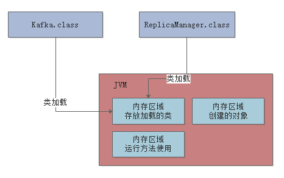

## 004、JVM中有哪些区域，分别都是用来干嘛的？
- 面试题目
- 到底什么是JVM内存区域划分？
- 存放类的方法区
- 执行代码指令用的程序计数器
- Java虚拟机栈
- Java堆内存
- 核心内存区域的全流程串讲
- 其他内存区域
- 总结

### 面试题背景引入
很多人想要到阿里、美团、京东等互联网大公司去面试，但是现在互联网大厂面试一般都必定会考核JVM相关的知识积累

所以在了解完了JVM的类加载机制之后，先一起来看看JVM的内存区域划分，这个基本上是互联网公司面试必问。

### 到底什么是JVM内存区域划分？
其实这个问题非常简单，JVM在运行我们写好的代码时，他是必须使用多块内存空间，不同的内存空间存放不同的数据，然后配合我们写的代码流程，才能让我们的系统运行起来。

举个最简单的例子，比如咱们现在知道了JVM会加载类到内存里来供后续运行，那么我问问大家，这些类加载到内存以后，放到哪儿去了呢？想过这个问题吗？

所以JVM里就必须有一块内存区域，用来存放我们写的那些类。

我们来看下面的图：


继续来看，我们的代码运行起来时，是不是需要执行我们写的一个一个的方法？

那么运行方法的时候，方法里面有很多变量之类的东西，是不是需要放在某个内存区域里？

接着如果我们写的代码里创建一些对象，这些对象是不是也需要内存空间来存放？

同样的，大家看下图：

这就是为什么JVM必须划分出来不同的内存区域，它是为了我们写好的代码在运行过程中根据需要来使用。

接下里一次看看JVM中有哪些区域。

### 存放类的方法区
这个方法区是在JDK1.8以前的版本里，代表JVM中的一块区域。

主要是放 从.class文件里加载进来的类，还会有一些类似常量池的东西放在这个区域里。

但是在JDK1.8以后，这块区域的名字改了，叫做Metaspace，可以认为是"元数据空间"这样的意思。当然这里主要是存放我们自己写的各种类相关的信息。

举个例子，还是跟我们之前说的那样，假设我们有一个Kafka.class类和 ReplicaManager.class类，类似下面的代码。

```java
public class Kafka{
    public static void main(){
        ReplicaManager replicaManager = new ReplicaManager();
    }
}
```
这两个类加载到JVM后，都会放在这个方法区中，大家看下图：


### 执行代码指令用的程序计数器
程序计数器： **就是用来记录当前执行的字节码指令的位置的**，也就是记录目前执行到了哪一条字节码指令。

我们通过一张图来说明：


大家都知道JVM是支持多个线程的，所以其实你写好的代码可能会开启多个线程并发执行不同的代码，所以就会有多个线程来并发执行不同的代码指令。

因此每个线程都会有自己的一个程序计数器，专门记录当前这个线程目前执行到了哪一条字节码指令了

下图更加清晰的展示了他们之间的关系。


### java虚拟机栈
JAVA虚拟机栈： **JVM必须有一块区域来保存每个方法内的局部变量等数据，这个区域就是JAVA虚拟机栈**

栈帧：**如果一个线程执行了一个方法，就会对这个方法调用创建对应的一个栈帧**，栈帧里就有这个方法的局部变量、操作数栈、动态链接、方法出口等东西，这里大家先不用全都理解，我们先关注局部变量。

java代码在执行的时候，一定是线程来执行某个方法中的代码。

哪怕就是下面的代码，也会有一个main线程来执行main()方法里的代码

在main线程执行main()方法的代码指令的时候，就会通过main线程对应的程序计数器记录自己执行的指令位置。
```java
public class Kafka{
    public static void main(){
        ReplicaManager replicaManager = new ReplicaManager();
        replicaManager.loadReplicasFromDisk();
    }
}
```
但是在方法里，我们经常会定义一些方法内的局部变量

比如在上面的main()方法里，其实就有一个“replicaManager”局部变量，他是引用一个ReplicaManager实例对象的，关于这个对象我们先别去管他，先来看方法和局部变量。

因此，JVM必须有一块区域是来保存每个方法内的局部变量等数据的，这个区域就是Java虚拟机栈

每个线程都有自己的Java虚拟机栈，比如这里的main线程就会有自己的一个Java虚拟机栈，用来存放自己执行的那些方法的局部变量。

如果线程执行了一个方法，就会对这个方法调用创建对应的一个栈帧

栈帧里就有这个方法的局部变量表 、操作数栈、动态链接、方法出口等东西，这里大家先不用全都理解，我们先关注局部变量。

比如main线程执行了main()方法，那么就会给这个main()方法创建一个栈帧，压入main线程的Java虚拟机栈

同时在main()方法的栈帧里，会存放对应的“replicaManager”局部变量

上述过程，如下图所示：


然后假设main线程继续执行ReplicaManager对象里的方法，比如下面这样，就在“loadReplicasFromDisk”方法里定义了一个局部变量：“hasFinishedLoad”
```java
public class ReplicaManager{
    public Boolean loadReplicasFromDisk(){
        Boolean hasFinishedLoad = false;
    }
}
```
那么main线程在执行上面的“loadReplicasFromDisk”方法时，就会为“loadReplicasFromDisk”方法创建一个栈帧压入线程自己的Java虚拟机栈里面去。

然后在栈帧的局部变量表里就会有“hasFinishedLoad”这个局部变量。

整个过程如下图所示：


接着如果“loadReplicasFromDisk”方法调用了另外一个“isLocalDataCorrupt()”方法 ，这个方法里也有自己的局部变量

比如下面这样的代码：
```java
public class ReplicaManager{
    public Boolean loadReplicasFromDisk(){
        Boolean hasFinishedLoad = false;
    }
    public Boolean isLocalDataCorrupt(){
        Boolean isCorrupt = false;
        return isCorrupt;
    }
}
```

那么这个时候会给“isLocalDataCorrupt”方法又创建一个栈帧，压入线程的Java虚拟机栈里。

而且“isLocalDataCorrupt”方法的栈帧的局部变量表里会有一个“isCorrupt”变量，这是“isLocalDataCorrupt”方法的局部变量

整个过程，如下图所示：


接着如果“isLocalDataCorrupt”方法执行完毕了，就会把“isLocalDataCorrupt”方法对应的栈帧从Java虚拟机栈里给出栈

然后如果“loadReplicasFromDisk”方法也执行完毕了，就会把“loadReplicasFromDisk”方法也从Java虚拟机栈里出栈。

上述就是JVM中的“Java虚拟机栈”这个组件的作用：调用执行任何方法时，都会给方法创建栈帧然后入栈

在栈帧里存放了这个方法对应的局部变量之类的数据，包括这个方法执行的其他相关的信息，方法执行完毕之后就出栈。

咱们再来看一个图，了解一下每个线程在执行代码时，除了程序计数器以外，还搭配了一个Java虚拟机栈内存区域来存放每个方法中的局部变量表。


### java堆内存
现在大家都知道了，main线程执行main()方法的时候，会有自己的程序计数器。

此外，还会依次把main()方法，loadReplicaFromDisk()方法，isLocalDataConrrupt()方法的栈帧压入Java虚拟机栈，存放每个方法的局部变量。

那么接着我们就得来看JVM另外一个非常关键的区域，就是Java堆内存，这里存放我们在代码中创建的各种对象。

比如下面代码：
```java
public class Kafka{
    public static void main(){
        ReplicaManager replicaManager = new ReplicaManager();
        replicaManager.loadReplicasFromDisk();
    }
}
```
上面的new ReplicaManager()这个代码就是创建了一个ReplicaManager类的对象实例，这个对象实例里面会包含一些数据，如下面的代码所示：

这个ReplicaManager类里的replicaCount就是属于这个对象实例的一个数据。

类似于ReplicaManager这样的对象实例，就会存放在Java堆内存里
```java
public class ReplicaManager{
    private long replicaCount;
    public Boolean loadReplicasFromDisk(){
        Boolean hasFinishedLoad = false;
        if(isLocalDataCorrupt()){}
    }
    public Boolean isLocalDataCorrupt(){
        Boolean isCorrupt = false;
        return isCorrupt;
    }
}
```
Java堆内存区域里会放入类似ReplicaManager的对象，然后我们因为在main方法里创建了ReplicaManager对象，那么在线程执行执行main方法代码的时候，就会在main方法对应的栈帧的局部变量表里，让一个引用类型的replicaManager局部变量来存放ReplicaManager对象的地址。

相当于你可以认为局部变量表里的replicaManager指向了Java堆内存里的ReplicaManager对象


### 核心内存区域的全流程串讲
其实我们把上面的那个图和下面的这个总的大图一起串起来看看，还有配合整体的代码，我们来捋一下整体的流程，大家就会觉得很清晰。


```java
public class Kafka{
    public static void main(){
        ReplicaManager replicaManager = new ReplicaManager();
        replicaManager.loadReplicasFromDisk();
    }
}

public class ReplicaManager{
    private long replicaCount;
    public Boolean loadReplicasFromDisk(){
        Boolean hasFinishedLoad = false;
        if(isLocalDataCorrupt()){}
    }
    public Boolean isLocalDataCorrupt(){
        Boolean isCorrupt = false;
        return isCorrupt;
    }
}
```
- 首先，你的JVM进程会启动，就会先加载你的Kafka类到内存里。然后有一个main线程，开始执行你的Kafka中的main()方法。
- main线程是关联了一个程序计数器，那么他执行到那一行指令，就会记录在这里。
- 其次，就是main线程在执行main()方法的时候，会在main线程关联的Java虚拟机栈里，压入一个main()方法的栈帧。
- 接着就会发现需要创建一个ReplicaManager类的实例对象，此时会加载ReplicaManager类到内存里来。
- 然后会创建一个ReplicaManager的对象实例分配在Java堆内存里，并且在main()方法的栈帧里的局部变量表引入一个replicaManager变量，让他引用ReplicaManager对象在Java堆内存中的地址。
- 接着，main线程开始执行ReplicaManager对象中的方法，会一次把自己执行到的方法对应的栈帧压入自己的Java虚拟机栈执行完方法之后再把方法对应的栈帧从java虚拟机里出栈。

### 其他区域内存
比如下面这样的：public native int hashCode();

在调用这种native方法的时候，就会有线程对应的本地方法栈，这个里面也是跟Java虚拟机栈类似的，也是存放各种native方法的局部变量表之类的信息。

还有一个区域，是不属于JVM的，通过NIO中的allocateDirect这种API，可以在Java堆外分配内存空间。然后，通过Java虚拟机里的DirectByteBuffer来引用和操作堆外内存空间。

### 总结
大家需要重点去关注方法区、程序计数器、Java虚拟机栈和Java堆这些内存区域的作用，和我们配套的图以及代码结合起来去理解。


