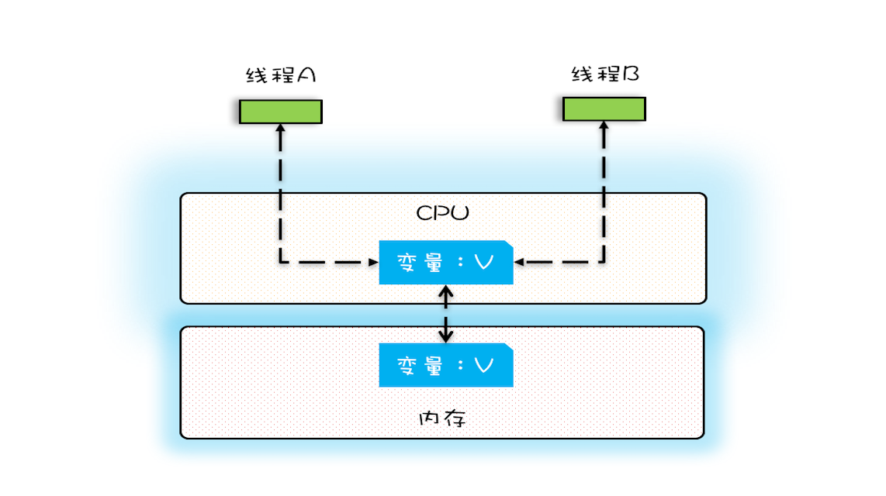

# 标题：可见性、原子性和有序性问题：并发编程Bug的源头
# 目录
## 并发程序幕后的故事
## 源头之一：缓存导致的可见性问题
## 源头之二：线程切换带来的原子性问题
## 源头之三：编译优化带来的有序性问题
## 总结


## 并发程序幕后的故事
这些年，我们的CPU、内存、IO设备都在不断的迭代，不断吵着更快的方向努力。但是，在这个快速发展的过程中， **有一个核心的矛盾一直存在，就是这三者的速度差异。** CPU和内存的速度差异可以形象的描述为：CPU是天上一天，内存是地上一年（假设CPU执行一条普通指令需要一天，那么CPU读写内存得等待一年的时间）。内存和IO设备的速度差异就更大了。

根据木桶理论，程序整体性能取决于最慢的操作——读写I/O设备，也就是说单方面提高CPU性能是无效的。

为了合理利用CPU的高性能，平衡这三着的差异需要：

1. CPU增加了缓存，以均衡与内存的速度差异：
2. 操作系统增加了进程、线程、以分时复用CPU，进而均衡CPU与I/O设备的速度差异；
3. 编译程序优化指令执行顺序，使得缓存能够得到更加合理的利用；

## 源头之一：CPU缓存导致的可见性问题
在单核时代，所有的线程都是在一颗 CPU 上执行，CPU 缓存与内存的数据一致性容易解决。因为所有线程都是操作同一个 CPU 的缓存，一个线程对缓存的写，对另外一个线程来说一定是可见的。例如在下面的图中，线程 A 和线程 B 都是操作同一个 CPU 里面的缓存，所以线程 A 更新了变量 V 的值，那么线程 B 之后再访问变量 V，得到的一定是 V 的最新值（线程 A 写过的值）。



一个线程对共享变量的修改，另外一个线程能够立刻看到，我们称为 **可见性**。

在多核时代，每颗CPU都有自己的缓存，这时CPU缓存与内存数据一致性就没那么容易解决了，当多个线程再不同的CPU上执行时，这些线程操作的是不同的CPU缓存，比如下图中，线程A操作的是CPU-1上的缓存，而线程B操作的是CPU-2上的缓存。很明显，这个时候线程A对变量V的操作，对线程B而言就不具备可见性了。


## 源头之二：线程切换带来的原子性问题
操作系统允许某个进程执行一小段时间，例如50毫秒，过了50毫秒操作系统就会重新选择一个进程来执行（w我们称之为"任务切换"），这个50毫秒称为" **时间片** "


在一个时间片内，如果一个进程进行一个 IO 操作，例如读个文件，这个时候该进程可以把自己标记为“休眠状态”并出让 CPU 的使用权，待文件读进内存，操作系统会把这个休眠的进程唤醒，唤醒后的进程就有机会重新获得 CPU 的使用权了。

这里的进程在等待 IO 时之所以会释放 CPU 使用权，是为了让 CPU 在这段等待时间里可以做别的事情，这样一来 CPU 的使用率就上来了；此外，如果这时有另外一个进程也读文件，读文件的操作就会排队，磁盘驱动在完成一个进程的读操作后，发现有排队的任务，就会立即启动下一个读操作，这样 IO 的使用率也上来了。

是不是很简单的逻辑？但是，虽然看似简单，支持多进程分时复用在操作系统的发展史上却具有里程碑意义，Unix 就是因为解决了这个问题而名噪天下的。

早期的操作系统基于进程来调度CPU，不同进程间是不共享内存空间的，所以进程要做的任务切换就要切换内存映射地址，而一个进程创建的所有线程，都是共享一个内存空间的，所以线程做任务切换的成本就很低了。现代的操作系统都基于更轻量的线程来调度，现在我们提到的"任务切换"都是指"线程切换"。

Java 并发程序都是基于多线程的，自然也会涉及到任务切换，也许你想不到，任务切换竟然也是并发编程里诡异 Bug 的源头之一。任务切换的时机大多数是在时间片结束的时候，我们现在基本都使用高级语言编程，高级语言里一条语句往往需要多条 CPU 指令完成，例如上面代码中的count += 1，至少需要三条 CPU 指令。

- 指令 1：首先，需要把变量 count 从内存加载到 CPU 的寄存器；
- 指令 2：之后，在寄存器中执行 +1 操作；
- 指令 3：最后，将结果写入内存（缓存机制导致可能写入的是 CPU 缓存而不是内存）。

操作系统做任务切换，可以发生在任何一条CPU 指令执行完，是的，是 CPU指令，而不是高级语言里的一条语句。对于上面的三条指令来说，我们假设 count=0，如果线程 A 在指令 1 执行完后做线程切换，线程 A 和线程 B 按照下图的序列执行，那么我们会发现两个线程都执行了 count+=1 的操作，但是得到的结果不是我们期望的 2，而是 1。


我们潜意识里面觉得 count+=1 这个操作是一个不可分割的整体，就像一个原子一样，线程的切换可以发生在 count+=1 之前，也可以发生在 count+=1 之后，但就是不会发生在中间。我们把一个或者多个操作在 CPU 执行的过程中不被中断的特性称为原子性。CPU 能保证的原子操作是 CPU 指令级别的，而不是高级语言的操作符，这是违背我们直觉的地方。因此，很多时候我们需要在高级语言层面保证操作的原子性。

## 源头之三：编译优化带来的有序性问题
编译器为了优化性能，有时候会改变程序中语句的先后顺序，例如程序中："a=6;b=7;"编译器优化后可能变成"b=7;a=6",在这个例子中，编译器调整了语句的顺序，但是不影响程序的最终结果。不过有时候编译器及解释器的优化可能导致意想不到的Bug。

在Java领域一个经典的案例就是利用双重检查创建单例对象，例如下面的代码：在获取实例getInstance()方法中，我们首先判断instance是否为空，如果为空，则锁定Singleton.class并再次检查Instacne是否为空，如果为空则创建Singleton的一个实例。

```java
public class Singleton{
    static Singleton instance;
    static Singleton getInstance(){
        if(instance == null){
            synchronized(Singlton.class){
                if(instance == null){
                    instance = new Singleton();
                }
            }
        }
        return instance;
    }
}
```
假设有两个线程A、B同时调用getInstance()方法，他们会同时发现instance == null; 于是同时对Singleton.class加锁，此时JVM保证只有一个线程能够加锁成功(假设线程A),另外一个线程则会处于等待状态(假设线程B);线程A会创建一个Singleton实例，之后释放锁，释放锁后，线程B被唤醒，线程B再次尝试加锁，此时是可以加锁成功的，加锁成功后，线程B检查instance == null 时会发现，已经创建过Singleton实例了，所以线程B不会再创建一个Singleton实例。

这看上去一切都很完美，无懈可击，但实际上这个 getInstance() 方法并不完美。问题出在哪里呢？出在 new 操作上，我们以为的 new 操作应该是：

1. 分配一块内存M;
2. 在内存M上初始化Singleton对象
3. 然后M的地址赋值给instance变量；

但是实际上优化后的执行路径却是这样的：

1. 分配一块内存M；
2. 将M的地址赋值给instance变量；
3. 在内存M上初始化Singleton对象

优化后会导致什么问题呢？
我们假设线程A先执行getInstance()方法，当执行完指令2（将M的地址赋值给instance变量）时恰好发生了线程切换，切换到了线程B上；如果此时线程B也执行getInstance()方法，那么线程B在执行第一个判断的时候就会发现instance ！=null，所以直接返回instance，而此时的instance是没有初始化过的，如果我们这个时候访问instance的成员变量就可能触发空指针异常。


## 总结
要写好并发程序，首先要知道并发程序的问题在哪里，只有确定了“靶子”，才有可能把问题解决，毕竟所有的解决方案都是针对问题的。并发程序经常出现的诡异问题看上去非常无厘头，但是深究的话，无外乎就是直觉欺骗了我们，只要我们能够深刻理解可见性、原子性、有序性在并发场景下的原理，很多并发 Bug 都是可以理解、可以诊断的。

在介绍可见性、原子性、有序性的时候，特意提到缓存导致的可见性问题，线程切换带来的原子性问题，编译优化带来的有序性问题，其实缓存、线程、编译优化的目的和我们写并发程序的目的是相同的，都是提高程序性能。但是技术在解决一个问题的同时，必然会带来另外一个问题，所以在采用一项技术的同时，一定要清楚它带来的问题是什么，以及如何规避。


