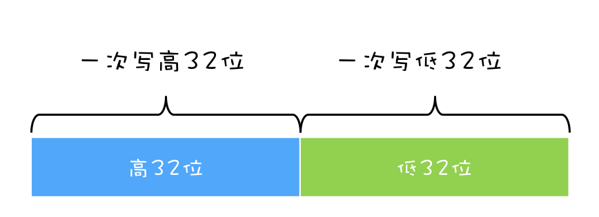
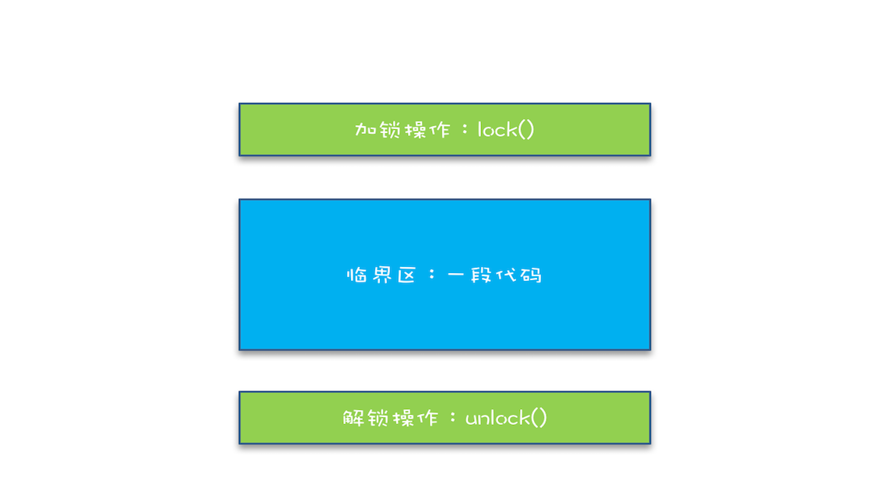
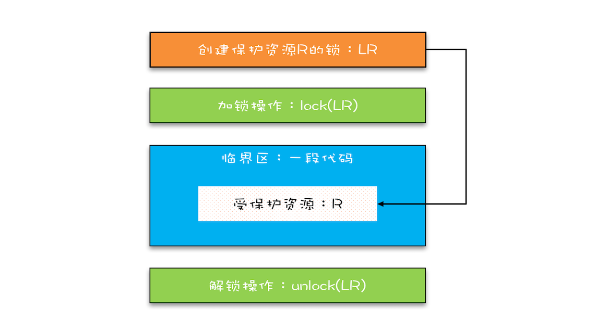
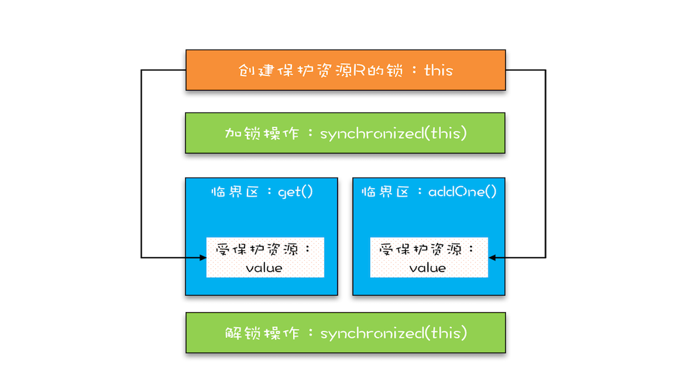

# 题目：03 | 互斥锁（上）：解决原子性问题
## 原子性问题如何解决？
## 简单锁模型
## 改进后的锁模型
## Java语言提供的锁技术：synchronized
## synchronized解决count+=1问题
## 锁和受保护资源的关系
## 总结


我们知道一个或者多个操作在CPU上执行的过程中不被中断的特性，称为"原子性"。理解这个特性有助于你分析并发编程Bug出现的原因。例如利用它可以分析出 long 型变量在 32 位机器上读写可能出现的诡异 Bug，明明已经把变量成功写入内存，重新读出来却不是自己写入的。

## 如何解决原子性问题？
你已经知道，原子性问题的源头是 **线程切换**，如果能够禁用线程切换那不就能解决这个问题了吗？而操作系统做线程切换是依赖于CPU中断的，所以禁止CPU中断就能禁止线程切换。

在早期单核 CPU 时代，这个方案的确是可行的，而且也有很多应用案例，但是并不适合多核场景。这里我们以 32 位 CPU 上执行 long 型变量的写操作为例来说明这个问题，long 型变量是 64 位，在 32 位 CPU 上执行写操作会被拆分成两次写操作（写高 32 位和写低 32 位，如下图所示）。



在单核CPU场景下，同一时刻只有一个线程执行，禁止CPU中断，意味着操作系统不会重新调度线程，也就是禁止了线程切换，获得CPU使用权的线程不间断地执行，所以两次写操作一定是：要么都被执行，要么都没有被执行，具有原子性。

但是在多核场景下，同一时刻，有可能有两个线程同时在执行，一个线程执行在 CPU-1 上，一个线程执行在 CPU-2 上，此时禁止 CPU 中断，只能保证 CPU 上的线程连续执行，并不能保证同一时刻只有一个线程执行，如果这两个线程同时写 long 型变量高 32 位的话，那就有可能出现我们开头提及的诡异 Bug 了。

**同一时刻只有一个线程执行**这个条件非常重要，我们称之为 **互斥**。如我们能够保证对共享变量的修改是互斥的，那么，无论单核CPU还是多核CPU，就能够保证原子性了。

## 简易锁模型
当谈到互斥，相信聪明的你一定想到了那个杀手级解决方案：锁。同时大脑中还会出现以下模型：



我们把一段需要互斥执行的代码称为 **临界区**。线程在进入临界区之前，首先尝试加锁 lock()，如果成功，则进入临界区，此时我们称这个线程持有锁；否则呢就等待，直到持有锁的线程解锁；持有锁的线程执行完临界区的代码后，执行解锁 unlock()。

这个过程非常像办公室里高峰期抢占坑位，每个人都是进坑锁门（加锁），出坑开门（解锁），如厕这个事就是临界区。很长时间里，我也是这么理解的。这样理解本身没有问题，但却很容易让我们忽视两个非常非常重要的点：

**我们锁的是什么？我们保护的又是什么？**

## 改进后的锁模型
我们知道在现实世界里，锁和锁要保护的资源是有对应关系的，比如你用你家的锁保护你家的东西，我用我家的锁保护我家的东西。在并发编程世界里，锁和资源也应该有这个关系，但这个关系在我们上面的模型中是没有体现的，所以我们需要完善一下我们的模型。



首先，我们要把临界区要保护的资源标注出来，如图中临界区里增加了一个元素：受保护的资源 R；其次，我们要保护资源 R 就得为它创建一把锁 LR；最后，针对这把锁 LR，我们还需在进出临界区时添上加锁操作和解锁操作。另外，在锁 LR 和受保护资源之间，我特地用一条线做了关联，这个关联关系非常重要。很多并发 Bug 的出现都是因为把它忽略了，然后就出现了类似锁自家门来保护他家资产的事情，这样的 Bug 非常不好诊断，因为潜意识里我们认为已经正确加锁了。

## Java语言提供的锁技术：Synchronized
锁是一种通用的技术方案，Java 语言提供的 synchronized 关键字，就是锁的一种实现。synchronized 关键字可以用来修饰方法，也可以用来修饰代码块，它的使用示例基本上都是下面这个样子：

```java
class X {
  // 修饰非静态方法
  synchronized void foo() {
    // 临界区
  }
  // 修饰静态方法
  synchronized static void bar() {
    // 临界区
  }
  // 修饰代码块
  Object obj = new Object()；
  void baz() {
    synchronized(obj) {
      // 临界区
    }
  }
}
```

完之后你可能会觉得有点奇怪，这个和我们上面提到的模型有点对不上号啊，加锁 lock() 和解锁 unlock() 在哪里呢？其实这两个操作都是有的，只是这两个操作是被 Java 默默加上的，Java 编译器会在 synchronized 修饰的方法或代码块前后自动加上加锁 lock() 和解锁 unlock()，这样做的好处就是加锁 lock() 和解锁 unlock() 一定是成对出现的，毕竟忘记解锁 unlock() 可是个致命的 Bug（意味着其他线程只能死等下去了）。

那 synchronized 里的加锁 lock() 和解锁 unlock() 锁定的对象在哪里呢？上面的代码我们看到只有修饰代码块的时候，锁定了一个 obj 对象，那修饰方法的时候锁定的是什么呢？这个也是 Java 的一条隐式规则：

>当修饰静态方法的时候，锁定的是当前类的 Class 对象，在上面的例子中就是 Class X；
>当修饰非静态方法的时候，锁定的是当前实例对象 this。

对于上面的例子，synchronized 修饰静态方法相当于:
```java
class X {
  // 修饰静态方法
  synchronized(X.class) static void bar() {
    // 临界区
  }
}
```
修饰非静态方法，相当于：
```java
class X {
  // 修饰非静态方法
  synchronized(this) void foo() {
    // 临界区
  }
}
```
### 用 synchronized 解决 count+=1 问题
相信你一定记得我们前面文章中提到过的 count+=1 存在的并发问题，现在我们可以尝试用 synchronized 来小试牛刀一把，代码如下所示。SafeCalc 这个类有两个方法：一个是 get() 方法，用来获得 value 的值；另一个是 addOne() 方法，用来给 value 加 1，并且 addOne() 方法我们用 synchronized 修饰。那么我们使用的这两个方法有没有并发问题呢？
```java
class SafeCalc {
  long value = 0L;
  long get() {
    return value;
  }
  synchronized void addOne() {
    value += 1;
  }
}
```

我们先来看看 addOne() 方法，首先可以肯定，被 synchronized 修饰后，无论是单核 CPU 还是多核 CPU，只有一个线程能够执行 addOne() 方法，所以一定能保证原子操作，那是否有可见性问题呢？要回答这问题，就要重温一下上一篇文章中提到的管程中锁的规则。

管程中锁的规则：对一个锁的解锁 Happens-Before 于后续对这个锁的加锁。

管程，就是我们这里的 synchronized（至于为什么叫管程，我们后面介绍），我们知道 synchronized 修饰的临界区是互斥的，也就是说同一时刻只有一个线程执行临界区的代码；而所谓“对一个锁解锁 Happens-Before 后续对这个锁的加锁”，指的是前一个线程的解锁操作对后一个线程的加锁操作可见，综合 Happens-Before 的传递性原则，我们就能得出前一个线程在临界区修改的共享变量（该操作在解锁之前），对后续进入临界区（该操作在加锁之后）的线程是可见的。

按照这个规则，如果多个线程同时执行 addOne() 方法，可见性是可以保证的，也就说如果有 1000 个线程执行 addOne() 方法，最终结果一定是 value 的值增加了 1000。看到这个结果，我们长出一口气，问题终于解决了。

但也许，你一不小心就忽视了 get() 方法。执行 addOne() 方法后，value 的值对 get() 方法是可见的吗？这个可见性是没法保证的。管程中锁的规则，是只保证后续对这个锁的加锁的可见性，而 get() 方法并没有加锁操作，所以可见性没法保证。那如何解决呢？很简单，就是 get() 方法也 synchronized 一下，完整的代码如下所示。

```java
class SafeCalc {
  long value = 0L;
  synchronized long get() {
    return value;
  }
  synchronized void addOne() {
    value += 1;
  }
}
```

上面的代码转换为我们提到的锁模型，就是下面图示这个样子。get() 方法和 addOne() 方法都需要访问 value 这个受保护的资源，这个资源用 this 这把锁来保护。线程要进入临界区 get() 和 addOne()，必须先获得 this 这把锁，这样 get() 和 addOne() 也是互斥的。



这个模型更像现实世界里面球赛门票的管理，一个座位只允许一个人使用，这个座位就是“受保护资源”，球场的入口就是 Java 类里的方法，而门票就是用来保护资源的“锁”，Java 里的检票工作是由 synchronized 解决的。

##总结
互斥锁，在并发领域的知名度极高，只要有了并发问题，大家首先容易想到的就是加锁，因为大家都知道，加锁能够保证执行临界区代码的互斥性。这样理解虽然正确，但是却不能够指导你真正用好互斥锁。临界区的代码是操作受保护资源的路径，类似于球场的入口，入口一定要检票，也就是要加锁，但不是随便一把锁都能有效。所以必须深入分析锁定的对象和受保护资源的关系，综合考虑受保护资源的访问路径，多方面考量才能用好互斥锁。

synchronized 是 Java 在语言层面提供的互斥原语，其实 Java 里面还有很多其他类型的锁，但作为互斥锁，原理都是相通的：锁，一定有一个要锁定的对象，至于这个锁定的对象要保护的资源以及在哪里加锁 / 解锁，就属于设计层面的事情了。


