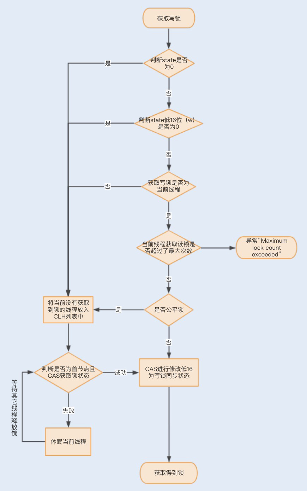
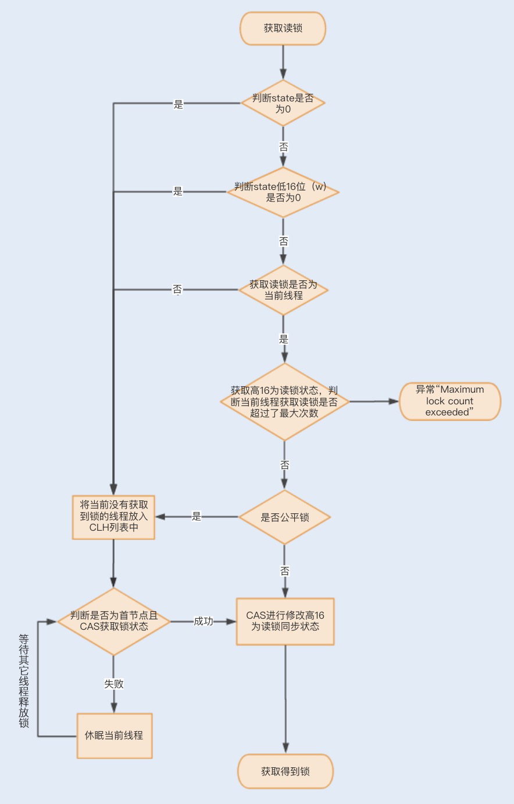

##
## Lock锁的实现原理
## Lock锁的优化


## Lock锁与Synchronize锁的对比
相对于需要JVM隐式获取和释放锁的Synchronized同步锁，Lock同步锁()以下简称Lock锁
需要的是显示获取和释放锁，这就是为了获取喝释放锁提供了更多的灵活性。

**<font face="微软雅黑" size=3 color=#FF0000 >Lock锁基本操作是通过乐观锁来实现的，但是由于Lock锁也会阻塞时被挂起，他依然属于悲观锁</font>**

我们可以通过一张图简单的对比下两个同步锁：了解下各自的特点：


从性能方面来说，在并发量不高，竞争不激烈的情况下，Synchronized同步锁由于具有分级锁的优势，性能上与Lock锁差不多；但在高负载、高并发的情况下，synchronized同步锁由于竞争激烈会升级成重量级锁，性能则没有Lock锁稳定。

## Lock锁的实现原理
Lock锁是基于Java实现的锁，Lock是一个接口类，常用的实现类有ReentrantLock、ReentrantReadWriteLock（RRW）,他们都是依赖于AbstractQueuedSynchronizer（AQS）类实现的。

AQS类结构中包含一个基于链表实现的等待队列（CLH队列），用于存储所有阻塞的线程，AQS中还有一个state变量，该变量对ReentrantLock来说表示加锁状态。

该队列和状态的操作均通过CAS操作实现，我们可以通过一张图来看下整个获取锁的流程。


### 锁分离优化Lock同步锁
虽然Lock锁的性能稳定，但也并不是所有的场景下都默认使用ReentrantLock独占锁来实现线程同步。

在大部分业务场景中，读业务操作要远远大于写业务操作。而在多线程编程中，读操作并不会修改共享资源的数据，如果多个线程仅仅是读取共享资源，那么这种情况下其实没有必要对资源进行加锁。如果使用互斥锁，反倒会影响业务的并发性能，那么在这种场景下，有没有什么办法可以优化下锁的实现方式呢？

#### 1、读写锁ReentrantReadWriteLock
针对这种读多写少的场景，java提供了另外一个实现Lock接口的读写锁RRW。我们已知的ReentrantLock是一个独占锁，同一时间只允许一个线程访问。而RRW允许多个线程同时访问，但不允许写线程和读线程、写线程和写线程同时访问。读写锁内部维护了两个锁，一个是用于读操作的ReadLock,一个是用于写操作的WriteLock。

**<font color=red zise =4 face="微软雅黑">那读写锁又是如何实现锁分离来保证共享资源的原子性？</font>**

RRW也是基于AQS实现的，它的自定义同步器（继承AQS）需要在同步状态state上维护多个读线程和一个写线程的状态，该状态的设计称为实现读写锁的关键。RRW很好地使用了高低位了，来实现一个整型控制两个状态的功能，读写锁将变量切分为了连个部分，高16位表示读，低16位表示写。

**一个线程尝试获取锁时**，会判断同步状态是否为0。如果state等于0，说明暂时没有其它线程获取锁，则线程会根据公平锁非公平锁情况，若是公平锁，则进入CLH阻塞队列进行等待，否则，会立即CAS获取读锁；如果state不等于0，这说明其他线程获取了锁。

此时再判断同步状态state低16位(W)是否为0，如果W为0，则说明其它线程获取了读锁，此时进入CLH队列进行阻塞等待；如果W不为0，这说明其它线程获取了写锁，此时要判断获取了写锁的是不是当前线程，若不是就进入CLH队列进行阻塞等待；若是，就应该判断当前线程获取写锁是否超过了最大次数，若超过，抛异常，反之更新同步状态。



**一个线程尝试获取读锁时**，同样会先判断同步状态state是否为0。如果state等于0，说明暂时没有其它线程获取锁，若果时是公平锁，需要阻塞，则进入CLH队列进行阻塞等待；如果是非公平锁，不需要阻塞，则CAS更新同步状态为读状态。

如果state不等于0，会判断同步状态低16位，如果存在写锁，则获取读锁失败，进入CLH阻塞队列；反之，判断当前线程是否应该被阻塞，如果不应该阻塞则尝试CAS同步状态，获取成功更新同步锁为读状态。



通过一个求平方的例子，感受下RRW的实现：
```java
public class TestRTTLock{
    private double x,y;
    private ReentrantReadWriteLock lock = new ReentrantReadWriteLock();
    //读锁
    private Lock readLock = lock.readLock();
    private Lock writeLock = lock.writeLock();

    public double read(){
        //获取读锁
        readLock.lock();
        try{
            return Math.sqrt(x*x + y*y);
        }finally{
            //释放读锁
            readLock.unlock();
        }
    }

    public void move(double deltaX,double deltaY){
        //获取写锁
        writeLock.lock();
        try{
            x+=deltaX;
            y+=deltaY;
        }finally{
            //释放写锁
            writeLock.unlock();
        }
    }
}
```

#### 2、读写锁再优化之StampedLock
RRW被很好地应用在了读大于写的并发场景中，然而PRW在性能上还有可提升的空间。在读取很多、写入很少的情况下，RPW会使写入线程遭遇饥饿问题，也就是说写入线程会迟迟无法竞争到锁而一直处于等待状态。

在 JDK1.8 中，Java 提供了 StampedLock 类解决了这个问题。StampedLock 不是基于 AQS 实现的，但实现的原理和 AQS 是一样的，都是基于队列和锁状态实现的。与 RRW 不一样的是，StampedLock 控制锁有三种模式: 写、悲观读以及乐观读，并且 StampedLock 在获取锁时会返回一个票据 stamp，获取的 stamp 除了在释放锁时需要校验，在乐观读模式下，stamp 还会作为读取共享资源后的二次校验，后面我会讲解 stamp 的工作原理。

```java
//StampedLock
public class Point{
    private double x,y;
    private final StampedLock s1 = new StampedLock();

    void move(double deltaX, double deltaY){
        //获取写锁
        long stamp = s1.writeLock();
        try{
            x+=deltaX;
            y+=deltaY;
        }finally{
            //释放写锁
            s1.unlockWrite(stamp);
        }
    }

    double distanceFormOrign(){
        //乐观读操作
        long stamp = s1.tryOptimisticRead();
        //拷贝变量
        double currentX = x, currentY = y;
        //判断读期间是否有写操作
        if(!s1.validate(stamp)){
            //升级为悲观读
            stamp = s1.readLock();
            try{
                currentX = x;
                currentY = y;
            }finally{
                s1.unlockRead(stamp);
            }
        }
        return Math.sqrt(currentX*currentX+ currentY*currentY);
    }
}
```

该锁成功后会返回一个 stamp 票据变量，用来表示该锁的版本，当释放该锁的时候，需要 unlockWrite 并传递参数 stamp。

接下来就是一个读线程获取锁的过程。首先线程会通过乐观锁 tryOptimisticRead 操作获取票据 stamp ，如果当前没有线程持有写锁，则返回一个非 0 的 stamp 版本信息。线程获取该 stamp 后，将会拷贝一份共享资源到方法栈，在这之前具体的操作都是基于方法栈的拷贝数据。

之后方法还需要调用 validate，验证之前调用 tryOptimisticRead 返回的 stamp 在当前是否有其它线程持有了写锁，如果是，那么 validate 会返回 0，升级为悲观锁；否则就可以使用该 stamp 版本的锁对数据进行操作。

相比于 RRW，StampedLock 获取读锁只是使用与或操作进行检验，不涉及 CAS 操作，即使第一次乐观锁获取失败，也会马上升级至悲观锁，这样就可以避免一直进行 CAS 操作带来的 CPU 占用性能的问题，因此 StampedLock 的效率更高。

## 总结
不管使用Syncrhonized同步锁还是Lock同步锁，只要存在锁竞争就会产生线程阻塞，从而导致线程之间的频繁切换，最终增加性能消耗，因此 **降低锁竞争，就成为了优化锁的关键。**
在synchonized中我们可以通过减小锁粒度、减少锁占用时间来降低锁的竞争。
可以利用Lock锁的灵活性，通过锁分离的方式来降低锁竞争


虽然StampedLock有其优点，但是却没有被广泛应用。原因在于

- StampLock不支持重入，不支持条件变量，线程被中断时可能导致CPU暴涨
- 在一些需要重入的代码中使用StampedLock,会导致死锁，饿死情况出现。
- StampedLock在写多读少的时候性能会很差


<font color=red size=3>gray</font>
<font color=red size=5>gray</font>
<font color=red size=1>gray</font>
<font face="微软雅黑" size=12 color=#FF0000 >微软雅黑字体</font>