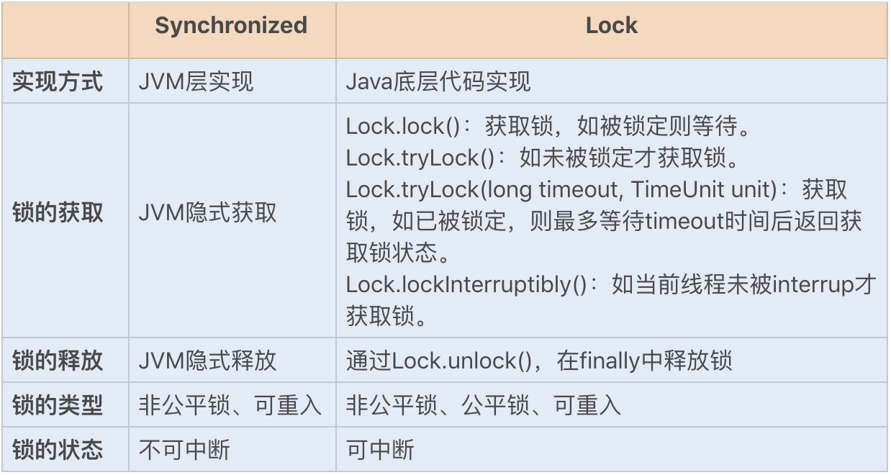

##
## Lock锁的实现原理
## Lock锁的优化

## Lock锁与Synchronize锁的对比
相对于需要JVM隐式获取和释放锁的Synchronized同步锁，Lock同步锁()以下简称Lock锁
需要的是显示获取和释放锁，这就是为了获取喝释放锁提供了更多的灵活性。

**Lock锁基本操作是通过乐观锁来实现的，但是由于Lock锁也会阻塞时被挂起，他依然属于悲观锁**

我们可以通过一张图简单的对比下两个同步锁：了解下各自的特点：

$\color{red}{红色字}$