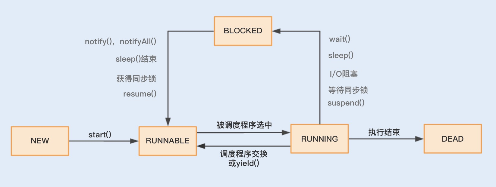

# 题目：15、多线程调优（上）：哪些操作导致了上下文切换
- 初始上下文切换
- 多线程上下文切换诱因
- 发现上下文切换
- 总结

记得我刚入职上家公司的时候，恰好赶上了一次抢购活动。这是系统重构上线后经历的第一次高并发考验，如期出现了大量超时报警，不过比我预料的要好一点，起码没有挂掉重启。

通过工具分析，我发现 cs（上下文切换每秒次数）指标已经接近了 60w ，平时的话最高 5w。再通过日志分析，我发现了大量带有 wait() 的 Exception，由此初步怀疑是大量线程处理不及时导致的，进一步锁定问题是连接池大小设置不合理。后来我就模拟了生产环境配置，对连接数压测进行调节，降低最大线程数，最后系统的性能就上去了。

从实践中总结经验，我知道了在并发程序中，并不是启动更多的线程就能让程序最大限度地并发执行。线程数量设置太小，会导致程序不能充分地利用系统资源；线程数量设置太大，又可能带来资源的过度竞争，导致上下文切换带来额外的系统开销。

## 初识上下文切换
首先得明白，上下文切换到底是什么。

其实在单个处理器的时期，操作系统就能处理多线程并发任务。处理器给每个线程分配 CPU 时间片（Time Slice），线程在分配获得的时间片内执行任务。

CPU 时间片是 CPU 分配给每个线程执行的时间段，一般为几十毫秒。在这么短的时间内线程互相切换，我们根本感觉不到，所以看上去就好像是同时进行的一样。

**时间片决定了一个线程可以连续占用处理器运行得时长**，当一个线程得时间片用完了，或者因自身得原因被迫暂停运行了，这个时候，另外一个线程（可以是同一个线程或者其他进程得线程）就会被操作系统选中，来占用处理器。 **这种一个线程被暂停剥夺使用权，另外一个线程被选中开始或者继续运行得过程就叫做上下文切换（Context Switch）**

具体来说，一个线程被剥夺处理器的使用权而被暂停运行，就是“切出”；一个线程被选中占用处理器开始或者继续运行，就是“切入”。 ***在这种切出切入的过程中，操作系统需要保存和恢复相应的进度信息，这个进度信息就是"上下文"了**

那上下文都包括哪些内容呢？： **具体来说，它包括了寄存器的存储内容以及程序计数器存储的指令内容。** CPU 寄存器负责存储已经、正在和将要执行的任务，程序计数器负责存储 CPU 正在执行的指令位置以及即将执行的下一条指令的位置。

## 多线程上下文切换的诱因
在操作系统中，上下文切换的类型还可以分为进程间的上下文切换和线程间的上下文切换。而在多线程编程中，我们主要面对的就是线程间的上下文切换导致的性能问题，下面我们就重点看看究竟是什么原因导致了多线程的上下文切换。开始之前，我们先看下多线程的生命周期状态。



结合图示知道：线程主要有"新建(NEW)"、就绪（Runnable）、运行（Running）、阻塞（Blocked）、死亡(Dead)五种状态。

在这个运行过程中，线程由Runnable转为非Runnable的过程就是线程上下文切换。

- 当一个线程由Running状态转为Blocked状态，再由Blocked状态转为Runnable，然后再被调度器选中执行，就是一个上下文切换的过程

当一个线程从 RUNNING 状态转为 BLOCKED 状态时，我们称为一个线程的暂停，线程暂停被切出之后，操作系统会保存相应的上下文，以便这个线程稍后再次进入 RUNNABLE 状态时能够在之前执行进度的基础上继续执行。

当一个线程从 BLOCKED 状态进入到 RUNNABLE 状态时，我们称为一个线程的唤醒，此时线程将获取上次保存的上下文继续完成执行。

> 通过线程的运行状态以及状态间的相互切换，我们可以了解到，多线程的上下文切换实际上就是由多线程两个运行状态的相互切换导致

那么在线程运行时，线程状态由Running转为Blocked或者由Blocked转为Runnable,这又是什么诱发的呢？

- 一种是程序本身触发的切换，这种我们称为自发性上下文切换，
- 另一种是由系统或者虚拟机优化非自发性上下文切换

自发性上上下文切换指线程由Java程序调用导致切出，在多线程中，执行调用以下方法或关键字，常常就会导致自发性上下文切换。

- sleep()
- wait()
- yield()
- join()
- park()
- synchronized()
- lock()

非自发性上下文切换指线程由于调度器的原因被迫切出。常见的有：线程被分配的时间片用完，虚拟机垃圾回收导致或者执行优先级的问题导致。

这里重点说下 **“虚拟机垃圾回收为什么会导致上下文切换”。**在 Java 虚拟机中，对象的内存都是由虚拟机中的堆分配的，在程序运行过程中，新的对象将不断被创建，如果旧的对象使用后不进行回收，堆内存将很快被耗尽。Java 虚拟机提供了一种回收机制，对创建后不再使用的对象进行回收，从而保证堆内存的可持续性分配。而这种垃圾回收机制的使用有可能会导致 stop-the-world 事件的发生，这其实就是一种线程暂停行为。

## 发现上下文切换
我们总说上下文切换会带来系统开销，那它带来的性能问题是不是真有这么糟糕呢？我们又该怎么去监测到上下文切换？上下文切换到底开销在哪些环节？接下来我将给出一段代码，来对比串联执行和并发执行的速度，然后一一解答这些问题。

```java
public class DemoApplication {
    public static void main(String[] args) {
        //运行多线程
        MutiThreadTester test1 = new MutiThreadTester();
        test1.Start();

        //运行单个线程
        SerialTester test2 = new SerialTester();
        test2.Start();
    }
    static class MutiThreadTester extends ThreadContextSwitchTester{

        @Override
        public void Start() {
            long start = System.currentTimeMillis();
            MyRunnable myRunnable = new MyRunnable();
            Thread[] threads = new Thread[4];

            //创建多个线程
            for(int i=0;i<4;i++){
                threads[i] = new Thread(myRunnable);
                threads[i].start();
            }

            for(int i=0;i<4;i++){
                try {
                    //等待一起运行完
                    threads[i].join();
                } catch (InterruptedException e) {
                    e.printStackTrace();
                }
            }

            long end = System.currentTimeMillis();
            System.out.println("multi thread exce time: " + (end - start) + "s");
            System.out.println("counter: " + counter);
        }

        class MyRunnable implements Runnable{

            @Override
            public void run() {
                while(counter<100000000){
                    synchronized (this){
                        if(counter<100000000){
                            increaseCounter();
                        }
                    }
                }
            }
        }
    }

    static class SerialTester extends ThreadContextSwitchTester{

        @Override
        public void Start() {
            long start = System.currentTimeMillis();
            for(int i=0;i<count;i++){
                increaseCounter();
            }
            long end = System.currentTimeMillis();
            System.out.println("serial exec time: " + (end - start) + "s");
            System.out.println("counter: " + counter);
        }
    }

    //抽象的父类
    static abstract class ThreadContextSwitchTester{
        public static final int count = 100000000;
        public volatile int counter = 0;

        public int getCount(){
            return this.counter;
        }
        public void increaseCounter(){
            this.counter +=1;
        }
        public abstract void Start();
    }
}
```
执行之后看下

## 总结


