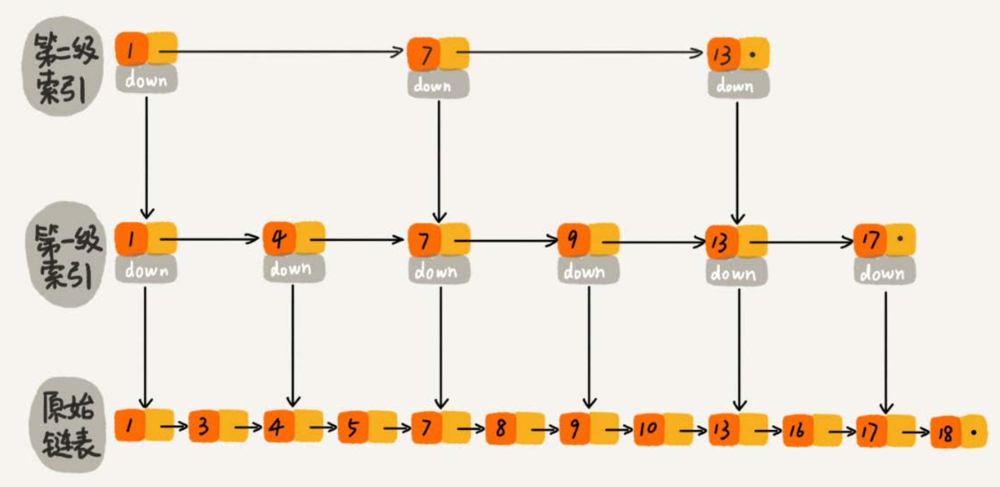
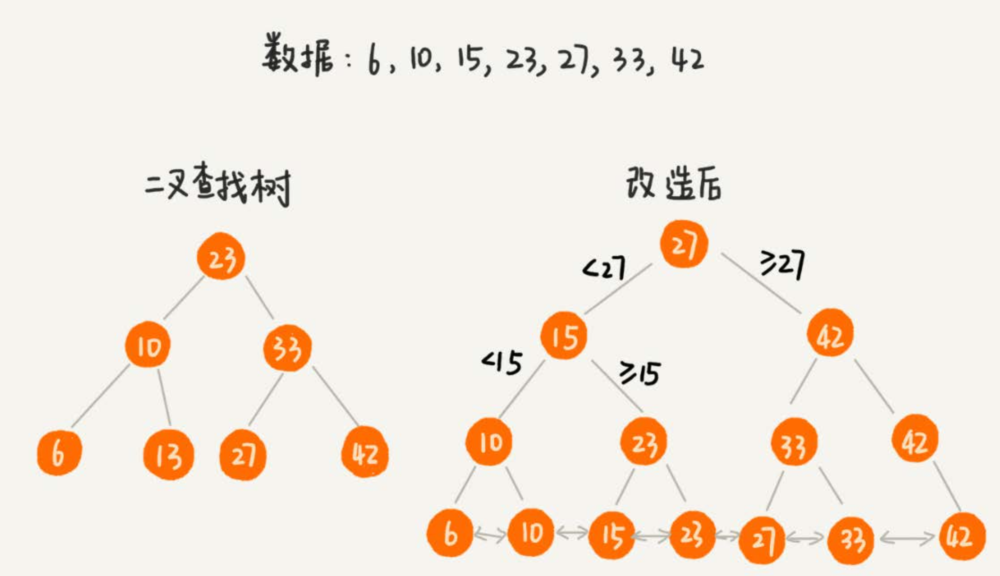
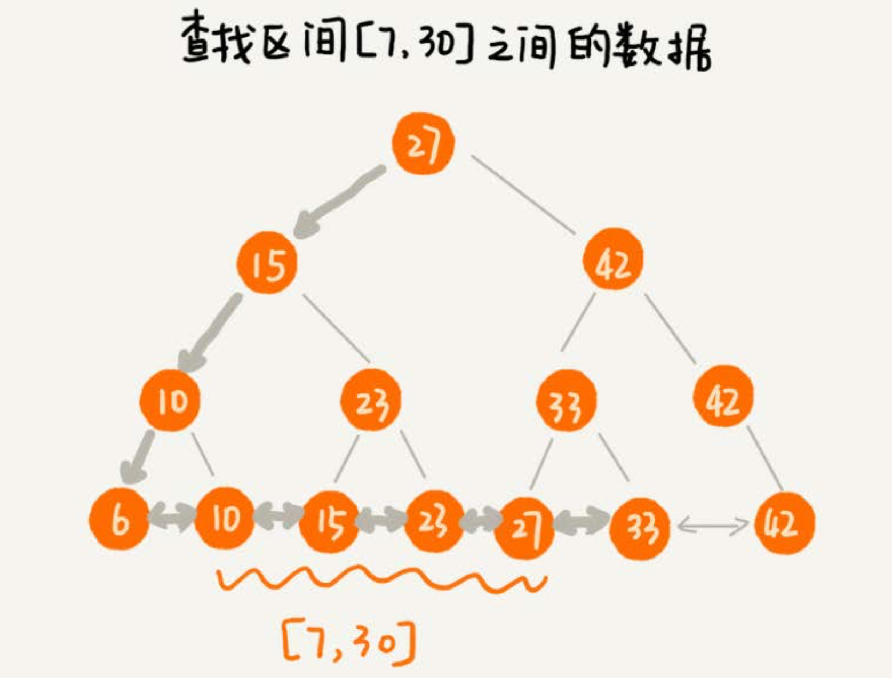
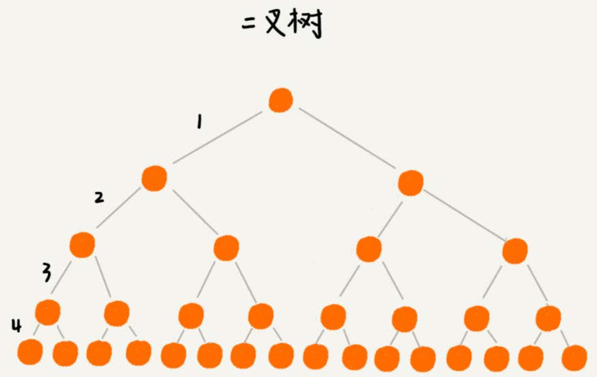
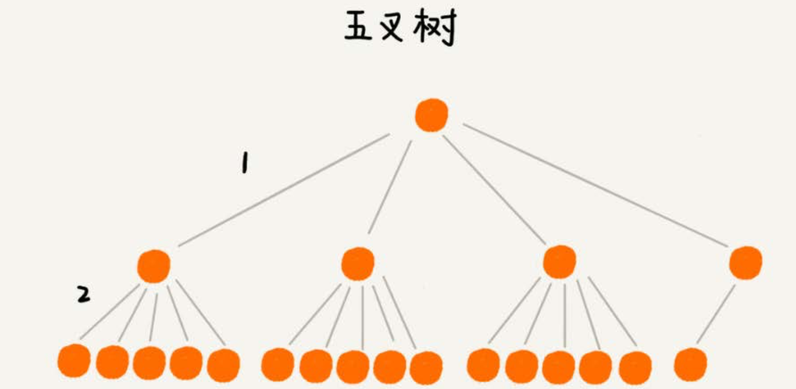
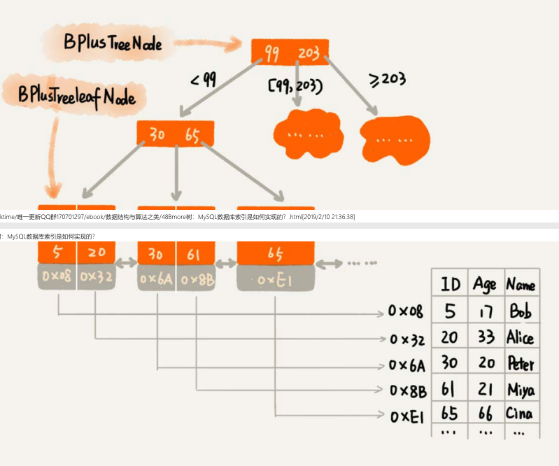
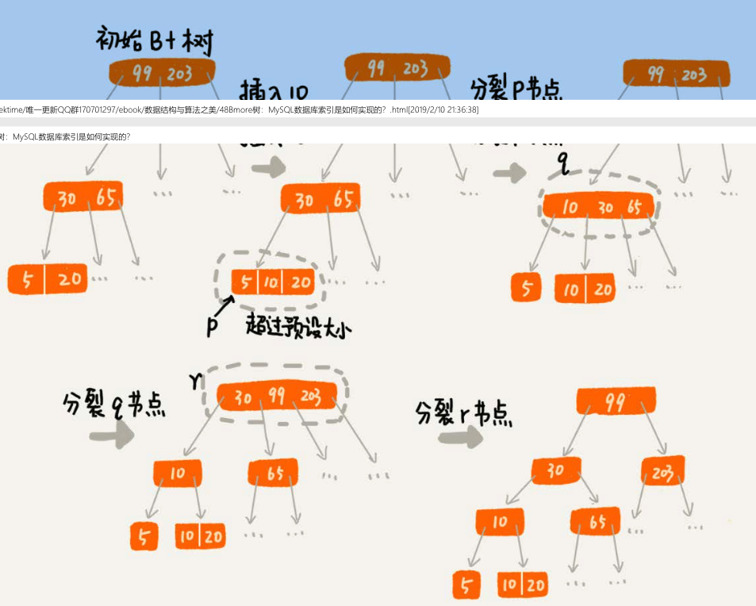
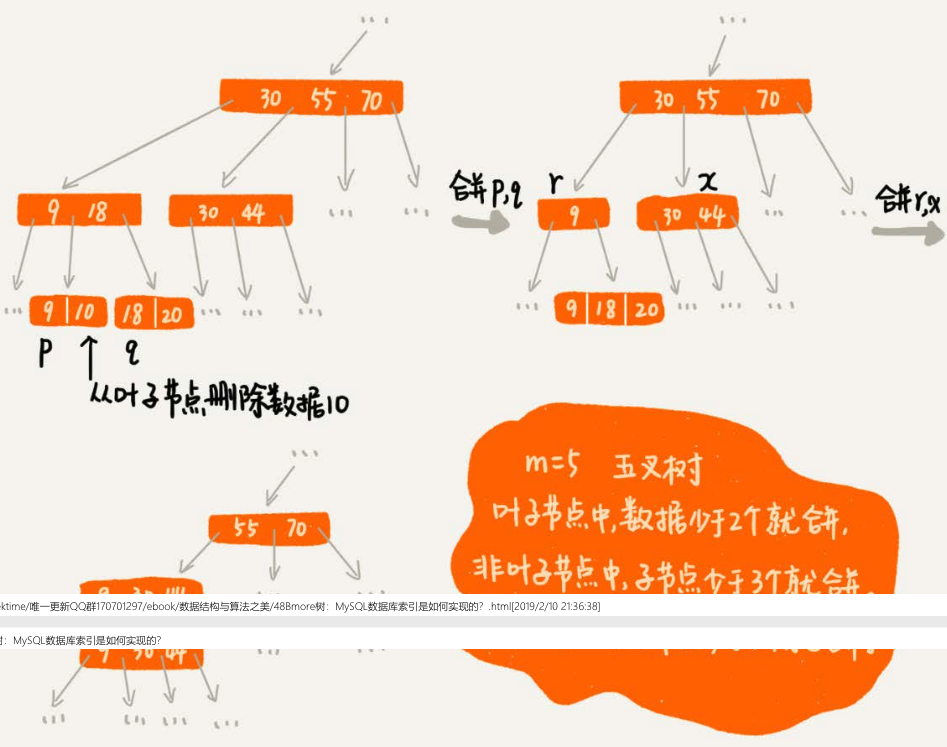

## 48、B+数：Mysql数据库索引是如何实现的？

为了加速数据库中数据的查找速度，我们常用的处理思路是，对表中的数据创建索引，那你是否思考过：**数据库索引是怎么实现的呢？底层使用的是什么数据结构和算法呢？**

### 算法解析
#### 1、解决问题 的前提是定义清楚问题
如果你对数据库的操作非常了解，针对我们现在这个问题，你就能把索引的需求定义得非常清楚。但是，对于大部分软件工程师来说，我们可能只了解一小部分 常用的SQL语句，所以，这里我们假设要解决的问题，只包含这样两个常用的需求:

- 根据某个值查找数据，比如select * from user where id=1234;
- 根据区间值来查找某些数据，比如select * from user where id > 1234 and id < 2345。

除了这些功能性需求之外，这种问题往往还会涉及一些非功能性需求，比如安全、性能、用户体验等等。限于专栏要讨论的主要是数据结构和算法，对于非功能 性需求，我们着重考虑性能方面的需求。性能方面的需求，我们主要考察时间和空间两方面，也就是执行效率和存储空间。

在执行效率方面，我们希望通过索引，查询数据的效率尽可能的高；在存储空间方面，我们也希望索引不要消耗太多的内存空间。

#### 2、尝试用学过的数据结构解决这个问题
问题的需求大致定义清楚了，我们现在回想一下，能否利用已经学习过的数据结构来解决这个问题呢？支持快速查询、插入等操作的动态数据机构，我们已经学习过了散列表、平衡二叉树、跳表。

我们先来看散列表。散列表的查询性能很好，时间复杂度是O(1)。但是，散列表不能支持按照区间快速查找数据，所以散列表不能满足我们的需求。

我们再来看看平衡二叉查找数据。尽管平衡二叉查找树查询的性能也很高，时间复杂度是O(logn)。而且对树进行中序遍历，我们还可以得到一个从小到大有序的数据序列，当这仍然不足以支持按照区间快速查找数据。

我们再来看跳表。跳表是在链表之上加多层索引构成的。它支持快速地插入、查找、删除数据。对应的时间复杂度是O(logn)。并且跳表支持按照区间快速地查找数据。我们只需要定位到区间起点值对应在链表中的结点，然后从这个结点开始，顺序遍历链表，知道区间终点对应的结点为止，这期间遍历得到的数据就是满足区间值的数据。



这样看来，跳表是可以解决这个问题。实际上，数据库索引说用到的数据结构跟跳表很相似，叫做B+树。不过，它是通过二叉查找数据演化过来的，而非跳表。为了给你还原发明B+树的整个思考过程，所以，接下来，我还再从二叉树讲起，看它是如何一步步改造成B+树的。

#### 3、改造二叉查找树来解决这个问题
为了让二叉查找树支持按照区间来查找数据，我们可以对它进行这样的改造：

- 树中的结点并不存储数据本身，而是只作为索引。除此之外，我们把每个叶子结点串在一条链表上，链表中的数据从小到大有序的。经过改造之后的二叉树，就像图中这样，看起来是不是很像跳表呢？



改造之后，如果我们要求某个区间的数据。我们只需要拿区间的起始值，在树中进行查找，当查找到某个叶子结点之后，我们再顺着链表往后遍历，知道链表中结点数据值大于区间的终止值为止。所有遍历到的数据，就是符合区间值的所有数据.



但是，我们要为几千万、上亿的数据构建索引，如果将索引存储在内存中，尽管内存访问的速度非常快、查询效率非常高，但是，占用的内存会非常多。

比如，我们给一亿个数据构建二叉查找树索引，那索引中会包含大约1亿个节点，每个节点假设占用16个字节，那就需要大约1GB的内存空间。给一张表建立索 引，我们需要1GB的内存空间。如果我们要给10张表建立索引，那对内存的需求是无法满足的。如何解决这个索引占用太多内存的问题呢?

我们可以借助时间换空间的思路，把索引存储在硬盘中，而非内存中。我们都知道，硬盘是一个非常慢速的存储设备。通常内存的访问速度是纳秒级别的，而磁 盘访问的速度是毫秒级别的。读取同样大小的数据，从磁盘中读取花费的时间，是从内存中读取所花费时间的上万倍，甚至几十万倍。

这种将索引存储在硬盘中的方案，尽管减少了内存消耗，但是在数据查找的过程中，需要读取磁盘中的索引，因此数据查询效率就相应降低很多。 二叉查找树，经过改造之后，支持区间查找的功能就实现了。不过，为了节省内存，如果把树存储在硬盘中，那么每个节点的读取(或者访问)，都对应一次磁
盘IO操作。树的高度就等于每次查询数据时磁盘IO操作的次数。 我们前面讲到，比起内存读写操作，磁盘IO操作非常耗时，所以我们优化的重点就是尽量减少磁盘IO操作，也就是，尽量降低树的高度。那如何降低树的高度呢?

我们来看下，如果我们把索引构建成m叉树，高度是不是比二叉树要小呢？如图所示，给16个数据构建二叉树索引，树的高度是4，查找一个数据，就需要4次磁盘IO操作（如果根节点存储在内存在内存中，其他结点存储在磁盘中），如果对16个数据构建5叉树索引，那高度只有2，查找一个数据，对应只需要2次磁盘IO操作。如果m叉树中的m是100，那对一亿数据构建索引，树的高度也只有3，最多只要3次磁盘IO就能获取到数据。磁盘IO变少了，查找数据的效率也就提高了。





如果我们将m叉树实现B+树索引，用代码实现出来，就是下面这个样子（假设我们给int类型的数据库字段添加索引，所以代码中的keywords是int类型的）

```java
这是B+树非叶子结点的定义：
// 假设keywords = [3,5,8,10]
// 4个键值将数据分为5个区间：(-INF,3),[3,5),[5,8),[8,10),[10,INF)
// 5个区间分别对应 children[0]...children[4],

// m值是事先计算得到的，计算的依据是让所有信息的大小正好等于页的大小。
// PAGE_SIZE = (m-1)*4[keywordss大小]+m*8[children大小]
public class BPlusTreeNode{
    public static int m = 5;//5叉树
    public int[] keywords = new int[m-1];//键值，用来划分数据区间
    public BPlushTreeNode[] children = new BPlushTreeNode[m];//用来保存子节点的指针
}
//
// 这是B+树中叶子结点的定义。
// B+树中的叶子结点跟内部结点是不一样的，
// 叶子结点存储的是值，而非区间。
// 这个定义里，每个叶子结点存储3个数据行的键值以及地址信息

// k值是事先计算得到的，计算的依据是让所有信息的大小正好等于页的大小
// PAGE_SIZE = k*4[keyw..大小]+k*8[dataAd..大小]+8[prev大小]+8[next大小]
public class BPlushTreeLeafNode{
    public static int K  = 3;
    public int[] keywords = new int[k];//数据的键值
    public long[] dataAddress = new long[k];//数据得地址

    public BPlusTreeNode prev;//这个结点在链表中得前驱节点
    public BPlusTreeNode next;//这个结点在链表中得后继结点
}
```
对于相同个数得数据构建m叉树索引，m叉树中的m越大，那树的高度就越小，那m叉书中的m是不是越大越好呢？到底多大才最合适呢？

不管是内存中的数据，还是磁盘中的数据，操作系统都是按页(一页大小通常是4KB，这个值可以通过getconfig PAGE_SIZE命令查看)来读取的，一次会读一页 的数据。如果要读取的数据量超过一页的大小，就会触发多次IO操作。所以，我们在选择m大小的时候，要尽量让每个节点的大小等于一个页的大小。读取一个节 点，只需要一次磁盘IO操作。




尽管索引可以提高数据库的查询效率，但是，作为一名开发工程师，你应该也知道，索引有利也有弊，它也会让写入数据的效率下降。这是为什么呢?

数据的写入过程，会涉及索引的更新，这是索引导致写入变慢的主要原因。
对于一个B+树来说，m值是根据页的大小事先计算好的，也就是说，每个节点最多只能有m个子节点。在往数据库中写入数据的过程中，这样就有可能使索引中某 些节点的子节点个数超过m，这个节点的大小超过了一个页的大小，读取这样一个节点，就会导致多次磁盘IO操作。我们该如何解决这个问题呢?

实际上，处理思路并不复杂。我们只需要将这个节点分裂成两个节点。但是，节点分裂之后，其上层父节点的子节点个数就有可能超过m个。不过这也没关系，我 们可以用同样的方法，将父节点也分裂成两个节点。这种级联反应会从下往上，一直影响到根节点。这个分裂过程，你可以结合着下面这个图一块看，会更容易 理解(图中的B+树是一个三叉树。我们限定叶子节点中，数据的个数超过2个就分裂节点;非叶子节点中，子节点的个数超过3个就分裂节点)。



正是因为要时刻保证B+树索引是一个m叉树，所以，索引的存在会导致数据库写入的速度降低。实际上，不光写入数据会变慢，删除数据也会变慢。这是为什么 呢?

我们在删除某个数据的时候，也要对应的更新索引节点。这个处理思路有点类似跳表中删除数据的处理思路。频繁的数据删除，就会导致某些结点中，子节点的个数变得非常少，长此以往，如果每个节点的子节点都比较少，势必会影响索引的效率。

我们可以设置一个阈值。在B+树中，这个阈值等于m/2。如果某个节点的子节点个数小于m/2，我们就将它跟相邻的兄弟节点合并。不过，合并之后结点的子节点个数有可能会超过m。针对这种情况，我们可以借助插入数据时候的处理方法，再分裂节点。

文字描述不是很直观，我举了一个删除操作的例子，你可以对比着看下图中的B+树是一个五叉树。我们限定叶子节点中，数据的个数少于2个就合并节点;非叶 子节点中，子节点的个数少于3个就合并节点。)。



#### 总结引申
今天，我们讲解了数据库索引实现，依赖的底层数据结构，B+树。它通过存储在磁盘的多叉树结构，做到了时间、空间的平衡，既保证了执行效率，又节省了内 存。

前面的讲解中，为了一步一步详细地给你介绍B+树的由来，内容看起来比较零散。为了方便你掌握和记忆，我这里再总结一下B+树的特点:

- 每个节点中子节点的个数不能超过m，也不能小于m/2;
- 根节点的子节点个数可以不超过m/2，这是一个例外;
- m叉树只存储索引，并不真正存储数据，这个有点儿类似跳表;
- 通过链表将叶子节点串联在一起，这样可以方便按区间查找;
- 一般情况，根节点会被存储在内存中，其他节点存储在磁盘中。


B+树中的节点不存储数据，只是索引，而B树中的节点存储数据; B树中的叶子节点并不需要链表来串联。
也就是说，B树只是一个每个节点的子节点个数不能小于m/2的m叉树。
课后思考
1. B+树中，将叶子节点串起来的链表，是单链表还是双向链表?为什么?
2. 我们对平衡二叉查找树进行改造，将叶子节点串在链表中，就支持了按照区间来查找数据。我们在散列表(下)讲到，散列表也经常跟链表一块使用，如果我们把散列表中的结点，也用链表串起来，能否支持按照区间查找数据呢?

第一题: 对于B+tree叶子节点，是用双向链表还是用单链表，得从具体的场景思考。我想，大部分同学在开发中遇到的数据库查询，都遇到过升序或降序问题，即类似这样的sql: select name,age, ... from where uid > startValue and uid < endValue order by uid asc(或者desc)，此时，数据底层实现有两种做法:

- 1)保证查出来的数据就是用户想要的顺序
- 2)不保证查出来的数据的有序性，查出来之后再排序

以上两种方案，不加思考，肯定选第一种，因为第二种做法浪费了时间如果选用内存排序，还是考虑数据的量级)。那如何能保证查询出来的数据就是有 序的呢?单链表肯定做不到，只能从头往后遍历，再想想，只能选择双向链表了。此时，可能有的同学又问了:双向链表，多出来了一倍的指针，不是会多 占用空间嘛? 答案是肯定的。可是，我们再细想下，数据库索引本身都已经在磁盘中了，对于磁盘来说，这点空间已经微不足道了，用这点空间换来时间肯定划算呀。顺便提一下:在实际工程应用中，双向链表应用的场景非常广泛，毕竟能大量减少链表的遍历时间.

第二题:

答案是「肯定的」。如同@老杨 大哥说的，JDK中的LinkedHashMap为了能做到保持节点的顺序(插入顺序或者访问顺序)，就是用双向链表将节点串起来的。 其实，王争老师在《散列表(下)》那一堂课中就已经深入讲解了LinkedHashMap，如果理解了那篇，这个问题应该不难。 -------