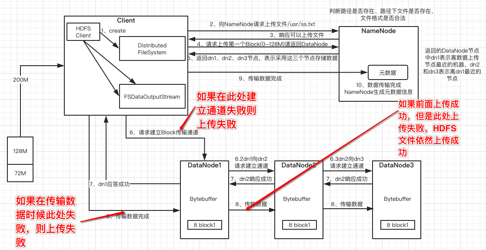
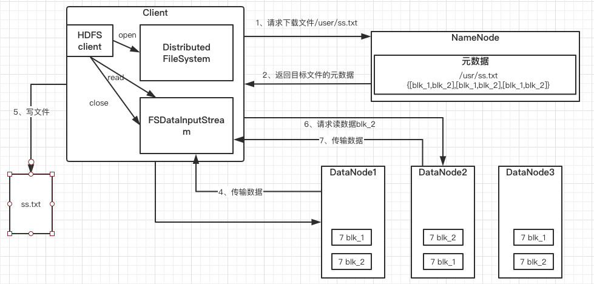

### HDFS的数据流(面试重点)

#### HDFS写数据流程

- 客户端通过Distributed FileSystem模块向NameNode请求上传文件，NameNode检查目标文件上是否存在，父目录是否存在。
- NameNode返回是否可以上传。
- 客户端请求第一个Block上传到哪几个DataNode服务器上
- NameNode返回3个DataNode节点节点，分别为dn1、dn2、dn3
- 客户端通过FSDataOutputStream模块请求dn1上传数据，dn1收到请求会继续调用dn2,然后dn2调用dn3，讲这个通信管道建立完成。
- dn1、dn2、dn3逐级应答客户端。
- 客户端开始往dn1上传第一个Block（先从磁盘读取数据放到一个本地内存缓存），以Packet为单位，dn1收到一个Packet就会传给dn2，dn2传给dn3；**dn1每传一个packet会放入一个应答等待队列等待应答。**
- 当一个Block传输完成之后，客户端再次请求NameNode上传第二个Block的服务器。（重复执行3-7步）。

#### HDFS读数据流程

- 客户端通过Distributed FileSystem向NameNode请求下载文件，NameNode通过查询元数据，找到文件块所在的DataNode地址。
- 挑选一台DataNode(就近原则，然后随机)服务器，请求读取数据
- DataNode开始传输数据给客户端（从磁盘里面读取数据输入流，以Packet为单位来做校验）
- 客户端以Packet为单位接收，现在本地缓存，然后写入目标文件。

