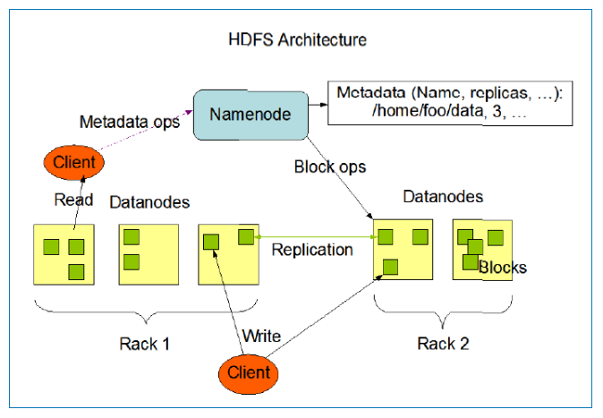
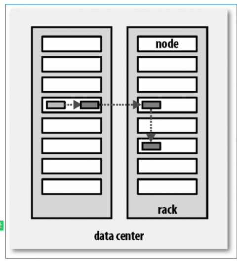
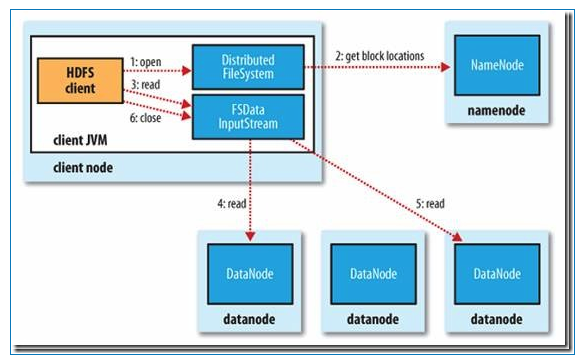
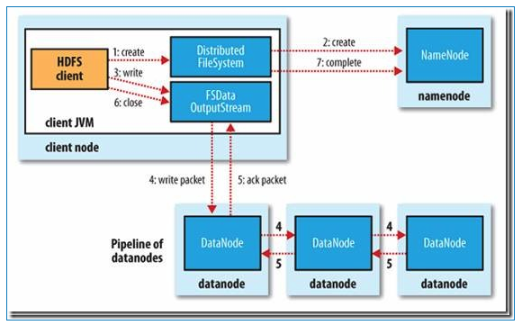

### HDFS是什么？HDFS适合做什么？我们应该怎么操作HDFS系统？
摘要：本文主要介绍HDFS是什么？HDFS的作用？适合和不适合的场景？

#### 什么是HDFS?
Hadoop 附带了一个名为 HDFS(Hadoop分布式文件系统)的分布式文件系统，专门存储超大数据文件，为整个Hadoop生态圈提供了基础的存储服务。

本章内容：

1) HDFS文件系统的特点，以及不适用的场景

2) HDFS文件系统重点知识点：体系架构和数据读写流程

3) 关于操作HDFS文件系统的一些基本用户命令

#### 1. HDFS特点：
HDFS专为解决大数据存储问题而产生的，其具备了以下特点：

- 1) HDFS文件系统可存储超大文件
每个磁盘都有默认的数据块大小，这是磁盘在对数据进行读和写时要求的最小单位，文件系统是要构建于磁盘上的，文件系统的也有块的逻辑概念，通常是磁盘块的整数倍，通常文件系统为几千个字节，而磁盘块一般为512个字节。

HDFS是一种文件系统，自身也有块（block）的概念，其文件块要比普通单一磁盘上文件系统大的多，默认是64MB。

HDFS上的块之所以设计的如此之大，其目的是为了最小化寻址开销。

HDFS文件的大小可以大于网络中任意一个磁盘的容量，文件的所有块并不需要存储在一个磁盘上，因此可以利用集群上任意一个磁盘进行存储，由于具备这种分布式存储的逻辑，所以可以存储超大的文件，通常G、T、P级别。

- 2）一次写入，多次读取
一个文件经过创建、写入和关闭之后就不需要改变，这个假设简化了数据一致性的问题，同时提高数据访问的吞吐量。

#### 2.不适用的HDFS的场景：
- 一个文件经过创建、写入和关闭之后就不需要改变，这个假设简化了数据一致性的问题，同时提高数据访问的吞吐量。
HDFS不适用于实时查询这种对延迟要求高的场景，例如：股票实盘。往往应对低延迟数据访问场景需要通过数据库访问索引的方案来解决，Hadoop生态圈中的Hbase具有这种随机读、低延迟等特点。
- 2) 大量小文件
对于Hadoop系统，小文件通常定义为远小于HDFS的block size（默认64MB）的文件，由于每个文件都会产生各自的MetaData元数据，Hadoop通过Namenode来存储这些信息，若小文件过多，容易导致Namenode存储出现瓶颈。
- 3) 多用户更新
为了保证并发性，HDFS需要一次写入多次读取，目前不支持多用户写入，若要修改，也是通过追加的方式添加到文件的末尾处，出现太多文件需要更新的情况，Hadoop是不支持的。

针对有多人写入数据的场景，可以考虑采用Hbase的方案。

- 4) 结构化数据
HDFS适合存储半结构化和非结构化数据，若有严格的结构化数据存储场景，也可以考虑采用Hbase的方案。

- 5) 数据量并不大
通常Hadoop适用于TB、PB数据，若待处理的数据只有几十GB的话，不建议使用Hadoop，因为没有任何好处。

#### 3、HDFS体系结构
HDFS是一个主/从（Master/Slave）体系架构，由于分布式存储的性质，集群拥有两类节点NameNode和DataNode。

NameNode（名字节点）：系统中通常只有一个，中心服务器的角色，管理存储和检索多个DataNode的实际数据所需的所有元数据。

DataNode（数据节点）：系统中通常有多个，是文件系统中真正存储数据的地方，在NameNode统一调度下进行数据块的创建、删除和复制。

图中的Client是HDFS的客户端，是应用程序可通过该模块与NameNode和DataNode进行交互，进行文件的读写操作。

#### 4、HDFS数据块复制
为了系统容错，文件系统会对所有数据块进行副本复制多份，Hadoop是默认3副本管理。

复本管理策略是运行客户端的节点上放一个复本（若客户端运行在集群之外，会随机选择一个节点），第二个复本会放在与第一个不同且随机另外选择的机架中节点上，第三个复本与第二个复本放在相同机架，切随机选择另一个节点。所存在其他复本，则放在集群中随机选择的节点上，不过系统会尽量避免在相同机架上放太多复本。

所有有关块复制的决策统一由NameNode负责，NameNode会周期性地接收数据节点DataNode的心跳和块报告。一个心跳的到达表示这个数据节点是正常的。一个块报告包括了该数据节点上所有块的列表。

#### 5、HDFS读取和写入流程
1) 读文件的过程：

首先Client通过File System的Open函数打开文件，Distributed File System用RPC调用NameNode节点，得到文件的数据块信息。对于每一个数据块，NameNode节点返回保存数据块的数据节点的地址。Distributed File System返回FSDataInputStream给客户端，用来读取数据。客户端调用stream的read()函数开始读取数据。DFSInputStream连接保存此文件第一个数据块的最近的数据节点。DataNode从数据节点读到客户端(client)，当此数据块读取完毕时，DFSInputStream关闭和此数据节点的连接，然后连接此文件下一个数据块的最近的数据节点。当客户端读取完毕数据的时候，调用FSDataInputStream的close函数。

在读取数据的过程中，如果客户端在与数据节点通信出现错误，则尝试连接包含此数据块的下一个数据节点。失败的数据节点将被记录，以后不再连接。

2) 写文件的过程：

客户端调用create()来创建文件，Distributed File System用RPC调用NameNode节点，在文件系统的命名空间中创建一个新的文件。NameNode节点首先确定文件原来不存在，并且客户端有创建文件的权限，然后创建新文件。

Distributed File System返回DFSOutputStream，客户端用于写数据。客户端开始写入数据，DFSOutputStream将数据分成块，写入Data Queue。Data Queue由Data Streamer读取，并通知NameNode节点分配数据节点，用来存储数据块(每块默认复制3块)。分配的数据节点放在一个Pipeline里。Data Streamer将数据块写入Pipeline中的第一个数据节点。第一个数据节点将数据块发送给第二个数据节点。第二个数据节点将数据发送给第三个数据节点。

DFSOutputStream为发出去的数据块保存了Ack Queue，等待Pipeline中的数据节点告知数据已经写入成功。

