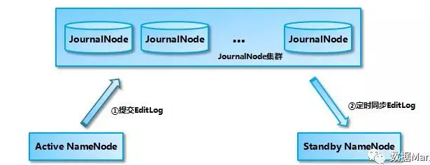

### HDFS NameNode 高可用实现
##### 历史背景
在 Hadoop 1.0 时代，NameNode 存在单点问题（SPOF，single point of failure ），一旦挂掉，整个 HDFS 都不能访问，而依赖它的 MapReduce、Hive、HBase 等都将无法正常服务。

##### 解决思路
一个 NameNode 有单点问题，如果再提供一个 NameNode作为备份，不是能解决问题？这便是 ***主备模式***的思想。继续这个思路，光有备份的 NameNode 够吗？我们知道 NameNode 上存储的是 HDFS 上所有的元数据信息，因此最关键的问题在于 NameNode 挂了一个，备份的要及时顶上，这就意味着我们要把所有的元数据都同步到备份节点。好，接下来我们考虑如何同步呢？每次 HDFS 写入一个文件，都要同步写 NameNode 和其备份节点吗？如果备份节点挂了就会写失败？显然不能这样，只能是异步来同步元数据。如果 NameNode 刚好宕机却没有将元数据异步写入到备份节点呢？那这部分信息岂不是丢失了？这个问题就自然要引入第三方的存储了，在 HA 方案中叫做 **“共享存储”**。每次写文件时，需要将日志同步写入共享存储，这个步骤成功才能认定写文件成功。然后备份节点定期从共享存储同步日志，以便进行主备切换。

##### **架构**

- Active NameNode 和 Standby NameNode：两台 NameNode 形成互备，一台处于 Active 状态，为主 NameNode，另外一台处于 Standby 状态，为备 NameNode，只有主 NameNode 才能对外提供读写服务。
- 主备切换控制器 ZKFailoverController：ZKFailoverController 作为独立的进程运行，对 NameNode 的主备切换进行总体控制。ZKFailoverController 能及时检测到 NameNode 的健康状况，在主 NameNode 故障时借助 Zookeeper 实现自动的主备选举和切换，当然 NameNode 目前也支持不依赖于 Zookeeper 的手动主备切换。
- Zookeeper 集群：为主备切换控制器提供主备选举支持。
- 共享存储系统：共享存储系统是实现 NameNode 的高可用最为关键的部分，共享存储系统保存了 NameNode 在运行过程中所产生的 HDFS 的元数据。Active NameNode 和 Standby NameNode 通过共享存储系统实现元数据同步。在进行主备切换的时候，新的主 NameNode 在确认元数据完全同步之后才能继续对外提供服务。

可以看出，这里的核心是共享存储的实现，这些年有很多的 NameNode 共享存储方案，比如 Linux HA, VMware FT, shared NAS+NFS, BookKeeper, QJM/Quorum Journal Manager, BackupNode 等等。在关于共享存储设备的选择上，因为NFS也会有单点故障问题，目前社区已经把由 Clouderea 公司实现的基于 QJM（Quorum Journal Manager）的方案合并到 HDFS 的 trunk 之中并且作为默认的共享存储实现。

##### QJM
基于 QJM 的共享存储系统主要用于保存 EditLog，并不保存 FSImage 文件。FSImage 文件还是在 NameNode 的本地磁盘上。QJM 共享存储的基本思想来自于 Paxos 算法，采用多个称为 JournalNode 的节点组成的 JournalNode 集群来存储 EditLog。每个 JournalNode 保存同样的 EditLog 副本。每次 NameNode 写 EditLog 的时候，除了向本地磁盘写入 EditLog 之外，也会并行地向 JournalNode 集群之中的每一个 JournalNode 发送写请求，只要大多数 (majority) 的 JournalNode 节点返回成功就认为向 JournalNode 集群写入 EditLog 成功。如果有 2N+1 台 JournalNode，那么根据大多数的原则，最多可以容忍有 N 台 JournalNode 节点挂掉。

##### 数据同步机制

1. Active NameNode 提交 EditLog 到 JournalNode 集群

Active NameNode 提交 EditLog 到 JournalNode **集群的过程实际上是同步阻塞的，但是并不需要所有的 JournalNode 都调用成功，只要大多数 JournalNode 调用成功就可以了**。否则就认为提交 EditLog 失败，NameNode 停止服务退出进程。

2. Standby NameNode 从 JournalNode 集群同步 EditLog

虽然 Active NameNode 向 JournalNode 集群提交 EditLog 是同步的，但 Standby NameNode 采用的是定时从 JournalNode 集群上同步 EditLog 的方式，那么 Standby NameNode 内存中文件系统镜像有很大的可能是落后于 Active NameNode 的，所以 Standby NameNode 在转换为 Active NameNode 的时候需要把落后的 EditLog 补上来。

##### 脑裂问题
假设 NameNode1 当前为 Active 状态，NameNode2 当前为 Standby 状态。如果某一时刻 NameNode1 对应的 ZKFailoverController 进程发生了“假死”现象，那么 Zookeeper 服务端会认为 NameNode1 挂掉了，根据前面的主备切换逻辑，NameNode2 会替代 NameNode1 进入 Active 状态。但是此时 NameNode1 可能仍然处于 Active 状态正常运行，即使随后 NameNode1 对应的 ZKFailoverController 因为负载下降或者 Full GC 结束而恢复了正常，感知到自己和 Zookeeper 的 Session 已经关闭，但是由于网络的延迟以及 CPU 线程调度的不确定性，仍然有可能会在接下来的一段时间窗口内 NameNode1 认为自己还是处于 Active 状态。这样 NameNode1 和 NameNode2 都处于 Active 状态，都可以对外提供服务。

这种情况对于 NameNode 这类对数据一致性要求非常高的系统来说是灾难性的，数据会发生错乱且无法恢复。Zookeeper 社区对这种问题的解决方法叫做 fencing，中文翻译为隔离，也就是想办法把旧的 Active NameNode 隔离起来，使它不能正常对外提供服务。

在进行 fencing 的时候，会执行以下的操作：

首先尝试调用这个旧 Active NameNode 的 HAServiceProtocol RPC 接口的 transitionToStandby 方法，看能不能把它转换为 Standby 状态。
如果 transitionToStandby 方法调用失败，那么就执行 Hadoop 配置文件之中预定义的隔离措施，Hadoop 目前主要提供两种隔离措施，通常会选择 sshfence：
sshfence：通过 SSH 登录到目标机器上，执行命令 fuser 将对应的进程杀死；
shellfence：执行一个用户自定义的 shell 脚本来将对应的进程隔离；