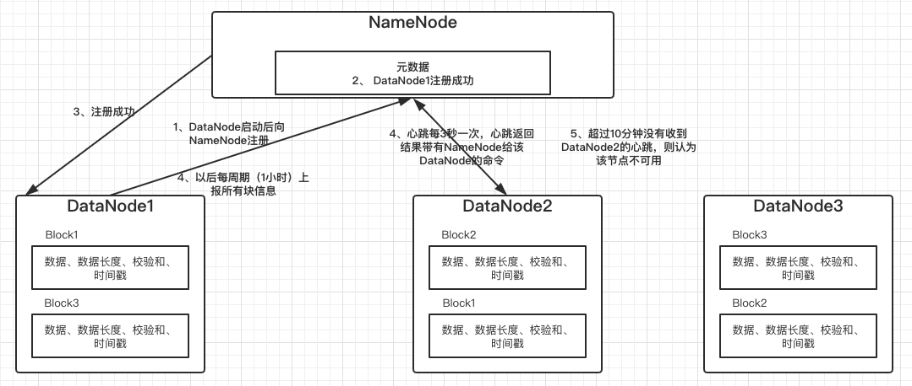
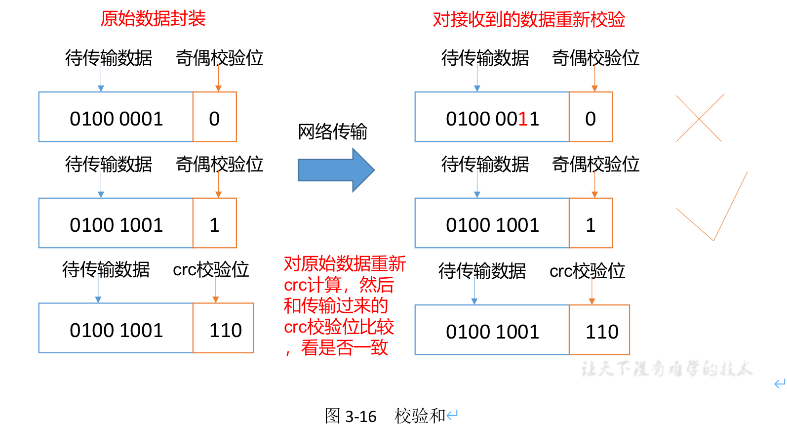
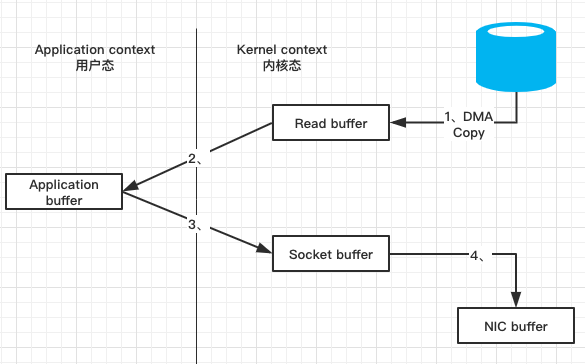
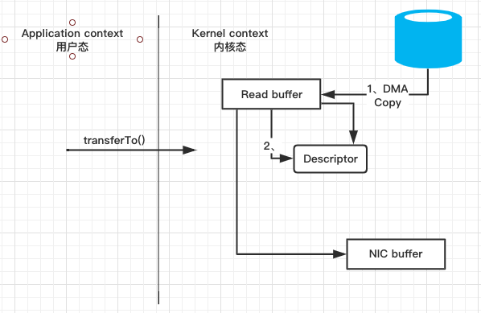

### HDFS-DataNode部分
#### DataNode（DN）工作机制

- 一个数据块在DataNode上以文件形式存储在磁盘上，包括两个文件，一个是数据本身，一个是元数据包括数据块的长度，块数据的校验和，以及时间戳。
- DataNode启动后向NameNode注册，通过后，周期性(1小时)的向NameNode上报所有的块信息。
- 心跳是每3秒一次，心跳返回结果带有NameNode给该DataNode命令如复制块数据到另一台机器，或者删除某个数据块。如果超过10分钟没有收到某个DataNode的心跳，则认为该节点不可用。
- 集群运行中可以安全加入何退出一些机器

#### 数据完整性
思考：如果电脑磁盘里面存储的数据是控制高铁信号灯的红灯信号（1）和绿灯信号（0），但是存储该数据的磁盘坏了，一直显示是绿灯，是否很危险？同理DataNode节点上的数据损坏了，却没有发现，是否也很危险，那么如何解决呢？

如下是DataNode节点保证数据完整性的方法。

1）当DataNode读取Block的时候，它会计算CheckSum。

2）如果计算后的CheckSum，与Block创建时值不一样，说明Block已经损坏。

3）Client读取其他DataNode上的Block。

4）DataNode在其文件创建后周期验证CheckSum，如图3-16所示。

#### 思考：为什么块的大小不能设置太小，也不能设置太大？
- HDFS的块设置太小，会增加寻址时间，程序一直在找块的开始位置；
- 如果块设置的太大，从磁盘传输数据的时间会明细大于定位这个块开始位置所需的时间。会导致程序在处理这块数据时，会非常慢。
总结：HDFS块的大小设置主要取决于磁盘传输速率

#### datanode中读取数据块的两种方式：普通方法和零拷贝传输
##### 1、普通方式（操作系统层面）
- datanode从磁盘存储读入到操作系统的内核缓冲区
- 在数据跨内核到datanode进程的用户缓冲区
- 再将数据夸内核推到内核中socket缓冲区
- 最后写入到网卡缓冲区。

##### 2、零拷贝数据传输
数据不用经过datanode进程缓冲区进行中转，直接从磁盘存储推到内核缓冲区，再推到网卡缓冲区。由于数据不经过DataNode内存，所以Datanode失去了在DataNode端去取数据块的过程中对数据校验的能力，为了解决这个问题，HDFS将数据块的读取数据操作放在客户端执行，客户端完成校验工作之后，会将校验结果发送回Datanode.

总结：零拷贝方式，数据拷贝次数从4次降为2次，用户态和内核态之间的上下文切换也从4次降为2次（只有开始read和send返回状态切换）