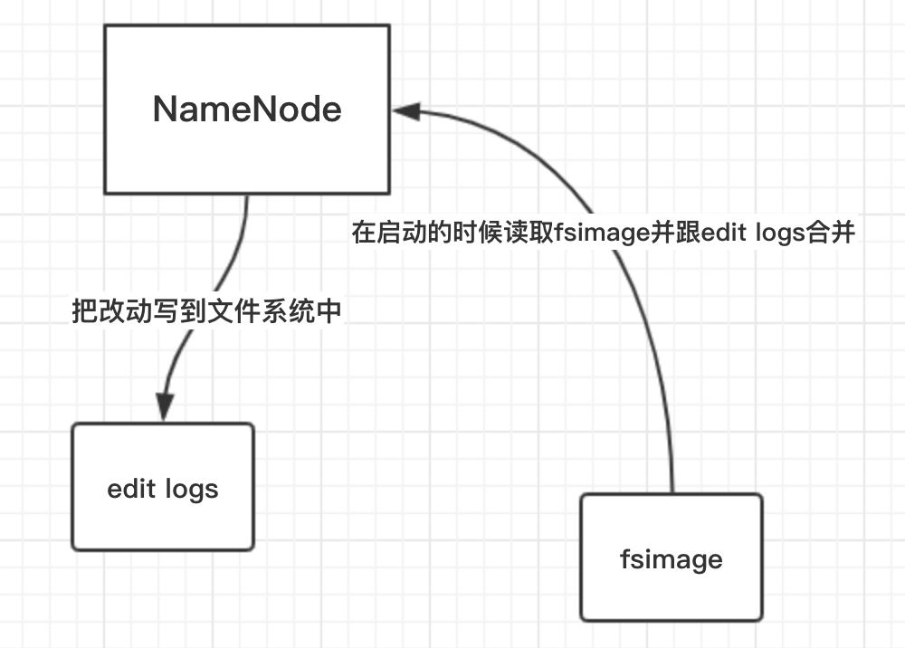

### HDFS-Namenode部分
- 简述下NameNode的作用？
- HDFS的namenode文件系统目录树管理（第一关系管理）★★
- HDFS的namenode对数据块和数据节点的管理（第二关系管理）★★
- HDFS中数据块副本状态的管理（BlockManager的成员变量）
- namenode中数据块的增加的管理（写文件，申请数据块构建内存）
- namenode中数据块副本的删除管理
- namenode中数据块副本的复制的管理
- namenode中数据块副本监控线程。（进行删除和复制的线程）
- namenode对块汇报的处理
- namenode管理datanode添加和撤销（DatanodeManager）
- namenode对datanode的启动过程管理（datanodeManager）
- namenode对datanode的心跳处理（datanodeManager）
- namenode中的租约管理（重点租约恢复）★
- namenode中的集中式缓存管理（接种缓存在对应副本的datanode上）
- namenode中的安全模式★★
- namenode中的高可用（HA）的实现★★
- namenode中的高可用（HA）的脑裂问题🌟
- namenode中启动过程底层分析

#### 简述NameNode的作用
NameNode的主要作用是用来保存HDFS的元数据信息，比如命名空间信息，块信息。当它运行的时候，这些信息是存在内存中。但是这些信息也可以持久化到磁盘上。

#### HDFS的NameNode文件系统目录树管理（第一关系管理）★★

#### HDFS的nameNode对数据块和数据节点的管理

#### HDFS的并发操作
- 读读可并发
- 读写可并发
- 写（append）写不能并发

