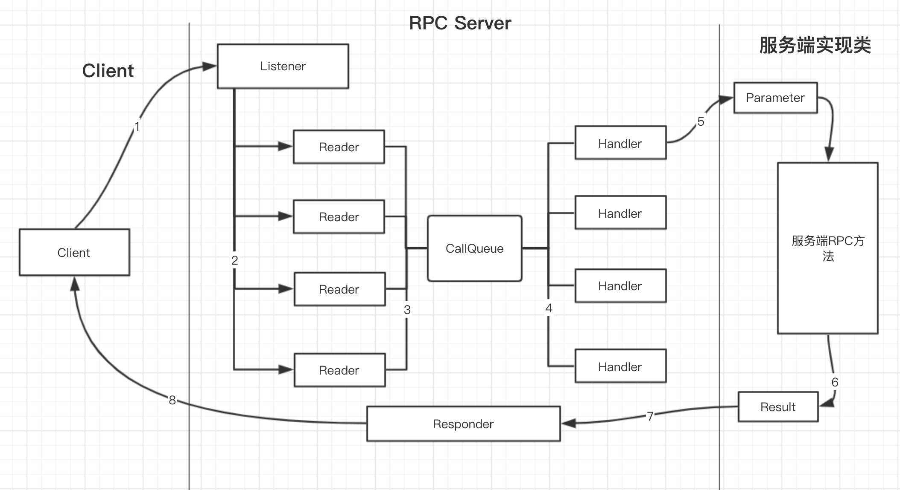
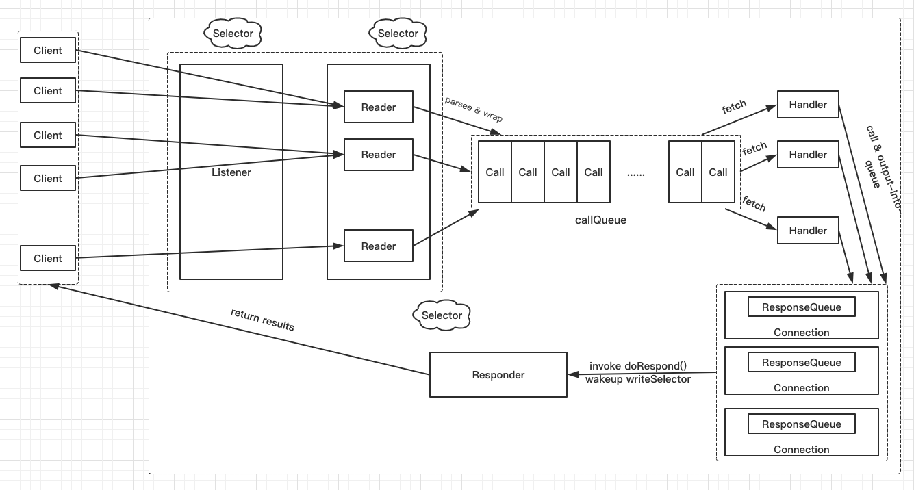
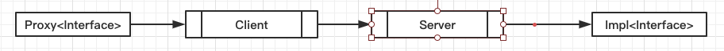
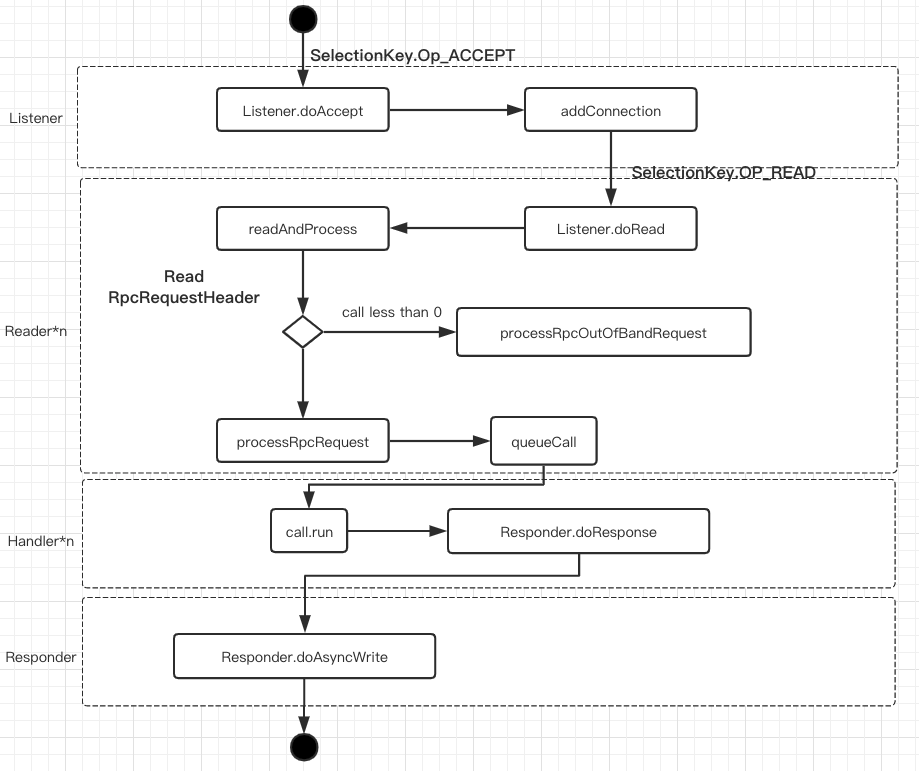

### HDFS通信框架
- 简述HDFS的各个节点之间的通信问题
- HDFS中RPC的通信接口及主要功能（RPC上层接口）
- HDFS中流式接口及其主要功能
- 简述Hadoop远程过程调用（RPC）底层核心实现过程（RPC底层实现）
- HDFS中客户端与NameNode的RPC通信实例（将RPC上层接口与底层实现结合分析）
- Hadoop HDFS中 RPC中相关概念

#### 1、简述HDFS的各个节点之间的通信协议
##### 1.1HDFS中提供了两种通信协议：
- (1) Hadoop RPC接口：HDFS中基于Hadoop RPC框架实现的接口
- (2) 流式接口：HDFS中基于TCP或者HTTP实现的接口
> http://hadoop.apache.org/docs/current/hadoop-project-dist/hadoop-hdfs/HdfsDesign.html
> The Communication Protocols
All HDFS communication protocols are layered on top of the TCP/IP protocol. A client establishes a connection to a configurable TCP port on the NameNode machine. It talks the ClientProtocol with the NameNode. The DataNodes talk to the NameNode using the DataNode Protocol. A Remote Procedure Call (RPC) abstraction wraps both the Client Protocol and the DataNode Protocol. By design, the NameNode never initiates any RPCs. Instead, it only responds to RPC requests issued by DataNodes or clients.
所有的HDFS通讯协议都是建立在TCP/IP协议之上。客户端通过一个可配置的TCP端口连接到NameNode，通过ClientProtocol协议与NameNode交互。而DataNode使用DataNodeProtocol与NameNode交互。

一个远程过程调用（RPC）模型被抽象出来封装clientProtocol和DataNodeProtocol协议。在设计上，NameNode不会主动发起RPC,而是响应来自客户端或DataNode的RPC请求。

###### a.Hadoop RPC接口
Hadoop RPC调用使得HDFS进程能够像本地调用一样调用另一个进程中的方法，目前Hadoop RPC调用基于Protobuf实现，具体底层细节后面再讲，本章主要介绍Hadoop RPC接口的定义。接口定义在org.apache.hadoop.hdfs.protocol和org.apache.hadoop.hdfs.server.protocol包中，包括以下几个接口：

- clientProtocol: client和NameNode之间的接口
- ClientDataNodeProtocol: client和DataNode的接口（这个方法主要是用于客户端获取数据节点信息时调用，真正的数据读写交互在流式接口进行）
- DataNodeProtocol: dataNode与nameNode通信接口
- InterDataNodeProtocol: DataNode与DataNode之间的通信接口
- NameNodeProtocol: SeconderNameNode与NameNode

###### b.流式接口
流式接口是HDFS中基于TCP或HTTP实现的接口，在HDFS中，流式接口包括了基于TCP的DataransferProtocol接口，以及HA架构中的Active Namenode和Standby Namenode之间的HTTP接口，客户端和数据节点以及数据节点数据节点之间的数据块的传输是基于TCP(数据量大)

#### 2、HDFS中RPC的通信接口及其主要功能（RPC上层接口）
##### (1)、ClientProtocol
定义了所有客户端发起、nameNode响应的操作。主要方法如下：

- HDFS文件读相关的操作。getBlockLocations()获得数据块的位置信息，reportBadBlocks(),发现读数据异常时告知NameNode错误的数据块位置。
- 写和追加数据相关操作。create创建一个空文件，append追加文件，addBlock向指定的文件中添加一个新的数据块，abandonBlock放弃新申请的数据块
- 命名空间管理相关方法。对nameNode命名空间的管理，对目录/文件创建、修改已经权限问题。
- 系统问题和管理操作。用于管理nameNode系统性问题，DFSAdmin的实现。比如获取文件系统、数据节点等状态信息、安全模式、升级等操作。
- 快照相关操作。开启和关闭快照、创建、重命名和删除快照。
- 集中式缓存相关操作。添加、删除、修改缓或者着缓存池。

##### (2)、DataNodeProtocol
DataNode向NameNode进行握手、注册、心跳、数据块汇报等操作，nameNode向dataNode通过心跳相应来返回指令。
//TODO

##### (3)、ClientDataNodeProtocol
接口分为两部分：一是支持HDFS文件读取操作；二是支持DFSAdmin中与dataNode命令。
//TODO

### 3、HDFS中流式接口及其主要功能。
##### (1)、DataTransProtocol
客户端与数据节点以及数据节点和数据节点之间的数据块传输都是基于该接口。主要方法为readBlock()、writeBlock()、transferBlock()以及短路读等方法。其功能实现依赖于子类Sender和Receviver类。

##### (2)、HTTP接口
Active nameNode和standby nameNode 之间采用http协议进行数据传输fsimage。standby namenode会通过http告知Active nameNode下载端口和地址，之后Active nameNode发起http请求下载新合并的fsimage。

由于Standby Namenode成功地将读入的editlog文件与当前的命名空间合并，从而始终保持着一个最新版本的命名空间，所以Standby Namenode只需定期将自己的命名空间写入一个新的fsimage文件，并通过HTTP协议将这个fsimage文件传回Active Namenode即可。

### 4、简述hadoop远程过程调用（RPC）底层核心实现过程。（RPC底层实现）
#### (1)、什么叫RPC?
远程过程调用。允许一台计算机程序远程过程调用另一台计算机的子程序，对于用户是透明的，就像本地调用一样。（通俗的讲：就是RPC实现 **不同进程之间的方法调用**）

Hadoop RPC特点：hadoop序列化机制、动态代理和反射机制实现函数调用、底层是TCP/IP的socket机制、server采用NIO模型
#### (2)、hadoop的RPC调用底层过程（IPC）



客户端部分：

- (1)、创建IPC客户端，利用RPC.getProtocolProxy, RPCEngine.getProxy创建 **Invoker代理对象**上，并绑定接口，返回接口对象实例。
- (2)、(动态代理过程)接口调用方法，实际被Invoker代理捕获，进入到 **invoker()方法**中，根据输入参数method和args生成rpcRequest对象（实现了Writable接口，进行序列化作用），之后 **调用client.call** 方法，准备远程调用。
- (3)、在call方法中，首先创建 **call对象**（封装序列化引擎、rpcRequest对象等信息），再利用getConnection方法获取Client.connection对象，检查连接复用问题，利用connection对象setupIOstreams()方法建立 **Socket连接**
- (4)、建立Socket连接，IPC通信 **连接成功建立**
- (5)、IPC建立后，客户端利用 **connection对象发送call对象**，发送首先需要将call对象序列化，然后采用"显示长度"数据帧方式（长度，RPC请求头，RPC请求）发送给服务端。
- (6)、客户端开始等待服务端返回结果，在call方法中会一直循环等待RPC响应（其中Connection线程会去监听这个RPC响应），在接受到响应， 返回 **call对象中保存的响应结果**
- (7)、Listener运行线程的run方法，监听客户端的socket连接请求，然后利用doAccept()方法从Reader线程池中选出一个Reader线程来读取这个客户端的RPC请求，Reader线程主循环董RunLoop监听所有客户端请求是否到达，doRead进行处理连接头和RPC请求，最终，恢复数据帧和发序列化server.call对象，放入到callQueue队列中。
- (8)、Handler从callQueue队列中获得server.call对象，先进行鉴权，再利用 **动态代理技术调用实现对象上的方法，然后返回调用结果，结果序列化后放入应答队列，发送给客户端。
- (9)、Responder监听网络情况，把handler线程发送剩余的响应返回给客户端。

服务端部分



### 5、HDFS中客户端与namenode的RPC通信实例（将RPC上层接口和底层实现结合分析）
以重命名为例：

1. DFSClient.rename里面会调用ClientProtocol.rename方法，实际上ClientProtocol只是定义的接口，其方法调用其子类ClientnamenodeProtocolTranslatorPB.rename，但是这个类只是一个适配器，类中有一个ClientNameNodeProtocolPB对象的实例，本质上是去调用rpcProxy.reName
2. 在rpcProxy是ClientNamenodeProtocolPB的代理对象，这个代理对象在DFSClient的构造函数中创建的。
3. rpcProxy.renamee调用会被Invoker对象捕获，然后再invoke()方法中，利用Client.call()将请求发送至服务端
4. 接下来就是执行上述RPC调用底层上(第4部分)
总结：这样就把hdfs，顶层接口的调用和底层实现结合起来了，就构成了hdfs当中RPC调用实现的全过程。

### 6、Hadoop HDFS中 RPC中相关概念
单个HDFS集群中可能存在成百上千个DataNode，当默认情况下NameNode只有一个，各个节点不断的进行内部通信，如果不能快速的处理掉通信消息，可能会导致掉节点，或者数据传输缓慢等问题。因此HDFS内部集群对内部RPC通信具有较高的性能要求。

接下来就对HDFS集群的RPC通信框架进行分析，看看它是如何保证节点通信的效率。
#### 6.1 Protobuf简介
张龙关于Protobuf视频：

#### 6.2 RPC通信的逻辑实现
##### 总览
言归正传，我们回到HDFS的RPC通信机制本身。



如上图中，proxy和Impl是对同一个RPC调用接口的实现类，当Proxy中的接口被调用时，通过CLient发送消息到Server,Server会按照标准数据格式进行解析，在调用Server侧的Impl方法进行执行，并返回结果数据。Client发送消息到Server的过程对于接口访问都是透明，对于使用者来说，她在本地执行proxy的接口，会得到具有相同接口的Impl的调用结果。

不同的RPC框架的具体实现逻辑不尽相同，在HDFS中，RPC.Server类扮演RPC框架中的Server角色，处理响应内部通信请求；Client类扮演RPC框架中client角色，负责调用消息的发送和结果数据接收。

##### Server
RPC.Server的源码路径是 $src/hadooop-common-project/hadoop-common/src/main/java/org/apache/hadoop/ipc/RPC.java

在RPC类中有一个Builder类负责构造RPC.Server，在构造方法中我们看到：
```java
public Server build(){
    return getProtocolEngine(this.protocol, this.conf).getServer(
            this.protocol, this.instance, this.bindAddress, this.port,
            this.numHandlers, this.numReaders，this.queueSizePerHander,
            this.verbose,this.conf, this.secretManager, this.portRangeConfig);
}
```
默认情况下，通过getProtocolEngine都是得到一个ProtobufRpcEngine对象，再通过ProtobufRpcEngine::getServer构造出来ProtobufRpcEngine.server对象。

ProtobufRpcEngine.Server是Server的子类，整个内部通信机制再Server类中就已经实现了，下面是Server中的数据处理流程。



##### Listener
Listener 作为单线程任务负责监听制定端口的Socket和ACCEPT请求，当新的Socket链接到来时，将其封装成一个Connection对象,通过addConnection添加Reader的处理队列中。

Server中只有一个Listener线程负责接收新的socket请求，但是有多个Reader线程,在Listener::doAccept中会根据以下代码尽可能将Connection平均分配到各个Reader中，让多个线程可以同时读取不同的socket数据，从而避免Listener单线程引起的性能瓶颈。
```java
Reader getReader(){
    currentReader = (currentReader + 1)%readers.length;
    return readers[currentRader];
}
```

##### Reader
Reader负责内部通信数据的解析工作，它会不断尝试从Connection所包装的socket对象中读取数据。当发现某个socket可读时候、，通过readAndProcess->processOneRpc处理到来的消息
```java
private void processoneRpc(ByteBuffer bb){
    final RpcWritable.Buffer buffer = RpcWritable.Buffer.wrap(bb);
    final RpcRequestHeaderProto header = getMessage(RpcRequestHeaderProto.getDefaultInstance(),buffer);

    callId = header.getCallId();
    if(callId<0){
        processRpcOutOfBandRequest(header,buffer);
    }else if(!connectionContextRead){
        throw new WrappedRpcServerException();
    }else{
        processRpcRequest(header,buffer);
    }
}
```
从上面的代码可以看出，每次从 socket 请求传来的数据请求都必然带着一个 RpcRequestHeaderProto 对象，这个对象中封装着后续参数的相关信息，就像 Http 协议中的头信息。

当 socket 初次建立链接时，需要通过 procesRpcOutOfBandRequest 进行链接初始化，初始化时的 callId < 0。初始化完成之后,后续请求通过 processRpcRequest 进行消费。

```java
private void processRpcRequest(RpcRequestHeaderProto header,RpcWritable.Buffer buffer){
    Class<? extends Writable> rpcRequestClass  = getRpcRequestWrapper(header.getRpcKind());
    Writable rpcReuest = buffer.newInstance(rpcRequestClass,conf);
    RpcCall call = new RpcCall(this, header.getCallId(),header.getRetryCount(),rpcRequst, ProtoUtil.convert(header.getRpcKind()), header.getClientId().toByteArray(),traceScope, callerContext);
    queueCall(call);
}
```
这里根据RpcRequestHeaderProto中包含的body类型解析出对应的数据类，将其封装成一个RpcCall对象，放入Handler的消息队列中。

##### Handler
Handler线程负责具体指令的执行工作。
```java
final Call call = callQueue.take();//pop the queue; maybe blocked here
CurCall.set(call);
//always update the current call context
callerContext.setCurrent(call.callerContext);
UserGroupInformation remoteUser = call.getRemoteUser();
if(remoteUser != null){
    remoteUser.doAs(call);
}else{
    call.run();
}

```
在Handler的循环队列中，不断从callQueue中获取需要消费的任务信息，然后通过call.run()进行任务执行。

```java
@Override
public void run(){
    Writable value = null;
    ResponseParam responseParam = new ResponseParam();
    value = call(rpckind,connection.protocolName,rpcRequst,timestamp);
    if (!isResponseDeferred()) {
        setupResponse(this, responseParams.returnStatus, responseParams.detailedErr, value, responseParams.errorClass, responseParams.error);
        sendResponse();
    }
}
```
在RpcCall::run中我们看到，系统实际上时通过Server::call方法执行的，这个方法在RPC.Server中被实现。
```java
static { // Register the rpcRequest deserializer for ProtobufRpcEngine
    org.apache.hadoop.ipc.Server.registerProtocolEngine(
        RPC.RpcKind.RPC_PROTOCOL_BUFFER, RpcProtobufRequest.class,
        new Server.ProtoBufRpcInvoker());
}

@Override
public Writable call(RPC.RpcKind rpcKind, String protocol,
        Writable rpcRequest, long receiveTime) throws Exception {
    return getRpcInvoker(rpcKind).call(this, protocol, rpcRequest,
          receiveTime);
}

// Server.ProtoBufRpcInvoker
public Writable call(RPC.Server server, String connectionProtocolName,
          Writable writableRequest, long receiveTime) throws Exception {
    RpcProtobufRequest request = (RpcProtobufRequest) writableRequest;
    RequestHeaderProto rpcRequest = request.getRequestHeader();
    String methodName = rpcRequest.getMethodName();

    String declaringClassProtoName =
            rpcRequest.getDeclaringClassProtocolName();
    long clientVersion = rpcRequest.getClientProtocolVersion();

    ProtoClassProtoImpl protocolImpl = getProtocolImpl(server,
                              declaringClassProtoName, clientVersion);
    BlockingService service = (BlockingService) protocolImpl.protocolImpl;
    result = service.callBlockingMethod(methodDescriptor, null, param);
}
```
从源码中可以看到，RPC.Server::call经过层层路径，最终在Server.ProtoBufRpcInvoker 根据传入的数据找到对应的BlockingService,利用 Protobuf (这里没有使用Protobuf内置的RpcChannel,而是自己手动调用BlockingService::callBlockingMethod)实现方法的调用。

##### Responder
在Responder线程的while循环中，我们看到当socket可写时，会调用doAsyncWrite->processResponse进行写入操作
```java
private boolean processResponse(LinkedList<RpcCall> responseQueue, boolean inHandler){
    call = responseQueue.removeFirst();
    SocketChannel channel = call.connection.channel;
    int numBytes = chanelWrite(channel,call.rpcResponse);
    if(numBytes < 0){
        return true;
    }
    if(!call.rpcResponse.hasRemaining()){

    }
    else{
        call.connection.responseQueue.addFirst(call);
    }
    return done;
}
private int channelWrite(WritableByteChannel channel,ByteBuffer buffer){
    int count = (buffer.remaining()<=NIO_BUFFER_LIMIT) ? channel.write(buffer): channelIO(null, channel, buffer);
    if(count > 0){
        rpcMetrics.incrSentBytes(count);
    }
    return count;
}
```
Responder会将得到的response写入socket的输出流中，返回给client。

##### Client
Client的源码路径是：$src/hadoop-common-project/hadoop-common/src/main/java/org/apache/hadoop/ipc/Client.java
```java
@Override
@SuppressWarnings("unchecked")
public <T> ProtocolProxy<T> getProxy(Class<T> protocol, long clientVersion,InetSocketAddress addr, UserGroupInformation ticket,Configuration conf, SocketFactory factory, int rpcTimeout,RetryPolicy connectionRetryPolicy,AtomicBoolean fallbackToSimpleAuth){
    final Invoker invoker = new Invoker(protocol,addr,ticket,conf, factory,rpcTimeout,connectionRetryPolicy,fallbackToSimpleAuth);
    return new ProtocolProxy<T>(protocol, (T)Proxy.newProxyInstance(protocol.getClassLoader(), new class[]{protocol},invoker），false）;
}
```
Client端通过ProtobufRpcEngine::getProxy构建出一个动态代理接口对象，当Client访问接口时，通过Invoker类通知Client发送给Server。

```java
public Message invoke(Object peoxy, final Method method, Object[] args){
    RequestHeaderProto rpcRequestHeader = constructRpcRequestHeader(method);
    final Message theRequest = (Message)args[1];
    final RpcWritable.Buffer val;
    val = (Rpcwritable.Buffer)client.call(RPC.RpcKind.RPC_PROTOCOL_BUFFER,new RpcProtobufRequest(rpcRequestHeader,theRequest),remotId,fallbackToSimpleAuth);
    return getReturnMessage(method,val);
}
```
Invoker会根据访问接口的签名信息构造出一个RequestHeaderProto对象，在前面，我们看到当Server接受到Socket信息时，会先读取这个额RequestHeaderProto,了解当前的i奥用的方法名称，然后进行后续分发。

RequestHeaderProto对象随着Message对象一起被封装成一个Call对象传递给Client进行发送，每一个Call对象会有一个唯一的callId,便于在接受到放回信息中，返回给指定的Call。

```java
Writable call(RPC.RpcKind rpcKind,Writable rpcRequest,ConnectionId remoteId, int serviceClass, AtomicBoolean fallbackToSimpleAuth){
    finall Connection connection = getConnection(remoteId,call,serviceClass,fallbackToSimpleAuth);
    connection.sendRpcRequest(call);
}

private Connection getConnection(ConnectionId remoteId,
      Call call, int serviceClass, AtomicBoolean fallbackToSimpleAuth)
      throws IOException {
  connection = connections.get(remoteId);
  Connection existing = connections.putIfAbsent(remoteId, connection);
  if (connection == null) {
        connection = new Connection(remoteId, serviceClass);
  }
  connection.setupIOstreams(fallbackToSimpleAuth);
  return connection;
}
```
Client 有一个 connections 的 Connection 队列负责同各个节点的NameNode 进行通信，首次构造 Connection 对象后，通过 setupIOstreams初始化链接信息，同时发送相关的设置信息到 Server::processRpcOutOfBandRequest 中进行Server侧的初始化。

当有一个可用的Connection 后，通过 connection::sendRpcRequest将请求发送给对应的Server。

同时Connection 也是一个线程类，在 setupIOstreams 的时候会启动接收线程。接收线程在收到消息之后，根据消息中的唯一callId将返回数据返回给指定的 Call 对象，完成整个 Client 的通信流程。

#### 2、NameNode和DataNode的心跳逻辑
接下来, 以NameNode和DataNode的心跳发送机制为例，举例说明内部的通信流程。

在HDFS中，心跳时单向的，总是由DataNode主动上报当前状态到NameNode中，因此对于心跳而言，nameNode时Server，DataNode是Client。
##### DataNode
DataNode在启动的时候，会构造一个BlockPoolManager对象，在BlockPoolManager中有一个BPOfferService的集合对象。
```java
BPOfferService(List<InetSocketAddress>nnAddrs, List<InetSocketAddress> lifelineNnAddrs, DataNode dn){
    for(int i=0; i< nnAddrs.size();i++){
        this.bpServices.add(new BPServiceActor(nnAddrs.get(i),lifelineNnAddrs.get(i),this));
    }
}
void start(){
    for(BPServiceActor actor :bpServices){
        actor.start();
    }
}
```
每一个BPOfferService对应着一个 NameService , 对于 NameService 的每一个 NameNode 节点，会对应 BPServiceActor 的Runnable类。在启动BPOfferService的时候，其实就是启动每一个BPServiceActor类。
```java
void start() {
    bpThread = new Thread(this, formatThreadName("heartbeating", nnAddr));
    bpThread.start();
}

@Override
public void run() {
    connectToNNAndHandshake();
    while (shouldRun()) {
        offerService();
    }
}

private void offerService() throws Exception {
    while (shouldRun()) {
        final long startTime = scheduler.monotonicNow();
         final boolean sendHeartbeat = scheduler.isHeartbeatDue(startTime);
         HeartbeatResponse resp = null;
         if (sendHeartbeat) {
            resp = sendHeartBeat(requestBlockReportLease);
         }
         ....
    }
}
```
BPServiceActor类本身是一个Runnable的实现类，在线程循环中，先链接到NameNode ，再在 while 循环中不断offerService。

在offerService中，通过 sendHeartBeat 进行周期性的心跳发送。
```java
private void connectToNNAndHandshake() throws IOException {
    // get NN proxy
    bpNamenode = dn.connectToNN(nnAddr);

    // First phase of the handshake with NN - get the namespace
    // info.
    NamespaceInfo nsInfo = retrieveNamespaceInfo();

    // Verify that this matches the other NN in this HA pair.
    // This also initializes our block pool in the DN if we are
    // the first NN connection for this BP.
    bpos.verifyAndSetNamespaceInfo(this, nsInfo);

    // Second phase of the handshake with the NN.
    register(nsInfo);
}

HeartbeatResponse sendHeartBeat(boolean requestBlockReportLease)
      throws IOException {
    scheduler.scheduleNextHeartbeat();
    scheduler.updateLastHeartbeatTime(monotonicNow());
    return bpNamenode.sendHeartbeat(bpRegistration,
        reports,
        dn.getFSDataset().getCacheCapacity(),
        dn.getFSDataset().getCacheUsed(),
        dn.getXmitsInProgress(),
        dn.getXceiverCount(),
        numFailedVolumes,
        volumeFailureSummary,
        requestBlockReportLease);
}

// DatanodeProtocolClientSideTranslatorPB.java
@Override
public HeartbeatResponse sendHeartbeat(DatanodeRegistration registration,
      StorageReport[] reports, long cacheCapacity, long cacheUsed,
      int xmitsInProgress, int xceiverCount, int failedVolumes,
      VolumeFailureSummary volumeFailureSummary,
      boolean requestFullBlockReportLease) throws IOException {
  HeartbeatRequestProto.Builder builder = HeartbeatRequestProto.newBuilder()
        .setRegistration(PBHelper.convert(registration))
        .setXmitsInProgress(xmitsInProgress).setXceiverCount(xceiverCount)
        .setFailedVolumes(failedVolumes)
        .setRequestFullBlockReportLease(requestFullBlockReportLease);
  resp = rpcProxy.sendHeartbeat(NULL_CONTROLLER, builder.build());
  return new HeartbeatResponse(cmds, PBHelper.convert(resp.getHaStatus()),
        rollingUpdateStatus, resp.getFullBlockReportLeaseId());
}
```

在connectToNNAndHandshake中，通过ProtobufRpcEngine::getProxy 获得一个bpNamenode 的RPC代理类，调用 bpNamenode.sendHeartbeat时，通过动态代理将消息通过 Client 发送出去。

##### NameNode
DataNode发送了心跳之后，对应的NameNode会接收到一条对应的请求信息。

通过走读代码，我们找到了同样实现 DatanodeProtocolService 接口的是DatanodeProtocolServerSideTranslatorPB 类。

```java
public HeartbeatResponseProto sendHeartbeat(RpcController controller,
      HeartbeatRequestProto request) throws ServiceException {
  return namesystem.handleHeartbeat(nodeReg, report,
        dnCacheCapacity, dnCacheUsed, xceiverCount, xmitsInProgress,
        failedVolumes, volumeFailureSummary, requestFullBlockReportLease);
}
```

在 DatanodeProtocolServerSideTranslatorPB::sendHeartbeat 中通过事件分发将心跳事件交给 FSNamesystem 进行消费，从而完成了 DataNode 和 NameNode 的心跳事件。


