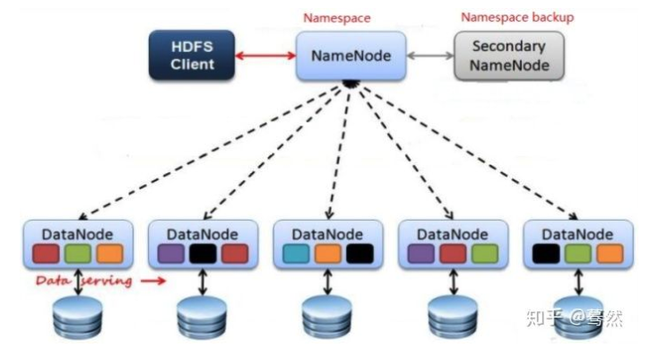

### HDFS面试题
#### 1、HDFS中Block默认保存几份？
默认保存3份

#### 2、HDFS默认BlockSize是
128MB（2.7.2版本，分布式模式）

#### 3、Client上传文件时候：
Client端将文件切分为Block，依次上传；Client只上传数据到一台DataNode，然后由NameNode负责Block负责工作

#### 4、下面哪个程序负责HDFS数据存储
DataNode

#### 5、关于SecondaryNameNode：
它的目的是帮助NameNode合并编辑日志和镜像，减少NameNode 启动时间

#### 6、能NameNode在一个节点启动
JobTracker

hadoop的集群是基于master/slave模式，namenode和jobtracker属于master，datanode和tasktracker属于slave，master只有一个，而slave有多个。

SecondaryNameNode内存需求和NameNode在一个数量级上，所以通常secondary NameNode（运行在单独的物理机器上）和 NameNode 运行在不同的机器上。

JobTracker对应于NameNode,TaskTracker对应于DataNode。

DataNode和NameNode是针对数据存放来而言的。JobTracker和TaskTracker是对于MapReduce执行而言的。

#### 7、文件大小默认为64M，改为128M有啥影响？
增加文件块大小，需要增加磁盘的传输速率

#### 8、HDFS存储机制
HDFS存储机制，包括HDFS的写入过程读取过程两个部分
- 写入过程
    + 客户端向NameNode请求上传文件，nameNode检查目标文件是否已存在，父目录是否存在
    + namenode返回是否可以上传
    + 客户端请求第一个block上传到到哪几个datanode服务器上
    + namenode返回3个datanode节点，分别为dn1、dn2、dn3
    + 客户端请求dn1上传数据，dn1收到请求会继续调用dn2,然后dn2调用dn3，将这个通信管道建立完成
    + dn1、dn2、dn3逐级应答客户端
    + 客户端开始往dn1上传第一个block（先从磁盘读取数据放到一个本地内存缓存），以packet为单位，dn1收到一个packet就会传给dn2，dn2传给dn3；dn1每传一个packet会放入一个应答队列等待应答
    + 当一个block传输完成之后，客户端再次请求namenode上传第二个block的服务器。（重复执行3-7步）

- 读入过程
    + 客户端向namenode请求下载文件，namenode通过查询元数据，找到文件块所在的datanode地址。
    + 挑选一台datanode（就近原则，然后随机）服务器，请求读取数据。
    + datanode开始传输数据给客户端（从磁盘里面读取数据放入流，以packet为单位来做校验）。
    + 客户端以packet为单位接收，先在本地缓存，然后写入目标文件。

#### 9、secondaryNameNode工作机制（）
- 第一阶段：namenode启动
    + （1）第一次启动namenode格式化后，创建fsimage和edits文件。如果不是第一次启动，直接加载编辑日志和镜像文件到内存。
    + （2）客户端对元数据进行增删改的请求
    + （3）namenode记录操作日志，更新滚动日志。
    + （4）namenode在内存中对数据进行增删改查
- 第二阶段：Secondary NameNode工作
    + SecondaryNameNode询问namenode是否需要checkpoint。直接带回namenode是否检查结果。
    + SecondaryNameNode请求执行checkpoint。
    + namenode滚动正在写的edits日志
    + 将滚动前的编辑日志和镜像文件拷贝到Secondary NameNode
    + SecondaryNameNode加载编辑日志和镜像文件到内存，并合并。
    + 生成新的镜像文件fsimage.chkpoint
    + 拷贝fsimage.chkpoint到namenode
    + namenode将fsimage.chkpoint重新命名成fsimage

#### 10、NameNode与SecondaryNameNode的区别
- 机制流程同上；
- 区别
    + **NameNode负责管理整个文件系统的元数据，以及每一个路径（文件）多对应的数据块信息**
    + SecondaryNameNode主要用于定期合并命名空间镜像和命名空间镜像的编辑日志
- 联系
    + SecondaryNameNode中保存了一份和NameNode一直的镜像文件（fsimage）和编辑日志（edits）
    + 在主nameNode发生故障时（假设没有及时备份数据），可以从SecondaryNameNode中恢复数据

#### 11、Hadoop节点动态上线下线怎么操作
- (1)节点上线操作
当要新上线数据节点的时候，需要把数据节点的名字追加在 dfs.hosts 文件中

（1）关闭新增节点的防火墙

（2）在 NameNode 节点的 hosts 文件中加入新增数据节点的 hostname

（3）在每个新增数据节点的 hosts 文件中加入 NameNode 的 hostname

（4）在 NameNode 节点上增加新增节点的 SSH 免密码登录的操作

（5）在 NameNode 节点上的 dfs.hosts 中追加上新增节点的 hostname,

（6）在其他节点上执行刷新操作：hdfs dfsadmin -refreshNodes

（7）在 NameNode 节点上，更改 slaves 文件，将要上线的数据节点 hostname 追加

到 slaves 文件中

（8）启动 DataNode 节点

（9）查看 NameNode 的监控页面看是否有新增加的节点

- (2)节点下线操作

（1）修改/conf/hdfs-site.xml 文件

（2）确定需要下线的机器，dfs.osts.exclude 文件中配置好需要下架的机器，这个是阻

止下架的机器去连接 NameNode。

（3）配置完成之后进行配置的刷新操作./bin/hadoop dfsadmin -refreshNodes,这个操作的作用是在后台进行 block 块的移动。

（4）当执行三的命令完成之后，需要下架的机器就可以关闭了，可以查看现在集群上连接的节点，正在执行 Decommission，会显示：Decommission Status : Decommission in progress 执行完毕后，会显示：Decommission Status :Decommissioned

（5）机器下线完毕，将他们从excludes 文件中移除。

#### 12、HDFS整体架构介绍

架构主要由是四个部分组成：分别是HDFS Client、NamenNode、DataNode和Secondary NameNode.
##### Client：就是客户端
- 文件切分。文件上传HDFS的时候，Client将文件切分为一个个的Block，然后进行存储
- 与NameNode交互，获取文件的位置信息
- 与DataNode交互，读取或者写入数据；
- Client提供提供一些命令来管理HDFS，比如启动或者关闭HDFS
- Client可以通过一些命令来访问HDFS

##### NameNode: 就是Master,它是一个主管、管理者
- 管理HDFS的命名空间
- 管理数据块Block映射信息
- 配置副本策略
- 处理客户端读写请求

##### DataNode :就是Slave。NameNode 下达命令，DataNode执行实际的操作
- 存储实际的数据块
- 执行数据库的读写操作

##### Secondary NameNode: 并非NameNode的热备。当Namenode挂掉的时候，它并不能马上替换NameNode并提供服务
- 辅助NameNode，分担其工作量
- 定期何合并Fsimage何Edits，并推送给NameNode
- 在紧急情况下，可辅助恢复NameNode

##### 为什么hdfs不支持随机写？
hdfs 是块存储，也就是每次读取一个块，存储也是一样的，所以你可以理解为可以随机读写文件块，但是对文件不支持随机读写，因为一个文件块中有很多文件

##### HDFS写入数据为什么不直接分发给三个节点？

HDFS数据写入时是将数据先写入第一个节点，然后第一节点写给第二节点，然后第二节点写给第三节点，然后写入才完成。如果是同步的，每次写操作都必须要等待第三个节点写完并返回成功后才能写下一条数据，那么确实和直接分发给三个节点是一样的。如果写给第一个节点后，write即可返回，进行下一次写操作了。这时，第一个节点一边在给下一个节点写数据，一边在接收client传来的数据。同时利用了输入输出带宽。假设每次从一个节点写一包数据到另一个节点耗时是t，而整个文件有n个这种数据包，则整体写入耗时为： (n + 2) * t，而直接分发给三个节点的耗时为 3 * n * t实际上，hdfs write的时候只需要把数据写到缓冲区就可以返回进行下一条写操作了，连写成功第一个节点都不必要，真正计算起来基本上就是 数据大小/网络带宽 + 3 * 网络传输时延了。不要被 逆向ack传递 给误导了，确实ack是逆向传递，三个节点都ack，一个包才算ack，但这并不影响我把数据放到缓冲区里就可以发下一条数据了——跟TCP/IP协议很像。之前刚入行分布式时，就听前辈说过，做分布式系统，好多时候就是把TCP/IP协议重新实现了一遍。现在来看，确实很有道理。