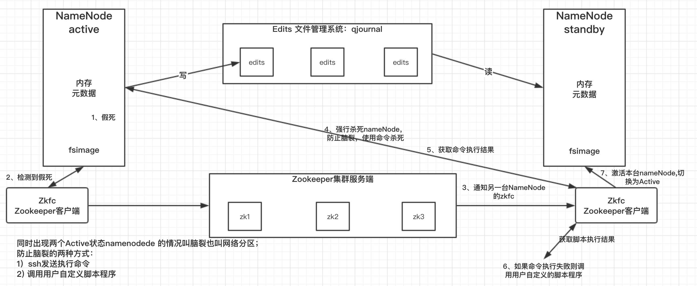
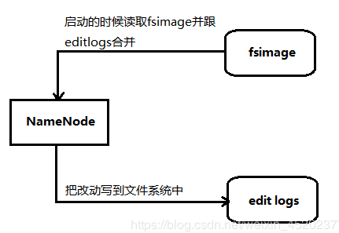
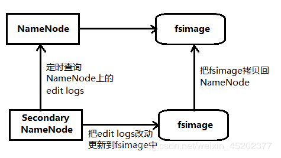
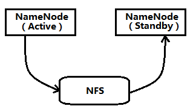
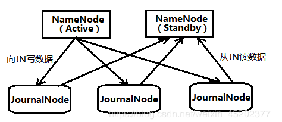
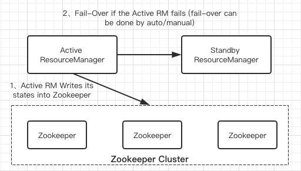
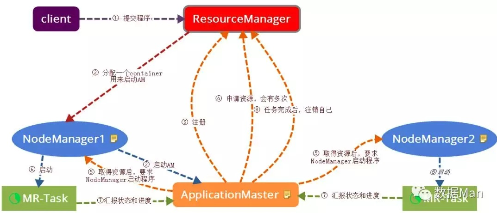
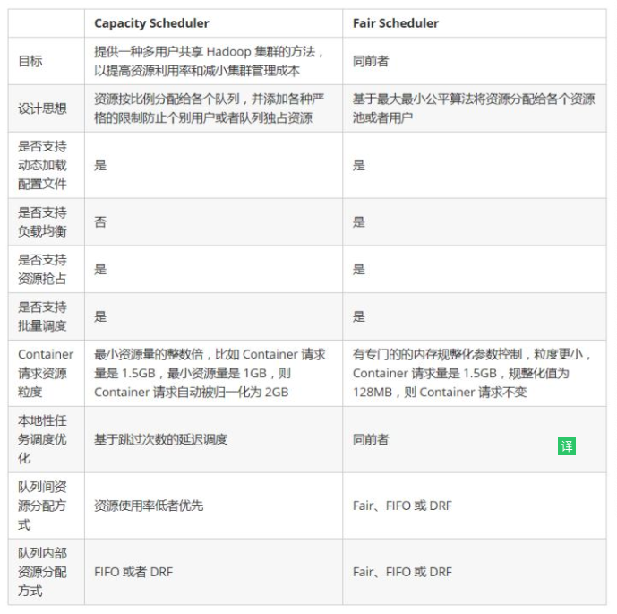
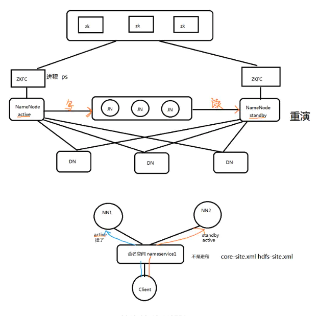
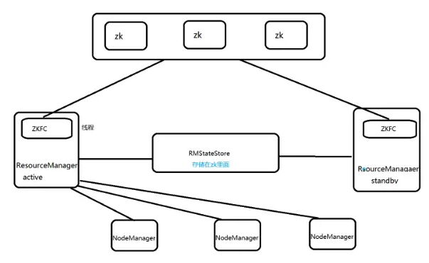

### Hadoop HA高可用
#### HA概述
- 所谓HA(High Available)，即高可用（7*24小时不中断服务）
- 实现高可用最关键的策略就是消除单点故障，HA分为 HDFS的HA和YARN的HA
- Hadoop2.0之前，在HDFS集群在哪个NameNode存在单点故障
- NameNoe主要在以下方面影响HDFS集群
    + Name机器发生意外，如宕机，集群将无法使用，知道管理员重启
    + NameNode机器需要升级，包括软件、硬件升级，此时集群也将无法使用
HDFS HA功能通过配置Active/Standby两个NameNodes实现在集群中对NameNode的热备来解决上述问题。如果出现故障，如机器崩溃或机器需要升级维护，这时可通过此种方式将NameNode很快的切换到另外一台机器。

注意：

主从架构 master--->slave

1.DN NM部署在同一个机器上 原因是由于数据本地化。

2.大数据生态圈 大部分组件都是主从架构

**但是特别注意:hbase读写流程并不经过master进程。**

#### HDFS-HA工作机制
通过双NameNode消除单点故障

#### HDFS-HA工作要点
##### 1）元数据管理方式需要改变
内存中各自保存一份元数据;

Edits日志只有Active状态的NameNode节点可以做写操作；

两个NameNode都可以读取Edits;

共享的Edits放在一个共享存储中管理（Quorum Journal）

##### 2）需要一个状态管理功能模块
实现了一个zkfailover,常驻在每一个NameNode所在的节点，每一个zkfailover负责监控自己所在的NameNode节点，利用zk进行状态标识，但需要进行状态切换时，由zkfailover来负责切换，切换时需要防止brain split现象的发生。

##### 3）必须保证两个NameNode之间能够ssh无密登录
##### 4）隔离(Fence),即同一时刻仅仅有一个NameNode对外提供服务

#### HDFS-HA自动故障转移工作机制
HA自动故障转移为HDFS部署增加了两个新组件：

ZooKeeper和ZKFailoverController(ZKFC)进程。Zookeeper进群维护了少量的协调数据，通知客户端这些数据的改变和监视客户端故障的高可用服务，HA的自动故障转移依赖于Zookeeper的以下功能：

- **故障检测**：集群中的每个NameNode在Zookeeper中维护了一个持久会话，但是只有一个NameNode能成功创建临时节点（其他NameNode会对该节点添加watcher），如果成功创建节点会话机器宕机，Zookeeper中的会话将终止，Zookeeper会通知另一个NameNode需要触发故障转移。
- **现役NameNode选择**：Zookeeper提供了一个简单的机制用于唯一的选择一个节点为active状态。如果目前现役NameNode奔溃，另一个节点可能从Zookeeper获得特殊的排外锁以表明它应该成为现役NameNode。

ZKFC 是自动故障转移中的另一个新组件，是Zookeeper的客户端，也监视和管理NameNode的状态。每个运行NameNode的主机运行了一个ZkFC进程，zkfc负责以下功能：

- ****健康检测**：ZKFC使用一个健康检查命令定期地ping与之在相同主机的NameNode，只要该NameNode及时地回复健康状态，ZKFC认为该节点是健康的。如果该节点奔溃，或进入不健康状态，健康检测器表示该节点为非健康。
- **Zookeeper会话管理**：当本地Active的NameNode是健康的，ZKFC会保持一个在Zookeeper中打开的会话。如果本地NameNode处于active，会在Zookeeper中成功建立一个临时节点，如果会话终止，该节点会自动删除，下一个成功创建该临时节点的NameNode将成为Active
- **基于Zookeeper的选择**：如果本地的NameNode是健康的，且ZKFC发现在Zookeeper中临时节点没有被创建，则创建该临时节点。如果成功，则成功成为Active节点，并负责运行故障转移进程以使它的本地NameNode为Active。故障转移进程与前面描述的手动故障转移相似，首先如果必要保护之前的现役NameNode，然后本地NameNode转换为Active状态。
- 在zookeeper中临时节点 /hadoop-ha/mycluster/ActiveStandbyElectorLock

#### Hadoop中SecondaryNameNode 和HA（高可用）区别
在Hadoop2.0之前，NameNode只有一个，存在单点问题（虽然Hadoop1.0有SecondaryNameNode，CheckPointNode，BackupNode这些，但是单点问题依然存在），在hadoop2.0引入了HA机制。Hadoop2.0的HA机制官方介绍了有2种方式，一种是NFS（Network File System）方式，另外一种是QJM（Quorum Journal Manager）方式。

##### 一、SecondaryNameNode介绍
Secondary NameNode名字给人感觉像是NameNode的备份，实际不是。在深入了解Secondary NameNode之前，我们先来看看NameNode是做什么的。

NameNode

NameNode主要用来保存HDFS的元数据信息，比如命名空间信息，块信息等。当它运行的时候，这些信息在内存，也可以持久化到磁盘上。

上图展示了NameNode怎么把元数据保存到磁盘上。这里有两个不同的文件：

1、fsimage：它是在NameNode启动时，对整个文件系统的快照。

2、edit logs：它是在NameNode启动后，对文件系统的改动序列。

只有在NameNode重启时，edit logs才会合并到fsimage文件中，从而得到一个文件系统的最新快照。但是在产品集群（比如Ambari或ClouderManager）中NameNode是很少重启的，这也意味着当NameNode运行了很长时间后，edit logs文件会变得很大。

在这种情况下就会出现下面一些问题：

1、edit logs文件会变的很大，怎么去管理这个文件是一个挑战。

2、NameNode的重启会花费很长时间，因为有很多改动（在edit logs中）要合并到fsimage文件上。

3、如果NameNode挂掉了，那我们就丢失了很多改动，因为此时的fsimage文件非常旧。

因此为了克服这个问题，我们需要一个易于管理的机制来帮助我们减小edit logs文件的大小和得到一个最新的fsimage文件，这样也会减小在NameNode上的压力。这跟Windows的恢复点是非常像的，Windows的恢复点机制允许我们对OS进行快照，这样当系统发生问题时，我们能够回滚到最新的一次恢复点上。

现在我们明白了NameNode的功能和所面临的挑战 ：保持文件系统最新的元数据。那么，这些跟Secondary NameNode又有什么关系呢？

Secondary NameNode

SecondaryNameNode就是来帮助解决上述问题的，它的职责是合并NameNode的edit logs到fsimage文件中。

上图展示了Secondary NameNode是怎么工作的：

1、首先，它定时到NameNode去获取edit logs，并更新到fsimage上。（Secondary NameNode自己的fsimage）

2、一旦它有了新的fsimage文件，它将其拷贝回NameNode中。

3、NameNode在下次重启时会使用这个新的fsimage文件，从而减少重启的时间。

Secondary NameNode的整个目的是在HDFS中提供一个检查点，它只是NameNode的一个助手节点，帮助NameNode更好的工作，这也是它在社区内被认为是检查点节点的原因。它不是要取代掉NameNode也不是NameNode的备份。所以从现在起，让我们养成一个习惯，称呼它为检查点节点吧。

#### 二、HA（高可用）介绍

Hadoop2.0的HA 机制有两个NameNode，一个是Active状态，另一个是Standby状态。两者的状态可以切换，但同时最多只有1个是Active状态。只有Active Namenode提供对外的服务。Active NameNode和Standby NameNode之间通过NFS或者JN（JournalNode，QJM方式）来同步数据。

**Active NameNode会把最近的操作记录写到本地的一个edits文件中（edits file），并传输到NFS或者JN中。Standby NameNode定期的检查，从NFS或者JN把最近的edit文件读过来，然后把edits文件和fsimage文件合并成一个新的fsimage，合并完成之后会通知Active NameNode获取这个新fsimage。Active NameNode获得这个新的fsimage文件之后，替换原来旧的fsimage文件。**

**这样，保持了Active NameNode和Standby NameNode的数据实时同步，Standby NameNode可以随时切换成Active NameNode（譬如Active NameNode挂了）。而且还有一个原来Hadoop1.0的SecondaryNameNode，CheckpointNode，BackupNode的功能：合并edits文件和fsimage文件，使fsimage文件一直保持更新。所以启动了hadoop2.0的HA机制之后，SecondaryNameNode，CheckpointNode，BackupNode这些都不需要了。**

数据同步方式：NFS与 QJM（Quorum Journal Manager ）

###### NFS

NFS作为Active NameNode和Standby NameNode之间数据共享的存储。Active NameNode会把最近的edits文件写到NFS，而Standby NameNode从NFS中把数据读过来。这个方式的缺点是，如果Active NameNode或者Standby Namenode有一个和NFS之间网络有问题，则会造成他们之前数据的同步出问题。

###### QJM（Quorum Journal Manager ）

QJM的方式可以解决上述NFS容错机制不足的问题。Active NameNode和Standby NameNode之间是通过一组JournalNode（数量是奇数，可以是3,5,7…,2n+1）来共享数据。Active NameNode把最近的edits文件写到2n+1个JournalNode上，只要有n+1个写入成功就认为这次写入操作成功了，然后Standby NameNode就可以从JournalNode上读取了。可以看到，QJM方式有容错机制，可以容忍n个JournalNode的失败。

###### Active和Standby两个NameNode之间的数据交互流程为：
1）NameNode在启动后，会先加载FSImage文件和共享目录上的EditLog Segment文件；

2）Standby NameNode会启动EditLogTailer线程和StandbyCheckpointer线程，正式进入Standby模式；

3）Active NameNode把EditLog提交到JournalNode集群；

4）Standby NameNode上的EditLogTailer 线程定时从JournalNode集群上同步EditLog；

5）Standby NameNode上的StandbyCheckpointer线程定时进行Checkpoint，并将Checkpoint之后的FSImage文件上传到Active NameNode。（在Hadoop 2.0中不再有Secondary NameNode这个角色了，StandbyCheckpointer线程的作用其实是为了替代 Hadoop 1.0版本中的Secondary NameNode的功能。）

QJM方式有明显的优点，一是本身就有fencing的功能，二是通过多个Journal节点增强了系统的健壮性，所以建议在生产环境中采用QJM的方式。JournalNode消耗的资源很少，不需要额外的机器专门来启动JournalNode，可以从Hadoop集群中选几台机器同时作为JournalNode。

Active NameNode和Standby NameNode可以随时切换，可以人工和自动。人工切换是通过执行HA管理命令来改变NameNode的状态，从Standby到Active，或从Active到Standby。自动切换则在Active NameNode挂掉的时候，Standby NameNode自动切换成Active状态。

主备NameNode的自动切换需要配置Zookeeper。Active NameNode和Standby NameNode把他们的状态实时记录到Zookeeper中，Zookeeper监视他们的状态变化。当Zookeeper发现Active NameNode挂掉后，会自动把Standby NameNode切换成Active NameNode。

#### YARN HA介绍
##### ResourceManager HA 方案
架构图

和之前介绍过的HDFS NameNode高可用实现类似，Yarn的ResourceManager HA采用的也是基于共享内存的主备方案，只不过yarn的共享内存是Zookeeper。由于ResourceManager不会保存已经分配的ApplicationMaster的资源信息和每个NodeManager的资源使用情况，所以它的HA是比较轻量级的

##### 与NameNode HA的区别？
- 1）NN HA(NameNode)中，DataNode会同时向Active NN和Standby NN发送心跳； RM HA中，nodeManager只会向Active RM发送心跳
- RM HA的选举机制内健在RM里面（EmbeddedElectorService）,而NN(NameNode)HA是用单独的ZKFC进程进行选举的（注意：RM HA中也有ZKFC,但是是ZKFC线程）

##### Yarn任务提交流程

- 1、用户向Yarn提交程序，ResourceManager接受到客户端请求
- 2、ResourceManager分配第一个Container，并选择一个NodeManager，要求它在这个Container下启动ApplicationMaster
- 3、ApplicationMaster启动后，向ResourceManager发起注册请求
- 4、ApplicationMaster向ResourceManager申请资源
- 5、获取资源后，根据资源，向相关的NodeManager通信，要求其启动程序
- 6、NodeManager（多个）启动任务
- 7、NodeManager不断汇报任务状态和进展给ApplicationMaster
- 8、当任务全部完成时，ApplicationMaster向ResourceManager汇报任务完成，并注销自己

##### Yarn的资源隔离方式
- 对于内存，可以采用进程监控
- 对于CPU,采用Cgroups方案

##### Yarn资源保证机制
- 1、增量资源分配
    + 当应用程序申请的资源暂时无法保证时，**优先为其预留**一个节点上的资源知道累积释放的空闲资源满足需求为止
- 2、一次性资源分配
    + 当应用程序申请的资源暂时无法保证时，暂时放弃当前资源直到出现一个节点的剩余资源能够一次性满足需求为止。
前者会造成资源浪费，后者会产生饿死现象一直等下去，**Yarn采用增量资源分配机制**

##### Yarn什么时候会发生资源抢占
每个队列会设置最小资源量和最大资源量，**为了提高资源利用率**资源调度器会将负载比较轻的队列A的资源暂时分配给负载中的队列B，这个时候A的 **最小资源量可能没有满足**，如果此时A突然收到新提交的应用申请资源时，可能就需要从B中抢回属于A的那部分资源。

##### Yarn资源协调器的分类
资源调度器关注的是如何将节点上空闲的资源分配给应用程序。

**FIFO**

hadoop 1.x 使用的默认调度器就是 FIFO，FIFO采用队列方式将一个一个job任务按照时间先后顺序进行服务。

***Capacity Scheduler***

hadoop 2.x 使用的默认调度器是 Capacity Scheduler，主要特点是可以为每个队列设置资源最低保证和资源使用上限，而所有提交到该队列的应用程序共享这些资源。

**Fair Scheduler**

Facebook 开发的，主要特点是可以为每个队列单独设置调度策略（当前支持 FIFO、Fair、DRF 三个策略）

**Capacity Scheduler 和 Fair Scheduler 的区别**（来自董西成《Hadoop技术内幕》）

附最大最小公平算法：

首先假定用户集合有 n 个用户，1 到 n，他们对资源的需求已经排序完毕，满足 s1< s2< .... < sn，资源总量为 S。

将资源 S/n 分配给需求最小的用户1，这很可能已经超出了用户1的需求；
将超出的部分回收，再次将 (S-s1) / (n-1) 的资源分配给用户2，依次次重复上述过程，直到某一次分给该用户的资源不满足该用户的需求；
假定当分配到第 k 个用户时，分配到的资源不能达到该用户的需求，那么就将剩下的资源，平均分配给未获得资源的所有用户，至此，分配任务结束。

#### Quorum Journal(QJM) 是使用Paxos算法实现
基于 QJM 的共享存储系统主要用于 **保存 EditLog，并不保存 FSImage 文件**。FSImage 文件还是在 NameNode 的本地磁盘上。QJM 共享存储的基本思想来自于 Paxos 算法，采用多个称为 JournalNode 的节点组成的 JournalNode 集群来存储 EditLog。每个 JournalNode 保存同样的 EditLog 副本。每次 NameNode 写 EditLog 的时候，除了向本地磁盘写入 EditLog 之外，也会并行地向 JournalNode 集群之中的每一个 JournalNode 发送写请求，只要大多数 (majority) 的 JournalNode 节点返回成功就认为向 JournalNode 集群写入 EditLog 成功。如果有 2N+1 台 JournalNode，那么根据大多数的原则，最多可以容忍有 N 台 JournalNode 节点挂掉。

#### 4、HDFS & YARN HA架构两者的区别
1. zkfc一个是进程一个是线程
2. hdfs ha由独立的数据中间件的集群维护，yarn ha作业调度信息维护在zk里面
3. HDFS中的DataNode会向两个NameNode同时发送心跳，Yarn中NodeManager只会向activeRM上报资源

##### 4.1 HDFS HA架构图

HA使用active NN, standby NN两个节点解决单点问题。两个NN节点通过JN集群，
共享状态，通过ZKFC选举active，监控状态，自动备援。DN会同时向两个NN节点发送心跳。

###### 4.1.1 active nn：
接收client的rpc请求并处理，同时自己editlog写一份，也向JN的共享存储上的editlog写一份。也同时接收DN的block report，block location updates 和 heartbeat。

###### 4.1.2 standby nn:
同样会接受到从JN的editlog上读取并执行这些log操作，使自己的NN的元数据和activenn的元数据是同步的，使用说standby是active nn的一个热备。一旦切换为active状态，就能够立即马上对外提供NN角色的服务。也同时接收DN的block report，block location updates 和 heartbeat。

###### 4.1.3 ###### 4.1.1 jn：
用于active nn,standby nn的同步数据，本身由一组的JN节点组成的集群，奇数，3台(CDH)，是支持Paxos协议。保证高可用。

###### 4.1.4 ZKFC：
监控NN的健康状态。向ZK集群定期发送心跳 ，让自己被选举，当自己被ZK选举为主时，zkfc进程通过rpc调用让nn转换为active状态

###### 4.1.5 拓展：
结果双写：spark-->hbase(所有数据)+es(对外 两个月的数据 ttl)
数据同步双写:mysql-->habse 设置A线，B线两种同步方案

##### 4.2 Yarn HA架构图

###### 4.2.1 RM:
- a.启动时会通过向ZK的/hadoop-ha目录写一个lock文件，写成功则为active，否则standby。
standby RM会一直监控lock文件的是否存在，如果不存在就会尝试去创建，争取为active rm。
- b.active RM 会接收客户端的任务请求，接收和监控nm的资源的汇报，负责资源的分配与调度，启动和监控 ApplicationMaster（AM）

###### 4.2.2 NM:
节点上的资源的管理，启动container 容器 运行task的计算，上报资源，container情况汇报给RM和任务的处理情况汇报给 ApplicationMaster（AM）

ApplicationMaster（AM）driver : nm机器上的container
单个application(job)的task的管理和调度，并向rm进行资源的申请，
向nm发出 launch container指令，接收NM的task的处理状态信息。

###### 4.2.3 RMstatestore:
- a.RM的作业信息存储在ZK的/rmstore下，active RM向这个目录写app(作业)信息
- b.当active rm挂了，另外一个standby rm成功转换为active rm后，会从/rmstore目录读取相应的作业信息，
重新构建作业的内存信息。然后启动内部服务，开始接收NM的心跳，构建集群资源的信息，并接收客户端的提交作业的请求等。

###### 4.2.4 ZKFC:
自动故障转移 只作为RM进程的一个线程 而非独立的守护进程来启动

