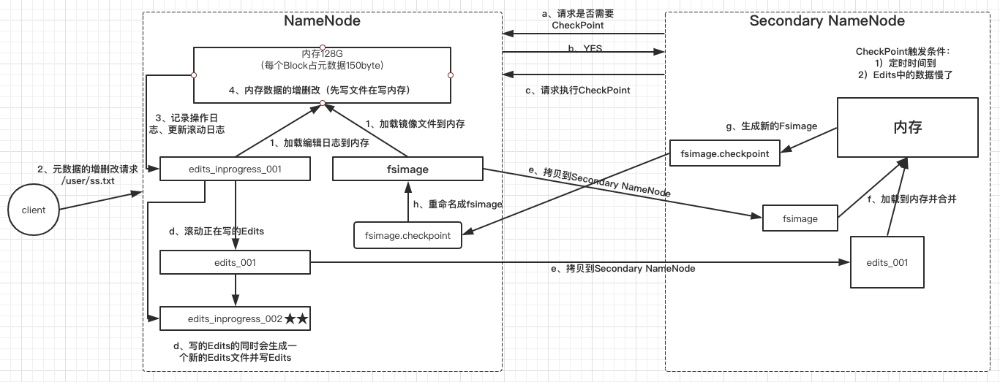

### NameNode和SecondaryNameNode
- 如果让你设计HDFS你怎么设计？
- NN和2NN工作机制

#### 如果让你设计HDFS你怎么设计？
- 元数据信息存哪？
    + 放在磁盘性能太差，放在内存，需要持久化，持久化在哪？
    + 采用RDB和AOF（参考Redis）
        * RDB生成比较慢，占内存相较AOF小，恢复加载快，会丢失一段时间（几分钟内）数据
        * AOF生成快，每一个操作指令都会记录，安全性高，会丢失1s或几秒的数据，缺点，占用空间大，加载慢
        * AOF安全性高，RDB低一些
    + 类RDB方案、类AOF方案
        * 因为HDFS对数据的一致性和安全性要求比较高，因此采用类AOF持久化策略--即edits.log
        * 缺点：大，生成慢，加载慢
        * 因为其加载慢其大数据数据量大，因此需要一种加载快的方案：类RDB--即Fsimage
        * Fsimage有个缺点就是 在生成镜像的时候不能写数据，这样会造成HDFS只能提供读服务
    + 那么既要生成安全且生成快的edits.log也要同时提供读写服务的同时生成Fsimage
        * 2NN出现的原因？（来历) 2NN就是NN的秘书（生成一个完整的时间表--持久化文件）
        * 2NN就是NN生成的edits.log合并生成Fsimage
    + 来了一条谢请求之后，然后是先更新文件还是先更新内存？
        * HDFS对文件安全性要求高，那么先更新文件后更新缓存
- 文件分块，块放在哪？
- 高可用HA, 元数据信息副本机制、文件块副本机制

#### NameNode 的工作机制 NN与2NN之间的关系？NN是怎么存文件的？存文件的过程？
思考：NameNode中的元数据是存储在哪里的？

首先我们做个假设，如果存储在NameNode节点的磁盘中，因为要经常进行随机访问，还有响应客户的请求，必然效率过低。因此，元数据需要存放在内存中，但是如果只存在内存中，一旦断电，元数据丢失，整个集群就无法工作了。因此出现了 **在磁盘中备份的元数据信息的FsImage**.

这样又会带来新的问题，当在内存中的元数据更新时，如果同时更新FsImage，就会导致效率过低，但是如果不更新，就会发生一致性问题，一旦NameNode节点断电，就会出现数据丢失。

因此，引入Edits文件（只进行追加操作，效率很高）。每当元数据由更新或者添加元数据时，修改内存中的元数据并追加到Edits中。这样一旦NameNode节点断电，可以通过FsImage和Edits的合并，合成元数据。

但是，如果长时间添加数据到Edits中，会导致该文件数据过大，效率降低，而且一旦断电，恢复元数据需要的时间过长。因此，需要定期进行FsImage和Edits的合并，如果这个操作由NameNode节点完成，又会效率过低。因此，引入一个新的节点SecondaryNamenode，专门用于FsImage和Edits的合并。

NN和secondaryNameNode 的工作机制，如图所示：

##### (1) 第一阶段：NameNode启动
- 第一次启动NameNode格式化之后，创建Fsimage和Edits文件。如果不是第一次启动，直接加载编辑日志和镜像文件到内存。
- 客户端对元数据进行增删改的请求
- NameNode记录操作日志，更新滚动日志
- NameNode在内存中对元数据进行增删改。

##### (2) 第二阶段：Secondary NameNode工作
- Secondary NameNode询问NameNode是否需要是否需要CheckPoint。直接带回 NameNode是否需要checkpoint的检查结果。
- 如果返回yes，则Secondary NameNode请求执行CheckPoint
- NameNode滚动正在编写的Edits日志
- 将滚动前的编辑日志和镜像日志文件拷贝到Secondary NameNode
- Secondary NameNode加载编辑日志和镜像文件到内存，并合并
- 生成新的镜像文件fsimage.chkpoint
- 拷贝fsimage.chkpoint到NameNode
- NameNode将fsimage.chkpoint重新命名成fsimage

NN和2NN工作机制详解：

Fsimage：NameNode内存中元数据序列化后形成的文件。

Edits：记录客户端更新元数据信息的每一步操作（可通过Edits运算出元数据）。

NameNode启动时，先滚动Edits并生成一个空的edits.inprogress，然后加载Edits和Fsimage到内存中，此时NameNode内存就持有最新的元数据信息。Client开始对NameNode发送元数据的增删改的请求，这些请求的操作首先会被记录到edits.inprogress中（查询元数据的操作不会被记录在Edits中，因为查询操作不会更改元数据信息），如果此时NameNode挂掉，重启后会从Edits中读取元数据的信息。然后，NameNode会在内存中执行元数据的增删改的操作。
由于Edits中记录的操作会越来越多，Edits文件会越来越大，导致NameNode在启动加载Edits时会很慢，所以需要对Edits和Fsimage进行合并（所谓合并，就是将Edits和Fsimage加载到内存中，照着Edits中的操作一步步执行，最终形成新的Fsimage）。SecondaryNameNode的作用就是帮助NameNode进行Edits和Fsimage的合并工作。

SecondaryNameNode首先会询问NameNode是否需要CheckPoint（触发CheckPoint需要满足两个条件中的任意一个，定时时间到和Edits中数据写满了）。直接带回NameNode是否检查结果。SecondaryNameNode执行CheckPoint操作，首先会让NameNode滚动Edits并生成一个空的edits.inprogress，滚动Edits的目的是给Edits打个标记，以后所有新的操作都写入edits.inprogress，其他未合并的Edits和Fsimage会拷贝到SecondaryNameNode的本地，然后将拷贝的Edits和Fsimage加载到内存中进行合并，生成fsimage.chkpoint，然后将fsimage.chkpoint拷贝给NameNode，重命名为Fsimage后替换掉原来的Fsimage。NameNode在启动时就只需要加载之前未合并的Edits和Fsimage即可，因为合并过的Edits中的元数据信息已经被记录在Fsimage中。

#### NN和2NN之间的内存状态是否是一致的？
NN和2NN的内存状态是不一致，差在图中★★的小纸条。 所以，2NN只能辅助NN工作，并不能替代NN

