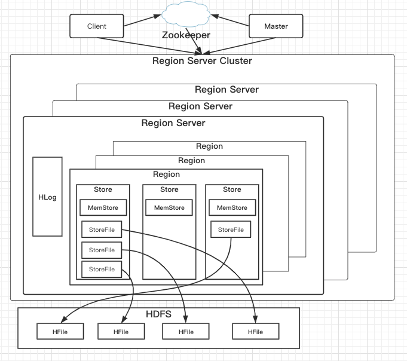
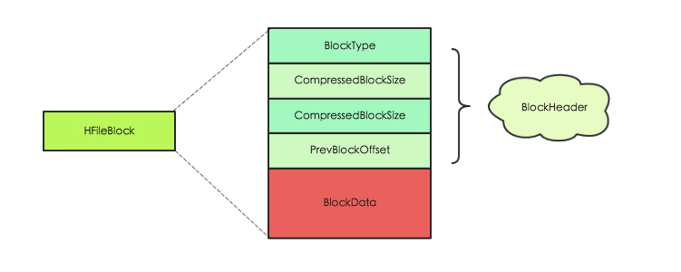
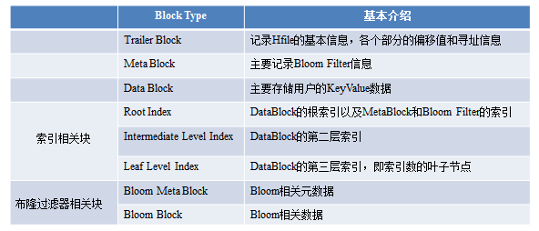

### HBase实践之HFile结构
- HFile在HBase架构中的位置
- 什么HFile
- HFile的逻辑结构
- HFile逻辑结构的优点
- HFile物理结构
- HFile生成流程
- HFile中Block块解析
> https://www.cnblogs.com/small-k/p/9715810.html

#### HFile在HBase架构中的位置



如上图所示，HFile是HBase最底层的文件组织形式。
```java
Table
    --N Region
        --N Store
            --N StoreFile
                --HFile(StoreFile与HFile是一对一)、
```

#### 什么是HFile
HFile是HBase存储数据的文件组织形式

HFile逻辑结构--HFile V2设计


件主要分为四个部分：Scanned block section，Non-scanned block section，Opening-time data section和Trailer。

Scanned block section：顾名思义，表示顺序扫描HFile时所有的数据块将会被读取，包括Leaf Index Block和Bloom Block。

Non-scanned block section：表示在HFile顺序扫描的时候数据不会被读取，主要包括Meta Block和Intermediate Level Data Index Blocks两部分。

Load-on-open-section：这部分数据在HBase的region server启动时，需要加载到内存中。包括FileInfo、Bloom filter block、data block index和meta block index。

Trailer：这部分主要记录了HFile的基本信息、各个部分的偏移值和寻址信息。

#### HFile逻辑结构的优点
- 分层索引
    + Data Block的索引，在HFile V2中最多可支持三层索引：
- Root Data Index
    + Intermediate Index Block
        * Leaf Index Block
            - Data Block

- 交叉存放

在”Scanned Block Section“区域，Data Block(存放用户数据KeyValue)、存放Data Block索引的Leaf Index Block(存放Data Block的索引)与Bloom Block(Bloom Filter数据)交叉存在。

- 按需读取
-
无论是Data Block的索引数据，还是Bloom Filter数据，都被拆成了多个Block，基于这样的设计，无论是索引数据，还是Bloom Filter，都可以按需读取，避免在Region Open阶段或读取阶段一次读入大量的数据，有效降低时延。

将索引分级后，RegionServer不需要将所有索引都加载，加载一级索引即可。

### HFile物理结构
所有block块都拥有相同的数据结构，如图左侧所示，HBase将block块抽象为一个统一的HFileBlock。HFileBlock支持两种类型，一种类型不支持checksum，一种不支持。


不支持checksum的HFileBlock内部结构：



HFileBlock主要包括两部分：BlockHeader和BlockData。其中BlockHeader主要存储block元数据，BlockData用来存储具体数据。

block元数据中最核心的字段是BlockType字段，用来标示该block块的类型，HBase中定义了8种BlockType，每种BlockType对应的block都存储不同的数据内容，有的存储用户数据，有的存储索引数据，有的存储meta元数据。对于任意一种类型的HFileBlock，都拥有相同结构的BlockHeader，但是BlockData结构却不相同。

每种BlockType进行详细的讲解：

