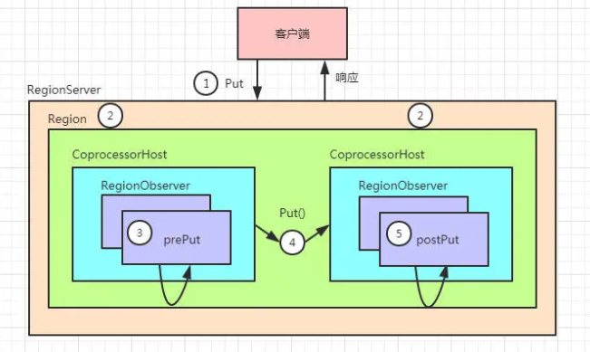

### HBase数据库介绍及原理说明
HBase是分布式存储数据库

#### HBase的特点
- 海量存储
- 列式存储： 这里说的列式存储其实说的是 **列族(ColumnFamily)存储**，Hbase是根据列族来存储数据的。列族下面可以有非常多的列，列族在创建表的时候就必须指定。
- 极易扩展
Hbase的扩展性主要体现在两个方面，一个是基于上层处理能力（RegionServer）的扩展，一个是基于存储的扩展（HDFS）。
通过横向添加RegionSever的机器，进行水平扩展，提升Hbase上层的处理能力，提升Hbsae服务更多Region的能力。
备注：RegionServer的作用是管理region、承接业务的访问，这个后面会详细的介绍通过横向添加Datanode的机器，进行存储层扩容，提升Hbase的数据存储能力和提升后端存储的读写能力。

- 高并发(多核)

#### HBase架构


从图中可以看出HBase是由Client、Zookeeper、Master、HRegionServer、HDFS等几个组件组成，下面来介绍下几个组件的相关功能。
##### 1）Client
Client包含了访问Hbase的接口，另外Client还维护了对应的Cache来加速Hbase的访问，比如cache的.META元数据的信息
##### 2) Zookeeper
HBase通过Zookeeper来做master的高可用、Regionserver的监控、元数据的入口以及集群配置的维护等工作。具体工作如下：

- 通过Zookeeper存储元数据的统一入口地址
- 通过Zookeeper来保证集群中只有1个master在运行。如果master异常，会通过竞争机制产生新的master提供服务。
- 通过Zookeeper来监控RegionServer的状态，当RegionServer有异常的时候，通过回调的形式通知Master ，RegionServer上下线的信息

##### 3) Hmaster(NameNode)
master节点的主要职责如下：

- 为RegionServer分配Region
- 维护整个集群的负载均衡
- 维护集群的元数据信息
- 发现失效的Region，并将失效的Region分配到正常的RegionServer上
- 当RegionServer失效的狮虎，协调对应的Hlog的拆分

##### 4）HRegionServer(DateNode)
**HRegionServer直接对接用户的读写请求**，是真正的"干活"的节点。它的功能概括如下：

- 管理master为其分配的Region
- 处理来自客户端的读写请求
- 负责和底层的HDFS的交互，存储数据到HDFS
- 负责Region变大以后的拆分
- 负责Storefile的合并工作

##### 5) HDFS
HDFS为Hbase提供最终的底层数据存储服务，同时为HBase提供高可用（Hlog存储在HDFS)的支持，具体功能概括如下：

- 提供元数据和表数据的底层分布式存储服务
- 数据多副本，保证高可靠和高可用性

#### HBase数据结构
##### RowKey
与nosql数据库一样(就像数组的下标)，RowKey是用来检索记录的主键。访问HBASE table中的行，只有三种方式：

- 通过单个RowKey访问(get)
- 通过RowKey的range(正则)(like)
- 全表扫描(scan)
RowKey行键可以是任意字符串（最大长度是64KB，实际应用中长度一般为 10-100bytes），在HBase内部，RowKey保存为字节数组。存储时，数据按照RowKey的字典序(byte order)排序存储。设计Rowkey，要充分排序存储这个特性，将经常一起读取的行存储放到一起。(位置相关性)

##### Column Family
列族：HBase表中每个列，都归属于某个列族，列族是表的schema的一部分（而列不是），必须在使用表之前定义好。列名都以列族作为前缀。例如 courses:history, courses:math都属于courses这个列族。

##### Cell
由{rowkey,cloumn Family:column,version}唯一确定的单元。cell中的数据是没有类型的，全部是字节码形式存储。

关键字：无类型、字节码

##### Time Stamp
HBASE 中通过rowkey和columns确定的为一个存贮单元称为cell。每个 cell都保存 着同一份数据的多个版本。版本通过时间戳来索引。

为了避免数据存在过多版本造成的的管理 (包括存贮和索引)负担，HBASE提供 了两种数据版本回收方式。一是保存数据的最后n个版本，二是保存最近一段 时间内的版本（比如最近七天）。用户可以针对每个列族进行设置。

##### 命名空间
命名空间的结构:
1) Table：表，所有的表都是命名空间的成员，即表必属于某个命名空间，如果没有指定，则在default默认的命名空间中。

#### HBase 读流程


- (1) client先访问zookeeper，从meta表读取region的位置，然后读取meta表中的数据。meta中又存储了用户表的region信息；
- (2) 根据namespace、表明和rowkey在meta表中找到对应的region信息
- (3) 找到这个region对应的regionServer
- (4) 查找对应的region
- (5) 先从MemStore中找数据，如果没有，再到BlockCache里面读
- (6) BlockCache还没有，再到StoreFile上读（为了读取的效率）
- (7) 如果是从StoreFIle里面读取的数据，不是直接返回给客户端，而是先写入BlockCache，再返回给客户端

#### HBase 写流程


- (1) Client向HregionServer发送写请求
- (2) HregionServer将数据写到HLog(Write ahead Log)。 为了数据的持久化和恢复
- (3) HregionServer将数据写到内存(MemStore)
- (4) 反馈给Client写成功

#### 数据flush过程
- 1）当MemStore数据达到阈值（默认是128M，老版本是64M），将数据刷到硬盘，将内存中的数据删除，同时删除HLog中的历史数据；
- 2）并将数据存储到HDFS中；
- 3）在HLog中做标记点。

#### 数据合并过程
- 1）当数据块达到3块，Hmaster触发合并操作，Region将数据块加载到本地，进行合并；
- 2）当合并的数据超过256M，进行拆分，将拆分后的Region分配给不同的HregionServer管理；
- 3）当HregionServer宕机后，将HregionServer上的hlog拆分，然后分配给不同的HregionServer加载，修改.META.；
- 4）注意：HLog会同步到HDFS。

#### HBase二次(二级)索引（Seconde index）
##### 1)、为什么需要二次索引？（多组合条件查询）
为了HBase的数据查询更高效、适应更多的场景，诸如使用非rowKey字段也能做到秒级响应。或者支持各个字段进行模糊查询和多字段组合查询等。因此需要在HBase上面构建二级缩影，以满足现实中更复杂多样的业务需求。

比如 像mysql中使用非主键字段进行查询，为了提高查询效率，会对非主键字段建立索引。

##### 2)、二次索引设计思路


二级索引的本质就是各列值与行键之间的映射关系。具体步骤如上图所示

##### 3)、二次索引实现方案
phoenix实现方案

#### Hbase过滤器
Hbase过滤器是在regionServer端发生作用，数据从磁盘读入到regionServer然后进行过滤操作，然后过滤后的结果返回到客户端，这样节省了大量的网络IO数据。

过滤器在客户端创建，通过RPC传送到服务器端、然后再服务器端执行过滤操作。


##### 过滤器分类
- 比较过滤器
    + 行键过滤器
    + 列族过滤器
- 专用过滤器
    + 前缀过滤器
    + 单列值过滤器
- BloomFilter
BloomFilter的原理

- 内部是一个bit数组，初始值均为0
- 插入元素时候对元素进行hash并且映射到数组中的某一个index,将其设置为1，再进行多次不同的hash算法，将映射到index置为1，同一个index只需要1次
- 查询时候使用跟插入时相同的hash算法，如果在对应的index的值都为1，那么就可以认为该元素可能存在，注意，只是可能存在。
- 所以BlomFilter只能保证过滤掉不包含的元素，而不能保证误判包含。

#### 协处理器

##### 协处理器的产生
Hbase和MapReduce有很高的集成，可以使用MR对存储在HBase中的数据进行分布式计算。但是有些情况下，例如简单的加法或者聚合操作(求和、计算)，如果能将这计算推送到RegionServer,这将大大减少服务器和客户的数据通信开销，从而提高了HBase的计算性能。

协处理器的引入，执行求和、计算、排序等操作将变得更加高效，因为RegionServer将处理好的数据返回给客户端，这可以极大地降低需要传输的数据量，从而获得性能上的提升。同时协处理器也允许用户实现扩展实现HBase目前所不具备的功能，如权限校验、二级索引、完整性约束

##### 协处理器的类型
协处理器可以为全局 Region Server 上所有的表所使用，也可以为某一张表单独所使用，从这个方向划分，协处理器可分为：系统协处理器和表协处理器。

从功能上看，也是为了更好保持其扩展的灵活性，协处理器又可分为观察者(Observer) 和 终端 (Endpoint) 两类。

- Observer提供了一些设计好的回调函数(钩子)，类似于关系数据库的触发器，也可以类比与切面编程中的Advice;
- Endpoint自定义操作添加到服务器端，有点像存储过程。

###### Observer
Observer 是一些散布在 HBase Server 端代码中的 hook 钩子，在一些特定的事件发生时被执行，这些事件包括用户产生的事件，也包括服务器内部产生的事件。

比如： put 操作之前有钩子函数 prePut，该函数在 put 操作执行前会被 Region Server 调用；在 put 操作之后则有 postPut 钩子函数。

##### 适用场景
- 权限校验：在执行Get或put操作之前，可以使用preGet或prePut方法检查权限
- 完整性约束： HBase 不支持关系型数据库中的外键功能，可以通过触发器在插入或者删除数据的时候，对关联的数据进行检查；
- 二级索引：使用钩子关联行修改操作来维护二级索引。

##### 执行流程


- 客户端发出put请求
- 该请求倍分派给合适的RegionServer 和Region
- CopreocessorHost拦截该请求，然后在该表的每个RegionObserver上调用prePut()
- prePut()处理后，在Region执行put操作
- Region产生的结果再次被CoprocessorHost拦截，调用postPut()
- 最终结果被返回给客户端


##### 协处理器实现


```java
public class SecondryIndex extends BaseRegionObserver{
    static Configuration conf = null;
    static Connection conn = null;
    static HTable table = null;
    static {
        try {
            conf = HBaseConfiguration.create();
            conf.set("hbase.zookeeper.quorum", "hadoop01:2181,hadoop02:2181,hadoop03:2181");
            conn = ConnectionFactory.createConnection(conf);
            table = (HTable) conn.getTable(TableName.valueOf("mingxing_user"));
        } catch (IOException e) {
            e.printStackTrace();
        }
    }
    /*
     * 协处理  触发的时候 调用的方法
     * 插入数据之后  返回给客户端之前   拦截插入的数据    进行指定操作
     * 向索引表插入数据
     * 参数1:上下文对象   环境变量
     * 参数2：put对象  协处理器  拦截的put对象
     *      插入原始表的数据
     * 参数3：生命周期
     * 向  user_mingxing
     * put "user_mingxing","rk001","info:name","luhan"
     */
    @Override
    public void postPut(ObserverContext<RegionCoprocessorEnvironment> e,
            Put put, WALEdit edit, Durability durability)
            throws IOException {
        //需要解析对象，原始表对象
        byte[] row = put.getRow();
        Cell cv = put.get("info".getBytes(), "name".getBytes()).get(0);
        byte[] value = cv.getValue();

        //数据插入新表
        //将对象  rk v 分别封装到  mingixng_user表 rk v
        Put newput =new Put(value);
        newput.add("info".getBytes(), "fensi".getBytes(), row);
        table.put(newput);
        table.close();
    }
}
```

#### HBase与Redis、MySql、HDFS的区别？
在Mysql当中，如果一张表的列过多，会影响查询效率，我们将这样的表称之为宽表。**可以采用垂直拆表的方式提高效率。**

Mysql中执行 select* from test where xxxx=1 and yyyy=2； 是从左开始筛选数据的。而Oracle是从右开始筛选数据的。

在Mysql当中，如果一张表的行过多，会影响查询效率，我们将这样的表称之为高表。**可以采用水平拆表的方式提高效率。**

行式存储数据库比如Mysql存在一个动态增加列的难点，动态扩展列的解决办法，在某一个列使用JSON
kafka比较快的原因：磁盘顺序读写、zero +copy、分段日志（segement+index）

**HBase是一个高可靠性、高性能、面向列、可伸缩的分布式存储系统。**，利用HBASE技术可在廉价PC Server上搭建起大规模结构化存储集群。

HBase的目标是存储并处理大型的数据，更具体来说是仅需使用普通的硬件配置，就能够处理由成千上万的行和列所组成的大型数据。


##### HBase与redis
Redis定位在"快"，HBase定位于"大"，NoSQL的有点正好是SQL的软肋，而其弱点正好也是SQL的杀手锏

Redis是现在最热门的key-value数据库，**Redis的最大特点就是key-value存储带来的简单和高性能了**

Redis牺牲了常规数据库中的数据表、复杂查询等功能，换来了很大的性能提升，**特别适合那些对读写性能要求极高，且数据表结构简单（key-value、list、set之类）**、查询条件也同样简单的应用场景。

HBase是Hadoop项目的一部分，作为Hadoop系列产品之一，**HBase也继承了Hadoop项目的最大优点，那就是对海量数据的支持，以及极强的横向（存储容量）扩展能力**。和Redis类似，HBase也需要为每一行数据定义一个key，之后梭鱼欧的查询都依赖于这个key进行。但是不同的地方在于，HBase中一行的数据还可以有非常多的列项，**数据会按照列进行分组和存储**，同一列的数据存储在同一个地方，这也是HBase被成为列式存储数据库的原因。其实从本质上来说，HBase相当于把逻辑上的一张大表按照列族拆分成若干张小表分别进行存储，不仅是列，数据行数达到一定数量后也会再被拆分。因此HBase能够把巨大的表分不到很多台机器上。从而容纳规模近乎无限的数据。

同时，对HBase进行横向扩展也非常方便，你基本只需要添加新的机器，而不用对数据做任何改动，就可以实现数据库容量线性的增长，这在其他SQL数据库中是难以做到的（尽管其他数据库也有诸如MongoDB分片集群之类的功能帮助你进行数据规模横向扩展，但是无论是在实施的难度上还是在对数据的影响方面这些都无法跟HBase相提并论。）

HBase的列式存储特性带来了海量数据规模的支持和极强的扩展能力，但是也给数据的 **读取**带来很大的局限。由于只有同一列族的数据才会被存放在一起，而且所有查询都必须要依赖key，这就使得很多复杂的查询难以进行。例如，如果你的查询条件涉及多个列项，或者你无法获取要查询数据的key，那么查询效率将会非常低下。

HBase的列式存储特点带来了对海量数据的容纳能力，因此非常适合数据量极大，查询条件简单，列与列之间联系不大的轻查询应用场景。最典型的比如搜索引擎所使用的网页数据库。HBase不适合数据结构复杂，且需要复杂查询的应用场景。另外值得一提的是，HBase是很重的一款产品，需要依赖很多的Hadoop组件，因此如果你的数据规模不大，那就完全没必要杀鸡用牛刀，MongoDB这类产品完全可以更好的满足你的需求。

**总结**

如果你对数据的读写要求极高，并且你的数据规模不大，也不需要长期存储，选redis。

如果你需要存储海量数据，连你自己都不知道你的数据规模将来会增长多么大，那么选HBase

最后来个信息的对比：

Redis:


MongoDB：


HBase：


ElasticSearch：


1、Redis：

Redis 是一个高性能、Key-Value的 NoSQL 数据库，内存访问，支持持久化磁盘，支持多种数据结构和算法（string，hash，list，set，zset，Bitmaps，HyperLogLog等）。主要应用在缓存场景。

主要特点：

- 高性能
- 纯内存访问（非数据同步无需读取磁盘）
- 单线程
- 非阻塞多路IO复用

2、HBase：

HBase 是一个分布式、面向列的 NoSQL 数据库，是 Google Bigtable 的开源实现，底层存储基于 HDFS，原生支持 MapReduce 计算框架。主要应用在海量数据存储、超大规模随机读写访问的场景。

主要特点：

- 随机读写访问
- 分布式、面向列
- 强一致性
- 底层数据存储在 HDFS 之上

##### Redis与Mysql
//待完成
##### HBase与Mysql
//看另外一本
##### HBase与Hive
> 解释一
简单一句话：**hive是文件的视图，Hbase是建了索引的key-value表**

> 解释二
> Hbase是个数据库，NoSQL数据库
> hive是个壳子，针对一系列的存储，弄出了一个SQL的接口出来了

***能一样吗？能一样吗？***

hive可以挂接HBase，即针对Hbase开放出SQL的接口

HBase可读写，提供了自己的API，不用Hive，也能操作HBase。

HBase就是个大写的Key-value，人家的Value很大很大，多个列拼列起来的，所以适合于根据rowKey查找value的场合，其它的场合就是傻乎乎的从头查到尾。

hive默认的挂接HDFS的文本文件，只支持SQL查询，没有任何索引，所以也只是傻乎乎的从头查到尾

> 解释三
 Hive是个ql引擎 ，hbase是个存储引擎，没法对比

就像mysql，有个ql引擎解析处理sql语句，另外用innodb, myisam, ndb做数据存储引擎

hive可以用hdfs做存储，也可以用hbase做数据存储引擎

> 解释四
> hive更像是Hadoop客户端，可以将SQL任务转化为MapReduce任务操作hdfs中的数据
> hbase则是支持大数据存储和查询的数据仓库，在CAP理论中选择了CA,保留了一致性，舍弃了可用性。

> 解释五

1、2者位于Hadoop生态系统的不同层级，可以相互配合完成hql的秒级查询？？？

2、hive将数据源中的数据（这个数据源可以是hdfs和hbase）进行结构化的映射，相当于给一本杂乱五张的书做了一个目录，或者说一些杂乱无章的数据做了一个结构化的清单。有了这个清单，就可以将非结构化半结构化的的数据进行结构话的管理，也就意味着可以使用sql。

3、hive是数据仓库，这里命名是个坑，正常儿都会觉得仓库肯定要存东西，其实准确的说hive仅是一个数据的结构话清单而已，是对菲姐狗化数据的结构化抽象，为什么要结构化抽象，因为要使用sql.

4、Hbase是nosql数据库，它的目的就是为了能快速查非结构化的数据，因为量太大了，关系型数据库搞不定，只能用kv形式做到秒级的快。

5、hive和hbase都不亲自存数据的，都要依赖于分布式文件系统，hive算是hdfs的结构化器，hbase算是hdfs的快速查询器，这俩可以整合，如果hive用hbase做数据源，还能做到秒级吗？？？

6、比于单机系统。hdfs就是linux的文件系统，hbase就是资源管理器，hive就是图形化界面，GUI再快，不可能快过命令行，因为GUI就是基于命令行的。资源管理器就是为了能方便的对底层文件系统进行CRUD设计的。GUI也可以跟资源管理器整合。

场景

- hive用来对历史数据进行离线分析
- hbase用来进行实时查询，数据的管理。

> 解释六：
> Hbase和Hive在大数据架构中处在不同位置，Hbase主要解决实时数据查询问题，hive主要解决数据处理和计算问题，一般是配合使用

**区别：**

Hbase： Hadoop database 的简称，也就是基于Hadoop数据库，是一种NoSQL数据库，主要适用于海量明细数据（十亿、百亿）的随机实时查询，如日志明细、交易清单、轨迹行为等。

Hive：Hive是Hadoop数据仓库，严格来说，不是数据库，主要是让开发人员能够通过SQL来计算和处理HDFS上的结构化数据，适用于离线的批量数据计算。

通过元数据来描述Hdfs上的结构化文本数据，通俗点来说，就是定义一张表来描述HDFS上的结构化文本，包括各列数据名称，数据类型是什么等，方便我们处理数据，当前很多SQL ON Hadoop的计算引擎均用的是hive的元数据，如Spark SQL、Impala等；

基于第一点，通过SQL来处理和计算HDFS的数据，Hive会将SQL翻译为Mapreduce来处理数据；

**关系**

在大数据架构中，Hive和HBase是协作关系，数据流一般如下图：

通过ETL工具将数据源抽取到HDFS存储；

通过Hive清洗、处理和计算原始数据；

HIve清洗处理后的结果，如果是面向海量数据随机查询场景的可存入Hbase

数据应用从HBase查询数据；


更为细致的区别如下：

Hive中的表是纯逻辑表，就只是表的定义等，即表的元数据。Hive本身不存储数据，它完全依赖HDFS和MapReduce。这样就可以将结构化的数据文件映射为为一张数据库表，并提供完整的SQL查询功能，并将SQL语句最终转换为MapReduce任务进行运行。而HBase表是物理表，适合存放非结构化的数据。


Hive是基于MapReduce来处理数据,而MapReduce处理数据是基于行的模式；HBase处理数据是基于列的而不是基于行的模式，适合海量数据的随机访问。


HBase的表是疏松的存储的，因此用户可以给行定义各种不同的列；而Hive表是稠密型，即定义多少列，每一行有存储固定列数的数据。


Hive使用Hadoop来分析处理数据，而Hadoop系统是批处理系统，因此不能保证处理的低迟延问题；而HBase是近实时系统，支持实时查询。


Hive不提供row-level的更新，它适用于大量append-only数据集（如日志）的批任务处理。而基于HBase的查询，支持和row-level的更新。


Hive提供完整的SQL实现，通常被用来做一些基于历史数据的挖掘、分析。而HBase不适用与有join，多级索引，表关系复杂的应用场景。