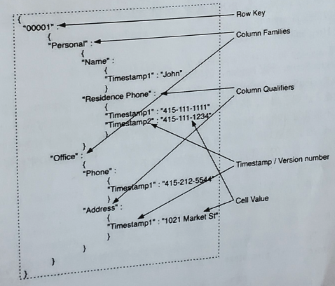

### HBase面试书相关
- Hbase在数据库中的地位？
- 简述HBase(数据模型)？🌟🌟
- 简述HBase的读写底层实现过程？🌟
- HBase在写过程中的region的split过程？🌟
- Hbase在建表时的设计原则（注意事项）🌟🌟
- Hbase的增删改查及其实现。
- HBase过滤器
- HBase协处理器(coprocessor)
- HBase二次索引（second index）
- 每天百亿数据存入HBase，如何保证数据的存储正确和在规定时间离全部写入完毕，不残留数据？
- HBase优化方法。🌟🌟
- HBase中的region server发生故障后的处理方法（zookeeper、WAL）

#### HBase在数据库中的地位
数据库分为关系型数据库（mysql、oracle等）、非关系型数据库（Hbase、Redis）.

Hbase就是其中面向列存储的关系型数据库

- Hbase: 面向列存储，java开发，容量大，水平扩展，适合hadoop大数据生态
    + HBase位于结构化存储层
    + HDFS为HBase提供了高性能的底层存储支持
    + MapReduce为HBase提供了高性能计算能力
    + Zookeeper为HBase提供了稳定服务和失败恢复机制
    +
- Redis: 面向键值对，基于内存，支持多种数据结构，读写速度快，适合数据变化快且数据库大小可预测的应用程序

#### 简述Hbase（数据模型、架构）
##### 特点：
大（表很大）、面向列、稀疏（空的列，不占存储）、高可用（zookeeper）、高可靠（HDFS）、可伸缩的分布式数据库。
##### HBase数据模型
逻辑视图

- RowKey: 行键，决定一行数据，按字典排序
- TimeStamp: 时间戳，也叫version Number，用户可以自定义
- ColumnFamily: 列族，拥有一个名称(String), 包含后一个或多个列；
- Colum: 属于某一个columnFamily,familyName:columnName，每条记录可动态添加；
下图为一行数据的多维map便于理解

##### Hbase架构组成
主从结构

- (1) Zookeeper
    + 实现HMaster的高可用
    + 记录root表的存储位置，ROOT找到META表的位置，META表中的信息确定用户数据存放的位置（Region）
    + 监控HregionServer状态
- (2) Hmaster
    + 为RegionServer分配Region，故障转移等
    + 负责RegionServer的负载均衡（但创建一个表，生成一个Region,持续向表中插入数据，达到了阈值，将分裂为2个Region，数据再增加，将会分裂为3、4、....100个，不能让这100个Region在一个HRegionServer，相当于工作的分配，一个员工的工作过多，将分配他的任务给其他人）
- (3) HRegionServer
    + 维护Region，处理对这些Region的IO请求
    + 负责切分在运行过程中变得过大的Region
    + 一个table，最初是一个region，随着表增大，随着表增大，分裂出多个region，HRegion对应一个Region，每个HRegion包含一个或者多个Store，**每个Store保存一个列族。每个store由一个memstore、0至多个storefile，storefile以HFile格式存在HDFS中**
    + BlockCache读缓存，memstore写缓存
    + HLog记录数据的变更信息，用来做数据恢复

##### 存储文件结构
一个列族存在一个HFile中，认为Base就是一个有序的多维Map，其中每一个RowKey映射了许多数据，这些数据存储在CF中的Column.

HFile由很多数据块(Block)组成，并且有一个固定的结尾块，其中的数据块是由一个Header和多个key-value的键值对组成。在结尾的数据块中包含了数据相关的索引信息，系统也是通过结尾的索引信息找到HFile中的数据。

#### 每天百亿数据存入HBase，如何保证数据的存储正确和在规定时间离全部写入完毕，不残留数据？
答：看到这个题目的时候我们要思考的是它在考查什么知识点？

我们来看看要求：

- 1）百亿数据：证明数据量非常大
- 2）存入HBase：证明是跟HBase的写入数据有关
- 3）保证数据的正确：要设计正确的数据结构保证正确性
- 4）在规定时间内完成：对存入速度是有要求的

那么针对以上的四个问题我们来一一分析
每天百亿，每秒需要写入百万条数据，不可能利用put进行实时写入，所以可以考虑批量导入。采用BulkLoad。批量导数据到Hbase又可以分为两种：(1)、生成HFiles，然后批量导入数据。（2）、直接将数据批量导入HBase中

- 1）数据量百亿条，什么概念呢？假设一整天60x60x24 = 86400秒都在写入数据，那么每秒的写入条数高达100万条，HBase当然是支持不了每秒百万条数据的，所以这百亿条数据可能不是通过实时地写入，而是批量地导入。批量导入推荐使用BulkLoad方式（推荐阅读：Spark之读写HBase），性能是普通写入方式几倍以上
- 2）存入HBase：普通写入是用JavaAPI put来实现，批量导入推荐使用BulkLoad
- 3）保证数据的正确：这里需要考虑RowKey的设计、预建分区和列族设计等问题
- 4）在规定时间内完成也就是存入速度不能过慢，并且当然是越快越好，使用BulkLoad
- 5) 建表时的注意事项，rowkey、预分区、列族

#### HBase优化方法。🌟🌟
- 减少调整
    + 减少Region分裂：根据业务实际情况进程Rowkey设计，并根据RowKey的设计进行预分区，减少Region的动态分裂
    + 给HFile设定合适大小：Hfile是数据底层存储文件，在每个memstore进行刷新时候会生成一个HFile，当HFile增加到一定程度时，会将属于一个region的HFile进行合并，这个过程会带来开销，但是不可避免，但是合并后的region大小如果大于设定的值，那么region会进行分裂。为了减少这样的无谓的I/O开销，建议估计项目数量的大小，给HFile设定一个合适的值
- 减少启停
    + HBase中也存在频繁开启关闭带来的问题
    + 关闭compaction，在闲时进行手动conpaction，因为在HBase中存在Minor Compaction和Major Compaction，合并就是I/O读写，大量的HFile进行肯定会带来I/O开销，甚至时I/O风暴，所以为了避免这种不受控制的意外发生，建议关闭自动compaction在闲时进行compaction。
    + 当需要写入大量离线数据时建议使用BulkLoad
- 减少数据量
    + 开启过滤，提高查询速度，可以减少网络IO
    + 使用压缩：一般推荐使用Snappy和LZO压缩
- 合理设计（建表注意事项）
    + 预分区、RowKey设计，列族的设计

#### HBase的原理 regionServer挂了，如何恢复数据？新的数据从Hlog里读出来是如何恢复的？
引起RegionServer宕机的原因各种各样，又因为FullGC导致，网络异常导致，官方Bug导致以及DataNode异常导致。

HBase检测宕机是通过Zookeeper实现的，正常情况下RegionServer会周期性向Zookeeper发送心跳，一旦发生宕机，心跳就会停止，超过一定时间（SessionTimeout）Zookeeper就会认为RegionServer宕机离线，并将该消息通知给Master

一旦RegionServer宕机，Hbase都会马上检测到这种宕机，并且检测到宕机之后将宕机RegionServer上的所有region重新分配到集群中其他正常RegionServer上去，再根据HLog进行丢失数据的恢复，恢复完了之后就可以对外提供服务，整个过程都是自动完成的，并不需要人工介入。

一台RegionServer只有一个HLog文件，然后将Hlog按照Region进行分组，切分到每个RegionServer中，因此在回收之前首先需要将HLog按照Region进行分组，每个Region的日志数据放在一起，方便后面按照region进行回收。这个分组的过程就称为Hlog切换，然后再对Region重新分配，并对其中的Hlog进行回收将数据写入memstore刷写到磁盘，完成最终数据恢复。

