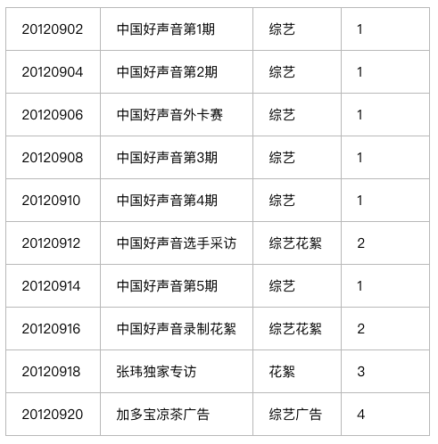

### HBase面试题

#### 1、Hbase热点（数据倾斜）问题如何处理？Hbase读写请求都会集中到某一个RegionServer上如何处理？
- 产生热点问题的原因：
    + HBase中的数据是按照字典序排序的，当大量连续的rowkey集中写在个别的region，各个region之间数据分布不均衡；
    + 创建表时没有提前预分区，创建表默认只有一个region，大量的数据写入当前region
    + 创建表已经提前预分区，但是设计的rowkey没有规律可循
- 热点问题的解决方案：
    + 随机数+业务主键，如果想让最近的数据快速get到，可以将时间戳加上。
        * 这种其实就是Salting: Salting(加盐)的 **原理**是在原RowKey的前面添加固定长度的随机数，也就是给RowKey分配一个随机前缀和之间的RowKey的开头不同。随机数能保障数据在所有的Regions间的负载均衡
        * **缺点**：因为添加了随机数，基于原RowKey查询时无法知道随机数是什么，那样在查询的时候就需要去各个可能的Regions中查找，Salting对于读取时利空的
    + Reversing:
        * 如果初步设计出的RowKey在数据分布上不均匀，但RowKey尾部的数据却呈现出良好的随机性，此时，可以考虑将RowKey的信息翻转，或者直接降为不的bytes提前到RowKey的开头，Revsering可以有效的使Rowkey随机分布，但是牺牲了RowKey的有序性。
        * **缺点**，利于Get操作，但是不利于Scan操作，因为数据在原RowKey上的自然顺序已经被打乱。
    + Hasing
        * 基于RowKey的完整或部分数据进行Hash,而后将Hashing后的值完整替换或部分替换原RowKey的前缀部分。
        * **缺点** 与Reversing类似，Hashing也不利于Scan，因为打乱了原RowKey的自然顺序。

#### 2、RowKey设计案例剖析
- 1）查询用户在某个应用中操作记录
    + reverse(userid)+appid+timestamp
- 2）查询某用户在某应用中的操作记录（优先展示最近的记录）
    + reverse(userid)+appid+(Long.Max_Value-timestamp)
- 3）查询某用户在某段时间内所有应用的操作记录
    + reverse(userid)+timestamp+appid
- 4）查询某用户的基本信息
    + reverse(userid)
- 5）查询某eventid记录信息
    + salt+eventid+timestamp
如果userid是按数字递增的，并且长度不一，可以先预估userid最大长度，然后将userid进行翻转，在翻转之后的字符串后面补0（至最大长度）；如果长度使固定，直接进行翻转即可（如手机号码）

在查询某eventid记录信息中，加盐的目的是为了增加查询的并发性，加入slat的范围使0~n，可以将数据分为n个split同时做scan操作，有利于提高查询效率

**总结：**

在HBase的使用过程，设计RowKey是一个重要的环节，我们进行rowkey设计的时候可以参照如下步骤：

1. 结合业务场景特点，选择何时的字段来作为RowKey，并且按照查询频率来放置字段顺序
2. 通过设计Rowkey尽可能的将数据打散到整个集群中，均衡负载，避免热点问题
3. 设计的RowKey应尽量简短

#### RowKey的作用
##### RowKey在查询中的作用
HBase中RowKey可以唯一标识一行记录，在HBase中检索数据有以下三种方式：

- 通过 get 方式，指定 RowKey 获取唯一一条记录
- 通过 scan 方式，设置 startRow 和 stopRow 参数进行范围匹配
- 全表扫描，即直接扫描整张表中所有行记录

当大量请求访问HBase集群的一个或少数几个节点，造成少数RegionServer的读写请求过多、负载过大，而其他RegionServer负载却很小，这样就造成热点现象。大量访问会使热点Region所在的主机负载过大，引起性能下降，甚至导致Region不可用。所以我们在向HBase中插入数据的时候，应尽量均衡地把记录分散到不同的Region里去，平衡每个Region的压力。

在设计RowKey的时候选择好字段之后，还应该结合我们的实际的高频的查询场景来组合选择的字段，越高频的查询字段排列越靠前。

##### RowKey在Region中的作用

在 HBase 中，Region 相当于一个数据的分片，每个 Region 都有StartRowKey和StopRowKey，这是表示 Region 存储的 RowKey 的范围，HBase 表的数据时按照 RowKey 来分散到不同的 Region，要想将数据记录均衡的分散到不同的Region中去，因此需要 RowKey 满足这种散列的特点。此外，在数据读写过程中也是与RowKey 密切相关，RowKey在读写过程中的作用：

- 读写数据时通过 RowKey 找到对应的 Region；
- MemStore 中的数据是按照 RowKey 的字典序排序；
- HFile 中的数据是按照 RowKey 的字典序排序。

#### Rowkey的设计
在HBase中RowKey在数据检索和数据存储方面都有重要的作用，一个好的RowKey设计会影响到数据在HBase中的分布，还会影响我们查询效率，所以一个好的RowKey的设计方案是多么重要。首先我们先来了解下RowKey的设计原则。

#### RowKey的设计原则

##### 长度原则

RowKey 是一个二进制码流，可以是任意字符串，最大长度为64kb,实际应用中一般为10-100byte，以byte[]形式保存，一般设计成定长。建议越短越好，不要超过16个字节，原因如下：

- 数据的持久化文件HFile中是按照key-value存储的，如果rowkey过长，例如超过100byte,那么1000w行的记录，仅RowKey就需要占用1GB空间，这样会极大影响HFile的存储效率
- MemoStore会缓存部分数据到内存中，若Rowkey字段过程，内存的有效利用率就会降低，就不能缓存更多的数据，从而降低检索效率。
- 目前操作系统都是64位系统，内存8字节对齐，控制在16字节，8字节的整数倍利用了操作系统的最佳特性。

##### 唯一原则
必须在设计上保证RowKey的唯一性。由于在HBase中数据存储是Key-Value形式，若向HBase中同一张表插入相同RowKey的数据，则原先存在的数据会被新的数据覆盖。

##### 排序原则
HBase的RowKey是按照ASCII有序排序的，因此我们在设计RowKey的时候要充分利用这点。

##### 散列原则
设计的RowKey应均匀的分布在各个HBase节点上。

##### RowKey字段选择
RowKey字段的选择，遵循的最基本原则是唯一性，RowKey必须能够唯一的识别一行数据。无论应用的负载特点是什么样，RowKey字段都应该参考最高频的查询场景。数据库通常都是以如何高效的读取和消费数据为目的，而不是数据存储本身。然后，结合具体的负载特点，再对选取的RowKey字段值进行改造，组合字段场景下需要重点考虑字段的顺序。

#### HBase Rowkey如何设计才能提高性能？

#### HBase RowKey如何设计才能散列到不同的节点上？

#### 访问hbase table中的行，只有三种方式：
1. 通过单个row key访问
2. 通过row key的range
3. 全表扫描

实现条件查询功能使用的就是scan方式，scan在使用时有以下几点值得注意：

- 1、scan可以通过setCaching与setBatch方法提高速度（以空间换时间）；
- 2、scan可以通过setStartRow与setEndRow来限定范围。范围越小，性能越高。
通过巧妙的RowKey设计使我们批量获取记录集合中的元素挨在一起（应该在同一个Region下），可以在遍历结果时获得很好的性能。
- 3、scan可以通过setFilter方法添加过滤器，这也是分页、多条件查询的基础。

#### 设计案例一
下面举个形象的例子：

我们在表中存储的是文件信息，每个文件有5个属性：文件id（long，全局唯一）、创建时间（long）、文件名（String）、分类名（String）、所有者（User）。

我们可以输入的查询条件：文件创建时间区间（比如从20120901到20120914期间创建的文件），文件名（“中国好声音”），分类（“综艺”），所有者（“浙江卫视”）。

假设当前我们一共有如下文件：

内容列表 ID CreateTime Name Category UserID 1 2 3 4 5 6 7 8 9 10

这里UserID应该对应另一张User表，暂不列出。我们只需知道UserID的含义：

1代表 浙江卫视； 2代表 好声音剧组； 3代表 XX微博； 4代表 赞助商。

调用查询接口的时候将上述5个条件同时输入find(20120901,20121001,"中国好声音","综艺","浙江卫视")。

此时我们应该得到记录应该有第1、2、3、4、5、7条。第6条由于不属于“浙江卫视”应该不被选中。

我们在设计RowKey时可以这样做：采用UserID + CreateTime + FileID组成rowKey，这样既能满足多条件查询，又能有很快的查询速度。

**需要注意以下几点：**
1、每条记录的RowKey，每个字段都需要填充到相同长度。假如预期我们最多有10万量级的用户，则userID应该统一填充至6位，如000001，000002...

2、结尾添加全局唯一的FileID的用意也是使每个文件对应的记录全局唯一。避免当UserID与CreateTime相同时的两个不同文件记录相互覆盖。
按照这种RowKey存储上述文件记录，在HBase表中是下面的结构：

rowKey（userID 6 + time 8 + fileID 6）     name    category ....

00000120120902000001

00000120120904000002

00000120120906000003

00000120120908000004

00000120120910000005

00000120120914000007

00000220120912000006

00000220120916000008

00000320120918000009

00000420120920000010

**怎样用这张表？**

在建立一个scan对象后，我们setStartRow(00000120120901)，setEndRow(00000120120914)。

这样，scan时只扫描userID=1的数据，且时间范围限定在这个指定的时间段内，满足了按用户以及按时间范围对结果的筛选。并且由于记录集中存储，性能很好。

然后使用SingleColumnValueFilter（org.apache.hadoop.hbase.filter.SingleColumnValueFilter），共4个，分别约束name的上下限，与category的上下限。满足按同时按文件名以及分类名的前缀匹配。

（注意：使用SingleColumnValueFilter会影响查询性能，在真正处理海量数据时会消耗很大的资源，且需要较长的时间。

在后续的博文中我将多举几种应用场景下rowKey的，可以满足简单条件下海量数据瞬时返回的查询功能）

如果需要分页还可以再加一个PageFilter限制返回记录的个数。

以上，我们完成了高性能的支持多条件查询的HBase表结构设计。

#### 设计案例二
如何散列存储

即时间上连续的数据。这些数据可能来自于某个传感器网络、证券交易或者一个监控系统。它们显著的特点就是rowkey中含有事件发生时间。带来的一个问题便是HBase对于row的不均衡分布，它们被存储在一个唯一的rowkey区间中，被称为region，区间的范围被称为Start Key和End Key。

对于单调递增的时间类型数据，很容易被散列到同一个Region中，这样它们会被存储在同一个服务器上，从而所有的访问和更新操作都会集中到这一台服务器上，从而在集群中形成一个hot spot，从而不能将集群的整体性能发挥出来。

要解决这个问题是非常容易的，只需要将所有的数据散列到全部的Region上即可。这是可以做到的，比如，在rowkey前面加上一个非线程序列，常常有如下选择：

**Hash散列**

您可以使用一个Hash前缀来保证所有的行被分发到多个Region服务器上。例如：
byte prefix =
(byte) (Long.hashCode(timestamp) % <number of regionservers>);

byte[] rowkey =
Bytes.add(Bytes.toBytes(prefix), Bytes.toBytes(timestamp);

这个公式可以产生足够的数字，将数据散列到所有的Region服务器上。当然，公式里假定了Region服务器的数目。如果您打算后期扩容您的集群，那么您可以把它先设置为集群的整数倍。生成的rowkey类似下面：

0myrowkey-1,
1myrowkey-2, 2myrowkey-3, 0myrowkey-4, 1myrowkey-5, \
2myrowkey-6, …

当他们将按如下顺序被发送到各个Region服务器上去：

0myrowkey-1

0myrowkey-4

1myrowkey-2

1myrowkey-5

…

换句话说，对于0myrowkey-1和0myrowkey-4的更新操作会被发送到同一个region服务器上去（假定它们没有被散列到两个region上去），1myrowkey-2和1myrowkey-5会被发送到同一台服务器上。

这种方式的缺点是，rowkey的范围必须通过代码来控制，同时对数据的访问，可能要访问多台region服务器。当然，可以通过多个线程同时访问，来实现并行化的数据读取。这种类似于只有map的MapReduce任务，可以大大增加IO的性能。

#### 设计案例三
案例：Mozilla

Socoroo

Mozilla公司搭建了一个名为Socorro的crash报告系统，用来跟踪Firefox和Thunderbird的crash记录，存储所有的用户提交的关于程序非正常中止的报告。这些报告被顺序访问，通过Mozilla的开发团队进行分析，使得它们的应用软件更加稳定。

这些代码是开源的，包含着Python写的客户端代码。它们使用Thrift直接与HBase集群进行交互。下面的给出了代码中用于Hash时间的部分：

这些Python代码打开了一定数目的scanner，加上Hash后的前缀。这个前缀是一个单字符的，共有16个不同的字母。heapq对象将scanner的结果进行全局排序。

**字段位置交换**

在前面提到了Key部分扫描，您可以移动timestamp字段，将它放在前一个字段的前面。这种方法通过rowkey的组合来将一个顺序递增的timestamp字段放在rowkey的第二个位置上。

如果你的rowkey不单单含有一个字段，您可以交换它们的位置。如果你现在的rowkey只有一个timestamp字段，您有必要再选出一个字段放在rowkey中。当然，这也带来了一个缺点，即您常常只能通过rowkey的范围查询来访问数据，比如timestamp的范围。

#### HBase查询一条记录的方法是什么？HBase写入一条记录的方法是什么？
HBase查询单一数据采用的是get方法，写入数据的方法是put方法。
##### HBase详细的读流程：回答时候可以附上
##### HBase详细的写流程：回答时候可以附上

#### 描述HBase的rowkey的设计原理
Rowkey设计时需要遵循三大原则：

- 唯一性原则
rowkey在设计上保证其唯一性。rowkey是按照字典顺序排序存储的，因此，设计rowkey的时候，要充分利用这个排序的特点，将经常读取的数据存储到一块，将最近可能会被访问的数据放到一块。
- 长度原则
rowkey是一个二进制码流，可以是任意字符串，最大长度 64kb ，实际应用中一般为10-100bytes，以byte[] 形式保存，一般设计成定长。建议越短越好，不要超过16个字节，原因如下：数据的持久化文件HFile中是按照KeyValue存储的，如果rowkey过长，比如超过100字节，1000w行数据，光rowkey就要占用100*1000w=10亿个字节，将近1G数据，这样会极大影响HFile的存储效率；MemStore将缓存部分数据到内存，如果rowkey字段过长，内存的有效利用率就会降低，系统不能缓存更多的数据，这样会降低检索效率。目前操作系统都是64位系统，内存8字节对齐，控制在16个字节，8字节的整数倍利用了操作系统的最佳特性。
- 散列原则
如果rowkey按照时间戳的方式递增，不要将时间放在二进制码的前面，建议将rowkey的高位作为散列字段，由程序随机生成，低位放时间字段，这样将提高数据均衡分布在每个RegionServer，以实现负载均衡的几率。如果没有散列字段，首字段直接是时间信息，所有的数据都会集中在一个RegionServer上，这样在数据检索的时候负载会集中在个别的RegionServer上，造成热点问题，会降低查询效率
    + 加盐：如果rowkey按照时间戳的方式递增，不要将时间放在二进制码的前面，建议将rowkey的高位作为散列字段，由程序随机生成，低位放时间字段，这样将提高数据均衡分布在每个RegionServer，以实现负载均衡的几率。如果没有散列字段，首字段直接是时间信息，所有的数据都会集中在一个RegionServer上，这样在数据检索的时候负载会集中在个别的RegionServer上，造成热点问题，会降低查询效率加盐：这里所说的加盐不是密码学中的加盐，而是在rowkey的前面增加随机数，具体就是给rowkey分配一个随机前缀以使得它和之前的rowkey的开头不同。分配的前缀种类数量应该和你想使用数据分散到不同的region的数量一致。加盐之后的rowkey就会根据随机生成的前缀分散到各个region上，以避免热点
    + 哈希：哈希会使同一行永远用一个前缀加盐。哈希也可以使负载分散到整个集群，但是读却是可以预测的。使用确定的哈希可以让客户端重构完整的rowkey，可以使用get操作准确获取某一个行数据
    + 反转：第三种防止热点的方法时反转固定长度或者数字格式的rowkey。这样可以使得rowkey中经常改变的部分（最没有意义的部分）放在前面。这样可以有效的随机rowkey，但是牺牲了rowkey的有序性。反转rowkey的例子以手机号为rowkey，可以将手机号反转后的字符串作为rowkey，这样的就避免了以手机号那样比较固定开头导致热点问题
    +  时间戳反转：一个常见的数据处理问题是快速获取数据的最近版本，使用反转的时间戳作为rowkey的一部分对这个问题十分有用，可以用Long.Max_Value - timestamp 追加到key的末尾，例如[key][reverse_timestamp] ,[key] 的最新值可以通过scan [key]获得[key]的第一条记录，因为HBase中rowkey是有序的，第一条记录是最后录入的数据。比如需要保存一个用户的操作记录，按照操作时间倒序排序，在设计rowkey的时候，可以这样设计[userId反转][Long.Max_Value - timestamp]，在查询用户的所有操作记录数据的时候，直接指定反转后的userId，startRow是[userId反转][000000000000],stopRow是[userId反转][Long.Max_Value - timestamp]如果需要查询某段时间的操作记录，startRow是[user反转][Long.Max_Value - 起始时间]，stopRow是[userId反转][Long.Max_Value - 结束时间]

#### HBase中compact的用途是什么？什么时候触发？分为哪两种？有什么区别？
在HBase中，每当memstore的数据flush到磁盘后，就形成一个storefile，当sotrefile的数量越来越大时，会严重影响HBase的读性能，HBase内部的compact处理流程是为了解决Memstore flush之后，文件数目太多，导致读数据性能大大下降的一种自我调节手段，他会将文件按照某种策略进行合并，大大提升HBase的数据性能。

##### 主要起到如下几个作用
- 合并文件
- 清楚删除、过期、多余版本的数据
- 提高读写数据的效率

##### HBase中实现了两种compaction的方式：
**minor** and ***major***. Minor compactions will usually pick up a couple of the smaller adjacent StoreFiles and rewrite them as one. Minors do not drop deletes or expired cells, only major compactions do this. Sometimes a minor compaction will pick up all the StoreFiles in the Store and in this case it actually promotes itself to being a major compaction.

##### 这两种compaction方式的区别是：
- Minor操作只用来做部分文件的合并操作以及包括minVersion=0 并且设置ttl的过期版本清理，不作任何删除数据、多版本的数据清理工作
- Major操作对Region下的HStore下的所有StoreFile执行合并操作，最终的结果时整理合并出一个文件。

##### compaction 触发时机：
- Memstore 刷写后，判断是否compactionM
- CompactionChecker线程，周期轮询

#### HBase的原理 regionServer挂了，如何恢复数据？新的数据从Hlog里读出来是如何恢复的？
引起RegionServer宕机的原因各种各样，又因为FullGC导致，网络异常导致，官方Bug导致以及DataNode异常导致。

HBase检测宕机是通过Zookeeper实现的，正常情况下RegionServer会周期性向Zookeeper发送心跳，一旦发生宕机，心跳就会停止，超过一定时间（SessionTimeout）Zookeeper就会认为RegionServer宕机离线，并将该消息通知给Master

一旦RegionServer宕机，Hbase都会马上检测到这种宕机，并且检测到宕机之后将宕机RegionServer上的所有region重新分配到集群中其他正常RegionServer上去，再根据HLog进行丢失数据的恢复，恢复完了之后就可以对外提供服务，整个过程都是自动完成的，并不需要人工介入。

#### HBase的rowkey设计，如何高效的读取数据？

#### 讲一下Hbase， HBase二级索引用过吗？
默认情况下，Hbase只支持rowkey的查询，对于多条件的组合查询的应用场景，不够给力。
如果将多条件组合查询的字段都拼接在RowKey中显然又不太可能
全表扫描再结合过滤器筛选出目标数据(太低效)，所以通过设计HBase的二级索引来解决这个问题。

这里所谓的二级索引其实就是创建新的表，并建立各列值（family：column）与行键（rowkey）之间的映射关系。这种方式需要额外的存储空间，属于一种以空间换时间的方式

**具体参看二级索引详细内容**

#### Hbase如何优化的？

#### hbase中查询表名为test，rowkey为userl开头的
**HBase Shell:** scan 'test', FILTER=>"PrefixFilter("userl")"

**HBase JavaAPI:**
    Scan scan = new Scan();
    Filter filter = new PrefixFilter(Bytes.toBytes("userl"));
    scan.setFilter(filter);

#### HBase表的设计有哪些注意点？
题目主要考核hbase表的设计要素：**rowkey,family,column,cell,value,timestamp**

   行键的结构是什么的并且要包含什么内容
   表有多少个列族？
   列族中都要放什么数据？
   每个列族中有多少个列？
   列名是什么？尽管列名在创建表时不需要指定，你读写数据是需要用到它们。
   单元数据需要包含哪些信息？
   每个单元数据需要存储的版本数量是多少？

#### HBase与mysql的区别？

##### 数据存储的方式:
- Mysql面向行存储数据，整个行的数据是一个整体，存储在一起。
- HBase面向列存储数据，整个列的数据是一个整体，存储在一起，有利于压缩和统计
##### 数据之间的关系
- Mysql存储关系型数据，结构化数据
- Hbase存储的非关系型数据，存储结构化和非结构化数据
##### 事务处理
- Mysql数据库存在事务，因为着重于计算（算法）
- Hbase数据库侧重于海量数据的存储，所以没有事务的概念
##### 储存容量
- Hbase依托于Hadoop，容量非常大，一般都以PB级为单位存储
- Mysql存储数据依赖于所在的硬件设备

#### HBase有put方法，那如何批量put数据进Hbase里，用什么方法？
Put( List<Put> puts )

#### Hbase构建二级索引如何保证索引与数据的一致

#### HBase 数据存储，客户需要存储三个字段的数据（ID：：VALUE：：TIMESTAMP），为了满足统计需求，客户希望将100万个测试点的数据在Hbase中存储，每个测试点一年中每五分钟的数据作为一行存储，请确认这要定义存储格式是否合理，请给出最佳的解决方案
- 可以采用测试点作为rowkey,每5分钟的测试点数据作为列式存储

#### HBase、hive和redis的区别？
Hive基于MR程序，将HQL转换为MR执行。效率比较低，不适合实时数据访问
Hbase基于Hadoop数据存储，存储海量数据，而且拥有自己的查询操作

#### 浅谈以下HBase的读写原理

#### HBase预分区（分区键&分区号）的作用和原理
##### 作用
- 防止热点以及数据倾斜
- 提高数据读写效率

##### 原理：

#### 描述Hbase的scan和get功能以及实现的异同

