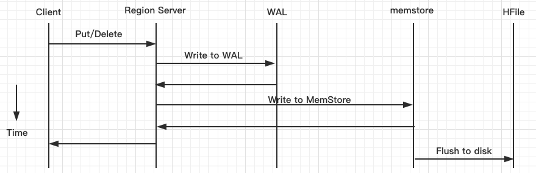
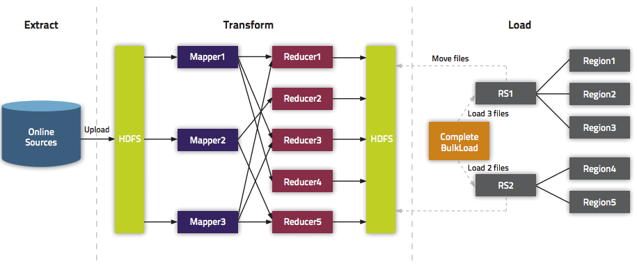

### 使用BulkLoad特性快速导入海量数据
- 概述
- BulkLoad的步骤与实现
- 注意事项以及遇到的问题：

#### 概述
HBase包含几张将数据加载到表中的方法，最直接的方法是HBase Shell、使用MapReduce作业中的TableOutputFormat类，或者使用普通的客户度api，然而，这些并不是最有效的方法。BulkLoad特性使用MapReduce作业以HBase的内部数据格式输出表数据，然后直接将生成的存储文件加载到一个正在运行的集群中。使用批量加载将比简单使用HBase API消耗更少的CPU和网络资源。



**在put数据时先将数据的更新操作信息和数据信息写入WAL,在写入到WAL后，数据就会被放到MemStore中，当Memstore就会被flush到磁盘（即形成HFile文件），在这个过程涉及到flush、split、compaction等操作都容易造成节点不稳定，数据导入慢，耗费资源等问题。**在海量数据的导入过程极大的消耗了系统性能，但是当使用BulkLoad的时候，WAL就不会作为导入过程的一部分，从而提高效率。但是也有限制，仅适合初次数据导入，以及HBase与Hadoop为同一集群。

BulkLoad的原理是使用Mapreduce直接生成HFile格式文件后，RegionServers再将HFile文件移动到相应的Region目录下。



#### BulkLoad的步骤与实现
- Step1：从数据源中提取数据，通常是文本文件或者其他数据库，然后将数据文件上传到HDFS中
- Step2：将数据转换为HFile，这个步骤需要MapReduce，将rowkey作为OutputKey，将一个Put或者Delete作为OutputValue，在这个阶段，将会在输出文件夹中，一个Region就创建一个HFile。注意输入的数据将会几乎被重写，所以所需的磁盘空间至少比原始的数据集的大小多一倍，在进程结束后，可以删除转储文件。
- Step3：通过告知RegionServers在哪里找到这些文件，并且将文件加载到HBase中，这一步需要使用LoadIncrementalHFiles。

```java
package com.test.HBaseBulkLoad;

import java.io.IOException;

import org.apache.hadoop.hbase.client.Put;
import org.apache.hadoop.hbase.io.ImmutableBytesWritable;
import org.apache.hadoop.io.LongWritable;
import org.apache.hadoop.io.Text;
import org.apache.hadoop.mapreduce.Mapper;

/**
 * 需求：用BulkLoad的方法导入数据
 * @author Setsuna
 * @DataFormat 1       info:www.baidu.com      BaiDu
 */
public class GenerateHFile extends Mapper<LongWritable, Text, ImmutableBytesWritable, Put>{

    @Override
    protected void map(LongWritable Key, Text Value,
            Mapper<LongWritable, Text, ImmutableBytesWritable, Put>.Context context)
            throws IOException, InterruptedException {

        //切分导入的数据
        String Values=Value.toString();
        String[] Lines=Values.split("\t");
        String Rowkey=Lines[0];
        String ColumnFamily=Lines[1].split(":")[0];
        String Qualifier=Lines[1].split(":")[1];
        String ColValue=Lines[2];

        //拼装rowkey和put
        ImmutableBytesWritable PutRowkey=new ImmutableBytesWritable(Rowkey.getBytes());
        Put put=new Put(Rowkey.getBytes());
        put.addColumn(ColumnFamily.getBytes(), Qualifier.getBytes(), ColValue.getBytes());

        context.write(PutRowkey,put);
    }

}
```

上面对数据进行了切分，然后拼装成了rowkey和put

```java
package com.test.HBaseBulkLoad;

import org.apache.hadoop.conf.Configuration;
import org.apache.hadoop.fs.Path;
import org.apache.hadoop.hbase.HBaseConfiguration;
import org.apache.hadoop.hbase.TableName;
import org.apache.hadoop.hbase.client.Admin;
import org.apache.hadoop.hbase.client.Connection;
import org.apache.hadoop.hbase.client.ConnectionFactory;
import org.apache.hadoop.hbase.client.Put;
import org.apache.hadoop.hbase.client.Table;
import org.apache.hadoop.hbase.io.ImmutableBytesWritable;
import org.apache.hadoop.hbase.mapreduce.HFileOutputFormat2;
import org.apache.hadoop.hbase.mapreduce.LoadIncrementalHFiles;
import org.apache.hadoop.mapreduce.Job;
import org.apache.hadoop.mapreduce.lib.input.FileInputFormat;
import org.apache.hadoop.mapreduce.lib.input.TextInputFormat;
import org.apache.hadoop.mapreduce.lib.output.FileOutputFormat;

public class GenerateHFileDriver {

    public static void main(String[] args) throws Exception {

        /**
         * 获取Hbase配置，创建连接到目标表，表在Shell中已经创建好，建表语句create 'BulkLoad','Info'，这里注意HBase对大小写很敏感
         */
        Configuration conf=HBaseConfiguration.create();
        Connection conn=ConnectionFactory.createConnection(conf);
        Table table=conn.getTable(TableName.valueOf("BulkLoad"));
        Admin admin=conn.getAdmin();

        final String InputFile="hdfs://centos:9000/HBaseTest/input";
        final String OutputFile="hdfs://centos:9000/HBaseTest/output";
        final Path OutputPath=new Path(OutputFile);

        //设置相关类名
        Job job=Job.getInstance(conf,"BulkLoad");
        job.setJarByClass(GenerateHFileDriver.class);
        job.setMapperClass(GenerateHFile.class);
        job.setMapOutputKeyClass(ImmutableBytesWritable.class);
        job.setMapOutputValueClass(Put.class);

        //设置文件的输入路径和输出路径
        job.setInputFormatClass(TextInputFormat.class);
        job.setOutputFormatClass(HFileOutputFormat2.class);
        FileInputFormat.setInputPaths(job, InputFile);
        FileOutputFormat.setOutputPath(job, OutputPath);

        //配置MapReduce作业，以执行增量加载到给定表中。
        HFileOutputFormat2.configureIncrementalLoad(job, table, conn.getRegionLocator(TableName.valueOf("BulkLoad")));

        //MapReduce作业完成，告知RegionServers在哪里找到这些文件,将文件加载到HBase中
        if(job.waitForCompletion(true)) {
            LoadIncrementalHFiles Loader=new LoadIncrementalHFiles(conf);
            Loader.doBulkLoad(OutputPath, admin, table, conn.getRegionLocator(TableName.valueOf("BulkLoad")));
        }
    }
```
而这一块则是对表数据的加载

在具体测试之前，先打开JobHistoryServer，这样可以通过历史服务器查看已经运行完成的Mapreduce作业记录，开启的命令是mr-jobhistory-daemon.sh start historyserver，当然，要先配置好$HADOOP_HOME/sbin在环境变量中，以及开启了HDFS和yarn。然后打开zookeeper和hbase，具体过程不表。

然后开始测试，测试文件为url.txt，内容如下

```java
1       Info:www.baidu.com      BaiDu
2       Info:www.taobao.com     TaoBao
```
将测试文件跟生成的jar包传到HDFS中，并创建好测试目录，注意，这里不能创建输出目录，mapreduce的通病>,<，不然就会报错，报错的话把输出文件夹删了再执行就好了。
在HBase Shell中创建测试表

```java
create 'BulkLoad','Info'
```
然后在bash中执行命令

```java
hadoop jar /root/eclipse-workspace/HBaseBulkLoad/target/HBaseBulkLoad-1.0.jar com.test.HBaseBulkLoad.GenerateHFileDriver
```

通过scan命令就可以看到导入的数据了

#### 注意事项以及遇到的问题：
- 1.在创建表时对表进行预分区再结合MapReduce的并行计算能有效的加快HFile的生成，通过预分区，可以创建多个空Region，对表进行了预分区后，Reduce数就等于Region数。
- 2.在多列族的情况下，需要进行多次的拼装和context.write，即在一个mapper里面输出多条数据。
- 3.在跑jar包的时候，可能会遇到ClassNotFound的异常抛出，这个问题只需要在$HADOOP_HOME/etc/hadoop/hadoop-env.sh中添加一句export HADOOP_CLASSPATH=$HADOOP_CLASSPATH:/opt/software/hbase-1.2.0-cdh5.14.0/lib/*，就可以让hadoop读到hbase的lib.
