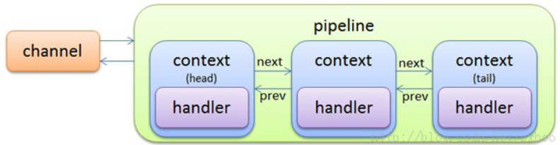

### netty的初始化注册流程
- Netty核心四大组件关系及创建方式深度解析
- Netty初始化
- Netty注册

#### Netty初始化
##### 初始化流程：
```java
AbstractBootstrap.java
public ChannelFuture bind(){
    validate();
    SocketAddress localAddress = this.localAddress;
    if (localAddress == null) {
        throw new IllegalStateException("localAddress not set");
    }
    return doBind(localAddress);
}
```
```java
AbstractBootstrap.java
private ChannelFuture doBind(final SocketAddress localAddress) {
    final ChannelFuture regFuture = initAndRegister();
    final Channel channel = regFuture.channel();
}
```
```java
AbstractBootstrap.java
final ChannelFuture initAndRegister() {
    Channel channel = null;
    try {
        channel = channelFactory.newChannel();
        //Netty的初始化
        init(channel);
    }

    //Netty的注册逻辑
    ChannelFuture regFuture = config().group().register(channel);

    return regFuture;
}
```

在ServerBootStrap中的初始化init()逻辑：
```java
ServerBootStrap.java
void init(Channel channel) {
    setChannelOptions(channel, options0().entrySet().toArray(newOptionArray(0)), logger);
    setAttributes(channel, attrs0().entrySet().toArray(newAttrArray(0)));

    //从channel中获取
    ChannelPipeline p = channel.pipeline();

    final EventLoopGroup currentChildGroup = childGroup;
    final ChannelHandler currentChildHandler = childHandler;

    final Entry<AttributeKey<?>, Object>[] currentChildAttrs = childAttrs.entrySet().toArray(newAttrArray(0));

    //初始化的主要逻辑
    p.addLast(new ChannelInitializer<Channel>() {
        @Override
        public void initChannel(final Channel ch) {
            final ChannelPipeline pipeline = ch.pipeline();
            ChannelHandler handler = config.handler();
            if (handler != null) {
                pipeline.addLast(handler);
            }

            ch.eventLoop().execute(new Runnable() {
                @Override
                public void run() {
                    pipeline.addLast(new ServerBootstrapAcceptor(
                            ch, currentChildGroup, currentChildHandler, currentChildOptions, currentChildAttrs));
                }
            });
        }
    });
}
```
重点看上述代码中addLast()方法的逻辑
```java
DefaultChannelPipeline.java
public final ChannelPipeline addLast(EventExecutorGroup group, String name, ChannelHandler handler) {
    //newCtx就是ChannelHandlerContext
    final AbstractChannelHandlerContext newCtx;

    synchronized (this) {
        checkMultiplicity(handler);
        //传入一个group组、name名字、一个handler
        //新建一个ChannelHandlerContext,一个context对应一个handler
        newCtx = newContext(group, filterName(name, handler), handler);

        //将新的ctx插入链表
        addLast0(newCtx);

        //注意：registered为false，则只会执行下面的代码。
        if (!registered) {
            newCtx.setAddPending();
            callHandlerCallbackLater(newCtx, true);
            return this;
        }

        EventExecutor executor = newCtx.executor();
        if (!executor.inEventLoop()) {
            callHandlerAddedInEventLoop(newCtx, executor);
            return this;
        }
    }
    //将channelContext添加到channelpipeline这个容器当中之后，这个方法就会调用，
    // 这个方法的作用就是：将handler添加到刚创建的channelContext中
    //是handler的诸多回调方法中第一个被回调的
    callHandlerAdded0(newCtx);
    return this;
}
```
上述代码中addLast0的具体逻辑如下
```java
//将新的ctx插入链表
private void addLast0(AbstractChannelHandlerContext newCtx) {
    AbstractChannelHandlerContext prev = tail.prev;
    newCtx.prev = prev;
    newCtx.next = tail;
    prev.next = newCtx;
    tail.prev = newCtx;
}
```


#### Netty核心四大组件关系及创建方式深度解析
##### Netty核心四大组件有哪些？
- Channel
- ChannelPipeline
- ChannelHandlerContext
- Handler

##### Netty核心四大组件之间的关系？
1. Channel是一个接口，其代码部分逻辑
```java
public interface Channel extends AttributeMap{
    ChannelPipeline pipeline();
}
```
AbstractChannel实现了Channel
```java
public abstract class AbstractChannel implements Channel {
    private final DefaultChannelPipeline pipeline;

    protected AbstractChannel(Channel parent) {
        this.parent = parent;
        id = newId();
        unsafe = newUnsafe();
        pipeline = newChannelPipeline();
    }

    @Override
    public ChannelPipeline pipeline() {
        return pipeline;
    }
}
```
**从上述代码中可以得出，从Channel中可以获取pipeline**

2. ChannelPipeline
ChannelPipeline 是一个接口
```java
public interface ChannelPipeline{
    //returns the context object of the specified in this pipeline.
    ChannelHandlerContext context(ChannelHandler handler);
    //Returns the {@link Channel} that this pipeline is attached to.
    Channel channel();
}
```
DefaultChannelPipeline实现了ChannelPipeline.java
```java
①public class DefaultChannelPipeline implements ChannelPipeline {
    final AbstractChannelHandlerContext head;
    final AbstractChannelHandlerContext tail;

    private final Channel channel;

    protected DefaultChannelPipeline(Channel channel) {
        this.channel = ObjectUtil.checkNotNull(channel, "channel");
        succeededFuture = new SucceededChannelFuture(channel, null);
        voidPromise =  new VoidChannelPromise(channel, true);

        tail = new TailContext(this);
        head = new HeadContext(this);

        head.next = tail;
        tail.prev = head;
    }
    @Override
    public final Channel channel() {
        return channel;
    }
}
```

3. ChannelHandlerContext
```java
public interface ChannelHandlerContext extends AttributeMap, ChannelInboundInvoker, ChannelOutboundInvoker {
    Channel channel();
    //Return the assigned handler
    ChannelHandler handler();
    //Return the assigned pipeline
    ChannelPipeline pipeline();

    <T> Attribute<T> attr(AttributeKey<T> key);
}
```
AbstractChannelHandlerContext实现了ChannelHandlerContext
```java
abstract class AbstractChannelHandlerContext implements ChannelHandlerContext{
    volatile AbstractChannelHandlerContext next;
    volatile AbstractChannelHandlerContext prev;

    @Override
    public Channel channel() {
        return pipeline.channel();
    }

    @Override
    public ChannelPipeline pipeline() {
        return pipeline;
    }
面试题：说说ChannelHandlerContext与Channel的attr的作用域？
此处恰恰说明了ChannelHandlerContext与Channel的attr的作用域是一致的。为什么要一致呢？避免内存浪费，
    @Override
    public <T> Attribute<T> attr(AttributeKey<T> key) {
        return channel().attr(key);
    }
}
```

4. 揭开Pipeline的神秘面纱
一个Channel在数量上，肯定不止拥有一个Handler。如何讲杂乱无章的Handler，有序的组织起来呢？

来了一个Handler的装配器--Pipeline.

Pipeline是何方神圣？

先揭下生命面纱：

Netty中，使用一个双向链表，将属于一个Channel的所有Handler组织起来，并且给这个双向链表封装在一个类中，并且给这个类取了一个非常牛逼的名字，叫做ChannelPipeline。
为什么这个名字很牛逼呢？

实际上这里用了Java中一种非常重要的设计模式，Pipeline设计模式。后面将用专门的文章，来介绍这种牛逼模式。

回到主题：

一个Channel，仅仅一个ChannelPipeline。该pipeline在Channel被创建的时候创建。ChannelPipeline相当于是ChannelHandler的容器，它包含了一个ChannelHandler形成的列表，且所有的Channelhandler都会注册到ChannelPipeline中。

5. Handler上下文环境
在Netty设计中，Handler是无状态的，不保存和Channel有关的信息。打个不恰当的比方，Handler就像国际雇佣军一样，谁给钱，就给谁打仗。Handler的目标，是将自己的处理逻辑做的很完美，可以给不同的Channel使用。

与之不同的是，pipeline是有状态的，保存了channel的关系。

于是乎，Handler和Pipeline之间，需要一个中间角色，把他们联系起来。这个中间角色是谁呢？他就是 **--ChannelHandlerContext**。

所以，ChannelPipeline中维护的，是一个由ChannelHandlerContext组成的双向链表。这个链表的头是HeaderContext,链表的尾是TailContext。而无状态的Handler，作为Context的成员，关联在ChannelHandlerContext中。在对应的关系上，每个ChannelHandlerContext中仅仅关联着一个ChannelHandler。



具体的代码可见前面①处的代码。

6. Handler的注册
###### 6.1 包裹
ChannelHandler在加入到Pipeline之前，在Pipeline的基类DefaultChannelPipeline中，首先对Handler进行包裹。
```java
//代码如下：
private AbstractChannelHandlerContext newContext(EventExecutorGroup group, String name, ChannelHandler handler) {
    //使用DefaultChannelHandlerContext包裹ChannelHandler
    return new DefaultChannelHandlerContext(this, childExecutor(group), name, handler);
}
```
###### 6.2 加入链表并注册完成回调事件
1. 构建了AbstractChannelHandlerContext节点，并加入到链表的尾部
2. 如果channel尚未注册到EventLoop，就添加一个任务到PendingHandlerCallback上，后续channel注册完毕，再调用ChannelHandler.handlerAdded
3. 如果已经注册，马上调用callHandlerAdded0方法来执行ChannelHandler.handlerAdded注册完成的回调函数

```java
@Override
public final ChannelPipeline addLast(EventExecutorGroup group, String name, ChannelHandler handler) {
    final AbstractChannelHandlerContext newCtx;
    synchronized (this) {
        //检查，若不是sharable，而且已经被添加到其他pipeline，则抛出异常
        checkMultiplicity(handler);
        //传入一个group组、name名字、一个handler
        //构建AbstractChannelHandlerContext节点
        newCtx = newContext(group, filterName(name, handler), handler);
        //将新的ctx插入链表
        addLast0(newCtx);
        //regitstered为false表示channel尚未注册到EventLoop上
        //添加一个任务到PendingHandlerCallback上，后续注册完毕再掉用ChannelHandler.handlerAdded
        if (!registered) {
            newCtx.setAddPending();
            callHandlerCallbackLater(newCtx, true);
            return this;
        }
        //registered为true，则立即调用ChannelHandler.handlerAdded
        EventExecutor executor = newCtx.executor();
        //inEventLoop()用于判断当前线程是否是EventLoop线程。执行ChannelHandler时候，必须在对应的EventLoop线程池中执行
        if (!executor.inEventLoop()) {
            //callHandlerAddedInEventLoop(newCtx, executor);
            newCtx.setAddPending();
            executor.execute(new Runnable() {
                @Override
                public void run() {
                    callHandlerAdded0(newCtx);
                }
            });
            return this;
        }
    }
    //将channelContext添加到channelpipeline这个容器当中之后，这个方法就会调用，
    // 这个方法的作用就是：将handler添加到刚创建的channelContext中
    //是handler的诸多回调方法中第一个被回调的
    callHandlerAdded0(newCtx);
    return this;
}
```


##### Netty中ChannelHandlerContext与Channel的attrs的作用域？
两者的作用域是一致的。
##### ChannelInitializer<Channel>其实就是一个inboundHandler