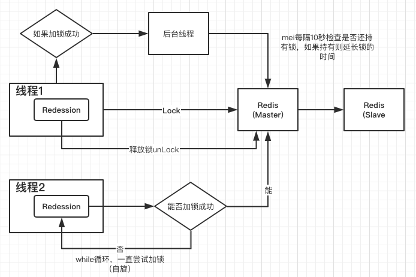
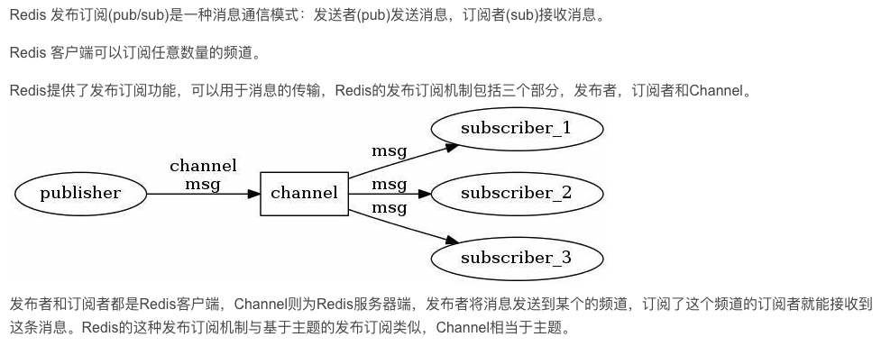
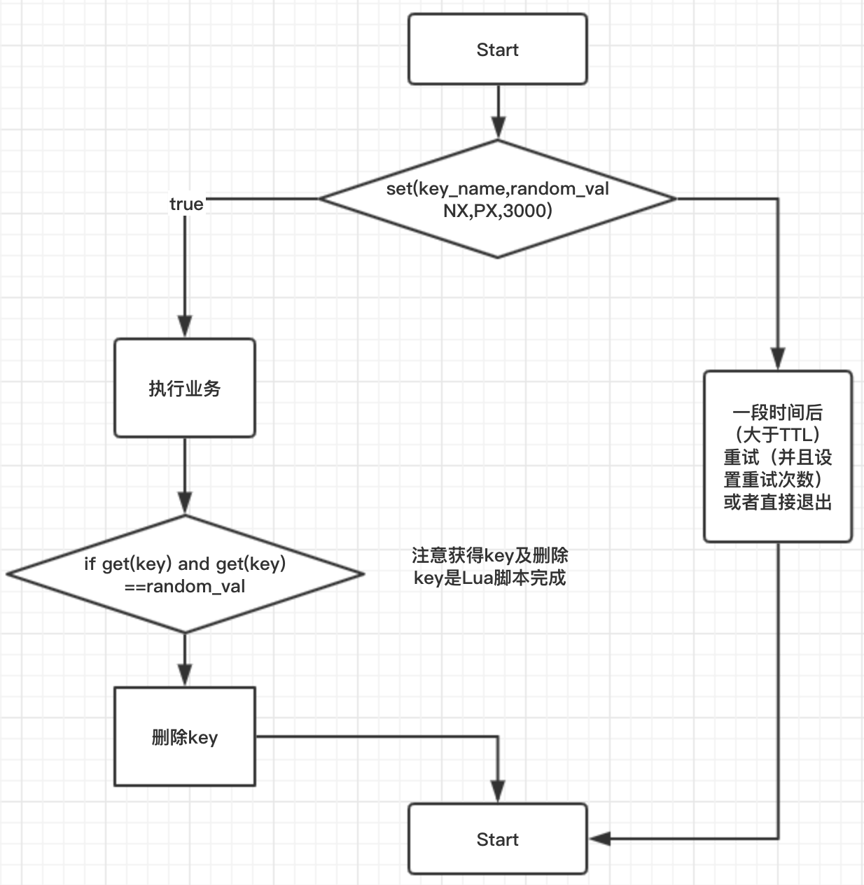
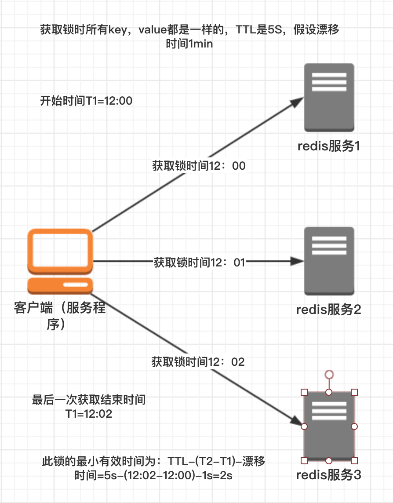

### Redis分布式锁
- 问题1：如何保证设置值和过期时间的原子性
- 问题2：设置过期时间有什么问题？在高并发场景下会导致分布式锁的永久失效。
- 问题3：Redis主从架构锁失效问题
- 问题4：如何设计架构将分布式锁性能提升20倍。分布式锁有性能问题么？
- 问题5：Ression如何实现分布式锁：他实现的分布式锁有什么优点。（Redis java client）
- 问题6：Redis的主从架构中，线程1获取到Redis锁，线程2阻塞自旋尝试加锁。如果此时Redis的Master在还没有把加锁数据同步到slave节点就宕机了会有什么问题？然后线程3和线程4过来获取redis分布式锁怎么办

#### Redis普通实现
说到redis分布式锁大部分都会想到setnx+lua，或者知道set key value nx px milliseconds，后者的核心实现命令如下：
```java
-- 获取锁（unique_value可以是UUID等）
SET resource_name unique_value NX PX 30000

-- 释放锁（lua脚本中，一定要比较value,防止误解锁）
if redis.call("get",KEYS[1] == ARGV[1] then
    return redis.call("del",KEYS[1]))
else
    return 0;
end
```
这种实现方式有3大要点（也是面试概率非常高的地方）：

1. set命令要用set key value px milliseconds nx；
2. value要具有唯一性；
3. 释放锁时要验证value值，不能误解锁；

**事实上这类琐最大的缺点就是它加锁时只作用在一个Redis节点上，即使Redis通过sentinel保证高可用，如果这个master节点由于某些原因发生了主从切换，那么就会出现锁丢失的情况：**

1. 在Redis的master节点上拿到了锁；
2. 但是这个加锁的key还没有同步到slave节点；
3. master故障，发生故障转移，slave节点升级为master节点；
4. 导致锁丢失。
正因为如此，Redis作者antirez基于分布式环境下提出了一种更高级的分布式锁的实现方式：Redlock。笔者认为，Redlock也是Redis所有分布式锁实现方式中唯一能让面试官高潮的方式。

在Redis的分布式环境中，我们假设有N个Redis master。这些节点完全互相独立，不存在主从复制或者其他集群协调机制。我们确保将在N个实例上使用与在Redis单实例下相同方法获取和释放锁。现在我们假设有5个Redis master节点，同时我们需要在5台服务器上面运行这些Redis实例，这样保证他们不会同时都宕掉。

#### 问题1：如何保证设置值和过期时间的原子性
在spring中：

```java
@Autowired
private StringRedisTemplate stringRedisTemplate

Boolean result = StringRedisTemplate.opsForValue().setIfAbsent("lockKey","zhuge");
if（!result）{
    return "error";
}
```
以上代码中使用redis实现的分布式锁，但是有什么问题呢？

1. 没有释放分布式锁
2. 如果应用服务器获取redis分布式锁后抛异常了怎么办，如果要是宕机了怎么办（即锁没释放怎么办？死锁怎么办？）？
3. 如果为了解决2中提出的死锁问题，加了超时时间，但是加的超时时间比应用业务处理的时间短，即还没处理完业务，锁就超时了，其他线程就可以获取锁了，这种情况怎么处理？如果在高并发情况下，是否会导致分布式锁永久失效，为什么会导致永久失效。
4. 解决分布式锁永久失效的办法？ Redession是如何解决redis分布式锁得相关问题的。

##### 如何解决：1. 没有释放分布式锁
```java
try{
    Boolean result = StringRedisTemplate.opsForValue.setIfAbsent(lockKey,"zhuge");//jiedis.setnx(key,value)
    if（!result）{
        return "error";
    }
}finally{
    stringRedisTemplate.delete(lockKey);
}
```
##### 如何解决：2.如果要是宕机了怎么办（即锁没释放怎么办？死锁怎么办？）？
```java
try{
    Boolean result = StringRedisTemplate.opsForValue.setIfAbsent(lockKey,"zhuge");//jiedis.setnx(key,value)
    stringRedisTemplate.expire(lockKey,10,TimeUnit.SECONDS)；
    if（!result）{
        return "error";
    }
}finally{
    stringRedisTemplate.delete(lockKey);
}
```
但是上述的代码又有问题：redis的set操作和设置过期时间的操作不是原子性的。
```java
try{
    Boolean result = StringRedisTemplate.opsForValue.setIfAbsent(lockKey,"zhuge",10,TimeUnit.SECONDS);//jiedis.setnx(key,value)
    if（!result）{
        return "error";
    }
}finally{
    stringRedisTemplate.delete(lockKey);
}
```
##### 解决3. redis主从架构锁失效的问题。如果为了解决2中提出的死锁问题，加了超时时间，但是加的超时时间比应用业务处理的时间短，即还没处理完业务，锁就超时了，其他线程就可以获取锁了，这种情况怎么处理？如果在高并发情况下，是否会导致分布式锁永久失效，为什么会导致永久失效。

如果为了解决2中提出的死锁问题，加了超时时间，但是加的超时时间比应用业务处理的时间短，即还没处理完业务，锁就超时了，其他线程就可以获取锁了，比如线程1的业务处理时间15s，比超时时间10s长。当线程1的锁超时，线程2就可以获得锁，然后5秒钟以后线程1又会去释放锁，就会导致将线程2的锁释放掉，当在高并发场景下，这种锁失效就会导致分布式锁永久失效，怎么解决呢？

使用UUID，即在释放锁的时候去判断下加锁的值是否一致，一致就释放。
```java
String clientId = UUID.randomUUID().toString()；
try{
    Boolean result = StringRedisTemplate.opsForValue.setIfAbsent(lockKey,clientId ,10,TimeUnit.SECONDS);//jiedis.setnx(key,value)
    if（!result）{
        return "error";
    }
}finally{
    if(clientId.equals(stringRedisTemplate.opsForValue().get(lockKey))){
        stringRedisTemplate.delete(lockKey);
    }
}
```
但是上述改造之后依然有锁超时的问题，即指定的超时时间可能比实际业务处理时间要长。

#### 解决超时时间问题，4. 解决分布式锁永久失效的办法？ Redession是如何解决redis分布式锁得相关问题的。
解决办法就是在获取锁之后new 一个子线程，这个子线程就做一件事：内部设置一个定时器，时间为前面设置的超时时间的三分之一，如果定时器时间到就向redis重新申请超时时间，即重新续命。

redission的具体逻辑和上面一样。具体逻辑如下：



```java
public class Temp {
    public static void main(String[] args) {
        Redisson redisson = Redisson.create();

        RLock lock = redisson.getLock("lockKey");
        try {
            lock.lock();
            System.out.println("hello world");
        }finally {
            lock.unlock();
        }
        try {
            Thread.sleep(100000);
        } catch (InterruptedException e) {
            e.printStackTrace();
        }
        redisson.shutdown();
    }
}
```

##### RLcok接口的实现
具体的实现类事RedessionLock,下面大概看看实现原理，先看看上面例子中执行时，锁运行的命令（通过monitor命令）
```java
127.0.0.1:6379> monitor
OK
1581861255.601716 [0 127.0.0.1:57506] "SETNX" "lockKey" "{\"@class\":\"org.redisson.RedissonLock$LockValue\",\"counter\":1,\"id\":\"16c2657d-9548-4d35-8ba4-34327f6ae87e\",\"threadId\":1}"
1581861255.610956 [0 127.0.0.1:57506] "GET" "lockKey"
1581861255.705624 [0 127.0.0.1:57506] "MULTI"
1581861255.707747 [0 127.0.0.1:57506] "DEL" "lockKey"
1581861255.707764 [0 127.0.0.1:57506] "PUBLISH" "redisson__lock__channel__{lockKey}" "0"
1581861255.707780 [0 127.0.0.1:57506] "EXEC"
```

其中"MULTI"命令是Redis的事务命令表示事务开启：

```java
127.0.0.1:6379> MULTI
OK
127.0.0.1:6379> INCR user_id
QUEUED
127.0.0.1:6379> INCR user_id
QUEUED
127.0.0.1:6379> PING
QUEUED
127.0.0.1:6379> EXEC
1) (integer) 1
2) (integer) 2
3) PONG
```

使用Monitor命令监控：
```java
1581861916.224506 [0 127.0.0.1:57555] "INCR" "user_id"
1581861916.224526 [0 127.0.0.1:57555] "INCR" "user_id"
1581861916.224531 [0 127.0.0.1:57555] "PING"
1581861916.224536 [0 127.0.0.1:57555] "EXEC"
```

##### Publish 是发布器
Redis关于发布/订阅的demo(PUBLISH/SUBSCRIBE)



```java
public class RediMQ {

    private static final String TOPIC="TOPIC";
    private static  JedisPool jedisPool;

    public RediMQ(JedisPool jedisPool){
        this.jedisPool = jedisPool;
    }

    /**
     * 发布消息
     */
    public void publish(String topic, String message){
        Jedis jedis = null;
        try{
            jedis = jedisPool.getResource();
            jedis.publish(topic,message);
        }finally {
            if(null!=jedis){
                jedis.close();
            }
        }
    }

    /**
     * 订阅消息
     */
    public void subscribe(String topic, JedisPubSub jedisPubSub){
        Jedis jedis = null;
        try{
            jedis = jedisPool.getResource();
            jedis.subscribe(jedisPubSub,topic);
        }finally {
            if(null!=jedis){
                jedis.close();
            }
        }
    }

    public static class MyJedisPubSub extends JedisPubSub{
        @Override
        public void onMessage(String channel, String message) {
            System.out.println("----channel is "+ channel+ " message is "+message);
        }
    }

    public static void main(String[] args) {
        //默认连接本地redis
        //localhost:6379
        JedisPool jedisPool = new JedisPool();
        RediMQ redisMQ = new RediMQ(jedisPool);
        new Thread(new Runnable() {
            @Override
            public void run() {
                redisMQ.subscribe("PID",new MyJedisPubSub());
            }
        }).start();

        for(int i=0;i<100;i++){
            redisMQ.publish("PID","message+"+i);
        }
    }
}
```

执行monitor命令后
```java
1581864141.256905 [0 127.0.0.1:58283] "SUBSCRIBE" "PID"
1581864141.258375 [0 127.0.0.1:58284] "PUBLISH" "PID" "message+0"
1581864141.259483 [0 127.0.0.1:58284] "PUBLISH" "PID" "message+1"
1581864141.259677 [0 127.0.0.1:58284] "PUBLISH" "PID" "message+2"
1581864141.259859 [0 127.0.0.1:58284] "PUBLISH" "PID" "message+3"
1581864141.260030 [0 127.0.0.1:58284] "PUBLISH" "PID" "message+4"
```
```java
//subscribe这个方法代码有点多, Redisson通过netty来和redis通讯, 然后subscribe返回的是一个Future类型,
//Future的awaitUninterruptibly()调用会阻塞, 然后Redisson通过Redis的pubsub来监听unlock的topic(getChannelName())
//例如, 5中所看到的命令 "PUBLISH" "redisson__lock__channel__{haogrgr}" "0"
//当解锁时, 会向名为 getChannelName() 的topic来发送解锁消息("0")
//而这里 subscribe() 中监听这个topic, 在订阅成功时就会唤醒阻塞在awaitUninterruptibly()的方法.
//所以线程在这里只会阻塞很短的时间(订阅成功即唤醒, 并不代表已经解锁)
subscribe().awaitUninterruptibly();
```
subscribe() 方法的代码复杂些, 但具体就是利用redis的pubsub提供一个通知机制来减少不断的重试.
很多的Redis锁实现都是失败后sleep一定时间后重试, 在锁被占用时间较长时, 不断的重试是浪费, 而sleep也会导致不必要的时间浪费(在sleep期间可能已经解锁了), sleep时间太长, 时间浪费, 太短, 重试次数会增加~~~.

#### 问题4：如何设计架构将分布式锁性能提升20倍。分布式锁有性能问题么？
对需要进行加锁的Key进行分段拆封加锁，比如将LockKey拆分成为LockKey_1,LockKey_2...LockKey_20，则在应用业务逻辑中就可以有20个线程同时获取到锁然后开始业务处理逻辑，性能提高了20倍。

类似于ConcurrentHashMap.

#### 问题5：Redis的主从架构中，线程1获取到Redis锁，线程2阻塞自旋尝试加锁。如果此时Redis的Master在还没有把加锁数据同步到slave节点就宕机了会有什么问题？然后线程3和线程4过来获取redis分布式锁怎么办？
解决锁失效的问题：

- 使用redLock
- Zookeeper

#### RedLock
redisson已经对redlock算法封装，接下来对其用法进行简单介绍，并对核心源码进行分析。

RedLock: 全名叫做Redis Distributed Lock; 即使用redis实现的分布式锁；

##### 使用场景
多个服务间保证同一时刻同一时间段内同一用户只能有一个请求（防止关键业务出现并发攻击）；

这个锁的算法 **实现了多个redis实例**的情况，相当于 ***单redis节点***来说，优点在于 ***防止了***单节点故障造成整个服务器停止运行的情况；并且在多节点中的锁的设计，及多节点同时奔溃等各种意外情况有自己独特的设计方法。

##### 概念及原理
相关概念：

1. TTL: Time To Live; 指Redis key的过期时间或有效生存时间
2. clock drift: 时钟漂移；指两个电脑间时间流速基本相同的情况下，两个电脑（两个进程间）时间的差值；如果电脑距离过远会造成时钟漂移值过大

**保证分布式锁的有效性及安全性的要求如下：**

1. 互斥：任何时刻只能有一个client获取锁
2. 释放死锁：即使锁定资源的服务奔溃或者分区，依然能够释放锁
3. 容错性：只要多数redis节点（一半以上）在使用或者少于一半的机器宕机，client就可以获取和释放锁。

**网上讲的基于故障转移实现的redis主从无法真正实现RedLock：**

因为Redis在进行主从复制时异步的，比如ClientA获取锁后，主redis复制数据到从redis的过程中奔溃了了，导致没有复制到从redis中，然后从redis选举出升级为主redis，造成新的主redis没有clientA设置的锁。然后clientB尝试获取锁，并且能够成功获取锁，导致互斥失效（锁失效）

**思考题：** 这个失败的原因是因为从redis立即升级为主redis，如果能够过了TTL时间再升级为主redis(延迟升级)后，或者立即升级为主redis,但是必须要求过TTL的时间后在执行获取锁的任务，就能成功产生互斥效果；是不是这样就能实现基于redis主从的RedLock；

##### Redis 单实例实现分布式锁的正确方式（原子性非常重要）
- 设置锁时，使用set命令，因为其包含了setnx，expire的功能，起到了样子操作的效果，给key设置随机值（UUID），并且只有在key不存在时才设置成功返回true，并且设置key的过期时间（最好用毫秒）
> SET key_name my_random_value nx px 30000
- 在获取锁后，完成相关业务后，需要删除自己设置的锁（必须要是只能删除自己设置的锁，不能删除他人设置的锁）
    + 删除原因：保证服务器资源的高效利用，不用等到锁自动过期才删除
    + 删除方法；最好利用Lua脚本删除（redis保证执行此脚本时不执行其他操作，保证操作的原子性），代码如下；逻辑是 先获取key，如果存在并且值是自己设置的就删除此key;否则就跳过；
> if redis.call("get",KEYS[1])==ARGV[1]) then
>   return redis.call("del",KEYS[1])
> else
>   return 0;
> end

算法流程图：



##### **多节点redis实现的分布式锁算法（RedLock）：有效防止单点故障**
假设有5个完全独立redis主服务器

- 获取当前时间戳
- client尝试按照顺序使用相同的Key,Value获取所有redis服务的锁，在获取锁的时候获取锁的时间比锁过期时间短很多，这是为了不要过长时间等待已经关闭的redis服务。并且试着获取下一个redis实例。
比如：TTL为5s，设置获取锁最多用1s,所以如果1s内无法获取锁，就放弃获取这个锁，重新尝试获取下一个锁。
- client通过获取所有能获取的锁后的时间减去第一步的时间，这个时间要小于TTL时间并且至少有3个redis实例成功获取锁，才能真正的获取锁成功
- 如果成功获取锁，则锁的真正有效时间是TTL减去 **第三步的时间差** 的时间；，比如TTL是5s,获取锁用了2s,则真正锁有效时间为3s(其实应该再减去时钟漂移)
- 如果客户端由于某些原因获取锁失败，便会开始解锁所有redis实例；因为可能已经获取了小于3个锁，必须释放，否则影响其他clietn获取锁



##### POM依赖
```java
<!-- https://mvnrepository.com/artifact/org.redisson/redisson -->
<dependency>
    <groupId>org.redisson</groupId>
    <artifactId>redisson</artifactId>
    <version>3.3.2</version>
</dependency>
```

##### 用法
```java
Config config1 = new Config();
config1.useSingleServer().setAddress("redis://192.168.0.1:5378")
        .setPassword("a123456").setDatabase(0);
RedissonClient redissonClient1 = Redisson.create(config1);

Config config2 = new Config();
config2.useSingleServer().setAddress("redis://192.168.0.1:5379")
        .setPassword("a123456").setDatabase(0);
RedissonClient redissonClient2 = Redisson.create(config2);

Config config3 = new Config();
config3.useSingleServer().setAddress("redis://192.168.0.1:5380")
        .setPassword("a123456").setDatabase(0);
RedissonClient redissonClient3 = Redisson.create(config3);

String resourceName = "REDLOCK_KEY";

RLock lock1 = redissonClient1.getLock(resourceName);
RLock lock2 = redissonClient2.getLock(resourceName);
RLock lock3 = redissonClient3.getLock(resourceName);
// 向3个redis实例尝试加锁
RedissonRedLock redLock = new RedissonRedLock(lock1, lock2, lock3);
boolean isLock;
try {
    // isLock = redLock.tryLock();
    // 500ms拿不到锁, 就认为获取锁失败。10000ms即10s是锁失效时间。
    isLock = redLock.tryLock(500, 10000, TimeUnit.MILLISECONDS);
    System.out.println("isLock = "+isLock);
    if (isLock) {
        //TODO if get lock success, do something;
    }
} catch (Exception e) {
} finally {
    // 无论如何, 最后都要解锁
    redLock.unlock();
}
```

##### 唯一ID
实现分布式锁的一个非常重要的点就是set的value要具有唯一性，redisson的value是怎样保证唯一性呢？

答案是 **UUID+threadId**。入口在redissonClient.getLock("REDLOCK_KEY")，源码在Redisson.java和RedissonLock.java中：

```java
protected final UUID id = UUID.randomUUID();
String getLockName(long threadId){
    return id+":"+threadId;
}
```

##### 获取锁
获取锁的代码为redLock.tryLock()或者redLock.tryLock(50,10000,TimeUnit.MILLISECONDS)，两者的最终核心源码都是下面这段代码，只不过前者获取的默认租约时间（leaseTime）是LOCK_EXPIRATION_INTERVAL_SENCONDS，即默认30s

```java
//获取锁需要在redis实例上执行的lua命令
<T> RFuture<T> tryLockInnerAsync(long leaseTime, TimeUnit unit, long threadId, RedisStrictCommand<T> command) {
    this.internalLockLeaseTime = unit.toMillis(leaseTime);
    return this.commandExecutor.evalWriteAsync(this.getName(), LongCodec.INSTANCE, command,
        //首先分布式锁的KEY不能存在，如果确实不存在，那么执行hset命令（hset REDLOCK_KEY uuid+threadId 1）并通过pexpire设置失效时间(也是锁的租约时间)
        "if (redis.call('exists', KEYS[1]) == 0) then redis.call('hset', KEYS[1], ARGV[2], 1); redis.call('pexpire', KEYS[1], ARGV[1]); return nil; "+
        "end;" +
        //如果分布式锁的KEY已经存在，并且value也匹配，标识当前线程持有的锁，那么重入次数加1，并且设置失效时间
        "if (redis.call('hexists', KEYS[1], ARGV[2]) == 1) then redis.call('hincrby', KEYS[1], ARGV[2], 1); redis.call('pexpire', KEYS[1], ARGV[1]); return nil; "+
        "end;"
        //获取分布式锁的key的失效时间毫秒数
        "return redis.call('pttl', KEYS[1]);",
        //这三个参数分别对应KEYS[1],ARGV[1]和ARGV[2]
        Collections.singletonList(this.getName()), new Object[]{this.internalLockLeaseTime, this.getLockName(threadId)});
}
```

上述获取锁的命令中：

- KEYS[1]就是Collections.singletonList(getName()),标识分布式锁的key，即REDLOCK_KEY;
- ARGV[1]就是internalLeaseTime，即锁的租约时间，默认30s
- ARGV[2]就是getLockNmae(threadId),是获取锁时set的唯一值，即UUID+threadId；

##### 释放锁
释放锁的代码redLock.unLock()，核心源码如下：

```java
protected RFuture<Boolean> unlockInnerAsync(long threadId) {
    //释放锁的时候需要再redis实例上执行lua命令
    return this.commandExecutor.evalWriteAsync(this.getName(), LongCodec.INSTANCE, RedisCommands.EVAL_BOOLEAN,
        //如果分布式锁KEY不存在，那么向Channel发布一条消息
        "if (redis.call('exists', KEYS[1]) == 0) then redis.call('publish', KEYS[2], ARGV[1]);"+
            "return 1; +
        "end;"+
        //如果分布式锁存在，但是value不匹配，表示锁已经被占用，那么就直接返回
        "if (redis.call('hexists', KEYS[1], ARGV[3]) == 0) then"+
            "return nil;"+
        "end;"+
        //如果当前线程占有分布式锁，那么将重入次数减1
        "local counter = redis.call('hincrby', KEYS[1], ARGV[3], -1);"+
        //如果重入次数减1后的值如果大于0，表示分布式锁有重入过，那么只设置失效时间，还不能删除
        "if (counter > 0) then" +
            "redis.call('pexpire', KEYS[1], ARGV[2]);"+
            "return 0;"+
        " else"+
        //重入次数减1后的值如果为0，表示分布式锁只获取过1次，那么删除这个KEY，并发布解锁消息
            "redis.call('del', KEYS[1]);"+
            "redis.call('publish', KEYS[2], ARGV[1]);"+
            "return 1;"+
        "end;"+
        "return nil;",
        //这5个参数分别对应KEYS[1],KEYS[2],ARGV[1],ARGV[2]和ARGV[3]
        Arrays.asList(this.getName(), this.getChannelName()), new Object[]{LockPubSub.unlockMessage, this.internalLockLeaseTime, this.getLockName(threadId)});
}
```

##### RedLock算法是否是异步算法？？
可以看成是同步算法；因为 即使进程间（多个电脑间）没有同步时钟，但是每个进程时间流速大致相同；并且时钟漂移相对于TTL叫小，可以忽略，所以可以看成同步算法；（不够严谨，算法上要算上时钟漂移，因为如果两个电脑在地球两端，则时钟漂移非常大）

##### RedLock失败重试
当client不能获取锁时，应该在随机时间后重试获取锁；并且最好在同一时刻并发的把set命令发送给所有redis实例；而且对于已经获取锁的client在完成任务后要及时释放锁，这是为了节省时间；

##### RedLock释放锁
由于释放锁时会判断这个锁的value是不是自己设置的，如果是才删除；所以在释放锁时非常简单，只要向所有实例都发出释放锁的命令，不用考虑能否成功释放锁；

##### RedLock注意点（Safety arguments）:
1. 先假设client获取所有实例，所有实例包含相同的key和过期时间(TTL) ,但每个实例set命令时间不同导致不能同时过期，第一个set命令之前是T1,最后一个set命令后为T2,则此client有效获取锁的最小时间为TTL-(T2-T1)-时钟漂移;
2. 对于以N/2+ 1(也就是一半以 上)的方式判断获取锁成功，是因为如果小于一半判断为成功的话，有可能出现多个client都成功获取锁的情况， 从而使锁失效
3. 一个client锁定大多数事例耗费的时间大于或接近锁的过期时间，就认为锁无效，并且解锁这个redis实例(不执行业务) ;只要在TTL时间内成功获取一半以上的锁便是有效锁;否则无效

##### RedLock性能及崩溃恢复的相关解决方法
1. 如果redis没有持久化功能，在clientA获取锁成功后，所有redis重启，clientB能够再次获取到锁，这样违法了锁的排他互斥性;
2. 如果启动AOF永久化存储，事情会好些， 举例:当我们重启redis后，由于redis过期机制是按照unix时间戳走的，所以在重启后，然后会按照规定的时间过期，不影响业务;但是由于AOF同步到磁盘的方式默认是每秒-次，如果在一秒内断电，会导致数据丢失，立即重启会造成锁互斥性失效;但如果同步磁盘方式使用Always(每一个写命令都同步到硬盘)造成性能急剧下降;所以在锁完全有效性和性能方面要有所取舍;
3. 有效解决既保证锁完全有效性及性能高效及即使断电情况的方法是redis同步到磁盘方式保持默认的每秒，在redis无论因为什么原因停掉后要等待TTL时间后再重启(学名:延迟重启) ;缺点是 在TTL时间内服务相当于暂停状态;


#### 总结：
1.TTL时长 要大于正常业务执行的时间+获取所有redis服务消耗时间+时钟漂移
2.获取redis所有服务消耗时间要 远小于TTL时间，并且获取成功的锁个数要 在总数的一般以上:N/2+1
3.尝试获取每个redis实例锁时的时间要 远小于TTL时间
4.尝试获取所有锁失败后 重新尝试一定要有一定次数限制
5.在redis崩溃后（无论一个还是所有），要延迟TTL时间重启redis
6.在实现多redis节点时要结合单节点分布式锁算法 共同实现

Redisson逻辑并不复杂, 但是通过记录客户端ID和线程ID来唯一标识线程, 实现重入功能, 通过pub sub功能来减少空转.

优点: 实现了Lock的大部分功能, 提供了特殊情况方法(如:强制解锁, 判断当前线程是否已经获取锁, 超时强制解锁等功能), 可重入, 减少重试.

缺点: 使用依赖Redisson, 而Redisson依赖netty, 如果简单使用, 引入了较多的依赖, pub sub的实时性需要测试, 没有监控等功能, 查问题麻烦, 统计功能也没有(例如慢lock日志, 2333333).


