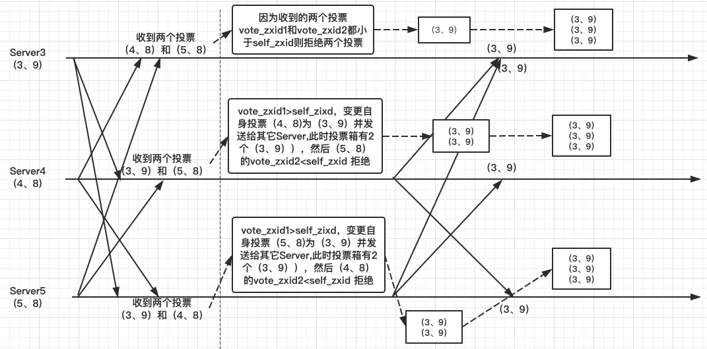
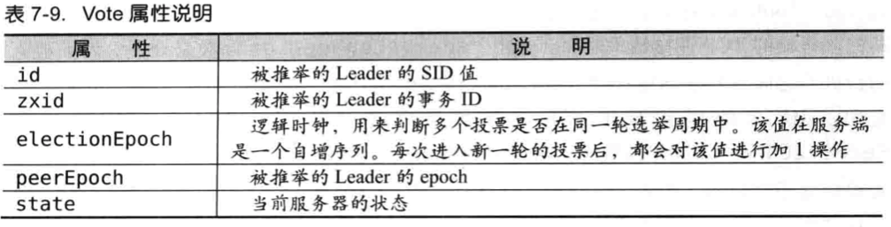
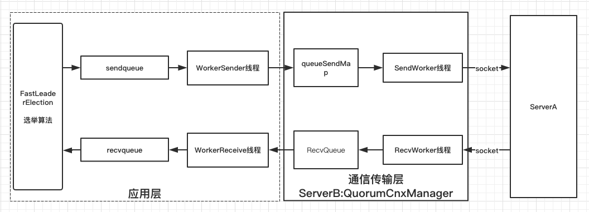
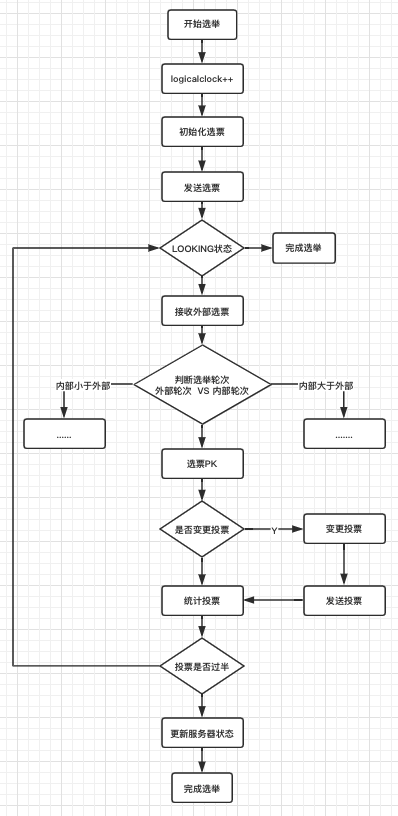

### 7.6、从paxos到ZooKeeper分布式一致性原理--Leader选举
- 7.6.1、Leader选举概述
- 7.6.2、Leader选举的算法分析
- 7.6.3、Leader选举的实现细节

#### 7.6.1、Leader选举概述
Leader选举是Zookeeper中最重要的技术之一，也是保证分布式数据一致性的关键所在。

##### 服务器启动时期的Leader选举
接下来我们以3台机器组成的服务器集群为例。在服务器集群初始化时候，当有一个台服务器（我们假设这台机器的myid为1，因此称其为Server1）启动时候，它是无法完成Leader选举的，是无法进行Leader选举的。当第二台服务器（同样，我们假设这台服务器的myid为2，称其为Server2）也启动后，此时这两台机器已经能够进行互相通信，每台机器都能试图找到一个Leader，于是便进入Leader选举流程。

-  1、每个Server发出一个投票。
由于是初始情况，因此对于Server1和Server2都会将自己作为Leader服务器来进行投票。每次投票包含的基本元素包括：所推举的服务器的myid和ZXID，我们以（myid，ZXID）的形式来表示。因为是初始阶段，Server1和Server2都会投给自己，即Server1和Server2分别会以（1，0）和（2，0）进行投票，然后各自将这个投票发给集群中其他所有机器。

-  2、接收来自各个服务器的投票
每个服务器都会收到集群中来自其它服务器的投票。集群中每个服务收到投票后，首先会判断该投票的有效性，包括：**是否是本轮投票、是否来自LOOKING状态的服务器**。

-  3、处理投票。
    +  优先检查ZXID。ZXID比较大的服务器优先作为Leader。
    +  如果ZXID相同的话，那么就比较myid.myid比较大的服务器作为Leader服务器。
在接受到来自其它服务器的投票后，针对每一个投票，服务器都需要将别人的投票和自己的投票进行PK，PK规则如上。

现在我们来看Server1和Server2实际是如何进行投票处理的。对于Server1来说，它自己的投票是（1.0），而接受到的投票是（2，0）。首先会比较两者的ZXID，因为都是0，所以无法决定谁是Leader，接下来会对比两者的myid，很显然Server1发现接受到的投票中myid是2，大于自己，于是就会更新自己的投票为（2，0）然后重新将投票发送出去（此时自己保留一份，一份发送给Server2，则server1就会有两份（2，0））。而对于server2来说，不需要更新自己的投票信息，只是再一次向集群中所有机器上发出上一次投票信息即可，并拒绝掉Server1的投票（因为1<2）。最终server2就会有两份（2，0），因为后面还会收到Server1的投票（2，0）

-  4、统计投票
**每次投票后**，服务器都会统计所有投票，判断是否已经有过半的机器接受到相同的投票信息。对于Server1和Server2服务器来说，都统计出集群中已经有两台机器接收了（2，0）这个投票信息，超过了一半的机器，因此认为已经选出了Leader。

-  5、改变服务器状态
一旦确定了Leader，每个服务器就会更新自己的状态：如果是Follower，那么就变更为FOLLOWER，如果是Leader，那么就变更为LEADING

##### 服务器运行期间的Leader选举
在Zookeeper集群正常运行过程中，一旦选出一个Leader，那么所有服务器的集群角色一般不会再发生变化--也就是说，Leader服务器将一直作为集群的Leader，即使集群中有非Leader 机器挂了或者有新机器加入集群也不会影响Leader。但是一旦Leader所在机器挂了，那么整个集群将暂时无法对外服务，而是进入新一轮的Leader选举。服务器运行期间的Leader选举和启动时期的Leader选举基本过程是一致的。

我们假设当前正在运行的ZooKeeper服务器由3台机器组成，分别是Server1、Server2和Server3，当前Leader是Server2。假设再某一个瞬间，Leader挂了，这个时候便开始了Leader选举。

- 1、变更状态
当Leader挂了之后，余下的非Observer服务器都会将自己的服务器状态变更为LOOKING，然后开始进入Leader选举流程。

- 2、每个Server会发出一个投票
在这个过程中，需要生成投票信息(myid,ZXID)。因为是运行期间，因此每个服务器上的ZXID可能不同，我们假定Server1的ZXID为123，而Server3的ZXID为122。在第一轮投票中，Server1和Server3都会投自己，即分别产生投票（1，123）和（3，122），然后各自将这个投票发给集群中所有机器。

- 3、接收来自各个服务器的投票
- 4、处理投票
由于Server1的ZXID为123,Server3的ZXID为122，那么显然，Server1会成功Leader
- 5、统计投票
- 6、改变服务器状态

#### 7.6.2、Leader选举的算法分析
##### 相关概念
***SID:服务器***

SID是一个数字，用来唯一标识一台ZooKeeper集群中的机器，每台机器不能重复，和myid的值一致。

***ZXID:事务ID***
ZXID是一个事务ID，用来唯一标识一次服务器状态的变更。在某一个时刻，集群中每台机器的ZXID值不一定全都一致，这和ZooKeeper服务器对于客户端"更新请求"的处理逻辑有关。

***Vote:投票***
Leader选举，顾名思义必须通过投票来实现。当集群中的机器发现自己无法检测到Leader机器时候就会开始尝试进行投票。

***Quorum:过半机器数***
我们可以把这个词理解为一个量词，指的是ZooKeeper集群中过半的机器数：quorum = (n/2+1)

##### 算法分析

##### 进入Leader选举
**进入Leader选举：**就是ZooKeeper什么时候会进入Leader选举。

当ZooKeeper集群中一台服务器出现下列情况时，需要进行Leader选举：

- 服务器初始化启动
- 服务器运行期间无法和Leader保持连接

当一台机器进入Leader选举的时候可能会出现如下情况：

- 集群本来就已经存在一个Leader：
    + 当集群中一台机器启动比较晚，或者新添加一台机器，即集群中已经存在一台Leader服务器了。
    + 针对这种情况，当该机器试图去选举Leader的时候，会被告知当前服务器的Leader信息
    + 对于该机器来说，仅仅需要和Leader机器建立连接，并进行状态同步即可。
- 集群中确实不存在Leader : 后面主要讲这种情况

##### 开始第一次投票
###### 通常情况下有两种情况会导致集群中不存在Leader:
- 整个服务器刚刚开始初始化启动，此时尚未产生一台Leader服务器
- 集群再运行期间当前Leader所在的服务器挂了

无论上述哪种情况，此时集群中的所有机器都处于一种试图选举出一个Leader的状态，我们把这种状态称为LOOKING。当一台服务器处于LOOKING状态的时候，那么它就会向集群中所有机器发送 **消息**，我们称这个消息为"投票"。

这个消息中包含两个最基本的信息：所推举的服务器的SID和ZXID。分别标识服务器myid和事务ID.

我们假设ZooKeeper由5台机器组成，SID分别为1、2、3、4、5，ZXID分别为9、9、9、8、8，并且此时SID为2的机器是Leader。某一时刻1和2所在的机器出现故障，因此集群开始进行Leader选举。

在第一次投票的时候，由于还无法检测到集群中其它机器的状态信息，因此每台机器都是将自己作为被选举的对象来进行投票，于是SID为3、4、5的机器，投票情况分别为：（3、9）、（4、8）和（5、8）

##### 变更投票
集群中的每台机器发出自己的投票后，也会接受到来自集群中其它集群的投票。每台机器会根据一定的规则来处理收到的投票，并以此来决定是否需要变更自己的投票。这个规则也成为整个Leader选举算法的核心所在。

***概念***

- vote_sid: 接受到的投票中所选举的Leader服务器的SID
- vote_zxid: 接受到的投票中所选举的Leader服务器的ZXID
- self_sid: 当前服务器自己的SID
- self_zxid: 当前服务器自己的ZXID

**处理规则**：即每次对于收到投票的处理，都是一个对（vote_sid,vote_zxid）和（self_sid,self_zxid）

- 规则1：如果vote_zxid大于self_zxid，就认可当前收到的投票，变更当前自己的投票，并再次将该投票发送出去。
- 规则2：如果vote_zxid小于self_zxid，那么就坚持自己的投票，不作任何变更。拒绝掉外部投票
- 规则3：如果vote_zxid等于self_zxid，那么就对比两者的SID。如果vote_sid大于self_sid，就认可当前收到的投票，变更当前自己的投票，并再次将该投票发送出去。
- 规则4：如果vote_zxid等于self_zxid，如果vote_sid小于self_sid，那么就坚持自己的投票，不作任何变更。拒绝掉外部投票

根据上面这个规则，来分析上面提到的5台机器组成的ZooKeeper集群的投票变更过程。



##### 确定Leader
经过这第二次投票后，集群中的每台机器都会再次收到其他机器的投票，然后开始统计投票。如果一台机器收到了超过半数的相同的投票，那么这个投票对应的SID机器即为Leader。

quorum = (5/2+1) = 3

也就是只要收到3个或3个以上（含当前服务器自身在内），一致的投票即可。在这里，Server3、S3rver4和Server5都投票（3，9），因此确定Server3为Leader。

##### 小结
简单地说，通常哪台服务器上的数据越新，那么越有可能成为Leader，原因很简单，数据越新，那么它的ZXID越大，也就越能保证数据的恢复。当然，如果集群中有几个服务器有相同的ZXID,那么SID较大的那台服务器成为Leader。

#### 7.6.3、Leader选举的实现细节
从算法复杂度来说，FastLeaderElection算法的设计并不复杂，但是其实复杂在于其现来，因为需要处理很多实际问题。

##### 服务器状态
QuorumPeer.ServerState类：对集群中每台机器的状态进行清楚的标识

- LOOKING: 寻找Leader状态。当服务器处于该状态时，它会认为当前集群中没有Leader，需要进入Leader选举流程。
- FOLLOWING: 跟随状态，表明当前服务器角色是Follower
- LEADING: 领导者状态，表明当前服务器角色是Leader
- OBSERVING: 观察者状态表明当前服务器角色是Observer

##### 投票数据结构
Leader的选举过程是通过投票来实现的，同时每个投票中包含了两个最基本的信息：SID和ZXID。ZooKeeper中Vote数据结构：
```java
public Vote(long id, long zxid) {
    this.version = 0x0;
    this.id = id;
    this.zxid = zxid;
    this.electionEpoch = -1;
    this.peerEpoch = -1;
    this.state = ServerState.LOOKING;
}
```



##### QuorumCnxManager: 网络/IO
与客户端类似：在客户端中ClentCnxn是Zookeeper用于处理网络I/O的一个管理器。

在Leader选举的过程中也有类似的角色，那就是QuorumCnxManager--每台服务器启动的时候，都会启动一个QuorumCnxManager，负责各个服务器之间的底层Leader选举过程中的网络通信。

那么在QuorumCnxManager中，ZooKeeper是如何管理服务器之间的投票发送和接收的？

- 消息队列
    + recvQueue: 消息接收队列，用于存放那些从其他服务器接受到的消息。
    + queueSendMap: 消息发送队列，用于保存那些待发送的消息。<sid,queue>
    + senderWorkerMap: 发送器集合。每个SendWorker消息发送器，都对应一台远程ZooKeeper服务器，负责消息发送。<sid, SendWorker>
    + lastMessageSent: 最近发送过的消息，在这个集合中，为每个SID保留最近发送过的一个消息。

在QuorumCnxManager这个类内部维护了一系列的队列，用于保存 **接受到的**和 **待发送的** 消息，以及消息的发送器。除接收队列以外，这里提到的所有队列都有一个共同点：按SID分组形成队列集合。

- 建立连接
为了能够进行互相投票，ZooKeeper集群中的所有机器都需要两两建立起网络连接，QuorumCnxManager在启动的时候，会创建一个ServerSocket来监听Leader选举的通信端口（3888）。开启端口监听后，ZooKeeper就能够不断接受到来自其他服务器的"创建连接"请求。

在接受到其他服务器的TCP连接请求时，会交由receiveConnection函数来处理。

为了避免两台机器之间重复创建TCP连接，ZooKeeper设计了一种建立TCP连接的规则：只允许SID大的服务器主动和其他服务器建立连接，否则断开连接。

在receiveConnection函数中，服务器通过对比自己和远程服务器的SID值，来判断是否接收请求。如果当前服务器发现自己的SID值更大，那么就会断开当前连接，然后自己主动去和远程服务器建立连接。

一旦建立连接，就会根据远程服务器的SID来创建相应的消息发送器SendWorker和消息发送器RecvWorker，并启动他们。

- 消息接收与发送
###### ***消息的接收***
消息的接收过程是 由消息接收器RecvWorker来负责的。ZooKeeper会为每个远程服务器分配一个单独的RecvWorker。在QuorumerCnxManager中，每个RecvWorker只需要不断从这个TCP连接中读取消息，并将其保存到recvQueue对队列中。

###### ***消息的接收***
消息的发送过程是 由消息发送器SendWorker来负责的。ZooKeeper会为每个远程服务器分配一个单独的消息发送器SendWorker。在QuorumerCnxManager中，每个SendWorker只需要不断地从对应的消息发送队列中获取出一个消息来发送即可，同时将这个消息放入lastMessageSent中来作为最近发送过的消息。

在SendWorker的具体实现中，有一个细节需要我们注意下：一旦ZooKeeper发现针对当前远程服务器的消息发送队列为空，那么这个时候就需要从lastMessageSent中取出一个最近发送过的消息来进行再次发送。

这个细节的处理主要是为了解决这样一类分布式问题：接收方在消息接收前，或者是在接受到消息后服务器挂掉了，导致消息尚未被正确处理。那么如此重复发送是否会导致其他问题呢？当然，这里可以放心的一点，ZooKeeper能够保证接收方在处理消息的时候，会对重复消息进行正确的处理。

##### FastLeaderElection：选举算法的核心部分
下面我们来看Leader选举的核心算法部分的实现。在讲解之前，我们首先约定几个概念。

- 概念
    + 外部投票: 特指其他服务器发来的投票。
    + 内部投票: 服务器自身当前的投票
    + 选举轮次: Zookeeper服务器Leader选举的轮次，即logicalclock
    + PK: 指对内部投票和外部投票进行一个对比来确定是否需要变更内部投票。

- 选票管理
    + sendqueue: 选票发送队列，用于保存待发送的选票
    + recvqueue: 选票接收队列，用于保存接受到的外部投票
    + WorkerReceiver: 选票接收器。接收器会不断从QuorumCnxManager中获取出其他服务器发来的选举消息，并将其转换成一个选票，然后保存到recvqueue队列中去。
        * 在选举的过程中，如果发现该外部投票的选举轮次小于当前服务器，那么直接忽略这个外部投票，同时立即发出自己的内部投票。
        * 如果当前服务器不是LOOKING状态，即已经选举出了Leader，也将忽略这个外部投票，同时将Leader信息以投票的形式发送出去。
        * 如果接受到的消息来自Observer服务器，那么就直接忽略该消息，并将自己当前的投票发送出去
    + WorkerSender: 选票发送器，会不断地从sendqueue队列中获取代发送的选票，并将其传递到底层QuorumCnxManager中去。

在QuorumCnxManager中，实现了管理服务器之间的投票发送和接收。在FastLeaderElection中，实现了对选票的管理。下图所示是选票管理过程中相关组件之间的协作关系。



- 算法核心
在上图中我们可以看到FastLeaderElection模块是如何与底层的网络I/O进行交互的，其中不难发现，在"选举算法"中将会对接受到的选票进行处理，下面我们就来看看这个选举过程的核心算法实现。
###### 算法核心流程
- 1、自增选举轮次
    + 在FastLeaderElection实现中，有一个logicalclock属性，用于标识当前Leader的选举轮次，Zookeeper规定所有有效的投票必须在同一轮次中。Zookeerp在开启新一轮的投票时，会首先对logicclock进行自增操作。
- 2、初始化选票
    + 初始化投票就是Vote的属性初始化，在初始化阶段，每台服务器都会将自己推举为Leader
- 3、发送初始化选票
    + zookeeper会将刚刚初始化好的选票放入sendqueue队列中，由发送器WorkerSender负责发送出去
- 4、接收外部投票
    + 每台服务器会不断地从recvqueue队列中获取外部投票。
    + 如果发现无法获取到任何的外部投票，那么就会立即确认自己是否和集群中其他服务器保持有效连接。如果发现没有建立连接，那么就会马上建立连接。建立连接后会再次发送自己的选票
- 5、判断选举轮次
    + 处理外部投票（根据选举轮次进行第一轮处理）
    + 自己内部投票选举轮次 < 外部投票
        * 会立即更新自己的选举轮次（logicalclock）,并且清空所有已经收到的投票，然后再次初始化投票进行选票PK
    + 自己内部投票选举轮次 > 外部投票
        * 直接忽略掉外部选票，进入4阶段，继续等待接收外部选票
    + 自己内部投票选举轮次 = 外部投票
        * 直接进入选票PK阶段
- 6、选票PK：
    + Zookeeper的FastLeaderElection.totalOrderPredicate方法实现了投票PK的核心逻辑
    + 选票PK的目的是为了确定当前服务器是否需要变更投票
    + 主要从选举轮次、ZXID和SID三个因素来考虑
    + 具体条件如下，在选票PK的时候一次判断，符合下列任意条件都需要进行投票变更
        * 自己内部投票选举轮次 < 外部投票，需要进行投票变更
        * 选举轮次一致的话，先对比ZXID。如果外部ZXID > 内部投票，需要进行投票变更
        * 如果两者ZXID一致，那么就对比两者的SID。如果外部投票的SID大于内部投票，需要进行投票变更
- 7、变更投票
    + 通过选票PK后，如果确定了外部投票优于内部投票(所谓的优于，是指外部投票所推举的服务器更适合成为Leader)，那么就进行投票变更
    + 使用外部投票信息来覆盖内部投票（替换）
    + 变更完成后，再次将这个变更后的内部投票发送出去。
- 8、选票放入投票箱
    + 将投票PK后的所有投票放入 "选票集合"--投票箱recvset中进行归档。recvset用于记录当前服务器在本轮次的Leader选举中收到的所有外部投票
- 9、统计投票
    + 统计投票的过程就是为了统计集群中是否有过半的服务器认可了当前的内部投票
- 10、更新服务器状态
    + 判断当前被过半服务器认可的投票所对应的Leader服务器是否是自己，如果是自己的话，就会将自己的服务器状态更新为LEADING。如果自己不是被选举产生的Leader的话，那么就会根据具体情况来确定自己是FOLLOWING或是OBSERVING

4-9会经过几轮循环，知道Leader产生，步骤9发现已经有过半的服务器认可了当前的投票，这个时候ZooKeeper不会立即进入步骤10来更新服务器状态。而是会等待一段时间（默认是200毫秒）来确定是否由新的更优的投票。




