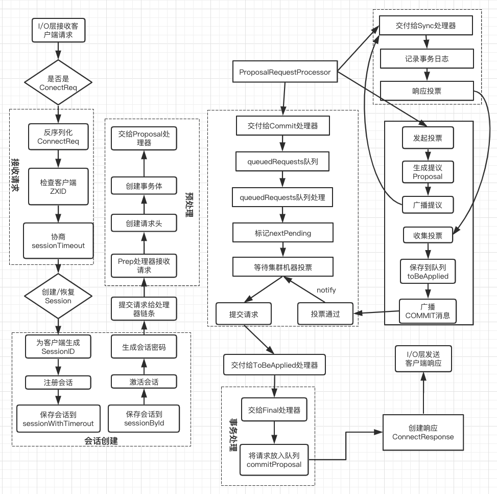
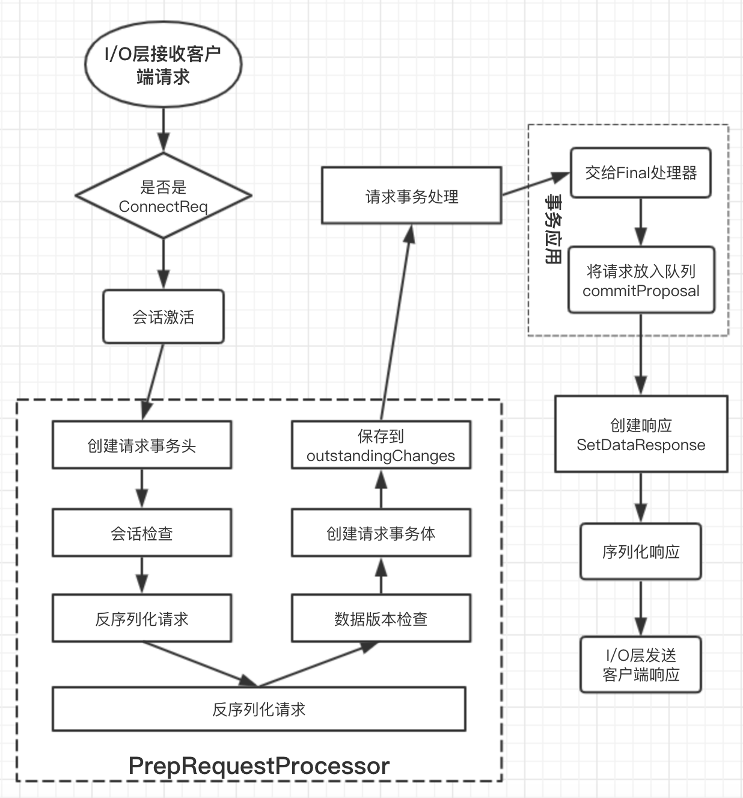
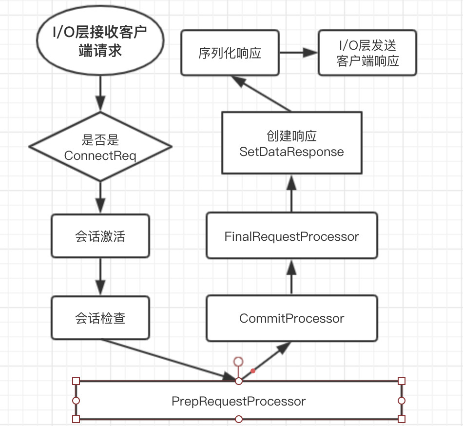

### ZooKeeper中请求的处理逻辑
- 会话创建请求处理逻辑
- SetData请求处理逻辑
- 事务请求转发处理逻辑
- GetData处理逻辑

接下来主要讲讲，针对客户端的一次请求，ZooKeeper究竟是如何进行处理的。

#### 会话创建请求处理逻辑


##### 请求接收
- 1、I/O层接收来自客户端的请求
在Zookeeper中，NIOServerCnxn实例维护每一个客户端连接，客户端与服务端的所有通信都是由NIOServerCnxn负责的--负责统一接收来自客户端的所有请求，并将请求内容从底层网络I/O中完整地读取出来。

- 2、判断是否是客户端"会话创建"请求
NIOServerCnxn在负责网络通信的同时，自然也承担了客户端会话的载体--每个会话都会对应一个NIOServerCnxn实体。因此，对于每个请求，ZooKeeper都会检查当前NIOServerCnxn实体是否已经被初始化。如果尚未初始化(!initialized)，那么就可以确定该客户端请求一定是"会话创建"请求。很显然，在会话创建初期，NIOServerCnxn尚未得到初始化，因此此时的第一个请求必定是"会话创建请求"

NIOServerCnxn中最核心的方法就是doIO()，主要负责网络通信。注意NIOServerCnxnFactory是一个线程，而NIOServerCnxn并不是一个线程。

```java
NIOServerCnxnFactory{}.run(){
    NIOServerCnxn c.doIO();
}
```
```java
 // Handles read/write IO on connection.
void doIO(SelectionKey k) throws InterruptedException {
    if (k.isReadable()) {
        int rc = sock.read(incomingBuffer);
        if (incomingBuffer.remaining() == 0) {
            boolean isPayload;
            if (isPayload) { // not the case for 4letterword
                // 往下
                readPayload();
            }
        }
    }
}
``
```java
NIOServerCnxn.java
  /** Read the request payload (everything following the length prefix) */
private void readPayload() throws IOException, InterruptedException {
    if (incomingBuffer.remaining() == 0) { // have we read length bytes?
        packetReceived(); // 计数
        incomingBuffer.flip();
        if (!initialized) {
            readConnectRequest();
        } else {
            // 往下
            readRequest();
        }
        lenBuffer.clear();
        incomingBuffer = lenBuffer;
    }
}
```
```java
private void readConnectRequest() throws IOException, InterruptedException {
    zkServer.processConnectRequest(this, incomingBuffer);
    initialized = true;
}
```
- 3、反序列化ConnectRequest
```java
public void processConnectRequest(ServerCnxn cnxn, ByteBuffer incomingBuffer){
        BinaryInputArchive bia = BinaryInputArchive.getArchive(new ByteBufferInputStream(incomingBuffer));
        ConnectRequest connReq = new ConnectRequest();
①        connReq.deserialize(bia, "connect");

②        if (connReq.getLastZxidSeen() > zkDb.dataTree.lastProcessedZxid) {
            throw new CloseRequestException(msg);
        }
        //读取出客户端连接时候传递的TimeOut 比如zkCli -timeout 500000000 -server localhost:2281
        int sessionTimeout = connReq.getTimeOut();
        byte passwd[] = connReq.getPasswd();
        int minSessionTimeout = getMinSessionTimeout();
        if (sessionTimeout < minSessionTimeout) {
            sessionTimeout = minSessionTimeout;
        }
        //配置的超时时间TimeOut
        int maxSessionTimeout = getMaxSessionTimeout();
        //最终以较小值做为超时时间
        if (sessionTimeout > maxSessionTimeout) {
            sessionTimeout = maxSessionTimeout;
        }
        cnxn.setSessionTimeout(sessionTimeout);
        // We don't want to receive any packets until we are sure that the
        // session is setup
        cnxn.disableRecv();
        long sessionId = connReq.getSessionId();
③        if (sessionId != 0) {
            long clientSessionId = connReq.getSessionId();
            LOG.info("Client attempting to renew session 0x"
                    + Long.toHexString(clientSessionId)
                    + " at " + cnxn.getRemoteSocketAddress());
            serverCnxnFactory.closeSession(sessionId);
            cnxn.setSessionId(sessionId);
⑤            reopenSession(cnxn, sessionId, passwd, sessionTimeout);
        } else {
            LOG.info("Client attempting to establish new session at "
                    + cnxn.getRemoteSocketAddress());
⑥            createSession(cnxn, passwd, sessionTimeout);
        }
    }
```
在代码①中，一旦确定当前客户端请求是"会话创建"请求，那么服务端就可以对其进行反序列化，并生成一个ConnectRequest请求实体

- 5、检查客户端ZXID
在正常情况下，同一个Zookeeper集群中，服务端的ZXID必定大于客户端的ZXID、因此如果发现客户端的ZXID值大于服务端的ZXID值，那么服务端将不接收该客户端的"会话创建"请求。具体逻辑如②处的代码所示。

- 6、协商sessionTimeout
- 7、判断是否需要重新创建会话。
服务端根据客户端请求中是否包含sessionID来判断该客户端是否需要重新创建会话。如果客户端请求中已经包含了sessionID，那么就认为该客户端正在进行会话重连。在这种情况下，服务器只需要重新打开这个会话，否则需要重新创建。

##### 会话创建
- 8、为客户端生成sessionID
在为客户端创建会话之前，服务端会为每个客户端都分配一个sessionID。分配方式其实简单，每个ZooKeeper服务器在启动的时候，都会初始化一个会话管理SessionTracker，同时初始化sessionID，我们将其称为"基准sessionID",因为针对每个客户端，只需要在这个基准的基础上进行逐个递增就可以了。

SessionID必须保证全局唯一；其实现算法为：
```java
SessionTrackerImpl.java
public static long initializeNextSession(long id) {
    long nextSid = 0;
    nextSid = (Time.currentElapsedTime() << 24) >>> 8;
    nextSid =  nextSid | (id <<56);
    return nextSid;
}
```

- 9、注册会话
会话注册：其实就是向会话管理器SessionTracker中的两个数据结构中存入对应的值；这两个值分别是sessionsWithTimeout和sessionsById，前者保存了所有的会话的超时时间，而后者这时根据sessionID保存了所有会话实体。具体的注册逻辑就是SessionTrackerImpl.addSession();
```java
SessionTrackerImpl.java
    HashMap<Long, SessionImpl> sessionsById = new HashMap<Long, SessionImpl>();
    HashMap<Long, SessionSet> sessionSets = new HashMap<Long, SessionSet>();
    ConcurrentHashMap<Long, Integer> sessionsWithTimeout;
```
```java
SessionTrackerImpl.java
synchronized public long createSession(int sessionTimeout) {
    addSession(nextSessionId, sessionTimeout);
    return nextSessionId++;
}

synchronized public void addSession(long id, int sessionTimeout) {
    sessionsWithTimeout.put(id, sessionTimeout);
    if (sessionsById.get(id) == null) {
        SessionImpl s = new SessionImpl(id, sessionTimeout, 0);
        sessionsById.put(id, s);
    }
    touchSession(id, sessionTimeout);
}
```

- 10、激活会话
向SessionTracker注册完会话后，接下来还需要对会话进行激活操作。激活会话过程涉及ZooKeeoer会话管理的分桶策略。具体逻辑见到touchSession();

```java
synchronized public boolean touchSession(long sessionId, int timeout) {
    SessionImpl s = sessionsById.get(sessionId);
    // Return false, if the session doesn't exists or marked as closing
    if (s == null || s.isClosing()) {
        return false;
    }
    long expireTime = roundToInterval(Time.currentElapsedTime() + timeout);
    if (s.tickTime >= expireTime) {
        // Nothing needs to be done
        return true;
    }
    SessionSet set = sessionSets.get(s.tickTime);
    if (set != null) {
        set.sessions.remove(s);
    }
    s.tickTime = expireTime;
    set = sessionSets.get(s.tickTime);
    if (set == null) {
        set = new SessionSet();
        sessionSets.put(expireTime, set);
    }
    set.sessions.add(s);
    return true;
}
```

##### 预处理
- 12、将请求交给ZooKeeper的PrepRequestProcessor处理器进行处理
- 13、创建请求事务头
对于事务请求，ZooKeeper首先会为其创建事务头。请求事务头是每一个ZooKeeper事务中非常重要的一部分，服务端后续的请求处理器都是基于该请求来识别是否是事务请求。请求事务头包含了一个事务请求最基本的一些信息，包括sessionID、ZXID等
- 14、创建请求事务体 createSessionTxn

##### 事务处理
16、**将请求交给ProposalRequestProcessor处理器**
完成请求的预处理之后，PrepRequestProcessor处理器会将请求交付给自己的下一级处理器：ProposalRequestProcessor

PropRequestProcessor处理器，顾名思义，是一个与提案相关的处理器。**所谓的提案**：是zookeeper中针对事务请求所展开的一个投票流程中对 事务操作的包装。从ProposalRequestProcessor处理器开始，请求的处理将会进入三个子处理流程，分别是Sync流程、Proposal流程和Commit流程

###### Sync流程
所谓Sync流程，其核心就是使用SyncRequestProcessor处理器记录事务日志的过程，ProposalRequestProcessor处理器在接受到一个上级处理器流转过来的请求后，首先会判断该请求是否是事务请求。针对每个事务请求，都会通过日志的形式将其记录下来。Leader服务器和Follower服务器的请求处理链都会有这个处理器，两者在事务日志的记录功能上是完全一致的。

完成事务日志记录后，每个Follower服务器都会向Leader服务器发送ACK消息，表明自身完成了事务日志的记录，以便Leader服务器统计每个事务请求的投票情况。

###### Proposal流程
在ZooKeeper的实现中，每一个事务请求都需要集群中过半机器投票认可才能被真正的应用到ZooKeeper的内存数据库中去，这个投票与统计过程被称为"Proposal流程"
```java
ProposalRequestProcessor.java
public void processRequest(Request request){
    zks.getLeader().processSync((LearnerSyncRequest)request);
    nextProcessor.processRequest(request); // 先交给下一个nextProcessor
    if (request.hdr != null) { // 如果是事务请求，Leader发出提议,集群进行投票
        zks.getLeader().propose(request);
        syncProcessor.processRequest(request);
    }
}
```

- 1、发起投票
如果当前请求是事务请求，那么Leader服务器就会发起一轮事务投票。在发起事务投票之前，先去检查ZXID是否可用。
```java
zks.getLeader().propose(request);
Leader.java
public Proposal propose(Request request) {
    byte[] data = SerializeUtils.serializeRequest(request);
    QuorumPacket pp = new QuorumPacket(Leader.PROPOSAL, request.zxid, data, null);

    Proposal p = new Proposal();
    p.packet = pp;
    p.request = request;
    synchronized (this) {
        lastProposed = p.packet.getZxid();
        //outstandingProposls 是 Leader发出的提议，等待投票结果
        outstandingProposals.put(lastProposed, p);

        //将需要进行投票的QuorumPacket发送出去
        sendPacket(pp);
    }
    return p;
}
```
sendPacket的实现：
```java
Leader{}.void sendPacket(QuorumPacket qp) {
    synchronized (forwardingFollowers) {
        for (LearnerHandler f : forwardingFollowers) {
            f.queuePacket(qp);
        }
    }
}
LearnerHandler.java
void queuePacket(QuorumPacket p) {
    queuedPackets.add(p);
}
// The packets to be sent to the learner
LearnerHandler{}、final LinkedBlockingQueue<QuorumPacket> queuedPackets ;
```

**outstandingProposals的作用分析:**
```java
ConcurrentMap<Long, Proposal> outstandingProposals;
```
```java
Leader{}.static public class Proposal {
    public QuorumPacket packet;
    public HashSet<Long> ackSet = new HashSet<Long>();
    public Request request;
}
```
outstandingProposals可以看成是投票箱：key是zxid（事务ID）,value就是Proposal，其实proposal就是对QuorumPacket的包装
```java
//Forward the request as an ACK to the leader
AckRequestProcessor{}.public void processRequest(Request request) {
    QuorumPeer self = leader.self;
    leader.processAck(self.getId(), request.zxid, null);
}
```
```java
//处理从Follower收到的ACK
synchronized public void processAck(long sid, long zxid, SocketAddress followerAddr) {
        // The proposal has already been committed
        if (lastCommitted >= zxid) {
        }
        //根据Follower发来的ACK中的sid去 outstandingProposal中查询proposal
        Proposal p = outstandingProposals.get(zxid);
        //然后将当前follower的sid存入proposal的ackset-->Hashset中
        p.ackSet.add(sid);

        //如果当前提议proposal中的ackset（HashSet）中对应的SID超过集群的半数
        //说明当前proposl已经可以commit
        if (self.getQuorumVerifier().containsQuorum(p.ackSet)){
            outstandingProposals.remove(zxid);

            //将当前提议proposal塞入toBeApplied中
            if (p.request != null) {
                toBeApplied.add(p);
            }
//toBeApplied的作用：ConcurrentLinkedQueue<Proposal> toBeApplied

            commit(zxid); // Follower提交
            inform(p); // Observer同步

            zk.commitProcessor.commit(p.request);
            if(pendingSyncs.containsKey(zxid)){
                for(LearnerSyncRequest r: pendingSyncs.remove(zxid)) {
                    sendSync(r);
                }
            }
        }
    }
```
//Commit
```java
Leader{}.Commit()
public void commit(long zxid) {
    synchronized(this){
        lastCommitted = zxid;
    }
    QuorumPacket qp = new QuorumPacket(Leader.COMMIT, zxid, null, null);
    sendPacket(qp);
}

Leader{}.void sendPacket(QuorumPacket qp) {
    synchronized (forwardingFollowers) {
        for (LearnerHandler f : forwardingFollowers) {
            f.queuePacket(qp);
        }
    }
}
```

**zk.commitProcessor.commit(p.request);重要**: 进行下一轮的Follower Commit投票
```java
commitProcessor.java
synchronized public void commit(Request request) {
    if (!finished) {
        committedRequests.add(request);//
        notifyAll();
    }
}
```

- 2、生成提议Proposal
如果当前服务端的ZXID可用，那么就可以开始事务投票了。ZooKeeper会将之前创建的请求头和事务体，以及ZXID和请求本身序列化到Proposal对象中---此处生成的Proposal对象就是一个提议，**即针对ZooKeeper服务器状态的一次变更申请。**

- 3、广播提议
生成提议后，Leader服务器会以ZXID作为标识，将该提议放入投票箱outstandingProposals中，同时会将给提议广播给所有的Follower服务器

- 4、收集投票
Follower服务器在接受到Leader发来的这个提议后，会进入Sync流程来进行事务日志的记录，一旦日志记录完成之后，就会发送ACK消息给Leader服务器，Leader服务器根据这些ACK消息来统计每个提议的投票情况

当一个提议获得了集群中过半机器的投票，那么就认为该提议通过，接下来就可以进入提议的commit阶段了。

- 5、将请求放入toBeApplied队列
在该提议被提交之前，Zookeeper首先会将其放入toBeApplie队列中去。

- 6、广播COMMIT消息
一旦ZooKeeper确认一个提议已经可以被提交了，那么Leader服务器就会向Follower和Observer服务器发送COMMIT消息，以便所有服务器都能够提交该提议。

对于Follower服务器，由于已经保存了所有关于该提议的信息，因此Leader服务器只需要向其发送ZXID即可；processAck()方法中commit(zxid); // Follower提交


###### Commit流程
- CommitProcessor事务提交处理器的作用
commitProcessor主要作用负责将已经完成本机submit的request和已经在集群中达成commit(即收到过半follower的proposal ack)的request匹配，并将匹配后的request交给nextProcessor处理,对于Leader来说就是ToBeAppliedRequestProcessor。

- CommitProcesor它有两个入口：首先对两个队列进行重点介绍：
    + LinkedList<Request> queuedRequests：已经发出提议等待收到过半服务器ack的请求队列
    + LinkedList<Request> committedRequests：是已经收到过半服务器ack的请求队列，意味着该请求可以被提交了

- 1、将请求交付给CommitProcessor处理器
```java
synchronized public void processRequest(Request request) {
    if (!finished) {
        queuedRequests.add(request);
        notifyAll();
    }
}
```
CommitProcessor处理器在收到请求后，并不会立即处理，而是会将其放入queuedRequests队列中

- 2、处理queuedRequests队列请求
```java
// 对于非事务请求，直接调用nextProcessor， 对于事务请求，会阻塞，直到投票成功
    @Override
    public void run() {
        Request nextPending = null;
        while (!finished) {
            //toProcess用于处理下一个处理器nextProcessor的处理
            int len = toProcess.size();
            for (int i = 0; i < len; i++) {
                // 非事务请求，或已经提交的事务请求，交给下一个处理器处理
①                nextProcessor.processRequest(toProcess.get(i));
            }

            toProcess.clear();
            synchronized (this) {
②                if ((queuedRequests.size() == 0 || nextPending != null)
                        && committedRequests.size() == 0) {
                    // 一旦有事务请求，需要等待投票，这里还有一个功能就是，保证了请求的有序性
③                   wait();
                    continue;
                }
                //一旦commitRequests中有值的时候：即已经收到过半服务器ack的队列
                if ((queuedRequests.size() == 0 || nextPending != null)
⑤                        && committedRequests.size() > 0) {
                    Request r = committedRequests.remove();

                    if (nextPending != null
                            && nextPending.sessionId == r.sessionId
                            && nextPending.cxid == r.cxid) {
                        nextPending.hdr = r.hdr;
                        nextPending.txn = r.txn;
                        nextPending.zxid = r.zxid;
⑥                        toProcess.add(nextPending);
                        nextPending = null;
                    } else {
                        // this request came from someone else so just
                        // send the commit packet
                        toProcess.add(r);
                    }
                }
            }

            synchronized (this) {
                // Process the next requests in the queuedRequests
                while (nextPending == null && queuedRequests.size() > 0) {
                    Request request = queuedRequests.remove();
                    switch (request.type) {
                    case OpCode.create:
                    case OpCode.delete:
                    case OpCode.setData:
                    case OpCode.multi:
                    case OpCode.setACL:
                    case OpCode.createSession:
                    case OpCode.closeSession:
⑨                        nextPending = request;
                        break;
                    case OpCode.sync:
                        if (matchSyncs) {
                            nextPending = request;
                        } else {
                            toProcess.add(request);
                        }
                        break;
                    default:
                        toProcess.add(request);
                    }
                }
            }
        }
    }
```
CommitProcessor处理器会有一个单独的线程来从上一级处理器流转下来，当检测（tofiyAll+while）到queueRequests队列中已经有新的请求进来，就会逐个从队列中取出请求进行处理。

- 3、标记nextpending
如果从queuedRequests队列中取出的请求是一个事务请求，那么就需要进行集群中各个服务器之间的投票处理，同时需要将nextPending标记为当前请求。标记nextPending的作用，一方面是为了确保事务请求的顺序性，另一方面也便于CommitProcessor处理器检测当前集群中是否正在进行事务请求的投票。

- 4、等待Proposal投票
在Commit流程处理的同时，Leader已经根据当前事务请求生成了一个提议Proposal，并广播给了所有的Follower服务器，因此在这个时候，Commit流程需要等待，知道投票结束。

- 5、如果一个提议已经获得了半数机器的投票认可，那么将会进入请求提交阶段。ZooKeeper会将请求放入CommitedRequests队列中，同时唤醒Commit流程。
```java
synchronized public void processRequest(Request request) {
    // request.addRQRec(">commit");
    if (LOG.isDebugEnabled()) {
        LOG.debug("Processing request:: " + request);
    }

    if (!finished) {
        queuedRequests.add(request);
        notifyAll();
    }
}
```
- 6、提交请求
一旦发现commitedRequests队列已经有可以提交的请求了，那么Commit流程就会开始提交请求。当然在提交之前，为了保证事务请求的顺序执行，Commit流程还会对比之前标记的nextPending和CommitteRequests队列中第一个请求是否一致。

如果检查通过，那么Commit流程就会将该请求放入toProcess队列中，然后交付给下一个请求处理器：FilnalRequestProcessor。

在CommitProcessor的⑤⑥两处，实现了具体逻辑。

##### 事务应用

##### 会话响应
- 21、创建响应ConnectResponse
ConnectResponse就是一个会话创建成功后的响应，包含了当前客户端与服务端之间的通信协议版本号protocalVersion、会话超时时间、SessionID。
- 22、序列化ConnectResponse
- 23、I/O层发送响应给客户端


#### 7.8.2 SetData请求



1.判断写事务->2.发送投票操作->3.发送ack回应->4.可以提交事务交给CommitProcessor;

NIOServerCnxnFactory.java(run()->doIO())----->NIOServerCnxn.java(doIO()->readPayload()->readRequest()->zkServer.processPacket)---->ZooKeeperServer.java(processPacket()->submitRequest()->firstProcessor.processRequest())-----> PreRequestProcessor.java(processRequest()->submittedRequests.add())----->run()->pRequest(request)->pRequest2Txn()

```java
PreRequestProcessor{}.pRequest2Txn(){
case OpCode.setData:
①    zks.sessionTracker.checkSession(request.sessionId, request.getOwner());
②    SetDataRequest setDataRequest = (SetDataRequest)record;
    if(deserialize)
        ByteBufferInputStream.byteBuffer2Record(request.request, setDataRequest);
    path = setDataRequest.getPath();
    validatePath(path, request.sessionId);
③    nodeRecord = getRecordForPath(path);
⑤    checkACL(zks, nodeRecord.acl, ZooDefs.Perms.WRITE,
            request.authInfo);
    version = setDataRequest.getVersion();
    int currentVersion = nodeRecord.stat.getVersion();
⑥    if (version != -1 && version != currentVersion) {
        throw new KeeperException.BadVersionException(path);
    }
    version = currentVersion + 1;
⑦    request.txn = new SetDataTxn(path, setDataRequest.getData(), version);
    nodeRecord = nodeRecord.duplicate(request.hdr.getZxid());
    nodeRecord.stat.setVersion(version);
⑧    addChangeRecord(nodeRecord);
break;
}
```
```java
//把修改的记录加到list中，然后有个线程会从list中将修改记录取出来持久化，更新内存
void addChangeRecord(ChangeRecord c) {
    synchronized (zks.outstandingChanges) {
        zks.outstandingChanges.add(c);
        zks.outstandingChangesForPath.put(c.path, c);
    }
}
```
##### 预处理
- 1、I/O层接收来自客户端的请求
- 2、判断是否是客户端"会话创建"请求
ZooKeeper对于每一个客户端请求，都会检查是否是"会话创建请求"，对于setData请求，因为此时已经完成了会话创建，因此按照正常事务请求处理。

- 3、将请求交给ZooKeeper的PrepRequestProcessor处理器处理
- 4、创建请求事务头
- 5、会话检查，代码中1处：主要检查是否会话超时
- 6、反序列化请求，并创建ChangeRecord记录 代码中②和③
zookeeper首先会将其进行反序列化并生成特定SetDataRequest请求。SetDataRequest请求中通常包含了数据节点路径path，更新的数据内容data和期望的数据节点版本version

同时
根据SetDataRequest中的对应的path,ZooKeeper会生成一个ChangeRecord记录，并放入outstandingChanges队列中。然后会有一个线程从outstandingChanges中取出来ChangeRecord进行持久化，更新到内存
```java
public class SetDataRequest implements Record {
  private String path;
  private byte[] data;
  private int version;
}
```

```java
// This structure is used to facilitate information sharing between PrepRP and FinalRP.
static class ChangeRecord {
    long zxid;
    String path;
    StatPersisted stat; /* Make sure to create a new object when changing */
    int childCount;
    List<ACL> acl; /* Make sure to create a new object when changing */
}

final List<ChangeRecord> outstandingChanges = new ArrayList<ChangeRecord>();
```

- 7、ACL检查 代码中⑤处
- 8、数据版本检查 代码中⑥
Zookeeper可依靠Version属性来实现乐观锁机制中的"写入校验"，如果ZooKeeper服务端发现当前数据内容的版本号与客户端预期的版本不匹配的话，那么将会抛出异常。
- 9、创建请求事务体，SetDataTxn代码中⑦
- 10、保存事务操作到outstandingChanges队列中去

##### 事务处理
对于事务请求，ZooKeeper服务端都会发起事务处理流程。无论对于会话创建请求还是SetData请求，或是其他事务请求，事务处理流程都是一致的，都是由ProposalRequestProcessor处理器发起，通过Sync、Proposal和commit三个子流程相互协作完成的。

##### 事务应用
- 11、交付给FinalRequestProcessor处理器
- 12、事务应用
- 13、将事务请求放入队列：commitProposal

##### 请求响应
- 21、创建响应ConnectResponse
ConnectResponse就是一个会话创建成功后的响应，包含了当前客户端与服务端之间的通信协议版本号protocalVersion、会话超时时间、SessionID。
- 22、序列化ConnectResponse
- 23、I/O层发送响应给客户端

#### 7.8.3 事务请求转发
为了保证事务请求顺序执行，从而确保ZooKeeper集群的数据的一致性，所有的事务请求必须由Leader服务器处理。但是client不是只能和Zookeeper集群进行连接也能和Follower进行连接，那么如何保证所有请求都是由Leader来处理的呢？

ZooKeeper实现了非常特别的事务请求转发机制：所有非Leader服务器接收到客户端的事务请求，都必须转发给Leader服务器来处理。

在Follower或是Observer服务器中，第一个请求处理分别是FollowerRequestProcessor和ObserverRequestProcessor，这两个请求处理接收到客户端发来的请求都会判断是否是事务请求。如果是事务请求，那么就会将客户端的请求以REQUEST消息的形式转发给Leader服务器。

Leader服务器在接受到这个消息后，会解析出客户端的原始请求，然后提交到自己的请求处理链中开始进行事务请求的处理。

#### 7.8.4 GetData请求


##### 预处理
- 1、I/O层接收来自客户端的请求
- 2、判断是否是客户端"会话创建"请求
- 3、将请求交给ZooKeeper的PreRequestProcessor
由于GetData请求是非事务请求，因此省去了很多事务预处理逻辑，包括创建请求事务头、事务体和ChangeRecord，以及对数据节点版本的检查

##### 非事务处理
- 5、反序列化GetDataRequest请求
- 6、获取数据节点
- 7、ACL检查：ZooKeeper会从内存数据库中获取到该节点机器ACL信息
- 8、获取数据内容和stat, 注册Watcher

##### 请求响应
- 9、创建响应体GetDataResponse
GetDataResponse是一个数据获取成功后的响应，主要包含了当前数据节点的内容和状态stat
- 10、创建响应头
- 12、序列化响应
- 13、I/O层发送响应给客户端


