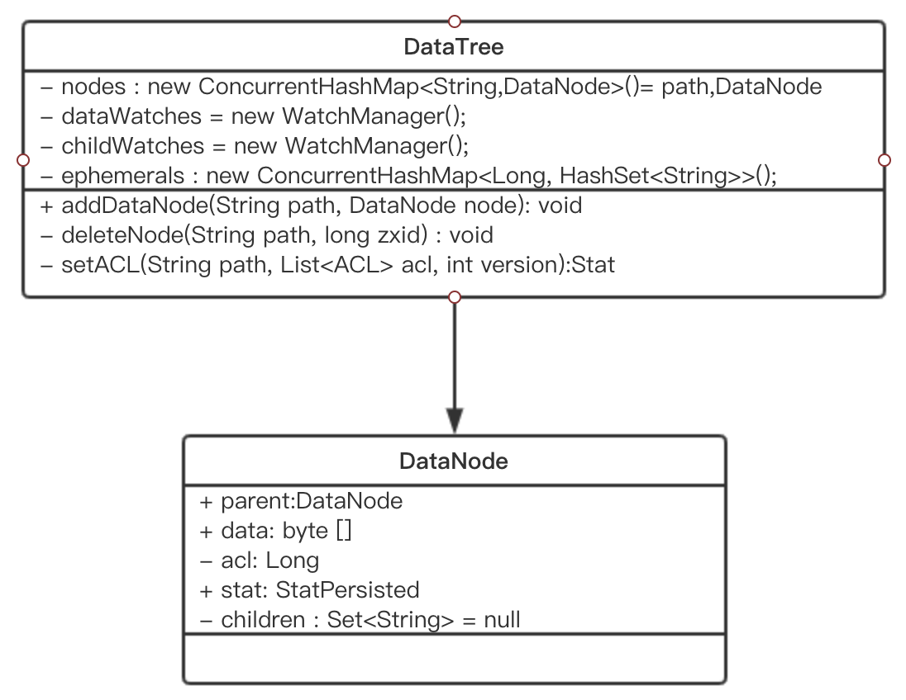
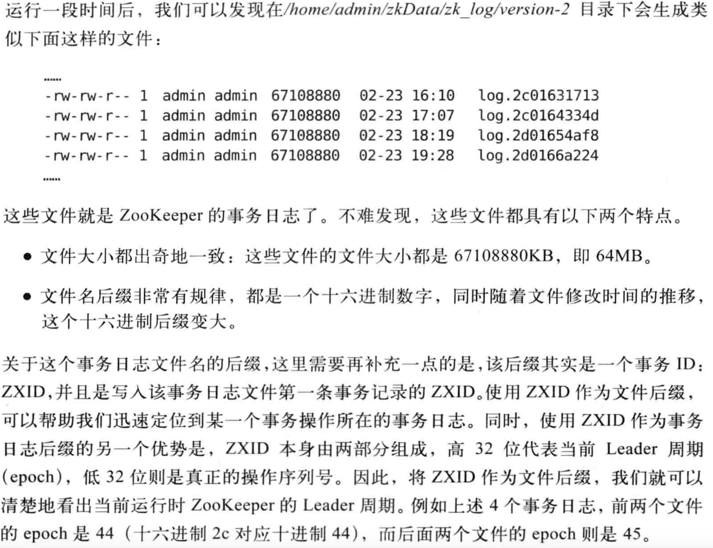
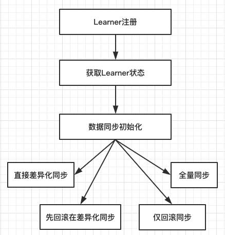
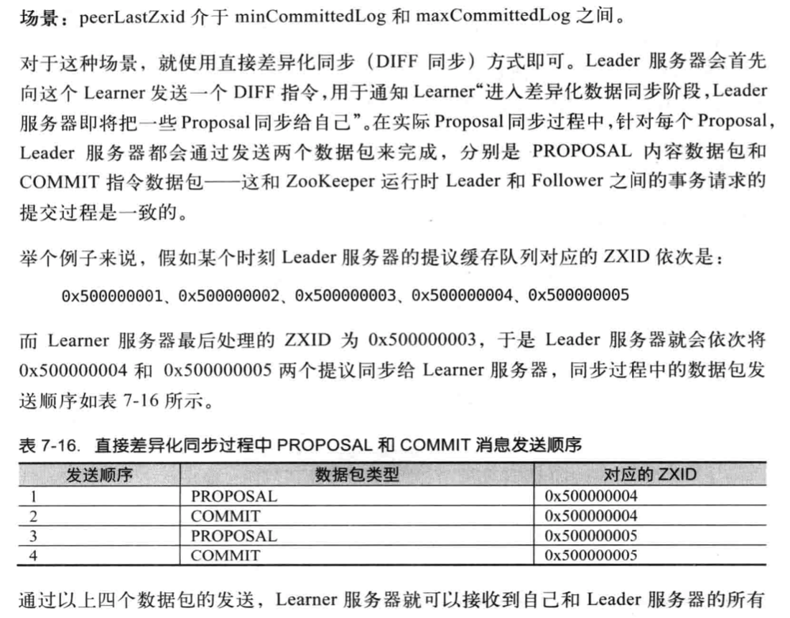
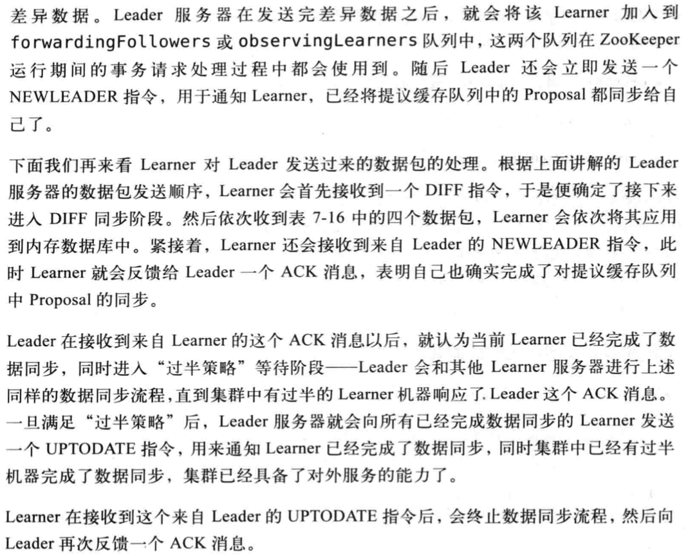
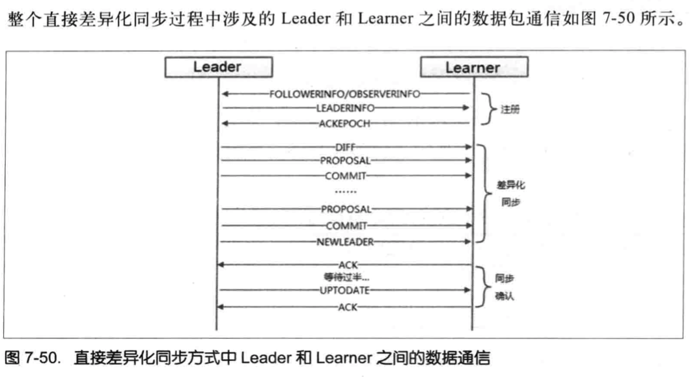
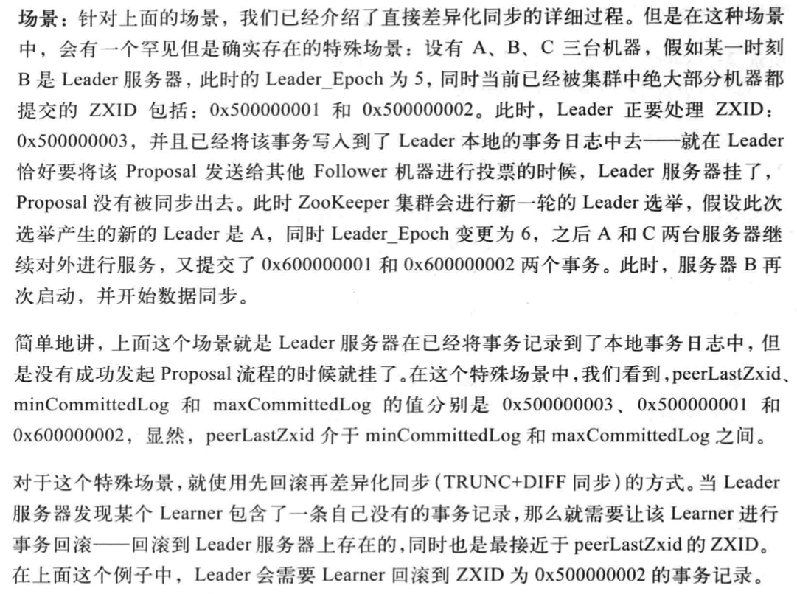
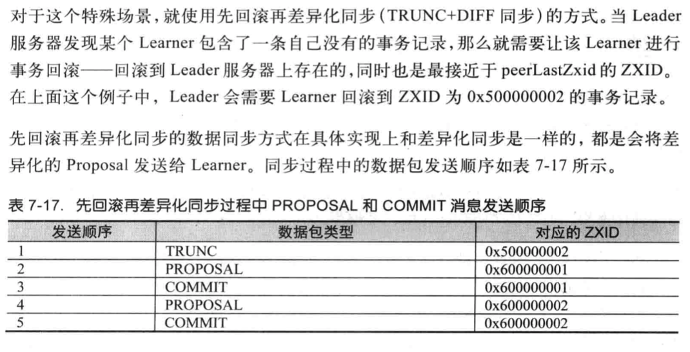
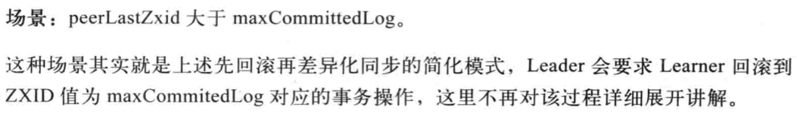
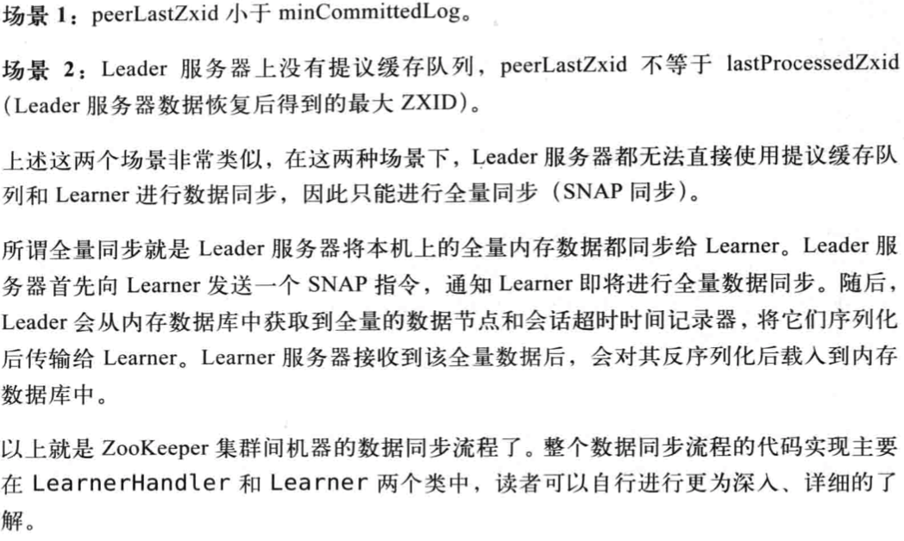

### ZooKeeper数据与存储相关逻辑
- 1、内存数据
- 2、事务日志
- 3、snapshot-- 数据快照
- 4、初始化
- 5、数据同步

至此，我们已经知道了整个ZooKeeper客户端和服务端的一些工作原理，下面我们来看看ZooKeeper最底层数据与存储的技术内幕，在ZooKeeper中，数据存储分为两部分：内存数据存储与磁盘数据存储

#### 1、内存数据
**ZooKeeper的数据模型是一棵树**。而从使用角度看Zookeeper更像一个内存数据库，在这个内存数据库中，存储了整棵树的内容，包括所有的节点路径path、节点数据Data及其ACL信息、Version等，Zookeeper会定时将这个数据存储到磁盘上。

##### DataTree
DataTree是ZooKeeper内存数据存储的核心，是一个"树"的数据结构，代表了内存中的一分完整的数据

DataTree不包含任何与网络、客户端连接以及请求处理器相关的业务逻辑，是一个非常独立的Zookeer组件。



##### DataNode
DataNode是数据存储的最小单元，其数据结构如上图所示。DataNode内部除了保存节点的数据内容（data[]）ACL列表（acl）和节点状态(stat)之外，还记录父节点(parent）的引用和子节点列表(children)的两个属性

##### nodes
DataTree用于存储所有Zookeeper节点路径、数据内容机器ACL信息，底层的数据结构其实是一个ConcurrentHashMap键值对结构：
```java
private final ConcurrentHashMap<String, DataNode> nodes =
        new ConcurrentHashMap<String, DataNode>();
```
另外，对于所有的临时节点，为了便于实时访问和及时清理，DataTree中还单独将临时节点保存起来：
```java
private final Map<Long, HashSet<String>> ephemerals =
        new ConcurrentHashMap<Long, HashSet<String>>();
```

##### ZKDatabase
ZKDatabase，正如其名字一样，是zookeeper的内存数据库，负责管理Zookeeper的所有会话，DataTree存储和事务日志。ZKDatabase会定时的向磁盘dump快照数据。同时在ZooKeeper服务器启动的时候，通过磁盘上的事务日志和快照数据文件恢复称一个完整的内存数据库。

#### 2、事务日志
##### 文件存储


##### 日志格式
##### 日志写入
##### 日志截断

#### 3、snapshot-- 数据快照
数据快照是zookeeper数据存储中另一个非常核心的运行机制。顾名思义，数据快照用来记录ZooKeeper服务器上某一个时刻的全量内存数据内容，并将其写入到指定的磁盘文件中。
##### 文件存储
##### 存储格式
##### 数据快照

#### 4、初始化
##### 初始化流程
##### PlayBackListener

#### 5、数据同步
整个集群完成Leader选举之后，Learner会向Leader服务器进行注册，就进入数据同步环节。简单地讲，数据同步过程就是Leader服务器将那些没有在Leader服务器上提交过的事务请求同步给Learner服务器，大体过程如下：



##### 获取Learner状态
在注册Leaner的最后阶段（registerWithLeader），当收到了Leader的LeaderInfo之后Learner服务器会发送给Leader服务器一个ACKEPOCH数据包，Leader会从这个数据包中解析出该Learner的currentEpoch和lastZxid

##### 数据同步初始化
在开始数据同步之前，Leader服务器会进行数据同步初始化，首先会从Zookeeper的内存数据库中提取出事务请求对应的提议缓存队列：proposals
```java
LinkedList<Proposal> proposals = leader.zk.getZKDatabase().getCommittedLog();
```
- peerLastZxid：该Learner服务器最后处理的ZXID
- minCommittedLog: Leader服务器提议缓存队列committedLog中的最小ZXID
- maxCommittedLog: Leader服务器提议缓存队列CommittedLog中最大的ZXID

ZooKeeper集群数据同步通常分为四类，分别是直接差异化同步(DIFF同步)、先回滚再差异化同步（TRUNC+DIFF同步），仅回滚同步（TRUNC同步）和全量同步（SNAP同步）。在初始化阶段，Leader服务器回优先初始化以全量同步方式来同步数据，当然，这并非最终的数据同步方式。

##### **直接差异化同步（DIFF同步）**
场景：peerLastZxid介于minCommittedLog和maxCommittedLog之间







##### **先回滚再差异化同步(TRUNC+DIFF同步)**




##### **仅回滚同步（TRUNC同步）**


##### **全量同步（SNAP同步）**


#### Leader
```java
Quorumpeer.java
//Main loop
while（running）{
    case LEADING:
        // 领导者
        try {
            // 主要就是开启LearnerHandler线程
            leader.lead();
            setLeader(null);
        }
        break;
}
```

```java
Leader.java
void lead() {
try {
    zk.loadData();

    cnxAcceptor = new LearnerCnxAcceptor();
    cnxAcceptor.start();

    readyToStart = true;
    long epoch = getEpochToPropose(self.getId(), self.getAcceptedEpoch());

    zk.setZxid(ZxidUtils.makeZxid(epoch, 0));

    synchronized(this){
        lastProposed = zk.getZxid();
    }

    newLeaderProposal.packet = new QuorumPacket(NEWLEADER, zk.getZxid(),null, null);

    waitForEpochAck(self.getId(), leaderStateSummary);
    self.setCurrentEpoch(epoch);

    waitForNewLeaderAck(self.getId(), zk.getZxid());

    // 初始化
    startZkServer();
}
```
先看loadData()从事务日志及快照文件中恢复数据的逻辑：
```java
//Restore sessions and data
public void loadData() {
    if(zkDb.isInitialized()){
        setZxid(zkDb.getDataTreeLastProcessedZxid());
    }
    else {
        setZxid(zkDb.loadDataBase());
    }
}
```
```java
//load the database from the disk onto memory and also add  the transactions to the committedlog in memory.
public long loadDataBase() {
    long zxid = snapLog.restore(dataTree, sessionsWithTimeouts, commitProposalPlaybackListener);
    initialized = true;
    return zxid;
}
```
```java
//this function restores the server database after reading from the snapshots and transaction logs
public long restore(DataTree dt, Map<Long, Integer> sessions,
            PlayBackListener listener) {
    snapLog.deserialize(dt, sessions);//通过快照重建dataTree(包括重建sessions)
    // 从快照中还原数据库时，快照很可能落后于事务日志，所以需要从落后的那一部分事务日志中更新内存
    return fastForwardFromEdits(dt, sessions, listener);
}
```
fastForwardFromEdits的具体实现逻辑
```java
//因为快照很可能落后于事务日志，所以需要从落后的那一部分事务日志中更新内存
public long fastForwardFromEdits(DataTree dt, Map<Long, Integer> sessions,
                                     PlayBackListener listener){
    //找到事务日志所在的目录
    FileTxnLog txnLog = new FileTxnLog(dataDir);
    //从快照的ZXID开始在事务日志中找到其位置
    TxnIterator itr = txnLog.read(dt.lastProcessedZxid+1);
    long highestZxid = dt.lastProcessedZxid;
    TxnHeader hdr;
    while (true) {
        // iterator points to the first valid txn when initialized
        hdr = itr.getHeader();
        if (hdr == null) {
            return dt.lastProcessedZxid;
        }
        highestZxid = hdr.getZxid();

        processTransaction(hdr,dt,sessions, itr.getTxn());

        if (!itr.next())break;
    }
    return highestZxid;
}
```
***以上代码都是loadData()重建ZooKeeper数据库的逻辑***


#### Learner(follower+observer)
```java
Quorumpeer.java
//Main loop
while（running）{
    case FOLLOWING:
        // 跟随者
        try {
            follower.followLeader();
        }
        break;
}
```
```java
void followLeader() throws InterruptedException {
    QuorumServer leaderServer = findLeader();
    // 连接leader
    connectToLeader(leaderServer.addr, leaderServer.hostname);
    // 发送
    long newEpochZxid = registerWithLeader(Leader.FOLLOWERINFO);

    syncWithLeader(newEpochZxid);    // 完成了数据同于，一起服务器初始化，可以处理请求了

    QuorumPacket qp = new QuorumPacket();
    while (this.isRunning()) {
        readPacket(qp);
        processPacket(qp);
    }
}
```
确定为Follower角色之后会发起与Leader的连接，Leader收到Follower的connection之后，会为每个follower建立一个LearnHandler，具体逻辑如下：
```java
protected void connectToLeader(InetSocketAddress addr, String hostname){
    sock = new Socket();
    sock.setSoTimeout(self.tickTime * self.initLimit);
    for (int tries = 0; tries < 5; tries++) {
        try {
            sock.connect(addr, self.tickTime * self.syncLimit);
            sock.setTcpNoDelay(nodelay);
            break;
        }
        Thread.sleep(1000);
    }

    self.authLearner.authenticate(sock, hostname);

    leaderIs = BinaryInputArchive.getArchive(new BufferedInputStream(
            sock.getInputStream()));
    bufferedOutput = new BufferedOutputStream(sock.getOutputStream());
    leaderOs = BinaryOutputArchive.getArchive(bufferedOutput);
}

//follower发送followerInfo给leader
//Send follower info, including last zxid and sid
protected long registerWithLeader(int pktType){
    long lastLoggedZxid = self.getLastLoggedZxid();
    QuorumPacket qp = new QuorumPacket();
    qp.setType(pktType);
    qp.setZxid(ZxidUtils.makeZxid(self.getAcceptedEpoch(), 0));

    LearnerInfo li = new LearnerInfo(self.getId(), 0x10000);
    ByteArrayOutputStream bsid = new ByteArrayOutputStream();
    BinaryOutputArchive boa = BinaryOutputArchive.getArchive(bsid);
    boa.writeRecord(li, "LearnerInfo");
    qp.setData(bsid.toByteArray());

    //发送followerInfo信息
    writePacket(qp, true);

    //接收LeaderInfo信息
    readPacket(qp);
    ......后续的逻辑见下面
}
```
Leader会为每个connection建立一个LearnHandler线程。在run()中接受到follower发送的FollowerInfo并解析，然后生成LeaderInfo返回给follower。具体如下
```java
Leader.java
@Override
public void run() {
    while (!stop) {
        Socket s = ss.accept();
        s.setSoTimeout(self.tickTime * self.initLimit);
        s.setTcpNoDelay(nodelay);

        BufferedInputStream is = new BufferedInputStream( s.getInputStream());

        // 除开Leader服务器，其他服务器都会与Leader建立连接，这个时候都会新建出一个LearnerHandler线程
        LearnerHandler fh = new LearnerHandler(s, is, Leader.this);
        fh.start();
    }
}

run方法事这个类最核心的方法，完成和Learner的启动时候的数据同步，同步完成后的正常交互，
LearnerHandler.java{}
public void run() {
    leader.addLearnerHandler(this);

    ia = BinaryInputArchive.getArchive(bufferedInput);
    bufferedOutput = new BufferedOutputStream(sock.getOutputStream());
    oa = BinaryOutputArchive.getArchive(bufferedOutput);

    QuorumPacket qp = new QuorumPacket();
    ia.readRecord(qp, "packet");

    byte learnerInfoData[] = qp.getData();
    if (learnerInfoData != null) { //接收learner发送过来的LearnerInfo,获取sid(serverId)
        LearnerInfo li = new LearnerInfo();
        ByteBufferInputStream.byteBuffer2Record(ByteBuffer.wrap(learnerInfoData), li);
①        this.sid = li.getServerid();
        this.version = li.getProtocolVersion();
    } else {
        this.sid = leader.followerCounter.getAndDecrement();
    }

    //记录当前learner的最新的epoch
④    long lastAcceptedEpoch = ZxidUtils.getEpochFromZxid(qp.getZxid());
    long zxid = qp.getZxid();

    // 如果learner的epoch比自己高，更新自己的
    //this.getsid()是获取的learner的sid
②    long newEpoch = leader.getEpochToPropose(this.getSid(), lastAcceptedEpoch);

    // 发送leader状态,以LEADERINFO的形式
    QuorumPacket newEpochPacket = new QuorumPacket(Leader.LEADERINFO, ZxidUtils.makeZxid(newEpoch, 0), ver, null);
③    oa.writeRecord(newEpochPacket, "packet");
    bufferedOutput.flush();
}
```
①处将Follower发送过来的FollowerInfo进行解析，解析FollowerInfo中的sid和version，并在④处根据Follower的ZXID解析出Epoch，然后在②根据follower的epoch和sid去执行proposal操作，如果follower_epoch大于leader_epoch则更新leader_epoch=follower_epoch+1，

如果isParticipant(sid),则将sid添加connectingFollowers中，如果connectingFollowers中的follower数量超过半数这表明通过过半机制，此时的leader_epoch(即newEpoch)满足了一致性，可以将此leader_epoch通过Leader_Info发送给followers

下面为:Follower收到Leader的LeadeInfo的逻辑
```java
Follower.java.follower(){
    // 收到Leader最终返回的newEpochZxid,然后接收Leader的LeaderInfo
    //逻辑都在registerWithLeader中实现
    long newEpochZxid = registerWithLeader(Leader.FOLLOWERINFO);
}

protected long registerWithLeader(int pktType){
//接收LeaderInfo信息
①    readPacket(qp);
    final long newEpoch = ZxidUtils.getEpochFromZxid(qp.getZxid());
②    if (qp.getType() == Leader.LEADERINFO) {
        leaderProtocolVersion = ByteBuffer.wrap(qp.getData()).getInt();
        byte epochBytes[] = new byte[4];
        final ByteBuffer wrappedEpochBytes = ByteBuffer.wrap(epochBytes);
        if (newEpoch > self.getAcceptedEpoch()) {
            wrappedEpochBytes.putInt((int)self.getCurrentEpoch());
            self.setAcceptedEpoch(newEpoch);
        }

③        QuorumPacket ackNewEpoch = new QuorumPacket(Leader.ACKEPOCH, lastLoggedZxid, epochBytes, null);
        writePacket(ackNewEpoch, true);
        return ZxidUtils.makeZxid(newEpoch, 0);
    }
}
```
①②处的代码实现读取Leader发来的消息，然后从LeaderInfo中解析处newEpoch。并在③处给Leader发送ackNewEpoch

下面的代码就是Leader在leader()方法中处理ackEpochPacket的逻辑

```java
LearnerHandler.java{}
public void run() {
    // 获取ack
    QuorumPacket ackEpochPacket = new QuorumPacket();
    ia.readRecord(ackEpochPacket, "packet");

    ByteBuffer bbepoch = ByteBuffer.wrap(ackEpochPacket.getData());
    ss = new StateSummary(bbepoch.getInt(), ackEpochPacket.getZxid());


    leader.waitForEpochAck(this.getSid(), ss);
}
```
waitForEpochAck的具体实现逻辑
```java
// VisibleForTesting
protected Set<Long> electingFollowers = new HashSet<Long>();
public void waitForEpochAck(long id, StateSummary ss){
        synchronized(electingFollowers) {
            if (isParticipant(id)) {
                electingFollowers.add(id);
            }
            QuorumVerifier verifier = self.getQuorumVerifier();
①            if (electingFollowers.contains(self.getId()) && verifier.containsQuorum(electingFollowers)) {
                electionFinished = true;
                electingFollowers.notifyAll();
            } else {
                long start = Time.currentElapsedTime();
                long cur = start;
                long end = start + self.getInitLimit()*self.getTickTime();
                while(!electionFinished && cur < end) {
②                    electingFollowers.wait(end - cur);
                    cur = Time.currentElapsedTime();
                }
            }
        }
    }
```
***①会判断收到LeaderInfo后返回Ack的Follower的数量，如果不满足②则electingFollowers.wait(end - cur);，如果满足则notify已经wait住的线程。因为每个follower对应一个LearnerHandler。而leader.waitForEpochAck(this.getSid(), ss);方法是learnerHandler的run方法调用的，也就是每个线程都会执行一次waitForEpochAck***

###### 当完成了上述：
1. Leader和Follower的角色确定
2. Follower发送与Leader的连接connectToLeader(）
3. Leader收到Follower的连接建立与Follower一一对应的LearnHandler线程
4. Follower向Leader发送FollowerInfo信息：registerWithLeader(Leader.FOLLOWERINFO);
5. Leader收到FollowerInfo后：进行过半机制验证，并将最终newEpochZxid作为LeaderInfo发送给所有的Follower
6. 然后follower在registerWithLeader()方法中给Leader发送ackNewEpoch
7. Leader收到过半的Follower的ackNewEpoch之后并开始数据同步工作。主要就是根据ackNewEpoch中follower的zxid和leader的zxid判断需要以那种方式进行数据同步，具体如下：
    + peerLastZxid是follower的zxid，minCommittedLog和maxCommittedLog是proposals的最小值和最大值，leader.zk.getZKDatabase().getDataTreeLastProcessedZxid()是zookeeper数据库的最新zxid
    + 如果peerLastZxid == leader.zk.getZKDatabase().getDataTreeLastProcessedZxid()；send empty diff使用Leader.DIFF
    + 如果 minCommittedLog =《peerLastZxid《=maxCommittedLog：则从peerLastZxid+1起到maxCommittedLog中的每一条事务日志
        * queuePacket(propose.packet); 将提议（其实就是数据）塞入队列
        * QuorumPacket qcommit = new QuorumPacket(Leader.COMMIT, propose.packet.getZxid(), null, null);
        * 然后再将proposal对应的commit直接塞入队列 queuePacket(qcommit);
        * 后续有一个线程从queuePacket取出发送给Follower
    + peerLastZxid > maxCommittedLog：则执行截断
        * packetToSend = Leader.TRUNC;
        * zxidToSend = maxCommittedLog;
        * updates = zxidToSend;
        * leaderLastZxid = leader.startForwarding(this, updates);
    + peerLastZxid < leader.zk.getZKDatabase().getDataTreeLastProcessedZxid()
        * 默认使用SNAP
8. Follower收到Leader的同步消息后进行数据同步：syncWithLeader(newEpochZxid);
```java
protected void syncWithLeader(long newLeaderZxid) {
    readPacket(qp);
    synchronized (zk) {
        if (qp.getType() == Leader.DIFF) {
            snapshotNeeded = false;
        } else if (qp.getType() == Leader.SNAP) {
            zk.getZKDatabase().clear();
            zk.getZKDatabase().deserializeSnapshot(leaderIs);
            String signature = leaderIs.readString("signature");
            zk.getZKDatabase().setlastProcessedZxid(qp.getZxid());
        } else if (qp.getType() == Leader.TRUNC) {
            boolean truncated=zk.getZKDatabase().truncateLog(qp.getZxid());
            zk.getZKDatabase().setlastProcessedZxid(qp.getZxid());
        }
        zk.createSessionTracker();

    // 不过是什么命令都会返回ack
    ack.setZxid(ZxidUtils.makeZxid(newEpoch, 0));
    writePacket(ack, true);
    sock.setSoTimeout(self.tickTime * self.syncLimit);
    // 服务器初始化，和单机模式一样的了
    zk.startup();
}
```

#### 小结

Leader:
1. 找到要同步的数据
2. 发送出去
3. 发送UPDATE指令

Follower:
while{
    if(commit){
    packetsCommitted;
}
}


#### 小结
ZooKeeper以树作为其内存数据模型，树上的每一个节点是最小的数据单元，即ZNode。ZNode具有不同的节点特性，同事每个节点都具有一个递增的版本号，以此可以实习那分布式数据的原子性更新。

ZooKeeper的序列化层使用从Hadoop中遗留下来的jute组件，该组件并不是性能最好的序列化框架，但是在ZooKeeper中已经足够用

Zookeeper的客户端和服务端之间会建立起TCP长连接进行网络通信，基于该TCP连接出来的会话概念，是客户端和服务端之间所有请求与响应交互的基石。在会话的生命周期中，会出现连接断开，重连或是会话失效等一系列问题，这些都是ZooKeeper会话管理需要处理的问题--Leader服务器会负责管理每个会话的生命周期，包括会话的创建、心跳检测和销毁等。

在服务器启动阶段，会进行磁盘数据的恢复，完成数据恢复后就会进行leader选举。一旦选举产生Leader服务器后，就立即开始进行集群间的数据同步--在整个过程中ZooKeeper都处于不可用状态。直到数据同步完毕（集群中绝大部分机器数据和Leader一致），ZooKeeper才可以对外提供正常服务。在运行期间，如果Leader服务器所在机器挂掉或者是集群中绝大部分服务器断开连接，那么就会触发新一轮的Leader选举，同样在新的leader服务器选举产生之前，ZooKeeper无法对外提供服务。

一个正常运行的ZooKeeper集群，其机器角色通常由Leader、Follower和Observer组成。ZooKeeper对于客户端的请求的处理，严格按照ZAB协议规范来进行。

每一个服务器在启动初始化阶段都会组装一个请求处理链，Leader服务器能够处理所有类型的客户端请求。而对于Follower和Observer服务器来说，可以正常处理非事务请求，而事务请求则需要转发给Leader服务器来处理，同时，对于每个事务请求，Leader都会为其分配一个全局唯一且递增ZXID,以此来保证事务处理的顺序性。在诗巫请求的处理过程中，Leader和follower服务器都会进行事务日志的记录。


