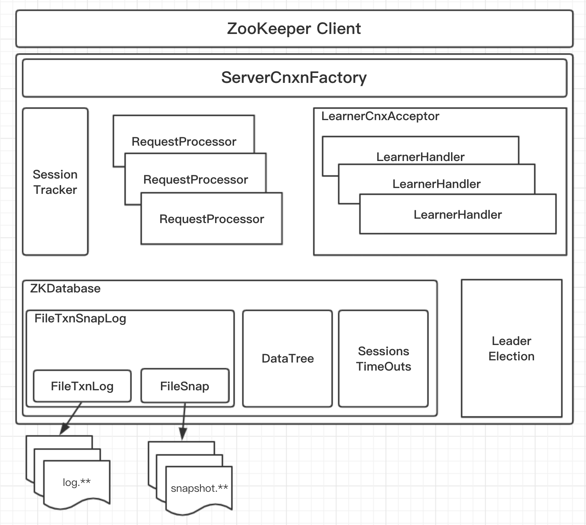
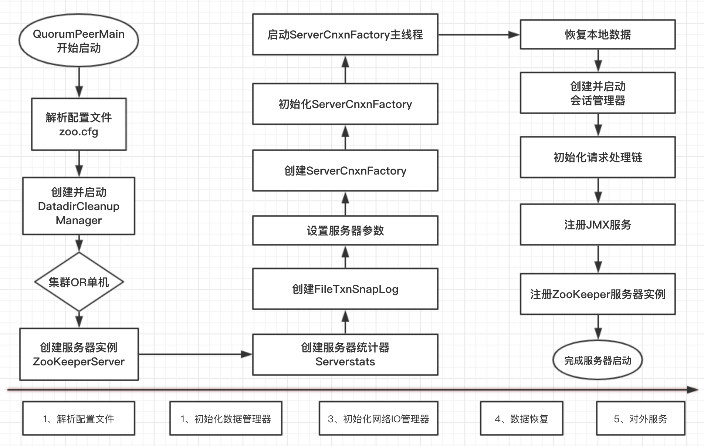
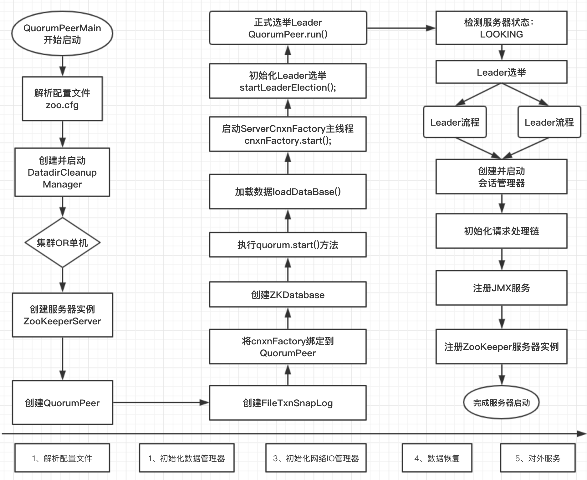
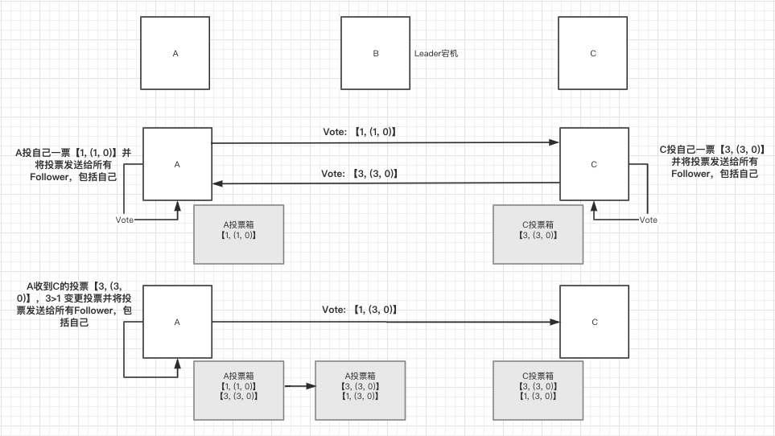
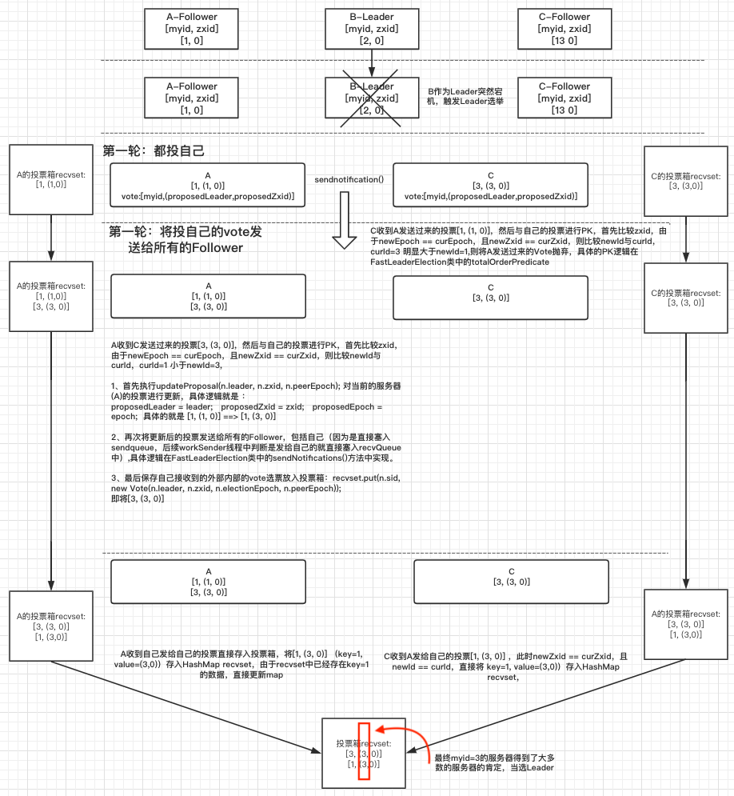
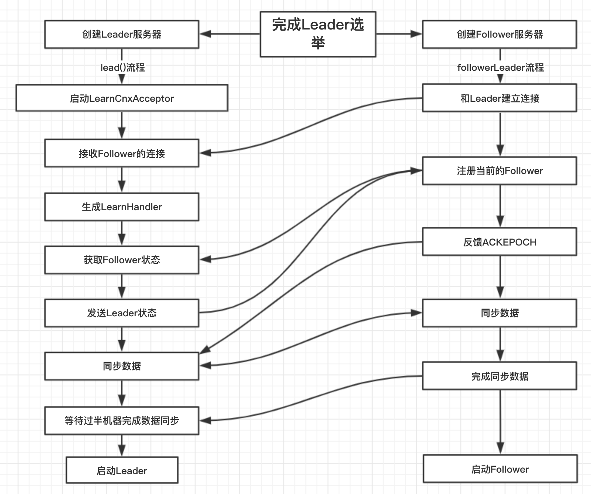

### ZooKeeper服务器启动
- 1、单机版服务器启动
- 2、集群版服务器启动

需要搞懂几个问题： 一个loaddata（启动时候如何加载txn和snap的数据到）、leader与follower之间的数据同步（新加入一个follower）、leader与follower之间的数据一致性（proposal commit）

#### 0、ZooKeeper服务端的整体架构



#### 1、单机版服务器启动
Zookeeper单机服务器的启动，大体可以分为以下五个主要步骤：1、配置文件解析；2、初始化数据管理器；3、初始化网络I/O管理器；4、数据恢复；5、对外服务

具体流程图：



##### 1)配置文件解析
```java
QuorumPeerMain{}.initializeAndRun(){
    QuorumPeerConfig config = new QuorumPeerConfig();
    if (args.length == 1) {
                config.parse(args[0]);
    }
}
```
##### 2)创建并启动DatadirCleanupManager
```java
QuorumPeerMain{}.initializeAndRun(){
// Start and schedule the the purge task
    DatadirCleanupManager purgeMgr = new DatadirCleanupManager(config
            .getDataDir(), config.getDataLogDir(), config
            .getSnapRetainCount(), config.getPurgeInterval());
    purgeMgr.start();
}
```
##### 3)判断集群还是单机
```java
//根据server.size()判断是否是集群模式
if (args.length == 1 && config.servers.size() > 0) {
    // 集群模式
    runFromConfig(config);
} else {
    // 单机模式
    ZooKeeperServerMain.main(args);
}
```
##### 4、创建服务器实例 new ZooKeeperServer()
```java
ZooKeeperServerMain{}.main(String[] args) {
    ZooKeeperServerMain main = new ZooKeeperServerMain();
    main.initializeAndRun(args);
    LOG.info("Exiting normally");
    System.exit(0);
}

ZooKeeperServerMain{}.initializeAndRun(String[] args){
    ServerConfig config = new ServerConfig();
    if (args.length == 1) {
        config.parse(args[0]);
    } else {
        config.parse(args);
    }
    runFromConfig(config);
}

ZooKeeperServerMain{}.runFromConfig(ServerConfig config){
    FileTxnSnapLog txnLog = null;
    final ZooKeeperServer zkServer = new ZooKeeperServer();
    // Registers shutdown handler which will be used to know the
    // server error or shutdown state changes.
    final CountDownLatch shutdownLatch = new CountDownLatch(1);
    zkServer.registerServerShutdownHandler(new ZooKeeperServerShutdownHandler(shutdownLatch));
}
```
##### 5、创建服务器统计器 ServerStats
```java
ZooKeeperServer{}.ZooKeeperServer() {
    serverStats = new ServerStats(this);
    listener = new ZooKeeperServerListenerImpl(this);
}
```

##### 6、创建FileTxnSnapLog
```java
ZooKeeperServerMain{}.runFromConfig(ServerConfig config) throws IOException {
    //AOF日志工具类，将dataLogDir日志目录+DataDir数据目录 传进去
    txnLog = new FileTxnSnapLog(new File(config.dataLogDir), new File(
            config.dataDir));
    txnLog.setServerStats(zkServer.serverStats());
}
```
##### 7、设置服务器参数
```java
ZooKeeperServerMain{}.runFromConfig(ServerConfig config) throws IOException {
    zkServer.setTxnLogFactory(txnLog);
    zkServer.setTickTime(config.tickTime);
    zkServer.setMinSessionTimeout(config.minSessionTimeout);
    zkServer.setMaxSessionTimeout(config.maxSessionTimeout);
}
```

##### 8、创建ServerCnxnFactory->9、初始化ServerCnxnFactory->10、启动ServerCnxnFactory主线程
```java
ZooKeeperServerMain{}.runFromConfig(ServerConfig config) throws IOException {
    // 获取建立socket工厂，工厂方法模式
    cnxnFactory = ServerCnxnFactory.createFactory();
    // 建立socket,默认是NIOServerCnxnFactory（是一个线程）
    cnxnFactory.configure(config.getClientPortAddress(),
            config.getMaxClientCnxns());
    cnxnFactory.startup(zkServer);
}
```
##### 11、恢复本地数据
```java
@Override
public void startup(ZooKeeperServer zks) throws IOException,
        InterruptedException {
    //启动 NIOServerCnxnFactory中的run方法
    start();
    //将NIOServerCnxnFactory绑定到zooKeeperServer上
    setZooKeeperServer(zks);

    //check to see if zkDb is not null
    //Restore sessions and data 加载数据
    zks.startdata();
    zks.startup();
}
//启动NIOServerCnxnFactory线程 的run 方法
@Override
public void start() {
    // ensure thread is started once and only once
    if (thread.getState() == Thread.State.NEW) {
        thread.start();
    }
}
//恢复本地数据
ZooKeeperServer{}.startdata(){
    //check to see if zkDb is not null
    if (zkDb == null) {
        zkDb = new ZKDatabase(this.txnLogFactory);
    }
    if (!zkDb.isInitialized()) {
        loadData();
    }
}
```

##### 13、创建并启动会话管理器
```java
zks.startup();
ZooKeeperServer{}.startup() {
    if (sessionTracker == null) {
        createSessionTracker();
    }
    startSessionTracker();
}
```

##### 14、初始化请求处理链
```java
zks.startup();
ZooKeeperServer{}.startup() {
    // 这里比较重要，这里设置请求处理器，包括请求前置处理器，和请求后置处理器
    // 注意，集群模式下，learner服务端都对调用这个方法，但是比如FollowerZookeeperServer和ObserverZooKeeperServer都会重写这个方法
    setupRequestProcessors();
}
```

##### 15、注册JMX服务
```java
zks.startup();
ZooKeeperServer{}.startup() {
    registerJMX();
}
```

##### 16、注册ZooKeeper服务器实例
```java
zks.startup();
ZooKeeperServer{}.startup() {
    setState(State.RUNNING);
    notifyAll();
}
```
***这里notifyAll()的作用？*** 因为在ZooKeeperServe中的createSession方法中有一个submitRequest(),这个方法会判断ZooKeeperServer的状态是否是initial即running的前一个状态，如果是initial则进行wait()。注意在notifyAll()之前 已经 创建并启动了session会话管理器
```java
ZooKeeperServer{}.createSession(ServerCnxn cnxn, byte passwd[], int timeout) {
    long sessionId = sessionTracker.createSession(timeout);
    Random r = new Random(sessionId ^ superSecret);
    r.nextBytes(passwd);
    ByteBuffer to = ByteBuffer.allocate(4);
    to.putInt(timeout);
    cnxn.setSessionId(sessionId);
    submitRequest(cnxn, sessionId, OpCode.createSession, 0, to, null);
    return sessionId;
}
```

```java
public void submitRequest(Request si) {
    if (firstProcessor == null) {
        synchronized (this) {
                // Since all requests are passed to the request
                // processor it should wait for setting up the request
                // processor chain. The state will be updated to RUNNING
                // after the setup.
                while (state == State.INITIAL) {
                    wait(1000);
                }
        }
    }
}
```

##### 预启动
###### 1、 统一由QuorumPeerMain作为启动类
无论是单机版还是集群模式启动ZooKeeper服务器，在zkServer.sh脚本中都配置使用org.apache.zookeeper.server.quorum.QuorumPeerMain作为启动入口类。
###### 2、 解析配置文件zoo.cfg
ZooKeeper首先会进行配置文件的解析，配置文件的解析其实就是对zoo.cfg文件的解析。该文件配置了ZooKeeper运行时的基本参数，包括tickTime、dataDir和clientPort等参数
###### 3、 创建并启动历史文件清理器DatadirCleanupManager
该历史文件清理器DataDirCleanupManager实现对事务日志和快照数据文件的定时清理。
###### 4、 判断当前是集群模式还是宕机模式的启动
根据配置文件中解析出来的集群服务器地址列表来判断当前是集群模式还是单机模式，如果时单机模式，那么就委托给ZooKeeperServerMain进行启动
###### 5、 再次进行配置文件zoo.cfg的解析
###### 6、 创建服务器实例ZooKeeperServer
org.apache.zookeepers.server.ZooKeeperServer是单机版ZooKeeper服务最为核心的实体类。ZooKeeper服务器首先回进行服务器实例的创建，接下来的步骤就是对该服务器实例的初始化工作，包括连接器、内存数据库和请求处理器等组件的初始化。

##### 初始化
###### 1、 创建服务器统计器ServerStats
###### 2、 创建ZooKeeper数据管理器FileTxnSnapLog
FileTxnSnapLog是ZooKeeper上层服务器和底层数据存储之间的对接层。提供了一系列操作数据文件的接口，包括事务日志文件和快照数据文件。zookeeper根据zoo.cfg文件中解析出的快照数据目录dataDir和事务日志目录dataLogDir来创建FileTxnSnapLog。
###### 3、 设置服务器tickTime和会话超时时间
###### 4、 创建serverCnxnFactory
可以通过配置系统属性zookeeper.serverCnxnFactory来指定使用ZooKeeper自己实现NIO还是使用Netty框架作为ZooKeeper服务端网络连接工厂。
###### 5、 初始化ServerCnxnFactory
ZooKeeper首先会初始化一个Thread，作为整个ServerCnxnFactory的主线程，然后再初始化NIO服务器。
###### 6、 启动ServerCnxnFactory主线程
启动步骤5中已经初始化的主线程ServerCnxnFactory的主逻辑(run方法)。需要注意的一点是，虽然这里ZooKeeper的NIO服务器已经对外开发端口2181，但是此时ZooKeeper服务器是无法正常处理客户端请求的。
###### 7、 恢复本地数据
每次ZooKeeper启动的时候，都需要从本地快照数据文件和事务日志文件中进行数据恢复。
###### 8、 创建并启动会话管理器
在zooKeeper启动阶段，会创建一个会话管理器SessionTracker。关于SessionTracker，它主要负责ZooKeeper服务端的会话管理。创建SessionTacker的时候，会初始化expirationInterval、nextExpirationTime和SessionWithTimour（用于保存每个会话的超时时间），同时还会计算出一个初始化的SessionID。SessionTracker初始化完毕后，ZooKeeper就会立即开始会话管理器的会话超时检查
###### 9、 初始化ZooKeeper的请求处理链
ZooKeeper 的请求方式是典型的责任链模式的实现，在ZooKeeper服务器上，会有多个请求处理器来处理一个客户端请求。在服务器启动的时候，会将这些请求处理器串联起来形成一个请求处理链。
###### 10、 注册JMX服务
ZooKeeper会将服务器运行时的一些信息以JMX的方式暴露给外部
###### 11、 注册ZooKeeper服务器实例
在步骤6中，ZooKeeper已经将ServerCnxnFactory主线程启动，但是ZooKeeper依然无法处理客户端请求，原因就是此时网络层还不能够访问ZooKeeper服务器实例。在经过后续步骤的初始化，ZooKeeper服务器实例已经初始化完毕，只需要注册给ServerCnxnFactory即可，之后，ZooKeeper就可以对外提供正常的服务了。

#### 2、集群版服务器启动
##### 具体代码流程
###### 1、 QuorumPeerMain开始启动
###### 2、 解析zoo.cfg
###### 3、 创建并启动DatadirCleanupManager
###### 4、 判断单机还是集群
以上4步都与单机一致：概括为加载解析配置文件并启动历史文件清理类

###### 5、 创建并初始化ServerCnxnFactory (默认为NIOServerCnxnFactory)
```java
QuorumPeerMain{}.runFromConfig(){
    ServerCnxnFactory cnxnFactory = ServerCnxnFactory.createFactory();
    cnxnFactory.configure(config.getClientPortAddress(), config.getMaxClientCnxns());
}
```
createFactory()的具体实现。
```java
在ServerCnxnFactory类中
static public ServerCnxnFactory createFactory() throws IOException {
    String serverCnxnFactoryName =
        System.getProperty(ZOOKEEPER_SERVER_CNXN_FACTORY);
    if (serverCnxnFactoryName == null) {
        serverCnxnFactoryName = NIOServerCnxnFactory.class.getName();
    }
    ServerCnxnFactory serverCnxnFactory = (ServerCnxnFactory) Class.forName(serverCnxnFactoryName)
                .getDeclaredConstructor().newInstance();

}
```

###### 6、 创建QuorumPeer
```java
QuorumPeerMain{}.runFromConfig(){
    quorumPeer = getQuorumPeer();
}
```

###### 7、 创建FileTxnSnapLog
```java
QuorumPeerMain{}.runFromConfig(){
    quorumPeer.setTxnFactory(
        new FileTxnSnapLog( new File(config.getDataLogDir()), new File(config.getDataDir())));
}
```

###### 8、 将cnxnFactory绑定到QuorumPeer
```java
QuorumPeerMain{}.runFromConfig(){
    quorumPeer.setCnxnFactory(cnxnFactory);
}
```

###### 9、 创建ZKDataBase()
```java
QuorumPeerMain{}.runFromConfig(){
    quorumPeer.setZKDatabase(
        new ZKDatabase(quorumPeer.getTxnFactory()));

}
```
###### 10、 执行quorum.start()方法
```java
QuorumPeerMain{}.runFromConfig(){
    quorumPeer.start();
}
```
```java
QuorumPeer.java
@Override
public synchronized void start() {
    // 加载数据
    loadDataBase();
    // 开启读取数据线程
    cnxnFactory.start();
    // 进行领导者选举，确定服务器的角色，再针对不同的服务器角色进行初始化
    startLeaderElection();
    // 本类的run方法
    super.start();
}
```

###### 11、 加载本地数据
###### 12、 启动ServerCnxnFactory主线程
###### 13、 初始化Leader选举
```java
QuorumPeer.java
synchronized public void startLeaderElection() {
    // 生成投票，投给自己
    currentVote = new Vote(myid, getLastLoggedZxid(), getCurrentEpoch());
    for (QuorumServer p : getView().values()) {
        if (p.id == myid) {
            myQuorumAddr = p.addr;
            break;
        }
    }
    this.electionAlg = createElectionAlgorithm(electionType);
}
```

```java
QuorumPeer.java
protected Election createElectionAlgorithm(int electionAlgorithm){
        Election le=null;
        switch (electionAlgorithm) {
        case 3:
            // 初始化负责各台服务器之间的底层Leader选举过程中的网络通信。
            qcm = createCnxnManager();
            QuorumCnxManager.Listener listener = qcm.listener;
            listener.start();
            // 默认用的是FastLeaderElection
            break;
        }
        return le;
    }
```
**创建QuorumCnxnManager类，QuorumCnxnManager是ZooKeeper集群同步数据通信的通信层。**
```java
public QuorumCnxManager createCnxnManager() {
        return new QuorumCnxManager(this.getId(), this.getView(), this.authServer, this.authLearner, this.tickTime * this.syncLimit,
            this.getQuorumListenOnAllIPs(), this.quorumCnxnThreadsSize,this.isQuorumSaslAuthEnabled());
}
```
**QuorumCnxManager.Listener listener = qcm.listener; 用于监听服务器的3887端口，如果有其他server请求连接，也就是又socket建立则receiveConnection(client);**
```java
在createElectionAlgorithm中执行listener.start(); 即执行了Listener的run()方法
QuorumCnxManager{}.public class Listener extends ZooKeeperThread {
    @Override
    public void run() {
        int numRetries = 0;
        InetSocketAddress addr;
        while((!shutdown) && (numRetries < 3)){
            try {
                ss = new ServerSocket();
                ss.setReuseAddress(true);
                int port = view.get(QuorumCnxManager.this.mySid)
                        .electionAddr.getPort();
                addr = new InetSocketAddress(port);
                ss.bind(addr);
                while (!shutdown) {
                    Socket client = ss.accept(); //
                    setSockOpts(client);

                    if (quorumSaslAuthEnabled) {
                        receiveConnectionAsync(client);
                    } else {
                        // 一个socket调用一次
                        receiveConnection(client);
                    }
                    numRetries = 0;
                }}}}
}
```

```java
// 一个socket调用一次
public void receiveConnection(final Socket sock) {
    DataInputStream din = null; //socket建立传送的数据
    din = new DataInputStream(
                new BufferedInputStream(sock.getInputStream()));

    handleConnection(sock, din);
}
```
在进行leader选举时候，建立各个server之间建立TCP连接的时候，即连接3887端口的时候，并不是ServerA与ServerB建立一个socket连接，ServerB与ServerA再次建立一个Socket连接。而是两个Server之间只会建立一个TCP连接，建立的规则只允许大的myid去连小的myid。

并在QuorumCnxnManager{}.handleConnection中建立了两个线程SendWorker和RecvWorker，然后启动这两个线程。

```java
在QuorumCnxnManager.java中
// 接受连接
private void handleConnection(Socket sock, DataInputStream din)
        throws IOException {
    Long sid = null;

    //If wins the challenge, then close the new connection.
    // 如果我的sid大于对方的，则有我去连接他
    if (sid < this.mySid) {  // sid是对方的sid
        SendWorker sw = senderWorkerMap.get(sid);
        if (sw != null) {
            sw.finish();
        }
        /*
         * Now we start a new connection
         */
        LOG.debug("Create new connection to server: " + sid);
        closeSocket(sock);
        connectOne(sid);
        // Otherwise start worker threads to receive data.
    } else {
        SendWorker sw = new SendWorker(sock, sid);
        RecvWorker rw = new RecvWorker(sock, din, sid, sw);
        sw.setRecv(rw);
        SendWorker vsw = senderWorkerMap.get(sid);
        if(vsw != null)
            vsw.finish();

        senderWorkerMap.put(sid, sw);
        queueSendMap.putIfAbsent(sid, new ArrayBlockingQueue<ByteBuffer>(SEND_CAPACITY));
        sw.start();
        rw.start();

        return;
    }
}
```
在case 3: 中执行完listener.start();
```java
case 3:
    // 初始化负责各台服务器之间的底层Leader选举过程中的网络通信。
    qcm = createCnxnManager();
    QuorumCnxManager.Listener listener = qcm.listener;
    if(listener != null){
        listener.start();
        // 默认用的是FastLeaderElection
        le = new FastLeaderElection(this, qcm);
    }
```

new 出FastLeaderElection()
```java
public FastLeaderElection(QuorumPeer self, QuorumCnxManager manager){
    this.stop = false;
    this.manager = manager;
    // 初始化sendqueue、recvqueue 并且启动WorkerSender和WorkerReceiver线程
    starter(self, manager);
}
```

```java
 FastLeaderElection{}.private void starter(QuorumPeer self, QuorumCnxManager manager) {
    this.self = self;
    proposedLeader = -1;
    proposedZxid = -1;

    sendqueue = new LinkedBlockingQueue<ToSend>();
    recvqueue = new LinkedBlockingQueue<Notification>();
    this.messenger = new Messenger(manager);
}
```
在new Messager中初始化sendqueue、recvqueue 并且启动WorkerSender和WorkerReceiver线程
```java
FastLeaderElection{}.Messenger(QuorumCnxManager manager) {
    this.ws = new WorkerSender(manager);
    Thread t = new Thread(this.ws,
            "WorkerSender[myid=" + self.getId() + "]");
    t.setDaemon(true);
    t.start();

    this.wr = new WorkerReceiver(manager);
    t = new Thread(this.wr,
            "WorkerReceiver[myid=" + self.getId() + "]");
    t.setDaemon(true);
    t.start();
}
```

###### 4、 正式选举Leader

```java
QuorumPeer.java
@Override
public synchronized void start() {
    // 本类的run方法
    super.start();
}
```
```java
QuorumPeer.java
@Override
public void run() {
//Main loop
    while (running) {
        // 本机服务器状态
        switch (getPeerState()) {
        case LOOKING:
            // 正在寻找leader
            // 直接看这里
            // 兼容性代码
            setBCVote(null);
            setCurrentVote(makeLEStrategy().lookForLeader());
            break;
        case OBSERVING:
            // 观察者
            try {
                // observer用到的两个CommitProcessor、SyncRequestProcessor
                setObserver(makeObserver(logFactory));
                observer.observeLeader();
            }
            break;
        case FOLLOWING:
            // 跟随者
            try {
                setFollower(makeFollower(logFactory));
                follower.followLeader();
            }
            break;
        case LEADING:
            // 领导者
            try {
                setLeader(makeLeader(logFactory));
                // 主要就是开启LearnerHandler线程
                leader.lead();
                setLeader(null);
            }
            break;
        }}
}
```
检测到服务器的状态时LOOKING状态，然后执行QuorumPeer{}.run()方法中的 makeLEStrategy().lookForLeader(),关于Zookeeper的leader选举的核心逻辑都在lookForLeader这种类中
```java
/**
 * Starts a new round of leader election. Whenever our QuorumPeer
 * changes its state to LOOKING, this method is invoked, and it
 * sends notifications to all other peers.
 */
public Vote lookForLeader() throws InterruptedException {
    HashMap<Long, Vote> recvset = new HashMap<Long, Vote>(); //投票箱，key:其他服务器sid，Vote
    HashMap<Long, Vote> outofelection = new HashMap<Long, Vote>();
    int notTimeout = finalizeWait;
    synchronized(this){
        logicalclock.incrementAndGet(); // 时钟+1
        //更新提议，包含(myid,lastZxid,epoch)，更新为自己,其实就是投票
        updateProposal(getInitId(), getInitLastLoggedZxid(), getPeerEpoch());
    }

    sendNotifications(); // 启动时先投票给自己
    // Loop in which we exchange notifications until we find a leader

    while ((self.getPeerState() == ServerState.LOOKING) && (!stop)){
        //只要没有停止，并且状态处于LOOKING状态
        // Remove next notification from queue, times out after 2 times the termination time  获取其他服务器的投票

        Notification n = recvqueue.poll(notTimeout, TimeUnit.MILLISECONDS);

        //Sends more notifications if haven't received enough.  Otherwise processes new notification.
        if(n == null){
            // 获取到的选票是空的，判断有没有需要发送的数据
            // 因为之前已经sendNotifications过一次了（投票给自己），所以如果走到这里来，发现有东西没发送出去，那么可能的原因就是连接还没建立
            if(manager.haveDelivered()){ // 如果都已经
                sendNotifications();
            } else {
                // 连接所有可以投票的服务器,谁可以投票，
                manager.connectAll();
            }
        }
        else if(validVoter(n.sid) && validVoter(n.leader)) {
            // 如果接收到了结果
            switch (n.state) {
            case LOOKING:
                // 发送选票的服务器也在进行领导者选举
                // If notification > current, replace and send messages out
                if (n.electionEpoch > logicalclock.get()) { //如果接收到的投票轮次比自己的高
                    logicalclock.set(n.electionEpoch); // 设置自己的时钟为选票的时钟
                    recvset.clear(); // 清空自己的选票

                    // 比较选票对应的服务器和本机，如果选票对应的服务器更新就更新投票为选票所对应的服务器
                    if(totalOrderPredicate(n.leader, n.zxid, n.peerEpoch,
                            getInitId(), getInitLastLoggedZxid(), getPeerEpoch())) {
                        updateProposal(n.leader, n.zxid, n.peerEpoch);
                    } else {
                        // 否则投给自己
                        updateProposal(getInitId(),
                                getInitLastLoggedZxid(),
                                getPeerEpoch());
                    }
                    // 发送投票
                    sendNotifications();
                } else if (n.electionEpoch < logicalclock.get()) {
                    // 接受到的选票小于自己的时钟，放弃
                    break;
                } else if (totalOrderPredicate(n.leader, n.zxid, n.peerEpoch,
                        proposedLeader, proposedZxid, proposedEpoch)) {
                    // 如果时钟相等，同样比较谁的服务器更新
                    updateProposal(n.leader, n.zxid, n.peerEpoch);
                    sendNotifications();
                }

                // 保存自己接受到的选票
                recvset.put(n.sid, new Vote(n.leader, n.zxid, n.electionEpoch, n.peerEpoch));

                // 根据接受到的选票，以及自己的投票，来判断能不能成为Leader
                if (termPredicate(recvset,
                        new Vote(proposedLeader, proposedZxid,
                                logicalclock.get(), proposedEpoch))) {
                    // 如果符合过半验证，本台服务器就认为选出了Leader
                    // Verify if there is any change in the proposed leader
                    while((n = recvqueue.poll(finalizeWait,
                            TimeUnit.MILLISECONDS)) != null){
                        // 如果又接收到了选票，如果该选票比刚刚选出来的更优秀，则把该选票加入recvqueue中，并且退出这个while，退出这个while会继续走上层的while
                        // 这个地方的逻辑其实就是，我已经选出了一个Leader，但有过来的新的投票，如果说新票所对应的服务器没有我选出来的Leader优秀，那么不用管了，继续读取下一个选票进行同样的判断，
                        // 如果说新的投票所对应的服务器比我选出来的要优秀，那么重新把这个选票放回到recvqueue，并退出当前循环，进入上层循环，重新开始选举
                        // 如果不够优秀，则继续循环，直到没有获取到选票了
                        if(totalOrderPredicate(n.leader, n.zxid, n.peerEpoch,
                                proposedLeader, proposedZxid, proposedEpoch)){
                            recvqueue.put(n);
                            break;
                        }
                    }
                }
                break;
            case OBSERVING:
                LOG.debug("Notification from observer: " + n.sid);
                break;
            case FOLLOWING:
            case LEADING:
    return null;
}
```

###### 5、 确定好leader角色和Follower的角色之后执行leader.lead()和follower.followLeader();
follower的相关逻辑，包括创建并启动会话管理器、初始化请求处理链、注册JMX服务、注册ZooKeeperf服务器实例
```java
QuorumPeer{}.run()
case FOLLOWING:
    // 跟随者
    try {
        setFollower(makeFollower(logFactory));
        follower.followLeader();
    }
    break;
```

```java
Follower{}.void followLeader() throws InterruptedException {
    QuorumServer leaderServer = findLeader();
    try {
        connectToLeader(leaderServer.addr, leaderServer.hostname); // 连接leader
        long newEpochZxid = registerWithLeader(Leader.FOLLOWERINFO); // 发送
        long newEpoch = ZxidUtils.getEpochFromZxid(newEpochZxid);

        syncWithLeader(newEpochZxid);    // 完成了数据同于，一起服务器初始化，可以处理请求了
        QuorumPacket qp = new QuorumPacket();
        while (this.isRunning()) {
            readPacket(qp);
            processPacket(qp);
        }
    }
}
```
```java
Leaner.java
protected void syncWithLeader(long newLeaderZxid) {
    readPacket(qp);
    zk.createSessionTracker();
    // 服务器初始化，和单机模式一样的了
    zk.startup();
}
```
```java
ZookeeperServer.java
public synchronized void startup() {
    startSessionTracker();

    // 这里比较重要，这里设置请求处理器，包括请求前置处理器，和请求后置处理器
    // 注意，集群模式下，learner服务端都对调用这个方法，但是比如FollowerZookeeperServer和ObserverZooKeeperServer都会重写这个方法
    setupRequestProcessors();

    registerJMX();

    setState(State.RUNNING);
    notifyAll();
}
```
Leader的相关逻辑：

```java
QuorumPeer{}.run()
case LEADING:
    // 领导者
    try {
        setLeader(makeLeader(logFactory));
        // 主要就是开启LearnerHandler线程
        leader.lead();
        setLeader(null);
    }
    break;
```
```java
Leader{}.lead(){
    zk.loadData();
    // Start thread that waits for connection requests from
    // new followers.
    cnxAcceptor = new LearnerCnxAcceptor();
    cnxAcceptor.start();
    // 初始化
    startZkServer();
}
```
```java
ZooKeeper.java
//Start up Leader ZooKeeper server and initialize zxid to the new epoch
private synchronized void startZkServer() {
    lastCommitted = zk.getZxid();
    // 启动服务器
    zk.startup();

    self.updateElectionVote(getEpoch());
    zk.getZKDatabase().setlastProcessedZxid(zk.getZxid());
}
```



##### 预启动
预启动的步骤如下。

###### 1、 统一由QuorumPeerMain作为启动类
###### 2、 解析配置文件zoo.cfg
###### 3、 创建并启动历史文件清理器DatadirCleanupManager
###### 4、 判断当前是集群模式还是单机模式的启动
在集群模式中，由于已经在zoo.cfg中配置了多个服务器地址，因此此处选择集群模式启动ZooKeeper。

##### 初始化
###### 1、 创建ServerCnxnFactory
###### 2、 创建QuorumPeer
Quorum是集群模式下特有的对象，是ZooKeeper服务器实例(ZookeeperServer)的托管者,从集群层面上看，QuorumPeer代表了ZooKeeper集群中的一台机器，在运行期间，QuorumPeer会不断检测当前服务器实例的运行状态，同时根据情况发起Leader选举。
###### 3、 创建FileTxnSnapLog ：ZooKeeper数据管理器FileTxnSnapLog
###### 4、 将cnxnFactory绑定到QurumPeer
###### 5、 创建ZKDatabase
ZKDatabase是ZooKeeper的内存数据库，负责管理ZooKeeper的所有会话记录以及DataTree和事务日志的存储。
###### 6、 初始化QuorumPeer
QuorumPeer是ZooKeeperServer的托管者，因为需要将一些核心组件注册到QuorumPeer中去，包括FileTxnSnapLog，ServerCnxnFactory和ZKDatabase。同时ZooKeeper还会对QuorumPeer配置一些参数，包括服务器地址列表，Leader选举算法和会话超时时间限制等。
###### 7、 执行quorum.start()方法
- 执行quorum.start()方法
    + 加载数据loadDataBase()
    + 启动ServerCnxnFactory主线程cnxnFactory.start()
    + 初始化Leader选举 startLeaderElection();
    + 正式选举Leader QuorumPeer.run()

##### Leader选举
- Leader选举
    + 初始化Leader选举
Leader选举可以说是集群和单机模式启动ZooKeeper最大的不同点。ZooKeeper首先会根据自身的SID(服务器ID)、lastLoggedZxid（最新的ZXID）和当前的服务器epoch(currentEpoch)来生成一个初始化的投票---简单地讲，在初始化过程中，每个服务器都会给自己投票。
在初始化阶段Zookeeper首先会创建Leader选举所需的网络I/O层QuorumCnxManager,同时启动对Leader选举端口的监听，等待集群中其他服务器创建连接。

    + 正式选举Leader QuorumPeer.run()
    + 检测当前服务器状态
Quorum是ZooKeeper服务器实例的托管者，在运行期间，QuorumPeer的核心工作就是不断地检测当前服务的状态，并作出相应的处理。在正常情况下，ZooKeeper服务器的状态在LOOKING、LEADING和FOLLOWING/OBSERVING之间进行切换。而在启动阶段，QuorumPeer的初始化状态是LOOKING，因此开始进行Leader选举
    + Leader选举
关于Leader选举算法，就是集群中哪个机器处理的数据越新，其越有可能成为Leader。当然，如果集群中所有的机器处理的ZXID一致的话，那么SID最大的服务器成为Leader。





##### Leader和Follower启动期交互过程
到这里为止，ZooKeeper已经完成了Leader选举，并且集群中每个服务器都已经确定了自己的角色--通常情况下就分为Leader和Follower两种角色，下面介绍下Leader和Follower在启动期间的工作原理进行讲解，其大致交互流程如图：



Leader和Follower服务器启动期交互过程包括如下步骤。

###### 1、 创建Leader服务器和Follower服务器
完成Leader选举之后，每个服务器都会根据自己的服务器角色创建相应的服务器实例，并开始进入各自角色嗯主流程。
###### 2、 Leader服务器启动Follower接收器LearnerCnxAcceptor
在ZooKeeper集群运行期间，Leader服务器需要和所有其余的服务器保持连接以确定集群的机器的存活情况。LearnerCnxAceeptor接收器用于负责接收所有非Leader服务器的连接请求。
###### 3、 Learner服务器和Leader服务器建立连接
所有的Learner服务器在启动完毕后，会从Leader选举的投票结果中找到当前集群中的Leader服务器，然后与其建立连接。
###### 4、 Leader服务器创建LearnerHandler
Leader接收到来自其他机器的连接创建请求后，会创建一个LearnerHander实例。每个LearnerHandler实例都对应一个Leader与Learner服务器之间的连接，其负责Leader和Learner服务器之间几乎所有的消息通信和数据同步
###### 5、 向Leader注册
当和Leader建立起连接后，Learner就会开始向Leader进行注册--所谓的注册，其实就是将Learner服务器自己的基本信息发送给Leader服务器，我们称之为LearnerInfo,包括当前服务器的SID和服务器处理的最新的ZXID。
###### 6、 Leader解析Learner信息，计算新的epoch
Leader服务器在接受到Learner的基本信息后，会解析出该Learner的SID和ZXID，然后根据该Learner的ZXID解析出对应的epoch_of_learner，和当前Leader服务器的epoch_of_leader进行比较，如果该Learner的epoch_of_learner更大的话，那么就更新Leader的epoch:

epoch_of_leader  = epoch_of_learner + 1

然后，LearnerHandler就会等待，知道过半的Learner已经向Leader进行了注册，同时更新了epoch_of_leader之后，leader就可以确定当前集群的epoch了。

###### 7、 发送Leader状态
计算出新的epoch之后，Leader会将该信息以一个LEADERINFO消息的形式发送给Learner，同时等待Learner的响应。

###### 8、 Learner发送ACK消息
Follower在收到来自Leader的LEADERINFO消息以后，会解析出epoch 和ZXID,然后向Leader反馈一个ACKEPOCH响应。

###### 9、 数据同步
Leader服务器接收到Learner的这个ACK消息之后，就可以开始与其进行数据同步了。

###### 10、 启动Leader和Learner服务器
有过半的Learner已经完成了数据同步，那么Leader和Learner服务器实例就可以开始启动了。

##### Leader和Follower启动
Leader和Follower的启动步骤如下：

1. 创建并启动会话管理器
2. 初始化ZooKeeper的请求处理链
3. 注册JMX服务

至此集群版本的ZooKeeper服务器启动完毕


