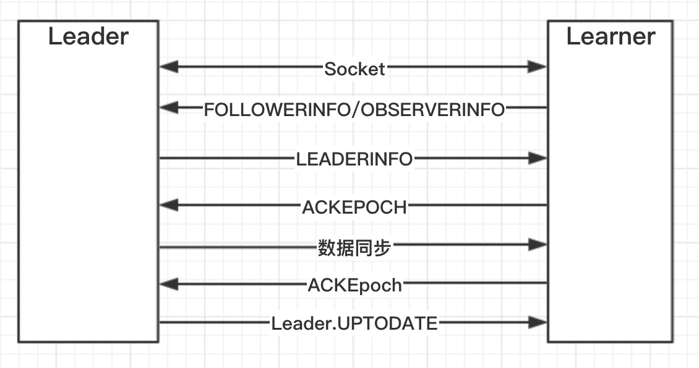

### ZooKeeper集群模式下的请求处理流程
- 问题一：ZooKeeper集群模式下如何保证数据的一致性
- 问题二：ZooKeeper集群启动有哪些步骤？
- 问题三：Follower是如何向Leader同步数据的？
- 问题四：ZooKeeper服务器有几个端口，分别是干什么的？
- 问题五：什么时候会检查服务器的过半机制？
- 问题六：ZooKeeper集群模式下启动过程
- 问题七：ZooKeeper服务器状态有哪些？
- 问题八：服务器当选Leader会执行哪些操作？服务器当选Follower会执行哪些操作？
- 问题九：Zxid是什么？
- 问题十：服务器当选Leader后与Follower的通信中有哪些操作比较耗时。
- 问题十一：Leader和Learner之间是如何同步数据的？
- 问题十二：ZooKeeper集群是如何处理谢请求的？
- 问题十三：ZooKeeper Server端什么时候执行addCommittedProposal（即什么时候会往committedLog中添加数据）
- 问题十四：ZooKeeper Server中Leader、Follower和Observer三者中的processors有什么区别？

#### 问题一


#### 问题二：ZooKeeper集群启动有哪些步骤？
1. 加载配置
2. 启动socket
3. Leader选举
4. 同步数据(follower的数据同步)
5. 初始RequestProcessor
6. 返回Response(FinalRequestProcessor)


#### 问题四：ZooKeeper服务器有几个端口，分别是干什么的？
在ZooKeeper服务器中（无论是Leader还是Follower）都有三个端口：
```java
clientPort=2281
server.1=localhost:2887:3887
```
- 其中clientPort是用来与Client之间进行socket连接的
- port=2887 用于服务器之间的交互和同步用的
- electionport=3887 用于Zookeeper选举用的端口

####  问题五：什么时候会检查服务器的过半机制？
在Zookeeper服务器启动加载配置的时候就会去验证过半机制
```java
- QuorumPeerMain{}.main()
- - main.initializeAndRun(args);
- - - QuorumPeerConfig config.parse(args[0]);
- - - - quorumVerifier = new QuorumMaj(servers.size()); // 目前这个servers不包括参与者，所以再算过半的时候不包括观察者
```

#### 问题六：ZooKeeper集群模式下启动过程
**QuorumPeer类的作用**：This class manages the quorum protocol. There are three states this server； **并且这个类是一个线程Thread**。

**关于loadDataBase()这个方法的说明和理解** ： 如果ZooKeeper集群在7 zxid处宕机了，此时只在4 zxid处生成了快照snapshots。如果重新启动集群，只导入snapshots进入DataTree可能丢掉5、6、7三条数据，因此在完成从sanpshots导入数据后，还需要根据snapshots的最后一条数据的zxid：4去transaction logs(事务日志)中恢复数据。

从快照中还原数据库时，快照很可能落后于事务日志，所以需要从落后的那一部分事务日志中更新内存
```
1
2
3
4 -- 生成了快照snapshots 并持久化
5
6
7 -- 如果ZooKeeper在此时宕机了
```

```java
- ZooKeeperMain{}.funFromConfig();
- - NIOServerCnxnFactory cnxnFactory = ServerCnxnFactoru.createFactory();// 默认是生成一个NIOServerCnxnFactory  nioServerCnxnFactory的run()方法中实现了NIO的逻辑 while()循环{+ selector.selectedKeys();} 即打开了2281端口的ServerSocket
- - quorumPeer = getQuorumPeer();new 出来一个ZooKeeper集群Server的类
- - quorumPeer.start();
- - - loadDataBase(); 加载数据
- - - - QuorumPeer{}.loadDataBase();
- - - - - ZKDatabase{}.zkDb.loadDataBase();load the database from the disk onto memory and also add the transactions to the committedlog in memory. @return the last valid zxid on disk
- - - - - - FileTxnSnapLog snapLog.restore(dataTree, sessionsWithTimeouts, commitProposalPlaybackListener); // this function restores the server database after reading from the snapshots(快照) and transaction logs(事务日志)
- - - - - - - snapLog.deserialize(dt, sessions);//先从snapshots中恢复数据，deserialize a data tree from the last valid snapshot and @return the last zxid that was deserialized
- - - - - - - fastForwardFromEdits(dt, sessions, listener);//然后从transaction log中恢复数据
- - - - - - - - TxnIterator itr = txnLog.read(dt.lastProcessedZxid+1);//读出从snapshots中恢复数据后的 DataTree中最大的Zxid
- - - - - - - - - while(true)
- - - - - - - - - - processTransaction(hdr,dt,sessions, itr.getTxn());
- - - - - - - - - - - FileTxnSnapLog{}.processTransaction() //process the transaction on the datatree

- - - cnxnFactory.start(); 开启一个线程读取客户端的请求，开启读取数据线程
- - - startLeaderElection(); 进行领导者选举，确定服务器的角色，再针对不同的服务器角色进行初始化
- - - super.start()
- - quorumPeer.join();

```

#### 问题七：ZooKeeper服务器状态有哪些？
LOOKING（正在领导者选举）、OBSERVING、FOLLOWING、LEADING四种状态。

#### 问题八：服务器当选Leader会执行哪些操作？服务器当选Follower会执行哪些操作？

**FileTnxSnapLog{}**封装了TxnLog和SnapShot，其在持久化过程中是一个帮助类：This is a helper class above the implementations of txnlog and snapshot classes

**LeaderZooKeeperServer**，Just like the standard ZooKeeperServer. We just replace the request processors: PrepRequestProcessor -> ProposalRequestProcessor -> CommitProcessor -> Leader.ToBeAppliedRequestProcessor -> FinalRequestProcessor

**Leader**

**Follower**

**Learner**

**LearnerHandler**

#### 问题九：Zxid是什么？
在ZAB协议的事务编号Zxid设计中，Zxid是一个64位的数字，其中低32位是一个简单的单调递增的计数器，针对客户端每一个事务请求，计数器加1；而高32位则代表Leader周期epoch的编号，每个当选产生一个新的Leader服务器，就会从这个Leader服务器上取出其本地日志最大事务的ZXID,并从中读取epoch值，然后加1，以此作为新的epoch，并将低32位从0开始计数。


#### 问题十：服务器当选Leader后与Follower的通信中有哪些操作比较耗时。
**LearnerHandler{}的作用：**There will be an instance of this class created by the Leader for each learner. All communication with a learner is handled by this class.

**Learner{}的作用：**This class is the superclass of two of the three main actors in a ZK ensemble: Followers and Observers. Both Followers and Observers share a good deal of code which is moved into Peer to avoid duplication.

假定有A、B、C、D、E五台服务器Server，当A当选为Leader后，B、C、D、E分别为四台Follower。

B、C、D、E四个Follower会执行Follower.followLeader()：
```java
- connectToLeader(leaderServer.addr, leaderServer.hostname)//连接leader
- long newEpochZxid = registerWithLeader(10);//This message type is sent by the leader to indicate it's zxid and if needed, its database.即给Leader发送消息表明自己的Zxid
- - Learner{}.registerWithLeader();
- - - Learner{}.writePacket(QuorumPacket qp, true);
- - - Learner{}.readPacket(QuorumPacket qp);
- - - - 如果收到的QuorumPacket的Type是leaderinfo即：qp.getType() == Leader.LEADERINFO
- - - - - QuorumPacket ackNewEpoch = new QuorumPacket(Leader.ACKEPOCH, lastLoggedZxid, epochBytes, null);
- - - - - writePacket(ackNewEpoch, true);//将ACK信息写会至Leader
```

然后Leader收到Follower的socket请求,Leader{}.leader();
```java
// Start thread that waits for connection requests from new followers.
- LearnerCnxAcceptor cnxAcceptor = new LearnerCnxAcceptor()
- cnxAcceptor.start();
- - LearnerCnxAcceptor{}.run()//Leader{}.LearnerCnxAcceptor extends ZooKeeperThread{} LearnCnxAcceptor为Leader的内部类
- - - LearnerCnxAcceptor{}.run(){While(ture){Socket s = ss.acceptr();}}
- - - - LearnerHandler fh = new LearnerHandler(s,is,Leader leader);//每接受到一个socket连接，就new 一个LearnerHandler线程
- - - - fh.start();//启动LearnerHandler线程，运行run()方法
- - - - - LearnerHandler{}.run()//run方法是这个类最核心的方法，完成和Learner的启动和数据同步，同步完成后进行正常的交互
- - - - - - long lastAcceptedEpoch = ZxidUtils.getEpochFromZxid(qp.getZxid());//记录当前learner的最新的epoch
- - - - - - long newEpoch = leader.getEpochToPropose(this.getSid(), lastAcceptedEpoch);// 如果learner的epoch比自己高，更新自己的
- - - - - - 等到follower通过了过半机制，或者通过notifyAll唤醒了follower
- - - - - - QuorumPacket newEpochPacket = new QuorumPacket(Leader.LEADERINFO, ZxidUtils.makeZxid(newEpoch, 0), ver, null);// 发送leader状态,以LEADERINFO的形式
- - - - - - oa.writeRecord(newEpochPacket, "packet");
- - - - - - 给follower发送消息
- - - - - - bufferedOutput.flush();
- - - - - - 获取ack
- - - - - - QuorumPacket ackEpochPacket = new QuorumPacket();
- - - - - - ia.readRecord(ackEpochPacket, "packet");
- long epoch = getEpochToPropose(self.getId(), self.getAcceptedEpoch());

```

**getEpochToPropose需要单独撵出来讲**
```java
    protected Set<Long> connectingFollowers = new HashSet<Long>();
    public long getEpochToPropose(long sid, long lastAcceptedEpoch) {
        synchronized(connectingFollowers) {
            if (!waitingForNewEpoch) {
                return epoch;
            }
            if (lastAcceptedEpoch >= epoch) {
                epoch = lastAcceptedEpoch+1;
            }
            if (isParticipant(sid)) {
                connectingFollowers.add(sid);
            }
            QuorumVerifier verifier = self.getQuorumVerifier();
            if (connectingFollowers.contains(self.getId()) && verifier.containsQuorum(connectingFollowers)) {
                waitingForNewEpoch = false;
                self.setAcceptedEpoch(epoch);
                connectingFollowers.notifyAll();
            } else {
                long start = Time.currentElapsedTime();
                long cur = start;
                long end = start + self.getInitLimit()*self.getTickTime();
                while(waitingForNewEpoch && cur < end) {
                    connectingFollowers.wait(end - cur);
                    cur = Time.currentElapsedTime();
                }
            }
            return epoch;
        }
    }
```
举例子：
```java
Leader 的zxid：4
A 的zxid：3
B 的zxid：5
C 的zxid：6

当A connectLeader且发送给leader自己的zxid=3，3<4,则newEpoch为4，此时进行过半机制验证：verifier.containsQuorum(connectingFollowers)，此时过半机制无法通过，则connectingFollowers.wait(end - cur);进行wait();
当B connectLeader且发送给Leader自己的zxid=5，5>4,则newEpoch为5+1=6，此时进过半机制验证：verifier.containsQuorum(connectingFollowers)，此时过半机制无法通过，则connectingFollowers.notifyAll();进行唤醒notifyAll()


QuorumVerifier verifier = self.getQuorumVerifier();
    if (connectingFollowers.contains(self.getId()) &&verifier.containsQuorum(connectingFollowers)) {
        waitingForNewEpoch = false;
        self.setAcceptedEpoch(epoch);
        connectingFollowers.notifyAll();
}
```

#### 问题十一：Leader和Learner之间是如何同步数据的？
接下来说下Leader和Follower之间如何进行数据同步的：



- 第一步：Leader将数据放入队列queuePacket(QuorumPacket qcommit)
```java
LearnerHandler.java
/* the default to send to the follower */
int packetToSend = Leader.SNAP;
long zxidToSend = 0;
long leaderLastZxid = 0;
/** the packets that the follower needs to get updates from **/
long updates = peerLastZxid;

//加读锁，这段事件内只能读，不能写
ReentrantReadWriteLock loc = leader.zk.getZKDatabase().getLogLock();
ReadLock rl = lock.ReadLock();

try {
    rl.lock();
    // 获取leader本地的最小，最大历史提交log的zxid;
    final long maxCommittedLog = leader.zk.getZKDatabase().getmaxCommittedLog();
    final long minCommittedLog = leader.zk.getZKDatabase().getminCommittedLog();
    // 历史提交记录
    LinkedList<Proposal> proposals = leader.zk.getZKDatabase().getCommittedLog();
    // 如果learner的最新zxid和leader当前最新的是相等的，则没有diff
    if (peerLastZxid == leader.zk.getZKDatabase().getDataTreeLastProcessedZxid()) {
        // Follower is already sync with us, send empty diff
        packetToSend = Leader.DIFF;
        zxidToSend = peerLastZxid;
    } else if (proposals.size() != 0) {
        // 不相等，则要判断哪边的比较新
        // 如果learner的zxid在leader的[minCommittedLog, maxCommittedLog]范围内
        if ((maxCommittedLog >= peerLastZxid)
                && (minCommittedLog <= peerLastZxid)) {
            // as we look through proposals, this variable keeps track of previous
            // proposal Id.
            long prevProposalZxid = minCommittedLog;
            // Keep track of whether we are about to send the first packet.
            // Before sending the first packet, we have to tell the learner
            // whether to expect a trunc or a diff
            boolean firstPacket=true;
            // If we are here, we can use committedLog to sync with
            // follower. Then we only need to decide whether to
            // send trunc or not
            packetToSend = Leader.DIFF;
            zxidToSend = maxCommittedLog;
            for (Proposal propose: proposals) {
                // skip the proposals the peer already has
                // 已经有的就不用发送了 即过滤掉小于 peerLastZxid的数据
                if (propose.packet.getZxid() <= peerLastZxid) {
                    prevProposalZxid = propose.packet.getZxid();
                    continue;
                } else {
                    // If we are sending the first packet, figure out whether to trunc
                    // in case the follower has some proposals that the leader doesn't
                    // 判断第一个packet，如果第一个就需要回滚
                    if (firstPacket) {
                        firstPacket = false;
                        // Does the peer have some proposals that the leader hasn't seen yet
                        if (prevProposalZxid < peerLastZxid) { //如果learner有一些leader不知道的请求(正常来说应该是prevProposalZxid == peerLastZxid)
                            // send a trunc message before sending the diff
                            packetToSend = Leader.TRUNC;    // 让learner回滚
                            zxidToSend = prevProposalZxid;
                            updates = zxidToSend;
                        }
                    }
                    queuePacket(propose.packet);
                    QuorumPacket qcommit = new QuorumPacket(Leader.COMMIT, propose.packet.getZxid(),null, null);
                    queuePacket(qcommit);
                }
            }
        } else if (peerLastZxid > maxCommittedLog) {
            // learner超过的，也回滚
            packetToSend = Leader.TRUNC;
            zxidToSend = maxCommittedLog;
            updates = zxidToSend;
        } else {}
    } else {}
    // 发送同步数据
    leaderLastZxid = leader.startForwarding(this, updates);
} finally {
    rl.unlock();
}
```
**关于committedLog：** 在把事务都持久化并且更新内存后，会记录以下提交日志，用户Leader与follower节点进行同步相当于一个提交历史，但是只会存最近的500次


```java
ZKDatabase.java
public synchronized LinkedList<Proposal> getCommittedLog() {
    ReadLock rl = logLock.readLock();
    // only make a copy if this thread isn't already holding a lock
    if(logLock.getReadHoldCount() <=0) {
        try {
            rl.lock();
            return new LinkedList<Proposal>(this.committedLog);
        } finally {
            rl.unlock();
        }
    }
    return this.committedLog;
}
```

在LearnerHandler中有三种方式同步数据，1、SNAP snapshots快照同步；2、commitedLog同步；3、Follower回滚操作

需要注意的是："snapshots快照同步"直接使用socket发送，"而commitedLog同步"和"Follower回滚操作"需要先入queuedPackets队列。然后从队列中发送出去。

```java
if (packetToSend == Leader.SNAP) {
//如果发出snap，代表告知learner进行snap方式的数据同步
    // Dump data to peer
    leader.zk.getZKDatabase().serializeSnapshot(oa); //SNAP恢复就是把当前的db的序列化内容发送出去
    oa.writeString("BenWasHere", "signature"); //有特定的签名
}
bufferedOutput.flush();
``

```java
// Start sending packets
new Thread() {
    public void run() {
        Thread.currentThread().setName(
                "Sender-" + sock.getRemoteSocketAddress());
        try {
            sendPackets(); //不断发送packets直到接受到proposalOfDeath
        } catch (InterruptedException e) {
            LOG.warn("Unexpected interruption",e);
        }
    }
}.start(); //启动线程，发送消息去同步
```
最后开启正常的Leader与follower之间的同步：

```java
syncLimitCheck.start();
```

- 第二步：follower如何从leader中同步数据(新加入的follower启动第一次同步数据，follower宕机后启动同步数据)（所有逻辑都在follower启动之前）

```java
- Follower{}.followLeader()
- - syncWithLeader(newEpochZxid);    // 完成了数据同步，然后服务器初始化，可以处理请求了
- - - Learner{}.syncWithLeader()
- - - - if (qp.getType() == Leader.SNAP) {zk.getZKDatabase().deserializeSnapshot(leaderIs);}
- - - - if (qp.getType() == Leader.TRUNC) {zk.getZKDatabase().truncateLog(qp.getZxid());}
- - - - outerLoop: while (self.isRunning()) {}
- - - - - case Leader.COMMIT:
- - - - - - packetsCommitted.add(qp.getZxid());// 提交命令过来了就放入到packetsCommitted中
- - - - - case Leader.UPTODATE:
- - - - - - break outerLoop;
- - - - - zk.startup();// 服务器初始化，和单机模式一样的了
- - - - - // We need to log the stuff that came in between the snapshot and the uptodate 具体如下
if (zk instanceof FollowerZooKeeperServer) {
    FollowerZooKeeperServer fzk = (FollowerZooKeeperServer)zk;
    for(PacketInFlight p: packetsNotCommitted) {
        fzk.logRequest(p.hdr, p.rec);
    }
    for(Long zxid: packetsCommitted) {
        fzk.commit(zxid);
    }
}

- - QuorumPacket qp = new QuorumPacket();
- - 最后如下
while (this.isRunning()) {
    readPacket(qp);
    processPacket(qp);
}
```

```java
public synchronized void startup() {
    if (sessionTracker == null) {
        createSessionTracker();
    }
    startSessionTracker();

    // 这里比较重要，这里设置请求处理器，包括请求前置处理器，和请求后置处理器
    // 注意，集群模式下，learner服务端都对调用这个方法，但是比如FollowerZookeeperServer和ObserverZooKeeperServer都会重写这个方法
    setupRequestProcessors();

    registerJMX();

    setState(State.RUNNING);
    notifyAll();
}
```

#### 问题十二：ZooKeeper集群是如何处理写请求的？

#### 问题十四：ZooKeeper Server中Leader、Follower和Observer三者中的processors有什么区别？
##### 正常情况下Leader的启动过程：
```java
- QuroumPeer{}.run()
- - case LEADING:
- - leader.lead();// 主要就是开启LearnerHandler线程
- - - Leader{}.lead()
- - - zk.loadData();
- - - cnxAcceptor.start();
- - - startZKServer();
- - - - Leader{}.startZKServer();
- - - - - zk.startup(); // 启动服务器
- - - - - - ZooKeeperServer{}.setupRequestProcessors();
- - - - - - 因为ZooKeeperServer是一个父类，真正的实现在LeaderZooKeeperServer中
- - - - - - - LeaderZooKeeperServer{}.setupRequestProcessors();
- - - - - - - - 其中就是Processors链
```

##### 正常情况下Follower的启动过程：
```java
- QuorumPeer{}.run()
- - case FOLLOWING:
- - follower.folloLeader();
- - - Follower{}.followLeader();
- - - - Learner{}.connectToLeader(leaderServer.addr, leaderServer.hostname); // 连接leader
- - - - Learner{}.registerWithLeader(Leader.FOLLOWERINFO); // 发送
- - - - Learner{}.syncWithLeader(newEpochZxid); // 完成了数据同步，然后服务器初始化，可以处理请求了
- - - - - Learner{}.readPacket(qp);
- - - - - qp.getType() == Leader.SNAP
- - - - - qp.getType() == Leader.TRUNC
- - - - - while循环中{qp.getType() == Leader.DIFF==>qp.getType() = Leader.UPTODATE}
- - - - - writePacket(ack, true);
- - - - - zk.startup();
- - - - - - ZooKeeperServer{}.startup();
- - - - - - - setupRequestProcessors();// 注意，集群模式下，learner服务端都对调用这个方法，但是比如FollowerZookeeperServer和ObserverZooKeeperServer都会重写这个方法
- - - - - - - 因为ZooKeeperServer是一个父类，真正的实现在FollowerZooKeeperServer中
- - - - - - - - FollowerZooKeeperServer{}.setupRequestProcessors();
- - - - - - - - - 其中就是Processors链
```

- 对于单机模式下
PreRequestProcessor: checkACL , 构造txn
SyncRequestProcessor: 持久txn，快照
FinalRequestProcessor: 更新内存，返回response

- Leader
PreRequestProcessor.next = ProposalRequestProcessor.next = CommitProcessor.next = ToBeAppliedRequestProcessor.next = FinalRequestProcessor

SyncRequestProcessor.next = AckRequestProcessor

- Follower
FollowerRequestProcessor.next = CommitProcessor.next = FinalRequestProcessor

SyncRequestProcessor.next = SendAckRequestProcessor

- Observer
ObserverRequestProcessor.next = CommitProcessor.next = FinalRequestProcessor

具体2PC--ZAB过程如下：


