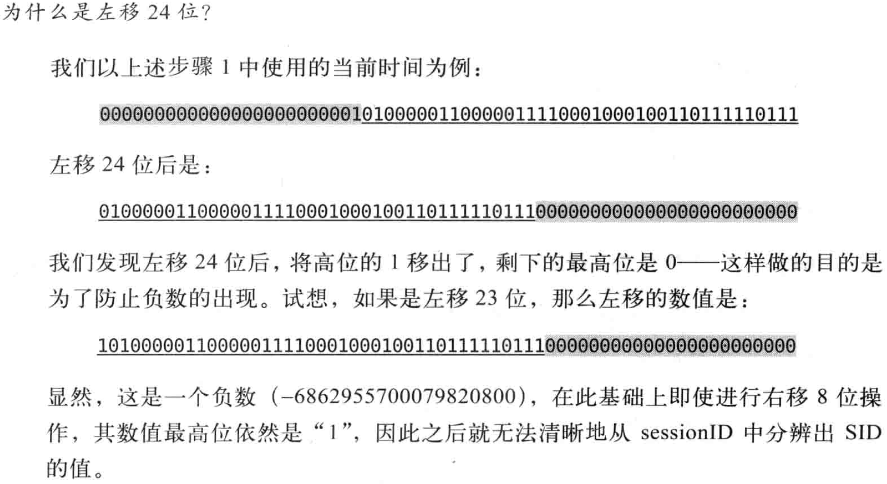

### 7.4、Zookeeper中会话相关逻辑
- 1、会话状态
- 2、会话创建
- 3、会话管理
- 4、会话清理
- 5、重连

会话（Session）是ZooKeeper中最重要的概念之一，客户端与服务端之间的任何交互操作都与会话息息相关，这其中包括临时节点的生命周期，客户端请求顺序执行以及Watcher通知机制。

简单将ZooKeeper的连接与会话就是客户端通过实例化ZooKeeper对象来实现客户端与服务器创建并保持TCP连接的过程
#### 1、会话状态
在Zookeeper客户端与服务端成功完成连接创建后，就建立了一个会话。ZooKeeper会话在整个运行期间的生命周期中，会在不同的会话状态之间进行切换。比如CONNECTING、CONNECTED、CLOSE。

#### 2、会话创建
##### Session
Session是ZooKeeper中的会话实体，代表了一个客户端会话，其包含以下4个基本属性。

- sessionID: 会话ID
    + 用来唯一标识一个会话，每次客户端创建一个会话时，ZooKeeper都会为其分配一个全局唯一的sessionID。
- TimeOut: 会话超时时间。
- TickTime: 下次会话超时时间点。
    + 为了便于Zookeeper对会话实现"分桶策略"管理，同时也是为了高效低耗地实现会话超时检查与清理，ZooKeeper会为每一个会话标记一个下次会话超时时间点
- isClosing: 用于标记一个会话是否已关闭。
    + 当服务器检测到一个会话超时失效的时候，会将该会话的isClosing属性标记为"已关闭"，这样就能确保不再处理来自该会话的新请求了。

##### sessionID
sessionID用来唯一标识一个会话，因此Zookeeper必须保证SessionID的全局唯一性，现在我们就来看看sessionID究竟时如何生成的？

在sessionTracker初始化的时候，会调用initializeNextSession方法来生成一个初始化sessionID,之后在ZooKeeper的正常运行过程中，会在该sessionID的基础上为每个会话进行分配，其初始化算法如下：
```java
//initializeNextSession就是ZooKeeper初始化sessionID的算法
public static long initializeNextSession(long id) {
    long nextSid = 0;
    nextSid = (Time.currentElapsedTime() << 24) >>> 8;
    nextSid =  nextSid | (id <<56);
    return nextSid;
}
```
##### 具体算法例子


可以将上述算法过程总结位：高8位确定了所在的机器，后56位使用当前时间的毫秒表示进行随机。

##### 算法中相关问题
- id 是什么？
    + myid  serverid ; long类型的
- 为什么要左移24位？然后右移8位？右移为什么时无符号移动？
- id为什么要左移56位？
    + 为了保证高8位时机器ID




##### SessionTracker
SessionTracker是ZooKeeper服务端的会话管理器，负责会话的创建、管理和清理等工作。整个会话的生命周期都离不开SessionTracker的管理。每一个会话在SessionTracker内部都保留了三份，具体如下：

- sessionsById: HashMap<Long, SessionImpl> sessionsById
    + 用于根据sessionID来管理Session实体
- sessionsWithTimeout: ConcurrentHashMap<Long, Integer> sessionsWithTimeout
    + 用于根据sessionID来管理会话的超时时间
- sessionSets: HashMap<Long, SessionSet> sessionSets
    + 用于根据根据下次会话超时时间点来归档会话，便于进行会话管理和超时检查。

```java
public class SessionTrackerImpl extends ZooKeeperCriticalThread implements SessionTracker {
    private static final Logger LOG = LoggerFactory.getLogger(SessionTrackerImpl.class);

    HashMap<Long, SessionImpl> sessionsById = new HashMap<Long, SessionImpl>();

    HashMap<Long, SessionSet> sessionSets = new HashMap<Long, SessionSet>();

    ConcurrentHashMap<Long, Integer> sessionsWithTimeout;
}
```

##### 创建连接
服务端对于客户端的"会话创建"，大体可以分为四个步骤：

- 处理ConnectRequest请求
    + 首先由NIOServerCnxn来负责接收来自客户端的"会话创建"请求，并反序列化出ConnectRequest请求，然后根据Zookeeper服务端的配置完成超时时间的协商
- 会话创建
    + SessionTracker将会为该会话分配一个sessionID，并将其注册到SessionsById、SessionsWithTimeout中去，同时进行会话的激活。
- 处理链路处理
    + 该"会话请求"还会在ZooKeeper服务端的各个请求处理器之间进行顺序流转，最终完成完成会话的创建
- 会话响应

#### 3、会话管理

##### 分桶策略
Zookeeper的会话管理主要由SessionTracker负责的，其采用了一种特殊的会话管理方式，我们称之为"分桶策略"。所谓分桶策略，是指将类似的会话放在同一区块中进行管理，以便于Zookeeper对会话进行不同区块的隔离处理以及同一区块的统一处理。


ZooKeeper将所有的会话都分配在了不同的区块之中，分配的原则时每个会话的"下次超时时间点"（ExpirationTime）。ExpirationTime是指该会话最近一次可能超时的时间点，对于一个新创建的会话而言，其会话创建完毕后，ZooKeeper就会为其计算ExpirationTime，计算方式如下：
ExpirationTime = CurrentTime + SessionTimeout

在ZooKeeper中的完整实现如下：
```java
ExpirationTime_ = CurrentTime + SessionTimeout
ExpirationTime = (ExpirationTime_/ExpirationInteraval + 1) * ExpirationInteraval
```


##### 会话激活
为了保持客户端会话的有效性，在ZooKeeper的运行过程中，客户端会在会话超时时间过期范围内向服务端发送PING请求来保持会话的有效性，我俗称"心跳检测"。同时服务器需要不断地接收来自客户端的这个心跳检测，并且 **需要重新激活对应客户端会话**，我们将这个重新激活的过程称为TouchSession。会话激活的过程不仅能使服务端检测到对应的客户端的存活性，同时也能让客户但自己保持连接状态。


**会话迁移--会话激活**

1. 检验该会话是否已经被关闭
Leader会检查该会话是否已经被关闭，如果该会话已经被关闭，那么不再继续激活该会话
2. 计算该会话的超时时间ExpirationTime_New
如果该会话尚未关闭，那么就开始激活会话，首先计算出该会话下一次超时的时间点，使用的就是上面提到的计算公式。
3. 定位该会话当前的区块
从sessionSets中获取老的超时时间ExpirationTime_Old，并根据该超时时间来定位到其所在的区块。
4. 迁移会话
将该会话从老的区块中取出，放入ExpirationTime_New对应的新区块中。


##### 会话超时检查
在ZooKeeper中，会话超时检查同样也是由SessionTracker负责的。SessionTacker中有一个单独的线程专门进行会话超时检查，这里我们将其称为"超时检查线程"，其工作机制的核心思路其实非常简单，一次对桶中剩下的会话进行清理。


#### 4、会话清理


