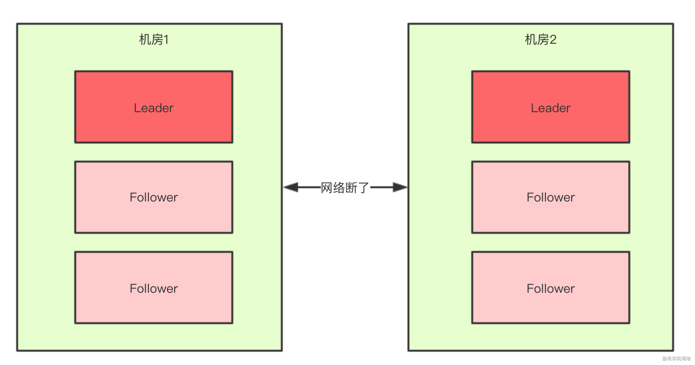
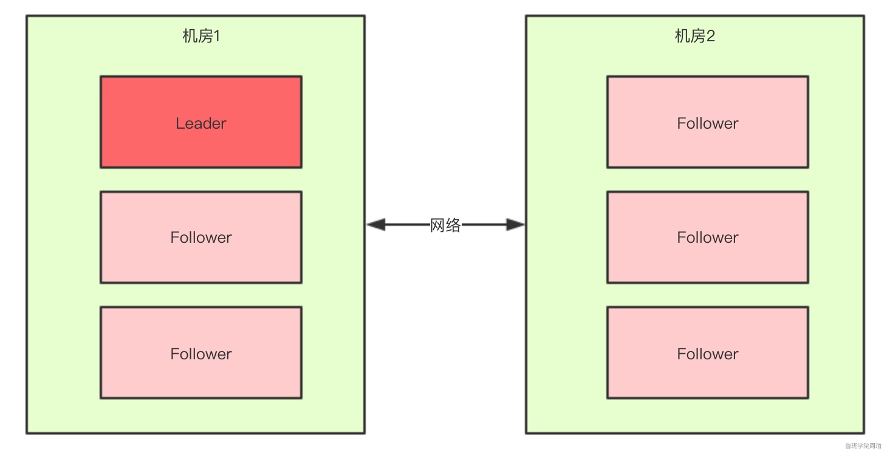
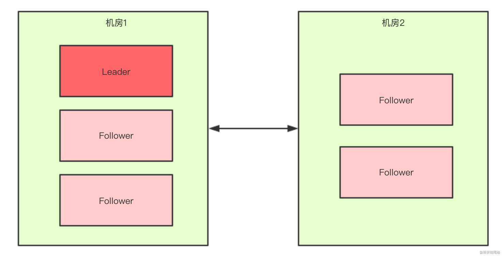

## Zookeeper如何解决脑裂问题？
- 什么是脑裂
- Zookeeper集群中的脑裂场景
- 过半机制

### 什么是脑裂
脑裂其实就是网络分区，脑裂通常出现在集群环境中，比如ElasticSearch、Zookeeper集群，而这些集群环境有一个统一的特点，就是他们有一个大脑，比如ElasticSerch集群中有Master节点，Zookeeper集群中有Leader节点。

本文主要讲下Zookeeper中的脑裂问题，以及是如何解决脑裂问题的。

### zookeerp集群中的脑裂场景
对于一个集群，想要提高集群的可用性，通常会采用多机房部署，比如现在有一个由6台zkServer所组成的一个集群部署再连个机房：


正常情况下，此集群会有一个leader,那么如果机房之间网络断了之后，两个机房内部的zkServer还是可以相互通信的，**如果不考虑过半机制**，那么机会出现每个机房内部将选出一个leader.


这就相当于原本一个集群，被分为了两个集群，出现了两个"大脑"Leader,这就是脑裂。

对于这种情况我们也可以看出，原本应该是统一的一个集群对外提供服务的，现在变成了两个集群同时对外提供服务，如果过了一会，断了的网络突然联通了，那么此时就会出现问题：

- 两个集群都对外提供服务，数据该怎么合并呢？
- 数据冲突怎么解决

### 过半机制
在领导者选举的过程中，如果某台zkServer获得了超过半数的选票，则zkServer就可以称为Leader了。

过半机制的源码实现其实非常简单：
```java
public class QuorumMaj implements QuorumVerifier{
    int half;
    // n表示集群中zkServer的个数（准确的说是参与者的个数，参与者不包括观察者节点）
    public QuorumMaj(int n){
        this.half = n/2;
    }

    //验证过半机制
    public boolean containsQuorum(Set<Long> set){
        //half是在构造方法里赋值的
        //set.size()表示某台zkServer获得的票数
        return (set.size())>half;
    }
}
```
大家仔细看下上面方法中的注释，核心代码就是下面两行：
```java
this.half = n/2;
return (set.size())>half;
```
举个最简单的例子：如果现在再集群中有5台zkServer，那么half = 5/2=2，那么也就是说，领导者选举的过程中至少要有三台zkServer投了同一个zkServer，才会符合过半机制，才能选出一个Leader。

那么有一个问题我们想一下，**选举过程中为什么一定要有一个过半机制验证？**

因为这样不需要等待所有zkServer都投了同一个zkServer就可以选举出来一个Leader了，这样比较快，所以叫快速领导者选举算法呗。

那么再来想一个问题，**过半机制中为什么是大于，而不是大于等于呢？**

这就跟脑裂问题有关系了，比如回到上文出现脑裂问题的场景：


当机房中间的网络断掉之后，机房1内的三台服务器会进行领导者选举，但是此时过半机制的条件是set.size() > 3，也就是说至少要4台zkServer才能选出来一个Leader，所以对于机房1来说它不能选出一个Leader，同样机房2也不能选出一个Leader，这种情况下整个集群当机房间的网络断掉后，整个集群将没有Leader。

而如果过半机制的条件是set.size()>=3，那么机房1和机房2都会选出一个Leader，这样就出现了脑裂，所以我们就知道了，为什么过半机制中是 **大于**，而不是 **大于等于**，就是为了防止脑裂。

如果假设我们现在只有5台机器，也部署再两个机房：


此时过半机制的条件是set.size()>2,也就是至少要3台服务器才能个选出一个Leader,此时机房网络断开了，对于机房1来说是没有影响的，Leader依然还是Leader,对于机房2来说是选不出来Leader的，此时这很个集群只有一个Leader。

所以，我们可以总结得出，有了过半机制，对于一个zookeeper集群，要么没有Leader，要么只有一个Leader，这样就避免了脑裂问题。


