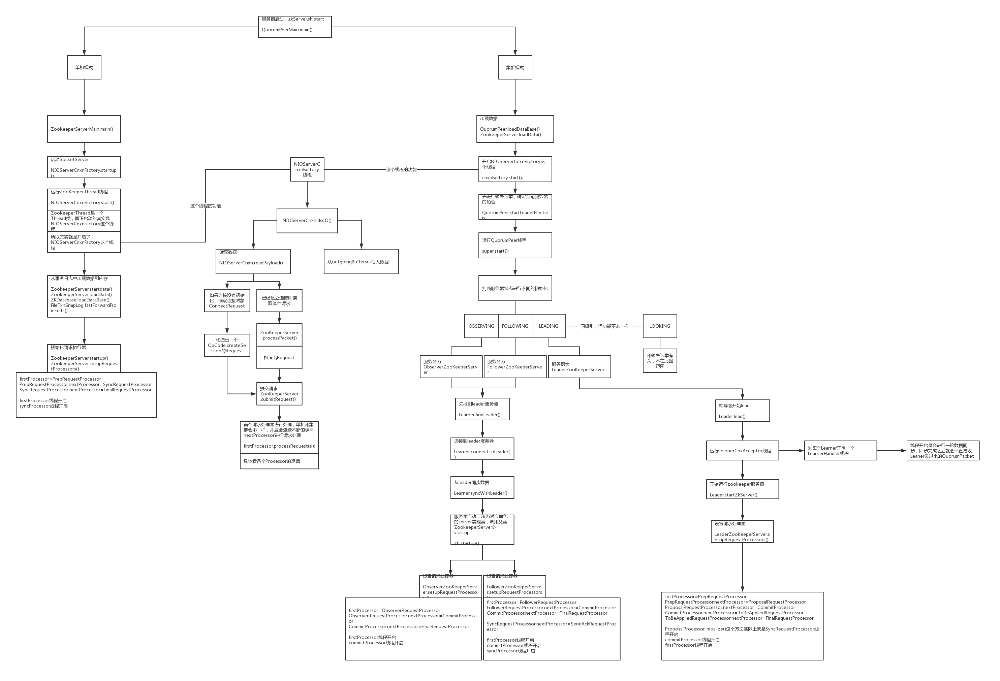

## zookeeper的客户端与服务端是如何进行进行交互的及源码

ZookeeperMain
    初始化zookeeper
    1. 初始化ClientCnxn
    2. sendThread(socket)
    3. eventThread
    4. sendThread.start() sendThread会去建立socket连接

Zookeeper.java
1. 初始化socket连接
2. 命令->Request->packet->OutgoingQueue

CLientCnxnSocketNIO.java
SendThread线程
while(){
    1.如果socket没有连接，就会去连接
    2.如果socket连接成功，客户端会发送一个ConnectRequest，接收服务端返回的ConnectResponse（Event.none）
    3.从OutgoingQueue里取数据，通过socket发送出去，同时，如果说peddingQueue里面会去放等待结果Packet
}

submitRequest与finishPacket的关系？
```java
// 同步获取结果
    //最终所有的请求都会通过submitRequest提交给server
    public ReplyHeader submitRequest(RequestHeader h, Record request,
            Record response, WatchRegistration watchRegistration)
            throws InterruptedException {
        ReplyHeader r = new ReplyHeader();

        //通过这一步，将消息发送给server
        Packet packet = queuePacket(h, r, request, response, null, null, null,
                    null, watchRegistration);
        //什么时候取出outgingQueue中的数据
        //阻塞等待返回
        synchronized (packet) {
            while (!packet.finished) {
                packet.wait();
            }
        }
        return r;
    }
```

```java
ClientCnxn.finishPacket()
//finishPacket方法会从Packet中取出对应的Watcher并注册到ZKWatchManager中去
    private void finishPacket(Packet p) {
        if (p.watchRegistration != null) {
            p.watchRegistration.register(p.replyHeader.getErr());
        }
        //cb:AsyncCallback
        if (p.cb == null) {
            // 操作同步通知
            synchronized (p) {
                p.finished = true;
                p.notifyAll();
            }
        } else {
            // 操作异步通知
            p.finished = true;
            eventThread.queuePacket(p);
        }
    }
```
outgoingQueue和pendingQueue都属于ClientCnxn。即每个客户端 连接都会有一个outgoingQueue和pendingQueue。

###图： 40：40

# 服务端收到客户端request之后是如何处理的？
QuorumPeerMain.java
-->main.initializeAndRun(args);
-->-->new QuorumPeerConfig();

ZookeeperServerMain.main()就是判断为单机模式下去执行

zookeeper的事务日志是什么？

执行create /no之后的执行情况
服务端接收请求的顺序：
1.创建事务日志
2.快照，dataBase 文件
3.更新内存，操作DataTree
4.返回错误或正确信息

DataBase
    DataTree
        DataNode



服务器启动的时候：
1. 从文件里面取数据加载到内存里面

客户端发送消息的逻辑：
client:Request->Packet->Outgoingqueue->socket
服务器处理接收消息的逻辑：
Server:socket->packet->Request->submittedRequests
即firstProcessor.run()从queue取出request,请求处理器链处理这个request
其中： LinkedBlockingQueue<Request> submittedRequests = new LinkedBlockingQueue<Request>();


### watcher机制

### ACL机制