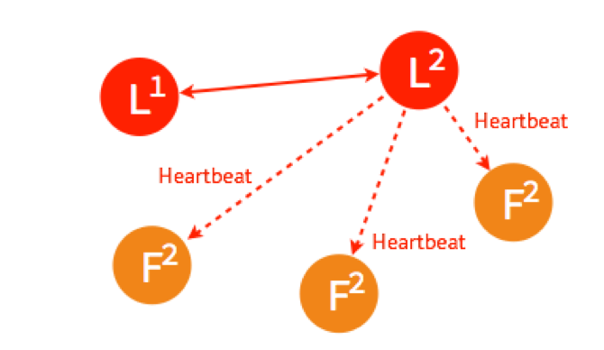

## 共识算法：Raft
- 针对简化版拜占庭将军问题，Raft解决方案类比
- Raft节点状态
- 选主Leader Election
- 复制日志Log Replication
- 总结

***
> 拜占庭将军问题是分布式领域最复杂、最严格的容错模型。但在日常工作中使用的分布式系统面对的问题不会那么复杂，更多的是计算机故障挂掉了，或者网络通信问题而没法传递信息，这种情况不考虑计算机之间互相发送恶意信息，极大简化了系统对容错的要求，最主要的是达到一致性。

由于 拜占庭将军问题较为复杂，所以此处将拜占庭将军问题根据常见的工作上的问题进行简化：**假设将军中没有叛军，信使的信息可靠，但是有可能被暗杀的情况下，将军们如何达成一致性决定？**

对于这个简化后的问题，有许多解决方案，第一个被证明的共识算法是 Paxos，由拜占庭将军问题的作者 Leslie Lamport 在1990年提出，最初以论文难懂而出名，后来这哥们在2001重新发了一篇简单版的论文 Paxos Made Simple，然而还是挺难懂的。

因为 Paxos 难懂，难实现，所以斯坦福大学的教授在2014年发表了新的分布式协议 Raft。与 Paxos 相比，Raft 有着基本相同运行效率，但是更容易理解，也更容易被用在系统开发上。

### 针对简化版拜占庭将军问题，Raft解决方案类比
我们还是用拜占庭将军的例子来帮助理解Raft。
> 假设将军中没有叛军，信使的信息可靠但有可能被暗杀的情况下，将军如何达成一致性决定？

Raft的解决方案大概可以理解成：现在所有将军中选出一个大将军，所有决定由大将军来做。

##### 选举环节
比如说现在一共有3个将军A,B,C，每个将军都有一个 **随机时间**的倒计时器，倒计时已结束，这个大将军就会把自己当成大将军候选人，然后排信使去问其它几个大将军，能不能选我为总将军？

假设现在将军A倒计时结束了，它派信使传递选举投票的信息给将军B和C，如果将军B和C还没把他们自己当成候选人（倒计时还没有结束），并且没有把选举票投给其它人，他们把票投给将军A，信使在回到将军A时，将军A知道自己收到了足够的票数，成为了大将军。

在这之后，是否要进攻由大将军决定，然后派信使去通知另外两个将军，如果在一段时间后还没有收到回复（可能信使被暗杀），那就再重派一个信使，知道收到回复。

故事先讲到这里，希望不做技术方面的朋友可以大概能理解 Raft 的原理，下面从比较技术的角度讲讲 Raft 的原理。

#### 1. Raft节点状态
从拜占庭将军的故事映射到分布式系统上，每个将军相当于一个分布式网络节点，每个节点： **有三种状态：Follower、Leader、Candidate**，状态之间是互相装换的，看一参考下图，具体的后面说：

每个节点上都有一个倒计时器(Election TimeOut),时间随机在150ms到300ms之间。有几种情况会重设Timeout:

1. 收到选举的请求
2. 收到Leader的Heartbeat(后面会讲到)

在Raft运行过程中，最主要进行两个活动：

1. 选主Leader Election
2. 复制日志Log Replication

#### 2. 选主 Leader Election
##### 2.1 正常情况下选主

假设现在有如图5个节点，5个节点一开始的状态都是Follower。

在一个节点倒计时结束（Timeout）后，这个节点的状态变成了Candidate开始选举，它给其它几个节点发送选举请求（RequestVote）

其它四个节点都返回成功，这个节点的状态由candidate变成Leader，并在每隔一小段时间后，就给所有的Follower发送一个Heartbeat以保持所有节点的状态，Follower收到Leader的HeartBeat后重设Timeout。

这是最简单的选主情况，**只要超过一半的节点投支持票了，candidate才会被选举为Leader**，5个节点的情况下，3个节点（包括Candidate本身）投了支持就行。

##### 2.2 Leader出故障情况下的选主

一开始已经有一个Leader，所有节点正常运行。

Leader出故障挂掉了，其他四个Follower将进行重新选主。

4个节点选主的过程和5个节点的类似，在选出一个新的Leader后，原来的Leader恢复了又重新加入，这个时候怎么处理？在raft里，第几轮选举是有记录的，重新加入的Leader是第一轮（Term1）选出来的，而现在Leader则是Term2，所有原来的Leader会自觉降级为Follower

##### 2.3 多个Candidate的情况下的选主

假设一开始有4个节点，都还是Follower。

有两个Follower同时TimeOut，都变成了Candidate开始选举，他们分别给一个Follower发送了投票请求。

两个Follower 分别返回了Ok,这个时候两个Candidate都只有2票，要3票才能被选为Leader。

两个Candidate会分别给另外一个还没有给自己投票的Follower发送投票请求。

但是因为Follower在这一轮选举中，都已投完票了，所以拒绝了他们的请求。所以在Term2没有Leader被选出来。

这时，两个节点的状态是Candidate，两个是Follower，但是他们的倒计时器仍在运行，最先TimeOut的那个节点会进行发起新一轮Term3的投票

两个Follower在Term3还没投过票，所以返回Ok，这时Candidate一共有三票，被选为了Leader。

如果Leader Heartbeat的时间晚于另外一个Candidate timeout的时间，另外一个Candidate仍然会发送选举请求。

两个Follower已经投完票了，拒绝了这个Candidate的投票请求。

Leader进行Heartbeat,Candidate收到后状态自动转为Follower，完成选主。

以上是Raft最重要活动之一选主的介绍，以及在不同情况下如何进行选主。

#### 3. 复制日志Log Replication
##### 3.1 正常情况下复制日志
**Raft在实际应用场景中的一致性更多的是提现在不同节点之间的数据一致性**，客户端发送请求到 **任何一个节点都能收到一致性的返回**，当一个节点出现故障后，其它节点仍然能以已有的数据正常进行。在选主之后的 **复制日志**就是为了达到这个目的。

一开始，Leader和两个Follower都没有任何数据。

客户端发送请求给Leader，存储数据"sally",Leader先将数据写在本地日志，这个时候数据还是 **Uncommited**（还没最终确认，使用红色表示）

Leader给两个Follower发送AppendEntries请求，数据在Followere上没有冲突，则两个Follower将数据写入本地日志，Follower的数据也还是Uncommitted。

Follower将数据写到本地之后，返回OK。Leader收到成功返回， **只要收到的成功的返回数据量超过半数(包含Leader)**，Leader将数据"sally" 的状态改成Committed。这个时候Leader就可以返回给客户端了。

Leader再次给Follower发送个AppendEntries请求，收到请求后，Follower将本地日志里Uncommited的数据改成Committed。这样就完成了一整个复制日志的过程，三个节点的数据是一致的。
##### 3.2 Network partition情况下进行复制日志

在Network Partition的情况下，部分节点之间没办法互相通信，Raft也能保证在这种情况下数据的一致性。

一开始有5个节点处于同一网络状态下。

NetWork Partition将节点分为两边，一边有两个节点，一边三个节点。

两个节点这边已经有Leader了，来自客户端的数据"bob"通过Leader同步到Follower

因为只有两个节点，少于3个节点，所以"bob" 的状态仍是UnCommitted。所以在这里，**服务器会返回错误给客户端**

另外一个Partition有三个节点，进行重新选主，客户端数据"tom"发到新的Leader，通过和上节网络状态下相似的过程，同步到另外两个Follower。

因为这个Partition有3个节点，超过半数，所以数据"tom"都commit了

网络恢复，5个节点再次处于同一个网络状态下。但是这里出现了数据冲突" bob"和"Tom"

三个节点的Leader广播AppendEntries

两个节点Partition的Leader自动降级为Follower，因为这个Partition的数据"bob"没有Commit，返回给客户端的是错误，客户端知道请求没有成功，所以Follower在收到AppendEntries请求时，可以把"bob"删除，然后同步"tom"，通过这么一个过程，就完成了在Network partition的情况下的复制日志，保证了数据的一致性。

小总结
Raft 是能够实现分布式系统强一致性的算法，每个系统节点有三种状态 Follower，Candidate，Leader。实现 Raft 算法两个最重要的事是：选主和复制日志

参考链接：
Raft 官网：https://raft.github.io/

Raft 原理动画 (推荐看看)：http://thesecretlivesofdata.com/raft/

Raft 算法解析图片来源：http://www.infoq.com/cn/articles/coreos-analyse-etcd

