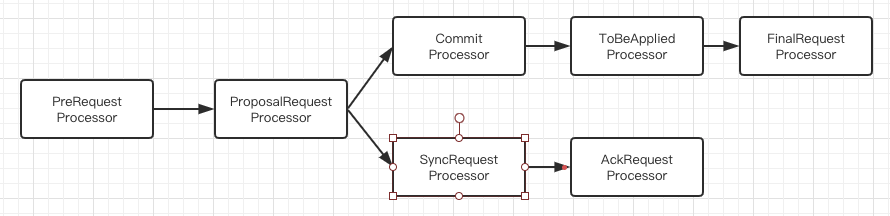
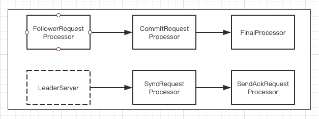

### 各服务器角色介绍
- Leader
- Follower
- Observer
- 集群间消息通信

#### Leader
Leader服务器是整个Zookeeper集群工作机制中的核心，其主要工作有以下两个：

- 事务请求的唯一调度和处理者，保证集群事务处理的顺序性
- 集群内部各服务器的调度着

##### 请求处理链
使用责任链模式来处理每一个客户端请求是ZooKeeper的一大特色。在服务器启动的时候，都会进行处理链的初始化。

从上图中可以看到，从PreRequestProcessor到FinalRequestProceesor，前后一共7各请求处理器组成了Leader服务器的请求处理链。

- PreRequestProcessor: Leader服务器的请求预处理器，也是Leader服务器的第一个请求处理器。
    + 在ZooKeeper中我们将那些会改变服务器状态的请求称为"事务请求"--通常指的就是那些创建节点、更新数据、删除节点以及创建会话等请求
    + PreRequesrProcessor能够是被出当前客户端请求是否是事务请求
    + 对于事务请求，PreRequestProcessor处理器会对其进行一系列预处理，诸如创建请求事务头、事务体，会话检查，ACL检查和版本检查等。
- ProposalRequestProcessor: Leader服务器的事务投票处理器，也是Leader服务器事务处理流程的发起者。
    + 对于非事务请求，ProposalRequestProcessor会直接将请求流转到CommitProcessor处理器，不再做其他处理；
    + 对于事务请求，除了将请求交给CommitProcessor处理器外，还会根据请求类型创建对应的Proposal提议，并发送给所有的Follower服务器来发起一次集群内的事务投票。
    + 同时ProposalRequestProcessor还会将事务请求交付给SyncRequestProcessor进行事务日志的记录
- SyncRequestProcessor: 是事务日志记录处理器。
    + 主要用来将事务请求记录到事务日志文件中去，同时还会触发ZooKeeper进行数据快照
- AckRequestProceessor: 是Leader特有的处理器。
    + AckRequestProcessor主要是负责在SyncRequestProcessor处理器完成事务日志记录后，向Proposal的投票收集器发送ACK反馈，以通知投票收集器当前服务器已经完成了对该Proposal的事务日志记录。（在Zookeeper中怎么确认同意提议呢？完成了提议的持久化就算同意。对于leader来说也需要同意proposal,即也需要sync和ack）
    + Leader对于接收proposal的处理SyncRequestProcessor + AckRequestProceessor
    + Follower对于接收proposal的处理SynRequestProcessor + SendAckRequestProcessor
- CommitProcessor: 是事务提交处理器。
    + 对于非事务请求，该处理器会直接将其交付给下一级处理器进行处理；
    + 而对于事务请求，CommitProcessor处理器会等待集群内针对proposal的投票知道该proposal可被提交。
    + 利用CommiteProcessor处理器，每个服务器都可以很好地控制对事务请求的顺序处理。
- ToBeCommitProcessor:
    + ToBeCommitProcessor处理器中有一个toBeApplied队列，专门用来存储那些已经被CommitProcessor处理过的可被提交的Proposal
    + ToBeCommitProcessor处理器讲这些请求逐个交付给FinalRequestProcessor处理器进行处理--等到FinalRequestProcessor处理器处理完之后，再将其从toBeApplied队列中移出
- FinalRequestProcessor: 最后一个处理器。
    + 主要用来进行客户端返回之前的收尾工作
    + 包括创建客户端请求的响应
    + 针对事务请求，该处理器还会负责将事务应用到内存数据库中去

###### LearnHandler
为了保证整个集群内部的实时通信，同时也是为了确保可以控制所有的Follower/Observer服务器，Leader服务器会与每一个Follower/Observer服务器建立一个TCP长连接，同时也会为每个Follower/ObServer服务器都创建一个名为LearnerHandler的实体。

LearnerHandler，顾名思义，是ZooKeeper集群中Learner服务器的管理器。主要负责Follower/Observer服务器和Leader服务器之间的一系列网络通信，包括数据同步、请求转发、和Proposal提议的投票等。Leader服务器中保存了所有Follower/Observer对应的LearnerHandler。

#### Follower
Follower角色的主要工作有以下三个：

- 处理客户端非事务请求，转发事务请求给Leader服务器
- 参与事务请求Proposal的投票
- 参与Leader选举投票

和Leader服务器一样，Follower也同样使用了采用责任链模式组装的请求处理链来处理每一个客户端的请求。由于不需要负责对事物请求的投票处理，因此相对来说Follower服务器的请求处理链会简单一些。

从上图中可以看出，Follower的处理链和Leader的处理链的最大区别在于，Follower服务处理器的第一个处理器换成了FollowerRequestProcessor处理器，同时由于不需要处理事务请求的投票，因此也没有了ProposalRequestProcessor处理器。

- FollowerRequestProcessor
    + 是Follower服务器的第一个请求处理器，其主要的工作就是识别出当前请求是否是事务请求，如果是事务请求，那么Follower就会将该事务请求转发给Leader服务器。
    + Leader服务器在接受到这个事务请求后，就会将其提交到请求处理链，按照正常事务请求进行处理。
- SendAckRequestProcessor
    + 类似Leader的AckRequestProcessor，Follower的SendAckRequestProcessor处理器同样要承担事务日志记录反馈的角色，在完成事务日志记录后，会向Leader服务器发送ACK消息仪表明完成了事务日志的记录工作
    + 两者唯一的区别在于:
        * AckRequestProcessor处理器和Leader服务器在同一个服务器上，因此它的ACK反馈仅仅是一个本地操作；
        * 而SendAckRequestProcessor处理器由于在Follower服务器上，因此需要通过以ACK消息的形式向Leader服务器进行反馈

#### Observer
Observer服务器在工作原理上和Follower基本是一致的，对于非事务请求，都可以进行独立的处理，而对于事务请求，这会转发给Leader服务器进行处理。

和Follower的唯一区别在于，Observer不参与任何形式的投票，包括事务请求Proposal的投票和Leader选举投票。

