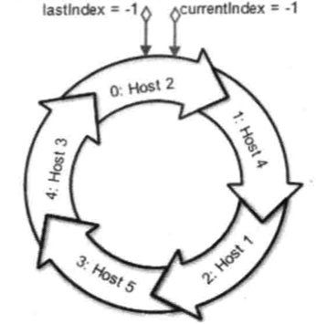

### 7.3、客户端相关逻辑
- 1、ZooKeeper的客户端主要由以下几个核心组件组成
- 2、一次会话的创建过程
- 3、服务器地址列表
- 4、ClientCnxn：网络I/O

##### 1、ZooKeeper的客户端主要由以下几个核心组件组成
- **ZooKeeper实例：** 客户端入口
- **ClientWatchManager：** 客户端Watcher管理器
- **HostProvider：** 客户端地址列表管理器
- **ClientCnxn：** 客户端核心线程，其内部包含有两个线程，即SendThread和EventThread。前者是一个I/O线程，主要负责ZooKeeper客户端和服务端之间的网络I/O通信；后者是一个事件线程，主要负责对服务端事件进行处理。


ZooKeeper客户端的初始化与启动环节，实际上就是ZooKeeper对象的实例化过程，客户端的整个初始化和启动过程大体可以分为：

1. 设置默认Watcher
2. 设置Zookeeper服务器地址列表
3. 创建ClientCnxn


#### 2、一次会话的创建过程
客户端一次会话创建基本可以分为三个阶段，第一个阶段：初始化阶段；第二个阶段：会话创建阶段；第三个阶段：响应阶段

##### 2.1、初始化阶段
1. 初始化ZooKeeper对象
通过调用ZooKeeper的构造方法来实例化一个ZooKeeper对象，在初始化的过程中，会创建一个客户端的Watcher管理端：ClientWatchManager。

2. 设置会话默认Watcher
如果在构造方法中传入一个watcher对象，那么客户端会将这个对象作为默认的Watcher保存在ClientWatchManager中

3. 构造ZooKeeper服务器地址列表管理器：HostProvider.
对于构造方法中传入的服务器地址，客户端会将其存放在服务器地址列表管理器HostProvider中

4. 创建并初始化客户端网络连接器：ClienCnxn
ZooKeeper客户端首先会创建一个网络连接器ClientCnxn，用来管理客户端与服务器的网络交互。另外，客户端在创建ClientCnxn的同时，还会初始化客户端两个核心队列outgoingQueue和pendingQueue，分别作为客户端的请求发送队列和服务端响应的等待队列。

客户端还会同时创建ClientCnxnSocket处理器，因为ClientCnxn连接器底层I/O处理器是ClientCnxnSocket处理器。

5. 初始化SendThread和EventThread
客户端会创建两个核心网络线程SendThread和EventThread，前者用于管理客户端和服务端之间的所有网络I/O，后者这用于进行客户端的事件处理。

同时，客户端还会将ClientCnxnSocket分配给SendThread作为底层网络I/O处理器，并初始化EventThread的待处理事件队列waitingEvents，用于存放所有等待被客户端处理的事件。

##### 2.2、会话创建阶段
6. 启动SendThread和EventThread
SendThread首先会判断当前客户端的状态，进行一系列清理工作，为客户端发送"会话创建"请求做准备

7. 获取一个服务器地址
在开始创建TCP连接之前，SendThread首先需要获取一个ZooKeeper服务器的目标地址，这通常是从HostProvider中随机取出一个地址，然后委托给ClientCnxnSocket去创建与ZooKeeper服务器之间的TCP连接

8. 创建TCP连接
获取到一个服务器地址后，ClientCnxnSocket负责和服务器创建一个TCP长连接

9. 构造ConnectRequest请求
SendThread会负责根据当前客户端的实际设置，构造出一个ConnectRequest请求，该请求代表了客户端试图与服务器创建一个会话。同时，ZooKeeper客户端还会进一步将请求包装成网络IO层的Packet对象，放入请求发送队列outgoingQueue中去。

10. 发送请求
当客户端请求准备完毕后，就可以开始向服务端发送请求了。ClientCnxnSocket负责从outgoingQueue中取出一个代发送的Packet对象，将其序列化成ByteBuffer后，向服务端进行发送。

##### 2.3、响应阶段
11. 接收服务端响应
ClientCnxnSocket接收到服务端的响应后，会首先判断当前客户端状态是否是 "已初始化"，如果尚未完成初始化，那么就认为该响应一定是会话创建请求的响应，直接交由readConnectResult方法阿里处理该响应

12. 处理Response
ClientCnxnSocket会对接受到的服务端响应进行反序列化，得到ConnectResponse对象，并从中获取到ZooKeeper服务端分配的会话SessionId。

13. 连接成功
连接成功后，一方面需要通知SendThread线程，进一步对客户端进行会话参数的设置，包括readTimeout和connectTimeout,并更新客户端状态；

另一方面，需要通知地址管理器HostProvider当前成功连接的服务器地址。

14. 生成事件SyncConnected-None
为了能够让上层应用感知到会话的成功创建，SendThread会生成一个事件SyncConnected-none，代表客户端与服务器会话创建成功，并将该事件传递给EventThread线程

15. 查询Watcher
EventThread线程收到事件后，会从ClientWatchManager管理器中查询出对应的watcher，针对SyncConnected-none事件，那么就直接找出步骤2中存储的默认Watcher,然后将其放到EventThread的waitingEvents队列中去。

16. 处理事件
EventThread不断从waitingEvents队列中取出待处理的Watcher对象，然后直接调用该对象的process接口方法（这个方法是用户定义），以达到触发Watcher的目的。

#### 3、服务器地址列表
在构造ZooKeeper构造方法时，用户传入的ZooKeeper服务器地址列表，即connectString参数，通常是使用一个英文状态逗号分隔的多个IP地址和端口的字符串：192.168.1.2：2181,192.168.1.2：2182,192.168.1.2：2183

##### 3.1、那么问题就是：**ZooKeeper客户端在连接服务器的过程中，是如何从这个服务器列表中选择服务器机器的呢？按序访问，还是随机访问呢？**
在ZooKeeper客户端内部在接收到这个服务器地址列表后，会将其放入一个ConnectStringParser对象中封装起来，ConnectStringParser是一个服务器地址列表的解析器，该类的基本结构如下：

```java
public final class ConnectStringParser {
    private static final int DEFAULT_PORT = 2181;
    private final String chrootPath;
    private final ArrayList<InetSocketAddress> serverAddresses = new ArrayList<InetSocketAddress>();
}
```
ConnectStringParser解析器的构造方法将会对传入的connectString做两个主要的处理：解析chrootPath; 保存服务器地址列表。
```java
public ConnectStringParser(String connectString) {
    int off = connectString.indexOf('/');
        if (off >= 0) {
            String chrootPath = connectString.substring(off);
        }
        connectString = connectString.substring(0, off);
        String hostsList[] = connectString.split(",");
        for (String host : hostsList) {
            int port = DEFAULT_PORT;
            int pidx = host.lastIndexOf(':');
            if (pidx >= 0) {
                host = host.substring(0, pidx);
            }
            //ArrayList<InetSocketAddress> serverAddresses
            //关键就是这一句话，就是把地址串使用","分割之后存入list
            serverAddresses.add(InetSocketAddress.createUnresolved(host, port));
}
```

##### 3.2、chroot：客户端隔离命名空间
Zookeeper允许每个客户端为自己设置一个命名空间（Namespace）。如果一个ZooKeeper客户端设置了Chroot，那么该客户端对服务器的任何操作，都将会被限制在其自己的命名空间下。

如果我们希望应用X分配/apps/X下的所有子节点，那么应用可以将其所有ZooKeeper客户端的Chroot设置为/apps/X。一旦设置了Chroot之后，那么对于这个客户端来说，所有节点路径都以/apps/X为跟节点。

通过设置Chroot，我们能够将一个客户但应用与ZooKeeper服务端的一颗子树相对应，在多个应用共用一个ZooKeeper集群的场景下，这对于实现不同应用之间的相互隔离非常有帮助。

客户端可以通过在connectString中添加后缀的方式来设置Chroot，如下所示：
```java
192.168.1.2：2181,192.168.1.2：2182,192.168.1.2：2183/apps/
```

将这样的一个connectString传入客户端的ConnectStringParser后就能够解析出Chroot并保存在ChrrotPath属性中。

##### 3.3、HostProvider：地址列表管理器
在ConnectStringParser解析器中会对服务器地址做一个简单的处理，并将服务器地址和相应的端口封装成一个InetSocketAddress对象，以ArrayList形式保存在ConnectStringPaser.serverAddress属性中。然后，经过处理的地址列表会进一步封装到StaticHostProvider类中。

StaticHostProvider这个类实现了HostProvider接口,HostProvider类定义了一个客户端的服务器地址管理器：
```java
public interface HostProvider {
    public int size();//该方法用于返回当前服务器地址列表的个数
    public InetSocketAddress next(long spinDelay);//该方法用于返回一个服务器地址InetSocketAddress，以便客户端进行服务器连接
    public void onConnected();//这是一个回调方法，如果客户端与服务器成功创建连接，就通过调用这个方法来通知HostProvider
}
```

StaticHostProvider的数据结构


##### 3.4、解析服务器地址
针对ConnectStringParser.serverAddress集合中那些没有被解析的服务器地址，StaticHostProvider首先会对这些地址逐个进行解析，然后在放入serverAddress集合中去。**同时使用Collection工具类的shuffle方法来将这个服务器地址列表进行随机的打散**

##### 3.5、获取可用的服务器地址
通过调用staticHostProvider的next()方法，能够从staticHostProvider中获取一个可用的服务器地址，这个next()方法并非简单地从serverAddresses中依次获取一个服务器地址，而是先将随机打散后的服务器地址列表拼装称一个环形循环队列，注意这个随机过程是一次性的，也就是说，之后的使用过程中一直是按照这样的顺序来获取服务器地址的。
```java
public InetSocketAddress next(long spinDelay) {
        currentIndex = ++currentIndex % serverAddresses.size();
        if (currentIndex == lastIndex && spinDelay > 0) {
            try {
                Thread.sleep(spinDelay);
            } catch (InterruptedException e) {
                LOG.warn("Unexpected exception", e);
            }
        } else if (lastIndex == -1) {
            // We don't want to sleep on the first ever connect attempt.
            lastIndex = 0;
        }

        InetSocketAddress curAddr = serverAddresses.get(currentIndex);
        try {
            String curHostString = getHostString(curAddr);
            List<InetAddress> resolvedAddresses = new ArrayList<InetAddress>(Arrays.asList(this.resolver.getAllByName(curHostString)));
            if (resolvedAddresses.isEmpty()) {
                return curAddr;
            }
            Collections.shuffle(resolvedAddresses);
            return new InetSocketAddress(resolvedAddresses.get(0), curAddr.getPort());
        } catch (UnknownHostException e) {
            return curAddr;
        }
    }
```




##### 3.6、对HostProvider的几个设想


#### 4、ClientCnxn: 网络I/O
ClientCnxn是ZooKeeper客户端的核心工作类，负责维护客户端与服务端之间的网络连接并进行一系列的网络通信。

##### 4.1、Packet
Packet是ClientCnxn内部定义的一个对协议层的封装，作为ZooKeeper中请求与响应的载体，其数据结构如下：


Packet中包含了最基本的请求头（RequestHeader）、响应头（replyHeader）、请求体（request）、响应体(response)、节点路径（clientPath/serverPath）和注册的Watcher（WatchRegistration）等信息。

那么Packet这么多的属性都会在客户端与服务端之间进行网络传输吗？

答案是否定的，Packet的createBB()方法负责对Packet对象进行序列化，最终生成可用于底层网络传输的ByteBuffer对象。在整个过程中，只会将requestHeader、request、readonly三个属性进行序列化，其余属性都保存在客户端的上下文中，不会进行与服务端之间的网络传输。

##### 4.2、outgoingQueue 和pendingQueue
ClientCnxn中，有两个比较核心的队列outgoingQueue和pendingQueue，分别代表客户端的请求发送队列和服务端的响应等待队列。

outgoin队列是一个请求发送队列，用于存储那些需要发送到服务端的Packet集合。

pending队列是为了存储那些已经从客户端发送到服务端，但是需要等待服务端响应的Packet集合。

##### 4.3、ClientCnxnSocket: 底层Socket通信层
ClientCnxnSocket定义了底层Socket通信的接口。找ZooKeeper中默认的实现是ClientCnxnSocketNIO。该类实现类使用Java原生的NIO接口，其核心逻辑是doIO逻辑，主要负责对请求的发送和响应接收过程。

##### 4.4、请求发送
- 在正常情况下（即客户端与服务端之间的TCP连接正常且有效的情况下），会从outgoingQueue队列中提取出一个可发送的Packet对象
- 同时生成一个客户端请求序号XID并将其设置到Packet请求头中
- 最后将packet进行序列化后进行发送
- 发送完毕后，会立即将该Packet保存到pendingQueue队列中，以便等待服务端响应返回后进行响应的处理。
```java
ClientCnxnSocketNIO{}.doIO(){
    if (sockKey.isWritable()) {//写就绪
        sock.write(p.bb);//发送给服务端

        if (!p.bb.hasRemaining()) {  // 没有剩下的了
            sentCount++;
            outgoingQueue.removeFirstOccurrence(p); // 从待发送队列中取出该packet
            if (p.requestHeader != null
                    && p.requestHeader.getType() != OpCode.ping
                    && p.requestHeader.getType() != OpCode.auth) {
                synchronized (pendingQueue) {
                    //PendingQueue 等待服务器返回结果的Packet
                    pendingQueue.add(p); // 加入待回复的队列
                }
            }
        }
    }
}
```


##### 4.5、响应接收
客户端获取来自服务端的完整响应数据后，根据不同的客户端请求类型，会进行不同的处理：

- 如果进程到当前客户端尚未进行初始化：那么说明当前客户端与服务端之间正在进行会话创建，那么直接将接收到的ByteBuffer（incomingBuffer）序列化称ConnectResponse对象
- 如果当前客户端已经处于正常的会话周期，并且接受到的服务端响应是一个事件，那么ZooKeeper客户端接受到的ByteBuffer（incomingBuffer）序列化成WatcherEvent对象，并将该事件放入待处理队列中
- 如果当前客户端已经处于正常的会话周期，并且接收到的是一个常规的请求响应（create GetData）那么会从pendingQueue队列中取出一个packet来进行相应的处理
    + ZooKeeper客户端首先会通过检查服务端响应中的XID值来确定请求处理的顺序性
    + 再讲接收到的ByteBuffer序列化称响应的Response对象
最后会在finishPacket方法中处理watcher注册等逻辑。

##### 4.6、SendThread
SendThread是客户端ClientCnxn内部一个核心的I/O调度线程，用于管理客户端和服务端之间的所有网络IO操作，在Zookeeper客户端的实际运行过程中：

- SendThread维护了客户端与服务端之间的会话生命周期
    + 其通过在一定的周期频率内向服务端发送一个PING包来实现心跳检测
- 在会话周期内，如果客户端与服务端出现TCP连接断开的情况，那么就会自动重连
- 另一方面，SendThread管理客户端所有的请求发送和响应接收操作
    + 将上层客户端API操作转换成响应的请求协议并发送到服务端，并完成对同步调用的返回和异步调用的回调。
- 同时SendThread还负责将来自服务端的事件传递给EventThread去处理
```java
ClientCnxn{}.SendThread{}.readResponse(){
    if (replyHdr.getXid() == -1) { // watch事件通知
        // -1 means notification
        WatcherEvent event = new WatcherEvent();
        event.deserialize(bbia, "response");

        // convert from a server path to a client path
        if (chrootPath != null) {
            String serverPath = event.getPath();
            if(serverPath.compareTo(chrootPath)==0)
                event.setPath("/");
            else if (serverPath.length() > chrootPath.length())
                event.setPath(serverPath.substring(chrootPath.length()));
        }

        WatchedEvent we = new WatchedEvent(event);

        // 把通知事件加到waitingEvents
        eventThread.queueEvent( we );//在queueEvent()方法中将事件加入到waitingEvents
        return;
    }
}
```

##### 4.7、EventThread
EventThread是客户端ClientCnxn内部的另外一个核心线程，负责客户端的事件处理，并触发客户端注册watcher监听。EventThread中有一个waitingEvents队列，用于临时存放那些需要被触发的Object，包括那些客户端注册的Watcher和异步接口中注册的回调器AsyncCallback。

EventThread会不断地从waitEvents这个队列中取出Object，识别出具体类型（Watcher或者AsyncCallBack）,并分别调用process和processResult接口方法来实现对事件的触发和回调。


##### ZooKeeperClient的 outgoingQueue和pendingQueue是如何保证顺序性的
Zookeeper的顺序一致性：从同一个客户端发起的事务请求，按照发送顺序被应用到ZooKeeper中去；为什么？

因为客户端ClientCnxn中有两个队列分别为outgoingQueue和pendingQueue，它两分别用来存储客户端请求和服务端响应。

sendThread会从outgoingQueue队列中依次发送请求，并将packet保存到pengdingQueue，以便等待服务端响应后进行响应的处理

当请求响应返回，客户端会从pendingQueue队列中取出一个Packet进行处理，并验证服务端响应包含XID和取出的Packet是否一致，来保证请求处理的顺序性。

整个流程都是顺序一致性的。


