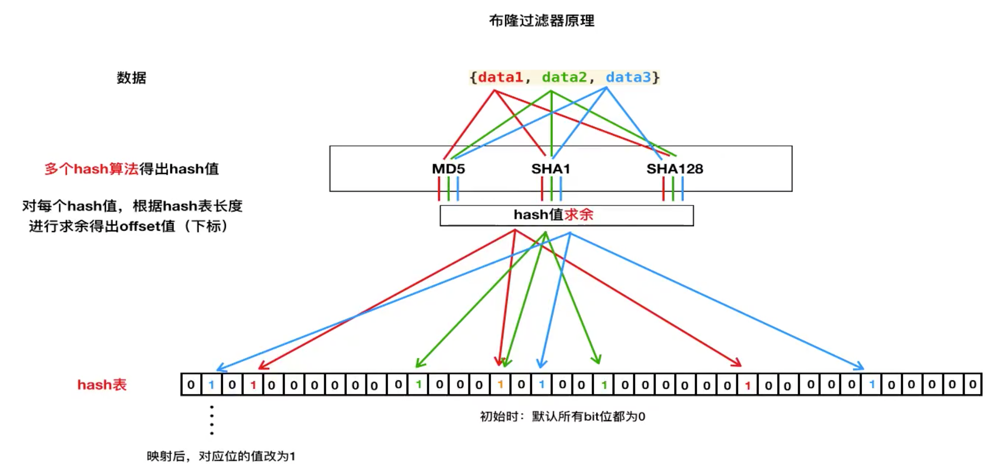
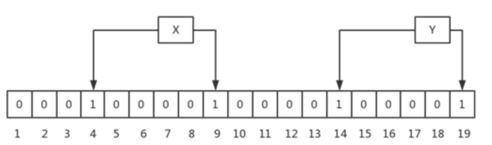
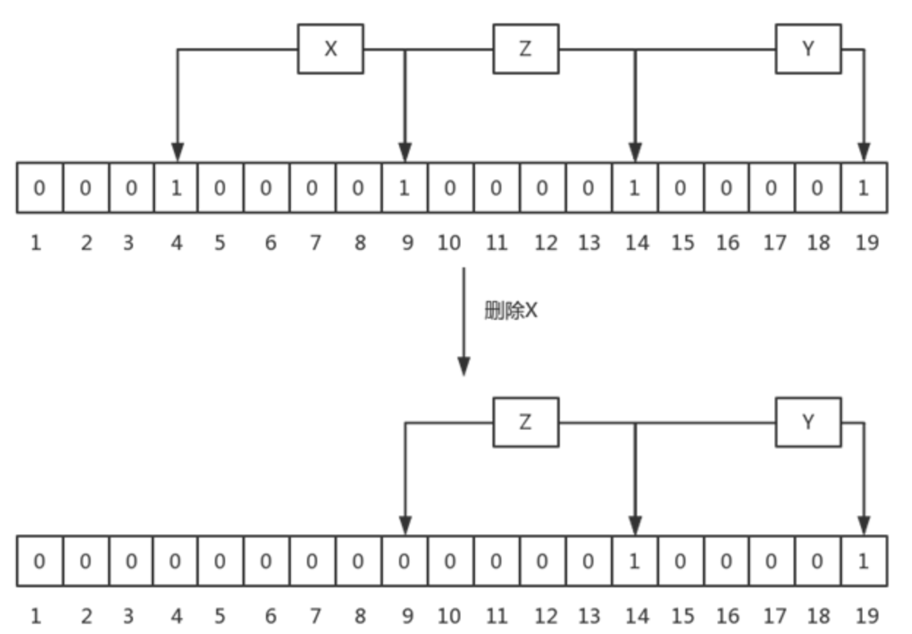
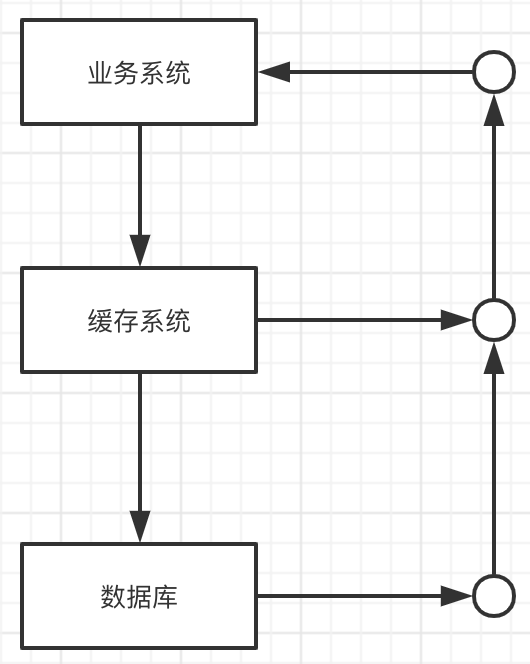
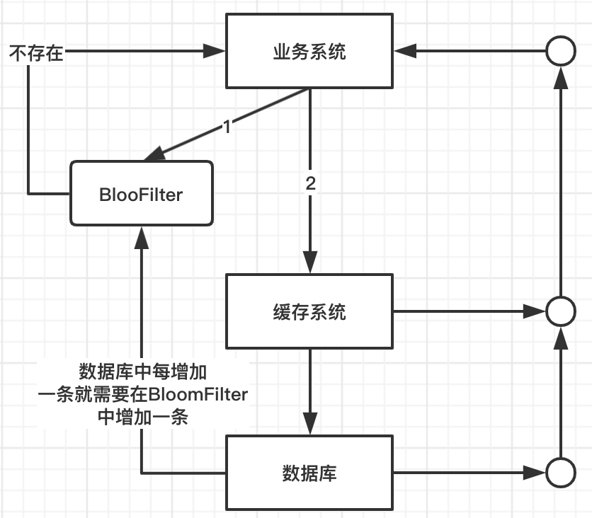

### BloomFilter布隆过滤器
- 1、原理
    + 1.1、介绍
    + 1.2、BloomFilter的性质
    + 1.3、原理分析
    + 1.4、BloomFilter的流程
- 2、代码实现
- 3、应用场景
- 4、Redis实现BloomFilter
- 5、缓存穿透与缓存击穿

### 1、原理
#### 1.1、介绍
布隆过滤器（Bloom Filter）是1970年由布隆提出的，它实际上是由一个很长的二进制向量和一系列随意映射函数组成。

#### 1.2、BloomFilter的性质
- 一个很长的二进制数组（位数组，就是这个数组里只有0和1）
- 若干个哈希函数
- 不存在漏报(False Negative), 即某个元素再某个集合中，肯定能报出来
- 可能存在误报(False Positive)，即某个元素不在某个集合中，可能也被报出来。
- 删除困难

#### 1.3 原理分析



对上图--布隆过滤器原理图进行分析：

1. 我们设置BloomFilter的BitSet的大小位256M，则实际长度位256M*1024*1024*8=21亿的长度（其中1Byte=8bit）。
2. 对数据data1进行hash运算求得hash值，并将其转换位十进制，然后对hash值进行求余（21亿求余）
3. 将求余（所有hash都要求余）下标所在的值全部更改位1后完成映射

#### 1.4、BloomFilter的流程

以一个例子，来说明添加的过程，这里，假设数组长度m=19，k=2个哈希函数

既然选用hash算法，必然就会存在碰撞的可能。两个不完全相同的值计算出来的hash值难免会一致。多次使用hash算法，为同一个值取不同的多个hash，取的越多。碰撞率的几率就越小。当然hash的数量也不是越多越好，这个后面会讲

##### 插入数据



如上图，插入了两个元素，X和Y，X的两次hash取模后的值分别为4,9，因此，4和9位被置成1；Y的两次hash取模后的值分别为14和19，因此，14和19位被置成1。

###### 插入流程
1. 将要添加的元素给k个哈希函数
2. 得到对应于位数组上的k个位置
3. 将这k个位置设为1

###### 查找数据
BloomFilter中查找一个元素，会使用和插入过程中相同的k个hash函数，取模后，取出每个bit对应的值，如果所有bit都为1，则返回元素可能存在，否则，返回元素不存在。

###### 查找流程
1. 将要查询的元素给k个哈希函数
2. 得到对应于位数组上的k个位置
3. 如果k个位置有一个为0，则一定不在集合中
4. 如果k个位置全部为1，则可能在集合中

###### 为什么bit全部为1时，元素只是可能存在呢？
当然，如果情况只是上图中，只存在X、Y，而且两个元素hash后的值并不重复。那么这种情况就可以确定元素一定存在。

但是，存在另一种情况。参考上面那个图，假设我们现在要查询Z元素，假设Z元素并不存在。但是巧了经过hash计算出来的位置为9,14。我们很清楚，这里的9是属于X元素的，14是术语Y元素的。并不存在Z。但是经过hash计算的结果返回值都是1。所以程序认为Z是存在的，但实际上Z并不存在，此现象称为false positive

###### 为什么不能删除数据（缺点）
BloomFilter中不允许有删除操作，因为删除后，可能会造成原来存在的元素返回不存在，这个是不允许的，还是以一个例子说明：



上图中，刚开始时，有元素X，Y和Z，其hash的bit如图中所示，当删除X后，会把bit 4和9置成0，这同时会造成查询Z时，报不存在的问题，这对于BloomFilter来讲是不能容忍的，因为它要么返回绝对不存在，要么返回可能存在。

问题：BloomFilter中不允许删除的机制会导致其中的无效元素可能会越来越多，即实际已经在磁盘删除中的元素，但在bloomfilter中还认为可能存在，这会造成越来越多的false positive。

### 2、代码实现
```java
public class BloomFilter {
    private static final int DEFAULE_SIZE = 2<<24;//布隆过滤器bit数组的长度
    private static final int[] seeds = {7,11,13,31,37,61,67};// 这里要选取质数，能很好的降低错误率
    private BitSet bits = new BitSet(DEFAULE_SIZE);
    private static Hasher[] funcs = new Hasher[seeds.length];

    //初始化BloomFilter过滤器其实就是建立Hash函数
    public BloomFilter(){
       for(int i=0;i<seeds.length;i++){
           //使用种子建立Hash函数
           funcs[i] = new Hasher(DEFAULE_SIZE,seeds[i]);
       }
    }

    public void add(String value){
        for(Hasher f: funcs){
            bits.set(f.hash(value),true);
        }
    }

    public boolean find(String value){
        boolean res = true;
        for(Hasher f : funcs){
            res = res && bits.get(f.hash(value));
        }
        return res;
    }

    //提供hash函数
    public class Hasher{
        private int cap;
        private int seed;
        public Hasher(int cap,int seed) {
            this.cap = cap;
            this.seed = seed;
        }
        public int hash(String str){
            int len = str.length();
            int res  = 0;
            for(int i=0;i<len;i++){
                res = seed*res+str.charAt(i);
            }
            return res&(cap-1);
            //return (cap-1)&res;
        }
    }

    public static void main(String[] args) {
        String value = "crankzcool@gmail.com";
        BloomFilter bloomFilter = new BloomFilter();
        System.out.println(bloomFilter.find(value));
        bloomFilter.add(value);
        System.out.println(bloomFilter.find(value));
    }
}
```
#### 2.1、Google Guava代码
关于布隆过滤器，我们不需要自己实现，谷歌已经帮我们实现好了。

##### pom引入依赖
```java
<!-- https://mvnrepository.com/artifact/com.google.guava/guava -->
<dependency>
    <groupId>com.google.guava</groupId>
    <artifactId>guava</artifactId>
    <version>27.0.1-jre</version>
</dependency>
```
##### 代码
guava 的布隆过滤器，封装的非常好，使用起来非常简洁方便。
例： 预估数据量1w，错误率需要减小到万分之一。使用如下代码进行创建。
```java
public static void main(String[] args) {
    // 1.创建符合条件的布隆过滤器
    // 预期数据量10000，错误率0.0001
    BloomFilter<CharSequence> bloomFilter =
            BloomFilter.create(Funnels.stringFunnel(
                    Charset.forName("utf-8")),10000, 0.0001);
    // 2.将一部分数据添加进去
    for (int i = 0; i < 5000; i++) {
        bloomFilter.put("" + i);
    }
    System.out.println("数据写入完毕");
    // 3.测试结果
    for (int i = 0; i < 10000; i++) {
        if (bloomFilter.mightContain("" + i)) {
            System.out.println(i + "存在");
        } else {
            System.out.println(i + "不存在");
        }
    }
}
```

### 3、应用场景
#### 实战案例：腾讯短视频瀑布流优化
这是布隆过滤器在腾讯短视频实际的应用案例

https://toutiao.io/posts/mtrvsx/preview

简单的讲就是你的每一次刷新都会根据推荐算法推荐你新的内容，但是这个新的内容是不能与已经出现过的内容重复。这时候就需要去重，这时候就可以使用布隆过滤器来去重。

以上这些场景有个共同的问题：如何查看一个东西是否在有大量数据的池子里面。

#### 缓存穿透问题
##### 什么是缓存穿透
在大多数应用中，当业务系统中发送一个请求时，会先从缓存中查询；若缓存中存在，则直接返回，若返回中不存在，则查询数据库。其流程如下图所示：



缓存穿透：当请求数据中不存在的数据，这时候所有的请求都会打到数据库上，这种情况就是缓存穿透，如果请求较多的话，这会严重浪费数据库资源导致数据库假死。

##### BloomFilter解决缓存穿透问题
这种技术在缓存之前再加一层屏障，里面存储目前数据库中存在的所有key，如下图所示



当业务系统有查询请求的时候，首先去BloomFilter中查询key是否存在，若不存在，则说明数据库中不存在该数据，因此缓存都不要查了，直接返回null。若存在，则继续执行后续流程，先前往缓存中查询，缓存中没有的话再前往数据库查询。

### 4、Redis实现BloomFilter
Redis中有SETBIT key offset value 和 GETBIT key offset操作，其实在Redis中BIT是一种特殊的String，而在Redis中String最大为512M，所以Bit数组长度最长是42亿左右（即Hash表的长度），那么hash表的具体长度怎么确定呢？其实可以在代码中固定成一个固定值比如 len = 2<<32，每次求得的hash值都用len进行求余。


### 5、缓存穿透与缓存击穿
缓存穿透：查询一个redis中不存在的数据，会直接查询数据库
缓存击穿：缓存失效，并发请求直接查询数据库（并发请求直接达到数据库）（是缓存部分数据失效）
缓存雪崩：缓存所有数据都失效（整个redis集群全挂了）

