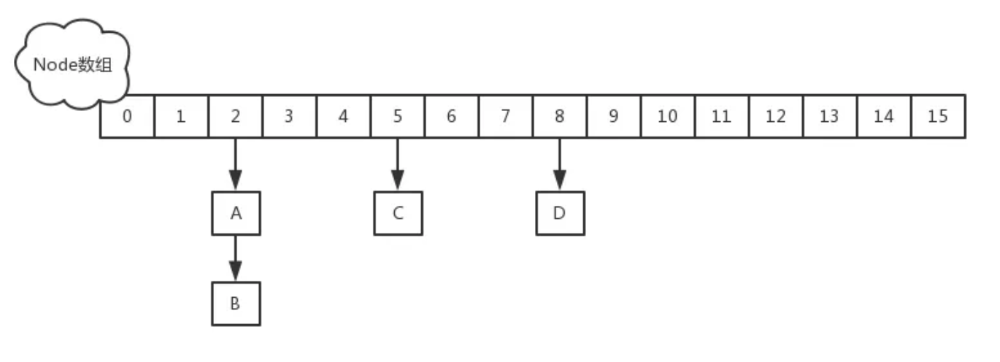
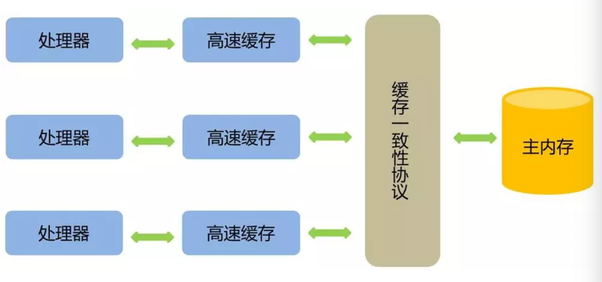
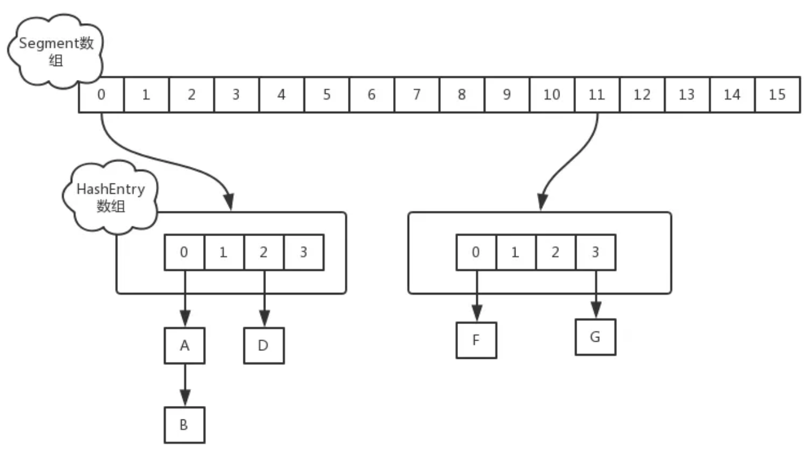
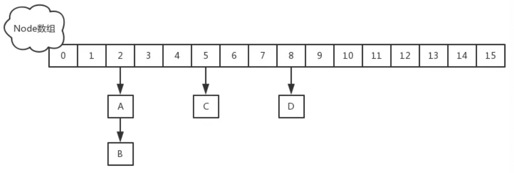
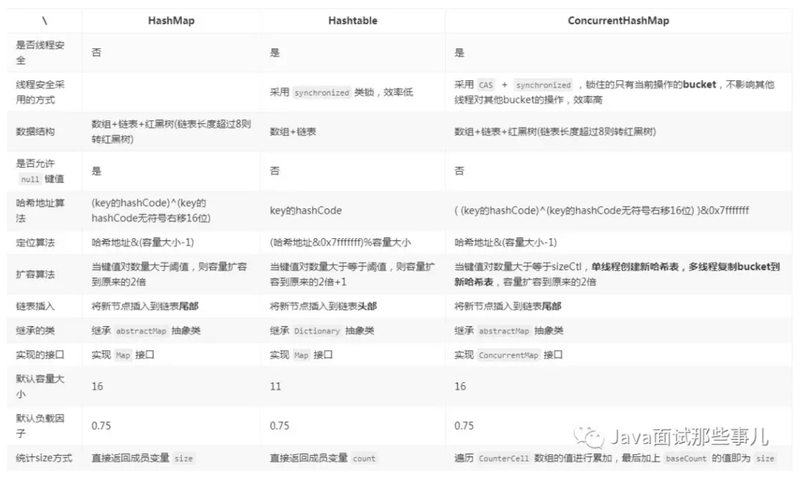

# ConcurrentHashMap
## JDK1.7

## 2、JDK1.8
JDK1.8以及之后，做了一些优化和改进，锁粒度的细化

### 2.1、Put操作
一个大的数组，数组里每个元素进行put操作，都是有一个不同的锁，刚开始进行put的时候，如果两个线程都是在数组[5]这个位置进行put，这个时候，对数组[5]这个位置进行put的时候，采取的是CAS的策略。

如果有两个线程t1 和 t2，同一时间，只会有一个线程t1成功执行这个CAS操作，也就是说刚开始t1先获取数组[5]这个位置的值为null,然后执行CAS,线程t1执行完成之后，也就是CAS put进去t1的数据，同时间，其他线程执行CAS，都会失败。

如果其他线程CAS失败（即发现数组[5]这个位置，已经被t1 put进去了值），此时就需要对数组[5]这个位置基于链表+红黑树来处理，然后synchronized(数组[5]),加锁，基于链表和红黑树在这个位置插进去自己的数组。
#### 2.1.1、总结
如果对数组同一位置的元素进行操作，才会加锁串行化处理，如果对数组不同位置的元素操作，此时大家可以并发执行的。

***
## 3、经典面试题：为什么ConcurrentHashMap的读操作不需要加锁？
- ConcurrentHashMap的简介
- get操作源码
- volatile登场
- 是加在数组上的volatile吗?
- 用volatile修饰的Node
- 总结
### 3.1、ConcurrentHashMap的简介
> 在jdk1.7中是采用Segement+HashEntry+ReentrantLock的方式进行实现的
> 而在JDK1.8中放弃了Segement臃肿的涉及，取而代之的是采用Node+CAS+synchronized来进行保证并发安全进行实现。

- JDK1.8的实现降低锁的粒度，JDK1.7版本锁的粒度是基于Segement的，包含多个HashEntry,而JDK1.8的锁的粒度就是HashEntry(首节点)
- JDK使用synchronized进行同步，所以不需要分段锁的概念
- JDK1.8使用红黑树来优化链表，基于长度很长的链表遍历是一个很漫长的过程时间复杂度O(N)，而红黑树的遍历效率很高O(logN)，代替一定阈值的链表，这样形成一个最佳拍档



### 3.1、get操作源码
- 首先计算hash值，定位到该table索引位置，如果是首结点符合就返回
- 如果遇到扩容的时候，会调用标志正在扩容结点ForwardingNode 的find方法，查找该结点，匹配就返回
- 以上都不符合的话，就往下遍历节点，匹配就返回，否则就返回null

```java
//会发现源码中没有一处加了锁
public V get(Object key) {
    Node[] tab; Nodee, p; int n, eh; K ek;
    int h = spread(key.hashCode()); //计算hash
    if ((tab = table) != null && (n = tab.length) > 0 &&
        (e = tabAt(tab, (n - 1) & h)) != null) {//读取首节点的Node元素
        if ((eh = e.hash) == h) { //如果该节点就是首节点就返回
            if ((ek = e.key) == key || (ek != null && key.equals(ek)))
                return e.val;
        }
        //hash值为负值表示正在扩容，这个时候查的是ForwardingNode的find方法来定位到nextTable来
        //eh=-1，说明该节点是一个ForwardingNode，正在迁移，此时调用ForwardingNode的find方法去nextTable里找。
        //eh=-2，说明该节点是一个TreeBin，此时调用TreeBin的find方法遍历红黑树，由于红黑树有可能正在旋转变色，所以find里会有读写锁。
        //eh>=0，说明该节点下挂的是一个链表，直接遍历该链表即可。
        else if (eh < 0)
            return (p = e.find(h, key)) != null ? p.val : null;
        while ((e = e.next) != null) {//既不是首节点也不是ForwardingNode，那就往下遍历
            if (e.hash == h &&
                ((ek = e.key) == key || (ek != null && key.equals(ek))))
                return e.val;
        }
    }
    return null;
}
```
**get没有加锁的话，concurrentHahsMap是如何保证读到的数据不是脏数据呢？**

### 3.3、volatile登场
对于可见性，Java提供了volatile关键字来保证了可见性、有序性。但不保证原子性。

普通的共享变量不能保证可见性，因为普通共享变量被修改之后，什么时候被写入主内存是不确定的，但其他线程去读取时，此时内存中可能还是原来的旧值，因此无法保证可见性。

- volatile关键字对于基本类型的修改可以在随后对多个线程的读保持一直，但是对于引用类型如数组，实体bean,仅仅保证引用的可见性，但并不保证引用内容的可见性。
- 禁止指令重排序

背景：为了提高处理速度，处理器不直接和内存进行通信，而是先将系统内存的数据读到CPU内部缓存（L，L2或其他）后再进行操作，但操作完不知道何时会写到内存。

- 如果对声明了Volatile的变量进行写操作，JVM就会向处理器发送一条指令，将这个变量所在的缓存行的数据写回到系统内存
- 但是，就算写回到内存，如果其他处理器缓存的值还是旧的，再执行计算操作就会有问题
- 在多处理器下，为了保证各个处理器的缓存是一致的，就会实现缓存一致性协议
- 当某个CPU在写数据时候，如果发现操作的变量是Volatile共享变量,则会通知其他CPU告知该变量的缓存行是无效的，因此其他CPU在读取改变量时，发现其无效，会重新从主存中加载数据


#### 3.3.1、总结
1. 使用volatile关键字会强制将修改的值立即写入主存；
2. 使用volatile关键字的话，线程2进行修改时，会导致线程1的工作内存中缓存变量的缓存行无效（反应到硬件层的话，就是CPU的L1或者L2缓存中对应的缓存行无效）；
3. 由于线程1的工作内存中缓存变量的缓存行无效，所以线程1再次读取变量的值会去主存读取

### 3.4、concurrentHashMap的get()方法不用加锁是因为加在数组上的volatile么？
```java
/**
     * The array of bins. Lazily initialized upon first insertion.
     * Size is always a power of two. Accessed directly by iterators.
     */
    transientvolatile Node[] table;
```
我们知道volatile可以修饰数组的，只是意思和它表面上看起来的样子不同。

举个栗子：volatile int array[10]是指array的地址是volatile的而不是数组元素的值是volatile的.

### 3.5、是因为用volatile修饰了Node
get操作可以无锁是由于Node的元素val和指针next是用volatile修饰的，在多线程环境下线程A修改结点的val或者新增结点的时候对线程B可见的。

```java
staticclass Node<K,V> implements Map.Entry<K,V> {
    finalint hash;
    final K key;
    //可以看到这些都用了volatile修饰
    volatile V val;
    volatile Nodenext;

    Node(int hash, K key, V val, Nodenext) {
        this.hash = hash;
        this.key = key;
        this.val = val;
        this.next = next;
    }

    public final K getKey()       { return key; }
    public final V getValue()     { return val; }
    public final int hashCode()   { return key.hashCode() ^ val.hashCode(); }
    public final String toString(){ return key + "=" + val; }
    public final V setValue(V value) {
        throw new UnsupportedOperationException();
    }

    public final boolean equals(Object o) {
        Object k, v, u; Map.Entry e;
        return ((o instanceof Map.Entry) &&
                (k = (e = (Map.Entry)o).getKey()) != null &&
                (v = e.getValue()) != null &&
                (k == key || k.equals(key)) &&
                (v == (u = val) || v.equals(u)));
    }

    /**
     * Virtualized support for map.get(); overridden in subclasses.
     */
    Nodefind(int h, Object k) {
        Nodee = this;
        if (k != null) {
            do {
                K ek;
                if (e.hash == h &&
                    ((ek = e.key) == k || (ek != null && k.equals(ek))))
                    return e;
            } while ((e = e.next) != null);
        }
        return null;
    }
}
```

> 既然volatile修饰数组对get操作没有效果那么加在数组上的volatile的目的是什么？

其实就是为了Node数组扩容的时候对其他线程具有可见性而加的volatile

### 3.6、总结
- 在1.8中ConcurrentHashMap的get操作全程不需要加锁，这也是它比其他并发结合比如HashTable、用Collections.synchronizedMap()包装hashMap安全效率高的原因
- get操作全程不需要加锁是因为Node的成员val是用volatile修饰和数组用volatile修饰没有关系
- 数组用volatile修饰主要保证数组扩容的时候保证可见性

***

## 4、谈谈ConcurrentHashMap在1.7和1.8的不同实现
在多线程环境下，使用HashMap进行put操作时存在丢失数据的情况，为了避免这种bug的隐患，强烈建议使用ConcurrentHashMap代替HashMap。

### 4.1、JDK1.7
#### 4.1.1、数据结构
jdk1.7 中采用segment+HashEntry的方式进行实现，结构如下：




### 4.2、JDK1.8
#### 4.2.1数据结构
1.8中放弃了Segement臃肿的设计，采用Node+CAS+synchronized来保证并发安全进行实现结构如下：



代码实现中在执行第一次put方法时才会调用initTable()初始化Node数组，实现如下：
```java
/**
     * Initializes table, using the size recorded in sizeCtl.
     */
    private final Node<K,V>[] initTable() {
        Node<K,V>[] tab; int sc;
        while ((tab = table) == null || tab.length == 0) {
            if ((sc = sizeCtl) < 0)
                Thread.yield(); // lost initialization race; just spin
            else if (U.compareAndSwapInt(this, SIZECTL, sc, -1)) {
                try {
                    if ((tab = table) == null || tab.length == 0) {
                        int n = (sc > 0) ? sc : DEFAULT_CAPACITY;
                        @SuppressWarnings("unchecked")
                        Node<K,V>[] nt = (Node<K,V>[])new Node<?,?>[n];
                        table = tab = nt;
                        sc = n - (n >>> 2);
                    }
                } finally {
                    sizeCtl = sc;
                }
                break;
            }
        }
        return tab;
    }
```

#### 4.2.2put实现
当执行put方法插入数据时，根据key的hash值，在Node数组中找到相应位置，实现如下：

1. 如果相应位置的Node还未初始化，则通过CAS插入相应的数据：
2. 如果相应位置的Node不为空，且当前该结点不处于移动状态，则对该结点加synchronized锁，如果该结点的hash不小于0，则遍历链表更新结点或插入新结点
3. 如果该结点TreeBin类型的结点，说明是红黑树结构，这通过putTreeVal方法往红黑树中插入节点
4. 如果bincount不为0,说明put操作对数据产生了影响，如果当前链表的个数达到了8个，则通过treeifyBin方法转化为红黑树，如果oldVal不为空，说明是一次更新操作，没有对元素个数产生影响，直接返回旧值；
5. 如果插入的是一个新节点，则执行 addCount()方法尝试更新元素个数 baseCount；

```java
//1
else if ((f = tabAt(tab, i = (n - 1) & hash)) == null) {
                if (casTabAt(tab, i, null,
                             new Node<K,V>(hash, key, value, null)))
                    break;                   // no lock when adding to empty bin
            }
```
```java
//2
                        if (fh >= 0) {
                            binCount = 1;
                            for (Node<K,V> e = f;; ++binCount) {
                                K ek;
                                if (e.hash == hash &&
                                    ((ek = e.key) == key ||
                                     (ek != null && key.equals(ek)))) {
                                    oldVal = e.val;
                                    if (!onlyIfAbsent)
                                        e.val = value;
                                    break;
                                }
                                Node<K,V> pred = e;
                                if ((e = e.next) == null) {
                                    pred.next = new Node<K,V>(hash, key,
                                                              value, null);
                                    break;
                                }
                            }
                        }
```
```java
//3
                       else if (f instanceof TreeBin) {
                            Node<K,V> p;
                            binCount = 2;
                            if ((p = ((TreeBin<K,V>)f).putTreeVal(hash, key,
                                                           value)) != null) {
                                oldVal = p.val;
                                if (!onlyIfAbsent)
                                    p.val = value;
                            }
                        }
```
```java
                if (binCount != 0) {
                    if (binCount >= TREEIFY_THRESHOLD)
                        treeifyBin(tab, i);
                    if (oldVal != null)
                        return oldVal;
                    break;
                }
```

## synchronized与reentrantLock的区别
### synchronized 是一个同步锁 synchronized （this）
同步锁 当一个线程A 访问 【资源】的代码同步块的时候，A线程就会持续持有当前锁的状态，如果其他线程B-E 也要访问【资源】的代码同步块的时候将会收到阻塞，因此需要排队等待A线程释放锁的状态。（如图情况1）但是注意的是，当一个线程B-E 只是不能方法 A线程 【资源】的代码同步块，仍然可以访问其他的非资源同步块。

### ReentrantLock 可重入锁 通常两类：公平性、非公平性
- 公平性：根据线程请求锁的顺序依次获取锁，当一个线程A 访问 【资源】的期间，线程A 获取锁资源，此时内部存在一个计数器num+1，在访问期间，线程B、C请求 资源时，发现A 线程在持有当前资源，因此在后面生成节点排队（B 处于待唤醒状态），假如此时a线程再次请求资源时，不需要再次排队，可以直接再次获取当前资源 （内部计数器+1 num=2） ，当A线程释放所有锁的时候（num=0），此时会唤醒B线程进行获取锁的操作，其他C-E线程就同理。（情况2）

- 非公平性：当A线程已经释放所之后，准备唤醒线程B获取资源的时候，此时线程M 获取请求，此时会出现竞争，线程B 没有竞争过M线程，测试M获取的线程因此，M会有限获得资源，B继续睡眠。（情况2）

synchronized 是一个非公平性锁。非公平性 会比公平性锁的效率要搞很多原因，不需要通知等待。

ReentrantLock 提供了 new Condition可以获得多个Condition对象,可以简单的实现比较复杂的线程同步的功能.通过await(),signal()以实现。

ReentrantLock 提供可以中断锁的一个方法lock.lockInterruptibly()方法。

Jdk 1.8 synchronized和 ReentrantLock 比较的话，官方比较建议用synchronized。

## HashMap、Hashtable、ConcurrentHashMap三者对比




