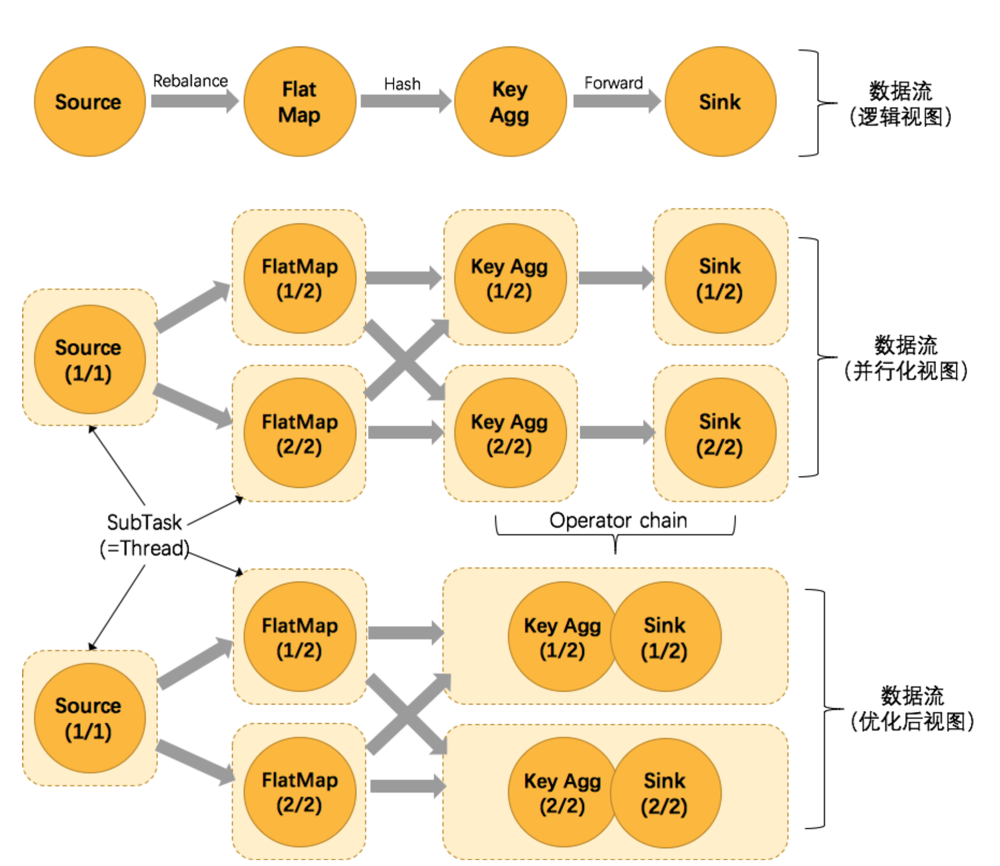

### Operation chain的逻辑
- 为了更高效地分布式执行，Flink会尽可能地将Operator的subtask链接(chain)在一起形成task.
- 每个task在一个线程中执行。将operations链接成task是非常有效的优化
    + 它能减小线程之间的切换
    + 减少消息序列化/反序列化
    + 减少数据在缓冲区的交换
    + 减少了延迟的同时提高了整体的吞吐量

#### opreator chain的条件

上图中将KeyAggregation和Sink两个operator进行了合并，因为这两个合并并不会改变整体的拓扑结构。但是，并不是任意两个operator就能chain一起的，其条件还是很苛刻的。

- 上下游的并行度一致
- 下游结点的入度为1（也就是说下游结点没有来自其它结点的输入）
- 上下游结点都在同一个slot group中
- 两个结点间数据分区方式是forward(参考理解数据流的分区)
- 用户没有禁用chain

flink的chain逻辑是一种很常见的设计，比如spring的interceptor也是类似的实现方式。通过把操作符串成一个大操作符，flink避免了把数据序列化后通过网络发送给其他结点的开销，能够大大增强效率。

#### 什么是slot group? 数据流的分区是啥？

### ExecutionGraph 的生成
与StreamGraph 和jobGraph不同，Executiongraph并不是在我们的客户端程序生成，而是在服务端JobManager处生成的，顺便flink只维护一个JobManager，其入口代码是ExecutionGraphBuilder.buildGraph();

### 任务的调度与执行

Flink集群启动后，首先会启动一个JobManager和多个的TaskManager。用户的代码会由JobClient提交给JobManager，JobManager再把来自不同用户的任务发给不同TaskManager去执行，每个Taskmanager管理多个task,task是执行计算的最小结构，TaskManager将心跳和统计信息汇报给JobManager。Taskmanager之间以流的形式进行数据传输，上述除了task外的三者均为独立的JVM进程

#### 3.1计算资源的调度
Task slot是一个TaskManager内资源分配的最小载体，代表了一个固定大小的资源子集，每个TaskManager会将其所占有的资源平分给它的slot。

通过挑战task slot的数量，用户可以定义task之间是如何相互隔离的。如果TaskManager只有一个slot,也就意味着每个task运行在独立的JVM。每个TaskManager有多个slot的话，也就是说多个task运行在同一个JVM中。

而在同一个JVM进程中的task,可以共享TCP连接（基于多路复用）和心跳消息，可以减少数据的网络传输，也能共享一些数据结构，一定成都上减少每个task的消耗。

每个slot可以接收单个task，也可以接收多个连续task组成的pipeline。

#### 3.2JobManager执行job
JobManager负责接收Flink的作业，调度task，收集job的状态、管理TaskManager。被实现为一个akka actor。

##### 3.2.1JobManager的组件
- BlobServer是一个用来管理二进制大文件的服务，比如保存用户上传的jar文件，该服务会将其写到磁盘上。还有一些相关的类，如BlobCache，用于TaskManager向JobManager下载用户的jar文件
- InstanceManager用来管理当前存活的TaskManager的组件，记录了Taskmanager的心跳信息等
- CompletedCheckPoingStore用于保存已完成的checkpoint相关信息，持久化到内存中或者zookeeper上
- MemoryArchivist保存了已经提交到flink的作业的相关信息，JobGraph等

#### 3.3TaskManager执行task
##### 3.3.1 TaskManager的基本组件
TaskManager是flink中资源管理的基本组件，是所有执行任务的基本容器，提供了内存管理、IO管理、通信管理等一系列功能。

- MemoryManager flink并没有把所有内存管理都委托给JVM，因为JVM普遍存在存储对象密度低、大内存时GC对系统影响大等问题。所以flink自己抽象了一套内存管理机制

