### Flink DataStream API概述及作业如何转换为StreamGraph
本文的主要内容：讲述一个Flink作业是如何转换为StreamGraph的，其中StreamGraph可以看做是一个未经优化处理的逻辑计划，它完全是在Client端生成的。StreamGraph然后再经过优化转换为JobGraph.

client端向JobManager提交的作业就是以JobGraph的形式提交的。也就是说对于JobManager来说，他从客户端接收的作业实际上就是一个JobGraph，然后它再对JobGraph做相应的处理，生成具体的物理计划进行调度。

关于分布式计算中的Graph，最开始接触和理解这个概念应该还是在spark中。spark中有个DAG（Directed Acyclic Graph,有向无环图）的概念，他包括一些边和一些顶点，其中边代表了RDD（Spark中对数据的封装和抽象）、顶点代表了RDD上的Operator，在一个作业中，一旦有Action被调用，创建的DAG就会被提交到DAG Scheduler，它会将这个graph以task的形式调度到不同的节点上去执行计算。Spark在MapReduce的基础上提出了DAG的概念，带来了很多的好处，比如：更方便对复杂作业（复杂的DAG）做全局的优化、通过DAG恢复丢失的RDD等等。

Flink在设计实现中，也借鉴了这个设计，Flink中每个作业在调度时都是一个Graph（Flink一半较多DataFlow Graph，Spark中一般叫做DAG）。

#### Flink作业流程
一个Flink作业，从client端提交到最后真正调度执行，其Graph的转换会经过下面三个阶段（第四个阶段是作业真正执行时的状态，都是以task的形式在TM中运行）：

1. StreamGraph: 根据编写的代码生成最初的Graph，它表示最初的拓扑结构；
2. JobGraph: 这里会对前面生成的Graph，做一些优化操作（比如：operator chain等），最后会提交给JobManager；
3. ExecutionGraph: jobManager根据JobGraph生成ExecutionGraph，是Flink调度时依赖的核心数据结构
4. 物理执行图：JobManager根据生成的ExecutionGraph对job进行调度后，在各个TM上部署Task后形成一张虚拟图

#### DataStream
***A DataStream represents a stream of elements of the same type. A DataStream can be transformed into another DataStream by applying a transformation.***

上面是DataStream的定义，从这个叙述中，可以看出，DataStream实际上就是对相同类型数据流做的封装，它的主要作用就是可以用通过Transformation操作将其转换成另一个DataStream，DataStream向用户提供非常简单的API操作，比如map()、filter()、flatMap()等目前Flink1.10.0的代码里提供的DataStream实现如下

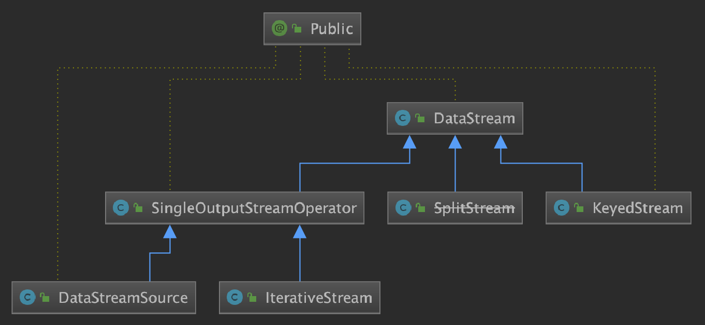

#### Transfromation
***A Transformation represents the operation that creates a DataStream。***Transformation代表创建DataStream的一个operation，这里举个示例，看下下面的代码：

```java
final StreamExecutionEnvironment env = StreamExecutionEnvironment.getExecutionEnvironment();
// source 节点，随机产生一行一行的英文语句
DataStream<String> inputStream = env.addSource(new RandomWordCount.RandomStringSource());
// wordCount 里的第一步，将单词拆分
inputStream.flatMap(new FlatMapFunction<String, Tuple2<String, Integer>>() {
    @Override
    public void flatMap(String value, Collector<Tuple2<String, Integer>> out) {
        for (String word : value.split("\\s")) {
            out.collect(Tuple2.of(word, 1));
        }
    }
});
```
这段代码首先会执行addSource()操作，它会创建一个DataStreamSource节点，节点只创建了Source的DataStream节点，后面才能对这个DataStream做相应的Transformation操作（实际上DataStreamSource节点也会有一个对应的SourceTransformation对象）。

```java
StreamExecutionEnvironment.java

//Adds a Data Source to the streaming topology.
public <OUT> DataStreamSource<OUT> addSource(SourceFunction<OUT> function) {
    return addSource(function, "Custom Source");
}

public <OUT> DataStreamSource<OUT> addSource(SourceFunction<OUT> function, String sourceName, TypeInformation<OUT> typeInfo) {
    if (function instanceof ResultTypeQueryable) {
        typeInfo = ((ResultTypeQueryable<OUT>) function).getProducedType();
    }

    boolean isParallel = function instanceof ParallelSourceFunction;

    clean(function);
    //创建一个Operator
    final StreamSource<OUT, ?> sourceOperator = new StreamSource<>(function);

    //这里再创建DataStreamSource对象时，会创建一个SourceTransformation对象
    return new DataStreamSource<>(this, typeInfo, sourceOperator, isParallel, sourceName);
}
```
因为 DataStreamSource继承SingleOutputStreamOperator，而SingleOutputStreamOperator继承DataStream。在 执行new DataStreamSource的时候会调用DataStream的构造方法。上述代码的最后一步：new DataStreamSource<>(this, typeInfo, sourceOperator, isParallel, sourceName);的具体执行逻辑如下：
```java
DataStreamSource.java
public DataStreamSource(StreamExecutionEnvironment environment,
            TypeInformation<T> outTypeInfo, StreamSource<T, ?> operator,
            boolean isParallel, String sourceName) {
①    super(environment, new SourceTransformation<>(sourceName, operator, outTypeInfo, environment.getParallelism()));

    this.isParallel = isParallel;
    if (!isParallel) {
        setParallelism(1);
    }
}
```
注意在super方法中是先new SourceTransformation();先看下SourceTransformation与Transformation的关系：

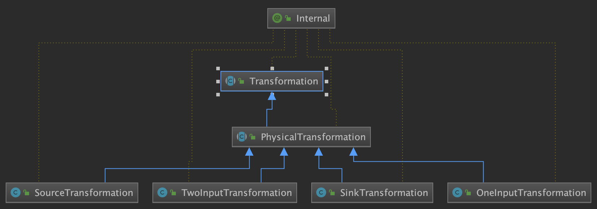

最终会执行transformation的构造函数，构造出一个SourceTransformation
```java
public Transformation(String name, TypeInformation<T> outputType, int parallelism) {
    this.id = getNewNodeId();
    this.name = Preconditions.checkNotNull(name);
    this.outputType = outputType;
    this.parallelism = parallelism;
    this.slotSharingGroup = null;
}
```

接下来看看flatMap()方法，这个实现起始跟前面的实现有一些类似之处，如下所示：
```java
DataStream.java
public <R> SingleOutputStreamOperator<R> flatMap(FlatMapFunction<T, R> flatMapper) {
    TypeInformation<R> outType = TypeExtractor.getFlatMapReturnTypes(clean(flatMapper),
            getType(), Utils.getCallLocationName(), true);
    return flatMap(flatMapper, outType);
}
---->
DataStream.java
public <R> SingleOutputStreamOperator<R> flatMap(FlatMapFunction<T, R> flatMapper, TypeInformation<R> outputType) {
    return transform("Flat Map", outputType, new StreamFlatMap<>(clean(flatMapper)));
}
---->
DataStream.java
public <R> SingleOutputStreamOperator<R> transform(
        String operatorName,
        TypeInformation<R> outTypeInfo,
        OneInputStreamOperator<T, R> operator) {

return doTransform(operatorName, outTypeInfo, SimpleOperatorFactory.of(operator));
}
---->
DataStream.java
protected <R> SingleOutputStreamOperator<R> doTransform(
            String operatorName,
            TypeInformation<R> outTypeInfo,
            StreamOperatorFactory<R> operatorFactory) {
    transformation.getOutputType();
//新的transformation会连接上当前DataStream中的transformation,从而构建了一棵树
①    OneInputTransformation<T, R> resultTransform = new OneInputTransformation<>(
    //记录这个transformation的输入transformation也就是上一个算子生成的transformation
            this.transformation,
            operatorName,
            operatorFactory,
            outTypeInfo,
            environment.getParallelism());

    @SuppressWarnings({"unchecked", "rawtypes"})
    SingleOutputStreamOperator<R> returnStream = new SingleOutputStreamOperator(environment, resultTransform);

②    getExecutionEnvironment().addOperator(resultTransform);

    return returnStream;
}
```

###### 上述flatMap()代码实现逻辑与addSource()代码实现逻辑相同点及不同点：
- 相同点：在①处与addSource()的DataStreamSource中①处的代码类似，最终的目的都是要生成Transformation对象。
- 不同点：flatMap()与addSource()的不同之处在于增加了②处的代码。下面来重点研究下②处的代码：

```java
//需要注意的是不是每一个operator都会执行这个方法的，比如keyBy()、groubBy()、addSource()、union()方法
//Adds an operator to the list of operators that should be executed when calling
public void addOperator(Transformation<?> transformation) {
    Preconditions.checkNotNull(transformation, "transformation must not be null.");
    //将当前生成的transformation加入到transformations中，transformations的作用主要时生成streamgraph
    this.transformations.add(transformation);
}
```

①处逻辑的具体实现
```java
public OneInputTransformation(
            Transformation<IN> input, //即this.transformation
            String name,
            StreamOperatorFactory<OUT> operatorFactory,
            TypeInformation<OUT> outputType,
            int parallelism) {
    super(name, outputType, parallelism);
    this.input = input;
    this.operatorFactory = operatorFactory;
}
```
那么上面提到的Transformation到底是什么呢？也是为了让大家对Transformation有更深入的俩节来看下面这张图，最开始就是一个SourceTransformation，然后又创建了一个OneInputTransformation对象（具体看下面这这张图：）

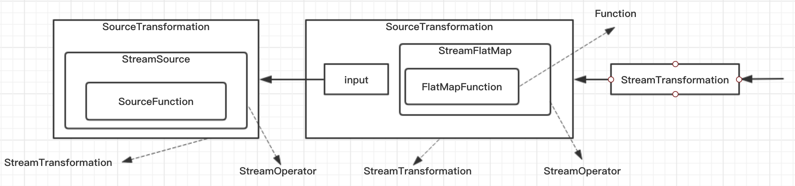

一个Transformation，它是对StreamOperator的一个封装（而Operator又是对Function的一个封装，真正的处理逻辑是在Function实现的，当然并不一定所有的Operator都会又Function），并且会记录它前面的Transformation，只有这样才能把这个Job的完整grap构建出来。

我们从代码中也看到了，所有对DataStream的操作，最终都是以Transformation提现的，DataStream仅仅是暴露给用户的一套操作API，用于简化数据处理的实现。

#### StreamOperator
Operator最基本的类是StreamOperator，从名字也能看出来，它表示的是对Stream的一个operation，它主要的实现类如下

- AbstractUdfStreamOperator:会封装一个 Function，真正的操作是在 Function 中的实现，它主要是在最基础的方法实现上也会相应地调用对应 Function 的实现，比如：open/close方法也会调用 Function 的对应实现等；
- OneInputStreamOperator:如果这个 Operator 只有一个输入，实现这个接口即可， 这个 processElement() 方法需要自己去实现；
- TwoInputStreamOperator:如果这个 Operator 是一个二元操作符，是对两个流的处理，比如：双流 join，那么实现这个接口即可，用户需要自己去实现 processElement1() 和 processElement2() 方法。

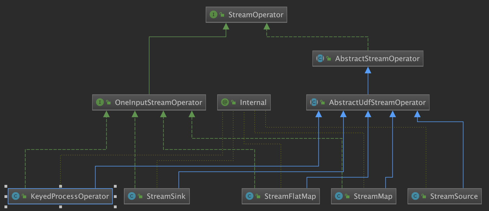

#### Function
Function 是 Transformation 最底层的封装，用户真正的处理逻辑是在这个里面实现的，包括前面示例中实现的 FlatMapFunction 对象。
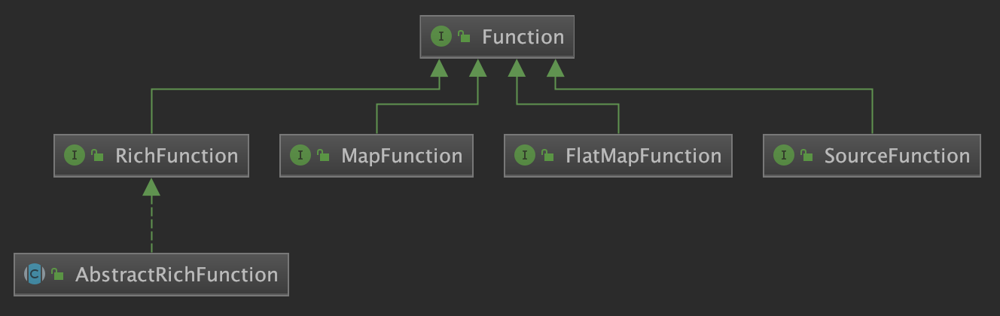

### StreamGraph
#### Demo及实验1
原始代码
```java
public class RandomWordCount {
    public static void main(String[] args) throws Exception {
        // get the execution environment
        final StreamExecutionEnvironment env = StreamExecutionEnvironment.getExecutionEnvironment();
        //note 模拟两个数据源，它们会生成一行随机单词组（单词之间是空格分隔）
        DataStream<String> inputStream = env.addSource(new RandomWordCount.RandomStringSource());
        DataStream<String> inputStream2 = env.addSource(new RandomWordCount.RandomStringSource());
        //note: 先对流做 union，然后做一个过滤后，做 word-count
        inputStream.union(inputStream2)
                .flatMap(new FlatMapFunction<String, Tuple2<String, Integer>>() {
                    @Override
                    public void flatMap(String value, Collector<Tuple2<String, Integer>> out) {
                        for (String word : value.split("\\s")) {
                            out.collect(Tuple2.of(word, 1));
                        }
                    }
                })
                .shuffle()
                .filter(new FilterFunction<Tuple2<String, Integer>>() {
                    @Override
                    public boolean filter(Tuple2<String, Integer> value) throws Exception {
                        if (value.f0.startsWith("a")) {
                            return true;
                        } else {
                            return false;
                        }
                    }
                }).keyBy(0).sum(1)
                .print()
                .setParallelism(2);

        System.out.println("StreamGraph:\t" + env.getStreamGraph().getStreamingPlanAsJSON());
        System.out.println("JobGraph:\t" + env.getStreamGraph().getJobGraph().toString());
        System.out.println("JobGraph:\t" + env.getStreamGraph().getJobGraph());
        env.execute("Random WordCount");
    }

    /**
     * Generate BOUND world line
     */
    private static class RandomStringSource implements SourceFunction<String> {
        private static final long serialVersionUID = 1L;

        private Random rnd = new Random();

        private volatile boolean isRunning = true;
        public static final int BOUND = 100;
        private int counter = 0;

        @Override
        public void run(SourceContext<String> ctx) throws Exception {

            while (isRunning && counter < BOUND) {
                int first = rnd.nextInt(BOUND / 2 - 1) + 1;
                int second = rnd.nextInt(BOUND / 2 - 1) + 1;
                counter++;

                ctx.collect(generatorRandomWorldLine(first, second));
                Thread.sleep(5000L);
            }
        }

        @Override
        public void cancel() {
            isRunning = false;
        }

        private String generatorRandomWorldLine(int charMaxLimit, int wordMaxLimit) {
            int leftLimit = 97; // letter 'a'
            int rightLimit = 122; // letter 'z'
            StringBuilder stringBuilder = null;
            // 本行单词最多有 wordMaxLimit 个
            for (int i = 0; i < wordMaxLimit; i++) {
                // 这个单词的大小长度
                int targetStringLength = rnd.nextInt(charMaxLimit) + 1;
                StringBuilder buffer = new StringBuilder(targetStringLength);
                for (int j = 0; j < targetStringLength; j++) {
                    int randomLimitedInt = leftLimit + (int)
                            (rnd.nextFloat() * (rightLimit - leftLimit + 1));
                    buffer.append((char) randomLimitedInt);
                }
                String generatedString = buffer.toString();
                if (stringBuilder == null) {
                    stringBuilder = new StringBuilder(generatedString);
                } else {
                    stringBuilder.append(" " + generatedString);
                }
            }
            return stringBuilder.toString();
        }
    }
}
```
##### 上述代码operator抽象出的Flink DataStream API如下：
```java
//note 模拟两个数据源，它们会生成一行随机单词组（单词之间是空格分隔）
DataStream<String> inputStream = env.addSource();
DataStream<String> inputStream2 = env.addSource();
inpurStream.union(inputStream2)
    .flatMap()
    .shuffle()
    .filter()
    .keyBy()
    .sum()
    .print()
    .setParallelism(2);
```

##### transformations
Flink首先根据上述Flink DataStream API计算出 transformations，其中transformation的数据结构事一个List<Transformation<?>>,具体如下：

###### transformations的数据结构
protected final List<Transformation<?>> transformations = new ArrayList<>();

###### transformations的值
```java
OneInputTransformation{id=4, name='Flat Map', outputType=Java Tuple2<String, Integer>, parallelism=12}
OneInputTransformation{id=6, name='Filter', outputType=Java Tuple2<String, Integer>, parallelism=12}
OneInputTransformation{id=8, name='Keyed Aggregation', outputType=Java Tuple2<String, Integer>, parallelism=12}
SinkTransformation{id=9, name='Print to Std. Out', outputType=GenericType<java.lang.Object>, parallelism=12}
```
注意在transformations中是没有resource，因为flink规定如果只有resource没有其他transformation是不能形成一个job的。

在执行 env.getStreamGraph().getStreamingPlanAsJSON() 后，这个 StreamGraph 将会以 JSON 的格式输出出来，输出结果如下：
##### streamGraph
```java
{
    "nodes": [
        {
            "id": 1,
            "type": "Source: Custom Source",
            "pact": "Data Source",
            "contents": "Source: Custom Source",
            "parallelism": 1
        },
        {
            "id": 2,
            "type": "Source: Custom Source",
            "pact": "Data Source",
            "contents": "Source: Custom Source",
            "parallelism": 1
        },
        {
            "id": 4,
            "type": "Flat Map",
            "pact": "Operator",
            "contents": "Flat Map",
            "parallelism": 12,
            "predecessors": [
                {
                    "id": 1,
                    "ship_strategy": "REBALANCE",
                    "side": "second"
                },
                {
                    "id": 2,
                    "ship_strategy": "REBALANCE",
                    "side": "second"
                }
            ]
        },
        {
            "id": 6,
            "type": "Filter",
            "pact": "Operator",
            "contents": "Filter",
            "parallelism": 12,
            "predecessors": [
                {
                    "id": 4,
                    "ship_strategy": "SHUFFLE",
                    "side": "second"
                }
            ]
        },
        {
            "id": 8,
            "type": "Keyed Aggregation",
            "pact": "Operator",
            "contents": "Keyed Aggregation",
            "parallelism": 12,
            "predecessors": [
                {
                    "id": 6,
                    "ship_strategy": "HASH",
                    "side": "second"
                }
            ]
        },
        {
            "id": 9,
            "type": "Sink: Print to Std. Out",
            "pact": "Data Sink",
            "contents": "Sink: Print to Std. Out",
            "parallelism": 2,
            "predecessors": [
                {
                    "id": 8,
                    "ship_strategy": "REBALANCE",
                    "side": "second"
                }
            ]
        }
    ]
}
```


##### jobGraph

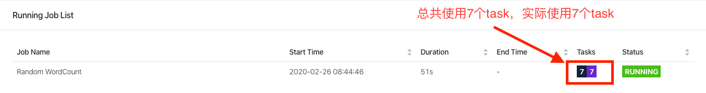

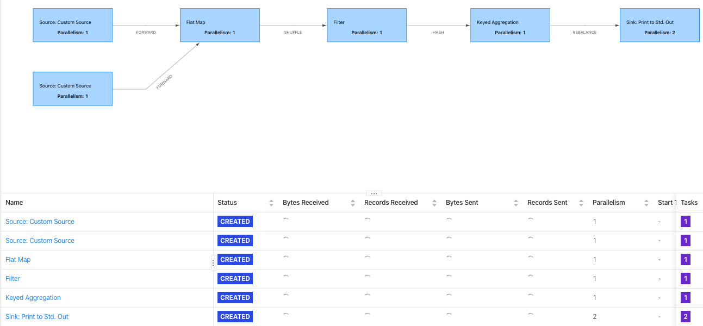

#### Demo及实验2

##### 代码中operator抽象出的Flink DataStream API如下：
```java
//note 模拟两个数据源，它们会生成一行随机单词组（单词之间是空格分隔）
DataStream<String> inputStream = env.addSource();
DataStream<String> inputStream2 = env.addSource();
inpurStream.union(inputStream2)
    .flatMap()
    .keyBy()
    .filter()
    .keyBy()
    .sum()
    .print()
    .setParallelism(2);
```

##### streamGraph
```json
{
    "nodes": [
        {
            "id": 1,
            "type": "Source: Custom Source",
            "pact": "Data Source",
            "contents": "Source: Custom Source",
            "parallelism": 1
        },
        {
            "id": 2,
            "type": "Source: Custom Source",
            "pact": "Data Source",
            "contents": "Source: Custom Source",
            "parallelism": 1
        },
        {
            "id": 4,
            "type": "Flat Map",
            "pact": "Operator",
            "contents": "Flat Map",
            "parallelism": 12,
            "predecessors": [
                {
                    "id": 1,
                    "ship_strategy": "REBALANCE",
                    "side": "second"
                },
                {
                    "id": 2,
                    "ship_strategy": "REBALANCE",
                    "side": "second"
                }
            ]
        },
        {
            "id": 6,
            "type": "Filter",
            "pact": "Operator",
            "contents": "Filter",
            "parallelism": 12,
            "predecessors": [
                {
                    "id": 4,
                    "ship_strategy": "HASH",
                    "side": "second"
                }
            ]
        },
        {
            "id": 8,
            "type": "Keyed Aggregation",
            "pact": "Operator",
            "contents": "Keyed Aggregation",
            "parallelism": 12,
            "predecessors": [
                {
                    "id": 6,
                    "ship_strategy": "HASH",
                    "side": "second"
                }
            ]
        },
        {
            "id": 9,
            "type": "Sink: Print to Std. Out",
            "pact": "Data Sink",
            "contents": "Sink: Print to Std. Out",
            "parallelism": 2,
            "predecessors": [
                {
                    "id": 8,
                    "ship_strategy": "REBALANCE",
                    "side": "second"
                }
            ]
        }
    ]
}
```
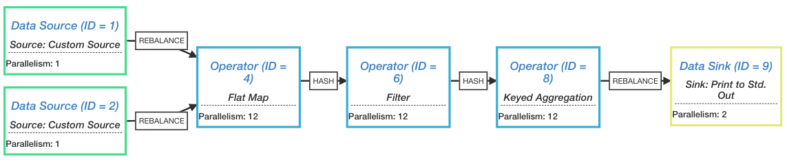

##### jobGraph


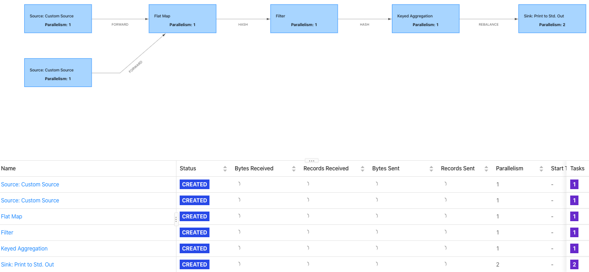

#### Demo及实验2
##### 代码中operator抽象出的Flink DataStream API如下：
```java
//note 模拟两个数据源，它们会生成一行随机单词组（单词之间是空格分隔）
DataStream<String> inputStream = env.addSource();
DataStream<String> inputStream2 = env.addSource();
inpurStream.union(inputStream2)
    .flatMap()
    .filter()
    .keyBy()
    .sum()
    .print()
    .setParallelism(2);
```

##### streamGraph
```java
{
    "nodes": [
        {
            "id": 1,
            "type": "Source: Custom Source",
            "pact": "Data Source",
            "contents": "Source: Custom Source",
            "parallelism": 1
        },
        {
            "id": 2,
            "type": "Source: Custom Source",
            "pact": "Data Source",
            "contents": "Source: Custom Source",
            "parallelism": 1
        },
        {
            "id": 4,
            "type": "Flat Map",
            "pact": "Operator",
            "contents": "Flat Map",
            "parallelism": 12,
            "predecessors": [
                {
                    "id": 1,
                    "ship_strategy": "REBALANCE",
                    "side": "second"
                },
                {
                    "id": 2,
                    "ship_strategy": "REBALANCE",
                    "side": "second"
                }
            ]
        },
        {
            "id": 5,
            "type": "Filter",
            "pact": "Operator",
            "contents": "Filter",
            "parallelism": 12,
            "predecessors": [
                {
                    "id": 4,
                    "ship_strategy": "FORWARD",
                    "side": "second"
                }
            ]
        },
        {
            "id": 7,
            "type": "Keyed Aggregation",
            "pact": "Operator",
            "contents": "Keyed Aggregation",
            "parallelism": 12,
            "predecessors": [
                {
                    "id": 5,
                    "ship_strategy": "HASH",
                    "side": "second"
                }
            ]
        },
        {
            "id": 8,
            "type": "Sink: Print to Std. Out",
            "pact": "Data Sink",
            "contents": "Sink: Print to Std. Out",
            "parallelism": 2,
            "predecessors": [
                {
                    "id": 7,
                    "ship_strategy": "REBALANCE",
                    "side": "second"
                }
            ]
        }
    ]
}
```

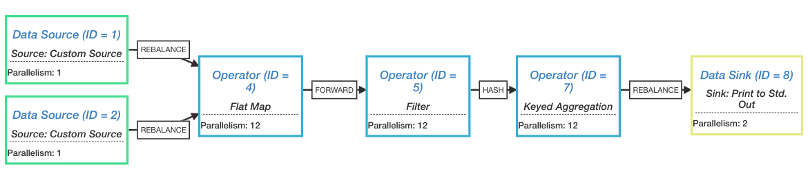

##### jobGraph


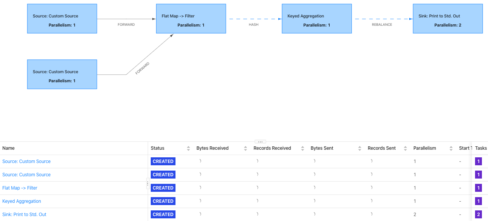

#### 如何生成StreamGraph

```java
env.execute("Random WordCount");
```
```java
StreamExecutionEnvironment.java
public JobExecutionResult execute(String jobName) throws Exception {
    return execute(getStreamGraph(jobName));
}

---->
public StreamGraph getStreamGraph(String jobName) {
    return getStreamGraph(jobName, true);
}
```
```java
StreamExecutionEnvironment.java
public StreamGraph getStreamGraph(String jobName, boolean clearTransformations) {
    //generate()方法生成我们所需要的streamGraph
    StreamGraph streamGraph = getStreamGraphGenerator().setJobName(jobName).generate();
    if (clearTransformations) {
        this.transformations.clear();
    }
    return streamGraph;
}
```
StreamGraph最后是通过StreamGraphGenerator的generate()方法生成的，generate()方法的具体逻辑如下：
```java
//构建一个StreamGraph
public StreamGraph generate() {
    //初始化一个StreamGraph
    streamGraph = new StreamGraph(executionConfig, checkpointConfig, savepointRestoreSettings);
    streamGraph.setStateBackend(stateBackend);
    streamGraph.setChaining(chaining);
    streamGraph.setScheduleMode(scheduleMode);
    streamGraph.setUserArtifacts(userArtifacts);
    streamGraph.setTimeCharacteristic(timeCharacteristic);
    streamGraph.setJobName(jobName);
    streamGraph.setBlockingConnectionsBetweenChains(blockingConnectionsBetweenChains);

    alreadyTransformed = new HashMap<>();
    //遍历transformations
    for (Transformation<?> transformation: transformations) {
        transform(transformation);
    }

    final StreamGraph builtStreamGraph = streamGraph;

    alreadyTransformed.clear();
    alreadyTransformed = null;
    streamGraph = null;

    return builtStreamGraph;
}
```
最关键的还是transformation()方法的实现。这里会根据Transformation的类型对其做相应的转换，起始如下：

```java
StreamGraphGenerator.java
//对具体的一个transformation进行转换，转换成StreamGraph中StreamNode和StreamEdge
private Collection<Integer> transform(Transformation<?> transform) {
    //已经Transform的Transformation会放在这个集合中
    if (alreadyTransformed.containsKey(transform)) {
        return alreadyTransformed.get(transform);
    }
    // call at least once to trigger exceptions about MissingTypeInfo
    transform.getOutputType();

    //返回值为transformation的id集合
    Collection<Integer> transformedIds;
    //根据transform的类型，做相应不同的转换
    if (transform instanceof OneInputTransformation<?, ?>) {
        transformedIds = transformOneInputTransform((OneInputTransformation<?, ?>) transform);
    } else if (transform instanceof TwoInputTransformation<?, ?, ?>) {
        transformedIds = transformTwoInputTransform((TwoInputTransformation<?, ?, ?>) transform);
    } else if (transform instanceof SourceTransformation<?>) {
        transformedIds = transformSource((SourceTransformation<?>) transform);
    } else if (transform instanceof SinkTransformation<?>) {
        transformedIds = transformSink((SinkTransformation<?>) transform);
    } else if (transform instanceof UnionTransformation<?>) {
        transformedIds = transformUnion((UnionTransformation<?>) transform);
    } else if (transform instanceof SplitTransformation<?>) {
        transformedIds = transformSplit((SplitTransformation<?>) transform);
    } else if (transform instanceof SelectTransformation<?>) {
        transformedIds = transformSelect((SelectTransformation<?>) transform);
    } else if (transform instanceof FeedbackTransformation<?>) {
        transformedIds = transformFeedback((FeedbackTransformation<?>) transform);
    } else if (transform instanceof CoFeedbackTransformation<?>) {
        transformedIds = transformCoFeedback((CoFeedbackTransformation<?>) transform);
    } else if (transform instanceof PartitionTransformation<?>) {
        transformedIds = transformPartition((PartitionTransformation<?>) transform);
    } else if (transform instanceof SideOutputTransformation<?>) {
        transformedIds = transformSideOutput((SideOutputTransformation<?>) transform);
    } else {
        throw new IllegalStateException("Unknown transformation: " + transform);
    }

    // need this check because the iterate transformation adds itself before
    // transforming the feedback edges
    if (!alreadyTransformed.containsKey(transform)) {
        alreadyTransformed.put(transform, transformedIds);
    }

    //将这个Transform相关的信息记录到StreamGraph中
    if (transform.getBufferTimeout() >= 0) {
        streamGraph.setBufferTimeout(transform.getId(), transform.getBufferTimeout());
    } else {
        streamGraph.setBufferTimeout(transform.getId(), defaultBufferTimeout);
    }

    if (transform.getUid() != null) {
        streamGraph.setTransformationUID(transform.getId(), transform.getUid());
    }
    if (transform.getUserProvidedNodeHash() != null) {
        streamGraph.setTransformationUserHash(transform.getId(), transform.getUserProvidedNodeHash());
    }

    if (!streamGraph.getExecutionConfig().hasAutoGeneratedUIDsEnabled()) {
        if (transform instanceof PhysicalTransformation &&
                transform.getUserProvidedNodeHash() == null &&
                transform.getUid() == null) {
            throw new IllegalStateException("Auto generated UIDs have been disabled " +
                "but no UID or hash has been assigned to operator " + transform.getName());
        }
    }

    if (transform.getMinResources() != null && transform.getPreferredResources() != null) {
        streamGraph.setResources(transform.getId(), transform.getMinResources(), transform.getPreferredResources());
    }

    streamGraph.setManagedMemoryWeight(transform.getId(), transform.getManagedMemoryWeight());

    return transformedIds;
}
```
接下来重点说说transformOneInputTransform()的实现，在transformOneInputTransform()中会为当前的transform创建响应响应的StreamNode，并创建StreamEdge来链接前后的StreamNode。
```java
//为当前的transform创建StreamNode 和StreamEdge
private <IN, OUT> Collection<Integer> transformOneInputTransform(OneInputTransformation<IN, OUT> transform) {

    //递归调用，先处理当前transform的所有input输入流,只有input对应的Transformation处理完之后才能处理后面
    Collection<Integer> inputIds = transform(transform.getInput());

    // the recursive call might have already transformed this
    if (alreadyTransformed.containsKey(transform)) {
        return alreadyTransformed.get(transform);
    }

    //获取share group
    String slotSharingGroup = determineSlotSharingGroup(transform.getSlotSharingGroup(), inputIds);
    //添加一个Operator(streamGraph端会添加一个StreamNode)
    streamGraph.addOperator(transform.getId(),
            slotSharingGroup,
            transform.getCoLocationGroupKey(),
            transform.getOperatorFactory(),
            transform.getInputType(),
            transform.getOutputType(),
            transform.getName());

    if (transform.getStateKeySelector() != null) {
        TypeSerializer<?> keySerializer = transform.getStateKeyType().createSerializer(executionConfig);
        streamGraph.setOneInputStateKey(transform.getId(), transform.getStateKeySelector(), keySerializer);
    }

    int parallelism = transform.getParallelism() != ExecutionConfig.PARALLELISM_DEFAULT ?
        transform.getParallelism() : executionConfig.getParallelism();
    streamGraph.setParallelism(transform.getId(), parallelism);
    streamGraph.setMaxParallelism(transform.getId(), transform.getMaxParallelism());

    for (Integer inputId: inputIds) {
        //根据输入的id，给这个node在graph中设置相应的graph
        streamGraph.addEdge(inputId, transform.getId(), 0);
    }

    return Collections.singleton(transform.getId());
}
```
上面的transform()之后，最后生成的StreamGrap如下：

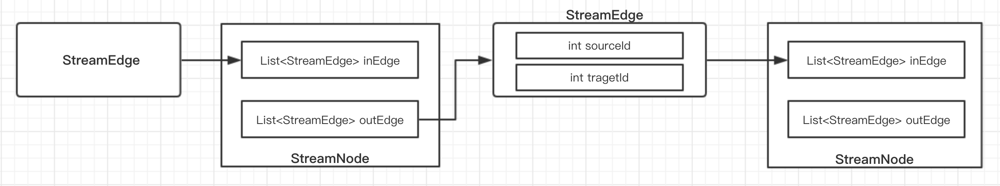

关于上面的 transform() ，还有一个需要注意的是：这三个实现方法 transformSelect()、transformPartition()、transformSideOutput() 在操作时，并不会创建真正的 StreamNode 节点，它们会创建一个虚拟节点，将相应的配置赋给对应的 StreamEdge 即可。另外对于 transformUnion() 方法，它连虚拟节点也不会创建，原因其实看源码也能明白，它们并不包含具体的处理操作。

到这里，StreamGraph的创建过程就分析完了，生成StreamGraph的逻辑起始并不复杂，这里是对用户的作业逻辑做了一个最简单的转换，并没有什么优化操作，相当于原生的用户作业逻辑。


