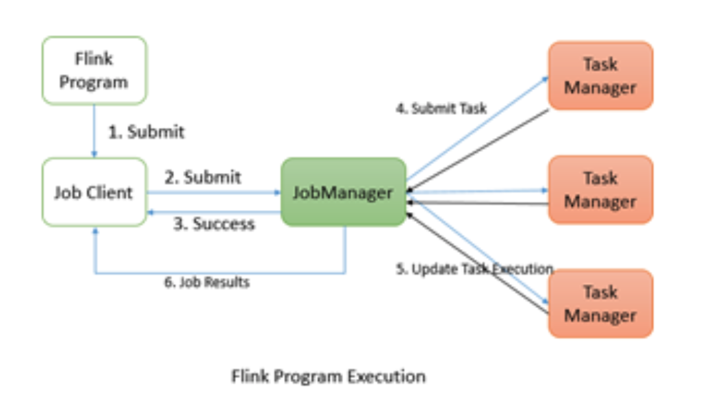
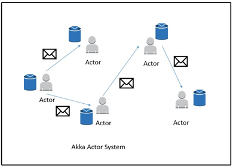
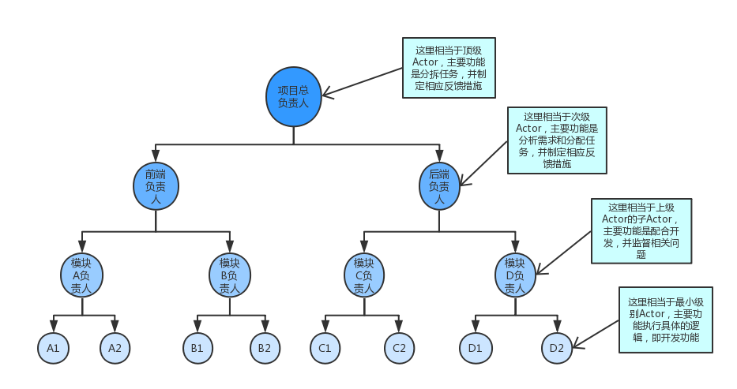
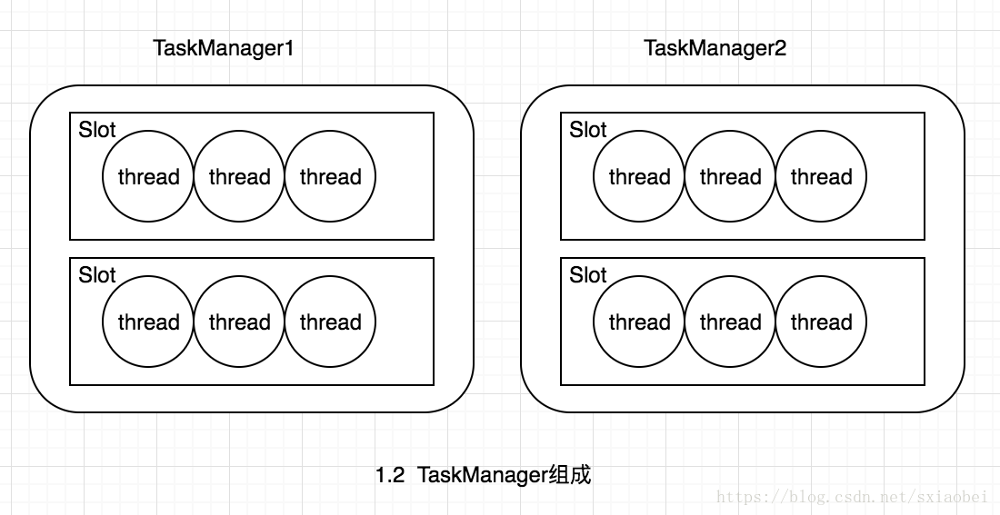
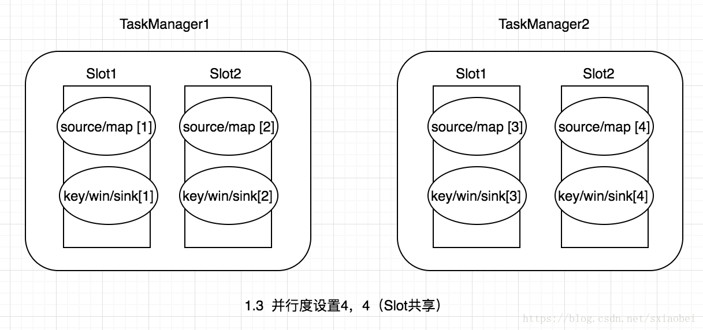
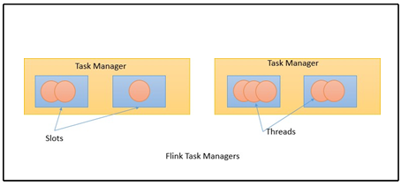

## Flink JobManager
一般来说我们知道武功分为内功和外功。外功其实是很好练的，而且很实用，练完就可以打人。而我们实战同样也是，看完就可以干活。这就是我们的外功。但是如果你想把事情做得更好，遇到问题能够更好地解决，那就需要练内功，这就是我们系统学习所要学习的Flink的一些概念机制等。下面我们开始修炼内功，看下Flink的分布式执行。

FLink 的分布式执行包括两个重要的进程，master和worker。在执行Flink程序时，多个进程参与执行，即：

- 作业管理器(JobManager)
- 任务管理器(TaskManager)
- 作业客户端（JobClient）

Flink程序需要提交给JobClient ，然后，JobCient将作业提交给Job Manager。job Manager负责协调资源分配和作业执行。它首先要做的是分配所需的资源。资源分配完成之后。任务提交给相应的TaskManager。在接收任务时，Task Manager启动一个线程以开始执行，执行到位时，Task Manager会继续向Job Manager报告状态更改。可以有各种状态：例如开始执行，正在进行或已完成。作业执行完成之后将结果发送给客户端（JobClient）

#### Job管理器
master进程（也称为作业管理器）协调和管理程序的执行。他们主要的职责包括调度任务，管理检查点，故障恢复等。可以有多个Masters并行运行并分担职责。这有助于实现高可用。其中一个master需要称为leader。如果leader节点发生故障，master节点（备用节点）被选为领导者。

##### 作业管理器包含以下重要组件：
- Actor system
- Scheduler
- Check pointing
Flink 内部使用Akka actor系统在作业管理器和任务管理器之间进行通信。

【评注：上面内容对我们了解Flink是非常重要的，这里与Spark对比，比如Spark通信使用的是什么？原先使用的也是Akka，后来使用了Netty。那么Flink是否也会改那？这个拭目以待。同时上面也是我们面试必备内容，特别是上面三者的流程图，可以详细说明三者之间的关系。接着我们看Akka actor 系统到底是怎么样的，我们接着往下看】

#### Actor系统
Actor系统时具有各种角色的Actor容器。他提供了诸如调度，配置，日志记录等服务。它还包含一个启动所有actor的线程池。所有参与者都位于层次结构中。每个新创建的actor都将分配给父级。Actor使用消息传递系统相互通信。每个actor都有自己的邮箱，从中读取所有的邮件。如果actor时本地的，则消息通过共享内存共享，但如果actor是远程的，则通过RPC调用传递消息。

每位parent都有责任监督其children。如果children发生任何错误，parent会收到通知。如果actor可以解决自己的问题，那么它可以重新启动它的子节点，如果它无法解决问题，那么他可以将问题反馈到自己的parent:

在Flink中，actor是具有状态和行为的容器。actor的线程一次继续处理它将在其邮箱中接收的消息。状态和行为由它收到的消息决定。

【评注：关于actor其实网络上已经有很多关于他的内容，比较难以理解的是他的父级及子级，还有邮箱我们再来看下图】
ActorSystem模型例子：

##### 邮箱是什么？
简单来说Mailbox就是消息存储的地方。如下图：

许多actors同时运行，但是一个actor只能顺序地处理消息。也就是说其它actors发送了三条消息给一个actor，这个actor只能一次处理一条。所以如果你要并行处理3条消息，你需要把这条消息发给3个actors。

消息异步地传送到actor，所以当actor正在处理消息时，新来的消息应该存储到别的地方。Mailbox就是这些消息存储的地方。

通过上面相信你已经懂得了actor系统

#### 调度
Flink中的Executors 被定义为任务slots。 每个任务管理器（Task Manager ）都需要管理一个或多个任务槽（slots）。 在内部，Flink决定哪些任务需要共享slot 以及哪些任务必须放入特定slot。 它通过SlotSharingGroup和CoLocationGroup定义。

>【诠释】

我们首先来认识slot，来看下图

TaskManager并不是最细粒度的概念，每个TaskManager像一个容器一样，包含一个多或多个Slot。

Slot是TaskManager资源粒度的划分，每个Slot都有自己独立的内存。所有Slot平均分配TaskManger的内存，比如TaskManager分配给Solt的内存为8G，两个Slot，每个Slot的内存为4G，四个Slot，每个Slot的内存为2G，值得注意的是，Slot仅划分内存，不涉及cpu的划分。同时Slot是Flink中的任务执行器（类似Storm中Executor），每个Slot可以运行多个task，而且一个task会以单独的线程来运行。Slot主要的好处有以下几点：

- 可以起到隔离内存的作用，防止多个不同job的task竞争内存。
- Slot的个数就代表了一个Flink程序的最高并行度，简化了性能调优的过程
- 允许多个Task共享Slot，提升了资源利用率

**共享Slot**，虽然在flink中允许task共享Slot提升资源利用率，但是如果一个Slot中容纳过多task反而会造成资源低下（比如极端情况下所有task都分布在一个Slot内），在Flink中task需要按照一定规则共享Slot。共享Slot的方式有两种，**SlotShardingGroup和CoLocationGroup**，这里主要介绍一下SlotShardingGroup的用法，这种共享的基本思路就是给operator分组，同一组的不同operator的task，可以共享一个Slot。默认所有的operator属于同一个组“default”，及所有operator的task可以共享一个Slot，可以给operator设置不同的group，防止不合理的共享。Flink在调度task分配Slot的时候有两个重要原则：

同一个job中，同一个group中不同operator的task可以共享一个Slot
Flink是按照拓扑顺序从Source依次调度到Sink的

还拿上述的例子来说明Slot共享以及task调度的原理，如图1.3假设有两个TaskManager（TaskManager1和TaskManager2），每个TaskManager有2个Slot（Slot1和Slot2）。为了方便理解Slot共享的流程需要提前定义operator的并发度，来决定task的调度顺序。假设source/map的并发度为2，keyBy/window/sink的并发度为4，那么调度的顺序依次为source/map[1] ->source/map[2] ->keyBy/window/sink[1]->keyBy/window/sink[2]->keyBy/window/sink[3]->keyBy/window/sink[4]。如图1.3为了便于说明流程，将source/map的并发度设为4，keyBy/window/sink的并发度设为4。那么首先分配task source/map[1]，这个时候Slot中还没有task，分配到TaskManager1中，然后分配 source/map[2]，根据Slot共享规则，source/map[1]和source/map[2] 属于同一operator的不同task，所以source/map[2]不能共享Slot1，被分配到TaskManager1的Slot2，source/map[3]和source/map[4]同样会依次分配不同的Slot，接下来分配keyBy/window/sink[1],根据Slot共享规则，它可以和source/map[1]，共享同一个slot，所以也被分配到TaskManager1的Slot1中，keyBy/window/sink的其他任务依次被分配到不同Slot中。图1.4为并行度分别设置为2和4的分配过程，这里不再展开说明。

参考：https://blog.csdn.net/sxiaobei/article/details/80861070

我们明白了slot，基本明白了调度。

#### 任务管理器
任务管理器是在JVM中的一个或多个线程中执行任务的工作节点。 任务执行的并行性由每个任务管理器上可用的任务槽（slot）决定。 每个任务代表分配给任务槽的一组资源。 例如，如果任务管理器有四个插槽，那么它将为每个插槽分配25％的内存。 可以在任务槽中运行一个或多个线程。 同一插槽中的线程共享相同的JVM。 同一JVM中的任务共享TCP连接和心跳消息：

【评注】
如果看懂了调度，其实这里就好理解了。

