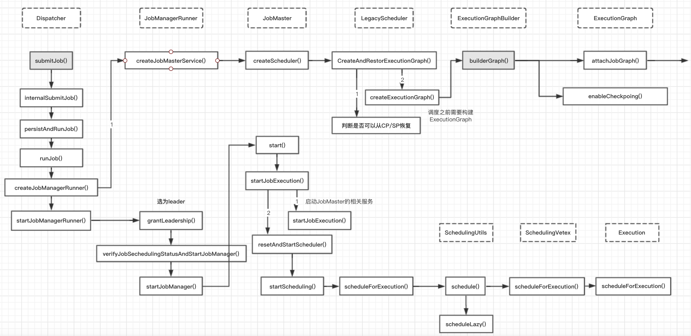

### Flink JobManager详解
- JobManager 简介
- JobManager 详解
- JobMaster的API概述
    + SlotPool
    + LegacyScheduler
- 作业调度的详细流程
    + 如何给ExecutionVertex分配slot
    + 分配时如何选择最优的TM列表
    + 最优的slot分配算法
    + allocateSharedSlot VS allocateSingleSlot
- 总结

### JobManager 简介
本篇主要讲述Flink Master中另一个组件--JobManager（在源码中对应的实现类是JobMaster）。每个作业在启动后，Dispatcher都会为这个作业创建一个JobManager对象，用来做这个作业的相关协调工作。比如：调度这个作业的task、触发checkpoint以及作业的容错恢复等，然后也会介绍下一个作业在生成ExecutionGraph之后是如何在集群中调度起来的。

我们已经知道JobManager其实就是一个作业的master服务，主要负责自己作业相关的协调工作，包括：向ResourceManager申请Slot资源来调度相应的task任务、定时触发作业的checkpoint和手动savepoint的、以及作业的容错恢复，本文会从JobManager是如何初始化的、JobManager有哪些组件及分别提供了哪些功能这两块。

当用户向Flink集群提交一个作业后，Dispatcher在收到Client端提交的JobGraph后，会为这个作业创建一个JobManager对象（对应的是JobMaster类），如下图所示：



JobManager在初始化的时候，会创建LegacyScheduler对象,而LegacyScheduler在初始化时会将这个作业的JobGraph转为ExecutionGraph。

```java
JobMaster.java
public JobMaster(）{//JobMaster的构造函数 JobMaster初始化的时候
    this.schedulerNG = createScheduler(jobManagerJobMetricGroup);
}
private SchedulerNG createScheduler(final JobManagerJobMetricGroup jobManagerJobMetricGroup) {
    return schedulerNGFactory.createInstance(
        log,
        jobGraph,
        ....);
}
```
```java
@Override
public SchedulerNG createInstance(
        final Logger log, final JobGraph jobGraph,
        final BackPressureStatsTracker backPressureStatsTracker,
        final Executor ioExecutor, ...) {
    return new LegacyScheduler(
        log,
        jobGraph,
        backPressureStatsTracker,
        ioExecutor,
        ...);
}
```
因为SchedulerNG继承自SchedulerBase,因此上述构造方法最后会调用SchedulerBase的构造方法，具体如下：
```java
SchedulerBase.java
public SchedulerBase(){
//在此处最终调用createAndRestoreExecutionGraph 生成 ExecutionGraph
    this.executionGraph = createAndRestoreExecutionGraph(jobManagerJobMetricGroup, checkNotNull(shuffleMaster), checkNotNull(partitionTracker));
}
```


### JobManager 详解
***JobMaster:*** The job master is responsible for the execution of a single JobGraph.

JobMaster在实现中，也依赖了很多的服务，其中最重要的是SchedulerNG和SlotPool，JobMaster对外提供的接口实现中大都是使用前面这两个服务的方法。


JobMaster中涉及到重要组件如下图所示：


JobMaster主要有两个服务：

1. LegacyScheduler: ExecutionGraph相关的调度都是在这里实现的。它类似更深层的抽象，封装了ExecutionGraph和BackPressureStatsTracker，JobMaster不直接去调用ExecutionGraph和BackPressureStatsTracker的相关方法，都是通过LegacyScheduler，直接去调用；
2. SlotPool: 它是JobMaster管理其slot的服务，它负责向RM申请/释放Slot，并维护其相应的slot信息

从前面的图中可以看出，如果LegacyScheduler想调用CheckpointCoordinator的方法，比如LegacyScheduler的triggerSavepoint()方法，它是需要先通过executionGraph的getCheckpointCoordinator()方法拿到CheckpointCoordinator，然后再调用CheckpointCoordinatord的triggerSavepoint()方法来触发这个作业的savepoint.

```java
public class JobMaster extends FencedRpcEndpoint<JobMasterId> implements JobMasterGateway, JobMasterService {
    // 作业的JobGraph信息
    private final JobGraph jobGraph;
    // HA服务，这里主要用于监控RM leader，如果RM Leader有变化，这里会与新的leader建立连接
    private final HighAvailabilityServices highAvailabilityServices;
    // 主要用于将数据上传到BlobServer，这里主要上传的是JobInformation和TaskInformation
    private final BlobWriter blobWriter;
    private final HeartbeatServices heartbeatServices;
    //SlotPoolImpl: 从名字也能看出它的主要处理slot相关的内容，在JM这边的一个抽象
    private final SlotPool slotPool;
    // SchedulerImpl：她也是一个调度器，将slot分配给对应的task，它会调用SlotPool的相关接口
    // （他里面有一个slotSelectionStrategy对象，用来决定一个slot分配的最佳算法
    private final Scheduler scheduler;
    private final SchedulerNGFactory schedulerNGFactory;

    // --------- BackPressure --------
    private final BackPressureStatsTracker backPressureStatsTracker;
    // --------- ResourceManager --------
    private final LeaderRetrievalService resourceManagerLeaderRetriever;
    // --------- TaskManagers --------
    private final Map<ResourceID, Tuple2<TaskManagerLocation, TaskExecutorGateway>> registeredTaskManagers;
    private final ShuffleMaster<?> shuffleMaster;

    // -------- Mutable fields ---------
    private HeartbeatManager<Void, Void> resourceManagerHeartbeatManager;
    //LegacyScheduler: 用于调度作业的ExecutionGraph
    private SchedulerNG schedulerNG;
    //用于追踪Intermediate result partition的服务
    private final JobMasterPartitionTracker partitionTracker;
}
```

```java
JobMaster{}.triggerSavepoint()
-- schedulerNG.triggerSavepoint()
-- --> SchedulerNG{}.triggerSavepoint()
-- -- --> SchedulerBase{}.triggerSavepoint()
-----------checkpointCoordinator = executionGraph.getCheckpointCoordinator();
-----------checkpointCoordinator.triggerSavepoint()
-- -- -- -- -->checkpointCoordinator{}.triggerSavepoint()
```

### JobMaster的API概述
目前 JobMaster 对外提供的 API 列表如下（主要还是 JobMasterGateway 接口对应的实现）：

- cancel(): 取消当前正在执行的作业，如果作业还在调度，会执行停止，如果作业正在运行的话，它会向对应的 TM 发送取消 task 的请求（cancelTask() 请求）；
- updateTaskExecutionState(): 更新某个 task 的状态信息，这个是 TM 主动向 JM 发送的更新请求；
- requestNextInputSplit(): Source ExecutionJobVertex 请求 next InputSlipt，这个一般是针对批处理读取而言，有兴趣的可以看下 FLIP-27: Refactor Source Interface，这里是社区计划对 Source 做的改进，未来会将批和流统一到一起；
- requestPartitionState(): 获取指定 Result Partition 对应生产者 JobVertex 的执行状态；
- scheduleOrUpdateConsumers(): TM 通知 JM 对应的 Result Partition 的数据已经可用，每个 ExecutionVertex 的每个 ResultPartition 都会调用一次这个方法（可能是在第一次生产数据时调用或者所有数据已经就绪时调用）；
- disconnectTaskManager(): TM 心跳超时或者作业取消时，会调用这个方法，JM 会释放这个 TM 上的所有 slot 资源；
- acknowledgeCheckpoint(): 当一个 Task 做完 snapshot 后，通过这个接口通知 JM，JM 再做相应的处理，如果这个 checkpoint 所有的 task 都已经 ack 了，那就意味着这个 checkpoint 完成了；
- declineCheckpoint(): TM 向 JM 发送这个消息，告诉 JM 的 Checkpoint Coordinator 这个 checkpoint request 没有响应，比如：TM 触发 checkpoint 失败，然后 Checkpoint Coordinator 就会知道这个 checkpoint 处理失败了，再做相应的处理；
- requestKvStateLocation(): 请求某个注册过 registrationName 对应的 KvState 的位置信息；
- notifyKvStateRegistered(): 当注册一个 KvState 的时候，会调用这个方法，一些 operator 在初始化的时候会调用这个方法注册一个 KvState；
- notifyKvStateUnregistered(): 取消一个 KVState 的注册，这里是在 operator 关闭 state backend 时调用的（比如：operator 的生命周期结束了，就会调用这个方法）；
- offerSlots(): TM 通知 JM 其上分配到的 slot 列表；
- failSlot(): 如果 TM 分配 slot 失败（情况可能很多，比如：slot 分配时状态转移失败等），将会通过这个接口告知 JM；
- registerTaskManager(): 向这个 JM 注册 TM，JM 会将 TM 注册到 SlotPool 中（只有注册过的 TM 的 Slot 才被认为是有效的，才可以做相应的分配），并且会通过心跳监控对应的 TM；
- disconnectResourceManager(): 与 ResourceManager 断开连接，这个是有三种情况会触发，JM 与 ResourceManager 心跳超时、作业取消、重连 RM 时会断开连接（比如：RM leader 切换、RM 的心跳超时）；
- heartbeatFromTaskManager(): TM 向 JM 发送心跳信息；
- heartbeatFromResourceManager(): JM 向 ResourceManager 发送一个心跳信息，ResourceManager 只会监听 JM 是否超时；
- requestJobDetails(): 请求这个作业的 JobDetails（作业的概况信息，比如：作业执行了多长时间、作业状态等）；
- requestJobStatus(): 请求这个作业的执行状态 JobStatus；
- requestJob(): 请求这个作业的 ArchivedExecutionGraph（它是 ExecutionGraph 序列化之后的结果）；
- triggerSavepoint(): 对这个作业触发一次 savepoint；
- stopWithSavepoint(): 停止作业前触发一次 savepoint（触发情况是：用户手动停止作业时指定一个 savepoint 路径，这样的话，会在停止前做一次 savepoint）；
- requestOperatorBackPressureStats(): 汇报某个 operator 反压的情况；
- notifyAllocationFailure(): 如果 RM 分配 slot 失败的话，将会通过这个接口通知 JM；

这里可以看到有部分接口的方法是在跟RM通信使用，所以在RM的接口中也可以看到对应的方法。另外JobMaster上面的这些方法都是在调用LegacyScheduler或SlotPool的具体实现方法来实现的。

#### SlotPool
SlotPool是为当前作业的slot请求而服务的，它会向ResourceManager请求slot资源；SlotPool会维护请求到Slot列表信息（即使ResourceManager挂掉了，SlotPool也可以使用当前空闲的slot资源进行分配）而如果一个slot不再使用的话，即使作业在运行，也可以释放掉（所有的slot都是通过AllocationID来区分的）

SlotPool提供的API列表如下：
```java
public interface SlotPool extends AllocatedSlotActions, AutoCloseable {
    // ------------------------------------------------------------------------
★    //  lifecycle
    // ------------------------------------------------------------------------
    void start(
        JobMasterId jobMasterId,
        String newJobManagerAddress,
        ComponentMainThreadExecutor jmMainThreadScheduledExecutor) throws Exception;

    void suspend();
    void close();
    // ------------------------------------------------------------------------
★    //  resource manager connection
    // ------------------------------------------------------------------------
    //SlotPool与ResourceManager建立连接，之后SlotPool就可以向ResourceManager请求slot资源了
    void connectToResourceManager(ResourceManagerGateway resourceManagerGateway);
    //SlotPool与ResourceManager断开连接，这个方法被调用后，SlotPool就不能从ResourceManager请求slot资源了
    // ，并且所有正在排队等待的SlotRequest都被取消
    void disconnectResourceManager();

    // ------------------------------------------------------------------------
★    //  registering / un-registering TaskManagers and slots
    // ------------------------------------------------------------------------
    // 注册TM，这里会记录以下注册过来的TM，只能向注册过来的TM分配slot
    boolean registerTaskManager(ResourceID resourceID);
    //注销TM,这个TM相关的slot会被释放，task将会被取消，SlotPool会通知相应的TM释放其slot
    boolean releaseTaskManager(final ResourceID resourceId, final Exception cause);
    Collection<SlotOffer> offerSlots(
        TaskManagerLocation taskManagerLocation,
        TaskManagerGateway taskManagerGateway,
        Collection<SlotOffer> offers);
    // 分配失败，并释放相应的slot，可能时因为请求超时由JM触发或者TM分配失败
    Optional<ResourceID> failAllocation(AllocationID allocationID, Exception cause);
    // ------------------------------------------------------------------------
★    //  allocating and disposing slots
    // ------------------------------------------------------------------------
    //获取当前可用的slot列表
    @Nonnull
    Collection<SlotInfoWithUtilization> getAvailableSlotsInformation();
    //将指定的SlotRequest分配到指定的slot上，这里只是记录其对应关系（哪个slot对应哪个slot请求）
    Optional<PhysicalSlot> allocateAvailableSlot(
        @Nonnull SlotRequestId slotRequestId,
        @Nonnull AllocationID allocationID);
    //从RM请求一个新的slot资源分配，申请到的slot之后也会添加到SlotPool中
    @Nonnull
    CompletableFuture<PhysicalSlot> requestNewAllocatedSlot(
        @Nonnull SlotRequestId slotRequestId,
        @Nonnull ResourceProfile resourceProfile,
        Time timeout);
    //上面的方法是 Stream 类型，这里是 batch 类型，但向 RM 申请的时候，这里并没有区别，只是为了做相应的标识；
    @Nonnull
    CompletableFuture<PhysicalSlot> requestNewAllocatedBatchSlot(
        @Nonnull SlotRequestId slotRequestId,
        @Nonnull ResourceProfile resourceProfile);
    AllocatedSlotReport createAllocatedSlotReport(ResourceID taskManagerId);
}
```
通过上面SlotPool对外提供API列表，可以看到其相关方法都是跟slot相关的，整体可以分为下面几部分：

1. 与ResourceManager建立/取消 连接
2. 注册/注销TM，这里只是记录注册过TM列表
3. 向ResourceManager请求slot资源
4. 分配/释放slot，这里只是更新其资源状态信息，并不做实质的操作

SlotPool这里，更多的时维护一个状态的信息，以及与ResourceManager（请求slot资源）和TM（释放对应的slot）做一些交互工作，它对这些功能做了相应的封装，方便JobMaster来调用

#### LegacyScheduler
如前面所述，LegacyScheduler其实是对ExecutionGraph和BackPressureStatsTracker方法的一个抽象，它还负责为作业创建对应的ExecutionGraph以及对这个作业进行调度。关于LegacyScheduler提供的API这里就不再展开，有兴趣的可以直接看下源码，它提供的大部分API都是在JobMaster的API列表中，因为JobMaster的很多方法本身就是调用LegacyScheduler对应的方法。

### 作业调度的详细流程


```java
LegacySchedule.java
@Override
protected void startSchedulingInternal() {
    final ExecutionGraph executionGraph = getExecutionGraph();
★    executionGraph.scheduleForExecution();
}
```
```java
ExecutionGraph.java
//把CREATED状态转换为RUNNING状态，并做相应的调度，如果有异常会抛出
public void scheduleForExecution() throws JobException {
    assertRunningInJobMasterMainThread();
    final long currentGlobalModVersion = globalModVersion;

    // 先将作业状态转移为RUNNing
    if (transitionState(JobStatus.CREATED, JobStatus.RUNNING)) {
        //这里会真正调度相应的ExecutionGraph
★        final CompletableFuture<Void> newSchedulingFuture = SchedulingUtils.schedule(scheduleMode, getAllExecutionVertices(), this);
        //前面调度完成之后，如果最后的结果有异常，这里会做相应的处理
        ...
    }
}
```
配合前面画图中的流程，接下来，看下这个作业在SchedulingUtils中如何调度的

```java
// SchedulingUtils.java
public static CompletableFuture<Void> schedule( ScheduleMode scheduleMode,
        final Iterable<ExecutionVertex> vertices, final ExecutionGraph executionGraph) {
    switch (scheduleMode) {
        //LAZY 的意思：是有上游数据就绪后，下游的task才能调度,这个主要是批量场景会用到，流不能走这个模式
        case LAZY_FROM_SOURCES:
        case LAZY_FROM_SOURCES_WITH_BATCH_SLOT_REQUEST:
            return scheduleLazy(vertices, executionGraph);
        // 流默认的是这个调度模式
        case EAGER:
            return scheduleEager(vertices, executionGraph);
        default:
            throw new IllegalStateException(String.format("Schedule mode %s is invalid.", scheduleMode));
    }
}

//所有节点会被同时调度
//Schedule vertices eagerly. That means all vertices will be scheduled at once.
public static CompletableFuture<Void> scheduleEager(
        final Iterable<ExecutionVertex> vertices,
        final ExecutionGraph executionGraph) {
    executionGraph.assertRunningInJobMasterMainThread();

    checkState(executionGraph.getState() == JobStatus.RUNNING, "job is not running currently");
    final ArrayList<CompletableFuture<Execution>> allAllocationFutures = new ArrayList<>();
    final SlotProviderStrategy slotProviderStrategy = executionGraph.getSlotProviderStrategy();
    final Set<AllocationID> allPreviousAllocationIds = Collections.unmodifiableSet(
        computePriorAllocationIdsIfRequiredByScheduling(vertices, slotProviderStrategy.asSlotProvider()));
    for (ExecutionVertex ev : vertices) {
        // these calls are not blocking, they only return futures
        // 给每个Execution分配相应的资源
★        CompletableFuture<Execution> allocationFuture = ev.getCurrentExecutionAttempt().allocateResourcesForExecution(
            slotProviderStrategy,
            LocationPreferenceConstraint.ALL,
            allPreviousAllocationIds);
        allAllocationFutures.add(allocationFuture);
    }
    final ConjunctFuture<Collection<Execution>> allAllocationsFuture = FutureUtils.combineAll(allAllocationFutures);
    return allAllocationsFuture.thenAccept(
        (Collection<Execution> executionsToDeploy) -> {
            for (Execution execution : executionsToDeploy) {
★                execution.deploy();
            }
        });
}
```

对于流作业来说，它默认的调度模式(ScheduleMode)是ScheduleMode.EAGER，也就是说，所有task会同时调度起来，上面的代码里也可以看到调度时候有两个主要方法：

1. allocateResourceForExecution(): 它的作用是给这个Execution分配资源，获取分配相应的资源，获取要分配的slot(它还会向ShuffleMaster注册produced partition)
2. deploy(): 这个方法会直接向TM提交这个task任务

##### 1. deploy()的逻辑
```java
Execution.java
public void deploy() throws JobException {
    assertRunningInJobMasterMainThread();
    final LogicalSlot slot  = assignedResource;
    ExecutionState previous = this.state;
    if (this.state != DEPLOYING) {
        slot.releaseSlot(new FlinkException("Actual state of execution " + this + " (" + state + ") does not match expected state DEPLOYING."));
        return;
    }
    final TaskDeploymentDescriptor deployment = TaskDeploymentDescriptorFactory
        .fromExecutionVertex(vertex, attemptNumber)
        .createDeploymentDescriptor(
            slot.getAllocationId(),
            slot.getPhysicalSlotNumber(),
            taskRestore,
            producedPartitions.values());
    taskRestore = null;
    final TaskManagerGateway taskManagerGateway = slot.getTaskManagerGateway();
    final ComponentMainThreadExecutor jobMasterMainThreadExecutor =
        vertex.getExecutionGraph().getJobMasterMainThreadExecutor();

★★  CompletableFuture.supplyAsync(() -> taskManagerGateway.submitTask(deployment, rpcTimeout), executor);
}
```
```java
//RPCTaskManagerGateWay.jav
@Override
public CompletableFuture<Acknowledge> submitTask(TaskDeploymentDescriptor tdd, Time timeout) {
    return taskExecutorGateway.submitTask(tdd, jobMasterId, timeout);
}
```

##### 2. allocateResourcesForExecution()逻辑（在deploy()前面执行）
通过前面的代码我们知道，allocateResourcesForExecution()方法会给每一个ExecutionVertex分配一个slot，而它具体是如何分配的，这个流程是在Execution的 allocateAndAssignSlotForExecution()方法中实现的，代码如下：

```java
Execution.java
//从slot provider中获取一个slot,将任务分配到这个slot上
CompletableFuture<Execution> allocateResourcesForExecution(
        SlotProviderStrategy slotProviderStrategy,
        LocationPreferenceConstraint locationPreferenceConstraint,
        @Nonnull Set<AllocationID> allPreviousExecutionGraphAllocationIds) {
    return allocateAndAssignSlotForExecution(
        slotProviderStrategy,
        locationPreferenceConstraint,
        allPreviousExecutionGraphAllocationIds)
        .thenCompose(slot -> registerProducedPartitions(slot.getTaskManagerLocation()));
}

private CompletableFuture<LogicalSlot> allocateAndAssignSlotForExecution(
    SlotProviderStrategy slotProviderStrategy,
    LocationPreferenceConstraint locationPreferenceConstraint,
    @Nonnull Set<AllocationID> allPreviousExecutionGraphAllocationIds) {
    assertRunningInJobMasterMainThread();

    // 获取这个vertex的相关信息
    final SlotSharingGroup sharingGroup = vertex.getJobVertex().getSlotSharingGroup();
    final CoLocationConstraint locationConstraint = vertex.getLocationConstraint();

    //只会在CREATED下工作
    // this method only works if the execution is in the state 'CREATED'
    if (transitionState(CREATED, SCHEDULED)) {
        final SlotSharingGroupId slotSharingGroupId = sharingGroup != null ? sharingGroup.getSlotSharingGroupId() : null;
        // 创建一个ScheduledUnit对象（跟sharingGroup/locationConstraint都有关系）
        ScheduledUnit toSchedule = locationConstraint == null ?
                new ScheduledUnit(this, slotSharingGroupId) :
                new ScheduledUnit(this, slotSharingGroupId, locationConstraint);
        // 如果能找到之前调度的AllocationID，会尽量先重新调度同一个slot上
        ExecutionVertex executionVertex = getVertex();
★        AllocationID lastAllocation = executionVertex.getLatestPriorAllocation();

        Collection<AllocationID> previousAllocationIDs =
            lastAllocation != null ? Collections.singletonList(lastAllocation) : Collections.emptyList();

        final CompletableFuture<Collection<TaskManagerLocation>> preferredLocationsFuture =
★            calculatePreferredLocations(locationPreferenceConstraint);

        final SlotRequestId slotRequestId = new SlotRequestId();
        // 根据指定的需求分配这个slot
        final CompletableFuture<LogicalSlot> logicalSlotFuture =
            preferredLocationsFuture.thenCompose(
                (Collection<TaskManagerLocation> preferredLocations) ->
★★                    slotProviderStrategy.allocateSlot(
                        slotRequestId,
                        toSchedule,
                        SlotProfile.priorAllocation(
                            vertex.getResourceProfile(),
                            getPhysicalSlotResourceProfile(vertex),
                            preferredLocations,
                            previousAllocationIDs,
                            allPreviousExecutionGraphAllocationIds)));
    }
}
```
这里 ，简单总结以下上面这个方法的流程：

1. 状态转换，这个Execution的状态(ExecutionState)从CREATED转为SCHEDULED状态
2. 根据是否是一个有状态的operator以及它上游输入节点位置，来计算一个最佳的TM位置列表（TaskManagerLocation）列表；
3. 如果这个Execution之前有调度记录，也就是说这次由failover导致的重启，这里会拿到上次调度TM位置信息；
4. 根据2、3拿到TM位置信息，去调用SlotProviderStrategy的allocateSlot()获取要分配的slot。

在SchedulerImpl取分配slot的时候，其实是会分两种情况：

1. allocateSingleSlot(): 如果对应的task节点没有设置SlotSharingGroup，会直接走这个方法，就不会考虑share group情况，直接给这个task分配对应的slot；
2. allocateShareSlot(): 如果对应的task节点有设置SlotSharingGroup，就会走到这个方法，在分配slot的时候，考虑的因素就会多一些

###### Slot资源资源共享--关于上面代码中CoLocationGroup和SlotSharingGroup的解释：
Flink实现了资源共享机制，相同资源组里的多个Execution可以共享一个Slot资源槽。具体共享机制又分为两种：

- ColocationGroup（**强制）**：保证把JobVertices的第n个运行示例和其他相同组内的JobVertices第n个实例运作在相同的slot中。
    + CoLocationGroup可以保证所有并行度相同的sub-tasks运行在同一个slot，主要用于迭代流（训练机器学习模型）
- SlotSharingGroup：保证不同的JobVertices的部署在相同的Slot中，但这事一种宽约束，只是尽量做到不能完全保证。
    + SlotSharingGroup(Soft),SlotSharingGroup是Flink中用来实现slot共享的类，它尽可能地让subtasks共享一个slot。
    + 保证同一个group的并行度相同的sub-tasks共享同一个slots。算子的默认group为default(即默认一个job下subtask都可以共享一个slot)
    + 为了防止不合理的共享，用户也能通过API来强制指定operator的共享组，比如：someStream.filter(...).slotSharingGroup("group1");就强制指定了filter的slot的共享组为group1。
    + 怎么确定一个未做SlotSharingGroup设置算子的SlotSharingGroup什么呢(根据上游算子的Group和自身是否设置group共同确定)。适当设置可以减少每个slot运行线程数，从而整体上减少机器的负载。

###### SlotSharingManager
每一个sharingGroup组用一个SlotSharingManager对象管理资源共享与分配。普通的slotsharing根据组内的JobVertices id查找是否已有可以共享的slot，如果有则直接使用，否则申请新的Slot。colocation类型根据组内每个ExecutionVertex关联的CoLocationConstraint查找是否有相同的CoLocationConstraint约束以分配Slot可用（注：满足CoLocationConstraint约束的同一个资源共享组内的各个节点相同序号n的并行实例，共享相同的CoLocationConstraint对象）


#### 分配时如何选择最优的TM列表
这里，我们先来看下如何给这个slot选择一个最佳的TM列表具体的方法实现是在Execution中的CalculatePreferredLocations()方法中实现的，其具体的实现如下：

```java
// Execution.java
// 根据LocationPreferenceConstrait策略计算前置输入节点的TaskManagerLocation
@VisibleForTesting
public CompletableFuture<Collection<TaskManagerLocation>> calculatePreferredLocations(LocationPreferenceConstraint locationPreferenceConstraint) {
    // 获取一个最佳分配的TM location集合；先通过ExecutionVertex的getPreferredLocations()方法获取一个TaskManagerLocation列表
    // 在根据LocationPreferenceConstraint的模式做过过滤，如果是ALL,那么前面拿到的所有列表都会直接返回
    // 如果是ANY，只会把那些已经分配好的input节点的TaskManagerLocation返回
    final Collection<CompletableFuture<TaskManagerLocation>> preferredLocationFutures = getVertex().getPreferredLocations();
    final CompletableFuture<Collection<TaskManagerLocation>> preferredLocationsFuture;

    switch(locationPreferenceConstraint) {
        case ALL:
            // 默认是ALL,就是前面那个列表，这里都可以使用
            preferredLocationsFuture = FutureUtils.combineAll(preferredLocationFutures);
            break;
        case ANY:
            // 遍历所有input，先获取已经完成assign的input列表
            final ArrayList<TaskManagerLocation> completedTaskManagerLocations = new ArrayList<>(preferredLocationFutures.size());
            for (CompletableFuture<TaskManagerLocation> preferredLocationFuture : preferredLocationFutures) {
                if (preferredLocationFuture.isDone() && !preferredLocationFuture.isCompletedExceptionally()) {
                    final TaskManagerLocation taskManagerLocation = preferredLocationFuture.getNow(null);
                    if (taskManagerLocation == null) {
                        throw new FlinkRuntimeException("TaskManagerLocationFuture was completed with null. This indicates a programming bug.");
                    }
                    completedTaskManagerLocations.add(taskManagerLocation);
                }
            }
            preferredLocationsFuture = CompletableFuture.completedFuture(completedTaskManagerLocations);
            break;
        default:
            throw new RuntimeException("Unknown LocationPreferenceConstraint " + locationPreferenceConstraint + '.');
    }
    return preferredLocationsFuture;
}
```

继续代码：
```java
SlotProviderStrategy.java
public abstract CompletableFuture<LogicalSlot> allocateSlot(
        SlotRequestId slotRequestId,
        ScheduledUnit scheduledUnit,
        SlotProfile slotProfile);
```
```java
SlotProviderStrategy.java的内部类 NormalSlotProviderStaregy
@Override
public CompletableFuture<LogicalSlot> allocateSlot(SlotRequestId slotRequestId, ScheduledUnit scheduledUnit, SlotProfile slotProfile) {
    return slotProvider.allocateSlot(slotRequestId, scheduledUnit, slotProfile, allocationTimeout);
}
```
获取一个最佳分配的TM location集合；先通过ExecutionVertex的getPreferredLocations()方法获取一个TaskManagerLocation列表 ,在根据LocationPreferenceConstraint的模式做过过滤，如果是ALL,那么前面拿到的所有列表都会直接返回,如果是ANY，只会把那些已经分配好的input节点的TaskManagerLocation返回.

这里，就看下ExecutionVertex的getPreferredLocations方法的实现逻辑：
```java
/**
 * 如果这个task Execution 是从checkpoint加载的状态，那么这个location preference就是之前执行的状态；
 * 如果这个task Execution 没有状态信息或之前的location记录，这个location preference依赖于task的输入
 * These rules should result in the following behavior:
 * 1. 无状态task总是基于与输入共享的方式调度
 * 2. 有状态task基于与输入共享的方式来初始化他们最开始的调度
 * 3. 有状态task的重复执行会尽量与他们的state共享执行
 */
public Collection<CompletableFuture<TaskManagerLocation>> getPreferredLocations() {
    Collection<CompletableFuture<TaskManagerLocation>> basedOnState = getPreferredLocationsBasedOnState();
    return basedOnState != null ? basedOnState : getPreferredLocationsBasedOnInputs();
}
```
上述代码处理逻辑：

1. 如果这个作业是从Checkpoint恢复的话，这里会根据它之前的状态信息获取上次的位置信息，直接返回这个位置信息；
2. 另外一种情况是，根据这个ExecutionVertex的inputEdges，获取其上游ExecutionVertex的位置信息列表，但是如果这个列表的数目超过阈值(默认是8)，就会返回null（上游过于分散，再根据input位置信息取分配就没有太大意义了）

可以看出，在选取最优的TaskManagerLocation列表时，主要根据state和input的位置信息来判断，会优先选择state，也就是上次checkpoint中记录的位置。

```java
Scheduler.java
@Nonnull
private CompletableFuture<LogicalSlot> allocateSlotInternal(
    SlotRequestId slotRequestId, ScheduledUnit scheduledUnit,
    SlotProfile slotProfile, @Nullable Time allocationTimeout) {
    componentMainThreadExecutor.assertRunningInMainThread();

    final CompletableFuture<LogicalSlot> allocationResultFuture = new  CompletableFuture<>();
    internalAllocateSlot(
            allocationResultFuture,
            slotRequestId,
            scheduledUnit,
            slotProfile,
            allocationTimeout);
    return allocationResultFuture;
}

private void internalAllocateSlot(
            CompletableFuture<LogicalSlot> allocationResultFuture,
            SlotRequestId slotRequestId,
            ScheduledUnit scheduledUnit,
            SlotProfile slotProfile,
            Time allocationTimeout) {
    CompletableFuture<LogicalSlot> allocationFuture = scheduledUnit.getSlotSharingGroupId() == null ?
★★        allocateSingleSlot(slotRequestId, slotProfile, allocationTimeout) :
★        allocateSharedSlot(slotRequestId, scheduledUnit, slotProfile, allocationTimeout);
}
```

```java
SchedulerIml.java
private CompletableFuture<LogicalSlot> allocateSingleSlot(
            SlotRequestId slotRequestId,
            SlotProfile slotProfile,
            @Nullable Time allocationTimeout) {
★    Optional<SlotAndLocality> slotAndLocality = tryAllocateFromAvailable(slotRequestId, slotProfile);

    if (slotAndLocality.isPresent()) {
        return CompletableFuture.completedFuture(
                completeAllocationByAssigningPayload(slotRequestId, slotAndLocality.get()));
    } else {
        // we allocate by requesting a new slot
        return requestNewAllocatedSlot(slotRequestId, slotProfile, allocationTimeout)
            .thenApply((PhysicalSlot allocatedSlot) -> {
                try {
                    return completeAllocationByAssigningPayload(slotRequestId, new SlotAndLocality(allocatedSlot, Locality.UNKNOWN));
                } catch (FlinkException e) {
                    throw new CompletionException(e);
                }
            });
    }
}


private Optional<SlotAndLocality> tryAllocateFromAvailable(
        @Nonnull SlotRequestId slotRequestId,
        @Nonnull SlotProfile slotProfile) {

    Collection<SlotSelectionStrategy.SlotInfoAndResources> slotInfoList =
            slotPool.getAvailableSlotsInformation()
                    .stream()
                    .map(SlotSelectionStrategy.SlotInfoAndResources::fromSingleSlot)
                    .collect(Collectors.toList());

★★    Optional<SlotSelectionStrategy.SlotInfoAndLocality> selectedAvailableSlot =
        slotSelectionStrategy.selectBestSlotForProfile(slotInfoList, slotProfile);

    return selectedAvailableSlot.flatMap(slotInfoAndLocality -> {
★★        Optional<PhysicalSlot> optionalAllocatedSlot = slotPool.allocateAvailableSlot(
            slotRequestId,
            slotInfoAndLocality.getSlotInfo().getAllocationId());

        return optionalAllocatedSlot.map(
            allocatedSlot -> new SlotAndLocality(allocatedSlot, slotInfoAndLocality.getLocality()));
    });
}
```
selectBestSlotForProfile()选择最优的slot的逻辑如下：
```java
SlotSelectionStrategy.java
Optional<SlotInfoAndLocality> selectBestSlotForProfile(
    @Nonnull Collection<SlotInfoAndResources> availableSlots,
    @Nonnull SlotProfile slotProfile);
```
allocateAvailableSlot将指定的SlotRequest分配到指定的slot上
```java
Slotpool.java
//将指定的SlotRequest分配到指定的slot上，这里只是记录其对应关系（哪个slot对应哪个slot请求）
Optional<PhysicalSlot> allocateAvailableSlot(
    @Nonnull SlotRequestId slotRequestId,
    @Nonnull AllocationID allocationID);
```

#### 最优的 slot 分配算法
针对上面的selectBestSlotForProfile()做进一步的讲解：

在前面选择了最优的TaskManagerLocation列表后，这里来看下如何给task选择具体的slot，这个是在SlotSelectionStrategy中的SelectBestSlotForProfile()方法中做的，目前SlotSelectionStrategy有两个实现类：PreviousAllocatingSlotSelectionStrategy和LocationPreferenceSlotSelectionStrategy，这个是在state.backend.local-recovery参数中配置的，默认是false，选择的是PreviousAllocatingSlotSelectionStrategy，如果配置为true，就会选择LocationPreferenceSlotSelectionStrategy，关于选择的逻辑如下：
```java
// DefaultSchedulerFactory.java
@Nonnull
private static SlotSelectionStrategy selectSlotSelectionStrategy(@Nonnull Configuration configuration) {
    // 根据 state.backend.local-recover 配置选择
    if (configuration.getBoolean(CheckpointingOptions.LOCAL_RECOVERY)) {
        return PreviousAllocationSlotSelectionStrategy.INSTANCE;
    } else {
        return LocationPreferenceSlotSelectionStrategy.INSTANCE;
    }
}
```
- PreviousAllocationSlotSelectionStrategy: 它会根据上次的分配记录，如果这个位置刚好在 SlotPool 的可用列表里，这里就会直接选这个slot，否则会走到LocationPreferenceSlotSelectionStrategy 的处理逻辑；
- LocationPreferenceSlotSelectionStrategy: 这个是对可用的slot列表做打分，选择分数最高的（分数相同的话，会选择第一个），如果slot在前面得到的最优TaskManagerLocation列表中，分数就会比较高。

###### allocateSharedSlot VS allocateSingleSlot
在分配slot时，这里分为两种情况：

1. allocateSingleSlot(): 如果没有设置 SlotSharingGroup 将会走到这个方法，直接给这个SlotRequestId 分配一个 slot，具体选择哪个 slot 就是上面的逻辑；
2. allocateSharedSlot(): 而如果设置SlotSharingGroup就会走到这里，先根据SlotSharingGroupId获取或创建对应的SlotSharingManager，然后创建（或者根据 SlotSharingGroup 获取）一个的MultiTaskSlot每个SlotSharingGroup会对应一个MultiTaskSlot对象），这里再将这个task分配到这个MultiTaskSlot上（这个只是简单介绍，后面在调度模型文章中，将会详细讲述）。

###### Scheduler类图UML：


###### SlotPoolUML类图：


###### Slot与其他组件之间的交互
- Scheduler -> SlotPool：调度器向SlotPool申请资源
- SlotPool -> ResourceManager: SlotPool如果无法满足资源请求，向RM发起申请
- JobMaster -> SlotPool: TaskManager获取的资源通过JobMaster分配给SlotPool


#### 小结
JobManager（JobMaster）主要是为了一个具体的作业而服务的，它负责这个作业每个task的调度、checkpoint/savepoint的触发以及容错恢复，它有两个非常重点的服务-LegacySchedule和SlotPool，其中：

1. LegacySchedule：它封装了作业的ExecutionGraph以及BackPressureStatsTracker中的接口，它会负责这个作业的具体调度、savepoint触发等工作；
2. SlotPool：它主要负责这个作业slot相关的内容，像与ResourceManager通信、分配或释放slot资源等工作


