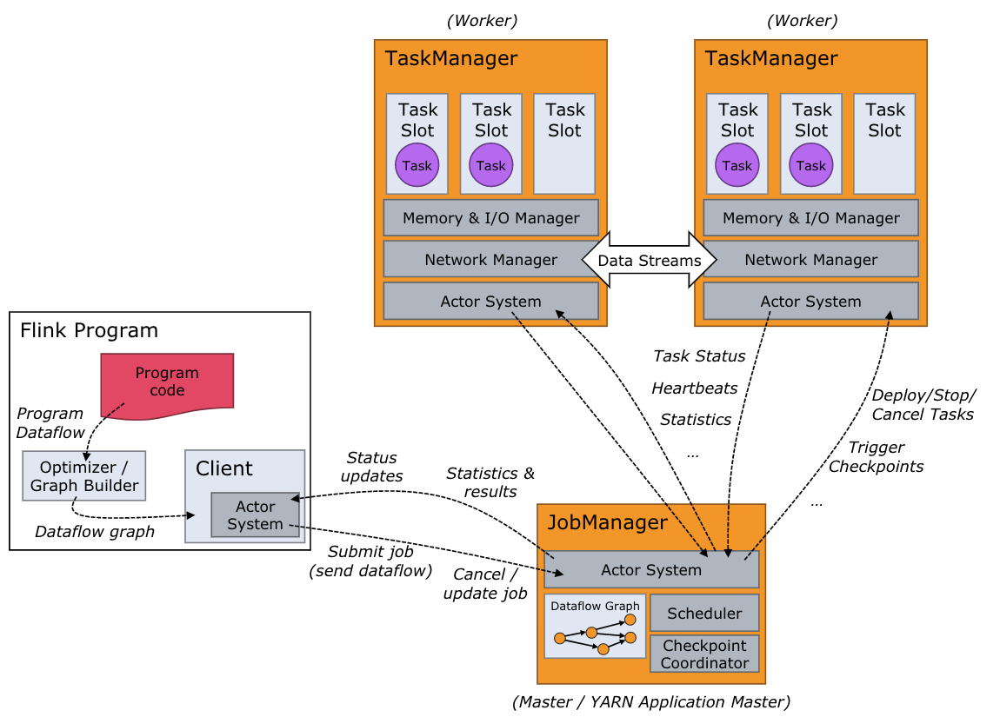
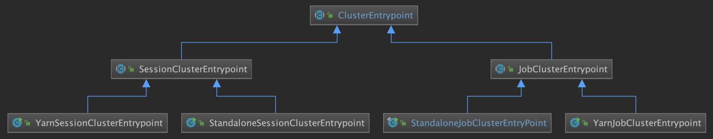
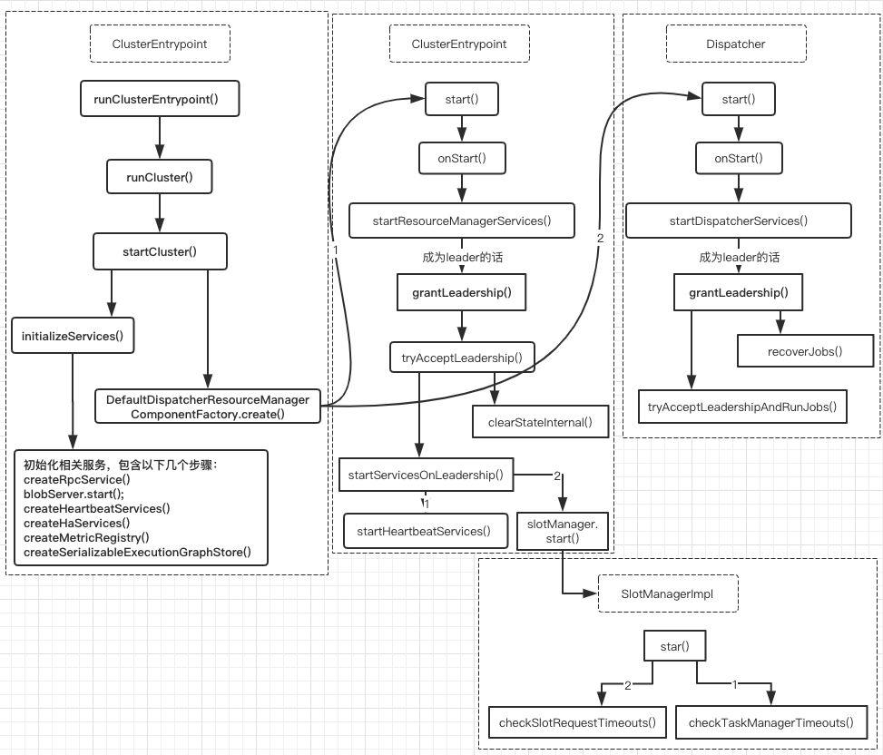

### Flink Master详解
- 问题：Flink中的JobManager与JobMaster的作用及区别？
- 集群的启动逻辑
- Flink Master简介
- Flink Master启动整体流程
    + initializeServices
    + create DispatcherResourceManagerComponent
- Flink Master各个服务详解
    + ResourceManager
    + SlotManager
- 其他服务
- 总结

### 问题：Flink中的JobManager与JobMaster的作用及区别？
最近在研究Flink Runtimer层代码，对其中的JobMaster和JobManager两个类的作用有点困惑，问题的描述：如Flink官方文档中所述，Flink中JobManager负责与Client和TaskManager交互，client将JobGraph提交给JobManager，然后其将JobGraph装换为ExecutionGraph，并分发到TaskManager上执行。对于JobMaster，Flink Dispatcher通过JobManagerRunner将JobGraph发给JobMaster，JobMaster然后将JobGraph转换为ExecutionGraph，并分发给TaskManager执行。从两者的代码中大致看出其作用是相似的，所以就没搞清楚两个类的作用及区别是什么?

**答：**：这个是历史原因。JobManager是老的runtime框架，jobMaster是社区flip-6引入的新的runtime框架。目前起作用的应该是JobMaster。Flink的源码中已经没有JobManager.java这个类了，只有JobMaster.java这个类。由于版本迭代的缘故，JobMaster和JobManager完成的工作逻辑基本是一样的。

### 集群Flink-Cluster的启动逻辑
在 apache-flink/1.10.0/libexec/libexec/start-cluster.sh：
```java
for ((i=0;i<${#MASTERS[@]};++i)); do
    master=${MASTERS[i]}
    webuiport=${WEBUIPORTS[i]}

    if [ ${MASTERS_ALL_LOCALHOST} = true ] ; then
        "${FLINK_BIN_DIR}"/jobmanager.sh start "${master}" "${webuiport}"
    else
        ssh -n $FLINK_SSH_OPTS $master -- "nohup /bin/bash -l \"${FLINK_BIN_DIR}/jobmanager.sh\" start ${master} ${webuiport} &"
    fi
done
```

apache-flink/1.10.0/libexec/libexec/jobmanager.sh：
```java
if [[ $STARTSTOP == "start-foreground" ]]; then
    exec "${FLINK_BIN_DIR}"/flink-console.sh $ENTRYPOINT "${args[@]}"
else
    "${FLINK_BIN_DIR}"/flink-daemon.sh $STARTSTOP $ENTRYPOINT "${args[@]}"
```

apache-flink/1.10.0/libexec/libexec/flink-daemon.sh
```java
case $DAEMON in
    (taskexecutor)
        CLASS_TO_RUN=org.apache.flink.runtime.taskexecutor.TaskManagerRunner
    ;;
    (zookeeper)
        CLASS_TO_RUN=org.apache.flink.runtime.zookeeper.FlinkZooKeeperQuorumPeer
    ;;
    (historyserver)
        CLASS_TO_RUN=org.apache.flink.runtime.webmonitor.history.HistoryServer
    ;;
    (standalonesession)
        CLASS_TO_RUN=org.apache.flink.runtime.entrypoint.StandaloneSessionClusterEntrypoint
    ;;
    (standalonejob)
        CLASS_TO_RUN=org.apache.flink.container.entrypoint.StandaloneJobClusterEntryPoint
    ;;

    (*)
        echo "Unknown daemon '${DAEMON}'. $USAGE."
        exit 1
    ;;
esac
```
如果启动集群时是standalonesession模式，启动集群入口是StandaloneSessionClusterEntrypoint.java。如果启动集群是standalonejob模式，启动集群入口是StandaloneJobClusterEntryPoint.java

### Flink Master简介
接下来会给大家介绍下Flink Runtime中涉及到的分布式调度相关内容。Flink本身也是Master/Slave架构（当前的架构是在 FLIP-6 - Flink Deployment and Process Model - Standalone, Yarn, Mesos, Kubernetes, etc 中实现的），Master节点负责集群中的一些协调工作，Flink中master节点主要包含三大组件：Flink Resource Manager、Flink Dispatcher以及为每个运行的Job创建的一个JobManager服务。

这里需要说明的一点是：通常我们认为的Flink集群的master节点就是JobManager，slave节点就是TaskManager 或者TaskExecutor，这本身没什么问题，当这里需要强调一下，在本文中集群的Master节点暂时就叫做Master节点，而负责每个作业调度的服务，这里就叫做JobManager/JobMaster（现在源码的实现中对应的类时JobMaster）。

集群的Master节点的工作范围与JobManager的工作范围还是有所不同的，而且Master节点的其中一项工作职责就是为了每个提交的作业创建一个JobManager对象，用来处理这个作业相关协调工作，比如task的调度、checkpoint的触及及失败恢复等，JobManager的内容将会在下篇文章单独讲述，本文主要聚集Master节点除JobManager之外的工作。

##### Flink运行时(runtime)包含两类进程
- JobManagers(也称为masters)协调分布式计算。它们负责调度任务，协调checkpoints，故障恢复等。每个Job至少会有一个JobManager。高可用部署下会有多个JobManagers，其中一个作为leader，其余处于standby状态。
- TaskManagers(也称为workers)执行dataflow中的tasks(准确来说时subtasks),并且缓存和交换数据streams。每个job至少会有一个TaskManager。

jobManagers和taskManagers有多种启动方式：直接在机器上启动(该集群称为standalone cluster)，在容器或资源管理框架，如Yarn中启动。

TaskManagers连接到JobManagers，通知后者自己可用，然后开始接手被分配的工作。

##### Flink的Master节点包含了三个组件
Flink的master节点包含了三个组件：Dispatcher、ResourceManager和JobManager。其中：

1. Dispatcher: 负责接收用户提供的作业，并且负责为这个提交的作业拉起一个新的JobManager服务；
2. ResourceManager: 负责资源的管理，在整个Flink集群中只有一个ResourceManager，资源的相关内容都由这个服务负责。
3. JobManager: 负责管理具体某个作业的执行，在一个flink集群中可能由多个作业同时执行，每个作业都会有自己的JobManager服务。



根据上面的Flink的架构图，当用户开始提交一个作业，首先会将用户编写的代码转化成一个JobGraph，在这个过程中，会进行一些检查或者优化相关的工作（比如：检查配置，把可以Chain在一起的算子Chain在一起）。然后Client在将生成的JobGraph提交到集群中执行。此时有两种情况（对于两种不同类型的集群）：

1. 类似于Standalone这种Session模式(对于YARN模式来说)，这种情况下Client可以直接与Dispatcher建立连接并提交作业；
2. 是Per-Job模式，这种情况下Client首先向资源管理器系统（Yarn）申请资源来启动ApplicationMaster，然后再向ApplicationMaster中的Dispatcher提交作业。

当作业到Dispatcher后，Dispatcher会首先启动一个JobManager服务，然后JobManager会向ResourceManager申请资源来启动作业中具体的任务。ResourceManager选择到空闲的Slot之后，就会通知相应的TM将该Slot分配给指定的JobManager。

### Master启动流程
Flink集群Master节点在初始化时，会先调用ClusteerEntryPoint的runClusterEntryPoint()方法启动集群，下图为ClusterEntrypoint.java的类UML图。




上图流程中的代码流程如下：
```java
ClusterEntrypoint.java
-- runClusterEntrypoint(ClusterEntrypoint clusterEntrypoint)
-- -- ClusterEntrypoint.startCluster()
-- -- -- ClusterEntrypoint.runCluster()
-- -- -- -- ①ClusterEntrypoint.initializeServices()
-- -- -- -- --初始化相关服务，包含以下几个步骤
-- -- -- -- -- --createRpcService()
-- -- -- -- -- --blobServer.start();
-- -- -- -- -- --createHeartbeatServices()
-- -- -- -- -- --createHaServices()
-- -- -- -- -- --createMetricRegistry()
-- -- -- -- -- --createSerializableExecutionGraphStore()
-- -- -- -- ①DefaultDispatcherResourceManagerComponentFactory.create()
-- -- -- -- -- resourceManager = resourceManagerFactory.createResourceManager()
-- -- -- -- -- partialDispatcherServices = new PartialDispatcherServices()
-- -- -- -- -- ②resourceManager.start();
-- -- -- -- -- -- RpcEndpoint{}.start()
-- -- -- -- -- -- -- AkkaRpcActor{}.start(akkaRpcActor)
-- -- -- -- -- -- -- akkaRpcActor.rpcEndpoint.internalCallOnStart();
-- -- -- -- -- -- -- -- ResourceManager{}.onStart()
-- -- -- -- -- -- -- -- -- ResourceManager{}.startResourceManagerServices()
-- -- -- -- -- -- -- -- -- --成为leader的话
-- -- -- -- -- -- -- -- -- -- -- ResourceManager.grantLeadership()
-- -- -- -- -- -- -- -- -- -- -- -- ResourceManager{}.tryAcceptLeadership()
-- -- -- -- -- -- -- -- -- -- -- -- -- clearStateInternal()
-- -- -- -- -- -- -- -- -- -- -- -- -- startServicesOnLeadership()
-- -- -- -- -- -- -- -- -- -- -- -- -- -- startHeartbeatServices()
-- -- -- -- -- -- -- -- -- -- -- -- -- -- slotManager.start()
-- -- -- -- -- -- -- -- -- -- -- -- -- -- -- SlotManager{}.checkTaskManagerTimouts()
-- -- -- -- -- -- -- -- -- -- -- -- -- -- -- SlotManager{}.checkSlotRequestTimeouts()
-- -- -- -- -- ②dispatcherRunner = dispatcherRunnerFactory.createDispatcherRunner()
-- -- -- -- -- -- RpcEndpoint{}.start()
-- -- -- -- -- -- -- AkkaRpcActor{}.start(akkaRpcActor)
-- -- -- -- -- -- -- akkaRpcActor.rpcEndpoint.internalCallOnStart();
-- -- -- -- -- -- -- -- Dispatcher{}.onStart()
-- -- -- -- -- -- -- -- -- Dispatcher{}.startDispatcherServices()
-- -- -- -- -- -- -- -- --  如果称为leader的话
-- -- -- -- -- -- -- -- -- -- grantleadership()
```

上图流程中的代码实现如下：



不管是StandaloneSessionClusterEntrypoint还是YarnSessionClusterEntrypoint运行其main()方法后都会调用ClusterEntrypoint的runClusterEntrypoint()方法。
```java
StandaloneSessionClusterEntrypoint entrypoint = new StandaloneSessionClusterEntrypoint(configuration);
ClusterEntrypoint.runClusterEntrypoint(entrypoint);
```
集群的启动过程如下：
```java
ClusterEntrypoint.java
public static void runClusterEntrypoint(ClusterEntrypoint clusterEntrypoint) {
    final String clusterEntrypointName = clusterEntrypoint.getClass().getSimpleName();
    //启动Flink集群
★    clusterEntrypoint.startCluster();

    clusterEntrypoint.getTerminationFuture().whenComplete((applicationStatus, throwable) -> {
        final int returnCode;
        if (throwable != null) {
            returnCode = RUNTIME_FAILURE_RETURN_CODE;
        } else {
            returnCode = applicationStatus.processExitCode();
        }
        LOG.info("Terminating cluster entrypoint process {} with exit code {}.", clusterEntrypointName, returnCode, throwable);
        System.exit(returnCode);
    });
}

public void startCluster() throws ClusterEntrypointException {
    configureFileSystems(configuration);
    SecurityContext securityContext = installSecurityContext(configuration);
    securityContext.runSecured((Callable<Void>) () -> {
        //通过回调启动集群runCluster();
★        runCluster(configuration);
        return null;
    });
}

private void runCluster(Configuration configuration) throws Exception {
    synchronized (lock) {
        // 首先会初始化相关服务(这里会涉及到一系列的服务)
★        initializeServices(configuration);
        // write host information into configuration
        configuration.setString(JobManagerOptions.ADDRESS, commonRpcService.getAddress());
        configuration.setInteger(JobManagerOptions.PORT, commonRpcService.getPort());
        final DispatcherResourceManagerComponentFactory dispatcherResourceManagerComponentFactory = createDispatcherResourceManagerComponentFactory(configuration);
        //创建DispatcherResourceManagerComponent这个对象
★        clusterComponent = dispatcherResourceManagerComponentFactory.create(
            configuration,
            ioExecutor,
            commonRpcService,
            haServices,
            blobServer,
            heartbeatServices,
            metricRegistry,
            archivedExecutionGraphStore,
            new RpcMetricQueryServiceRetriever(metricRegistry.getMetricQueryServiceRpcService()),
            this);
        clusterComponent.getShutDownFuture().whenComplete(
            (ApplicationStatus applicationStatus, Throwable throwable) -> {
                if (throwable != null) {
                    // 抛出异常的情况下
                    shutDownAsync(
                        ApplicationStatus.UNKNOWN,
                        ExceptionUtils.stringifyException(throwable),
                        false);
                } else {
                    shutDownAsync(
                        applicationStatus,
                        null,
                        true);
                }
            });
    }
}
```
上述runCluster()方法主要分为下面两个步骤：

1. initializeServices(): 初始化相关的服务，都是Master节点将会使用到的一些服务。
2. create DisparcherResourceManagerComponent: 如代码中dispatcherResourceManagerComponentFactory.create()方法会创建一个DispatcherResourceManagerComponent对象，这个对象在创建的时候会启动Dispatcher和ResourceManager服务。

下面来详细看下具体的实现。

#### initializeServices
initializeServices() 初始化了一些基本的服务，具体的代码如下：
```java
// 启动集群时候初始化的相关的服务
protected void initializeServices(Configuration configuration){
    synchronized (lock) {
        final String bindAddress = configuration.getString(JobManagerOptions.ADDRESS);
        final String portRange = getRPCPortRange(configuration);
        // 1.创建RPC服务
        commonRpcService = createRpcService(configuration, bindAddress, portRange);
        // 根据当前创建的RPC服务信息在configuration中增加配置信息（之前设置的端口可能是一个range）
        configuration.setString(JobManagerOptions.ADDRESS, commonRpcService.getAddress());
        configuration.setInteger(JobManagerOptions.PORT, commonRpcService.getPort());
        // 2.创建用于IO的线程池
        ioExecutor = Executors.newFixedThreadPool(
            Hardware.getNumberCPUCores(),
            new ExecutorThreadFactory("cluster-io"));
        // 3.创建HA Service（跟用户配置有关，可以是NONE、ZooKeeper也可以自定义的类）
        haServices = createHaServices(configuration, ioExecutor);
        // 4.初始化Blob Server
        blobServer = new BlobServer(configuration, haServices.createBlobStore());
        blobServer.start();
        // 5.启动heartbeat service
        heartbeatServices = createHeartbeatServices(configuration);
        // 6.创建了一个Flink内部的metrics rpc service
        metricRegistry = createMetricRegistry(configuration);
        // 7.启动MetricQuerService
        final RpcService metricQueryServiceRpcService = MetricUtils.startMetricsRpcService(configuration, bindAddress);
        metricRegistry.startQueryService(metricQueryServiceRpcService, null);
        final String hostname = RpcUtils.getHostname(commonRpcService);
        processMetricGroup = MetricUtils.instantiateProcessMetricGroup(
            metricRegistry,
            hostname,
            ConfigurationUtils.getSystemResourceMetricsProbingInterval(configuration));
        // 8.创建了一个ArchiveExectionGraphStore对象，用于存储用户作业的物理graph
        archivedExecutionGraphStore = createSerializableExecutionGraphStore(configuration, commonRpcService.getScheduledExecutor());
    }
}
```
上述流程涉及到服务有：

1. RpcService: 创建一个RPC服务；
2. HighAvailabilityServices: HA Service相关的实现，它的作用很多，比如：处理ResourceManager的leader选举、JobManager leader的选举等
3. BlobServer: 主要管理一些大文件的上传等，比如用户作业的jar包、TM上传的log文件等(Blob是指二进制大对象也就是因为Binary Large Object的缩写)；
4. HeartbeatServices: 初始化的一个心跳服务；
5. MetricRegistryImpl: metrics的相关服务；
6. ArchivedExecutionGraphStore: 存储execution Graph的服务，默认有两种实现，MemoryArchiveExecutionGraphStore主要是在内存中的缓存，FileArchiveExecutionGraphStore 会持久化到文件系统，也会在内存中缓存。

以上的这些服务都会在第二步创建DispatcherResourceManagerComponent 对象时使用到。

#### create DispatcherResourceManagerComponent
创建DispatcherResourceManagerComponent对象的实现如下：
```java
//创建DispatcherResourceManagerComponent对象
public DispatcherResourceManagerComponent create(
    Configuration configuration,
    Executor ioExecutor,
    RpcService rpcService,
    HighAvailabilityServices highAvailabilityServices,
    BlobServer blobServer,
    HeartbeatServices heartbeatServices,
    MetricRegistry metricRegistry,
    ArchivedExecutionGraphStore archivedExecutionGraphStore,
    MetricQueryServiceRetriever metricQueryServiceRetriever,
    FatalErrorHandler fatalErrorHandler) throws Exception {

    LeaderRetrievalService dispatcherLeaderRetrievalService = null;
    LeaderRetrievalService resourceManagerRetrievalService = null;
    WebMonitorEndpoint<?> webMonitorEndpoint = null;
    ResourceManager<?> resourceManager = null;
    ResourceManagerMetricGroup resourceManagerMetricGroup = null;
    DispatcherRunner dispatcherRunner = null;

    //用于Dispatcher leader选举
★    dispatcherLeaderRetrievalService = highAvailabilityServices.getDispatcherLeaderRetriever();
    //用于Resource Manager leader 选举（对于使用ZK的HA模式来说，与上面的区别是使用的路径不同）
★    resourceManagerRetrievalService = highAvailabilityServices.getResourceManagerLeaderRetriever();
    //Dispatcher的Gateway
★    final LeaderGatewayRetriever<DispatcherGateway> dispatcherGatewayRetriever = new RpcGatewayRetriever<>(
        rpcService,
        DispatcherGateway.class,
        DispatcherId::fromUuid,
        10,
        Time.milliseconds(50L));
    //ResourceManager 的 Gateway
★    final LeaderGatewayRetriever<ResourceManagerGateway> resourceManagerGatewayRetriever = new RpcGatewayRetriever<>(
        rpcService,
        ResourceManagerGateway.class,
        ResourceManagerId::fromUuid,
        10,
        Time.milliseconds(50L));
    //它主要使用web前端的rest接口调用
★    final ExecutorService executor = WebMonitorEndpoint.createExecutorService(
        configuration.getInteger(RestOptions.SERVER_NUM_THREADS),
        configuration.getInteger(RestOptions.SERVER_THREAD_PRIORITY),
        "DispatcherRestEndpoint");

    final long updateInterval = configuration.getLong(MetricOptions.METRIC_FETCHER_UPDATE_INTERVAL);
    final MetricFetcher metricFetcher = updateInterval == 0
        ? VoidMetricFetcher.INSTANCE
        : MetricFetcherImpl.fromConfiguration(
            configuration,
            metricQueryServiceRetriever,
            dispatcherGatewayRetriever,
            executor);

    //【重点】创建WebMonitorEndpoint，并启动
    // 在standalone模式下，这里创建的是DispatcherRestEndpoint对象
★    webMonitorEndpoint = restEndpointFactory.createRestEndpoint(
        configuration,
        dispatcherGatewayRetriever,
        resourceManagerGatewayRetriever,
        blobServer,
        executor,
        metricFetcher,
        highAvailabilityServices.getClusterRestEndpointLeaderElectionService(),
        fatalErrorHandler);
    //启动DispatcherRestEndpoint
    log.debug("Starting Dispatcher REST endpoint.");
★    webMonitorEndpoint.start();

    final String hostname = RpcUtils.getHostname(rpcService);

    resourceManagerMetricGroup = ResourceManagerMetricGroup.create(metricRegistry, hostname);

    //【重点】创建resourceManager并启动(Standalone模式，这里创建的是StandaloneResourceManager对象)
★    resourceManager = resourceManagerFactory.createResourceManager(
        configuration,
        ResourceID.generate(),
        rpcService,
        highAvailabilityServices,
        heartbeatServices,
        fatalErrorHandler,
        new ClusterInformation(hostname, blobServer.getPort()),
        webMonitorEndpoint.getRestBaseUrl(),
        resourceManagerMetricGroup);

    final HistoryServerArchivist historyServerArchivist = HistoryServerArchivist.createHistoryServerArchivist(configuration, webMonitorEndpoint);

    //创建dispatcher对象
★    final PartialDispatcherServices partialDispatcherServices = new PartialDispatcherServices(
        configuration,
        highAvailabilityServices,
        resourceManagerGatewayRetriever,
        blobServer,
        heartbeatServices,
        () -> MetricUtils.instantiateJobManagerMetricGroup(metricRegistry, hostname),
        archivedExecutionGraphStore,
        fatalErrorHandler,
        historyServerArchivist,
        metricRegistry.getMetricQueryServiceGatewayRpcAddress());

    log.debug("Starting Dispatcher.");
★    dispatcherRunner = dispatcherRunnerFactory.createDispatcherRunner(
        highAvailabilityServices.getDispatcherLeaderElectionService(),
        fatalErrorHandler,
        new HaServicesJobGraphStoreFactory(highAvailabilityServices),
        ioExecutor,
        rpcService,
        partialDispatcherServices);

    // 启动ResourceManager
    log.debug("Starting ResourceManager.");
★    resourceManager.start();

    resourceManagerRetrievalService.start(resourceManagerGatewayRetriever);
    dispatcherLeaderRetrievalService.start(dispatcherGatewayRetriever);

★    return new DispatcherResourceManagerComponent(
        dispatcherRunner,
        resourceManager,
        dispatcherLeaderRetrievalService,
        resourceManagerRetrievalService,
        webMonitorEndpoint);

```
在上面的方法实现中，Master中的两个重要服务就是在这里初始化并启动的：

1. Dispatcher: 初始化并启动这个服务，如果JM启动了HA模式，这里会竞选Leader，只有Leader的Dispatcher才会真正对外提供服务；
2. ResourceManager：这个跟Dispatcher有点类似

### Flink Master各个服务详解
在这里对Flink Master使用到的各个服务组件做一个详细的总结和归纳：

#### Dispatcher
代码中对Dispatcher的介绍：
***Base class for the Dispatcher component. The Dispatcher component is responsible for receiving job submissions, persisting them, spawning JobManagers to execute the jobs and to recover them in case of a master failure. Furthermore, it knows about the state of the Flink session cluster.***

Dispatcher主要作用是：1.用于作业的提交；2.对作业进行持久化；3.为作业创建对应的JobManager。
```java
/**
 * Runner for the {@link org.apache.flink.runtime.dispatcher.Dispatcher} which is responsible for the
 * leader election.
 */
public final class DefaultDispatcherRunner implements DispatcherRunner, LeaderContender {
    @Override
    public void grantLeadership(UUID leaderSessionID) {
        runActionIfRunning(() -> startNewDispatcherLeaderProcess(leaderSessionID));
    }
    private void startNewDispatcherLeaderProcess(UUID leaderSessionID) {
★        stopDispatcherLeaderProcess();

★        dispatcherLeaderProcess = createNewDispatcherLeaderProcess(leaderSessionID);

        final DispatcherLeaderProcess newDispatcherLeaderProcess = dispatcherLeaderProcess;
        FutureUtils.assertNoException(
            previousDispatcherLeaderProcessTerminationFuture.thenRun(newDispatcherLeaderProcess::start));
    }

    private void stopDispatcherLeaderProcess() {
        final CompletableFuture<Void> terminationFuture = dispatcherLeaderProcess.closeAsync();
        previousDispatcherLeaderProcessTerminationFuture = FutureUtils.completeAll(
            Arrays.asList(
                previousDispatcherLeaderProcessTerminationFuture,
                terminationFuture));
    }

    private DispatcherLeaderProcess createNewDispatcherLeaderProcess(UUID leaderSessionID) {
        LOG.debug("Create new {} with leader session id {}.", DispatcherLeaderProcess.class.getSimpleName(), leaderSessionID);

        final DispatcherLeaderProcess newDispatcherLeaderProcess = dispatcherLeaderProcessFactory.create(leaderSessionID);

 ★       forwardShutDownFuture(newDispatcherLeaderProcess);
 ★       forwardConfirmLeaderSessionFuture(leaderSessionID, newDispatcherLeaderProcess);

        return newDispatcherLeaderProcess;
    }

    private void forwardShutDownFuture(DispatcherLeaderProcess newDispatcherLeaderProcess) {
        newDispatcherLeaderProcess.getShutDownFuture().whenComplete(
            (applicationStatus, throwable) -> {
                synchronized (lock) {
                    // ignore if no longer running or if leader processes is no longer valid
                    if (running && this.dispatcherLeaderProcess == newDispatcherLeaderProcess) {
                        if (throwable != null) {
                            shutDownFuture.completeExceptionally(throwable);
                        } else {
                            shutDownFuture.complete(applicationStatus);
                        }
                    }
                }
            });
    }

    private void forwardConfirmLeaderSessionFuture(UUID leaderSessionID, DispatcherLeaderProcess newDispatcherLeaderProcess) {
        FutureUtils.assertNoException(
            newDispatcherLeaderProcess.getLeaderAddressFuture().thenAccept(
                leaderAddress -> {
                    if (leaderElectionService.hasLeadership(leaderSessionID)) {
                        leaderElectionService.confirmLeadership(leaderSessionID, leaderAddress);
                    }
                }));
    }
```
以上是Dispatcher的选举过程，目前还没有梳理清楚，有待继续学习

我们再看下Dispatcher对外提供了哪些API实现（这些接口主要还是DispatcherGateway）中必须要实现的接口，通过这些API，其实就很容易看出它到底对外提供了哪些功能，提供的API有：

- listJobs(): 列出当前提交的作业列表；
- submitJob(): 向集群提交作业；
- getBlobServerPort(): 返回 blob server 的端口；
- requestJob(): 根据 jobId 请求一个作业的 ArchivedExecutionGraph（它是这个作业ExecutionGraph 序列化后的形式）；
- disposeSavepoint(): 清理指定路径的 savepoint 状态信息；
- cancelJob(): 取消一个指定的作业；
- requestClusterOverview(): 请求这个集群的全局信息，比如：集群有多少个 slot，有多少可用的 slot，有多少个作业等等；
- requestMultipleJobDetails(): 返回当前集群正在执行的作业详情，返回对象是 JobDetails 列表；
- requestJobStatus(): 请求一个作业的作业状态（返回的类型是 JobStatus）；
- requestOperatorBackPressureStats(): 请求一个 Operator 的反压情况；
- requestJobResult(): 请求一个 job 的 JobResult；
- requestMetricQueryServiceAddresses(): 请求 MetricQueryService 的地址；
- requestTaskManagerMetricQueryServiceAddresses(): 请求 TaskManager 的 - MetricQueryService 的地址；
- triggerSavepoint(): 使用指定的目录触发一个 savepoint；
- stopWithSavepoint(): 停止当前的作业，并在停止前做一次 savepoint；
- shutDownCluster(): 关闭集群；

通过Dispatcher提供API可以看出，Dispatcher服务主要功能有：

1. 提交/取消作业
2. 触发/取消/清理 一个作业的savepoint
3. 作业状态/列表查询

Dispatcher这里主要处理的还是Job相关的请求，对外提供同一的接口。

#### ResourceManager
ResourceManager从名字就可以看出，它主要是资源管理相关的服务，如果其被选举为leader，实现如下，它会清除缓存中的数据，然后启动SlotManager服务：
```java
/**
 * Callback method when current resourceManager is granted leadership.
 * 如果当前的resourceManager被选举为leader的话，就执行这个方法
 * @param newLeaderSessionID unique leadershipID
 */
//【重点】
@Override
public void grantLeadership(final UUID newLeaderSessionID) {
    // tryAcceptLeadership()清除之前leader的信息，这里会重新初始化leader相关的信息，并启动SlotManager服务
    final CompletableFuture<Boolean> acceptLeadershipFuture = clearStateFuture
        .thenComposeAsync((ignored) -> tryAcceptLeadership(newLeaderSessionID), getUnfencedMainThreadExecutor());

    final CompletableFuture<Void> confirmationFuture = acceptLeadershipFuture.thenAcceptAsync(
        (acceptLeadership) -> {
            if (acceptLeadership) {
                // confirming the leader session ID might be blocking,
                leaderElectionService.confirmLeadership(newLeaderSessionID, getAddress());
            }
        },
        getRpcService().getExecutor());

    confirmationFuture.whenComplete(
        (Void ignored, Throwable throwable) -> {
            if (throwable != null) {
                onFatalError(ExceptionUtils.stripCompletionException(throwable));
            }
        });
}

private CompletableFuture<Boolean> tryAcceptLeadership(final UUID newLeaderSessionID) {
    if (leaderElectionService.hasLeadership(newLeaderSessionID)) {
        final ResourceManagerId newResourceManagerId = ResourceManagerId.fromUuid(newLeaderSessionID);

        log.info("ResourceManager {} was granted leadership with fencing token {}", getAddress(), newResourceManagerId);

        // clear the state if we've been the leader before
        //清除之前的状态
        if (getFencingToken() != null) {
            clearStateInternal();
        }

        setFencingToken(newResourceManagerId);

        //本节点启动leader服务
        startServicesOnLeadership();

        return prepareLeadershipAsync().thenApply(ignored -> true);
    } else {
        return CompletableFuture.completedFuture(false);
    }
}
//【重点】
protected void startServicesOnLeadership() {
    //启动心跳服务
    startHeartbeatServices();
    //启动slotManager
    slotManager.start(getFencingToken(), getMainThreadExecutor(), new ResourceActionsImpl());
}
```
这里也来看下ResourceManager对外提供的API（ResourceManagerGateway 相关方法的实现）：

- registerJobManager(): 在 ResourceManager 中注册一个 JobManager 对象，一个作业启动后，JobManager 初始化后会调用这个方法；
- registerTaskExecutor(): 在 ResourceManager 中注册一个 TaskExecutor（TaskExecutor 实际上就是一个 TaskManager），当一个 TaskManager 启动后，会主动向 ResourceManager 注册；
- sendSlotReport(): TM 向 ResourceManager 发送 SlotReport（SlotReport 包含了这个 TaskExecutor 的所有 slot 状态信息，比如：哪些 slot 是可用的、哪些 slot 是已经被分配的、被分配的 slot 分配到哪些 Job 上了等）；
- heartbeatFromTaskManager(): 向 ResourceManager 发送来自 TM 的心跳信息；
- heartbeatFromJobManager(): 向 ResourceManager 发送来自 JM 的心跳信息；
- disconnectTaskManager(): TM 向 ResourceManager 发送一个断开连接的请求；
- disconnectJobManager(): JM 向 ResourceManager 发送一个断开连接的请求；
- requestSlot(): JM 向 ResourceManager 请求 slot 资源；
- cancelSlotRequest(): JM 向 ResourceManager 发送一个取消 slot 申请的请求；
- notifySlotAvailable(): TM 向 ResourceManager 发送一个请求，通知 ResourceManager 某个 slot 现在可用了（TM 端某个 slot 的资源被释放，可以再进行分配了）；
- deregisterApplication(): 向资源管理系统（比如：yarn、mesos）申请关闭当前的 Flink 集群，一般是在关闭集群的时候调用的；
- requestTaskManagerInfo(): 请求当前注册到 ResourceManager 的 TM 的详细信息（返回的类型是 TaskManagerInfo，可以请求的是全部的 TM 列表，也可以是根据某个 ResourceID 请求某个具体的 TM）；
- requestResourceOverview(): 向 ResourceManager 请求资源概况，返回的类型是 ResourceOverview，它包括注册的 TM 数量、注册的 slot 数、可用的 slot 数等；
- requestTaskManagerMetricQueryServiceAddresses(): 请求 TM MetricQueryService 的地址信息；
- requestTaskManagerFileUpload(): 向 TM 发送一个文件上传的请求，这里上传的是 TM 的 LOG/STDOUT 类型的文件，文件会上传到 Blob Server，这里会拿到一个 BlobKey（Blobkey 实际上是文件名的一部分，通过 BlobKey 可以确定这个文件的物理位置信息）；

从上面的API列表中，可以看出ResourceManager的主要功能是：

1. JobManager/TaskManager资源的注册/心跳监控/连接断开处理
2. 处理/取消JM资源（slot）的申请
3. 提供资源信息查询
4. 向TM发送请求，触发其LOG/STDOUT文件上传到BlobServer

ResourceManager在启动的时候，也会启动一个SlotManager服务，TM相关的slot资源都是在SlotManager中维护的。

#### SlotManager
SlotManager会维护所有从TaskManager注册过来的slot(包括它们的分配情况)以及所有pending的SlotRequest（所有的slot请求都会先放到pending列表中，然后再去判断是否可以满足其资源需求）。主要有更新slot注册或者旧slot资源释放，SlotManager都会检测pending SlotRequest列表，检查是否有SlotRequest可以满足，如果可以满足，就会将资源分配给这个SlotRequest；如果没有足够可用的slot，SlotManager会尝试着申请新的资源（比如：申请一个worker启动）

当然，为了资源及时释放和避免资源浪费，空转的task manager（它当前已经分配的slot并未使用）和pending slot request在timeout之后将会分别触发它们的释放和失败（对应的方法实现是checkTaskManagerTimeours() 和 checkSlotRequestTimeouts()）

SlotManager对外提供的API如下(SlotManager的实现类是SlotManageImpl)

- getNumberRegisteredSlots(): 获取注册的 slot 的总数量；
- getNumberRegisteredSlotsOf(): 获取某个 TM 注册的 slot 的数量；
- getNumberFreeSlots(): 获取当前可用的（还未分配的 slot） slot 的数量；
- getNumberFreeSlotsOf(): 获取某个 TM 当前可用的 slot 的数量；
- getNumberPendingTaskManagerSlots(): 获取 pendingSlots 中 slot 的数量（pendingSlots 记录的是 SlotManager 主动去向资源管理系统申请的资源，该系统在一些情况下会新启动 worker 来创建资源，但这些slot 还没有主动汇报过来，就会暂时先放到 pendingSlots 中，如果 TM 过来注册的话，该 slot 就会从 pendingSlots 中移除，存储到其他对象中）；
- getNumberPendingSlotRequests(): 获取 pendingSlotRequests 列表的数量，这个集合中存储的是收到的、还没分配的 SlotRequest 列表，当一个 SlotRequest 发送过来之后，会先存储到这个集合中，当分配完成后，才会从这个集合中移除；
- registerSlotRequest(): JM 发送一个 slot 请求（这里是 ResourceManager 通过 requestSlot() 接口调用的）；
- unregisterSlotRequest(): 取消或移除一个正在排队（可能已经在处理中）的 SlotRequest；
- registerTaskManager(): 注册一个 TM，这里会将 TM 中所有的 slot 注册过来，等待后面分配；
- unregisterTaskManager(): 取消一个 TM 的注册（比如：关闭的时候可能会调用），这里会将这个 TM 上所有的 slot 都移除，会先从缓存中移除，然后再通知 JM 这个 slot 分配失败；
- reportSlotStatus(): TM 汇报当前 slot 分配的情况，SlotManager 会将其更新到自己的缓存中；
- freeSlot(): 释放一个指定的 slot，如果这个 slot 之前已经被分配出去了，这里会更新其状态，将其状态改为 FREE；
- setFailUnfulfillableRequest(): 遍历 pendingSlotRequests 列表，如果这些 slot 请求现在还分配不到合适的资源，这里会将其设置为 fail，会通知 JM slot 分配失败。

上面的API列表中，总结一下SlotManager的功能：

1. 提供slot相关的信息查询；
2. 出去和取消JM发送的SlotRequest
3. 注册/取消一个TM（该TM涉及到的所有slot都会被注册或取消）
4. Slot资源的释放

### 其他服务
Master除了上面的服务，还启动了其它的服务：

1. BlobServer：它是Flink用来管理二进制大文件的服务，Flink JobManager中启动的BlobServer负责监听请求并发线程去处理
2. JobManager：Dispatcher会为每个作业创建一个JobManager对象，它用来处理这个作业相关的协调工作：比如task的调度、checkpiont的触发以及失败恢复等等
3. HA Sevevice：Flink HA的实现目前是依赖于ZK,使用curator这个包来实现的

### 总结
对Flink Master的相关内容做一个总结：

1. **Dispatcher:**负责接收用户提供的作业，并且负责为这个新提交的作业拉起一个新的 JobManager 组件，它主要还是处理 Job 相关的请求，对外提供了统一的接口抽象；
2. **ResourceManager:** 负责资源的管理，所有资源相关的请求都是 ResourceManager 中处理的；
3. **JobManager:** 负责管理具体作业的执行；


