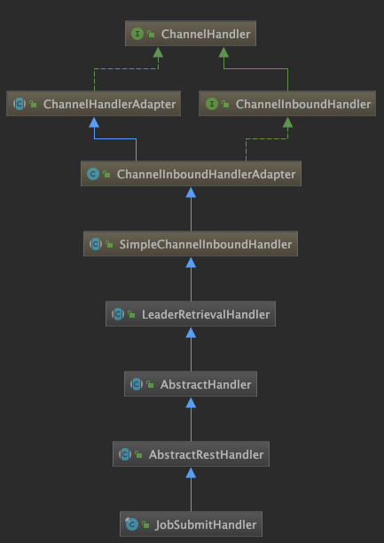
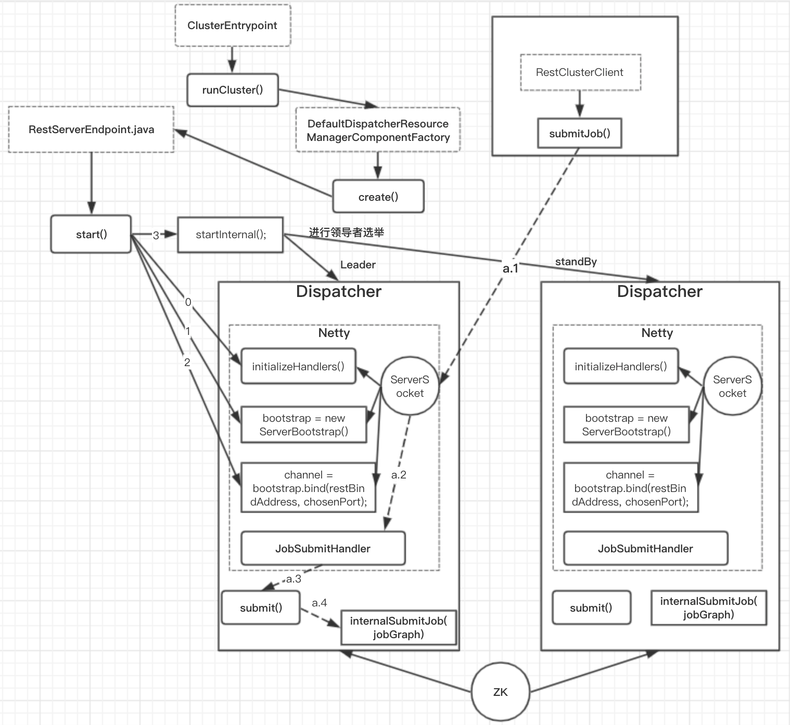

### Flink Netty通信框架-JobManager

Netty通信框架启动
```java
DefaultDispatcherResourceManagerComponentFactory.java
//创建DispatcherResourceManagerComponent对象
@Override
public DispatcherResourceManagerComponent create(){
    webMonitorEndpoint = restEndpointFactory.createRestEndpoint();
    //启动DispatcherRestEndpoint
    log.debug("Starting Dispatcher REST endpoint.");
★    webMonitorEndpoint.start();
}
```
启动DispatcherRestEndpoint
```java
RestServerEndpoint.java
// Starts this REST server endpoint.
public final void start() throws Exception {
    synchronized (lock) {
★        handlers = initializeHandlers(restAddressFuture);
        bootstrap.group(bossGroup, workerGroup)
                .channel(NioServerSocketChannel.class)
                .childHandler(initializer);
        channel = bootstrap.bind(restBindAddress, chosenPort);
    }
}
```
handler的生成
```java
DispatcherRestEndpoint.java
@Override
protected List<Tuple2<RestHandlerSpecification, ChannelInboundHandler>> initializeHandlers(final CompletableFuture<String> localAddressFuture) {
    List<Tuple2<RestHandlerSpecification, ChannelInboundHandler>> handlers = super.initializeHandlers(localAddressFuture);
    final Time timeout = restConfiguration.getTimeout();

★        JobSubmitHandler jobSubmitHandler = new JobSubmitHandler(
        leaderRetriever,
        timeout,
        responseHeaders,
        executor,
        clusterConfiguration);

    if (restConfiguration.isWebSubmitEnabled()) {
        try {
            webSubmissionExtension = WebMonitorUtils.loadWebSubmissionExtension(
                leaderRetriever,
                timeout,
                responseHeaders,
                localAddressFuture,
                uploadDir,
                executor,
                clusterConfiguration);
            // register extension handlers
            handlers.addAll(webSubmissionExtension.getHandlers());
        }
    } else {
        log.info("Web-based job submission is not enabled.");
    }
    handlers.add(Tuple2.of(jobSubmitHandler.getMessageHeaders(), jobSubmitHandler));

    return handlers;
}
```
构造jobSubmitHandler = new JobSubmitHandler()
```java
JobSubmitHandler.java
public JobSubmitHandler(
        GatewayRetriever<? extends DispatcherGateway> leaderRetriever,
        Time timeout,
        Map<String, String> headers,
        Executor executor,
        Configuration configuration) {
★    super(leaderRetriever, timeout, headers, JobSubmitHeaders.getInstance());
    this.executor = executor;
    this.configuration = configuration;
}
```


上图是JobSubmitHandler的类UML图，从图中可以看出JobSubmitHandler继承AbstractRestHandler 继承AbstractHandler 继承 LeaderRetrievalHandler。

最终JobSubmitHandler的构造方法会调用LeaderRetrievalHandler的构造方法，并在Flink Dispatcher Leader(也就是启动的Netty Server)收到网络请求后，使用channelRead0()方法进行处理。继而调用抽象方法：respondAsLeader(channelHandlerContext, routedRequest, gateway); 该抽象方法在AbstractHandler 中实现。
```java
LeaderRetrievalHandler.java
protected LeaderRetrievalHandler(
        @Nonnull GatewayRetriever<? extends T> leaderRetriever,
        @Nonnull Time timeout,
        @Nonnull Map<String, String> responseHeaders) {
    this.leaderRetriever = Preconditions.checkNotNull(leaderRetriever);
    this.timeout = Preconditions.checkNotNull(timeout);
    this.responseHeaders = Preconditions.checkNotNull(responseHeaders);
}
@Override
protected void channelRead0(
    ChannelHandlerContext channelHandlerContext,
    RoutedRequest routedRequest) {
    HttpRequest request = routedRequest.getRequest();
    OptionalConsumer<? extends T> optLeaderConsumer = OptionalConsumer.of(leaderRetriever.getNow());

    optLeaderConsumer.ifPresent(
        gateway -> {
            try {
★                respondAsLeader(channelHandlerContext, routedRequest, gateway);
            } catch (Exception e) {
                logger.error("Error while responding to the http request.", e);
                HandlerUtils.sendErrorResponse(
                    channelHandlerContext,
                    request,
                    new ErrorResponseBody("Error while responding to the http request."),
                    HttpResponseStatus.INTERNAL_SERVER_ERROR,
                    responseHeaders);
            }
        }
    ).ifNotPresent(
        () ->
            HandlerUtils.sendErrorResponse(
                channelHandlerContext,
                request,
                new ErrorResponseBody("Service temporarily unavailable due to an ongoing leader election. Please refresh."),
                HttpResponseStatus.SERVICE_UNAVAILABLE,
                responseHeaders));
}

★ protected abstract void respondAsLeader(ChannelHandlerContext channelHandlerContext, RoutedRequest request, T gateway) throws Exception;
```

respondAsLeader方法的实现：
```java
AbstractHandler.java
@Override
protected void respondAsLeader(ChannelHandlerContext ctx, RoutedRequest routedRequest, T gateway) {
    HttpRequest httpRequest = routedRequest.getRequest();
    if (log.isTraceEnabled()) {
        log.trace("Received request " + httpRequest.uri() + '.');
    }
    FileUploads uploadedFiles = null;
    try {
        inFlightRequestTracker.registerRequest();
        if (!(httpRequest instanceof FullHttpRequest)) {
            // FullHttpRequests.
            log.error("Implementation error: Received a request that wasn't a FullHttpRequest.");
        }
        final ByteBuf msgContent = ((FullHttpRequest) httpRequest).content();
        uploadedFiles = FileUploadHandler.getMultipartFileUploads(ctx);
        if (!untypedResponseMessageHeaders.acceptsFileUploads() && !uploadedFiles.getUploadedFiles().isEmpty()) {
            throw new RestHandlerException("File uploads not allowed.", HttpResponseStatus.BAD_REQUEST);
        }
        R request;
        if (msgContent.capacity() == 0) {
            try {
                request = MAPPER.readValue("{}", untypedResponseMessageHeaders.getRequestClass());
            } catch (JsonParseException | JsonMappingException je) {
                throw new RestHandlerException("Bad request received. Request did not conform to expected format.", HttpResponseStatus.BAD_REQUEST, je);
            }
        } else {
            try {
                InputStream in = new ByteBufInputStream(msgContent);
                request = MAPPER.readValue(in, untypedResponseMessageHeaders.getRequestClass());
            } catch (JsonParseException | JsonMappingException je) {}
        }
        final HandlerRequest<R, M> handlerRequest;
        try {
            handlerRequest = new HandlerRequest<R, M>(
                request,
                untypedResponseMessageHeaders.getUnresolvedMessageParameters(),
                routedRequest.getRouteResult().pathParams(),
                routedRequest.getRouteResult().queryParams(),
                uploadedFiles.getUploadedFiles());
        } catch (HandlerRequestException hre) {
            log.error("Could not create the handler request.", hre);
        }

        log.trace("Starting request processing.");
★        CompletableFuture<Void> requestProcessingFuture = respondToRequest(
            ctx,
            httpRequest,
            handlerRequest,
            gateway);

        final FileUploads finalUploadedFiles = uploadedFiles;
        requestProcessingFuture
            .whenComplete((Void ignored, Throwable throwable) -> {
                if (throwable != null) {
                    handleException(ExceptionUtils.stripCompletionException(throwable), ctx, httpRequest)
                        .whenComplete((Void ignored2, Throwable throwable2) -> finalizeRequestProcessing(finalUploadedFiles));
                } else {
                    finalizeRequestProcessing(finalUploadedFiles);
                }
            });
    }
}
```
上述代码最后执行respondToRequest()，该方法是AbstractHandler.java的抽象方法，该方法在AbstractRestHandler.java中实现
```java
@Override
AbstractRestHandler.java
protected CompletableFuture<Void> respondToRequest(ChannelHandlerContext ctx, HttpRequest httpRequest, HandlerRequest<R, M> handlerRequest, T gateway) {
    CompletableFuture<P> response;

    try {
★        response = handleRequest(handlerRequest, gateway);
    } catch (RestHandlerException e) {
        response = FutureUtils.completedExceptionally(e);
    }

    return response.thenAccept(resp -> HandlerUtils.sendResponse(ctx, httpRequest, resp, messageHeaders.getResponseStatusCode(), responseHeaders));
}
//This method is called for every incoming request and returns a {@link CompletableFuture} containing a the response.
protected abstract CompletableFuture<P> handleRequest(@Nonnull HandlerRequest<R, M> request, @Nonnull T gateway) throws RestHandlerException;
```

在JobSubmitHandler.java中实现了handleRequest()方法
```java
JobSubmitHandler.java
@Override
protected CompletableFuture<JobSubmitResponseBody> handleRequest(@Nonnull HandlerRequest<JobSubmitRequestBody, EmptyMessageParameters> request, @Nonnull DispatcherGateway gateway) throws RestHandlerException {
    final Collection<File> uploadedFiles = request.getUploadedFiles();
    final Map<String, Path> nameToFile = uploadedFiles.stream().collect(Collectors.toMap(
        File::getName,
        Path::fromLocalFile
    ));
    if (uploadedFiles.size() != nameToFile.size()) {
        throw new RestHandlerException(
            String.format("The number of uploaded files was %s than the expected count. Expected: %s Actual %s",
                uploadedFiles.size() < nameToFile.size() ? "lower" : "higher",
                nameToFile.size(),
                uploadedFiles.size()),
            HttpResponseStatus.BAD_REQUEST
        );
    }
    final JobSubmitRequestBody requestBody = request.getRequestBody();
    if (requestBody.jobGraphFileName == null) {
        throw new RestHandlerException(
            String.format("The %s field must not be omitted or be null.",
                JobSubmitRequestBody.FIELD_NAME_JOB_GRAPH),
            HttpResponseStatus.BAD_REQUEST);
    }

    CompletableFuture<JobGraph> jobGraphFuture = loadJobGraph(requestBody, nameToFile);
    Collection<Path> jarFiles = getJarFilesToUpload(requestBody.jarFileNames, nameToFile);
    Collection<Tuple2<String, Path>> artifacts = getArtifactFilesToUpload(requestBody.artifactFileNames, nameToFile);
    CompletableFuture<JobGraph> finalizedJobGraphFuture = uploadJobGraphFiles(gateway, jobGraphFuture, jarFiles, artifacts, configuration);
    //【重点】调用gateWay.submit(jobGraph, timeout);
★★    CompletableFuture<Acknowledge> jobSubmissionFuture = finalizedJobGraphFuture.thenCompose(jobGraph -> gateway.submitJob(jobGraph, timeout));

★    return jobSubmissionFuture.thenCombine(jobGraphFuture,
        (ack, jobGraph) -> new JobSubmitResponseBody("/jobs/" + jobGraph.getJobID()));
}
```
上述代码中最重要的逻辑是：调用gateWay.submit(jobGraph, timeout); 其实就是调用Dispatcher.submit()方法，如下
```java
// 【重点】提交作业
@Override
public CompletableFuture<Acknowledge> submitJob(JobGraph jobGraph, Time timeout) {
    log.info("Received JobGraph submission {} ({}).", jobGraph.getJobID(), jobGraph.getName());
    if (isDuplicateJob(jobGraph.getJobID())) {
        return FutureUtils.completedExceptionally(
            new DuplicateJobSubmissionException(jobGraph.getJobID()));
    } else if (isPartialResourceConfigured(jobGraph)) {
        return FutureUtils.completedExceptionally(
            new JobSubmissionException(jobGraph.getJobID(), "Currently jobs is not supported if parts of the vertices have " +
                    "resources configured. The limitation will be removed in future versions."));
    } else {
★★        return internalSubmitJob(jobGraph);
    }
}
```

#####上述代码的总结：
###### 代码流程
```java
NettyRPC 接收到请求调用的是channelRead0方法，所以在JM端程序的入口：
DefaultDispatcherResourceManagerComponentFactory.java
DefaultDispatcherResourceManagerComponentFactory{}.create()
--> RestServerEndpoint.java.start()
-- -->DispatcherRestEndpoint.java.initializeHandlers()
-- -- -->JobSubmitHandler.java.JobSubmitHandler()
-- -- -- -->LeaderRetrievalHandler.java.LeaderRetrievalHandler()
-- -- -- -- -->LeaderRetrievalHandler.java.channelRead0()
-- -- -- -- -- -->LeaderRetrievalHandler.java.respondAsLeader()
-- -- -- -- -- -->AbstractHandler.java.respondAsLeader()
-- -- -- -- -- -- -->AbstractRestHandler.java.respondToRequest()
-- -- -- -- -- -- -- -->AbstractRestHandler.java.handleRequest()
-- -- -- -- -- -- -- -- -->JobSubmitHandler.java.handleRequest()
-- -- -- -- -- -- -- -- -- -->Dispatcher.java.submitJob()
```
###### 代码流程图


