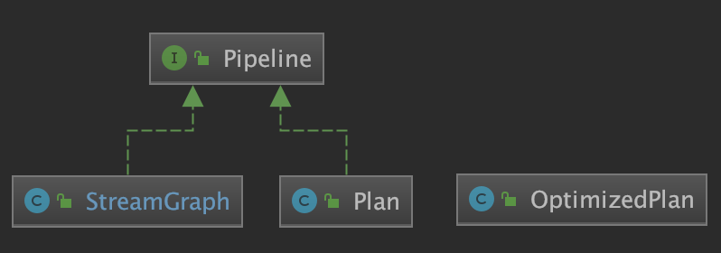
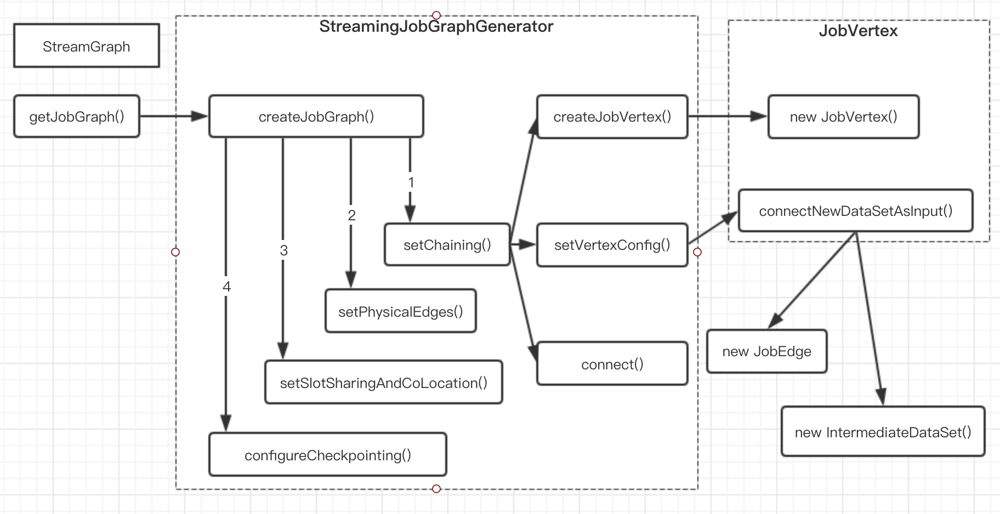
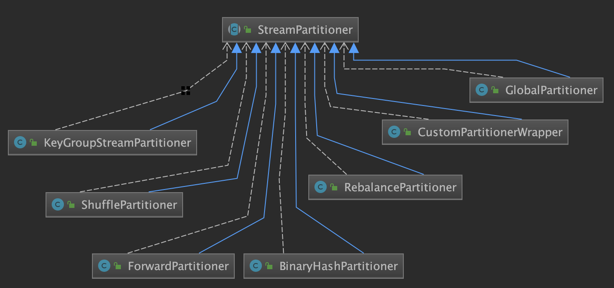
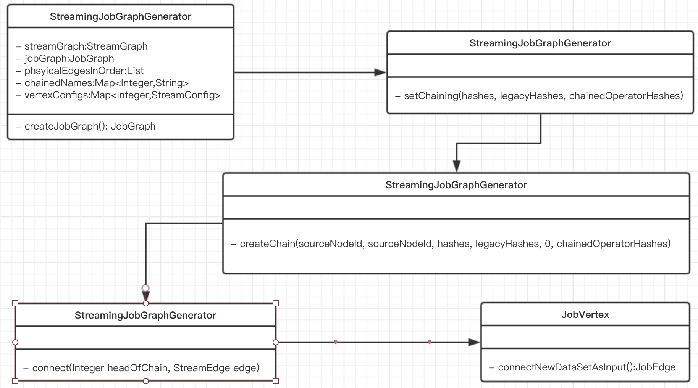
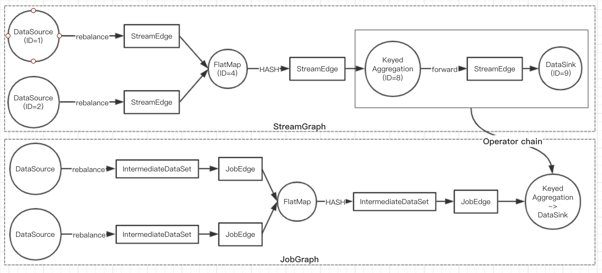
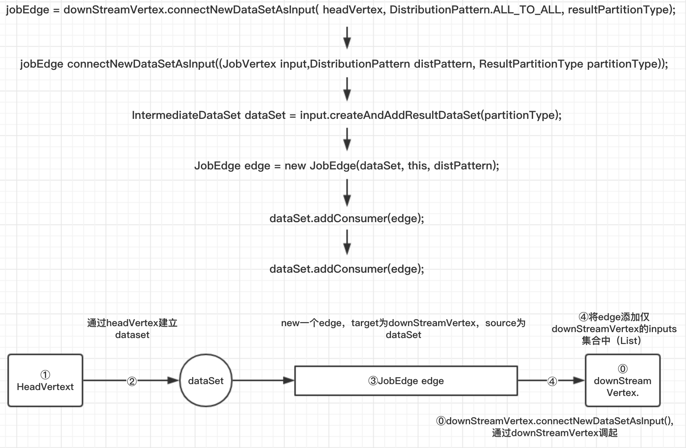
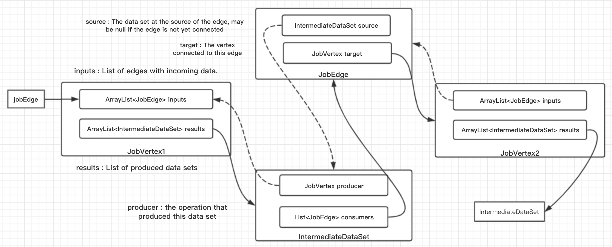
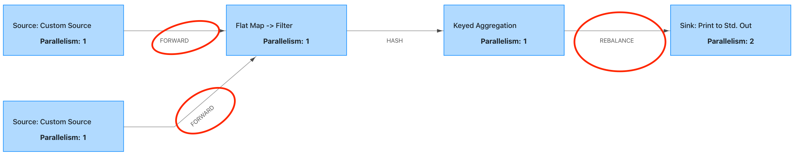
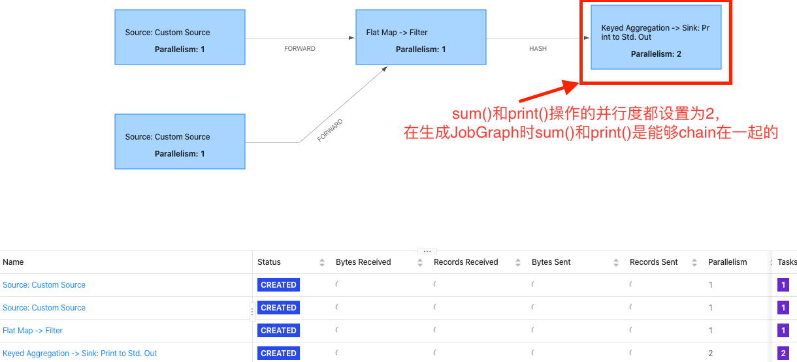
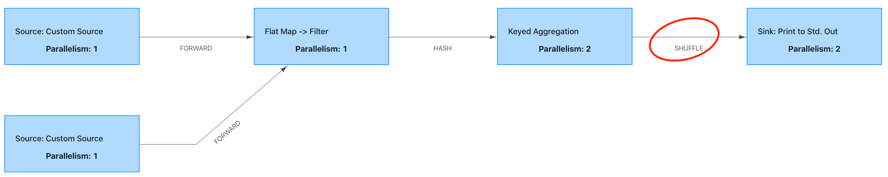

### Flink Streaming作业如何转化为JobGraph
- 简介
- 生成JobGraph的整体流程
- 具体实现流程
    + 基本概念
    + 算子是如何被chain到一起的
    + JobGraph的其他配置

#### 简介
本文主要讲述StreamGraph是如何转化为JobGraph的。我们知道StreamGraph是根据用户作业的处理逻辑生成初始的逻辑计划，它并没有做任何优化，而JobGraph将会在原来的基础上做相应优化（主要是算子的Chain操作，Chain在一起的算子将会在同一个task上运行，会极大的减少shffle的开销)

那么为什么需要有StreamGraph和JobGraph两层Graph，这里最主要的原因为了兼容batch process, Streaming process 最初产生的是StreamGraph，而batch process产生的则是OptimizedPlan，但是它们最后都会转换为JobGraph.

#### 生成JobGraph的整体流程
在Flink中batch和Stream分别对应的是OptimizedPlan和StreamGraph，不管是哪种类型最终都可以转换为JobGraph



OptimizedPlan可以通过JobGraphGenerator的CompileJobGraph()方法转换为JobGraph，而StreamGraph则可以通过StreamingJobGenerator的createJobGraph()方法转换为相应的JobGraph。其中，StreamGraph的整体转换流程如下图：



#### 具体实现流程





***起始点***
```java
env.execute();
```

```java
LocalExecutor.java
public CompletableFuture<JobClient> execute(Pipeline pipeline, Configuration configuration) {
    checkNotNull(pipeline);
    checkNotNull(configuration);
    checkState(configuration.getBoolean(DeploymentOptions.ATTACHED));

①    final JobGraph jobGraph = getJobGraph(pipeline, configuration);

    final MiniCluster miniCluster = startMiniCluster(jobGraph, configuration);
    final MiniClusterClient clusterClient = new MiniClusterClient(configuration, miniCluster);

    CompletableFuture<JobID> jobIdFuture = clusterClient.submitJob(jobGraph);
    jobIdFuture.thenCompose(clusterClient::requestJobResult)
            .thenAccept((jobResult) -> clusterClient.shutDownCluster());
    return jobIdFuture.thenApply(jobID ->
            new ClusterClientJobClientAdapter<>(() -> clusterClient, jobID));
}
```
①处的代码生成JobGraph的关键
```java
LocalExecutor.java
private JobGraph getJobGraph(Pipeline pipeline, Configuration configuration) {
★    return FlinkPipelineTranslationUtil.getJobGraph(pipeline, configuration, 1);
}
```
```java
FlinkPipelineTranslationUtil.java
public static JobGraph getJobGraph(
            Pipeline pipeline,
            Configuration optimizerConfiguration,
            int defaultParallelism) {
    FlinkPipelineTranslator pipelineTranslator = getPipelineTranslator(pipeline);
★    return pipelineTranslator.translateToJobGraph(pipeline,optimizerConfiguration,
        defaultParallelism);
}
```
```java
StreamGraphTranslator.java
    public JobGraph translateToJobGraph(
            Pipeline pipeline,
            Configuration optimizerConfiguration,
            int defaultParallelism) {
    StreamGraph streamGraph = (StreamGraph) pipeline;
★    return streamGraph.getJobGraph(null);
}
```
```java
StreamGraph.java
public JobGraph getJobGraph(@Nullable JobID jobID) {
★    return StreamingJobGraphGenerator.createJobGraph(this, jobID);
}
```
```java
StreamingJobGraphGenerator.java
public JobGraph getJobGraph(@Nullable JobID jobID) {
★    return StreamingJobGraphGenerator.createJobGraph(this, jobID);
}
```
```java
StreamingJobGraphGenerator.java
// 根据StreamGraph生成JobGraph
private JobGraph createJobGraph() {
    preValidate();//validate checkpoint是否开启
    // make sure that all vertices start immediately
    //Streaming 模式下，调度模式是所有节点(vertices)一起启动
    jobGraph.setScheduleMode(streamGraph.getScheduleMode());
    /**
     * 广度优先遍历StreamGraph并且为每个StreamNode生成hash id
     * 保证如果提交的拓扑没有改变，则每次生成的hash都是一样的
     * 为每个StreamNode生成一个确定的hash_id，如果提交的拓扑没有改变，则每次生成的hash id都是一样的
     * 这里只要保证source的顺序是确定的，就可以保证最后生产的hash_id不边
     * 它是利用input节点的hash值以及该节点在map中的位置(实际上是map.size算的)来计算的确定的
     * 实现逻辑见 {@link StreamGraphHasherV2#traverseStreamGraphAndGenerateHashes(StreamGraph)}
     */
    Map<Integer, byte[]> hashes = defaultStreamGraphHasher.traverseStreamGraphAndGenerateHashes(streamGraph);

    // Generate legacy version hashes for backwards compatibility
    //这个设置主要是为了防止 hash 机制变化时出现不兼容的情况
    List<Map<Integer, byte[]>> legacyHashes = new ArrayList<>(legacyStreamGraphHashers.size());
    for (StreamGraphHasher hasher : legacyStreamGraphHashers) {
        legacyHashes.add(hasher.traverseStreamGraphAndGenerateHashes(streamGraph));
    }

    Map<Integer, List<Tuple2<byte[], byte[]>>> chainedOperatorHashes = new HashMap<>();

    //【重要】这个类中最重要的函数，生成JobVertex,JobEdge等，并尽可能地将多个节点chain在一起
★★★    setChaining(hashes, legacyHashes, chainedOperatorHashes);

    //将每个jobVertex的入边集合也序列化到该JobVertex的StreamConfig中
    //出边集合已经在setChaining的时候写入
★★    setPhysicalEdges();

    //根据group name，为每个JobVertex指定所属的SlotSharingGroup
    //针对Iteration的头设置 CoLocationGroup
★    setSlotSharingAndCoLocation();

    setManagedMemoryFraction(
        Collections.unmodifiableMap(jobVertices),
        Collections.unmodifiableMap(vertexConfigs),
        Collections.unmodifiableMap(chainedConfigs),
        id -> streamGraph.getStreamNode(id).getMinResources(),
        id -> streamGraph.getStreamNode(id).getManagedMemoryWeight());
    //配置checkpoint
    configureCheckpointing();

    jobGraph.setSavepointRestoreSettings(streamGraph.getSavepointRestoreSettings());

    //用户事务三方依赖包就是在这里(cacheFile)传给JobGraph
★    JobGraphGenerator.addUserArtifactEntries(streamGraph.getUserArtifacts(), jobGraph);

    // 将StreamGraph的ExecutionConfig序列化到JobGraph的配置
    jobGraph.setExecutionConfig(streamGraph.getExecutionConfig());
    return jobGraph;
}
```
###### **上述代码核心步骤如下：**
1. 先给每个StreamNode生成唯一确定的hash id;
2. setChaning()方法将 可以chain到一起的StreamNode Chain在一起。这里会生成相应的JobVertex、JobEdge、IntermediateDataSet对象，JobGraph的Graph在这一步就已经完全构建出来了；
3. setPhysicalEdge()方法会将JobVertex的入边集合也序列化到该JobVertex的StreamConfig中（出边集合已经在setChaining的时候写入了);
4. setSlotSharingAndCoLocation()方法主要是JobVertex的SlotSharingGroup和ColocationGroup的设置；
5. configureCheckpointing()方法主要是checkpoint相关设置。

##### 基本概念
JobGraph引入了几个概念：

1. **StreamConfig**: 它会记录一个StreamOperator的配置信息，它保存了这个StreamOperator的基本信息，在这里它会将StreamGraph中的StreamNode的详细信息同步到它对应的StreamConfig对象中。在StreamingJobGraphGenerator.java中保存在 private final Map<Integer, Map<Integer, StreamConfig>> chainedConfigs变量中。即保存chain信息，部署时用来构建OperatorChain，startNodeId->(currentNodeId->StreamConfig)
2. **JobVertex**: JobVertex相当于是JobGraph的顶点，跟StreamNode的区别是，JobVertex是Operator Chain之后的顶点，会包含多个StreamNode;
3. **IntermediateDataSet**：它是又一个Operator(可能是source，也可能是某个中间算子)产生的一个中间数据集；
4. **JobEdge**: 它相当于是JobGraph中的边(连接通道)，这个边连接的是一个IntermediateDataSet跟一个要消费的JobVertex。

如果跟前面的StreamGraph做对比，JobGraph这里不但会对算子做chain操作，还多抽象了一个概念————IntermediateDataSet,IntermediateDataSet的抽象主要是为了后面ExecutionGraph的生成。

##### 算子是如何Chain到一起的
接下来介绍下JobGraph过程中最核心的一步：算子如何Chain到一起的，先看下图：



StreamGraph转换为JobGraph的处理过程主要在setChaining()中完成，先看下这个方法实现：

```java
StreamingJobGraphGenerator.java
//从source开始建立node chains
//从Source StreamNode实例开始设置task chain，它将会递归所有的JobVertex实例
private void setChaining(Map<Integer, byte[]> hashes, List<Map<Integer, byte[]>> legacyHashes, Map<Integer, List<Tuple2<byte[], byte[]>>> chainedOperatorHashes) {
    for (Integer sourceNodeId : streamGraph.getSourceIDs()) {
        //处理每个Source StreamNode
        createChain(sourceNodeId, sourceNodeId, hashes, legacyHashes, 0, chainedOperatorHashes);
    }
}
---->
//构建node chains,返回当前节点的物理出边
// startNodeId != currentNodeId 时，说明currentNode是chain中的子节点
private List<StreamEdge> createChain(
        Integer startNodeId,
        Integer currentNodeId,
        Map<Integer, byte[]> hashes,
        List<Map<Integer, byte[]>> legacyHashes,
        int chainIndex,
        Map<Integer, List<Tuple2<byte[], byte[]>>> chainedOperatorHashes) {

    if (!builtVertices.contains(startNodeId)) {
        //过渡用的出边集合，用来生成最终的JobEdge，注意不包括chain内部的边
        List<StreamEdge> transitiveOutEdges = new ArrayList<StreamEdge>();

        //以Edge的粒度，记录上下游算子能chain在一起的Edge
        List<StreamEdge> chainableOutputs = new ArrayList<StreamEdge>();
        List<StreamEdge> nonChainableOutputs = new ArrayList<StreamEdge>();

        //当前要处理的StreamNode
        StreamNode currentNode = streamGraph.getStreamNode(currentNodeId);

        //将当前节点的出边分成chainable和nonChainable两类
        //遍历当前节点（其实是sourceNode）中保存的所有输出边，
        for (StreamEdge outEdge : currentNode.getOutEdges()) {
            if (isChainable(outEdge, streamGraph)) {
                //如果可以则chain在一起
                chainableOutputs.add(outEdge);
            } else {
                nonChainableOutputs.add(outEdge);
            }
        }

        //==>递归调用
        for (StreamEdge chainable : chainableOutputs) {
            transitiveOutEdges.addAll(
                    //如果可以chain在一起的话，这里的chainIndex会加1
                    createChain(startNodeId, chainable.getTargetId(), hashes, legacyHashes, chainIndex + 1, chainedOperatorHashes));
        }

        for (StreamEdge nonChainable : nonChainableOutputs) {
            transitiveOutEdges.add(nonChainable);
            //如果不能chain在一起的话，这里的chainIndex是从0开始算的，后面肯定会走到createVertex的逻辑
            createChain(nonChainable.getTargetId(), nonChainable.getTargetId(), hashes, legacyHashes, 0, chainedOperatorHashes);
        }

        //记录每个startNodeId的hash id（主要在legacyHashes中记录的）
        List<Tuple2<byte[], byte[]>> operatorHashes =
            chainedOperatorHashes.computeIfAbsent(startNodeId, k -> new ArrayList<>());

        byte[] primaryHashBytes = hashes.get(currentNodeId);
        OperatorID currentOperatorId = new OperatorID(primaryHashBytes);

        for (Map<Integer, byte[]> legacyHash : legacyHashes) {
            operatorHashes.add(new Tuple2<>(primaryHashBytes, legacyHash.get(currentNodeId)));
        }
        // 记录chainName，如："Keyed Aggregation -> Sink: Unnamed"
        chainedNames.put(currentNodeId, createChainedName(currentNodeId, chainableOutputs));
        //计算Chain之后node的minResources
        chainedMinResources.put(currentNodeId, createChainedMinResources(currentNodeId, chainableOutputs));
        //计算chain之后node的资源上限
        chainedPreferredResources.put(currentNodeId, createChainedPreferredResources(currentNodeId, chainableOutputs));

        //InputFormat & OutputFormat的处理
        if (currentNode.getInputFormat() != null) {
            getOrCreateFormatContainer(startNodeId).addInputFormat(currentOperatorId, currentNode.getInputFormat());
        }

        if (currentNode.getOutputFormat() != null) {
            getOrCreateFormatContainer(startNodeId).addOutputFormat(currentOperatorId, currentNode.getOutputFormat());
        }

        //如果当前节点是起始节点，则直接创建JobVertex并返回StreamConfig，否则先创建一个空的StreamConfig
        //createJobVertex函数就是根据StreamNode创建对应的JobVertex，并返回空的StreamConfig
        //实际上，如果节点不能chain在一起，那么currentNodeId跟startNodeId肯定是不相等的
        StreamConfig config = currentNodeId.equals(startNodeId)
★                ? createJobVertex(startNodeId, hashes, legacyHashes,chainedOperatorHashes): new StreamConfig(new Configuration());

        //设置JobVertex的StreamConfig，基本上是序列化StreamNode中的配置到StreamConfig中
        //其中包括序列化器，StreamOperator，Checkpoint等相关配置
★        setVertexConfig(currentNodeId, config, chainableOutputs, nonChainableOutputs);

        if (currentNodeId.equals(startNodeId)) {// 如果走到这里，证明这个chain已经完成，递归回去了
            //如果是chain的起始节点
            config.setChainStart();
            config.setChainIndex(0);
            config.setOperatorName(streamGraph.getStreamNode(currentNodeId).getOperatorName());
            //我们也会把物理出边写入配置，部署时会用到
            config.setOutEdgesInOrder(transitiveOutEdges);
            config.setOutEdges(streamGraph.getStreamNode(currentNodeId).getOutEdges());

            //将当前节点（headOfChain）与所有出边相连
            for (StreamEdge edge : transitiveOutEdges) {
                //通过StreamEdge构建出JobEdge，创建IntermediateSet,用来将JobVertex和JobEdge相连
★                connect(startNodeId, edge);
            }

            //将chain中所有的子节点的StreamConfig写入到headOfchain节点的CHAIN_TASK_CONFIG配置中
            config.setTransitiveChainedTaskConfigs(chainedConfigs.get(startNodeId));

        } else {
            //如果是chain中的子节点
            chainedConfigs.computeIfAbsent(startNodeId, k -> new HashMap<Integer, StreamConfig>());

            config.setChainIndex(chainIndex);
            StreamNode node = streamGraph.getStreamNode(currentNodeId);
            config.setOperatorName(node.getOperatorName());
            //将当前接节点的StreamConfig添加到该cahin的config集合中
            chainedConfigs.get(startNodeId).put(currentNodeId, config);
        }

        config.setOperatorID(currentOperatorId);

        if (chainableOutputs.isEmpty()) {
            config.setChainEnd();
        }
        //返回连往chain外部的出边集合
        return transitiveOutEdges;

    } else {
        return new ArrayList<>();
    }
}
```
这段代码处理完成后，整个JobGraph就构建完成了，它首先会遍历这个StreamGraph的Source节点，然后对每个source节点执行createChain()方法。在具体的实现里，主要逻辑如下(注意：下面的解释中会把多个StreamNode Chain在一起的Node叫做ChainNode)：

- 1.createChain()当前要处理的节点是currentNode，先从StreamGraph中拿到这个StreamNode的outEdge(currentNode.getOutEdge())，然后判断这个outEdge连接两个StreamNode是否可以Chain在一起，判断方法是isChainable();
- 2.接着会有一个递归调用：
    + 对于可以Chain在一起StremEdge(这个Edge连接两个StreamNode是可以Chain在一起)，会再次调用 createChain() 方法，并且 createChain() 中的startNodId 还是最开始的startNodeId(这个标识了这个ChainNode的开始NodeId), 而ChainIndex 会增加1.
    + 对于不能Chain在一起的StreamEdge，createChain()中的startNodeId变成了这个StreamEdge的targer StreamNode(相当于如果Chain在一起，ChainNode中startNodeId会赋值为下一个节点的NodeId,然后依次类推)，chainIndex又从0开始计算。
    + 也就是说：createChain() 中的startNodeId 表示了当前嗯可以Chain之后Node的startId,这里会一直调用，知道达到Sink节点。
- 3.然后生成StreamConfig对象时，判断当前的currentNodeId与startNodeId是否相等，如果相等的话，证明当前Node就是这个ChainNode的StartNode（递归结束），这里会调用createJobVertex()方法给这个ChainNode创建一个JobVertext (注意此时ChainNode可能本身就是有StartNode一个节点)，最后会返回一个StreamConfig对象，如果前面的id不想等的话，就会直接返回一个StreamConfig对象（这个对象记录当前StreamNode的一些配置，它会同步StreamGraph中相关的配置）
- 4.最后还会分两种情况判断：
    + 如果id相等，相当于这个ChainNode已经完成，先做一些相关配置（比如：标识当前StreamNode为这个JobVertex的起始Node），最后再通过 Connect() 方法创建JobEdge和IntermediateDataSet对象，把这个Graph连接起来；
    + 如果 id 不相等，那么证明当前 StreamNode 只是这个 ChainNode 的一部分，这里只是同步一下信息，并记录到缓存。

上面就是这个方法的主要实现逻辑，下面会详细把这个方法展开，重点介绍其中的一些方法实现。

##### 如何判断算子是否可以Chain在一起
两个StreamNode是否可以Chain到一起，是通过isChainable()方法来判断，这里判断的粒度是StreamEdge，实际上就是判断StreamEdge连接的两个StreamNode是否Chain在一起。

```java
//只有该方法返回true的时候，两端的StreamNode才能打包在一起
public static boolean isChainable(StreamEdge edge, StreamGraph streamGraph) {
    //StreamEdge: upStreamVertex--------->downStreamVertex
    StreamNode upStreamVertex = streamGraph.getSourceVertex(edge);
    StreamNode downStreamVertex = streamGraph.getTargetVertex(edge);

    //获取输入和输出的Operator Factory
    StreamOperatorFactory<?> headOperator = upStreamVertex.getOperatorFactory();
    StreamOperatorFactory<?> outOperator = downStreamVertex.getOperatorFactory();

    //当下面条件同时满足才能返回true，
    //1.下游的StreamNode的输入StreamEdge的个数是1,如果是多个，是无法chain在一起的
    return downStreamVertex.getInEdges().size() == 1
            && outOperator != null
            && headOperator != null
            //2.上游和下游的StreamNode必须又相同的SlotSharingGroup(可以在Api中指定该变量)
            && upStreamVertex.isSameSlotSharingGroup(downStreamVertex)
            //outOperator允许chain操作
            && outOperator.getChainingStrategy() == ChainingStrategy.ALWAYS
            //headOperator允许跟后面的chain在一起
            && (headOperator.getChainingStrategy() == ChainingStrategy.HEAD ||
                headOperator.getChainingStrategy() == ChainingStrategy.ALWAYS)
            //partitioner是ForwardPartitioner类型
            && (edge.getPartitioner() instanceof ForwardPartitioner)
            && edge.getShuffleMode() != ShuffleMode.BATCH
            //3.上游的StreamNode和下游的StreamNode的并行度必须相同（api可以指定）
            && upStreamVertex.getParallelism() == downStreamVertex.getParallelism()
            && streamGraph.isChainingEnabled();//StreamGraph允许Chain在一起
}
```
具体的策略：

1. ***上下游的并行度一致***
2. ***下游节点的入度为1 （也就是说下游节点没有来自其他节点的输入）***
3. 上下游节点都在同一个 slot group 中（下面会解释 slot group）
4. 下游节点的 chain 策略为 ALWAYS（可以与上下游链接，map、flatmap、filter等默认是ALWAYS）
5. 上游节点的 chain 策略为ALWAYS或HEAD（只能与下游链接，不能与上游链接，Source默认是HEAD）
6. ***两个节点间数据分区方式是 forward（参考理解数据流的分区）***
6. 用户没有禁用 chain

##### 创建JobVertex节点
JobVertex对象的创建是在 createJobVertex()方法中实现的，主要逻辑就是创建JobVertex对象，并把相关的配置信息设置到JobVertex对象中就完了。

##### connect()创建JobEdge和IntermediateDataSet对象
connect()方法在执行的时候，它会遍历transitiveOutEdge中的StreamEdge，也就是这个ChainNode的out StreamEdge（这些 StreamEdge 是不能与前面的 ChainNode Chain 在一起）

```java
//connect(startNodeId, edge);
private void connect(Integer headOfChain, StreamEdge edge) {
    // 记录StreamEdge，这个主要是chain之间的边
    physicalEdgesInOrder.add(edge);

    Integer downStreamvertexID = edge.getTargetId();
    // 这里headVertex指的是headOfChain对应的JobVertex，也是当前node对应的vertex
    JobVertex headVertex = jobVertices.get(headOfChain);
    JobVertex downStreamVertex = jobVertices.get(downStreamvertexID);

    StreamConfig downStreamConfig = new StreamConfig(downStreamVertex.getConfiguration());
    //这个节点的输入数增加1
    downStreamConfig.setNumberOfInputs(downStreamConfig.getNumberOfInputs() + 1);

    StreamPartitioner<?> partitioner = edge.getPartitioner();

    ResultPartitionType resultPartitionType;
    switch (edge.getShuffleMode()) {
        case PIPELINED:
            resultPartitionType = ResultPartitionType.PIPELINED_BOUNDED;
            break;
        case BATCH:
            resultPartitionType = ResultPartitionType.BLOCKING;
            break;
        case UNDEFINED:
            resultPartitionType = streamGraph.isBlockingConnectionsBetweenChains() ?
                    ResultPartitionType.BLOCKING : ResultPartitionType.PIPELINED_BOUNDED;
            break;
        default:
            throw new UnsupportedOperationException("Data exchange mode " +
                edge.getShuffleMode() + " is not supported yet.");
    }

    // 创建JobEdge(它会链接上下游的node)
    JobEdge jobEdge;
    if (partitioner instanceof ForwardPartitioner || partitioner instanceof RescalePartitioner) {
        jobEdge = downStreamVertex.connectNewDataSetAsInput(
            headVertex,
            //上游与下游的消费模式（每个生产任务的sub-task会链接到消费任务的一个sub-task）
            DistributionPattern.POINTWISE,
            resultPartitionType);
    } else {
        jobEdge = downStreamVertex.connectNewDataSetAsInput(
                headVertex,
                // 每个生产任务的sub-taks都会连接到每个消费任务的sub-task
                DistributionPattern.ALL_TO_ALL,
                resultPartitionType);
    }
    // set strategy name so that web interface can show it.
    jobEdge.setShipStrategyName(partitioner.toString());

    if (LOG.isDebugEnabled()) {
        LOG.debug("CONNECTED: {} - {} -> {}", partitioner.getClass().getSimpleName(),
                headOfChain, downStreamvertexID);
    }
}
```

真正创建JobEdge和IntermediateDataSet对象是在JobVertex中的connectNewDataAsInput()方法中，在这里也会把JobVertex、JobEdge、IntermediateDataSet三者连接起来（Jobgraph的graph就是这样构建的）：
```java
//真正创建JobEdge和IntermediateDataSet对象是在JobVertex中的ConnectNewDataAsInput()方法中
//在这里也会把jobvertex、jobEdge、IntermediateDataSet三者连接起来
//Jobgraphde graph就是这样构建的
public JobEdge connectNewDataSetAsInput(
        JobVertex input,
        DistributionPattern distPattern,
        ResultPartitionType partitionType) {
    //连接Vertex的中间数据集
    IntermediateDataSet dataSet = input.createAndAddResultDataSet(partitionType);
    //创建对应的edge
    JobEdge edge = new JobEdge(dataSet, this, distPattern);
    this.inputs.add(edge);
    dataSet.addConsumer(edge);
    return edge;
}
```
connectNewDataSetAsInput()代码的实现过程：



到这里createChain()方法就执行完了，JobGraph总共会涉及到三个对象：jobVertex、JobEdge和IntermediateDataSet,最后生成的JobGraph大概是下面这个样子：



##### 并行度不一致的情况下的测试情况：
```java
//note 模拟两个数据源，它们会生成一行随机单词组（单词之间是空格分隔）
DataStream<String> inputStream = env.addSource();
DataStream<String> inputStream2 = env.addSource();
inpurStream.union(inputStream2)
    .flatMap()
    .shuffle()
    .filter()
    .keyBy()
    .sum()
    .print()
    .setParallelism(2);
```
.sum()的并行度为1,.print()的并行度为2，致使.sum()和.print()的并行度不一致，则不能chain（）在一起，如下图



##### 并行度一致的情况下的测试情况：
在.sum()后增加并行度设置，设置并行度为2，致使.sum()和.print()的并行度一致
```java
//note 模拟两个数据源，它们会生成一行随机单词组（单词之间是空格分隔）
DataStream<String> inputStream = env.addSource();
DataStream<String> inputStream2 = env.addSource();
inpurStream.union(inputStream2)
    .flatMap()
    .shuffle()
    .filter()
    .keyBy()
    .sum()
★    .setParallelism(2)
    .print()
    .setParallelism(2);
```
.sum()和.print()的并行度一致就可以chain()在一起，如下图：



##### 并行度一致partition为Shuffle情况下的测试情况：
```java
//note 模拟两个数据源，它们会生成一行随机单词组（单词之间是空格分隔）
DataStream<String> inputStream = env.addSource();
DataStream<String> inputStream2 = env.addSource();
inpurStream.union(inputStream2)
    .flatMap()
    .shuffle()
    .filter()
    .keyBy()
    .sum()
★    .setParallelism(2)
★    .shuffle()
    .print()
    .setParallelism(2);
```



#### 代码实现
```java
//从source开始建立node chains
//从Source StreamNode实例开始设置task chain，它将会递归所有的JobVertex实例
private void setChaining(Map<Integer, byte[]> hashes, List<Map<Integer, byte[]>> legacyHashes, Map<Integer, List<Tuple2<byte[], byte[]>>> chainedOperatorHashes) {
    for (Integer sourceNodeId : streamGraph.getSourceIDs()) {
        //处理每个Source StreamNode
        createChain(sourceNodeId, sourceNodeId, hashes, legacyHashes, 0, chainedOperatorHashes);
    }
}
```

```java
//构建node chains,返回当前节点的物理出边
// startNodeId != currentNodeId 时，说明currentNode是chain中的子节点
private List<StreamEdge> createChain(
        Integer startNodeId,
        Integer currentNodeId,
        Map<Integer, byte[]> hashes,
        List<Map<Integer, byte[]>> legacyHashes,
        int chainIndex,
        Map<Integer, List<Tuple2<byte[], byte[]>>> chainedOperatorHashes) {

    if (!builtVertices.contains(startNodeId)) {
        //过渡用的出边集合，用来生成最终的JobEdge，注意不包括chain内部的边
        List<StreamEdge> transitiveOutEdges = new ArrayList<StreamEdge>();

        //以Edge的粒度，记录上下游算子能chain在一起的Edge
        List<StreamEdge> chainableOutputs = new ArrayList<StreamEdge>();
        List<StreamEdge> nonChainableOutputs = new ArrayList<StreamEdge>();

        //当前要处理的StreamNode
        StreamNode currentNode = streamGraph.getStreamNode(currentNodeId);

        //将当前节点的出边分成chainable和nonChainable两类
        //遍历当前节点（其实是sourceNode）中保存的所有输出边，
        //在sourceNode其实会保存streamgraph中所有的输出边
        for (StreamEdge outEdge : currentNode.getOutEdges()) {
            if (isChainable(outEdge, streamGraph)) {
                //如果可以则chain在一起
                chainableOutputs.add(outEdge);
            } else {
                nonChainableOutputs.add(outEdge);
            }
        }

        //==>递归调用
        for (StreamEdge chainable : chainableOutputs) {
            transitiveOutEdges.addAll(
                    //如果可以chain在一起的话，这里的chainIndex会加1
                    createChain(startNodeId, chainable.getTargetId(), hashes, legacyHashes, chainIndex + 1, chainedOperatorHashes));
        }

        for (StreamEdge nonChainable : nonChainableOutputs) {
            transitiveOutEdges.add(nonChainable);
            //如果不能chain在一起的话，这里的chainIndex是从0开始算的，后面肯定会走到createVertex的逻辑
            createChain(nonChainable.getTargetId(), nonChainable.getTargetId(), hashes, legacyHashes, 0, chainedOperatorHashes);
        }

        //记录每个startNodeId的hash id（主要在legacyHashes中记录的）
        List<Tuple2<byte[], byte[]>> operatorHashes =
            chainedOperatorHashes.computeIfAbsent(startNodeId, k -> new ArrayList<>());

        byte[] primaryHashBytes = hashes.get(currentNodeId);
        OperatorID currentOperatorId = new OperatorID(primaryHashBytes);

        for (Map<Integer, byte[]> legacyHash : legacyHashes) {
            operatorHashes.add(new Tuple2<>(primaryHashBytes, legacyHash.get(currentNodeId)));
        }
        // 记录chainName，如："Keyed Aggregation -> Sink: Unnamed"
        chainedNames.put(currentNodeId, createChainedName(currentNodeId, chainableOutputs));
        //计算Chain之后node的minResources
        chainedMinResources.put(currentNodeId, createChainedMinResources(currentNodeId, chainableOutputs));
        //计算chain之后node的资源上限
        chainedPreferredResources.put(currentNodeId, createChainedPreferredResources(currentNodeId, chainableOutputs));

        //InputFormat & OutputFormat的处理
        if (currentNode.getInputFormat() != null) {
            getOrCreateFormatContainer(startNodeId).addInputFormat(currentOperatorId, currentNode.getInputFormat());
        }

        if (currentNode.getOutputFormat() != null) {
            getOrCreateFormatContainer(startNodeId).addOutputFormat(currentOperatorId, currentNode.getOutputFormat());
        }

        //如果当前节点是起始节点，则直接创建JobVertex并返回StreamConfig，否则先创建一个空的StreamConfig
        //createJobVertex函数就是根据StreamNode创建对应的JobVertex，并返回空的StreamConfig
        //实际上，如果节点不能chain在一起，那么currentNodeId跟startNodeId肯定是不相等的
        StreamConfig config = currentNodeId.equals(startNodeId)
                ? createJobVertex(startNodeId, hashes, legacyHashes, chainedOperatorHashes)
                : new StreamConfig(new Configuration());

        //设置JobVertex的StreamConfig，基本上是序列化StreamNode中的配置到StreamConfig中
        //其中包括序列化器，StreamOperator，Checkpoint等相关配置
        setVertexConfig(currentNodeId, config, chainableOutputs, nonChainableOutputs);

        if (currentNodeId.equals(startNodeId)) {// 如果走到这里，证明这个chain已经完成，递归回去了
            //如果是chain的起始节点
            config.setChainStart();
            config.setChainIndex(0);
            config.setOperatorName(streamGraph.getStreamNode(currentNodeId).getOperatorName());
            //我们也会把物理出边写入配置，部署时会用到
            config.setOutEdgesInOrder(transitiveOutEdges);
            config.setOutEdges(streamGraph.getStreamNode(currentNodeId).getOutEdges());

            //将当前节点（headOfChain）与所有出边相连
            for (StreamEdge edge : transitiveOutEdges) {
                //通过StreamEdge构建出JobEdge，创建IntermediateSet,用来将JobVertex和JobEdge相连
                connect(startNodeId, edge);
            }

            //将chain中所有的子节点的StreamConfig写入到headOfchain节点的CHAIN_TASK_CONFIG配置中
            config.setTransitiveChainedTaskConfigs(chainedConfigs.get(startNodeId));

        } else {
            //如果是chain中的子节点
            chainedConfigs.computeIfAbsent(startNodeId, k -> new HashMap<Integer, StreamConfig>());

            config.setChainIndex(chainIndex);
            StreamNode node = streamGraph.getStreamNode(currentNodeId);
            config.setOperatorName(node.getOperatorName());
            //将当前接节点的StreamConfig添加到该cahin的config集合中
            chainedConfigs.get(startNodeId).put(currentNodeId, config);
        }

        config.setOperatorID(currentOperatorId);

        if (chainableOutputs.isEmpty()) {
            config.setChainEnd();
        }
        //返回连往chain外部的出边集合
        return transitiveOutEdges;

    } else {
        return new ArrayList<>();
    }
}
```


