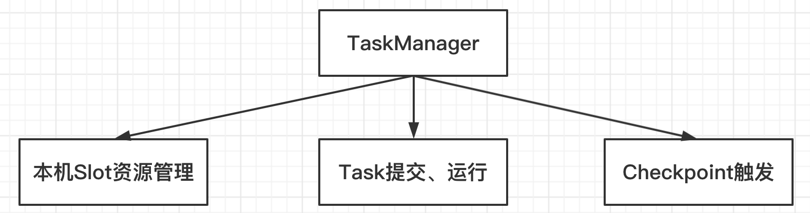
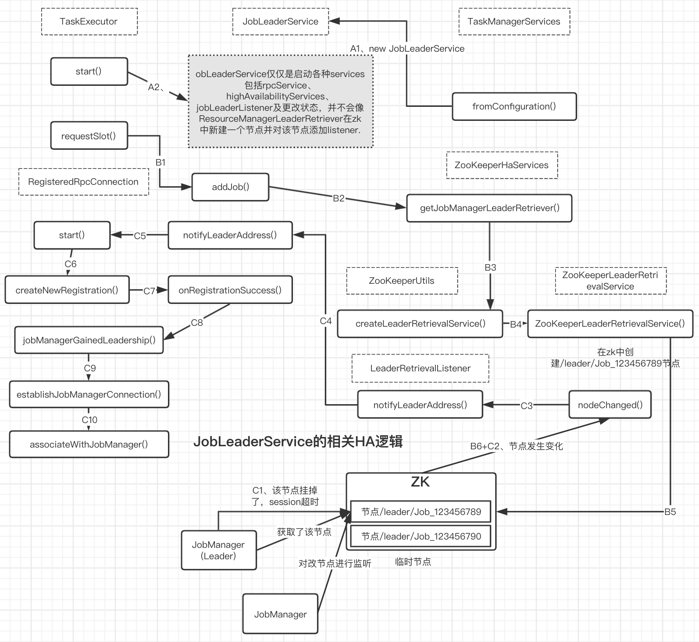
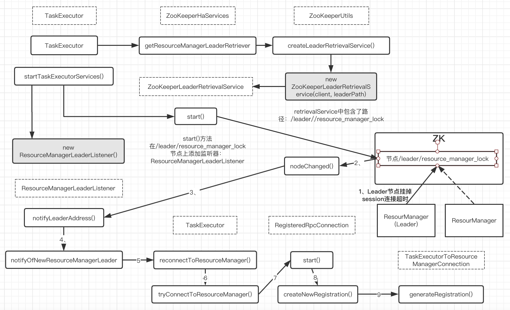
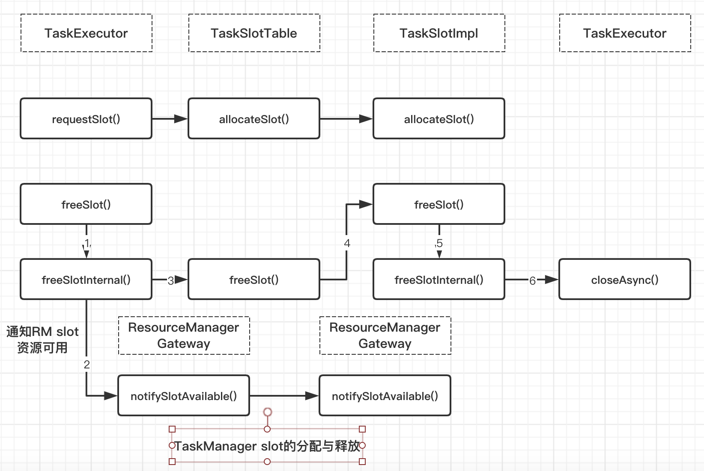

### Flink TaskManager详解(一)
- 0、简介
- 1、TaskManager启动流程
    + 1.1、TaskManager相关服务的初始化
    + 1.2、TaskExecutor的启动
        * 1.2.1、启动心跳服务
        * 1.2.2、向RM注册TM
        * 1.2.3、启动TaskSlotTable服务
        * 1.2.4、启动JobLeaderService服务
- 2、TaskManager提供了哪些能力/功能？
- 3、TaskManager怎么发现RM Leader（在使用ZK做HA的情况下）？
- 4、TM Slot资源是如何管理的？
    + 4.1、Slot的申请
    + 4.2、Slot的释放
- 5、总结

这篇文章会讲述Flink中的TaskManager的一些内容，TaskManager是Flink的worker节点，它flink中本机slot资源的管理以及具体task的执行。TaskManager上基本资源单位是slot，一个作业的task最终会部署在一个TM的slot上运行，TM会负责维护本地的slot资源列表，并来与Flink Master和JobManager通信。本篇将采用先提出问题，然后再根据源码实现去解答这些问题的形式叙述。

##### 对于TaskManager的内容，这里将会聚焦下面几个问题上，下面的文章将逐个分析这些问题：
1. TaskManager 启动流程？
2. TaskManager提供了哪些能力/功能？
3. TaskManager怎么发现RM Leader(在使用ZK做HA的情况下)？
4. TM如何维护JobManager的关系，如果JobManager挂掉，TM会如何处理？
5. TM Slot资源是如何管理的？
6. TM如何处理提交过来的Task？（另外再讲）
7. TM如何处理Task之间的Shuffle的需求？（另外再讲）

### 1、TaskManager启动流程
与JobManager类似，TaskManager的启动类是TaskManagerRunner，大概的流程如下图所示：


TaskManager启动的入口的方式是runTaskManager(),它会首先初始化一些TaskManager,比如：初始化RpcService、初始化HighAvailityServices等等，这写都是为TaskManager服务的启动做准备工作。其实TaskManager初始化主要分为两大块：

1. TaskManager相关service的初始化：主要是TaskManager相关的服务的初始化，比如内存管理器、IO管理器、TaskSlotTable（TM维护task与Slot的对象）等，这里包括TaskExecutor的初始化，主要这里对于一些需要启动的服务在这一步并没有启动
2. TaskExecutor的启动 ：它会启动TM上的相关服务，Task的提交和运行也是在TaskExecutor中完成，上一步TM相关的服务初始化之后也是再TaskExecutor中使用的。

TM的服务真正Run起来之后，核心流程还是在TaskExecutor中。

#### 1.1、TaskManager相关服务的初始
```java
TaskerManagerRunner.java
//0. TaskManager入口
public static void main(String[] args) throws Exception {
    // startup checks and logging
    EnvironmentInformation.logEnvironmentInfo(LOG, "TaskManager", args);
    SignalHandler.register(LOG);
    JvmShutdownSafeguard.installAsShutdownHook(LOG);
    long maxOpenFileHandles = EnvironmentInformation.getOpenFileHandlesLimit();
    if (maxOpenFileHandles != -1L) {
        LOG.info("Maximum number of open file descriptors is {}.", maxOpenFileHandles);
    } else {
        LOG.info("Cannot determine the maximum number of open file descriptors");
    }
    // 入口
★    runTaskManagerSecurely(args, ResourceID.generate());
}
```
```java
TaskerManagerRunner.java
// main()方法->入口
public static void runTaskManagerSecurely(String[] args, ResourceID resourceID) {
    final Configuration configuration = loadConfiguration(args);

    FileSystem.initialize(configuration, PluginUtils.createPluginManagerFromRootFolder(configuration));

    SecurityUtils.install(new SecurityConfiguration(configuration));

    SecurityUtils.getInstalledContext().runSecured(() -> {
        //0. 入口
★        runTaskManager(configuration, resourceID);
        return null;
    });
}
```
```java
// 1. 入口方法
//note: 启动TaskManagerRunner TaskManager启动的入口方法是runTaskManager()
public static void runTaskManager(Configuration configuration, ResourceID resourceId) throws Exception {
    //它首先会初始化一些TaskManager的相关服务，比如：初始化RpcService、初始化HighAvailabilityServices等等
    //这些都是为TaskManager服务的启动做准备工作。
    //2. 创建TaskManagerRunner对象-> 在初始化TaskManagerRunner的时候启动TaskManager服务
★① final TaskManagerRunner taskManagerRunner = new TaskManagerRunner(configuration, resourceId);
    //启动TaskManagerRunner
★② taskManagerRunner.start();
}
```
我们先看①处的代码
```java
TaskManagerRunner.java
//note: 初始化 TaskManagerRunner
public TaskManagerRunner(Configuration configuration, ResourceID resourceId){
    this.configuration = checkNotNull(configuration);
    this.resourceId = checkNotNull(resourceId);
    //note: akka 超时设置
★    timeout = AkkaUtils.getTimeoutAsTime(configuration);

★    this.executor = java.util.concurrent.Executors.newScheduledThreadPool(
        Hardware.getNumberCPUCores(),
        new ExecutorThreadFactory("taskmanager-future"));
    //note: HA 的配置及服务初始化
★    highAvailabilityServices = HighAvailabilityServicesUtils.createHighAvailabilityServices(
        configuration,
        executor,
        HighAvailabilityServicesUtils.AddressResolution.TRY_ADDRESS_RESOLUTION);
    //note: 创建Rpc Service
★    rpcService = createRpcService(configuration, highAvailabilityServices);
    //note: 初始化心跳服务
★    HeartbeatServices heartbeatServices = HeartbeatServices.fromConfiguration(configuration);
    //note: metrics 服务
★    metricRegistry = new MetricRegistryImpl(
        MetricRegistryConfiguration.fromConfiguration(configuration),
        ReporterSetup.fromConfiguration(configuration));
    //note: 启动相应的metrics服务
★    final RpcService metricQueryServiceRpcService = MetricUtils.startMetricsRpcService(configuration, rpcService.getAddress());
    metricRegistry.startQueryService(metricQueryServiceRpcService, resourceId);

    //note: 初始化blob服务
★    blobCacheService = new BlobCacheService(
        configuration, highAvailabilityServices.createBlobStore(), null
    );
    //3. 启动TaskManager服务-》4.初始化相关的服务
    //note: 启动TaskManager服务及创建TaskExecutor对象
★③  taskManager = startTaskManager(
        this.configuration, this.resourceId, rpcService,
        highAvailabilityServices, heartbeatServices,
        metricRegistry, blobCacheService, false, this);

    this.terminationFuture = new CompletableFuture<>();
    this.shutdown = false;
    //note: 周期性地输出内存相关的日志信息，直到terminationFuture complete
★    MemoryLogger.startIfConfigured(LOG, configuration, terminationFuture);
}
```
接下来我们看下★③处的代码，显然这里和上面的都代码都是初始化一些Services，但是上面的主要是初始化一些Flink中基本service，比如HAservice、HeartbeatService、blobService、RpcService等等，而真正和TM相关的service都封装在taskManager中也就是★③处的代码实现。
```java
TaskManagerRunner.java
//note: TaskManager == TaskExecutor
//note: 创建并初始化 TaskExecutor对象, 注意这里是static方法
public static TaskExecutor startTaskManager(
        Configuration configuration, ResourceID resourceID,
        RpcService rpcService,
        HighAvailabilityServices highAvailabilityServices,
        HeartbeatServices heartbeatServices, MetricRegistry metricRegistry,
        BlobCacheService blobCacheService, boolean localCommunicationOnly,
        FatalErrorHandler fatalErrorHandler) throws Exception {
    LOG.info("Starting TaskManager with ResourceID: {}", resourceID);
    InetAddress remoteAddress = InetAddress.getByName(rpcService.getAddress());
    //Specification of resources to use in running
    //note: 比如执行yarnCpuCores、taskHeapSize、taskOffHeapSzie、netWorkMemSize
★    final TaskExecutorResourceSpec taskExecutorResourceSpec = TaskExecutorResourceUtils.resourceSpecFromConfig(configuration);

    //note: TM服务相关的配置都维护在这个对象中，这里会把使用的相关参数解析并维护起来
★★  TaskManagerServicesConfiguration taskManagerServicesConfiguration =
        TaskManagerServicesConfiguration.fromConfiguration(configuration,
            resourceID, remoteAddress, localCommunicationOnly,
            taskExecutorResourceSpec);
    //note: 初始化TM的TaskManagerMetricGroup，并相应地初始化TM的基本状态（内存、CPU等）监控
 ★   Tuple2<TaskManagerMetricGroup, MetricGroup> taskManagerMetricGroup = MetricUtils.instantiateTaskManagerMetricGroup(
        metricRegistry,
        TaskManagerLocation.getHostName(remoteAddress),
        resourceID, taskManagerServicesConfiguration.getSystemResourceMetricsProbingInterval());
    //4.创建一个TaskManagerServices，初始化相关服务
    //note: 初始化TaskManagerServices（TM的相关服务初始化都在这里）
★★  TaskManagerServices taskManagerServices = TaskManagerServices.fromConfiguration(taskManagerServicesConfiguration,
        taskManagerMetricGroup.f1,
        rpcService.getExecutor()); // TODO replace this later with some dedicated executor for io.
    //note: TaskManager相关配置，主要用于TaskExecutor的初始化
★   TaskManagerConfiguration taskManagerConfiguration =
        TaskManagerConfiguration.fromConfiguration(configuration, taskExecutorResourceSpec);

    String metricQueryServiceAddress = metricRegistry.getMetricQueryServiceGatewayRpcAddress();

    //TaskExecutor的初始化
    //note: 最后创建TaskExecutor对象
★   return new TaskExecutor( rpcService,
        taskManagerConfiguration, highAvailabilityServices,
        taskManagerServices, heartbeatServices,
        taskManagerMetricGroup.f0, metricQueryServiceAddress,
        blobCacheService, fatalErrorHandler,
★        new TaskExecutorPartitionTrackerImpl(taskManagerServices.getShuffleEnvironment()),
        createBackPressureSampleService(configuration, rpcService.getScheduledExecutor()));
}
```
这里，来着重看下 TaskManagerServices.fromConfiguration()这个方法，在这个方法初始化了很多TM服务，从下面的实现中可以看出

```java
TaskManagerServices.java
/**
 * Creates and returns the task manager services.
 */
// 创建TaskManagerServices
public static TaskManagerServices fromConfiguration(
        TaskManagerServicesConfiguration taskManagerServicesConfiguration,
        MetricGroup taskManagerMetricGroup,
        Executor taskIOExecutor) throws Exception {
    // pre-start checks
    checkTempDirs(taskManagerServicesConfiguration.getTmpDirPaths());
    //note: 1.创建taskEventDispatcher
★1  final TaskEventDispatcher taskEventDispatcher = new TaskEventDispatcher();

    //note: 2.初始化I/O管理器
    // start the I/O manager, it will create some temp directories.
★   final IOManager ioManager = new IOManagerAsync(taskManagerServicesConfiguration.getTmpDirPaths());
    //note: 3.创建ShuttleEnvironment对象（默认是NettyShuffleEnvironment）
★   final ShuffleEnvironment<?, ?> shuffleEnvironment = createShuffleEnvironment(
        taskManagerServicesConfiguration,
        taskEventDispatcher,
        taskManagerMetricGroup);
    final int dataPort = shuffleEnvironment.start();

    //note: 4.创建KvStateService实例并启动
★   final KvStateService kvStateService = KvStateService.fromConfiguration(taskManagerServicesConfiguration);
    kvStateService.start();

    //note: 5.初始化 taskManagerLocation,记录connection信息
★   final TaskManagerLocation taskManagerLocation = new TaskManagerLocation(
        taskManagerServicesConfiguration.getResourceID(),
        taskManagerServicesConfiguration.getTaskManagerAddress(),
        dataPort);
    //note: 6.初始化BroadcastVariableManager对象
★   final BroadcastVariableManager broadcastVariableManager = new BroadcastVariableManager();

    // TaskSlotTable(TM维护task与slot的对象)
    //note: 7.这里维护slot的相关列表
★  final TaskSlotTable<Task> taskSlotTable = createTaskSlotTable(
        //note: 当前TM拥有的slot及每个slot的资源信息
        //note: 当前 TM 拥有的 slot 及每个 slot 的资源信息
        //note: TM 的 slot 数由 taskmanager.numberOfTaskSlots 决定，默认是 1
        taskManagerServicesConfiguration.getNumberOfSlots(),
        taskManagerServicesConfiguration.getTaskExecutorResourceSpec(),
        //note: 注册一个超时（AKKA超时设置）服务（在TaskSlotTable用于监控slot分配是否超时）
        //note: 超时参数由akka.ask.timeout控制，默认是10s
        taskManagerServicesConfiguration.getTimerServiceShutdownTimeout(),
        taskManagerServicesConfiguration.getPageSize());

    //note: 8.维护jobId与JobManager connection之间的关系
★   final JobManagerTable jobManagerTable = new JobManagerTable();
    //note: 9.监控注册的Job的JobManager leader信息
★   final JobLeaderService jobLeaderService = new JobLeaderService(taskManagerLocation, taskManagerServicesConfiguration.getRetryingRegistrationConfiguration());

    final String[] stateRootDirectoryStrings = taskManagerServicesConfiguration.getLocalRecoveryStateRootDirectories();

    final File[] stateRootDirectoryFiles = new File[stateRootDirectoryStrings.length];

    for (int i = 0; i < stateRootDirectoryStrings.length; ++i) {
        stateRootDirectoryFiles[i] = new File(stateRootDirectoryStrings[i], LOCAL_STATE_SUB_DIRECTORY_ROOT);
    }
    //note: 10.创建 TaskExecutorLocalStateStoresManager对象：维护状态信息
★   final TaskExecutorLocalStateStoresManager taskStateManager = new TaskExecutorLocalStateStoresManager(
        taskManagerServicesConfiguration.isLocalRecoveryEnabled(),
        stateRootDirectoryFiles,
        taskIOExecutor);
    //note: 11.将上面初始化的这些服务，都封装到一个 TaskManagerServices对象中
★   return new TaskManagerServices(
        taskManagerLocation,
        taskManagerServicesConfiguration.getManagedMemorySize().getBytes(),
        ioManager,
        shuffleEnvironment,
        kvStateService,
        broadcastVariableManager,
        taskSlotTable,
        jobManagerTable,
        jobLeaderService,
        taskStateManager,
        taskEventDispatcher);
}
```
看到这里，是不是有点懵圈了，是不是感觉TaskManager实现还挺复杂的，但TaskManager要做的功能相比，上面的实现还不够，真正在TaskManager处理复杂繁琐工作的组件是TaskExecutor,这个才是TaskManager的核心

#### 1.2、TaskExecutor的启动

我们再看②处的代码
```java
TaskManagerRunner.java
public void start() throws Exception {
★    taskManager.start();
}
```
```java
RpcEndpoint.java
/**
 * Triggers start of the rpc endpoint. This tells the underlying rpc server that the rpc endpoint is ready to process remote procedure calls.
 */
public final void start() {
★    rpcServer.start();
}
```

```java
RpcEndpoint.java
/**
 * Internal method which is called by the RpcService implementation to start the RpcEndpoint.
 */
public final void internalCallOnStart() throws Exception {
    validateRunsInMainThread();
    isRunning = true;
★    onStart();
}
```
回顾下文章最开始的流程图，TaskManagerRunner调用run()方法之后，真正要启动的是TaskExecutor服务，其onStart()具体实现如下：
```java
//note: 启动服务
@Override
public void onStart() throws Exception {
    //note: 启动TM的相关服务
    startTaskExecutorServices();
    //note: 注册超时检测，如果超时还未注册完成，就抛出错误，启动失败
    startRegistrationTimeout();
}
```
由于private final TaskExecutor taskManager，即一个taskManager核心还是taskExecutor,从TaskManagerRunner.java# taskManager.start() ---> TaskExecutor.java

这里主要分为两个部分：

1. startTaskExecutorServices(): 启动TaskManager相关的服务，结合流程图主要是三大块：
    - 向Flink Master的ResourceManager注册TaskManager；
    - 启动TaskSlotTable服务（从名字也可以看出，它主要是维护slot、task相关的信息）
    - 启动JobLeaderService服务，主要是根据监控到的各个作业JobManager leader的变化去做相应的处理；
2. startRegistrationTimeout(): 启动注册（注册到RM）超时的检测，默认是5 min，如果超过这个时间还没注册完成，就会抛出异常退出进程，启动失败。

TaskExecutor启动的核心实现是在startTaskExecutorServices()中，接下来重点看下TaskExecutor#startTaskExecutorServices()
```java
//note: 启动TM的相关服务
private void startTaskExecutorServices() throws Exception {
    //startHeartbeatServices() 这部分的逻辑被放到了JobMaster当中startHeartbeatServices()
    // start by connecting to the ResourceManager
    //note：与集群的ResourceManager建立连接(并创建一个listener)
★    resourceManagerLeaderRetriever.start(new ResourceManagerLeaderListener());

    // tell the task slot table who's responsible for the task slot actions
    //note: taskSlotTable启动
★    taskSlotTable.start(new SlotActionsImpl(), getMainThreadExecutor());

    // start the job leader service
    //note: 启动job leader服务
    //note: 通过JobLeaderListenerImpl监控Job的JobManager leader的变化，如果leader被选举出来之后
    //这里将会与JobManager建立通信连接
★    jobLeaderService.start(getAddress(), getRpcService(), haServices, new JobLeaderListenerImpl());

★    fileCache = new FileCache(taskManagerConfiguration.getTmpDirectories(), blobCacheService.getPermanentBlobService());
}
```
接下来上述代码详细的实现：
##### 1).启动心跳服务
##### 2).向RM注册TM
TaskManager向ResourceManager注册是通过ResourceManagerLeaderListener来完成的，它会监控ResourceManager的变化，如果有新的leader被选举出来，将会调用notifyLeaderAddress()方法去触发与ResourceManager的重连，其实现如下：
```java
TaskExecutor.java
/**
 * The listener for leader changes of the resource manager.
 * note: 监控ResourceManager leader变化的listener
 * note: TaskManger向ResourceManager注册是通过ResourceManagerLeaderListener来完成的，它会监控
 * ResourceManager的leader变化，如果有新的leader被选举出来，就会调用notifyLeaderAddress()方法去
 * 触发与ResourceManager的重连，其实现如下：
 */
private final class ResourceManagerLeaderListener implements LeaderRetrievalListener {
    //note: 如果leader被选举处理(包括挂掉之后重新选举)，将会调用这个方法通知TM
    @Override
    public void notifyLeaderAddress(final String leaderAddress, final UUID leaderSessionID) {
        runAsync(
★★            () -> notifyOfNewResourceManagerLeader(
                leaderAddress,
                ResourceManagerId.fromUuidOrNull(leaderSessionID)));
    }

    @Override
    public void handleError(Exception exception) {
        onFatalError(exception);
    }
}

//note：如果RM的new leader选举出来了，这里会新创建一个ResourceManagerAddress对象，并重新建立连接
private void notifyOfNewResourceManagerLeader(String newLeaderAddress, ResourceManagerId newResourceManagerId) {
    resourceManagerAddress = createResourceManagerAddress(newLeaderAddress, newResourceManagerId);
★    reconnectToResourceManager(new FlinkException(String.format("ResourceManager leader changed to new address %s", resourceManagerAddress)));
}


//note: 重新与ResourceManager连接（可能是RM leader切换）
private void reconnectToResourceManager(Exception cause) {
    closeResourceManagerConnection(cause);
    //note: 注册超时检测，如果timeout还没有注册成功，这里就会failed
    startRegistrationTimeout();
    //note: 与RM重新建立连接
★    tryConnectToResourceManager();
}
//note: 建立与 ResourceManager 的连接
private void tryConnectToResourceManager() {
    if (resourceManagerAddress != null) {
        connectToResourceManager();
    }
}
//note: 与ResourceManager建立连接
private void connectToResourceManager() {
    log.info("Connecting to ResourceManager {}.", resourceManagerAddress);
    final TaskExecutorRegistration taskExecutorRegistration = new TaskExecutorRegistration(getAddress(), getResourceID(),
        taskManagerLocation.dataPort(), hardwareDescription,
        taskManagerConfiguration.getDefaultSlotResourceProfile(),
        taskManagerConfiguration.getTotalResourceProfile()
    );
    //note: 在上面的最后一步，创建了TaskExecutorToResourceManagerConnection对象，它启动以后
    //，会向ResourceManager注册到TM，具体的方法实现如下：
    //note: 与RM建立连接
★   resourceManagerConnection =
        new TaskExecutorToResourceManagerConnection(
            log, getRpcService(),
            taskManagerConfiguration.getRetryingRegistrationConfiguration(),
            resourceManagerAddress.getAddress(),
            resourceManagerAddress.getResourceManagerId(),
            getMainThreadExecutor(),
            new ResourceManagerRegistrationListener(),
            taskExecutorRegistration);
★   resourceManagerConnection.start();
    //ResourceManager 在收到这个请求，会做相应的处理，主要要做的事情就是：先从缓存里移除旧的TM注册信息（如果之前存在的话），然后再更新缓存，并增加心跳监控，只有这些工作完成之后，TM的注册才会被认为是成功的。
}
```
上述的代码最终会调用rpcService.connect(targetAddress)与ResourceManager建立连接。

具体逻辑
```java
//RegisteredRpcConnection.java
public void start() {
    checkState(!closed, "The RPC connection is already closed");
    checkState(!isConnected() && pendingRegistration == null, "The RPC connection is already started");

★   final RetryingRegistration<F, G, S> newRegistration = createNewRegistration();

    if (REGISTRATION_UPDATER.compareAndSet(this, null, newRegistration)) {
        newRegistration.startRegistration();
    } else {
        // concurrent start operation
        newRegistration.cancel();
    }
}
```

```java
//RegisteredRpcConnection.java
private RetryingRegistration<F, G, S> createNewRegistration() {
//重点在generateRegistration()
★   RetryingRegistration<F, G, S> newRegistration = checkNotNull(generateRegistration());

    CompletableFuture<Tuple2<G, S>> future = newRegistration.getFuture();

    return newRegistration;
}
```
```java
TaskExecutorToResourceManagerConnection.java
@Override
protected RetryingRegistration<ResourceManagerId, ResourceManagerGateway, TaskExecutorRegistrationSuccess> generateRegistration() {
★    return new TaskExecutorToResourceManagerConnection.ResourceManagerRegistration(
        log,
        rpcService,
        getTargetAddress(),
        getTargetLeaderId(),
        retryingRegistrationConfiguration,
        taskExecutorRegistration);
}

//在前面创建了TaskExecutorToResourceManangerConnection对象，它启动后，会向ResourManager注册TM，具体的方法实现如下：
@Override
protected CompletableFuture<RegistrationResponse> invokeRegistration(
        ResourceManagerGateway resourceManager, ResourceManagerId fencingToken, long timeoutMillis) throws Exception {

    Time timeout = Time.milliseconds(timeoutMillis);
    return resourceManager.registerTaskExecutor(
        taskExecutorRegistration,
        timeout);
}
```
ResourceManager 在收到这个请求，会做相应的处理，主要要做的事情就是：先从缓存里移除旧的 TM 注册信息（如果之前存在的话），然后再更新缓存，并增加心跳监控，只有这些工作完成之后，TM 的注册才会被认为是成功的。

##### 3).启动TaskSlotTable服务
TaskSlotTable从名字也可以看出，它主要是为TaskSlot服务的，它主要的功能有以下三点：

1. 维护这个TM上所有TaskSlot与Task及Job的关系
2. 维护这个TM上所有TaskSlot的状态；
3. TaskSlot在进行allocate/free操作，通过TimeService做超时检测
先看看TaskSlotTable是如何初始化的？
```java
TaskManagerServices.java
//note: 这里维护slot的相关列表
final TaskSlotTable<Task> taskSlotTable = createTaskSlotTable(
    //note: 当前TM拥有的slot及每个slot的资源信息
    //note: 当前 TM 拥有的 slot 及每个 slot 的资源信息
    //note: TM 的 slot 数由 taskmanager.numberOfTaskSlots 决定，默认是 1
    taskManagerServicesConfiguration.getNumberOfSlots(),
    taskManagerServicesConfiguration.getTaskExecutorResourceSpec(),
    //note: 注册一个超时（AKKA超时设置）服务（在TaskSlotTable用于监控slot分配是否超时）
    //note: 超时参数由akka.ask.timeout控制，默认是10s
    taskManagerServicesConfiguration.getTimerServiceShutdownTimeout(),
    taskManagerServicesConfiguration.getPageSize());
```

```java
/**
 * note: TaskSlotTable从名字也可以看出，他主要是为TaskSlot服务，他主要的功能有以下三点
 * 1、维护这个TM上所有TaskSlot与Task、及Job的关系
 * 2、维护这个TM上所有TaskSlot的状态
 * 3、TaskSlot在进行allocate/freee操作，通过TimeService做超时检测
 */
private static TaskSlotTable<Task> createTaskSlotTable(
        final int numberOfSlots,
        final TaskExecutorResourceSpec taskExecutorResourceSpec,
        final long timerServiceShutdownTimeout,
        final int pageSize) {
    final TimerService<AllocationID> timerService = new TimerService<>(
        new ScheduledThreadPoolExecutor(1),
        timerServiceShutdownTimeout);
    return new TaskSlotTableImpl<>(
        numberOfSlots,
★       TaskExecutorResourceUtils.generateTotalAvailableResourceProfile(taskExecutorResourceSpec),
🌟      TaskExecutorResourceUtils.generateDefaultSlotResourceProfile(taskExecutorResourceSpec, numberOfSlots),
        pageSize,
        timerService);
}
```

```java
public TaskSlotTableImpl(final int numberSlots,
        final ResourceProfile totalAvailableResourceProfile,
        final ResourceProfile defaultSlotResourceProfile,
        final int memoryPageSize,
        final TimerService<AllocationID> timerService) {
    Preconditions.checkArgument(0 < numberSlots, "The number of task slots must be greater than 0.");
    //note: 当前TM拥有的slot及每个slot的资源信息
    //note：TM的slot数由taskmanager.numberOfTaskSlots决定 默认是1
    this.numberSlots = numberSlots;
    this.defaultSlotResourceProfile = Preconditions.checkNotNull(defaultSlotResourceProfile);
    this.memoryPageSize = memoryPageSize;
    this.taskSlots = new HashMap<>(numberSlots);
    this.timerService = Preconditions.checkNotNull(timerService);
    budgetManager = new ResourceBudgetManager(Preconditions.checkNotNull(totalAvailableResourceProfile));
    allocatedSlots = new HashMap<>(numberSlots);
    taskSlotMappings = new HashMap<>(4 * numberSlots);
    slotsPerJob = new HashMap<>(4);
    slotActions = null;
    state = State.CREATED;
    closingFuture = new CompletableFuture<>();
}
```
TaskSlotTable的初始化，比较重要的两个变量：
1. resourceProfiles: TM上每个slot的资源信息；
2. timerService：用来保证操作超时时做相应的处理

TaskSlotTable的启动流程如下：
```java
TaskExecutor.java
// tell the task slot table who's responsible for the task slot actions
//note: taskSlotTable启动
taskSlotTable.start(new SlotActionsImpl(), getMainThreadExecutor());
```

```java
TaskSlotTableImpl.java
@Override
public void start(SlotActions initialSlotActions, ComponentMainThreadExecutor mainThreadExecutor) {
    Preconditions.checkState(
        state == State.CREATED,
        "The %s has to be just created before starting",
        TaskSlotTableImpl.class.getSimpleName());
    this.slotActions = Preconditions.checkNotNull(initialSlotActions);
    this.mainThreadExecutor = Preconditions.checkNotNull(mainThreadExecutor);

    timerService.start(this);

    state = State.RUNNING;
}
```
##### 4).启动JobLeaderService服务
TaskExecutor启动的最后一步是，启动JobLeader服务，这个服务通过JobLeaderListenerImpl监控Job的JobManagerLeader的变化，如果leader被选举出来之后，这里将会与JobManager建立通信连接
```java
TaskExecutor#startTaskExecutorServices()
// start the job leader service
//note: 启动job leader服务
//note: 通过JobLeaderListenerImpl监控Job的JobManager leader的变化，如果leader被选举出来之后
//这里将会与JobManager建立通信连接
jobLeaderService.start(getAddress(), getRpcService(), haServices, new JobLeaderListenerImpl());

//note: JobLeaderListener的实现
private final class JobLeaderListenerImpl implements JobLeaderListener {
    @Override
    public void jobManagerGainedLeadership(final JobID jobId,
        final JobMasterGateway jobManagerGateway,
        final JMTMRegistrationSuccess registrationMessage) {
        //note:建立与JobManager的连接
        runAsync(() ->
★               establishJobManagerConnection(jobId,
                    jobManagerGateway, registrationMessage));
    }

    @Override
    public void jobManagerLostLeadership(final JobID jobId, final JobMasterId jobMasterId) {
        log.info("JobManager for job {} with leader id {} lost leadership.", jobId, jobMasterId);

        runAsync(() ->closeJobManagerConnection(jobId,
                new Exception("Job leader for job id " + jobId + " lost leadership.")));
    }

    @Override
    public void handleError(Throwable throwable) {
        onFatalError(throwable);
    }
}
```
到这里，TaskManager 的启动流程就梳理完了，TaskManager 在实现上整体的复杂度还是比较高的，毕竟它要做的事情是非常多的，下面的几个问题，将会进一步分析 TaskManager 内部的实现机制。

### 2、TaskManager提供了哪些能力/功能？
要想知道TaskManager提供了哪些能力，个人认为有一个最简单的方法就是查看其对外提供的API接口，它向上层暴露了哪些API，这些API背后都是TaskManager能力的体现，TaskManager对外包括API列表如下：
```java
TaskExecutorGateway.java
public interface TaskExecutorGateway extends RpcGateway {
    //把下面的API列表分分类，大概有以下几块：
    /**
     * 1.slot的资源管理：slot的分配/释放；
     * 2.task运行：接收来自JobManager的task提交，也包括task对应的Partition(中间结果)信息；
     * 3.checkpoint相关的处理；
     * 4.心跳监控、连接建立等
     */
    //RM向TM请求一个slot资源
    CompletableFuture<Acknowledge> requestSlot()

    CompletableFuture<TaskBackPressureResponse> requestTaskBackPressure()

    //JobManager向TM提交task
    CompletableFuture<Acknowledge> submitTask();

    //更新这个task对应的Partition信息
    CompletableFuture<Acknowledge> updatePartitions();

    void releaseOrPromotePartitions(JobID jobId, Set<ResultPartitionID> partitionToRelease, Set<ResultPartitionID> partitionsToPromote);

    //CheckpointCoordinator触发task的checkpoint
    CompletableFuture<Acknowledge> triggerCheckpoint();

    //Checkpoint Coordinator通知task这个checkpoint完成；
    CompletableFuture<Acknowledge> confirmCheckpoint();

    //task 取消
    CompletableFuture<Acknowledge> cancelTask();

    //接收来自JobManager的心跳请求
    void heartbeatFromJobManager();

    //接收来自ResourceManager的心跳请求
    void heartbeatFromResourceManager(ResourceID heartbeatOrigin);

    void disconnectJobManager(JobID jobId, Exception cause);

    void disconnectResourceManager(Exception cause);

    //JobManager释放Slot
    CompletableFuture<Acknowledge> freeSlot();

    //一些文件（log等）的上传请求
    CompletableFuture<TransientBlobKey> requestFileUpload(FileType fileType, @RpcTimeout Time timeout);

    //请求TM的metric query service地址
    CompletableFuture<SerializableOptional<String>> requestMetricQueryServiceAddress(@RpcTimeout Time timeout);
    //检查TM是否可以被realease；
    CompletableFuture<Boolean> canBeReleased();
}
```
把上面的API列表分分类，大概有以下几块：

1. slot的资源管理器：slot的分配/释放
2. task运行：接收来自JobManager的task提交、也包括task对应的Partition（中间结果）信息；
3. checkpoint相关的处理
4. 心跳监控、连接建立等

通常，TaskManager提供的功能主要是前三点，如下图所示：



### 3、TaskManager怎么发现RM Leader(在使用ZK做HA的情况下)？
这个是Flink HA内容，Flink HA机制是有一套统一的框架，它跟这个问题（**TM如何维护JobManager的关系，如果JobManager挂掉，TM会如何处理？**）原理是一样的，这里以ResourceManager Leader的发现为例简单介绍以下。

这里，我们以使用 Zookeeper 模式的情况来讲述，ZooKeeper 做 HA 是业内最常用的方案，Flink 在实现并没有使用 ZkClient 这个包，而是使用 curator 来做的。

关于 Flink HA 的使用，可以参考官方文档——JobManager High Availability (HA)。这里TaskExecutor在注册完ResourcManagerLeaderListener后，如果Leader被选举出来或者节点有变化，就通过notifyLeaderAddress()方法来通知TaskExecutor，核心还是利用ZK的watcher机制。同理JobManager leader的处理也是一样的。

### 4、TM如何维护JobManager的关系，如果JobManager挂掉，TM会如何处理？

#### 这里重点分析下Flink 在TaskManager中ResourceManager 这一块的HA
首先分析下 ZooKeeperLeaderRetrievalService.java，这个类是在Flink的package org.apache.flink.runtime.leaderretrieval包下面。

```java
TaskExecutor.java
//首先在构造函数中初始化jobLeaderService和resouceManagerLeaderRetriever
public TaskExecutor(){
★④   this.jobLeaderService = taskExecutorServices.getJobLeaderService();
★③   this.resourceManagerLeaderRetriever = haServices.getResourceManagerLeaderRetriever();
}
```
接下来先研究resourceManagerLeaderRetriever和jobLeaderService

#####resourceManagerLeaderRetriever
```java
HighAvailabilityServices.java
/**
 * Gets the leader retriever for the cluster's resource manager.
 */
LeaderRetrievalService getResourceManagerLeaderRetriever();
```
```java
ZooKeeperHaServices.java
private static final String RESOURCE_MANAGER_LEADER_PATH = "/resource_manager_lock";

@Override
public LeaderRetrievalService getResourceManagerLeaderRetriever() {
    return ZooKeeperUtils.createLeaderRetrievalService(client, configuration, RESOURCE_MANAGER_LEADER_PATH);
}
```

```java
public static ZooKeeperLeaderRetrievalService createLeaderRetrievalService(
    final CuratorFramework client,
    final Configuration configuration,
    final String pathSuffix) {
    //组装路径leaderPath = /leader/resource_manager_lock
    String leaderPath = configuration.getString(
        HighAvailabilityOptions.HA_ZOOKEEPER_LEADER_PATH) + pathSuffix;
    return new ZooKeeperLeaderRetrievalService(client, leaderPath);
}
```
```java
//note: 使用zookeeper去创建一个leader检索服务，用于检索leader的信息
public ZooKeeperLeaderRetrievalService(CuratorFramework client, String retrievalPath) {
    this.client = Preconditions.checkNotNull(client, "CuratorFramework client");
    this.cache = new NodeCache(client, retrievalPath);
    this.retrievalPath = Preconditions.checkNotNull(retrievalPath);

    this.leaderListener = null;
    this.lastLeaderAddress = null;
    this.lastLeaderSessionID = null;

    running = false;
}
```
上述的这些代码就做了一件事：new一个ZookeeperLeaderRetrievalService，它的属性retrievalPath赋值为/leader/resource_manager_lock

下面是启动ZookeeperLeaderRetrievalService.start()，主要就是在zk中这个节点上/leader/resource_manager_lock添加监听器ResourceManagerLeaderListener()
```java
//note: 启动TM的相关服务
private void startTaskExecutorServices() throws Exception {
    //note：与集群的ResourceManager建立连接(并创建一个listener)
★★ ②resourceManagerLeaderRetriever.start(new ResourceManagerLeaderListener());

    //note: taskSlotTable启动
    taskSlotTable.start(new SlotActionsImpl(), getMainThreadExecutor());

★★ ①jobLeaderService.start(getAddress(), getRpcService(), haServices, new JobLeaderListenerImpl());
}
```

```java
①
ZooKeeperLeaderRetievalService.java
//启动ZooKeeperLeaderRetievalService服务，给需要监听的节点添加watcher
@Override
public void start(LeaderRetrievalListener listener) throws Exception {
    LOG.info("Starting ZooKeeperLeaderRetrievalService {}.", retrievalPath);

    synchronized (lock) {
        leaderListener = listener;
        client.getUnhandledErrorListenable().addListener(this);
        //启动监听节点的变化(主备切换)
        cache.getListenable().addListener(this);
        cache.start();
        //connectionStateListener，是客户端对于zk的连接监控
        client.getConnectionStateListenable().addListener(connectionStateListener);
        running = true;
    }
}
```
在zk的ZookeeperLeaderRetrievalService类中有个方法nodeChanged()即当zkclient要监听的节点发生变化就会触发client端编写监听事件
```java
ZookeeperLeaderRetrievalService.java
//当zk中的节点发生变化后的ZK watcher应该执行的操作
@Override
public void nodeChanged() throws Exception {
    synchronized (lock) {
        LOG.debug("Leader node has changed.");
        ChildData childData = cache.getCurrentData();
        String leaderAddress;
        UUID leaderSessionID;
        if (childData == null) {
            leaderAddress = null;
            leaderSessionID = null;
        } else {
            byte[] data = childData.getData();
            if (data == null || data.length == 0) {
                leaderAddress = null;
                leaderSessionID = null;
            } else {
                ByteArrayInputStream bais = new ByteArrayInputStream(data);
                ObjectInputStream ois = new ObjectInputStream(bais);
                leaderAddress = ois.readUTF();
                leaderSessionID = (UUID) ois.readObject();
            }
        }
        //不相等，说明有新leader竞选成功（成功的zk上建立节点）
        if (!(Objects.equals(leaderAddress, lastLeaderAddress) &&
            Objects.equals(leaderSessionID, lastLeaderSessionID))) {
            lastLeaderAddress = leaderAddress;
            lastLeaderSessionID = leaderSessionID;
            //执行listener中的相关通知操作
★★          leaderListener.notifyLeaderAddress(leaderAddress, leaderSessionID);
        }
    }
}
```
上面★★中的触发的事件notifyLeaderAddress()是在用户的代码中写好的，
```java
//TaskExecutor.java
/**
 * The listener for leader changes of the resource manager.
 * note: 监控ResourceManager leader变化的listener
 * note: TaskManger向ResourceManager注册是通过ResourceManagerLeaderListener来完成的，它会监控
 * ResourceManager的leader变化，如果有新的leader被选举出来，就会调用notifyLeaderAddress()方法去
 * 触发与ResourceManager的重连，其实现如下：
 */
private final class ResourceManagerLeaderListener implements LeaderRetrievalListener {

    //note: 如果leader被选举处理(包括挂掉之后重新选举)，将会调用这个方法通知TM
    @Override
★★    public void notifyLeaderAddress(final String leaderAddress, final UUID leaderSessionID) {
        runAsync(
            () -> notifyOfNewResourceManagerLeader(
                leaderAddress,
                ResourceManagerId.fromUuidOrNull(leaderSessionID)));
    }

    @Override
    public void handleError(Exception exception) {
        onFatalError(exception);
    }
}
```
TaskExecutor#ResourceManagerLeaderListener#notifyLeaderAddress()会调用notifyOfNewResourceManagerLeader() 执行当前TaskManager到ResourcManager 的Leader的注册。

####  这里重点分析下Flink 在TaskManager 关于JobManager这一块的HA
首先启动TaskManager的时候，会先在TaskManagerServices#fromConfiguration()方法中初始化JobLeaderService;具体如下
```java
TaskManagerServices.java
// 创建TaskManagerServices
public static TaskManagerServices fromConfiguration(
    TaskManagerServicesConfiguration taskManagerServicesConfiguration,
    MetricGroup taskManagerMetricGroup,
    Executor taskIOExecutor) throws Exception {
        //note: 监控注册的Job的JobManager leader信息
    final JobLeaderService jobLeaderService = new JobLeaderService(taskManagerLocation, taskManagerServicesConfiguration.getRetryingRegistrationConfiguration());
}
```
然后我们来看看JobLeaderServices（看下与ResourceManagerLeaderRetriever的区别）分析下两者HA的区别：

```java
/**
 * JobLeaderService的作用主要监控所有注册作业Jobs的Job leader(每个给定的作业都会有一个Job manager),上面job leader是被jobleaderService监测到的。
 * 这个服务会尝试与job leader建立连接，一旦连接成功建立后，job leader listener就会收到通知：job leader和tm建立连接
 */
public class JobLeaderService {
    private final Map<JobID, Tuple2<LeaderRetrievalService, JobLeaderService.JobManagerLeaderListener>> jobLeaderServices;
    private RpcService rpcService;
    private HighAvailabilityServices highAvailabilityServices;
    private JobLeaderListener jobLeaderListener;

    public JobLeaderService(TaskManagerLocation location,
        RetryingRegistrationConfiguration retryingRegistrationConfiguration) {
        this.ownLocation = Preconditions.checkNotNull(location);
        this.retryingRegistrationConfiguration = Preconditions.checkNotNull(retryingRegistrationConfiguration);
        jobLeaderServices = new ConcurrentHashMap<>(4);
        state = JobLeaderService.State.CREATED;
        ownerAddress = null;
        rpcService = null;
        highAvailabilityServices = null;
        jobLeaderListener = null;
    }

/**
 * Start the job leader service with the given services.
 * 与ZooKeeperLeaderRetievalService的start()方法的区别在于 JobLeaderService仅仅是启动各种services包括rpcService、highAvailabilityServices、jobLeaderListener及更改状态，并不会像ResourceManagerLeaderRetriever在zk中新建一个节点并对该节点添加listener.
 为什么呢？
 可能是因为：ResourceManager和TaskManager都是在集群启动（flink-on-yarn集群）的时候就已经启动，而JobManager只有在提交作业的时候才会由Dispatcher拉起。特别是在Flink yarn sesion模式下。
 因此在JobLeaderService类中会有另外一个方法addJob()，在这个方法中会添加一个作业，在zk中添加一个节点，并对该节点进行监听
 */
public void start(
        final String initialOwnerAddress,
        final RpcService initialRpcService,
        final HighAvailabilityServices initialHighAvailabilityServices,
        final JobLeaderListener initialJobLeaderListener) {
    if (JobLeaderService.State.CREATED != state) {
        throw new IllegalStateException("The service has already been started.");
    } else {
        LOG.info("Start job leader service.");
        this.ownerAddress = Preconditions.checkNotNull(initialOwnerAddress);
        this.rpcService = Preconditions.checkNotNull(initialRpcService);
        this.highAvailabilityServices = Preconditions.checkNotNull(initialHighAvailabilityServices);
        this.jobLeaderListener = Preconditions.checkNotNull(initialJobLeaderListener);
        state = JobLeaderService.State.STARTED;
    }
}

/**
 * Add the given job to be monitored. This means that the service tries to detect leaders for
 * this job and then tries to establish a connection to it.
 */
★★ public void addJob(final JobID jobId, final String defaultTargetAddress) throws Exception {
    Preconditions.checkState(JobLeaderService.State.STARTED == state, "The service is currently not running.");
    LOG.info("Add job {} for job leader monitoring.", jobId);

★★①    final LeaderRetrievalService leaderRetrievalService = highAvailabilityServices.getJobManagerLeaderRetriever(
        jobId,defaultTargetAddress);

    JobLeaderService.JobManagerLeaderListener jobManagerLeaderListener = new JobManagerLeaderListener(jobId);

    final Tuple2<LeaderRetrievalService, JobManagerLeaderListener> oldEntry = jobLeaderServices.put(jobId, Tuple2.of(leaderRetrievalService, jobManagerLeaderListener));

    if (oldEntry != null) {
        oldEntry.f0.stop();
        oldEntry.f1.stop();
    }

    leaderRetrievalService.start(jobManagerLeaderListener);
}

/**
 * Leader listener which tries to establish a connection to a newly detected job leader.
 */
private final class JobManagerLeaderListener implements LeaderRetrievalListener {
/** Job id identifying the job to look for a leader. */
private final JobID jobId;
/** Rpc connection to the job leader. */
private volatile RegisteredRpcConnection<JobMasterId, JobMasterGateway, JMTMRegistrationSuccess> rpcConnection;
private JobManagerLeaderListener(JobID jobId) {
    this.jobId = Preconditions.checkNotNull(jobId);
    stopped = false;
    rpcConnection = null;
    currentJobMasterId = null;
}
@Override
★★②public void notifyLeaderAddress(final @Nullable String leaderAddress, final @Nullable UUID leaderId) {
    final JobMasterId jobMasterId = JobMasterId.fromUuidOrNull(leaderId);
    LOG.debug("New leader information for job {}. Address: {}, leader id: {}.",
        jobId, leaderAddress, jobMasterId);
    if (leaderAddress == null || leaderAddress.isEmpty()) {
        // the leader lost leadership but there is no other leader yet.
        if (rpcConnection != null) {
            rpcConnection.close();
        }
        jobLeaderListener.jobManagerLostLeadership(jobId, currentJobMasterId);
        currentJobMasterId = jobMasterId;
    } else {
        currentJobMasterId = jobMasterId;
        if (rpcConnection != null) {
            // check if we are already trying to connect to this leader
            if (!Objects.equals(jobMasterId, rpcConnection.getTargetLeaderId())) {
                rpcConnection.close();

                rpcConnection = new JobManagerRegisteredRpcConnection(
                    LOG,leaderAddress,
                    jobMasterId,rpcService.getExecutor());
            }
        } else {
            rpcConnection = new JobManagerRegisteredRpcConnection(
                LOG,leaderAddress,
                jobMasterId,rpcService.getExecutor());
        }
        // double check for a concurrent stop operation
        if (stopped) {
            rpcConnection.close();
        } else {
            LOG.info("Try to register at job manager {} with leader id {}.", leaderAddress, leaderId);
            rpcConnection.start();
        }
    }
}


    /**
     * Rpc connection for the job manager <--> task manager connection.
     */
    private final class JobManagerRegisteredRpcConnection extends RegisteredRpcConnection<JobMasterId, JobMasterGateway, JMTMRegistrationSuccess> {

        JobManagerRegisteredRpcConnection(
                Logger log,
                String targetAddress,
                JobMasterId jobMasterId,
                Executor executor) {
            super(log, targetAddress, jobMasterId, executor);
        }

        @Override
        protected void onRegistrationSuccess(JMTMRegistrationSuccess success) {
            // filter out old registration attempts
            if (Objects.equals(getTargetLeaderId(), currentJobMasterId)) {
                log.info("Successful registration at job manager {} for job {}.", getTargetAddress(), jobId);

★★③              jobLeaderListener.jobManagerGainedLeadership(jobId, getTargetGateway(), success);
            } else {
                log.debug("Encountered obsolete JobManager registration success from {} with leader session ID {}.", getTargetAddress(), getTargetLeaderId());
            }
        }
        @Override
        protected void onRegistrationFailure(Throwable failure) {
            // filter out old registration attempts
            if (Objects.equals(getTargetLeaderId(), currentJobMasterId)) {
                log.info("Failed to register at job  manager {} for job {}.", getTargetAddress(), jobId);
                jobLeaderListener.handleError(failure);
            } else {
                log.debug("Obsolete JobManager registration failure from {} with leader session ID {}.", getTargetAddress(), getTargetLeaderId(), failure);
            }
        }
    }
}
/**
 * Retrying registration for the job manager <--> task manager connection.
 */
private static final class JobManagerRetryingRegistration
        extends RetryingRegistration<JobMasterId, JobMasterGateway, JMTMRegistrationSuccess> {
    private final String taskManagerRpcAddress;
    private final TaskManagerLocation taskManagerLocation;
    @Override
★★④  protected CompletableFuture<RegistrationResponse> invokeRegistration(
            JobMasterGateway gateway,
            JobMasterId jobMasterId,
            long timeoutMillis) throws Exception {
        return gateway.registerTaskManager(taskManagerRpcAddress, taskManagerLocation, Time.milliseconds(timeoutMillis));
    }
}
private enum State {
    CREATED, STARTED, STOPPED
}
```
######上述代码总结：
- 与ZooKeeperLeaderRetievalService的start()方法的区别在于 JobLeaderService仅仅是启动各种services包括rpcService、highAvailabilityServices、jobLeaderListener及更改状态，并不会像ResourceManagerLeaderRetriever在zk中新建一个节点并对该节点添加listener。
- 为什么呢？
    + 可能是因为：ResourceManager和TaskManager都是在集群启动（flink-on-yarn集群）的时候就已经启动，而JobManager只有在提交作业的时候才会由Dispatcher拉起。特别是在Flink yarn sesion模式下。
    + 因此在JobLeaderService类中会有另外一个方法addJob()，在这个方法中会添加一个作业，在zk中添加一个节点，并对该节点进行监听

先分析下addJob()方法：
在TaskExecutor#requestSlot()会调用addJob()方法
```java
TaskExecutor.java
requestSlot(){
    //note: 监控这个作业JobManager的leader变化
    jobLeaderService.addJob(jobId, targetAddress);
}
```
```java
JobLeaderService.java
add(){
★★® final LeaderRetrievalService leaderRetrievalService = highAvailabilityServices.getJobManagerLeaderRetriever(
            jobId,defaultTargetAddress);
★★® JobLeaderService.JobManagerLeaderListener jobManagerLeaderListener = new JobManagerLeaderListener(jobId);
★★  leaderRetrievalService.start(jobManagerLeaderListener);
}
```
```java
HighAvailabilityServices.java
★ LeaderRetrievalService getJobManagerLeaderRetriever(JobID jobID, String defaultJobManagerAddress);
```
```java
ZooKeeperHaServices.java
@Override
public LeaderRetrievalService getJobManagerLeaderRetriever(JobID jobID, String defaultJobManagerAddress) {
★    return getJobManagerLeaderRetriever(jobID);
}

@Override
public LeaderRetrievalService getJobManagerLeaderRetriever(JobID jobID) {
★    return ZooKeeperUtils.createLeaderRetrievalService(client, configuration, getPathForJobManager(jobID));
}
```
假定上面代码中JobID="Job_123456789"
```java
ZooKeeperUtils.java
public static ZooKeeperLeaderRetrievalService createLeaderRetrievalService(
    final CuratorFramework client,
    final Configuration configuration,
    final String pathSuffix) {
    //leaderPath = /leader/Job_123456789
★    String leaderPath = configuration.getString(
        HighAvailabilityOptions.HA_ZOOKEEPER_LEADER_PATH) + pathSuffix;
    //在zk中创建/leader/Job_123456789节点
★★   return new ZooKeeperLeaderRetrievalService(client, leaderPath);
}
```
在zk中创建/leader/Job_123456789节点
```java
//note: 使用zookeeper去创建一个leader检索服务，用于检索leader的信息
public ZooKeeperLeaderRetrievalService(CuratorFramework client, String retrievalPath) {
    this.client = Preconditions.checkNotNull(client, "CuratorFramework client");
    this.cache = new NodeCache(client, retrievalPath);
    this.retrievalPath = Preconditions.checkNotNull(retrievalPath);
    this.leaderListener = null;
    this.lastLeaderAddress = null;
    this.lastLeaderSessionID = null;
    running = false;
}
```
那么上面有个问题就是只是创建了节点，什么时候对这个节点添加listener呢？
在前面★★® 处先生成了leaderRetrievalService对象（就是在zk中添加了/leader/Job_123456789节点）然后执行下面代码添加jobManagerLeaderListener
```java
★★® JobLeaderService.JobManagerLeaderListener jobManagerLeaderListener = new JobManagerLeaderListener(jobId);
    leaderRetrievalService.start(jobManagerLeaderListener);
```
上面代码中JobManagerLeaderListener是实现了LeaderRetrievalListener，那么必须实现其方法notifyLeaderAddress()
```java
/**
 * Classes which want to be notified about a changing leader by the {@link LeaderRetrievalService}
 * have to implement this interface.
 */
public interface LeaderRetrievalListener {
    /**
     * This method is called by the {@link LeaderRetrievalService} when a new leader is elected.
     *
     * @param leaderAddress The address of the new leader
     * @param leaderSessionID The new leader session ID
     */
★★    void notifyLeaderAddress(@Nullable String leaderAddress, @Nullable UUID leaderSessionID);

    /**
     * This method is called by the {@link LeaderRetrievalService} in case of an exception. This
     * assures that the {@link LeaderRetrievalListener} is aware of any problems occurring in the
     * {@link LeaderRetrievalService} thread.
     * @param exception
     */
    void handleError(Exception exception);
}
```
生成了jobManagerLeaderListener，接下来就需要执行leaderRetrievalService.start(jobManagerLeaderListener); 对/leader/job_123456789添加jobManagerLeaderListener监听器
```java
ZooKeeperLeaderRetievalService.java
//启动ZooKeeperLeaderRetievalService服务
@Override
public void start(LeaderRetrievalListener listener) throws Exception {
    Preconditions.checkNotNull(listener, "Listener must not be null.");
    Preconditions.checkState(leaderListener == null, "ZooKeeperLeaderRetrievalService can " +
            "only be started once.");

    LOG.info("Starting ZooKeeperLeaderRetrievalService {}.", retrievalPath);

    synchronized (lock) {
        leaderListener = listener;

        client.getUnhandledErrorListenable().addListener(this);
        //启动监听节点的变化(主备切换)
        cache.getListenable().addListener(this);
        cache.start();
        //connectionStateListener，是客户端对于zk的连接监控
        client.getConnectionStateListenable().addListener(connectionStateListener);
        running = true;
    }
}

//当zk中的节点发生变化后的ZK watcher应该执行的操作
@Override
public void nodeChanged() throws Exception {
    //执行listener中的相关通知操作
★★    leaderListener.notifyLeaderAddress(leaderAddress, leaderSessionID);
}
```
当ZK中/leader/Job_123456789发生了变化，比如jobManager出现了leader切换，比如jobID=Job_123456789的这个jobManager与zk发生了session连接超时导致Job_123456789临时节点删除。此时zk就会调用nodeChange()方法继而调用leaderListener.notifyLeaderAddress()方法。

notifyLeaderAddress()方法的主要逻辑就是与新的JobManager建立连接。

```java
LeaderRetrievalListener.java
@Override
public void notifyLeaderAddress(){
    rpcConnection = new JobManagerRegisteredRpcConnection(LOG,
        leaderAddress,jobMasterId,rpcService.getExecutor());
★★    rpcConnection.start();
}
```
```java
RegisteredRpcConnection.java
public void start() {
    checkState(!closed, "The RPC connection is already closed");
    checkState(!isConnected() && pendingRegistration == null, "The RPC connection is already started");

★★    final RetryingRegistration<F, G, S> newRegistration = createNewRegistration();

    if (REGISTRATION_UPDATER.compareAndSet(this, null, newRegistration)) {
        newRegistration.startRegistration();
    } else {
        // concurrent start operation
        newRegistration.cancel();
    }
}
```

```java
private RetryingRegistration<F, G, S> createNewRegistration() {
    RetryingRegistration<F, G, S> newRegistration = checkNotNull(generateRegistration());

    CompletableFuture<Tuple2<G, S>> future = newRegistration.getFuture();

    future.whenCompleteAsync(
        (Tuple2<G, S> result, Throwable failure) -> {
            if (failure != null) {
                if (failure instanceof CancellationException) {
                    // we ignore cancellation exceptions because they originate from cancelling
                    // the RetryingRegistration
                    log.debug("Retrying registration towards {} was cancelled.", targetAddress);
                } else {
                    // this future should only ever fail if there is a bug, not if the registration is declined
                    onRegistrationFailure(failure);
                }
            } else {
                targetGateway = result.f0;
★★                onRegistrationSuccess(result.f1);
            }
        }, executor);

    return newRegistration;
}
```

到此HA告一段落，下面使用流程图进行总结：





### 5、TM Slot资源是如何管理的？
TaskManager Slot资源的管理主要是在TaskSlotTable中处理的，slot资源的申请和释放都是通过TaskSlotTable来管理具体的TaskSlot,相关的流程如下图所示：



#### slot的申请
这里先看下slot资源请求的处理，其实现如下：
```java
//note: slot请求
@Override
public CompletableFuture<Acknowledge> requestSlot(
    final SlotID slotId,final JobID jobId,
    final AllocationID allocationId,final ResourceProfile resourceProfile,
    final String targetAddress,final ResourceManagerId resourceManagerId,
    final Time timeout) {
    log.info("Receive slot request {} for job {} from resource manager with leader id {}.",
    allocationId, jobId, resourceManagerId);

    //note: 如果TM并没有跟这个RM通信，就抛出异常
    if (!isConnectedToResourceManager(resourceManagerId)) {
        final String message = String.format("TaskManager is not connected to the resource manager %s.", resourceManagerId);
        log.debug(message);
    }
    //note: Slot状态是free，还未分配出去
    if (taskSlotTable.isSlotFree(slotId.getSlotNumber())) {
        //note: allcate 成功
        if (taskSlotTable.allocateSlot(slotId.getSlotNumber(), jobId, allocationId, resourceProfile, taskManagerConfiguration.getTimeout())) {
            log.info("Allocated slot for {}.", allocationId);
        } else {
            log.info("Could not allocate slot for {}.", allocationId);
        }
    //note:slot已经分配出去，但是分配的并不是这个作业
    } else if (!taskSlotTable.isAllocated(slotId.getSlotNumber(), jobId, allocationId)) {
        final String message = "The slot " + slotId + " has already been allocated for a different job.";
        log.info(message);
        final AllocationID allocationID = taskSlotTable.getCurrentAllocation(slotId.getSlotNumber());
    }
    //note:如果TM已经有这个JobManager的meta,这里会将这个Job的Slot分配再汇报给JobManager一次
    if (jobManagerTable.contains(jobId)) {
        offerSlotsToJobManager(jobId);
    } else {
            //note: 监控这个作业JobManager的leader变化
            jobLeaderService.addJob(jobId, targetAddress);
    }
    return CompletableFuture.completedFuture(Acknowledge.get());
}
```
相应的处理逻辑如下：

1. 首先检查这个TM是否和当前TM建立连接过连接，如果不是，就抛出相应的异常，需要等TM连接上RM之后才能处理RM上的slot请求；
2. 判断这个slot是否可以分配
    - 如果slot是FREE状态，就进行分配（调用TaskSlotTable的allocateSlot()方法），如果分配失败，就抛出相应的异常
    - 如果slot已经分配，检查分配的是不是当前做的的AllocationId,如果不是，也会抛出相应的异常，告诉RM这个Slot已经分配出去了
3. 如果TM已经有了这个JobManager的meta，这里会将这个job在这个TM上的Slot分配再重新汇报给JobManager一次

而TaskSlotTable再处理slot的分配时，主要根据内部缓存的信息做相应的检查，其allocateSlot()方法的实现如下：
```java
@Override
public boolean allocateSlot(
        int index, JobID jobId,
        AllocationID allocationId,
        ResourceProfile resourceProfile,
        Time slotTimeout) {
    checkRunning();

    Preconditions.checkArgument(index < numberSlots);
    //note: 分配这个 TaskSlot
    TaskSlot<T> taskSlot = allocatedSlots.get(allocationId);
    if (taskSlot != null) {
        LOG.info("Allocation ID {} is already allocated in {}.", allocationId, taskSlot);
        return false;
    }

    if (taskSlots.containsKey(index)) {
        TaskSlot<T> duplicatedTaskSlot = taskSlots.get(index);
        LOG.info("Slot with index {} already exist, with resource profile {}, job id {} and allocation id {}.",
            index,
            duplicatedTaskSlot.getResourceProfile(),
            duplicatedTaskSlot.getJobId(),
            duplicatedTaskSlot.getAllocationId());
        return duplicatedTaskSlot.getJobId().equals(jobId) &&
            duplicatedTaskSlot.getAllocationId().equals(allocationId);
    } else if (allocatedSlots.containsKey(allocationId)) {
        return true;
    }

    resourceProfile = index >= 0 ? defaultSlotResourceProfile : resourceProfile;

    if (!budgetManager.reserve(resourceProfile)) {
        LOG.info("Cannot allocate the requested resources. Trying to allocate {}, "
                + "while the currently remaining available resources are {}, total is {}.",
            resourceProfile,
            budgetManager.getAvailableBudget(),
            budgetManager.getTotalBudget());
        return false;
    }

    taskSlot = new TaskSlot<>(index, resourceProfile, memoryPageSize, jobId, allocationId);
    if (index >= 0) {
        taskSlots.put(index, taskSlot);
    }

    // update the allocation id to task slot map
    //note:分配成功，记录到缓存中
    allocatedSlots.put(allocationId, taskSlot);

    // register a timeout for this slot since it's in state allocated
    timerService.registerTimeout(allocationId, slotTimeout.getSize(), slotTimeout.getUnit());

    // add this slot to the set of job slots
    Set<AllocationID> slots = slotsPerJob.get(jobId);

    if (slots == null) {
        slots = new HashSet<>(4);
        slotsPerJob.put(jobId, slots);
    }

    slots.add(allocationId);

    return true;
}
```
#### slot的释放
这里看下Slot的资源时如何释放的，代码实现如下：
```java
TaskExecutor.java
//note: 释放这个slot资源
@Override
public CompletableFuture<Acknowledge> freeSlot(AllocationID allocationId, Throwable cause, Time timeout) {
★★    freeSlotInternal(allocationId, cause);

    return CompletableFuture.completedFuture(Acknowledge.get());
}
//note: 将本地分配的slot释放掉(free the slot)
private void freeSlotInternal(AllocationID allocationId, Throwable cause) {
    checkNotNull(allocationId);

    log.debug("Free slot with allocation id {} because: {}", allocationId, cause.getMessage());

    try {
        final JobID jobId = taskSlotTable.getOwningJob(allocationId);
        //note: 释放这个slot
★★      final int slotIndex = taskSlotTable.freeSlot(allocationId, cause);

        if (slotIndex != -1) {
            //note； 成功释放这个slot
            if (isConnectedToResourceManager()) {
                //note: 通知ResourceManager 这个slot因为被释放了，所以可以变可用了
                // the slot was freed. Tell the RM about it
★                ResourceManagerGateway resourceManagerGateway = establishedResourceManagerConnection.getResourceManagerGateway();

★★                resourceManagerGateway.notifySlotAvailable(
                    establishedResourceManagerConnection.getTaskExecutorRegistrationId(),
                    new SlotID(getResourceID(), slotIndex),
                    allocationId);
            }
            if (jobId != null) {
                closeJobManagerConnectionIfNoAllocatedResources(jobId);
            }
        }
    } catch (SlotNotFoundException e) {
        log.debug("Could not free slot for allocation id {}.", allocationId, e);
    }
    //note:释放这个allocateId的相应状态信息
    localStateStoresManager.releaseLocalStateForAllocationId(allocationId);
}
```
```java
TaskSlotTableImpl.java
private CompletableFuture<Void> freeSlotInternal(TaskSlot<T> taskSlot, Throwable cause) {
    AllocationID allocationId = taskSlot.getAllocationId();

    if (LOG.isDebugEnabled()) {
        LOG.debug("Free slot {}.", taskSlot, cause);
    } else {
        LOG.info("Free slot {}.", taskSlot);
    }

    if (taskSlot.isEmpty()) {
        // remove the allocation id to task slot mapping
        allocatedSlots.remove(allocationId);

        // unregister a potential timeout
        timerService.unregisterTimeout(allocationId);

        JobID jobId = taskSlot.getJobId();
        Set<AllocationID> slots = slotsPerJob.get(jobId);

        if (slots == null) {
            throw new IllegalStateException("There are no more slots allocated for the job " + jobId +
                ". This indicates a programming bug.");
        }

        slots.remove(allocationId);

        if (slots.isEmpty()) {
            slotsPerJob.remove(jobId);
        }

        taskSlots.remove(taskSlot.getIndex());
        budgetManager.release(taskSlot.getResourceProfile());
    }
    //note: 遍历这个slot上的task，逐个将其标记为failed
★    return taskSlot.closeAsync(cause);
}
```
```java
TaskSlot.java
CompletableFuture<Void> closeAsync(Throwable cause) {
    if (!isReleasing()) {
★★        state = TaskSlotState.RELEASING;
        if (!isEmpty()) {
            // we couldn't free the task slot because it still contains task, fail the tasks
            // and set the slot state to releasing so that it gets eventually freed
★★            tasks.values().forEach(task -> task.failExternally(cause));
        }
        final CompletableFuture<Void> cleanupFuture = FutureUtils
            .waitForAll(tasks.values().stream().map(TaskSlotPayload::getTerminationFuture).collect(Collectors.toList()))
            .thenRun(() -> {
★★                verifyMemoryFreed();
                this.memoryManager.shutdown();
            });

        FutureUtils.forward(cleanupFuture, closingFuture);
    }
    return closingFuture;
}
```
```java
Task.java
@Override
public void failExternally(Throwable cause) {
    LOG.info("Attempting to fail task externally {} ({}).", taskNameWithSubtask, executionId);
★    cancelOrFailAndCancelInvokable(ExecutionState.FAILED, cause);
}
```

总结一下，TaskExecutor在处理slot释放请求的逻辑如下：

1. 先调用TaskSlotTable的freeSlot()方法，尝试释放这个slot:
    - 如果这个slot没有task在运行，那么slot是可以释放的（状态更新为FREE）
    - 先将slot的状态更新为RELEASING，然后再遍历这个slot上的task，逐个将其标记为failed;
2. 如果slot被成功释放(状态时FREE)，这里将会通知RM这个slot现在又可用了；
3. 更新缓存信息

本篇文章主要把TaskManager的启动流程及资源管理做了相应的讲述，正如文章所述，TaskManager主要有三大功能：slot资源管理、Task的提交与运行以及checkpoint处理，后面会着重再Task的提交与运行。


