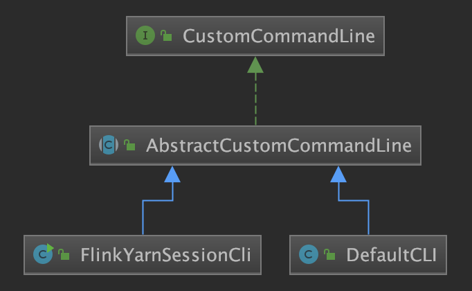
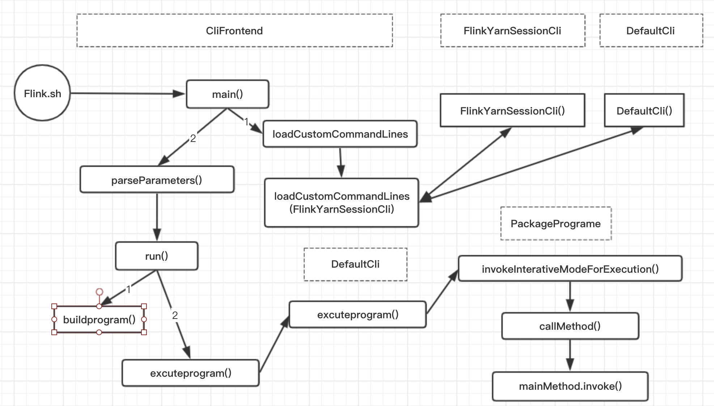

### Flink on Yarn(0)-CliFronted
- 1、Flink安装目录脚本
- 2、FlinkJob提交及入口程序


#### 1、Flink安装目录脚本
打开 /usr/local/Cellar/apache-flink/1.10.0/libexec/libexec/Flink.sh
```java
# Add HADOOP_CLASSPATH to allow the usage of Hadoop file systems
exec $JAVA_RUN $JVM_ARGS "${log_setting[@]}" -classpath "`manglePathList "$CC_CLASSPATH:$INTERNAL_HADOOP_CLASSPATHS"`" org.apache.flink.client.cli.CliFrontend "$@"
```
上述脚本中会执行org.apache.flink.client.cli.CliFrontend, ClieFrontend.java就是入口程序。

#### 2、FlinkJob提交及入口程序
```java
CliFrontend.java
/**
 * Submits the job based on the arguments.
 */
public static void main(final String[] args) {
    //1. 打印基本的环境信息
    EnvironmentInformation.logEnvironmentInfo(LOG, "Command Line Client", args);
    // 2. 获取配置目录。一般是flink安装目录下的/conf目录
    final String configurationDirectory = getConfigurationDirectoryFromEnv();

    // 3. 加载全局配置（加载配置yaml文件，将其解析出来）
    final Configuration configuration = GlobalConfiguration.loadConfiguration(configurationDirectory);

    // 4. 加载自定义命令行（包含yarn模式命令和默认命令行两种）
★    final List<CustomCommandLine> customCommandLines = loadCustomCommandLines(
        configuration,
        configurationDirectory);
    // 5. 初始化命令行前端
    final CliFrontend cli = new CliFrontend(
        configuration,
        customCommandLines);
    // 6. 安装安全机制
    SecurityUtils.install(new SecurityConfiguration(cli.configuration));
    // 7. 执行，回调，返回状态码retcode，所以这块将是主要逻辑
★    int retCode = SecurityUtils.getInstalledContext()
            .runSecured(() -> cli.parseParameters(args));
    System.exit(retCode);
}
```
##### 2.1、打印基本的环境信息
main入口执行的第一步是打印基本的环境信息。我们具体看下主要的逻辑：
```java
/**
     * 环境的日志信息, 像代码修订，当前用户，Java版本,和 JVM参数.
     *
     * @param log The logger to log the information to.
     * @param componentName 日志中要提到的组件名称.
     * @param commandLineArgs 启动组件时附带的参数。
     */
public static void logEnvironmentInfo(Logger log, String componentName, String[] commandLineArgs) {
    if (log.isInfoEnabled()) {
        // 1. 得到代码git的最终提交id和日期
        RevisionInformation rev = getRevisionInformation();
        // 2. 代码版本
        String version = getVersion();
        // 3.JVM版本,利用JavaSDK自带的ManagementFactory类来获取。
        String jvmVersion = getJvmVersion();
        // 4. JVM的启动参数，也是通过JavaSDK自带的ManagementFactory类来获取。
        String[] options = getJvmStartupOptionsArray();
        // 5. JAVA_Home目录
        String javaHome = System.getenv("JAVA_HOME");
        // 6. JVM的最大堆内存大小，单位Mb。
        long maxHeapMegabytes = getMaxJvmHeapMemory() >>> 20;

        // 7. 打印基本信息
        log.info("--------------------------------------------------------------------------------");
        log.info(" Starting " + componentName + " (Version: " + version + ", "
                 + "Rev:" + rev.commitId + ", " + "Date:" + rev.commitDate + ")");
        log.info(" OS current user: " + System.getProperty("user.name"));
        log.info(" Current Hadoop/Kerberos user: " + getHadoopUser());
        log.info(" JVM: " + jvmVersion);
        log.info(" Maximum heap size: " + maxHeapMegabytes + " MiBytes");
        log.info(" JAVA_HOME: " + (javaHome == null ? "(not set)" : javaHome));
        // 打印出Hadoop的版本信息
        String hadoopVersionString = getHadoopVersionString();
        if (hadoopVersionString != null) {
            log.info(" Hadoop version: " + hadoopVersionString);
        } else {
            log.info(" No Hadoop Dependency available");
        }
        // 打印JVM运行 参数
        if (options.length == 0) {
            log.info(" JVM Options: (none)");
        }
        else {
            log.info(" JVM Options:");
            for (String s: options) {
                log.info("    " + s);
            }
        }
        // 打印任务程序启动参数
        if (commandLineArgs == null || commandLineArgs.length == 0) {
            log.info(" Program Arguments: (none)");
        }
        else {
            log.info(" Program Arguments:");
            for (String s: commandLineArgs) {
                log.info("    " + s);
            }
        }
    }
}
```
##### 2.2、获取配置目录
```java
public static String getConfigurationDirectoryFromEnv() {
    // 1. 得到环境变量的FLINK_CONF_DIR值
    String location = System.getenv(ConfigConstants.ENV_FLINK_CONF_DIR);

    if (location != null) {
        if (new File(location).exists()) {
            return location;
        }
        else {
            throw new RuntimeException("The configuration directory '" + location + "', specified in the '" +
                ConfigConstants.ENV_FLINK_CONF_DIR + "' environment variable, does not exist.");
        }
    }
    // 2. 这里是得到./conf目录
    else if (new File(CONFIG_DIRECTORY_FALLBACK_1).exists()) {
        location = CONFIG_DIRECTORY_FALLBACK_1;
    }
    // 3. 这里是得到conf目录
    else if (new File(CONFIG_DIRECTORY_FALLBACK_2).exists()) {
        location = CONFIG_DIRECTORY_FALLBACK_2;
    }
    else {
        throw new RuntimeException("The configuration directory was not specified. " +
                "Please specify the directory containing the configuration file through the '" +
            ConfigConstants.ENV_FLINK_CONF_DIR + "' environment variable.");
    }
    return location;
}
```
##### 2.3、加载全局配置
将第2步获取到的配置路径作为参数传进GlobalConfiguration.loadConfiguration方法中，以此用来加载全局配置。看下具体的逻辑：
```java
public static Configuration loadConfiguration(final String configDir) {
    return loadConfiguration(configDir, null);
}
```
继续调用loadConfiguration方法：
```java

public static Configuration loadConfiguration(final String configDir, @Nullable final Configuration dynamicProperties) {

    if (configDir == null) {
        throw new IllegalArgumentException("Given configuration directory is null, cannot load configuration");
    }

    final File confDirFile = new File(configDir);
    if (!(confDirFile.exists())) {
        throw new IllegalConfigurationException(
            "The given configuration directory name '" + configDir +
            "' (" + confDirFile.getAbsolutePath() + ") does not describe an existing directory.");
    }

    // 1. 得到flink-conf.yaml配置文件。
    final File yamlConfigFile = new File(confDirFile, FLINK_CONF_FILENAME);

    if (!yamlConfigFile.exists()) {
        throw new IllegalConfigurationException(
            "The Flink config file '" + yamlConfigFile +
            "' (" + confDirFile.getAbsolutePath() + ") does not exist.");
    }

    // 2. 核心逻辑，解析YAML配置文件
    Configuration configuration = loadYAMLResource(yamlConfigFile);

    if (dynamicProperties != null) {
        configuration.addAll(dynamicProperties);
    }

    return configuration;
}
```
##### 2.4、加载自定义命令行
```java
CliFrontend.java
public static List<CustomCommandLine> loadCustomCommandLines(Configuration configuration, String configurationDirectory) {
    //1. 初始化一个命令List
    List<CustomCommandLine> customCommandLines = new ArrayList<>();

    //2. YARN会话的命令行接口，所有选项参数都是以y/yarn前缀
    final String flinkYarnSessionCLI = "org.apache.flink.yarn.cli.FlinkYarnSessionCli";
    //3. 添加yarn模式命令
    customCommandLines.add(
★        loadCustomCommandLine(flinkYarnSessionCLI,
            configuration,
            configurationDirectory,
            "y",
            "yarn"));

    customCommandLines.add(new ExecutorCLI(configuration));
    //添加默认模式命令行
    customCommandLines.add(new DefaultCLI(configuration));
    return customCommandLines;
}
```
下面分别展开分析是怎么添加yarn模式命令行和默认模式命令行的。

###### 添加yarn模式命令行
```java
CliFrontend.java
//通过反射构建命令行
private static CustomCommandLine loadCustomCommandLine(String className, Object... params) throws Exception {
    // 1.加载FlinkYarnSessionCli这个类，这个类实现了CustomCommandLine
    Class<? extends CustomCommandLine> customCliClass =
        Class.forName(className).asSubclass(CustomCommandLine.class);

    //2. 构建类的参数
    Class<?>[] types = new Class<?>[params.length];
    for (int i = 0; i < params.length; i++) {
        checkNotNull(params[i], "Parameters for custom command-lines may not be null.");
        types[i] = params[i].getClass();
    }
    //3. 生成构造器org.apache.flink.yarn.cli$FlinkYarnSessionCli
    Constructor<? extends CustomCommandLine> constructor = customCliClass.getConstructor(types);
    //4.构造器实例化，调用org.apache.flink.yarn.cli$FlinkYarnSessionCli的构造方法，进行实例化。
    return constructor.newInstance(params);
}
```
所以这里的逻辑是通过FlinkYarnSessionCli的构造器来实例化对象。所以进一步看具体调用了org.apache.flink.yarn.cli$FlinkYarnSessionCli的哪个构造器。这个是根据构造器的参数来的。看代码：
```java
FlinkYarnSessionCli.java
//Class handling the command line interface to the YARN session.
public FlinkYarnSessionCli(
        Configuration configuration,
        String configurationDirectory,
        String shortPrefix,
        String longPrefix) throws FlinkException {
    this(configuration, new DefaultClusterClientServiceLoader(), configurationDirectory, shortPrefix, longPrefix, true);
}
```
###### 添加默认模式命令行
默认命令行的逻辑简单，构造器初始化时，就初始化了配置
```java
DefaultCLI.java
//The default CLI which is used for interaction with standalone clusters.
public DefaultCLI(Configuration configuration) {
    super(configuration);
}
```
yarn模式命令客户端和默认普通模式客户端的类图关系如下：



##### 2.5、初始化命令行前端
```java
public CliFrontend(
        Configuration configuration,
        ClusterClientServiceLoader clusterClientServiceLoader,
        List<CustomCommandLine> customCommandLines) {
    //1. 初始化对象属性
    this.configuration = checkNotNull(configuration);
    this.customCommandLines = checkNotNull(customCommandLines);
    this.clusterClientServiceLoader = checkNotNull(clusterClientServiceLoader);
    //2. 初始化文件系统
    FileSystem.initialize(configuration, PluginUtils.createPluginManagerFromRootFolder(configuration));
    //3. 给命令行对象添加选项
    this.customCommandLineOptions = new Options();
    for (CustomCommandLine customCommandLine : customCommandLines) {
        customCommandLine.addGeneralOptions(customCommandLineOptions);
        customCommandLine.addRunOptions(customCommandLineOptions);
    }
    //4. 从全局配置里得到akka 客户端等待时间akka.client.timeout）
    this.clientTimeout = AkkaUtils.getClientTimeout(this.configuration);
    //5. 从全局配置里得到默认的系统并行度
    this.defaultParallelism = configuration.getInteger(CoreOptions.DEFAULT_PARALLELISM);
}
```
##### 2.7、执行并且回调
```java
SecurityUtils.getInstalledContext()
     .runSecured(() -> cli.parseParameters(args));
```
这一步是执行回调。runSecured的方法定义如下：
```java
/**
 * 可能需要具有的安全上下文才能运行可调用的.
 */
public interface SecurityContext {
    <T> T runSecured(Callable<T> securedCallable) throws Exception;
}
```
具体执行逻辑是cli.parseParameters(args)。所以重点分析parseParameters的逻辑：

```java
CliFrontend.java
//分析命令行参数并启动请求的操作
public int parseParameters(String[] args) {
    //1. check for action
    if (args.length < 1) {
        CliFrontendParser.printHelp(customCommandLines);
        System.out.println("Please specify an action.");
        return 1;
    }
    //2. get action，比如run,list,cancle。这事命令的第一个参数
    String action = args[0];
    //3. remove action from parameters
    final String[] params = Arrays.copyOfRange(args, 1, args.length);

    try {
        //4. 根据不同的action，执行不同的处理
        switch (action) {
            case ACTION_RUN:
                run(params);
                return 0;
            case ACTION_LIST:
                list(params);
                return 0;
            case ACTION_INFO:
                info(params);
                return 0;
            case ACTION_CANCEL:
                ....
        }
    }
}
```
我们重点分析下执行任务的逻辑，即执行./flink run的逻辑。
###### 执行run操作时的逻辑
```java
CliFrontEnd.java
protected void run(String[] args) throws Exception {
    LOG.info("Running 'run' command.");
    final Options commandOptions = CliFrontendParser.getRunCommandOptions();
    final Options commandLineOptions = CliFrontendParser.mergeOptions(commandOptions, customCommandLineOptions);
    final CommandLine commandLine = CliFrontendParser.parse(commandLineOptions, args, true);
    final ProgramOptions programOptions = new ProgramOptions(commandLine);
    // evaluate help flag
    if (commandLine.hasOption(HELP_OPTION.getOpt())) {
        CliFrontendParser.printHelpForRun(customCommandLines);
        return;
    }
    if (!programOptions.isPython()) {
        // Java program should be specified a JAR file
        if (programOptions.getJarFilePath() == null) {
            throw new CliArgsException("Java program should be specified a JAR file.");
        }
    }
    // 1.初始化带包的任务执行程序
    final PackagedProgram program;
    try {
        LOG.info("Building program from JAR file");
        program = buildProgram(programOptions);
    }

    final List<URL> jobJars = program.getJobJarAndDependencies();
    final Configuration effectiveConfiguration =
            getEffectiveConfiguration(commandLine, programOptions, jobJars);
    //2. 执行任务程序
    executeProgram(effectiveConfiguration, program);
}

// ------------------------------------------------------------------------
//  Interaction with programs and JobManager
// ---------------------------------------------------------------------------
protected void executeProgram(final Configuration configuration, final PackagedProgram program) throws ProgramInvocationException {
    ClientUtils.executeProgram(DefaultExecutorServiceLoader.INSTANCE, configuration, program);
}
```

```java
ClientUtils.java
public static void executeProgram(
        PipelineExecutorServiceLoader executorServiceLoader,
        Configuration configuration,
        PackagedProgram program) throws ProgramInvocationException {
    checkNotNull(executorServiceLoader);
    final ClassLoader userCodeClassLoader = program.getUserCodeClassLoader();
    final ClassLoader contextClassLoader = Thread.currentThread().getContextClassLoader();
    try {
        Thread.currentThread().setContextClassLoader(userCodeClassLoader);

        LOG.info("Starting program (detached: {})", !configuration.getBoolean(DeploymentOptions.ATTACHED));

        ContextEnvironmentFactory factory = new ContextEnvironmentFactory(
                executorServiceLoader,
                configuration,
                userCodeClassLoader);
        ContextEnvironment.setAsContext(factory);

        try {
★            program.invokeInteractiveModeForExecution();
        } finally {
            ContextEnvironment.unsetContext();
        }
    } finally {
        Thread.currentThread().setContextClassLoader(contextClassLoader);
    }
}
```

```java
PackagedProgram.java
public void invokeInteractiveModeForExecution() throws ProgramInvocationException {
    callMainMethod(mainClass, args);
}

private static void callMainMethod(Class<?> entryClass, String[] args) throws ProgramInvocationException {
    Method mainMethod;

    mainMethod = entryClass.getMethod("main", String[].class);
    //执行编写Flinkjob中的main()方法
★★    mainMethod.invoke(null, (Object) args);
}
```

### 总结


