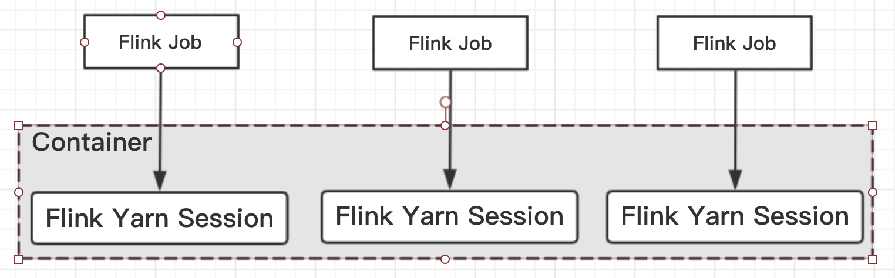

### Flink-on-yarn(per-job与session)
- 1、面试题：
- 2、简介
- 3、Session-Cluster模式：
- 4、Per-Job-Cluster模式：

### 1、面试题目
1. 听说你熟悉Flink-on-yarn的部署模式？
2. 讲讲flink-on-yarn？flink与yarn的关系？部署在yarn上比standalone的优点？

### 2、简介
Flink提供了两种在yarn上运行的模式，分别为Session-cluster和Per-Job-Cluster模式，本文分析两种模式及启动流程。

下面展示了Flink-On-Yarn模式下涉及到的相关类图结构：


### 3、Session-Cluster模式：
session-Cluster模式 ***需要先启动集群，然后再提交作业***，接着会向yarn申请一块空间后，资源永远保持不变。如果资源满了，下一个作业就无法提交，只能等到yarn中的其中一个作业执行完成后，释放了资源，下一个作业才会正常提交。***所有作业共享Dispatcher和ResourceManager***；共享资源，适合规模小执行时间短的作业。


#### 3.1、启动集群
运行bin/yarn-session.sh，即可默认启动包含一个TaskManager(内存大小为1024MB),一个JobMaster(内存大小为1024MB)，当然可以通过指定参数控制集群的资源，如-n执行taskManager个数，-s指定每个TaskManager中slot的个数；

下面以bin/yarn-session.sh为例，分析Session-Cluster启动流程

#### 3.2、流程分析
下面分为 ***本地和远程***分析启动流程，其中本地表示客户端的启动流程，远程则表示通过Yarn拉起Container的流程；

##### 3.2.1、本地流程
Session启动入口为FlinkYarnSessionCli#main

```java
FlinkYarnSessionCli.java
public static void main(final String[] args) {
    final String configurationDirectory = CliFrontend.getConfigurationDirectoryFromEnv();
    final Configuration flinkConfiguration = GlobalConfiguration.loadConfiguration();
    int retCode;
//new FlinkYarnSessionCli对象
★    final FlinkYarnSessionCli cli = new FlinkYarnSessionCli(
        flinkConfiguration,
        configurationDirectory, "",""); // no prefix for the YARN session

    SecurityUtils.install(new SecurityConfiguration(flinkConfiguration));
    retCode = SecurityUtils.getInstalledContext().runSecured(
//执行FlinkYarnSessionCli#run方法启动 Flink Session Client
★        () -> cli.run(args));
    System.exit(retCode);
}
```
执行FlinkYarnSessionCli#run
```java
public int run(String[] args) throws CliArgsException, FlinkException {
    //  Command Line Options
    final CommandLine cmd = parseCommandLineOptions(args, true);
    final Configuration configuration = applyCommandLineOptionsToConfiguration(cmd);
    //ClusterClientFactory: 集群Client工厂模式
    final ClusterClientFactory<ApplicationId> yarnClusterClientFactory = clusterClientServiceLoader.getClusterClientFactory(configuration);
    //The descriptor with deployment information for deploying a Flink cluster on Yarn:
★    final YarnClusterDescriptor yarnClusterDescriptor = (YarnClusterDescriptor) yarnClusterClientFactory.createClusterDescriptor(configuration);
    try {
        // Query cluster for metrics
        if (cmd.hasOption(query.getOpt())) {
            final String description = yarnClusterDescriptor.getClusterDescription();
            System.out.println(description);
            return 0;
        } else {
            final ClusterClientProvider<ApplicationId> clusterClientProvider;
            final ApplicationId yarnApplicationId;

            if (cmd.hasOption(applicationId.getOpt())) {
                yarnApplicationId = ConverterUtils.toApplicationId(cmd.getOptionValue(applicationId.getOpt()));

                clusterClientProvider = yarnClusterDescriptor.retrieve(yarnApplicationId);
            } else {
                final ClusterSpecification clusterSpecification = yarnClusterClientFactory.getClusterSpecification(configuration);
//deploy yarn Cluster集群
★                clusterClientProvider = yarnClusterDescriptor.deploySessionCluster(clusterSpecification);
//创建与集群交互的ClusterClient
★                ClusterClient<ApplicationId> clusterClient = clusterClientProvider.getClusterClient();

                //--- ClusterClient deployed, handle connection details
★                yarnApplicationId = clusterClient.getClusterId();

                System.out.println("JobManager Web Interface: " + clusterClient.getWebInterfaceURL());

                writeYarnPropertiesFile(
                    yarnApplicationId,
                    dynamicPropertiesEncoded);
            }

            if (!configuration.getBoolean(DeploymentOptions.ATTACHED)) {
                YarnClusterDescriptor.logDetachedClusterInformation(yarnApplicationId, LOG);
            } else {
                ScheduledExecutorService scheduledExecutorService = Executors.newSingleThreadScheduledExecutor();

                final YarnApplicationStatusMonitor yarnApplicationStatusMonitor = new YarnApplicationStatusMonitor(
                    yarnClusterDescriptor.getYarnClient(),
                    yarnApplicationId,
                    new ScheduledExecutorServiceAdapter(scheduledExecutorService));
                Thread shutdownHook = ShutdownHookUtil.addShutdownHook(
                    () -> shutdownCluster(
                            clusterClientProvider.getClusterClient(),
                            scheduledExecutorService,
                            yarnApplicationStatusMonitor),
                            getClass().getSimpleName(),
                            LOG);
                try {
                    runInteractiveCli(
                        yarnApplicationStatusMonitor,
                        acceptInteractiveInput);
                } finally {
                    shutdownCluster(
                            clusterClientProvider.getClusterClient(),
                            scheduledExecutorService,
                            yarnApplicationStatusMonitor);
                    if (shutdownHook != null) {
                        ShutdownHookUtil.removeShutdownHook(shutdownHook, getClass().getSimpleName(), LOG);
                    }
                    tryRetrieveAndLogApplicationReport(
                        yarnClusterDescriptor.getYarnClient(),
                        yarnApplicationId);
                }
            }
        }
    } finally {
        yarnClusterDescriptor.close();
    }
    return 0;
}
```
上述代码中：yarnClusterClientFactory.createClusterDescriptor(configuration)--=》yarnClusterClientFactory#getClusterDescription()---》创建、初始化YarnClient并start
```java
private YarnClusterDescriptor getClusterDescriptor(Configuration configuration) {
//初始化yarn
★    final YarnClient yarnClient = YarnClient.createYarnClient();
    final YarnConfiguration yarnConfiguration = new YarnConfiguration();

★    yarnClient.init(yarnConfiguration);
★    yarnClient.start();

    return new YarnClusterDescriptor(
            configuration,
            yarnConfiguration,
            yarnClient,
            YarnClientYarnClusterInformationRetriever.create(yarnClient),
            false);
}
```

部署集群YarnClusterDescriptor#deploySessionCluster()->YarnClusterDescriptor#deployInternal()
```java
YarnClusterDescriptor.java
/**
 * deployInternal()方法将一直被阻塞直到ApplicationMaster/JobManager被部署到YARN之前
 * @param clusterSpecification
 * @param applicationName 将要启动的集群的名字
 * @param yarnClusterEntrypoint 类名关于：Yarn cluster entry point
 * @param jobGraph
 * @param detached 是否是分离模式
 */
private ClusterClientProvider<ApplicationId> deployInternal(
        ClusterSpecification clusterSpecification,
        String applicationName,
        String yarnClusterEntrypoint,
        @Nullable JobGraph jobGraph,
        boolean detached) throws Exception {
    //判断部署yarn集群的配置参数是否已经配置好
    isReadyForDeployment(clusterSpecification);
    //检查当前的yarn session是否已经存在yarnQueue
    checkYarnQueues(yarnClient);

    // Create application via yarnClient
    final YarnClientApplication yarnApplication = yarnClient.createApplication();
    final GetNewApplicationResponse appResponse = yarnApplication.getNewApplicationResponse();

    Resource maxRes = appResponse.getMaximumResourceCapability();
    final ClusterResourceDescription freeClusterMem;
    freeClusterMem = getCurrentFreeClusterResources(yarnClient);
    final int yarnMinAllocationMB = yarnConfiguration.getInt(YarnConfiguration.RM_SCHEDULER_MINIMUM_ALLOCATION_MB, 0);
    final ClusterSpecification validClusterSpecification;
    validClusterSpecification = validateClusterResources(
            clusterSpecification,
            yarnMinAllocationMB,
            maxRes,
            freeClusterMem);
    final ClusterEntrypoint.ExecutionMode executionMode = detached ?
            ClusterEntrypoint.ExecutionMode.DETACHED
            : ClusterEntrypoint.ExecutionMode.NORMAL;
    flinkConfiguration.setString(ClusterEntrypoint.EXECUTION_MODE, executionMode.toString());
//启动AppMaster
★    ApplicationReport report = startAppMaster(
            flinkConfiguration,
            applicationName,
            yarnClusterEntrypoint,
            jobGraph,
            yarnClient,
            yarnApplication,
            validClusterSpecification);

    // 如果是分离模式则取出ApplicationID并打印
    if (detached) {
        final ApplicationId yarnApplicationId = report.getApplicationId();
        logDetachedClusterInformation(yarnApplicationId, LOG);
    }
    //AppMaster启动成功后将对应的ip和port写入flinkConfiguration中
    setClusterEntrypointInfoToConfig(report);

    return () -> {
        //创建与集群交互的ClusterClient
        //通过ClusterClient获取到appId信息并写入本地临时文件
★       return new RestClusterClient<>(flinkConfiguration, report.getApplicationId());
    };
    // 经过上述步骤，整个客户端的启动流程就结束了，下面分析yarn拉起Session集群的流程，
    // 入口类在申请Container时指定为YarnSessionClusterEntrypoint
}
```

```java
YarnClusterDescriptor.java
private ApplicationReport startAppMaster(
        Configuration configuration, String applicationName,
        String yarnClusterEntrypoint, JobGraph jobGraph,
        YarnClient yarnClient, YarnClientApplication yarnApplication,
        ClusterSpecification clusterSpecification){
    //1. 初始化文件系统（HDFS）
    org.apache.flink.core.fs.FileSystem.initialize(
            configuration,
            PluginUtils.createPluginManagerFromRootFolder(configuration));
    final FileSystem fs = FileSystem.get(yarnConfiguration);
    final Path homeDir = fs.getHomeDirectory();
    //2. 创建appContext 提交启动yarn集群的上下文ApplicationSubmissionContext
    ApplicationSubmissionContext appContext = yarnApplication.getApplicationSubmissionContext();
    // The files need to be shipped and added to classpath.
    Set<File> systemShipFiles = new HashSet<>(shipFiles.size());
    // The files only need to be shipped.
    Set<File> shipOnlyFiles = new HashSet<>();
    for (File file : shipFiles) {
        systemShipFiles.add(file.getAbsoluteFile());
    }

    //2. 将log4j、logback、flink-conf.yaml、jar包上传至HDFS
    final String logConfigFilePath = configuration.getString(YarnConfigOptionsInternal.APPLICATION_LOG_CONFIG_FILE);
    if (logConfigFilePath != null) {
        systemShipFiles.add(new File(logConfigFilePath));
    }
    addLibFoldersToShipFiles(systemShipFiles);
    addPluginsFoldersToShipFiles(shipOnlyFiles);

    // 3. 生成ApplicationID
    final ApplicationId appId = appContext.getApplicationId();

    // -- Add Zookeeper namespace to local flinkConfiguraton ----
    String zkNamespace = getZookeeperNamespace();
    configuration.setString(HighAvailabilityOptions.HA_CLUSTER_ID, zkNamespace);
    if (HighAvailabilityMode.isHighAvailabilityModeActivated(configuration)) {
        // activate re-execution of failed applications
        appContext.setMaxAppAttempts(
                configuration.getInteger(
                        YarnConfigOptions.APPLICATION_ATTEMPTS.key(),
                        YarnConfiguration.DEFAULT_RM_AM_MAX_ATTEMPTS));
        activateHighAvailabilitySupport(appContext);
    } else {
        appContext.setMaxAppAttempts(
                configuration.getInteger(
                        YarnConfigOptions.APPLICATION_ATTEMPTS.key(),
                        1));
    }

    final Set<File> userJarFiles = (jobGraph == null)
            // not per-job submission
            ? Collections.emptySet()
            // add user code jars from the provided JobGraph
            : jobGraph.getUserJars().stream().map(f -> f.toUri()).map(File::new).collect(Collectors.toSet());

    // only for per job mode
    if (jobGraph != null) {
        for (Map.Entry<String, DistributedCache.DistributedCacheEntry> entry : jobGraph.getUserArtifacts().entrySet()) {
            org.apache.flink.core.fs.Path path = new org.apache.flink.core.fs.Path(entry.getValue().filePath);
            // only upload local files
            if (!path.getFileSystem().isDistributedFS()) {
                Path localPath = new Path(path.getPath());
                Tuple2<Path, Long> remoteFileInfo =
                    Utils.uploadLocalFileToRemote(fs, appId.toString(), localPath, homeDir, entry.getKey());
                jobGraph.setUserArtifactRemotePath(entry.getKey(), remoteFileInfo.f0.toString());
            }
        }

        jobGraph.writeUserArtifactEntriesToConfiguration();
    }

    // local resource map for Yarn
    final Map<String, LocalResource> localResources = new HashMap<>(2 + systemShipFiles.size() + userJarFiles.size());
    // list of remote paths (after upload)
    final List<Path> paths = new ArrayList<>(2 + systemShipFiles.size() + userJarFiles.size());
    // ship list that enables reuse of resources for task manager containers
    StringBuilder envShipFileList = new StringBuilder();

    // upload and register ship files, these files will be added to classpath.
    List<String> systemClassPaths = uploadAndRegisterFiles(
        systemShipFiles, fs, homeDir, appId, paths,
        localResources, Path.CUR_DIR, envShipFileList);
    //上传和注册ship-only files
    uploadAndRegisterFiles(
        shipOnlyFiles, fs, homeDir, appId,
        paths, localResources, Path.CUR_DIR, envShipFileList);
    final List<String> userClassPaths = uploadAndRegisterFiles(
        userJarFiles, fs, homeDir,
        appId, paths, localResources,
        userJarInclusion == YarnConfigOptions.UserJarInclusion.DISABLED ?
            ConfigConstants.DEFAULT_FLINK_USR_LIB_DIR : Path.CUR_DIR,
        envShipFileList);
    if (userJarInclusion == YarnConfigOptions.UserJarInclusion.ORDER) {
        systemClassPaths.addAll(userClassPaths);
    }
    // normalize classpath by sorting
    Collections.sort(systemClassPaths);
    Collections.sort(userClassPaths);

    // classpath assembler
    StringBuilder classPathBuilder = new StringBuilder();
    if (userJarInclusion == YarnConfigOptions.UserJarInclusion.FIRST) {
        for (String userClassPath : userClassPaths) {
            classPathBuilder.append(userClassPath).append(File.pathSeparator);
        }
    }
    for (String classPath : systemClassPaths) {
        classPathBuilder.append(classPath).append(File.pathSeparator);
    }
    // Setup jar for ApplicationMaster
    Path remotePathJar = setupSingleLocalResource(
            flinkJarPath.getName(), fs, appId, flinkJarPath,
            localResources, homeDir, "");
    paths.add(remotePathJar);
    classPathBuilder.append(flinkJarPath.getName()).append(File.pathSeparator);

    // Upload the flink configuration
    // write out configuration file
    File tmpConfigurationFile = null;
    try {
        tmpConfigurationFile = File.createTempFile(appId + "-flink-conf.yaml", null);
        BootstrapTools.writeConfiguration(configuration, tmpConfigurationFile);

        String flinkConfigKey = "flink-conf.yaml";
        Path remotePathConf = setupSingleLocalResource(
            flinkConfigKey,
            fs,
            appId,
            new Path(tmpConfigurationFile.getAbsolutePath()),
            localResources,
            homeDir,
            "");
        envShipFileList.append(flinkConfigKey).append("=").append(remotePathConf).append(",");
        paths.add(remotePathConf);
        classPathBuilder.append("flink-conf.yaml").append(File.pathSeparator);
    } finally {
        if (tmpConfigurationFile != null && !tmpConfigurationFile.delete()) {
            LOG.warn("Fail to delete temporary file {}.", tmpConfigurationFile.toPath());
        }
    }

    if (userJarInclusion == YarnConfigOptions.UserJarInclusion.LAST) {
        for (String userClassPath : userClassPaths) {
            classPathBuilder.append(userClassPath).append(File.pathSeparator);
        }
    }

    // write job graph to tmp file and add it to local resource
    // TODO: server use user main method to generate job graph
    if (jobGraph != null) {
        File tmpJobGraphFile = null;
        try {
            tmpJobGraphFile = File.createTempFile(appId.toString(), null);
            try (FileOutputStream output = new FileOutputStream(tmpJobGraphFile);
                ObjectOutputStream obOutput = new ObjectOutputStream(output);){
                obOutput.writeObject(jobGraph);
            }

            final String jobGraphFilename = "job.graph";
            flinkConfiguration.setString(JOB_GRAPH_FILE_PATH, jobGraphFilename);

            Path pathFromYarnURL = setupSingleLocalResource(
                    jobGraphFilename, fs, appId, new Path(tmpJobGraphFile.toURI()), localResources, homeDir, "");
            paths.add(pathFromYarnURL);
            classPathBuilder.append(jobGraphFilename).append(File.pathSeparator);
        } catch (Exception e) {
            LOG.warn("Add job graph to local resource fail");
            throw e;
        } finally {
            if (tmpJobGraphFile != null && !tmpJobGraphFile.delete()) {
                LOG.warn("Fail to delete temporary file {}.", tmpConfigurationFile.toPath());
            }
        }
    }

    final Path yarnFilesDir = getYarnFilesDir(appId);
    FsPermission permission = new FsPermission(FsAction.ALL, FsAction.NONE, FsAction.NONE);
    fs.setPermission(yarnFilesDir, permission); // set permission for path.

    final boolean hasLogback = logConfigFilePath != null && logConfigFilePath.endsWith(CONFIG_FILE_LOGBACK_NAME);
    final boolean hasLog4j = logConfigFilePath != null && logConfigFilePath.endsWith(CONFIG_FILE_LOG4J_NAME);

    //5. 构造AppMaster的的container(确定container进程的入口类YarnSessionClusterEntrypoint)构造相应的Env
★    final ContainerLaunchContext amContainer = setupApplicationMasterContainer(yarnClusterEntrypoint, hasLogback, hasLog4j, hasKrb5,
            clusterSpecification.getMasterMemoryMB());
    amContainer.setLocalResources(localResources);
    fs.close();

    // Setup CLASSPATH and environment variables for ApplicationMaster
    final Map<String, String> appMasterEnv = new HashMap<>();
    // set user specified app master environment variables
    appMasterEnv.putAll(
        BootstrapTools.getEnvironmentVariables(ResourceManagerOptions.CONTAINERIZED_MASTER_ENV_PREFIX, configuration));
    // set Flink app class path
    appMasterEnv.put(YarnConfigKeys.ENV_FLINK_CLASSPATH, classPathBuilder.toString());

    // set Flink on YARN internal configuration values
    appMasterEnv.put(YarnConfigKeys.FLINK_JAR_PATH, remotePathJar.toString());
    appMasterEnv.put(YarnConfigKeys.ENV_APP_ID, appId.toString());
    appMasterEnv.put(YarnConfigKeys.ENV_CLIENT_HOME_DIR, homeDir.toString());
    appMasterEnv.put(YarnConfigKeys.ENV_CLIENT_SHIP_FILES, envShipFileList.toString());
    appMasterEnv.put(YarnConfigKeys.ENV_ZOOKEEPER_NAMESPACE, getZookeeperNamespace());
    appMasterEnv.put(YarnConfigKeys.FLINK_YARN_FILES, yarnFilesDir.toUri().toString());
    appMasterEnv.put(YarnConfigKeys.ENV_HADOOP_USER_NAME, UserGroupInformation.getCurrentUser().getUserName());
    if (remotePathKeytab != null) {
        appMasterEnv.put(YarnConfigKeys.KEYTAB_PATH, remotePathKeytab.toString());
        String principal = configuration.getString(SecurityOptions.KERBEROS_LOGIN_PRINCIPAL);
        appMasterEnv.put(YarnConfigKeys.KEYTAB_PRINCIPAL, principal);
    }
    //To support Yarn Secure Integration Test Scenario
    if (remoteYarnSiteXmlPath != null) {
        appMasterEnv.put(YarnConfigKeys.ENV_YARN_SITE_XML_PATH, remoteYarnSiteXmlPath.toString());
    }
    if (remoteKrb5Path != null) {
        appMasterEnv.put(YarnConfigKeys.ENV_KRB5_PATH, remoteKrb5Path.toString());
    }
    // set classpath from YARN configuration
    Utils.setupYarnClassPath(yarnConfiguration, appMasterEnv);
    //6. 设置env
★    amContainer.setEnvironment(appMasterEnv);

    // Set up resource type requirements for ApplicationMaster
    Resource capability = Records.newRecord(Resource.class);
    capability.setMemory(clusterSpecification.getMasterMemoryMB());
    capability.setVirtualCores(flinkConfiguration.getInteger(YarnConfigOptions.APP_MASTER_VCORES));

    final String customApplicationName = customName != null ? customName : applicationName;
    appContext.setApplicationName(customApplicationName);
    appContext.setApplicationType(applicationType != null ? applicationType : "Apache Flink");
    appContext.setAMContainerSpec(amContainer);
    appContext.setResource(capability);
    // Set priority for application
    int priorityNum = flinkConfiguration.getInteger(YarnConfigOptions.APPLICATION_PRIORITY);
    if (priorityNum >= 0) {
        Priority priority = Priority.newInstance(priorityNum);
        appContext.setPriority(priority);
    }
    if (yarnQueue != null) {
        appContext.setQueue(yarnQueue);
    }
    setApplicationNodeLabel(appContext);
    setApplicationTags(appContext);

    // add a hook to clean up in case deployment fails
    Thread deploymentFailureHook = new DeploymentFailureHook(yarnApplication, yarnFilesDir);
    Runtime.getRuntime().addShutdownHook(deploymentFailureHook);
    LOG.info("Submitting application master " + appId);

    //7. 通过yarnClient创建Application
★    yarnClient.submitApplication(appContext);

    LOG.info("Waiting for the cluster to be allocated");
    final long startTime = System.currentTimeMillis();
    ApplicationReport report;
    YarnApplicationState lastAppState = YarnApplicationState.NEW;

    // yarnCluster部署成功之前 一直阻塞
★    loop: while (true) {
        try {
            report = yarnClient.getApplicationReport(appId);
        } catch (IOException e) {
            throw new YarnDeploymentException("Failed to deploy the cluster.", e);
        }
        YarnApplicationState appState = report.getYarnApplicationState();
        LOG.debug("Application State: {}", appState);
        //跟踪ApplicationReport状态（确定是否启动成功，可能会由于资源不够，一直等待）
        switch(appState) {
            case FAILED:
            case KILLED:
                throw new YarnDeploymentException("The YARN application unexpectedly switched to state "
                        + appState + " during deployment. \n" +
                        "Diagnostics from YARN: " + report.getDiagnostics() + "\n" +
                        "If log aggregation is enabled on your cluster, use this command to further investigate the issue:\n" +
                        "yarn logs -applicationId " + appId);
                //break ..
            case RUNNING:
                LOG.info("YARN application has been deployed successfully.");
                break loop;
            case FINISHED:
                LOG.info("YARN application has been finished successfully.");
                break loop;
            default:
                if (appState != lastAppState) {
                    LOG.info("Deploying cluster, current state " + appState);
                }
                if (System.currentTimeMillis() - startTime > 60000) {
                    LOG.info("Deployment took more than 60 seconds. Please check if the requested resources are available in the YARN cluster");
                }
        }
        lastAppState = appState;
        Thread.sleep(250);
    }
    // since deployment was successful, remove the hook
    ShutdownHookUtil.removeShutdownHook(deploymentFailureHook, getClass().getSimpleName(), LOG);
    return report;
}
```
AbstractYarnClusterDescriptor#startAppMaster启动AppMaster
###### 上述deployInternal()方法主要做了如下几件事：
1. 初始化文件系统（HDFS）、 创建appContext 提交启动yarn集群的上下文ApplicationSubmissionContext
2. 将log4j、logback、flink-conf.yaml、jar包上传至HDFS
3. 生成ApplicationID
4. 上传和注册ship-only files
5. 构造AppMaster的的container(确定container进程的入口类YarnSessionClusterEntrypoint)构造相应的Env
6. 设置env
7. 通过yarnClient创建Application：yarnClient.submitApplication(appContext);
8. 通过while循环实现yarnCluster部署成功之前 一直阻塞

接下来就是创建与集群交互的ClusterClient(创建基于Netty的RestClient)

通过ClusterClient获取到appId信息并写入本地临时文件
return new RestClusterClient<>(flinkConfiguration, report.getApplicationId());
```java
RestClusterClient.java
private RestClusterClient( Configuration configuration,
    @Nullable RestClient restClient, T clusterId, WaitStrategy waitStrategy,
    ClientHighAvailabilityServices clientHAServices) {
    this.configuration = checkNotNull(configuration);
    this.restClusterClientConfiguration = RestClusterClientConfiguration.fromConfiguration(configuration);

    if (restClient != null) {
        this.restClient = restClient;
    } else {
//创建基于Netty的RestClient
★   this.restClient = new RestClient(restClusterClientConfiguration.getRestClientConfiguration(), executorService);
    }

    this.waitStrategy = checkNotNull(waitStrategy);
    this.clusterId = checkNotNull(clusterId);
// 判断客户端的HAService是否为空，为空抛出异常
★    this.clientHAServices = checkNotNull(clientHAServices);
//Get the leader retriever for the cluster's rest endpoint.
①    this.webMonitorRetrievalService = clientHAServices.getClusterRestEndpointLeaderRetriever();
    this.retryExecutorService = Executors.newSingleThreadScheduledExecutor(new ExecutorThreadFactory("Flink-RestClusterClient-Retry"));
②    startLeaderRetrievers();
}
```
①关于获取client retriever的逻辑如下：
```java
ZooKeeperClientHAServices.java
@Override
//REST_SERVER_LEADER_PATH = "/rest_server_lock"
public LeaderRetrievalService getClusterRestEndpointLeaderRetriever() {
★    return ZooKeeperUtils.createLeaderRetrievalService(client, configuration, REST_SERVER_LEADER_PATH);
}
```
```java
ZooKeeperUtils.java
public static ZooKeeperLeaderRetrievalService createLeaderRetrievalService(
    final CuratorFramework client,
    final Configuration configuration,
    final String pathSuffix) {
    //如果在配置文件中不设置HA_ZOOKEEPER_LEADER_PATH 默认为/leader
    //leaderPath = /leader/rest_server_lock
    String leaderPath = configuration.getString(
        HighAvailabilityOptions.HA_ZOOKEEPER_LEADER_PATH) + pathSuffix;
★    return new ZooKeeperLeaderRetrievalService(client, leaderPath);
}
```
```java
/**
 * Creates a leader retrieval service which uses ZooKeeper to retrieve the leader information.
 * @param client ：连接到 ZooKeeper quorum 的curator客户端
 * @param retrievalPath： 代表leader information的路径
 */
public ZooKeeperLeaderRetrievalService(CuratorFramework client, String retrievalPath) {
    this.client = Preconditions.checkNotNull(client, "CuratorFramework client");
★    this.cache = new NodeCache(client, retrievalPath);
    this.retrievalPath = Preconditions.checkNotNull(retrievalPath);
    this.leaderListener = null;
    this.lastLeaderAddress = null;
    this.lastLeaderSessionID = null;
}
```
② 启动leader retrieval服务，并对新的leader节点进行监听(Starts the leader retrieval service with the given listener to listen for new leaders. This method can only be called once.)
```java
RestClusterClient.java
private void startLeaderRetrievers() throws Exception {
    this.webMonitorRetrievalService.start(webMonitorLeaderRetriever);
}
```
```java
@Override
public void start(LeaderRetrievalListener listener) throws Exception {
    Preconditions.checkNotNull(listener, "Listener must not be null.");
    Preconditions.checkState(leaderListener == null, "ZooKeeperLeaderRetrievalService can " + "only be started once.");
    LOG.info("Starting ZooKeeperLeaderRetrievalService {}.", retrievalPath);

    synchronized (lock) {
        leaderListener = listener;
        client.getUnhandledErrorListenable().addListener(this);
        //启动监听节点的变化(主备切换)
        cache.getListenable().addListener(this);
        cache.start();
        client.getConnectionStateListenable().addListener(connectionStateListener);
        running = true;
    }
}
```
经过上述步骤，整个客户端的启动流程就结束了，下面分析yarn拉起Session集群的流程，入口类是申请Container时指定为YarnSessionClusterEntrypoint。
```java
//构造AppMaster的的container(确定container进程的入口类YarnSessionClusterEntrypoint)构造相应的Env
final ContainerLaunchContext amContainer = setupApplicationMasterContainer(
★        yarnClusterEntrypoint, hasLogback, hasLog4j, hasKrb5,
        clusterSpecification.getMasterMemoryMB());
```

###### 客户端流程总结
画图总结：


##### 3.2.2、远端流程
远端宿主在Container中的集群入口为YarnSessionClusterEntrypoint#main

Yarn Session集群的Entry point为YarnSessionClusterEntrypoint#main
```java
point为YarnSessionClusterEntrypoint.java
public static void main(String[] args) {
    // startup checks and logging
    EnvironmentInformation.logEnvironmentInfo(LOG, YarnSessionClusterEntrypoint.class.getSimpleName(), args);
    SignalHandler.register(LOG);
    JvmShutdownSafeguard.installAsShutdownHook(LOG);
    Map<String, String> env = System.getenv();
    final String workingDirectory = env.get(ApplicationConstants.Environment.PWD.key());
    Preconditions.checkArgument(
        workingDirectory != null,"Working directory variable (%s) not set",
        ApplicationConstants.Environment.PWD.key());
    YarnEntrypointUtils.logYarnEnvironmentInformation(env, LOG);
    Configuration configuration = YarnEntrypointUtils.loadConfiguration(workingDirectory, env);

    YarnSessionClusterEntrypoint yarnSessionClusterEntrypoint = new YarnSessionClusterEntrypoint(configuration);
    //启动集群
★   ClusterEntrypoint.runClusterEntrypoint(yarnSessionClusterEntrypoint);
}
```
ClusterEntrypoint #runClusterEntrypoint -> ClusterEntrypoint#startCluster->ClusterEntrypoint#runCluster启动集群
```java
ClusterEntrypoint.java
public static void runClusterEntrypoint(ClusterEntrypoint clusterEntrypoint) {
    final String clusterEntrypointName = clusterEntrypoint.getClass().getSimpleName();
    //启动Flink集群
★    clusterEntrypoint.startCluster();
}

public void startCluster() throws ClusterEntrypointException {
    configureFileSystems(configuration);
    SecurityContext securityContext = installSecurityContext(configuration);
    securityContext.runSecured((Callable<Void>) () -> {
        //通过回调启动集群runCluster();
★       runCluster(configuration);
        //至此经过上述步骤就完成了集群的启动
    return null;
    });
}
```
###### 经过上述步骤开始集群的启动：

```java
private void runCluster(Configuration configuration) throws Exception {
    synchronized (lock) {
        //1. 首先会初始化相关服务(这里会涉及到一系列的服务)
        initializeServices(configuration);
        // write host information into configuration
        configuration.setString(JobManagerOptions.ADDRESS, commonRpcService.getAddress());
        configuration.setInteger(JobManagerOptions.PORT, commonRpcService.getPort());
        //2. 创建DispatcherResourceManagerFactory
        final DispatcherResourceManagerComponentFactory dispatcherResourceManagerComponentFactory = createDispatcherResourceManagerComponentFactory(configuration);

        //3. 创建DispatcherResourceManagerComponent这个对象(用于启动Dispatcher、ResourceManager、WebMonitorEndpoint)
        clusterComponent = dispatcherResourceManagerComponentFactory.create(
            configuration, ioExecutor, commonRpcService, haServices, blobServer, heartbeatServices, metricRegistry, archivedExecutionGraphStore,
            new RpcMetricQueryServiceRetriever(metricRegistry.getMetricQueryServiceRpcService()), this);
    }
}
```
集群启动时会初始化一些Services，还会创建一些组件：创建DispatcherResourceManagerComponentFactory(SessionDispatcherResourceManagerCompontFactory), 并使用Factory创建DispatcherResourceManagerComponent（用于启动Dispatcher、ResourceManager、WebMonitorEndpoint）

初始化Services逻辑具体如下：
```java
ClusterEntrypoint.java
// 启动集群时候初始化的相关的服务
protected void initializeServices(Configuration configuration) {
    synchronized (lock) {
        final String bindAddress = configuration.getString(JobManagerOptions.ADDRESS);
        final String portRange = getRPCPortRange(configuration);
        // 1.创建RPCService（AkkaRpcService）
        commonRpcService = createRpcService(configuration, bindAddress, portRange);
        // update the configuration used to create the high availability services
        //根据当前创建的RPC服务信息在configuration中增加配置信息（之前设置的端口可能是一个range）
        configuration.setString(JobManagerOptions.ADDRESS, commonRpcService.getAddress());
        configuration.setInteger(JobManagerOptions.PORT, commonRpcService.getPort());

        // 2.创建用于IO的线程池
        ioExecutor = Executors.newFixedThreadPool(
            Hardware.getNumberCPUCores(),
            new ExecutorThreadFactory("cluster-io"));
        // 3.创建HA Service（跟用户配置有关，可以是NONE、ZooKeeper也可以自定义的类）
        haServices = createHaServices(configuration, ioExecutor);
        // 4.初始化Blob Server
      blobServer = new BlobServer(configuration, haServices.createBlobStore());
        blobServer.start();
        // 5.启动heartbeat service
        heartbeatServices = createHeartbeatServices(configuration);
        // 6.创建了一个Flink内部的metrics rpc service
        metricRegistry = createMetricRegistry(configuration);
        // 7.启动MetricQuerService
        final RpcService metricQueryServiceRpcService = MetricUtils.startMetricsRpcService(configuration, bindAddress);
        metricRegistry.startQueryService(metricQueryServiceRpcService, null);

        final String hostname = RpcUtils.getHostname(commonRpcService);

        processMetricGroup = MetricUtils.instantiateProcessMetricGroup(
            metricRegistry,
            hostname,
            ConfigurationUtils.getSystemResourceMetricsProbingInterval(configuration));
        // 8.创建了一个ArchiveExectionGraphStore对象，用于存储用户作业的物理graph
        archivedExecutionGraphStore = createSerializableExecutionGraphStore(configuration, commonRpcService.getScheduledExecutor());
    }
}
```
上述初始化服务：创建RPCService(akkaRpcService)、创建HAService、创建并启动BlobService、创建HeartbeatServices、创建指标服务并启动、创建本地存储ExecutionGraph的stroe

使用前面在initializeServices中已经初始化的services,创建DispatcherResourceManagerComponent逻辑如下：
```java
DefaultDispatcherResourceManagerComponentFactory.java
//创建DispatcherResourceManagerComponent对象
@Override
public DispatcherResourceManagerComponent create(
        Configuration configuration, Executor ioExecutor,
        RpcService rpcService, HighAvailabilityServices highAvailabilityServices, BlobServer blobServer,
        HeartbeatServices heartbeatServices, MetricRegistry metricRegistry,
        ArchivedExecutionGraphStore archivedExecutionGraphStore,
        MetricQueryServiceRetriever metricQueryServiceRetriever,
        FatalErrorHandler fatalErrorHandler){

//---创建DispatcherResourceManagerComponent对象需要的service组件--
    //dispatcher的Leader retrieval服务
    LeaderRetrievalService dispatcherLeaderRetrievalService = null;
    //resourceManager retrieval服务
    LeaderRetrievalService resourceManagerRetrievalService = null;
    //它主要使用web前端的rest接口调用、Zk listener for leader retrieval
    WebMonitorEndpoint<?> webMonitorEndpoint = null;
    //resourceManager组件
    ResourceManager<?> resourceManager = null;
    ResourceManagerMetricGroup resourceManagerMetricGroup = null;
    //dispatcher
    DispatcherRunner dispatcherRunner = null;

    //用于Dispatcher leader选举 即在ZK在创建/dispatcher_lock节点
    dispatcherLeaderRetrievalService = highAvailabilityServices.getDispatcherLeaderRetriever();
    //用于Resource Manager leader 选举（对于使用ZK的HA模式来说，与上面的区别是使用的路径不同）/resource_manager_lock节点
    resourceManagerRetrievalService = highAvailabilityServices.getResourceManagerLeaderRetriever();

    //创建DispatcherGateway的Retriever
    final LeaderGatewayRetriever<DispatcherGateway> dispatcherGatewayRetriever = new RpcGatewayRetriever<>(
        rpcService, DispatcherGateway.class, DispatcherId::fromUuid,
        10, Time.milliseconds(50L));
    // 创建ResoureManagerGateway的Retriever
    final LeaderGatewayRetriever<ResourceManagerGateway> resourceManagerGatewayRetriever = new RpcGatewayRetriever<>(
        rpcService, ResourceManagerGateway.class, ResourceManagerId::fromUuid, 10, Time.milliseconds(50L));
    //它主要使用web前端的rest接口调用
    final ExecutorService executor = WebMonitorEndpoint.createExecutorService(
        configuration.getInteger(RestOptions.SERVER_NUM_THREADS),
        configuration.getInteger(RestOptions.SERVER_THREAD_PRIORITY),
        "DispatcherRestEndpoint");

    final long updateInterval = configuration.getLong(MetricOptions.METRIC_FETCHER_UPDATE_INTERVAL);
    final MetricFetcher metricFetcher = updateInterval == 0
        ? VoidMetricFetcher.INSTANCE
        : MetricFetcherImpl.fromConfiguration(
            configuration, metricQueryServiceRetriever,
            dispatcherGatewayRetriever,  executor);

    //【重点】创建WebMonitorEndpoint，并启动
    // 在standalone模式下，这里创建的是DispatcherRestEndpoint对象
    webMonitorEndpoint = restEndpointFactory.createRestEndpoint(
        configuration, dispatcherGatewayRetriever,
        resourceManagerGatewayRetriever, blobServer, executor,
        metricFetcher, highAvailabilityServices.getClusterRestEndpointLeaderElectionService(),
        fatalErrorHandler);

    //启动DispatcherRestEndpoint
    log.debug("Starting Dispatcher REST endpoint.");
    webMonitorEndpoint.start();

    final String hostname = RpcUtils.getHostname(rpcService);
    //创建ResourceManager的指标组
    resourceManagerMetricGroup = ResourceManagerMetricGroup.create(metricRegistry, hostname);

    //【重点】创建resourceManager并启动(Standalone/session模式，这里创建的是StandaloneResourceManager对象)
★        resourceManager = resourceManagerFactory.createResourceManager(
        configuration, ResourceID.generate(), rpcService,
        highAvailabilityServices, heartbeatServices, fatalErrorHandler,
        new ClusterInformation(hostname, blobServer.getPort()),
        webMonitorEndpoint.getRestBaseUrl(), resourceManagerMetricGroup);

    final HistoryServerArchivist historyServerArchivist = HistoryServerArchivist.createHistoryServerArchivist(configuration, webMonitorEndpoint);

    //创建dispatcher对象
★        final PartialDispatcherServices partialDispatcherServices = new PartialDispatcherServices( configuration, highAvailabilityServices,
        resourceManagerGatewayRetriever, blobServer, heartbeatServices,
        () -> MetricUtils.instantiateJobManagerMetricGroup(metricRegistry, hostname),
        archivedExecutionGraphStore, fatalErrorHandler, historyServerArchivist,
        metricRegistry.getMetricQueryServiceGatewayRpcAddress());

    log.debug("Starting Dispatcher.");
    //启动Dispatcher并进行ZK选举
    dispatcherRunner = dispatcherRunnerFactory.createDispatcherRunner(
        highAvailabilityServices.getDispatcherLeaderElectionService(),
        fatalErrorHandler,
        new HaServicesJobGraphStoreFactory(highAvailabilityServices),
        ioExecutor, rpcService, partialDispatcherServices);

    // 启动ResourceManager并进行ZK选举
    log.debug("Starting ResourceManager.");
    resourceManager.start();

    //使用resourceManagerGatewayRetriever去监听zk的/resource_manager_lock节点
    resourceManagerRetrievalService.start(resourceManagerGatewayRetriever);
    //使用dispatcherGateWayRetriever去监听zk的/dispatcher_lock节点
    dispatcherLeaderRetrievalService.start(dispatcherGatewayRetriever);

    //返回sessionDidpatcherResourceManagerComponent
    return new DispatcherResourceManagerComponent(
        dispatcherRunner,resourceManager,
        dispatcherLeaderRetrievalService,
        resourceManagerRetrievalService,webMonitorEndpoint);
}
```
上述代码实现：

1. 在zk中创建/dispatcher_lock节点、/resource_manager_lock节点
2. 创建dispatcherGatewayRetriever、resourManagerGatewayRetrieval( rpc gateway接口)
3. 创建dispatcher、resourceManager并启动

##### 服务端总结


#### 3.3、启动作业
当启动集群后，即可使用./flink run -c mainClass /path/to/usr/jar向集群提交任务

#### 3.4、启动作业流程分析--客户端
***----开始：yarn Session-Cluster 与 yarn per-job-Cluster模式公共部分----***
flink.sh-->程序入口CliFrontend#main
```java
CliFrontend.java
public static void main(final String[] args) {
    EnvironmentInformation.logEnvironmentInfo(LOG, "Command Line Client", args);
    // 1. find the configuration directory
    final String configurationDirectory = getConfigurationDirectoryFromEnv();
    // 2. load the global configuration
    final Configuration configuration = GlobalConfiguration.loadConfiguration(configurationDirectory);
    // 3. load the custom command lines
    final List<CustomCommandLine> customCommandLines = loadCustomCommandLines(
        configuration,
        configurationDirectory);

    final CliFrontend cli = new CliFrontend(
        configuration,
        customCommandLines);

    SecurityUtils.install(new SecurityConfiguration(cli.configuration));
    int retCode = SecurityUtils.getInstalledContext()
★            .runSecured(() -> cli.parseParameters(args));
    System.exit(retCode);
}
```
解析处理参数：
```java
CliFrontend.java
public int parseParameters(String[] args) {
    String action = args[0];
    // remove action from parameters
    final String[] params = Arrays.copyOfRange(args, 1, args.length);
    // do action
    switch (action) {
        case ACTION_RUN:
★            run(params);
            return 0;
        }
}
```
```java
protected void run(String[] args) throws Exception {
    final Options commandOptions = CliFrontendParser.getRunCommandOptions();
    final Options commandLineOptions = CliFrontendParser.mergeOptions(commandOptions, customCommandLineOptions);
    final CommandLine commandLine = CliFrontendParser.parse(commandLineOptions, args, true);
    final ProgramOptions programOptions = new ProgramOptions(commandLine);

    final PackagedProgram program;

//根据用户jar、main程序参数、savepoint信息生成PackagedProgram
//主要是找到用户程序的入口类+一些配置
    LOG.info("Building program from JAR file");
★   program = buildProgram(programOptions);

    final List<URL> jobJars = program.getJobJarAndDependencies();
    final Configuration effectiveConfiguration =
            getEffectiveConfiguration(commandLine, programOptions, jobJars);

    LOG.debug("Effective executor coniguration: {}", effectiveConfiguration);
//执行用户程序
★    executeProgram(effectiveConfiguration, program);
}
```
//执行用户写的程序
```java
public static void executeProgram(
        PipelineExecutorServiceLoader executorServiceLoader,
        Configuration configuration, PackagedProgram program){
    checkNotNull(executorServiceLoader);
    final ClassLoader userCodeClassLoader = program.getUserCodeClassLoader();
    final ClassLoader contextClassLoader = Thread.currentThread().getContextClassLoader();
    try {
        Thread.currentThread().setContextClassLoader(userCodeClassLoader);
        ContextEnvironmentFactory factory = new ContextEnvironmentFactory(
                executorServiceLoader,
                configuration, userCodeClassLoader);
        ContextEnvironment.setAsContext(factory);

        try {
            //使用反射执行用户代码的main()方法
            //执行main方法之前是假定contextEnvironment已经准备好
★            program.invokeInteractiveModeForExecution();
        } finally {
            ContextEnvironment.unsetContext();
        }
    } finally {
        Thread.currentThread().setContextClassLoader(contextClassLoader);
    }
}
```
###### 调起用户main()方法
```java
public class RandomWordCount {
    public static void main(String[] args) throws Exception {
★        env.execute("Random WordCount");
 }}
```
```java
public JobExecutionResult execute(String jobName){
    // 先生成StreamGraph然后执行
★    return execute(getStreamGraph(jobName));
}
```
```java
StreamExecutionEnvironment.java
@Internal
public JobExecutionResult execute(StreamGraph streamGraph) throws Exception {
    //异步的执行streamGraph
★    final JobClient jobClient = executeAsync(streamGraph);
    final JobExecutionResult jobExecutionResult;

    if (configuration.getBoolean(DeploymentOptions.ATTACHED)) {
        jobExecutionResult = jobClient.getJobExecutionResult(userClassloader).get();
    } else {
        jobExecutionResult = new DetachedJobExecutionResult(jobClient.getJobID());
    }
    jobListeners.forEach(jobListener -> jobListener.onJobExecuted(jobExecutionResult, null));
    return jobExecutionResult;
}
```
```java
StreamExecutionEnvironment.java
public JobClient executeAsync(StreamGraph streamGraph) throws Exception {
    checkNotNull(streamGraph, "StreamGraph cannot be null.");
    checkNotNull(configuration.get(DeploymentOptions.TARGET), "No execution.target specified in your configuration file.");
    //PipelineExecutorFactory有两种：
    // YarnJobClusterExecutorFactory for executing jobs on dedicated(per-job)clusters
    // YarnSessionClusterExecutorFactory for executing jobs on an existing(session) clusters
    final PipelineExecutorFactory executorFactory =
        executorServiceLoader.getExecutorFactory(configuration);

//其中executorFactory.getExecutor()获取的是 YarnSessionClusterExecutorFactory
    CompletableFuture<JobClient> jobClientFuture = executorFactory
★        .getExecutor(configuration)
★★        .execute(streamGraph, configuration);

    JobClient jobClient = jobClientFuture.get();
    jobListeners.forEach(jobListener -> jobListener.onJobSubmitted(jobClient, null));
    return jobClient;
}
```
***----截止 ：yarn Session-Cluster 与 yarn per-job-Cluster模式公共部分----***

PipelineExecutorFactory有两种：

1. YarnJobClusterExecutorFactory for executing jobs on dedicated(per-job)clusters
2. YarnSessionClusterExecutorFactory for executing jobs on an existing(session) clusters

```java
AbstractSessionClusterExecutor
@Override
public CompletableFuture<JobClient> execute(@Nonnull final Pipeline pipeline, @Nonnull final Configuration configuration) throws Exception {
    final JobGraph jobGraph = ExecutorUtils.getJobGraph(pipeline, configuration);

    final ClusterDescriptor<ClusterID> clusterDescriptor = clusterClientFactory.createClusterDescriptor(configuration)) {
    final ClusterID clusterID = clusterClientFactory.getClusterId(configuration);
    checkState(clusterID != null);
①//从yarnClient中获取RestClusterClient
    final ClusterClientProvider<ClusterID> clusterClientProvider = clusterDescriptor.retrieve(clusterID);
★★  ClusterClient<ClusterID> clusterClient = clusterClientProvider.getClusterClient();
    return clusterClient
②//提交jobGraph到yarn Cluster
★★      .submitJob(jobGraph);
}
```
①从yarnClient中获取RestClusterClient的具体逻辑如下
```java
YarnClusterDescriptor.java
@Override
public ClusterClientProvider<ApplicationId> retrieve(ApplicationId applicationId) throws ClusterRetrieveException {
    try {
        // check if required Hadoop environment variables are set. If not, warn user
        if (System.getenv("HADOOP_CONF_DIR") == null &&
                System.getenv("YARN_CONF_DIR") == null) {
            LOG.warn("Neither the HADOOP_CONF_DIR nor the YARN_CONF_DIR environment variable is set." +
                    "The Flink YARN Client needs one of these to be set to properly load the Hadoop " +
                    "configuration for accessing YARN.");
        }
★   final ApplicationReport report = yarnClient.getApplicationReport(applicationId);
    setClusterEntrypointInfoToConfig(report);
    return () -> {
★        return new RestClusterClient<>(flinkConfiguration, report.getApplicationId());
    };
}
```
经过上述步骤，客户端提交任务过程就完成了，主要就是通过RestClusterClient将用户程序的JobGraph通过Rest接口提交至集群中。

##### 总结
上述过程流程图如下：


#### 3.4、启动作业流程分析--远端
在Yarn Session Cluster中响应客户端提交作业请求(RestClusterClient.submit(jobGraph))的是：RestServerEndpoint，其中包含了多个Handler，其中JobSubmitHandler用户处理任务提交的请求；

RestServerEndpoint:An abstract class for netty-based REST server endpoints.


处理请求入口：RestServerEndpoint中 JobSubmitHandler#handleRequest

RestServerEndpoint的启动入口：

ClusterEntrypoint#.runCluster()-->DefaultDispatcherResourceManagerComponentFactory#create()-->webMonitorEndpoint.start();

```java
DispatcherRestEndpoint extends WebMonitorEndpoint extends RestServerEndpoint
@Override
protected List<Tuple2<RestHandlerSpecification, ChannelInboundHandler>> initializeHandlers(final CompletableFuture<String> localAddressFuture) {
    List<Tuple2<RestHandlerSpecification, ChannelInboundHandler>> handlers = super.initializeHandlers(localAddressFuture);

    // Add the Dispatcher specific handlers
    final Time timeout = restConfiguration.getTimeout();
// jobSubmitHandler 用来处理客户端submit(jobgraph)请求
★    JobSubmitHandler jobSubmitHandler = new JobSubmitHandler(
        leaderRetriever,
        timeout,
        responseHeaders,
        executor,
        clusterConfiguration);
}
```

```java
JobSubmitHandler.java
@Override
protected CompletableFuture<JobSubmitResponseBody> handleRequest(@Nonnull HandlerRequest<JobSubmitRequestBody, EmptyMessageParameters> request, @Nonnull DispatcherGateway gateway) throws RestHandlerException {
    final Collection<File> uploadedFiles = request.getUploadedFiles();
    final Map<String, Path> nameToFile = uploadedFiles.stream().collect(Collectors.toMap(
        File::getName,
        Path::fromLocalFile
    ));
    //进行相关验证
    if (uploadedFiles.size() != nameToFile.size()) {
        throw new RestHandlerException(
            String.format("The number of uploaded files was %s than the expected count. Expected: %s Actual %s",
                uploadedFiles.size() < nameToFile.size() ? "lower" : "higher",
                nameToFile.size(),
                uploadedFiles.size()),
            HttpResponseStatus.BAD_REQUEST
        );
    }
    final JobSubmitRequestBody requestBody = request.getRequestBody();
    //1. 进行相关验证
    if (requestBody.jobGraphFileName == null) {
        throw new RestHandlerException(
            String.format("The %s field must not be omitted or be null.",
                JobSubmitRequestBody.FIELD_NAME_JOB_GRAPH),
            HttpResponseStatus.BAD_REQUEST);
    }
    //2. 从文件中取出JobGraph
    CompletableFuture<JobGraph> jobGraphFuture = loadJobGraph(requestBody, nameToFile);
    Collection<Path> jarFiles = getJarFilesToUpload(requestBody.jarFileNames, nameToFile);

    Collection<Tuple2<String, Path>> artifacts = getArtifactFilesToUpload(requestBody.artifactFileNames, nameToFile);

    //3. 通过BlobClient将jar及JobGraph文件上传至BlobServer
    CompletableFuture<JobGraph> finalizedJobGraphFuture = uploadJobGraphFiles(gateway, jobGraphFuture, jarFiles, artifacts, configuration);
    //4. 通过Dispatcher#submitJob提交JobGraph
★    CompletableFuture<Acknowledge> jobSubmissionFuture =
★        finalizedJobGraphFuture.thenCompose(jobGraph -> gateway.submitJob(jobGraph, timeout));

    return jobSubmissionFuture.thenCombine(jobGraphFuture,
        (ack, jobGraph) -> new JobSubmitResponseBody("/jobs/" + jobGraph.getJobID()));
}
```
Handler接受到请求后的主要逻辑：

1. 进行相关验证
2. 从文件中取出JobGraph
3. 通过BlobClient将jar及JobGraph文件上传至BlobServer
4. 通过Dispatcher#submitJob提交JobGraph

handler通过gateway.submitJob提交作业给JobMaster
```java
Dispatcher.java
// 【重点】提交作业
@Override
public CompletableFuture<Acknowledge> submitJob(JobGraph jobGraph, Time timeout) {
★    return internalSubmitJob(jobGraph);
}

注意：下面的代码中将作业Job的持久化和运行放在了一个方法中--persistAndRunJob()
private CompletableFuture<Acknowledge> internalSubmitJob(JobGraph jobGraph) {
//this::persistAndRunJob其实是调用persistAndRunJob()方法
★★    final CompletableFuture<Acknowledge> persistAndRunFuture = waitForTerminatingJobManager(jobGraph.getJobID(),
        jobGraph, this::persistAndRunJob)
        .thenApply(ignored -> Acknowledge.get());

    return persistAndRunFuture.handleAsync((acknowledge, throwable) -> {
            return acknowledge;
    }, getRpcService().getExecutor());
}
```
```java
Dispatcher.java
//【重点】持久化作业
private CompletableFuture<Void> persistAndRunJob(JobGraph jobGraph) {
    //先将作业进行持久化
    jobGraphWriter.putJobGraph(jobGraph);
    //通过Dispatcher#runJob 运行jobGraph
    final CompletableFuture<Void> runJobFuture = runJob(jobGraph);
}
```

```java
Dispatcher.java
private CompletableFuture<Void> runJob(JobGraph jobGraph) {
    Preconditions.checkState(!jobManagerRunnerFutures.containsKey(jobGraph.getJobID()));
    //1. 启动JobMaster
★★①    final CompletableFuture<JobManagerRunner> jobManagerRunnerFuture = createJobManagerRunner(jobGraph);
    //2. 将<jobID，JobManagerRunner>保存至Map
    jobManagerRunnerFutures.put(jobGraph.getJobID(), jobManagerRunnerFuture);

    return jobManagerRunnerFuture
        // 通过this::startJobManagerRunner即调用startJobManagerRunner()方法
        //3. 启动JobMaster
★★②        .thenApply(FunctionUtils.uncheckedFunction(this::startJobManagerRunner))
        .thenApply(FunctionUtils.nullFn())
        .whenCompleteAsync(
            (ignored, throwable) -> {
                if (throwable != null) {
                    jobManagerRunnerFutures.remove(jobGraph.getJobID());
                }
            },
            getMainThreadExecutor());
}
```
在Dispatcher#runJob(jobGraph)的逻辑中主要做了以下几件事：

1. 启动JobMaster
2. 将（jobID，JobManagerRunner）保存至Map
3. 启动JobMaster

##### 创建并启动JobManager(jobMaster)
```java
Dispatcher.java
//①【重点】创建对应的JobManager（处理leader选举）
private CompletableFuture<JobManagerRunner> createJobManagerRunner(JobGraph jobGraph) {
    final RpcService rpcService = getRpcService();
    return CompletableFuture.supplyAsync(
        CheckedSupplier.unchecked(() ->
            //创建JobMaster
★★            jobManagerRunnerFactory.createJobManagerRunner(
                jobGraph, configuration,
                rpcService, highAvailabilityServices,
                heartbeatServices, jobManagerSharedServices,
                new DefaultJobManagerJobMetricGroupFactory(jobManagerMetricGroup), fatalErrorHandler)),
        rpcService.getExecutor());
}

//②【重点】启动对应的JobManager(JobMaster)
private JobManagerRunner startJobManagerRunner(JobManagerRunner jobManagerRunner){
    final JobID jobId = jobManagerRunner.getJobID();
//启动JobMaster（会进行leader选举，ZK目录为leader/${jobId}/job_manager_lock）
★★    jobManagerRunner.start();
    return jobManagerRunner;
}
```
```java
JobManagerRunnerImpl.java
@Override（会进行leader选举，ZK目录为leader/${jobId}/job_manager_lock）
public void start() throws Exception {
    //start the leader election service
    //（会进行leader选举，ZK目录为leader/${jobId}/job_manager_lock）
    leaderElectionService.start(this);
}
```
当某个jobManager称为leader的时候，会调用ZooKeeperLederElectionService#isLeader()
```java
@Override
public void isLeader() {
    synchronized (lock) {
        if (running) {
            issuedLeaderSessionID = UUID.randomUUID();
            clearConfirmedLeaderInformation();

            if (LOG.isDebugEnabled()) {
                LOG.debug(
                    "Grant leadership to contender {} with session ID {}.",
                    leaderContender.getDescription(),issuedLeaderSessionID);
            }

★            leaderContender.grantLeadership(issuedLeaderSessionID);
        } else {
            LOG.debug("Ignoring the grant leadership notification since the service has " +"already been stopped.");
        }
    }
```
```java
@Override
public void grantLeadership(final UUID leaderSessionID) {
    synchronized (lock) {
        if (shutdown) {
            log.info("JobManagerRunner already shutdown.");
            return;
        }
        leadershipOperation = leadershipOperation.thenCompose(
            (ignored) -> {
                synchronized (lock) {
                 //调起JobMaster
★★        return verifyJobSchedulingStatusAndStartJobManager(leaderSessionID);
                }
            });
    handleException(leadershipOperation, "Could not start the job manager.");
    }
}
```
```java
JobManagerRunnerImpl.java
private CompletableFuture<Void> verifyJobSchedulingStatusAndStartJobManager(UUID leaderSessionId) {
    final CompletableFuture<JobSchedulingStatus> jobSchedulingStatusFuture = getJobSchedulingStatus();

    return jobSchedulingStatusFuture.thenCompose(
        jobSchedulingStatus -> {
            if (jobSchedulingStatus == JobSchedulingStatus.DONE) {
                return jobAlreadyDone();
            } else {
★                return startJobMaster(leaderSessionId);
            }
        });
}

private CompletionStage<Void> startJobMaster(UUID leaderSessionId) {
    runningJobsRegistry.setJobRunning(jobGraph.getJobID());

    final CompletableFuture<Acknowledge> startFuture;
    //开始调度任务JobMaster#startJobExecution
★★    startFuture = jobMasterService.start(new JobMasterId(leaderSessionId));

    final CompletableFuture<JobMasterGateway> currentLeaderGatewayFuture = leaderGatewayFuture;
    return startFuture.thenAcceptAsync(
        (Acknowledge ack) -> confirmLeaderSessionIdIfStillLeader(
            leaderSessionId, jobMasterService.getAddress(),
            currentLeaderGatewayFuture), executor);
}
```
至此JobMaster真正启动，并通过 jobMasterService.start()调用JobMaster#startJobExecution，执行任务。接下来就进行任务具体调度（构造ExecutionGraph、申请Slot等）流程，本篇文章不再展开介绍。

##### 总结
session模式后端逻辑如下：


### 4、Per-Job-Cluster模式：
一个任务会对应一个Job，每提交一个作业会根据自身的情况，都会向yarn申请资源，知道作业执行完成。一个作业的失败与否并不会影响下一个作业的正常提交和运行。独享Dipatcher和ResourceManager,按需接收资源申请；适合规模大长时间运行的作业。



Session-cluster模式需要先启动集群，然后再提交作业。但是per-job不需要先启动集群，直接提交任务即可。
#### 4.1、启动任务
启动Per-job-Cluster任务，可通过./bin/flink run -m yarn-cluster -d -c mainClass /path/to/jar命令使用分离模式启动一个集群，即单任务单集群；

#### 4.2、流程分析
与Session-Cluster类似，我们对Per-Job-Cluster模式也分为本地和远端。

##### 4.2.1、本地流程
与Session-Cluster模式类似，入口也为CliFrontend#main。接下来解析处理参数，根据jar、main、程序参数、savepoint信息生成PackagedProgram，根据PackageProgram创建JobGraph,获取集群资源信息都与Session-Cluster类似。

从执行脚本开始经过如下步骤都是与Session-Cluster是类似的：

flink.sh-->程序入口CliFrontend#main-->CliFrontend#run()-->CliFrontend#executeProgram()-->UserFlinkCode#main()-->StreamExecutionEnvironment#execute()-->StreamExecutionEnvironment#executeAsync()-->PipelineExecutor#execute()

PipelineExecutorFactory是 ***一个负责执行Job的对象***，PipelineExecutorFactory的实现类有两种如下：

1. YarnJobClusterExecutorFactory for executing jobs on dedicated(per-job)clusters
2. YarnSessionClusterExecutorFactory for executing jobs on an existing(session) clusters

###### YarnSessionCluster与YarnJobCluster的区别1


接下来会调用ClusterDescriptor#deployJobCluster()
-->YarnClusterDescriptor#deployJobCluster()
-- -->YarnClusterDescriptor#deployInternal()
-- -- -->YarnClusterDescriptor#startAppMaster()

```java
YarnClusterDescriptor.java
//在startAppMaster方法中只展示了per-job(jobGraph!=null的情况下)与session模式的区别：
private ApplicationReport startAppMaster(){
    final Set<File> userJarFiles = (jobGraph == null)
        // not per-job submission
        ? Collections.emptySet()
        // add user code jars from the provided JobGraph
        : jobGraph.getUserJars().stream().map(f -> f.toUri()).map(File::new).collect(Collectors.toSet());
//值得注意的是在startAppMaster中per-job cluster与session cluster的一个显著的区别：
//就是其会将任务的JobGraph上传至Hdfs供后续服务继续使用（即）
    // only for per job mode
    if (jobGraph != null) {
        for (Map.Entry<String, DistributedCache.DistributedCacheEntry> entry : jobGraph.getUserArtifacts().entrySet()) {
            org.apache.flink.core.fs.Path path = new org.apache.flink.core.fs.Path(entry.getValue().filePath);
            // only upload local files
            if (!path.getFileSystem().isDistributedFS()) {
                Path localPath = new Path(path.getPath());
                Tuple2<Path, Long> remoteFileInfo =
                    Utils.uploadLocalFileToRemote(fs, appId.toString(), localPath, homeDir, entry.getKey());
                jobGraph.setUserArtifactRemotePath(entry.getKey(), remoteFileInfo.f0.toString());
            }
        }
        jobGraph.writeUserArtifactEntriesToConfiguration();
    }
}
```
值得注意的是在startAppMaster中per-job cluster与session cluster的一个显著的区别： 就是其会将任务的JobGraph上传至Hdfs供后续服务继续使用，即不需要像Session Cluster那样启动cluster 的AppMaster后使用restClusterClient.submit(jobGraph)；而只需要在当前jobGraph对应的yarn cluster从HDFS取出jobGraph进行处理；

##### 总结
上述流程图如下：


##### 4.2.2、远端流程
Flink per-job-Cluster模式的入口是YarnJobClusterEntrypoint#main

###### cluster 启动流程大致如下：
```java
YarnJobClusterEntrypoint#main()
-->ClusterEntrypoint#runClusterEntrypoint()
-- -->ClusterEntrypoint#startCluster()
-- -- -->ClusterEntrypoint#runCluster()
-- -- -- -->DispatcherResourceManagerComponentFactory#create()
-- -- -- -- -->DefaultDispatcherResourceManagerComponentFactory#create()f
①-- -- -- -- -- -->dispatcherRunner = dispatcherRunnerFactory.createDispatcherRunner()
```

上述流程与Flink session cluster模式的启动流程一致，那么不同点在哪呢？前面已经讲到了在客户端的时候，客户端只是将JobGraph发送只HDFS，而并没有像session模式下客户端会在启动AppMaster之后再次调用restClusterClient.submit(jobGraph); 那么在Flink per-job-Cluster模式下启动AppMaster的时候在那一步（被遗漏了）其实已经从HDFS中读取出jobGraph供dispatcher发送给JobMaster呢？

答案其实就在下面：

在DefaultDispatcherResourceManagerComponentFactory#create()方法中会有一个 **创建dispatcher的逻辑：**
```java
dispatcherRunner = dispatcherRunnerFactory.createDispatcherRunner()
```

上面的方法会启动Dispatcher并进行ZK选举、及创建JobGraph
```java
DispatcherRunnerFactory.java
DispatcherRunner createDispatcherRunner(
        LeaderElectionService leaderElectionService,
        FatalErrorHandler fatalErrorHandler,
        JobGraphStoreFactory jobGraphStoreFactory,
        Executor ioExecutor,
        RpcService rpcService,
        PartialDispatcherServices partialDispatcherServices) throws Exception;
```
```java
DefaultDispatcherRunnerFactory.java
@Override
public DispatcherRunner createDispatcherRunner(
        LeaderElectionService leaderElectionService,
        FatalErrorHandler fatalErrorHandler,
        JobGraphStoreFactory jobGraphStoreFactory,
        Executor ioExecutor,
        RpcService rpcService,
        PartialDispatcherServices partialDispatcherServices) throws Exception {
//创建JobGraph
//createFactory分为JobDispatcherLeaderProcessFactoryFactory和SessionDispatcherLeaderProcessFactoryFactory
★★    final DispatcherLeaderProcessFactory dispatcherLeaderProcessFactory =
★★      dispatcherLeaderProcessFactoryFactory.createFactory(
        jobGraphStoreFactory, ioExecutor,
        rpcService, partialDispatcherServices,
        fatalErrorHandler);

    return DefaultDispatcherRunner.create(leaderElectionService, fatalErrorHandler, dispatcherLeaderProcessFactory);
}
```
DispatcherLeaderProcessFactoryFactory的子类有 **JobDispatcherLeaderProcessFactoryFactory和SessionDispatcherLeaderProcessFactoryFactory**


```java
JobDispatcherLeaderProcessFactoryFactory.java
@Override
public DispatcherLeaderProcessFactory createFactory(
        JobGraphStoreFactory jobGraphStoreFactory,
        Executor ioExecutor, RpcService rpcService,
        PartialDispatcherServices partialDispatcherServices,
        FatalErrorHandler fatalErrorHandler) {

    final JobGraph jobGraph;
    //创建jobGraph
★★  jobGraph = jobGraphRetriever.retrieveJobGraph(partialDispatcherServices.getConfiguration());

    final DefaultDispatcherGatewayServiceFactory defaultDispatcherServiceFactory = new DefaultDispatcherGatewayServiceFactory(JobDispatcherFactory.INSTANCE,
        rpcService,partialDispatcherServices);
    return new JobDispatcherLeaderProcessFactory(
        defaultDispatcherServiceFactory,
        jobGraph,fatalErrorHandler);
}
```
```java
SessionDispatcherLeaderProcessFactoryFactory.java
@Override
public DispatcherLeaderProcessFactory createFactory(
        JobGraphStoreFactory jobGraphStoreFactory,
        Executor ioExecutor, RpcService rpcService,
        PartialDispatcherServices partialDispatcherServices,
        FatalErrorHandler fatalErrorHandler) {
    final AbstractDispatcherLeaderProcess.DispatcherGatewayServiceFactory dispatcherGatewayServiceFactory = new DefaultDispatcherGatewayServiceFactory( dispatcherFactory,
        rpcService, partialDispatcherServices);

    return new SessionDispatcherLeaderProcessFactory(
        dispatcherGatewayServiceFactory,
        jobGraphStoreFactory, ioExecutor, fatalErrorHandler);
}
```


这里需要补充一点的就是在per-job-Cluster模式下jobGraph = jobGraphRetriever.retrieveJobGraph(）是如何实现从HDFS中获取JohGraph
```java
JobGraphRetriever.java
JobGraph retrieveJobGraph(Configuration configuration) throws FlinkException;
```
```java
FileJobGraphRetriever.java
//implementation which retrieves the JobGraph}from a file on disk.
@Override
public JobGraph retrieveJobGraph(Configuration configuration) throws FlinkException {
    final File fp = new File(jobGraphFile);

    try (FileInputStream input = new FileInputStream(fp);
        ObjectInputStream obInput = new ObjectInputStream(input)) {
★       final JobGraph jobGraph = (JobGraph) obInput.readObject();
        addUserClassPathsToJobGraph(jobGraph);
        return jobGraph;
    } catch (FileNotFoundException e) {
        throw new FlinkException("Could not find the JobGraph file.", e);
    } catch (ClassNotFoundException | IOException e) {
        throw new FlinkException("Could not load the JobGraph from file.", e);
    }
}
```

##### 总结
per-job模式后端逻辑如下：


### 总结

