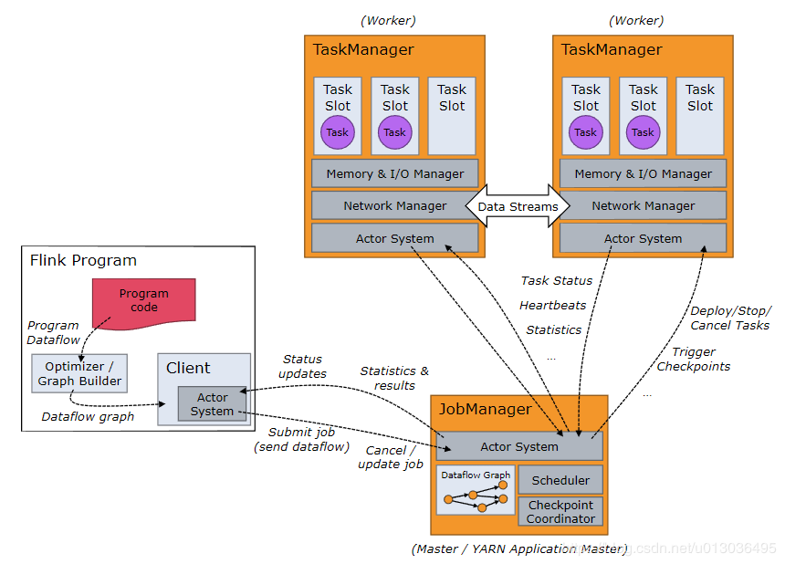

### Flink任务提交源码：Job提交run()
①-->CliFrontend{}.main()-->cli.parseParameters(args)
②-->CliFrontend{}.parseParameters(String[] args) {}-->run(params);
③-->CliFrontend{}.run()-->runProgram(customCommandLine, commandLine, runOptions, program);
④-->CliFrontend{}.runProgram()-->program = buildProgram(runOptions);-->executeProgram(program, client, userParallelism);
⑤-->CliFrontend{}.executeProgram()-->client.run(program, parallelism);
⑥-->ClusterClient{}.run()-->getOptimizedPlan(compiler, jobWithJars, parallelism);-->JobSubmissionResult run(PackagedProgram prog, int parallelism)-->run(optPlan, jobWithJars.getJarFiles(), jobWithJars.getClasspaths(), classLoader, savepointSettings);
⑦-->【重点】ClusterClient{}.getOptimizedPlan(compiler, jobWithJars, parallelism)
⑧-->【重点】JobSubmissionResult run(PackagedProgram prog, int parallelism)
⑨-->【重点】ClusterClient{}.run(optPlan, jobWithJars.getJarFiles(), jobWithJars.getClasspaths(), classLoader, savepointSettings);
```java
CliFrontend{}.main{
//7. 根据命令行参数进行配置，运行程序，获取程序执行的运行码
//运行CliFronted的parseParameters方法，解析命令行参数，运行具体的action
int retCode = SecurityUtils.getInstalledContext()
        .runSecured(() -> cli.parseParameters(args));
//根据命令行参数进行Switch case匹配，执行对应的action,回调，并返回状态码
}
```
CliFrontend{}.parseParameters()
```java
//分析命令行参数进行，并启动请求的操作
public int parseParameters(String[] args) {
    // get action 提取执行动作，比如run, list,cancel
    String action = args[0];
    // remove action from parameters 从参数中移出执行动作，空间换时间，线程安全
    final String[] params = Arrays.copyOfRange(args, 1, args.length)
    case ACTION_RUN:
        run(params);
}
```
CliFrontend{}.run()
```java
protected void run(String[] args) throws Exception {
    LOG.info("Running 'run' command.");
    //获取配置信息
    final Options commandOptions = CliFrontendParser.getRunCommandOptions();
    final Options commandLineOptions = CliFrontendParser.mergeOptions(commandOptions, customCommandLineOptions);
    final CommandLine commandLine = CliFrontendParser.parse(commandLineOptions, args, true);
    final RunOptions runOptions = new RunOptions(commandLine);

    /**
     * 3. 创建PackagedProgram对象，org.apache.flink.client.program.PackagedProgram类用于在用户指定的jar包中
     * （1）选择程序入口即mainfiest函数
     * （2）解析客户代码获取任务拓扑图
     * （3）提取嵌套库
     * 在这里是去寻找用户的程序入口
     */
    final PackagedProgram program;
    LOG.info("Building program from JAR file");
    program = buildProgram(runOptions);

    final CustomCommandLine<?> customCommandLine = getActiveCustomCommandLine(commandLine);
    try {
        //4.【重点】执行任务程序，调用runProgram方法，将之前准备好的用户程序入口，配置项穿入方法中，运行程序
        runProgram(customCommandLine, commandLine, runOptions, program);
    } finally {
        //删除为了打包所创建的临时文件
        program.deleteExtractedLibraries();
    }
}
```
CliFronted{}.runProgram()
```java
private <T> void runProgram( CustomCommandLine<T> customCommandLine,CommandLine commandLine,RunOptions runOptions, PackagedProgram program) {
//根据用户命令行参数，创建ClusterDescriptor，ClusterDescriptor是一个集群属性的描述
//用于部署（例如：yarn）并且返回一个与集群通信的客户端
final ClusterDescriptor<T> clusterDescriptor = customCommandLine.createClusterDescriptor(commandLine);
    final T clusterId = customCommandLine.getClusterId(commandLine);
    //集群客户端，ClusterClient封装了提交一个程序到远程集群的必要功能
    final ClusterClient<T> client;
    //使用正常方式进行提交
    //1. 创建shutdownHook,用于关闭cluster,在非分离模式下，需要使用shutdownHook在client退出后关闭cluster
    final Thread shutdownHook;
    client = clusterDescriptor.retrieve(clusterId);
    shutdownHook = null;
    try {
        client.setPrintStatusDuringExecution(runOptions.getStdoutLogging());
        client.setDetached(runOptions.getDetachedMode());
        LOG.debug("{}", runOptions.getSavepointRestoreSettings());
        int userParallelism = runOptions.getParallelism();

        // 执行程序核心逻辑--调用executeProgram方法去执行程序
        executeProgram(program, client, userParallelism);
    } finally {
        client.shutdown();
    }
}
```

CliFronted{}.executeProgram()
```java
protected void executeProgram(PackagedProgram program, ClusterClient<?> client, int parallelism) throws ProgramMissingJobException, ProgramInvocationException {
    logAndSysout("Starting execution of program");

    //执行任务
    final JobSubmissionResult result = client.run(program, parallelism);

    //判断是否返回了任务程序执行的结果，即代表任务正常执行完了
}
```
ClusterClient{}.run(PackagedProgram prog, int parallelism）执行的是：从CliFronted中运行一个用户自定义的jar包来运行任务程序。运行模式有阻塞（blocking)模式和分离（detached）模式。
```java
public JobSubmissionResult run(PackagedProgram prog, int parallelism){
    final ClassLoader contextClassLoader = Thread.currentThread().getContextClassLoader();
    Thread.currentThread().setContextClassLoader(prog.getUserCodeClassLoader());

    //1、如果程序指定了执行入口
    if (prog.isUsingProgramEntryPoint()) {
        final JobWithJars jobWithJars = prog.getPlanWithJars();
        //执行主逻辑
        return run(jobWithJars, parallelism, prog.getSavepointSettings());
    }
    finally {
        Thread.currentThread().setContextClassLoader(contextClassLoader);
    }
}
```
ClusterClient{}.run()客户端连接Flink集群，在Flink集群中运行程序，调用将一致阻塞，直到执行结果返回,  **这里重点是优化执行计划怎么生成的。**
```java
public JobSubmissionResult run(JobWithJars jobWithJars, int parallelism, SavepointRestoreSettings savepointSettings){
    //1.获取类加载器
    ClassLoader classLoader = jobWithJars.getUserCodeClassLoader();

    //2.得到优化后的执行计划【重点】
    OptimizedPlan optPlan = getOptimizedPlan(compiler, jobWithJars, parallelism);

    //3.执行优化后的计划
    return run(optPlan, jobWithJars.getJarFiles(), jobWithJars.getClasspaths(), classLoader, savepointSettings);
}
```
以上ClusterClient.java中的两个run()方法中最重要的就是
```java
//2.得到优化后的执行计划【重点】
OptimizedPlan optPlan = getOptimizedPlan(compiler, jobWithJars, parallelism);
```
```java
// 得到JobGraph【重点】
JobGraph job = getJobGraph(flinkConfig, compiledPlan, libraries, classpaths, savepointSettings);
// 提交任务执行【重点】
return submitJob(job, classLoader);
```
接下来就针对getOptimizedPlan()、getJobGraph()、submitJob()三个方法做详细的分析。

### getOptimizedPlan()、getJobGraph()、submitJob()三个方法做详细的分析
#### getOptimizedPlan()
Creates the optimized plan for a given program, using this client's compiler.
```java
ClusterClient.java
private static OptimizedPlan getOptimizedPlan(Optimizer compiler, JobWithJars prog, int parallelism){
    return getOptimizedPlan(compiler, prog.getPlan(), parallelism);
}
```
```java
public static OptimizedPlan getOptimizedPlan(Optimizer compiler, Plan p, int parallelism) {
    return compiler.compile(p);
}
```
Translates the given program to an OptimizedPlan, where all nodes have their local strategy assigned and all channels have a shipping strategy assigned.
```java
Optimizer.java
public OptimizedPlan compile(Plan program) throws CompilerException {
    final OptimizerPostPass postPasser = getPostPassFromPlan(program);
    return compile(program, postPasser);
}
```
```java
private OptimizerPostPass getPostPassFromPlan(Plan program) {
    //在plan.java的getPostPassClassName中return "org.apache.flink.optimizer.postpass.JavaApiPostPass";
    final String className = program.getPostPassClassName();

    Class<? extends OptimizerPostPass> clazz = Class.forName(className).asSubclass(OptimizerPostPass.class);
    //即返回JavaApiPostPass 的实例
    return InstantiationUtil.instantiate(clazz, OptimizerPostPass.class
    }
}
```
```java

```
run -m yarn-cluster -yn 2 -j /usr/local/Cellar/apache-flink/1.9.1/libexec/examples/streaming/Twitter.jar —ytm 1024 -yst 4 -yjm 1024 —yarnname TwitterExample

flink run -c org.apache.flink.streaming.examples.twitter.TwitterExample /usr/local/Cellar/apache-flink/1.9.1/libexec/examples/streaming/Twitter.jar

flink run  /usr/local/Cellar/apache-flink/1.9.1/libexec/examples/streaming/WordCount.jar

flink run /usr/local/Cellar/apache-flink/1.9.1/libexec/examples/streaming/WordCount.jar -input ~/workspace/Data/Flink/test.txt  -output /Users/liaomengjie/workspace/myCode/data/flink/flink01.txt


flink run WordCount.jar
flink run  WordCount.jar -input ~/workspace/Data/Flink/test.txt  -output ~/workspace/Data/Flink/flink01.txt


 run -m yarn-cluster -yn 2 -j /usr/local/Cellar/apache-flink/1.9.1/libexec/examples/streaming/Twitter.jar —ytm 1024 -yst 4 -yjm 1024

 org.apache.flink.streaming.examples.twitter.TwitterExample /usr/local/Cellar/apache-flink/1.9.1/libexec/examples/streaming/Twitter.jar


run -c org.apache.flink.streaming.examples.wordcount.WordCount /usr/local/Cellar/apache-flink/1.9.1/libexec/examples/streaming/WordCount.jar -input ~/workspace/Data/Flink/test.txt -output /Users/liaomengjie/workspace/myCode/data/flink/flink01.txt

flink run -c com.pianpianboy.metric.CustomerMeterMetrics -m yarn-cluster /Users/liaomengjie/workspace/myCode/5flink/Flink11/target/Flink11-1.0-SNAPSHOT.jar

flink run -c com.pianpianboy.metric.CustomerMeterMetrics  /Users/liaomengjie/workspace/myCode/5flink/Flink11/target/Flink11-1.0-SNAPSHOT.jar


#### getJobGraph()
#### submitJob()

#### 总结
#####对Flink的作业提交过程进行简单介绍
用户写完的代码，会被转化为plan，之后plan被会被优化OptimizedPlan，并转化成JobGraph，得到JobGraph后，Client会将JobGraph提交给JobManager，由JobManager将JobGraph转化为ExecutionGraph，之后再ExecutionGraph中的各个Task部署到各个salve上，进行计算。计算过程为：

jar->program->Plan->OptimizedPlan->JobGraph->ExecutionGraph->执行

其中Plan到生成JobGraph都是Client端完成的，之后则是JobManager和TaskManager完成



##### 源码调用栈的仔细分析
stand-alone提交的堆栈
```java
at org.apache.flink.client.program.rest.RestClusterClient.submitJob(RestClusterClient.java:261)
    at org.apache.flink.client.program.ClusterClient.run(ClusterClient.java:486)
    at org.apache.flink.client.program.ClusterClient.run(ClusterClient.java:474)
    at org.apache.flink.client.program.ContextEnvironment.execute(ContextEnvironment.java:62)
    at org.apache.flink.api.java.ExecutionEnvironment.execute(ExecutionEnvironment.java:817)
    at org.apache.flink.api.java.DataSet.collect(DataSet.java:413)
    at org.apache.flink.api.java.DataSet.print(DataSet.java:1652)
    at org.apache.flink.examples.java.wordcount.WordCount.main(WordCount.java:88)
    at sun.reflect.NativeMethodAccessorImpl.invoke0(Native Method)
    at sun.reflect.NativeMethodAccessorImpl.invoke(NativeMethodAccessorImpl.java:62)
    at sun.reflect.DelegatingMethodAccessorImpl.invoke(DelegatingMethodAccessorImpl.java:43)
    at java.lang.reflect.Method.invoke(Method.java:498)
    at org.apache.flink.client.program.PackagedProgram.callMainMethod(PackagedProgram.java:529)
    at org.apache.flink.client.program.PackagedProgram.invokeInteractiveModeForExecution(PackagedProgram.java:421)
    at org.apache.flink.client.program.ClusterClient.run(ClusterClient.java:426)
    at org.apache.flink.client.cli.CliFrontend.executeProgram(CliFrontend.java:816)
    at org.apache.flink.client.cli.CliFrontend.runProgram(CliFrontend.java:290)
    at org.apache.flink.client.cli.CliFrontend.run(CliFrontend.java:216)
    at org.apache.flink.client.cli.CliFrontend.parseParameters(CliFrontend.java:1053)
    at org.apache.flink.client.cli.CliFrontend.lambda$main$11(CliFrontend.java:1129)
    at org.apache.flink.client.cli.CliFrontend.main(CliFrontend.java:1129)
```
**入口分析：**
```java
bin/flink run  examples/batch/WordCount.jar
```
接着会在bin/flink shell脚本中找到提交的主类org.apache.flink.client.cli.CliFrontend。我们从CliFrontend的main函数开始

**源码分析**
```java
cli.parseParameters(args));// 解析参数+提交
==> 然后进到parseParameters方法，执行到switch case ACTION_RUN
1 ==> run(params); ==> runProgram ==>

2 ==>
if (isNewMode && clusterId == null && runOptions.getDetachedMode()) {//yarn per job -d模式
 ...
} else {
    if (clusterId != null) {//standalone -d模式 和 yarn-session模式
        client = clusterDescriptor.retrieve(clusterId);
        shutdownHook = null;
    } else {//job有多部分组成
    }
}

==>我们一个个看，先看yarn per job模式
clusterDescriptor.deployJobCluster ==》 YarnClusterDescriptor.deployJobCluster() ==> AbstractYarnClusterDescriptor.deployInternal
==》 startAppMaster ==》yarnClient.submitApplication(appContext); 最后返回一个 ClusterClient<ApplicationId> ==> client关闭

==>接着看stand-alone模式
clusterDescriptor.retrieve(clusterId); ===> StandaloneClusterDescriptor.retrieve 返回一个 RestClusterClient<StandaloneClusterId>类型的client

==>和yarn-session模式,yarn sesion模式 app已经启动，这里只需要通过 appid获取相关的appmaster 的 ip port ，返回一个ClusterClient<ApplicationId>类型的 client
clusterDescriptor.retrieve(clusterId); ===> AbstractYarnClusterDescriptor.retrieve ===> createYarnClusterClient  ===> return  ClusterClient<ApplicationId>

3 ===> 接着往下看到 executeProgram(program, client, userParallelism);
===》 JobSubmissionResult result = client.run(program, parallelism); //此时是RestClusterClient 提交任务
===》 prog.invokeInteractiveModeForExecution();  //反射调用 wordcount的main 函数
===》 执行到DataSet.print 会触发 ExecutionEnvironment.execute()执行 ，实际调用的是ContextEnvironment.execute()方法
===》调用ClusterClient.run方法，最后会调用RestClusterClient.submitJob()方法，将jobGraph 用rest请求提交到JobManager,至此客户端提交完成。

```


```java
name : CliFrontend
run -c com.pianpianboy.metric.CustomerMeterMetrics -m yarn-cluster /Users/liaomengjie/workspace/myCode/5flink/Flink11/target/Flink11-1.0-SNAPSHOT.jar

/Users/liaomengjie/workspace/OtherGit/flink
FLINK_CONF_DIR=/usr/local/Cellar/apache-flink/1.9.1/libexec/conf
```
```java
flink-taskManager
localhost 5006
-agentlib:jdwp=transport=dt_socket,server=y,suspend=n,address=5006
--------------
flink-jobmanager
localhost 5005
-agentlib:jdwp=transport=dt_socket,server=y,suspend=n,address=5005
flink-rumtime_2.11
```


