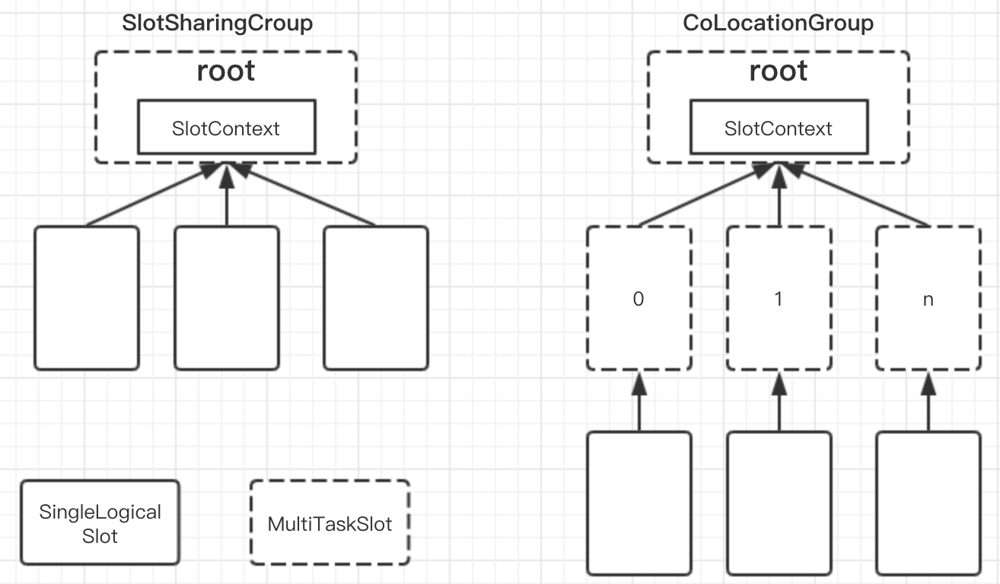

## Flink原理（三）-- Task(任务)、Operator Chain(算子链) 和Slot(资源)

### 一、Task 和 Operator Chains以及Subtask
Flink会在生成JobGraph阶段，将代码中可以优化的算子优化成一个算子链(Operator Chains)以放到一个task(一个线程) 中执行，以减少线程之间的切换和缓冲的开销，提高整体的吞吐量和延迟。如下图所示：

图中，source、map、[keyBy|window|apply]、sink算子的并行度分别是2、2、2、2、1，经过Flink优化后，source和map算子组成一个算子链，作为一个task运行在一个线程上，其简图如图中condensed view所示，并行图如parallelized view所示。

**算子之间是否可以组成一个Operator Chains,看是否满足以下条件：**

- 上下游算子的并行度一致
- 下游节点的入度为1
- 上下游节点都在同一个slot group中
- 下游节点的 chain 策略为 ALWAYS（可以与上下游链接，map、flatmap、filter等默认是ALWAYS）
- 上游节点的 chain 策略为 ALWAYS 或 HEAD（只能与下游链接，不能与上游链接，Source默认是HEAD）
- 两个节点间数据分区方式是 forward
- 用户没有禁用 chain（代码中是否配置disableChain()）

### 二、Task Slot 和resource
我们可以知道Flink任务在Flink集群中的分布应如下图所示：

图中，有两个节点（TaskManager,即两个进程），每个节点中有3个slot，每一个task(一个Thread)均跑在一个slot中。

但实际上，Flink在默认情况下，只要子任务是来自同一个Job，是允许子任务(subtask,就是类似source/map,window等)共享一个slot的，即使是不同任务的子任务也是可以共享一个slot，这样有两个好处：

1. 一个Job的最高并行度就是Flink集群中的slot个数，这样我们就不需要计算一个程序可以包含多个task；而且也能将task数量和slot数量进行解耦。
2. 可以获得更好的资源的利用率。若没有slot共享，像source/Map这种不是非常耗资源的算子（官网上是说非资源密集型、non-intensive）就和window这种非常耗资源的算子占用相同多的资源(一个slot)。

上图若是允许slot共享，则上图中集群最大的并行度为6，如下图3所示：

在可以共享slot的情况下，较耗费资源的subtask就可以比较均匀的分布在Flink集群中的taskManager上，什么意思？如图3：类似window的算子均匀的分布在每个slot中。

在第二张图中，仅在两个slot中，从第三张图中我们可以看出一个slot中可以运行多个Thread.

