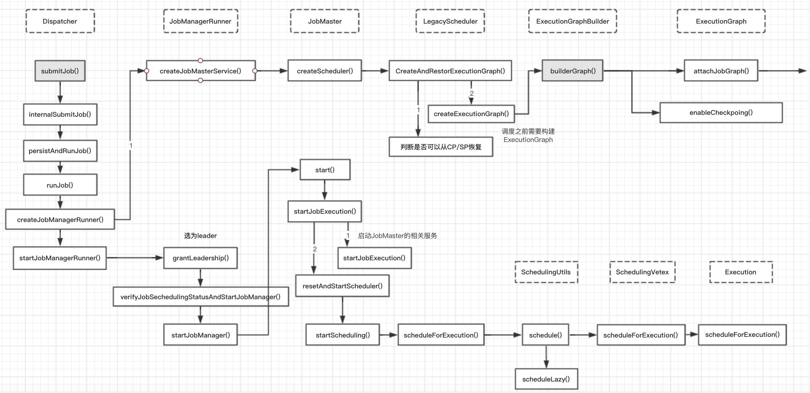
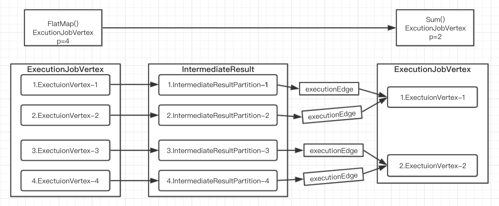
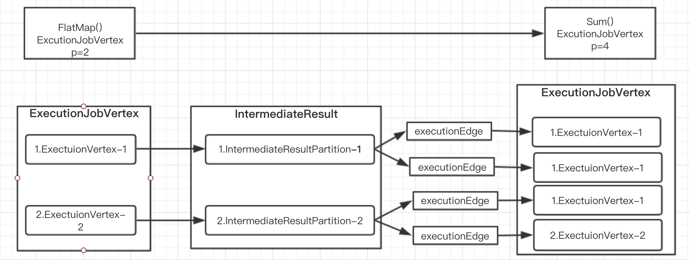
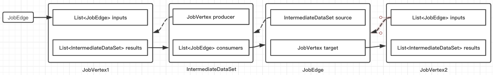
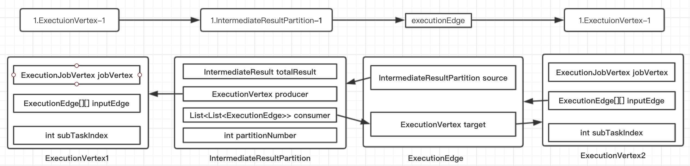
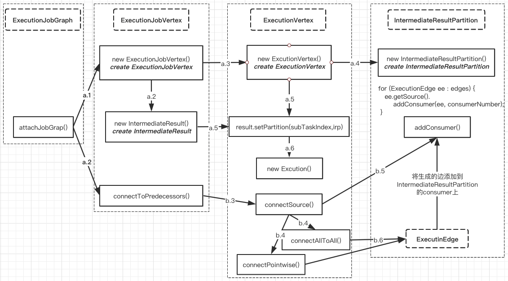
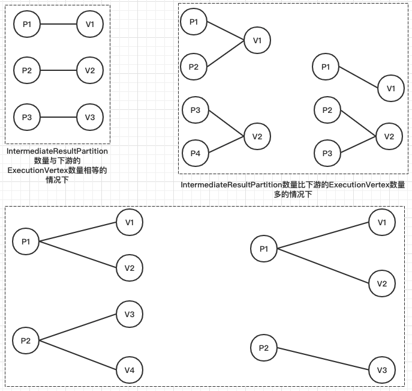

### Flink如何生成ExecutionGraph
- 简介
- Create ExecutionGraph的整体流程
- 具体实现逻辑
    + 基本概念
    + 创建ExecutionVertex对象
    + 创建ExecutionEdge
- 总结

#### 简介
即介绍了Transformation生成StreamGraph和StreamGraph生成JobGraph之后，本文继续介绍JobGraph生成ExecutionGraph。

我们知道StreamGraph和JobGraph都是在client端生成的。当JobGraph从client端提交到JobManager端后，JobManager会根据JobGraph生成对应的ExecutionGraph,ExecutionGraph是Flink作业调度时使用到的核心数据结构，他包含每一个并行的task、每一个intermediate stream以及他们之间的关系。

##### Create ExecutionGraph的整体流程
当用户用户向一个Flink集群提交一个作业之后，JobManager会接受到Client相应的请求，JobManager会先做一个初始化相关的操作（也就是JobGraph到ExecutionGraph的转化），当这个转化完成之后，才会根据ExecutionGraph真正在分布式环境中调度当前这个作业，而JobManager端处理的整体流程如下：



***上图是一个作业提交后，在Jobmanager端的处理流程。***本篇文章主要聚焦于ExecutionGraph的生成过程，即ExecutionGraphBuilder 的buildGraph()方法，这个方法时根据JobGraph以及相关配置来创建ExecutionGraph对象核心方法。

#### 具体实现逻辑
这里将会详细讲述ExecutionGraphBuilder builderGraph()方法的详细实现：

##### 基本概念
理解了下面几个ExecutionGraph中的几个概念能便于理解ExecutionGraph的生成过程。

- **ExecutionJobVertex:** 在ExecutionGraph中，节点对应的是ExecutionJobVertex，它是与JobGraph中的JobVertex一一对应的，实际上ExecutionJobVertex也都是由一个JobVertex生成。
- **ExecutionVertex:** 在ExecutionJobVertex中有一个taskVertices变量，它是ExecutionVertex类型的数组，ExecutionVertex[] taskVertices; 数组的大小就是JobVertex的并发度，在创建ExecutionJobVertex对象时，会创建相同并发度梳理的ExecutionVertex对象,在真正调度的时候一个ExecutionVertex就是一个task，它是ExecutionJobVertex并行执行的一个子任务；
- **Execution:** Execution是对ExecutionVertex的一次执行，通过ExecutionAttemptId来唯一标识，一个ExecutionVertex在某些情况下可能会执行多次，比如遇到失败的情况或者该task的数据需要重新计算时。
- **IntermediateResult:** 在jobGraph中用IntermediateDataSet表示JobVertex的输出strem，一个JobGraph可能会由多个输出Stream，在ExcutionGraph与之对应的就是IntemediateResult对象。
- **IntermediateResultPartition:** 由于ExecutionJobVertex可能有多个并行的子任务，所以每个IntermediateResult可能就有多个生产者，每个生产者在相应的IntermediateResult上输出对应一个IntermediateResultPartition对象，IntermediateResultPartition表示ExecutionVertex的一个输出分区
- **ExecutionEdge:**ExecutionEdge表示ExecutionVertex的输入，通过ExecutionEdge将ExecutionVertex和IntermediateResultPartition连接起来，进而在ExecutionVertex和IntermediateResultPartition之间建立联系。

从这些基本概念中，也可以看出以下几点：

1. 由于每个JobVertex可能由多个IntermediateDataSet，所以每个ExecutionJobVertex可能会由多个IntermediateResult,因此，每个ExecutionVertex也可能会包含多个IntermediateResultParition;
2. ExecutionEdge这里主要的作用是把ExecutionVertex和IntermediateResultPartition连接起来，表示它们之间的连接关系。

测试案例：





JobGraph细节数据结构



ExecutionGraph细节数据结构



##### 实现细节
ExecutionGraph的生成是在ExecutionGraphBuilder的 builderGraph() 方法中实现的：
```java
public static ExecutionGraph buildGraph(
        @Nullable ExecutionGraph prior,
        JobGraph jobGraph,
        Configuration jobManagerConfig,
        ScheduledExecutorService futureExecutor,
        Executor ioExecutor,
        SlotProvider slotProvider,
        ClassLoader classLoader,
        CheckpointRecoveryFactory recoveryFactory,
        Time rpcTimeout,
        RestartStrategy restartStrategy,
        MetricGroup metrics,
        BlobWriter blobWriter,
        Time allocationTimeout,
        Logger log,
        ShuffleMaster<?> shuffleMaster,
        JobMasterPartitionTracker partitionTracker,
        FailoverStrategy.Factory failoverStrategyFactory) throws JobExecutionException, JobException {

    checkNotNull(jobGraph, "job graph cannot be null");

    final String jobName = jobGraph.getName();
    final JobID jobId = jobGraph.getJobID();

    // build jobInformation
    final JobInformation jobInformation = new JobInformation(
        jobId,
        jobName,
        jobGraph.getSerializedExecutionConfig(),
        jobGraph.getJobConfiguration(),
        jobGraph.getUserJarBlobKeys(),
        jobGraph.getClasspaths());

    // Execution: 保留的最大历史数
    final int maxPriorAttemptsHistoryLength =
            jobManagerConfig.getInteger(JobManagerOptions.MAX_ATTEMPTS_HISTORY_SIZE);

    // 决定什么时候释放 IntermediateResultPartitions的策略
    final PartitionReleaseStrategy.Factory partitionReleaseStrategyFactory =
        PartitionReleaseStrategyFactoryLoader.loadPartitionReleaseStrategyFactory(jobManagerConfig);

    // create a new execution graph, if none exists so far
    // 如果executionGraph还不存在，就创建一个新的对象
★    final ExecutionGraph executionGraph;

★    executionGraph = (prior != null) ? prior :
        new ExecutionGraph(
            jobInformation,
            futureExecutor,
            ioExecutor,
            rpcTimeout,
            restartStrategy,
            maxPriorAttemptsHistoryLength,
            failoverStrategyFactory,
            slotProvider,
            classLoader,
            blobWriter,
            allocationTimeout,
            partitionReleaseStrategyFactory,
            shuffleMaster,
            partitionTracker,
            jobGraph.getScheduleMode());

    //以Json的形式记录JobGraph
★    executionGraph.setJsonPlan(JsonPlanGenerator.generatePlan(jobGraph));

    // initialize the vertices that have a master initialization hook
    // file output formats create directories here, input formats create splits
    final long initMasterStart = System.nanoTime();

    // 遍历JobGraph中的每一个结点
    for (JobVertex vertex : jobGraph.getVertices()) {
        String executableClass = vertex.getInvokableClassName();
        //对于 InputOutputFormatVertex类型的对象，会在master节点做一些额外的初始化工作
        vertex.initializeOnMaster(classLoader);
    }

    // 这里会先做一个排序，source会放在最前面，接着开始遍历，必须保证当前添加到集合的节点的前置节点已经添加过
★    List<JobVertex> sortedTopology = jobGraph.getVerticesSortedTopologicallyFromSources();
    //【重点】：生成具体的Execution Plan
★★    executionGraph.attachJobGraph(sortedTopology);

    if (log.isDebugEnabled()) {
        log.debug("Successfully created execution graph from job graph {} ({}).", jobName, jobId);
    }
    // configure the state checkpointing
    JobCheckpointingSettings snapshotSettings = jobGraph.getCheckpointingSettings();
    if (snapshotSettings != null) {
        // checkpoint时 需要trigger(插入barrier)的JobVertex，这里指的是source节点
        List<ExecutionJobVertex> triggerVertices =
                idToVertex(snapshotSettings.getVerticesToTrigger(), executionGraph);
        // checkpoint时 需要向master返回ack信息的jobVertex节点的集合
        List<ExecutionJobVertex> ackVertices =
                idToVertex(snapshotSettings.getVerticesToAcknowledge(), executionGraph);

        List<ExecutionJobVertex> confirmVertices =
                idToVertex(snapshotSettings.getVerticesToConfirm(), executionGraph);

        CompletedCheckpointStore completedCheckpoints;
        CheckpointIDCounter checkpointIdCounter;
        try {
            int maxNumberOfCheckpointsToRetain = jobManagerConfig.getInteger(
                    CheckpointingOptions.MAX_RETAINED_CHECKPOINTS);

            if (maxNumberOfCheckpointsToRetain <= 0) {
                // warning and use 1 as the default value if the setting in
                // state.checkpoints.max-retained-checkpoints is not greater than 0.
                log.warn("The setting for '{} : {}' is invalid. Using default value of {}",
                        CheckpointingOptions.MAX_RETAINED_CHECKPOINTS.key(),
                        maxNumberOfCheckpointsToRetain,
                        CheckpointingOptions.MAX_RETAINED_CHECKPOINTS.defaultValue());

                maxNumberOfCheckpointsToRetain = CheckpointingOptions.MAX_RETAINED_CHECKPOINTS.defaultValue();
            }

            completedCheckpoints = recoveryFactory.createCheckpointStore(jobId, maxNumberOfCheckpointsToRetain, classLoader);
            checkpointIdCounter = recoveryFactory.createCheckpointIDCounter(jobId);
        }
        // Maximum number of remembered checkpoints
        // Checkpoint保存的最大数量
        int historySize = jobManagerConfig.getInteger(WebOptions.CHECKPOINTS_HISTORY_SIZE);

        CheckpointStatsTracker checkpointStatsTracker = new CheckpointStatsTracker(
                historySize,
                ackVertices,
                snapshotSettings.getCheckpointCoordinatorConfiguration(),
                metrics);

        // load the state backend from the application settings
        // 加载 state backend
        final StateBackend applicationConfiguredBackend;
        final SerializedValue<StateBackend> serializedAppConfigured = snapshotSettings.getDefaultStateBackend();

        if (serializedAppConfigured == null) {
            applicationConfiguredBackend = null;
        }
        else {
            applicationConfiguredBackend = serializedAppConfigured.deserializeValue(classLoader);
        }

        final StateBackend rootBackend;
        try {
            rootBackend = StateBackendLoader.fromApplicationOrConfigOrDefault(
                    applicationConfiguredBackend, jobManagerConfig, classLoader, log);
        }
        // instantiate the user-defined checkpoint hooks
        // 对用户自定义的checkpoint hooks进行实例化
        final SerializedValue<MasterTriggerRestoreHook.Factory[]> serializedHooks = snapshotSettings.getMasterHooks();
        final List<MasterTriggerRestoreHook<?>> hooks;

        if (serializedHooks == null) {
            hooks = Collections.emptyList();
        }
        else {
            final MasterTriggerRestoreHook.Factory[] hookFactories;
            hookFactories = serializedHooks.deserializeValue(classLoader);
            final Thread thread = Thread.currentThread();
            final ClassLoader originalClassLoader = thread.getContextClassLoader();
            thread.setContextClassLoader(classLoader);

            try {
                hooks = new ArrayList<>(hookFactories.length);
                for (MasterTriggerRestoreHook.Factory factory : hookFactories) {
                    hooks.add(MasterHooks.wrapHook(factory.create(), classLoader));
                }
            }
            finally {
                thread.setContextClassLoader(originalClassLoader);
            }
        }

        final CheckpointCoordinatorConfiguration chkConfig = snapshotSettings.getCheckpointCoordinatorConfiguration();
        // 创建CheckpointCoordinator对象
        executionGraph.enableCheckpointing(
            chkConfig,
            triggerVertices,
            ackVertices,
            confirmVertices,
            hooks,
            checkpointIdCounter,
            completedCheckpoints,
            rootBackend,
            checkpointStatsTracker);
    }
    // create all the metrics for the Execution Graph
    metrics.gauge(RestartTimeGauge.METRIC_NAME, new RestartTimeGauge(executionGraph));
    metrics.gauge(DownTimeGauge.METRIC_NAME, new DownTimeGauge(executionGraph));
    metrics.gauge(UpTimeGauge.METRIC_NAME, new UpTimeGauge(executionGraph));

    executionGraph.getFailoverStrategy().registerMetrics(metrics);

    return executionGraph;
}
```
在这个方法理，会先创建一个ExecutionGraph对象，然后对JobGraph中的JobVertex列表做以下排序（先把有Source节点JobVertex放在最前面，然后开始遍历，只有JobVertex的前置节点都已经添加到集合后才能把当前JobVertex节点添加到集合中），最后通过attachJobGraph()方法生成具体的Execution Plan。

ExecutionGraph 的attachJobGraph() 方法会将这个作业的ExecutionGraph构建出来，它会根据JobGraph创建相应的ExecutionJobVertex、IntermediateResult,ExecutionVertex、ExecutionEdge、IntermediateResultPartition，其详细的执行逻辑如下图所示：

```java
ExecutionGraph.java
attachJobGraph(List<JobVertex> topologiallySorted)//根据JobGraph生成ExectionGraph
//创建ExecutionJobVertex、ExecutionVertex、IntermediateResult、IntermediateResultPartition
-- ExecutionJobVertex ejv = new ExecutionJobVertex()
//创建ExecutionEdge，并使用ExecutionEdge将ExecutionVertex和IntermediateResultPatition连接起来
-- ejv.connectToPredecessors(this.intermediateResults);
-- -->ExecutionJobVertex{}.ExecutionJobVertex()
-- -- -- new ExecutionVertex[numTaskVertices];
-- -- -- this.producedDataSets = new IntermediateResult[];//创建IntermediateResult对象数组
-- -- -- this.producedDataSets[i] = new IntermediateResult()//将jobGraph中IntermediateDataset转变成IntermediateResult
-- -- -- ExecutionVertex vertex = new ExecutionVertex()//根据并行度循环生成ExecutionVertex
-- -- -- --> ExecutionVertex{}.ExecutionVertex()
-- -- -- -- --IntermediateResultPartition irp = new IntermediateResultPartition(result, this, subTaskIndex);
//记录IntermediateResult与IntermediateResultPartition之间的关系
-- -- -- -- --result.setPartition(subTaskIndex, irp);

-- -- ExecutionJobGraph{}.connectTpProcessors()创建对应的ExecutionEdge对象，ExecutionEdge对象会将ExecutionVertex与IntermediateResultPartition连接起来，
-- -- -- ev.connectSource(num, ires, edge, consumerIndex);
-- -- -- --> ExecutionVertex{}.connectSource()
```
将上述的代码流程画成图之后如下所示：



下面来看具体的代码实现

##### 创建ExecutionJobVertex对象
```java
// 根据JobGraph生成ExecutionGraph
public void attachJobGraph(List<JobVertex> topologiallySorted) {
    assertRunningInJobMasterMainThread();

    final ArrayList<ExecutionJobVertex> newExecJobVertices = new ArrayList<>(topologiallySorted.size());
    final long createTimestamp = System.currentTimeMillis();

    for (JobVertex jobVertex : topologiallySorted) {
        if (jobVertex.isInputVertex() && !jobVertex.isStoppable()) {
            this.isStoppable = false;
        }
        // create the execution job vertex and attach it to the graph
        // 创建ExecutionJobVertex，并将其加入到graph中
★        ExecutionJobVertex ejv = new ExecutionJobVertex(
                this,
                jobVertex,
                1,
                maxPriorAttemptsHistoryLength,
                rpcTimeout,
                globalModVersion,
                createTimestamp);

★        ejv.connectToPredecessors(this.intermediateResults);

        ExecutionJobVertex previousTask = this.tasks.putIfAbsent(jobVertex.getID(), ejv);
        if (previousTask != null) {
            throw new JobException(String.format("Encountered two job vertices with ID %s : previous=[%s] / new=[%s]",
                jobVertex.getID(), ejv, previousTask));
        }

        for (IntermediateResult res : ejv.getProducedDataSets()) {
            IntermediateResult previousDataSet = this.intermediateResults.putIfAbsent(res.getId(), res);
            }
        }

        this.verticesInCreationOrder.add(ejv);
        this.numVerticesTotal += ejv.getParallelism();
        newExecJobVertices.add(ejv);
    }

    executionTopology = new DefaultExecutionTopology(this);
    failoverStrategy.notifyNewVertices(newExecJobVertices);
    partitionReleaseStrategy = partitionReleaseStrategyFactory.createInstance(getSchedulingTopology());
}
```
它主要做了以下工作：

1. 根据这个JobVertex的results(IntermediateDataSet列表)来创建相应的IntermediateResult对象，每个IntermediateDataSet都会对应一个IntermediateResult;
2. 在根据这个JobVertex的并行度，来创建相同数量的ExecutionVertex对象，每个ExecutionVertex对象在调度时实际上就是一个task任务；
3. 在创建IntermediateResult和ExecutionVertex对象时都会记录它们之间的关系。他们之间的关系见第二张图

##### 创建ExecutionVertex对象
```java
public ExecutionJobVertex(
            ExecutionGraph graph,
            JobVertex jobVertex,
            int defaultParallelism,
            int maxPriorAttemptsHistoryLength,
            Time timeout,
            long initialGlobalModVersion,
            long createTimestamp) throws JobException {

    this.graph = graph;
    this.jobVertex = jobVertex;

    // 并发度
    int vertexParallelism = jobVertex.getParallelism();
    int numTaskVertices = vertexParallelism > 0 ? vertexParallelism : defaultParallelism;

    final int configuredMaxParallelism = jobVertex.getMaxParallelism();

    this.maxParallelismConfigured = (VALUE_NOT_SET != configuredMaxParallelism);

    // if no max parallelism was configured by the user, we calculate and set a default
    setMaxParallelismInternal(maxParallelismConfigured ?
            configuredMaxParallelism : KeyGroupRangeAssignment.computeDefaultMaxParallelism(numTaskVertices));

    this.parallelism = numTaskVertices;
    this.resourceProfile = ResourceProfile.fromResourceSpec(jobVertex.getMinResources(), MemorySize.ZERO);

    //taskVertices 记录这个task 每个并发
    this.taskVertices = new ExecutionVertex[numTaskVertices];
    this.operatorIDs = Collections.unmodifiableList(jobVertex.getOperatorIDs());
    this.userDefinedOperatorIds = Collections.unmodifiableList(jobVertex.getUserDefinedOperatorIDs());
    // 记录jobVertex输入的IntermediateResult列表
    this.inputs = new ArrayList<>(jobVertex.getInputs().size());

    // take the sharing group
    this.slotSharingGroup = jobVertex.getSlotSharingGroup();
    this.coLocationGroup = jobVertex.getCoLocationGroup();

    // create the intermediate results
    // 创建IntermediateResult对象数组（根据JobVertex的targets来确定）
★    this.producedDataSets = new IntermediateResult[jobVertex.getNumberOfProducedIntermediateDataSets()];

    for (int i = 0; i < jobVertex.getProducedDataSets().size(); i++) {
        //JobGraph中的IntermediateDataSet 这里会转换为IntermediateResult对象
        final IntermediateDataSet result = jobVertex.getProducedDataSets().get(i);
        //这里一个IntermediateDataSet 会对应一个IntermediateResult
★        this.producedDataSets[i] = new IntermediateResult(
                result.getId(),
                this,
                numTaskVertices,
                result.getResultType());
    }
    // create all task vertices
    // task vertices创建，一个JobVertex/ExecutionJobVertex代表一个operator chain，而具体的ExecutionVertex则代表了每一个task
    for (int i = 0; i < numTaskVertices; i++) {
★        ExecutionVertex vertex = new ExecutionVertex(
                this,
                i,
                producedDataSets,
                timeout,
                initialGlobalModVersion,
                createTimestamp,
                maxPriorAttemptsHistoryLength);

        this.taskVertices[i] = vertex;
    }
    // set up the input splits, if the vertex has any
    try {
        @SuppressWarnings("unchecked")
        InputSplitSource<InputSplit> splitSource = (InputSplitSource<InputSplit>) jobVertex.getInputSplitSource();

        if (splitSource != null) {
            Thread currentThread = Thread.currentThread();
            ClassLoader oldContextClassLoader = currentThread.getContextClassLoader();
            currentThread.setContextClassLoader(graph.getUserClassLoader());
            try {
                inputSplits = splitSource.createInputSplits(numTaskVertices);

                if (inputSplits != null) {
                    splitAssigner = splitSource.getInputSplitAssigner(inputSplits);
                }
            } finally {
                currentThread.setContextClassLoader(oldContextClassLoader);
            }
        }
        else {
            inputSplits = null;
        }
    }
}
```
ExecutionVertex创建时，主要做了下面这三件事：

1. 创建IntermediateResultPartition：根据这个ExecutionJobVertex的producedDataSets（IntermediateResult类型的数组），给每个ExecutionVertex创建相应的IntermediateResultPartition对象，它代表了一个IntermediateResult分区
2. 记录IntermediateResult与IntermediateResultPartition之间的关系：调用IntermediateResult的setPartition()方法，记录IntermediateResult与IntermediateResultPartition之间的关系。
3. 给这个ExecutionVertex创建一个Execution对象，如果这个ExecutionVertex被重新调度(失败重新恢复等情况)，那么Execution对应的attemptNumber将会自增加1，这里初始化的时候值为0

##### 创建ExecutionEdge
根据前面的流程图，接下来，看下ExecutionJobVertex的connectToPredecessors()方法。在这个方法中，主要的工作是创建对应的ExecutionEdge对象，并使用这个对象将ExecutionVertex和IntermediateResultPartition连接起来，ExecutionEdge的成员变量比较简单，如下所示：
```java
public class ExecutionEdge {
    private final IntermediateResultPartition source;
    private final ExecutionVertex target;
    private final int inputNum;
}
```
ExecutionEdge的创建是在ExecutionVertex中的connectSource()方法中实现，代码如下：
```java
// 与上游节点连在一起
public void connectSource(int inputNumber, IntermediateResult source, JobEdge edge, int consumerNumber) {

    final DistributionPattern pattern = edge.getDistributionPattern();
    final IntermediateResultPartition[] sourcePartitions = source.getPartitions();

    ExecutionEdge[] edges;

    // 只有forward/RESCALE的方式的情况下，pattern才是POINTWISE的，否则均为ALL_TOALL
    switch (pattern) {
        case POINTWISE:
            edges = connectPointwise(sourcePartitions, inputNumber);
            break;
        //它会连接上游所有的 IntermediateResultPartition
        case ALL_TO_ALL:
            edges = connectAllToAll(sourcePartitions, inputNumber);
            break;

        default:
            throw new RuntimeException("Unrecognized distribution pattern.");

    }

    inputEdges[inputNumber] = edges;

    // add the consumers to the source
    // for now (until the receiver initiated handshake is in place), we need to register the
    // edges as the execution graph
    for (ExecutionEdge ee : edges) {
        ee.getSource().addConsumer(ee, consumerNumber);
    }
}
```
在创建ExecutionEdge时，会根据这个JobEdge的DistributionPartiton选择不同的实现，这里要分两种情况，DistributionPattern 是跟Partitioner的配置有关
```java
// StreamingJobGraphGenerator.java
//note: 创建 JobEdge（它会连接上下游的 node）
JobEdge jobEdge;
if (partitioner instanceof ForwardPartitioner || partitioner instanceof RescalePartitioner) {
    jobEdge = downStreamVertex.connectNewDataSetAsInput( //note: 这个方法会创建 IntermediateDataSet 对象
        headVertex,
        DistributionPattern.POINTWISE, //note: 上游与下游的消费模式，（每个生产任务的 sub-task 会连接到消费任务的一个或多个 sub-task）
        resultPartitionType);
} else {
    jobEdge = downStreamVertex.connectNewDataSetAsInput(
            headVertex,
            DistributionPattern.ALL_TO_ALL, //note: 每个生产任务的 sub-task 都会连接到每个消费任务的 sub-task
            resultPartitionType);
}
```
如果 DistributionPattern 是 ALL_TO_ALL 模式，这个 ExecutionVertex 会与 IntermediateResult 对应的所有 IntermediateResultPartition 连接起来，而如果是 POINTWISE 模式，ExecutionVertex 只会与部分的 IntermediateResultPartition 连接起来。POINTWISE 模式下 IntermediateResultPartition 与 ExecutionVertex 之间的分配关系如下图所示，具体的分配机制是跟 IntermediateResultPartition 数与 ExecutionVertex 数有很大关系的，具体细节实现可以看下相应代码，这里只是举了几个示例。



到这里，这个作业的ExecutionGraph就创建完成了，有了ExecutionGraph，JobManager才能对这个作业做相应的调度。

#### 总结
本文讲述了JobGraph如何转换成ExecutionGraph的过程。

简单总结一下：

1. StreamGraph是最原始的用户逻辑，是一个没有做任何优化的DataFlow；
2. JobGraph对StreamGraph做了一些优化，主要是将能够chain在一起的算子Chain在一起了，这样减少了网络shuffle的开销；
3. ExecutionGraph则是作业运行时用来调度的执行图，可以看作是并行化版本的JobGraph，将DAG拆分到基本调度单元


