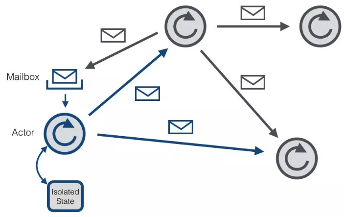

### Flink底层RPC使用的框架和原理
- 1、前言
- 2、Akka介绍
- 3、相关类介绍（王品华）

#### 1、前言
对于Flink中各个组件（JobMaster、TaskManager、Dispatcher）,其底层RPC框架基于AKKA实现，下面着重分析Flink中Rpc框架的实现机制及梳理其通信流程

#### 2、Akka介绍
由于Flink底层Rpc是基于Akka实现的，我们先了解下Akka的基本使用。

Akka是一个开发并发、容错和可伸缩应用的框架。它是Actor Model的一个实现。在Actor模型中，所有的实体被认为是独立的actors。actors和其他actors通过发送异步消息通信，Actor模型的强大来自于异步。它也可以显示等待响应，这使得可以执行同步操作。但是，强烈不建议同步消息，因为他们限制了系统的伸缩性。每个actor有一个邮箱(mailbox)。它收到的消息存储在里面。另外，每一个actor维护自身单独的状态。一个Actors网络如下所示：



每个actor是一个单一的线程，它不断的从其邮箱中poll（拉取）消息，并且连续不断的处理。对于已经处理过的消息的结果，actor可以改变自身的内部撞田，或者发送一个新消息或者孵化一个新的actor。尽管单个actor是自然有序的，但一个包含若干个actor的系统却是高度并发的并且急剧扩展性的。因为处理线程是所有actor之间共享的。这也是我们为什么不该在actor线程里调用可能导致阻塞的"调用"。因为这样的调用可能会阻塞该线程使得他们无法替其他actor处理消息。

##### 2.1、创建Akka系统
Akka系统的核心ActorSystem和Actor，若需构建一个Akka系统，首先需要创建ActorSystem，创建完ActorSystem后，可通过其创建Actor（注意：Akka不允许直接new一个Actor，只能通过 Akka 提供的某些API才能创建或查找Actor，一般会通过ActorSystem#actorOf和ActorContext#actorOf来创建 Actor），另外，我们只能通过ActorRef(Actor的引用，其对原生的Actor实例做了良好的封装，外接不能随意的修改其内部状态)来与Actor进行通信，如下代码展示了如何配置一个Akka系统。
```java
// 1. 构建ActorSystem
// 使用缺省配置
ActorSystem system = ActorSystem.create("sys");
// 也可显示指定appsys配置
// ActorSystem system1 = ActorSystem.create("helloakka", ConfigFactory.load("appsys"));

// 2. 构建Actor,获取该Actor的引用，即ActorRef
ActorRef helloActor = system.actorOf(Props.create(HelloActor.class), "helloActor");

// 3. 给helloActor发送消息
helloActor.tell("hello helloActor", ActorRef.noSender());

// 4. 关闭ActorSystem
system.terminate();
```
在Akka中，创建的每个Actor都有自己的路径，该路径遵循ActorSystem的层级结构，大致如下：
```java
本地：akka://sys/user/helloActor
远程：akka.tcp://sys@127.0.0.1:2020/user/remoteActor
```
其中本地路径含义如下：

sys，创建的ActorSystem的名字；

user，通过ActorSystem#actorOf和ActorContext#actorOf 方法创建的 Actor 都属于/user下，与/user对应的是/system， 其是系统层面创建的，与系统整体行为有关，在开发阶段并不需要对其过多关注

helloActor，我们创建的HelloActor

其中远程部分路径含义如下：

akka.tcp，远程通信方式为tcp；

sys@127.0.0.1:2020，ActorSystem名字及远程主机ip和端口号。

#####2.2、根据path获取Actor
若提供了Actor的路径，可以通过路径获取到ActorRef,然后与之通信，代码如下所示：
```java
ActorSystem system = ActorSystem.create("sys")；
ActorSelection as = system.actorSelection("/path/to/actor");

Timeout timeout = new Timeout(Duration.create(2, "seconds"));
Future<ActorRef> fu = as.resolveOne(timeout);

fu.onSuccess(new OnSuccess<ActorRef>() {
    @Override
public void onSuccess(ActorRef actor) {
        System.out.println("actor:" + actor);
        actor.tell("hello actor", ActorRef.noSender());
    }
}, system.dispatcher());

fu.onFailure(new OnFailure() {
    @Override
public void onFailure(Throwable failure) {
        System.out.println("failure:" + failure);
    }
}, system.dispatcher());
```
由上面可知，若需要与远端Actor通信，路径中必须提供ip:port

##### 2.3、与Actor通信
######2.3.1、tell方式
当使用tell方式时，表示仅仅使用异步方式给某个Actor发送消息，无需等待Actor的响应结果，并且也不会阻塞后续代码的运行，如：
helloActor.tell("hello helloActor",ActorRef.noSender());

其中：第一个参数为消息，它可以是任何可序列化的数据或对象，第二个参数表示发送者，通常来讲是另外一个Actor的引用，ActorRef.noSender()表示无发送者（（实际上是一个 叫做deadLetters的Actor）。

######2.3.1、ask方式
当我们需要从Actor获取响应结果时，可使用ask方法，ask方法会将返回结果包装在scala.concurrent.Future中，然后通过异步回调获取返回结果，如调用方：
```java
HelloActor.java
//异步发送小小给Actor,并获取响应结果
Future<Object> fu = Patterns.ask(printerActor,"hello helloActor",timeout);
fu.onComplete(new onComplete<Object>(){
    @Override
    public void onComplete(Throwable failure,String success) throws Throwable{
        if(failure!=null){
            System.out.println("failure is " + failure);
        }else{
            System.out.println("success is " + success);
        }
    }
},system.dispatcher())
```
printerActor处理消息方法的代码大致如下：
```java
PrinterActor.java
private void handleMessage(Object object){
    if（Object instanceof String）{
        String str = (String)Object;
        log.info("[HelloActor] message is {}, sender is {}", str,     getSender().path().toString());
        //给发送者发送消息
        getSender().tell(str,getSelf());
    }
}
```

上面主要介绍了Akka的ActorSystem、Actor及与Actor的通信

下面Flink借此构建了其底层通信系统。
#### 3、相关类介绍
##### 3.1、RPC类图结构


